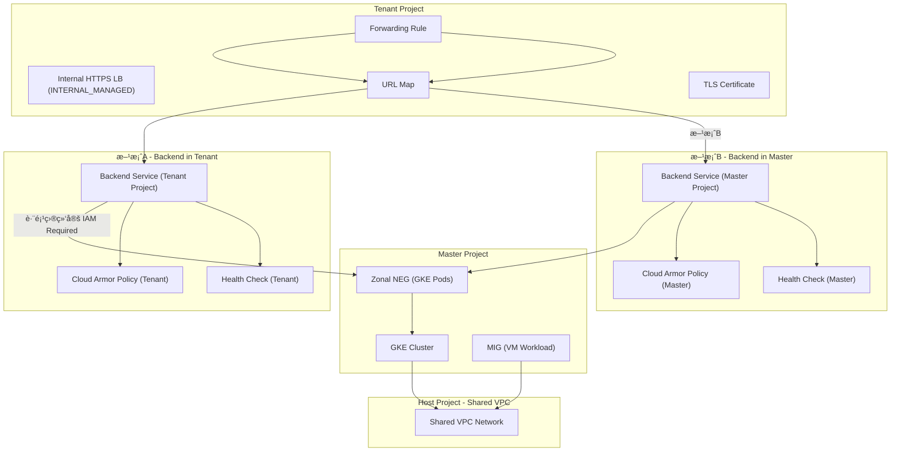
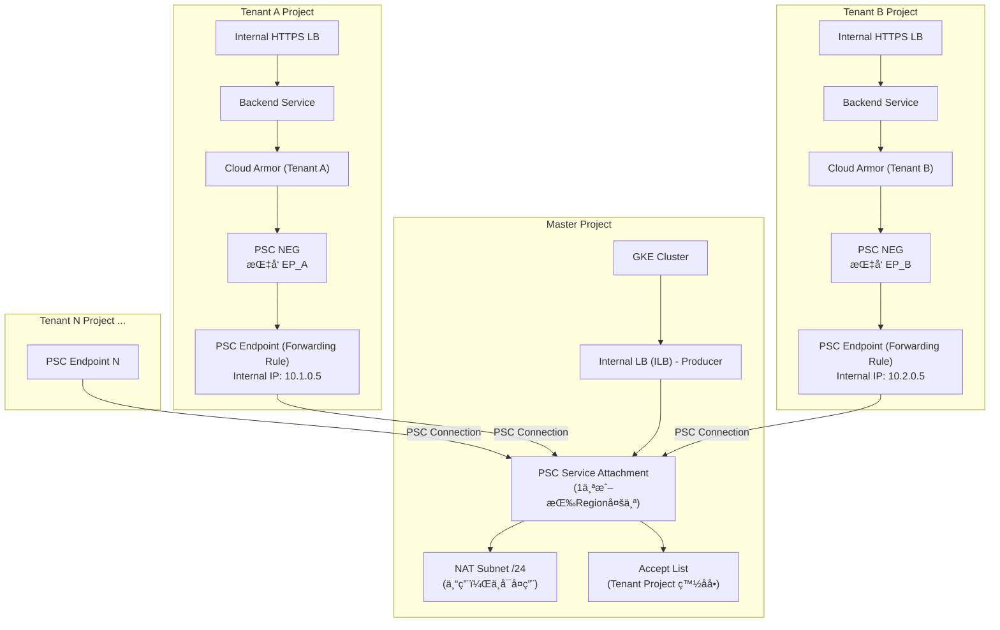
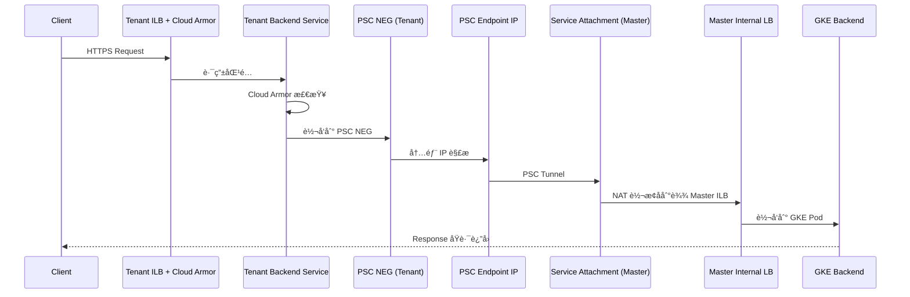
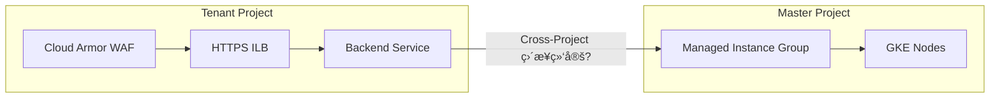
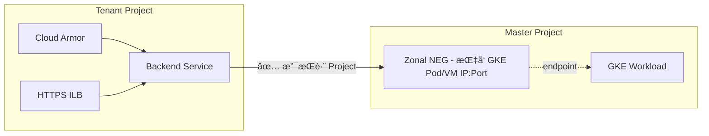
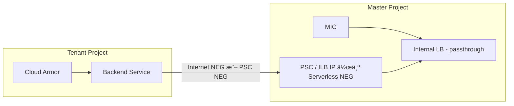
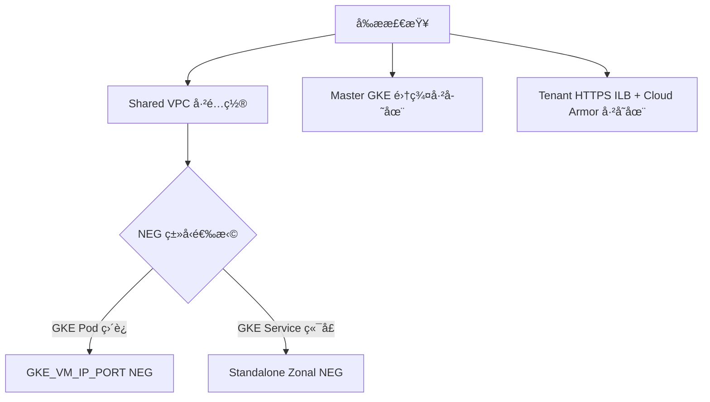
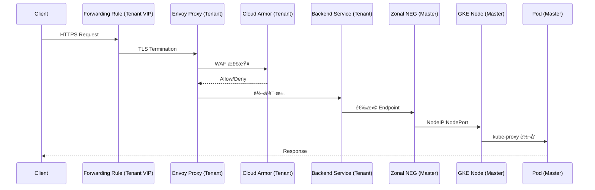

你帮我å»æ¢ç´¢ 主题
在 Shared VPC ç¯å¢ƒä¸‹ Internal HTTPS Load Balancer 跨项目绑定 Backend çš„å¯è¡Œæ€§ç¡®è®¤
⸻
背景说æ˜
我们正在 Google Cloud 上设计一个多租户æ¶æ„，希望确认跨项目 Backend 绑定的官方支æŒæ–¹å¼ã€‚
当å‰æ¶æ„
	•	Tenant 项目 主è¦æ˜¯æƒ³è¦ç”¨æˆ·æ§åˆ¶è‡ªå·±çš„å…¥å£ ç»‘å®šè‡ªå·±å¯¹åº”çš„è§„åˆ™ 比如说其对应的cloud armor 规则的改动，ä¸ä¼šå½±å“我们其他的用户也å¯ä»¥æ”¯æŒè‡ªå·±çš„独立机会 安全éšæ‚£åˆ†æ‘Šåˆ°tenant
	•	Internal HTTPS Load Balancer（INTERNAL_MANAGED）
	•	URL Map + Routing Rules
	•	Backend Service（归 Tenant 项目所有）
	•	Cloud Armor 绑定在 Backend Service 上
	•	TLS è¯ä¹¦åœ¨ Tenant 项目中管ç†
	•	Master 项目 这个也是我们平å°æ–¹åšä¸€ä¸ªæ ¸å¿ƒæ¥æ供一些对应的GKE
	•	Managed Instance Group（MIG） GKE  neg
	•	è¿è¡Œ Compute Engine VM 工作负载 vm 通过一定的方å¼æ¥æš´éœ²æˆ‘们的GKE
	•	两个项目已挂载在åŒä¸€ä¸ª Shared VPC（åŒä¸€ Host Project + åŒä¸€ VPC）
⸻

目标æ¶æ„

我们希望：
	•	ä¿æŒ Internal HTTPS LB å’Œ Backend Service 在 Tenant 项目
                       我们已ç»å®ç°äº†ï¼Œé€šè¿‡ä¿®æ”¹tenant ilb å¯ä»¥ç»‘定到cross project到masterçš„ backend service .当然虽然这个已ç»å®ç°äº†ï¼Œ 我们也å¯ä»¥é’ˆå¯¹æ¯ä¸ªtalent过æ¥çš„用户创建自己对应的backend service 但是我å¯èƒ½è¿˜è¦è¯„估一下对应的工程的æˆæƒæƒ…况è¦åšå®‰å…¨è¯„估，ç°åœ¨åªæ˜¯å®ç°äº†è®¿é—®
                        放在tenant好åƒå¿…须得给tenant projectçš„sa compuer.instanseçš„adm
	•	将 Tenant 项目的 Backend Service 绑定到 Master 项目中的 MIG 或者neg GKE
	•	Cloud Armor ä¾ç„¶åœ¨ Tenant 项目侧生效
	•	通过 Shared VPC å®ç°è·¨é¡¹ç›®ç½‘络共享

希望确认的问题
	1.	在 Shared VPC æ¡ä»¶ä¸‹ï¼ŒBackend Service（Project A）绑定 MIG（Project B）是å¦å±äºå®˜æ–¹æ”¯æŒæ¶æ„？
	2.	是å¦å­˜åœ¨ä»¥ä¸‹æ–¹é¢çš„é™åˆ¶æˆ–最佳å®è·µï¼š
	•	跨项目 IAM æƒé™è¦æ±‚
	•	Health Check çš„å½’å±å’Œå¯è§æ€§
	•	Backend 生命周期管ç†å½±å“
	•	Region é™åˆ¶
	3.	在生产ç¯å¢ƒä¸­æ˜¯å¦å­˜åœ¨å·²çŸ¥é£é™©æˆ–边界情况？
	4.	ä» Google æ¨èæ¶æ„角度，是å¦æ›´æ¨è：
	•	跨项目 MIG 绑定 以åŠè¯¥æ–¹æ¡ˆæ˜¯å¦å¯è¡Œï¼Ÿ
	•	跨项目 NEG 绑定以åŠè¯¥æ–¹æ¡ˆæ˜¯å¦å¯è¡Œï¼Ÿ
	•	或使用 Private Service Connect å®ç°æ›´å¼ºéš”离
如æœè¿™ç§æ–¹æ¡ˆå¯è¡Œçš„è¯ï¼Œæˆ‘们还需è¦è€ƒè™‘一下一些安全的设置，或者是对应工程æˆæƒçš„一些问题以åŠå¯¹åº”的一些计费åŸåˆ™ï¼Œæˆ‘们想对tenant的用户进行独立计费，也è¦è€ƒè™‘计费的方便性
我们希望在进入生产ç¯å¢ƒå‰ç¡®è®¤è¯¥è®¾è®¡ç¬¦åˆ Google Cloud 官方支æŒçš„æ¶æ„模å¼ã€‚
所以我希望你至äºä¸Šé¢çš„这个背景，我å»æ¢ç´¢ä¸€ä¸‹æ˜¯å¦èƒ½å¤Ÿå®ç°
ç›®å‰æœ‰ä¸¤ç§æ¶æ„å®ç°æ–¹æ¡ˆå¯ä¾›è¯„估：
方案一是将 Backend Server 部署在 Talent 项目中；方案二（å³æˆ‘当å‰çš„å®ç°ï¼‰æ˜¯å°† Backend Server ç›´æ¥éƒ¨ç½²åœ¨ Master 项目下。方案 B ä¸æ˜¯â€œå…±ç”¨ä¸€ä¸ª Backend Serviceâ€ï¼Œè€Œæ˜¯â€œæ¯ä¸ª Tenant 一个 Backend Service，但都在 Master 项目â€ã€‚
除了安全性之外，我é‡ç‚¹å…³æ³¨æƒé™ç®¡æ§ï¼ˆAuthorization）ä¸è®¡è´¹æ¶æ„（Billing）。
若采用全é‡éƒ¨ç½²åœ¨ Master 项目的方案，所有 Cloud Armor 的计费费用将由 Master 项目承担。且由äºæˆ‘需è¦åœ¨ Master 项目中创建多个ä¸åŒçš„ Backend Server，å„æœåŠ¡çš„计费维度也需è¦åšè¿›ä¸€æ­¥çš„拆分。


# Shared VPC 跨项目 Internal HTTPS LB 绑定 Backend å¯è¡Œæ€§åˆ†æ

## 🔠问题分æ

核心问题是在 Shared VPC ç¯å¢ƒä¸‹ï¼Œè¯„估两ç§æ¶æ„方案的**å¯è¡Œæ€§ã€æƒé™æ¨¡å‹ã€è®¡è´¹æ‹†åˆ†**：

- **方案 A**：Backend Service 在 Tenant 项目，绑定 Master 项目的 MIG/NEG（跨项目 Backend 绑定）
- **方案 B**：Backend Service 在 Master 项目，æ¯ä¸ª Tenant 独立一个 Backend Service（当å‰å·²å®ç°ï¼‰

---

## 🛠 å¯è¡Œæ€§ç¡®è®¤

### 方案 A：Backend Service（Tenant）→ MIG/NEG（Master）跨项目绑定

#### ✅ MIG 跨项目绑定

| 维度 | 结论 |
|------|------|
| å®˜æ–¹æ”¯æŒ | **有é™æ”¯æŒ**，需 Shared VPC 且满足 IAM æ¡ä»¶ |
| 网络层 | Shared VPC åŒ VPC 网络下 **å¯è¾¾** |
| GCP API 层 | Backend Service 引用跨项目 MIG 需è¦æ˜¾å¼ IAM æˆæƒ |
| Health Check | **å¿…é¡»ä¸ Backend Service åŒé¡¹ç›®**，或æ˜ç¡®æˆæƒ |

**关键 IAM æˆæƒè¦æ±‚（方案 A MIG）**：

```bash
# Tenant 项目的 Cloud Load Balancing Service Agent 需è¦è®¿é—® Master 项目的 MIG
# 在 Master 项目æˆæƒ
gcloud projects add-iam-policy-binding <MASTER_PROJECT_ID> \
  --member="serviceAccount:service-<TENANT_PROJECT_NUMBER>@compute-system.iam.gserviceaccount.com" \
  --role="roles/compute.networkViewer"

# åŒæ—¶éœ€è¦æˆæƒè®¿é—® MIG
gcloud compute instance-groups managed add-iam-policy-binding <MIG_NAME> \
  --region=<REGION> \
  --member="serviceAccount:service-<TENANT_PROJECT_NUMBER>@compute-system.iam.gserviceaccount.com" \
  --role="roles/compute.viewer" \
  --project=<MASTER_PROJECT_ID>
```

#### ✅ NEG（GKE）跨项目绑定

| NEG ç±»å‹ | è·¨é¡¹ç›®æ”¯æŒ | è¯´æ˜ |
|----------|-----------|------|
| Zonal NEG | âš ï¸ å—é™ | éœ€è¦ Shared VPC + 特定 IAM |
| Serverless NEG | ⌠ä¸æ”¯æŒè·¨é¡¹ç›® | åŒé¡¹ç›®é™åˆ¶ |
| Internet NEG | ⌠ä¸é€‚用 | 外部场景 |
| **PSC NEG** | ✅ æ¨è | 通过 Private Service Connect å®ç°å¼ºéš”离 |

---

### 方案 B：Backend Service 全在 Master 项目（当å‰å®ç°ï¼‰

```
✅ 完全官方支æŒï¼Œæ— è·¨é¡¹ç›® API 绑定问题
âš ï¸ æƒé™é—®é¢˜ï¼šTenant 需è¦ä¿®æ”¹è‡ªå·± ILB çš„ URL Map æŒ‡å‘ Master çš„ Backend Service
âš ï¸ è®¡è´¹é—®é¢˜ï¼šCloud Armor 费用全归 Master 项目
```

---

## 📊 两ç§æ–¹æ¡ˆæ¶æ„对比



---

## 💳 计费æ¶æ„分æ

### 方案 A（Tenant 拥有 Backend Service）

| 费用项 | å½’å± | è¯´æ˜ |
|--------|------|------|
| ILB Forwarding Rule | Tenant 项目 | 按规则数计费 |
| Backend Service | Tenant 项目 | å…费资æºå¯¹è±¡ |
| **Cloud Armor** | **Tenant 项目** | ✅ 天然隔离，Tenant 自行承担 |
| 出站æµé‡ | Shared VPC Host | å–决äºæµé‡è·¯å¾„ |
| Health Check | Tenant 项目 | 按æ¢æµ‹æ¬¡æ•°è®¡è´¹ |

### 方案 B（Backend Service 全在 Master）

| 费用项 | å½’å± | 问题 |
|--------|------|------|
| ILB Forwarding Rule | Tenant 项目 | ✅ 独立 |
| **Cloud Armor** | **Master 项目** | ⌠无法直æ¥æ‹†åˆ†è´¦å•åˆ° Tenant |
| Backend Service | Master 项目 | æ··åˆåœ¨ä¸€èµ· |

**方案 B 计费拆分补救方案**：

```bash
# 通过 Labels 打标，å†ç”¨ Billing Export 到 BigQuery 进行费用归因
gcloud compute backend-services update <BS_NAME_FOR_TENANT_X> \
  --global \
  --update-labels tenant=tenant-x,env=prod,cost-center=tenant-x-billing \
  --project=<MASTER_PROJECT_ID>

# BigQuery 查询示例（billing export 表）
# SELECT labels.value as tenant, SUM(cost) as total_cost
# FROM `billing_dataset.gcp_billing_export`
# WHERE labels.key = 'tenant'
# GROUP BY tenant
```

> âš ï¸ Labels 计费拆分是 **软性拆分**，无法在 GCP Console è´¦å•é¡µç›´æ¥ä½“ç°åˆ° Tenant 项目，需è¦é€šè¿‡ BigQuery Billing Export 二次分æ。

---

## 🔠æƒé™ç®¡æ§ï¼ˆAuthorization）关键差异

### 方案 A æƒé™çŸ©é˜µ

| æ“作 | 执行方 | 所需æƒé™ | é£é™© |
|------|--------|----------|------|
| 修改 Cloud Armor | Tenant SA | `compute.securityPolicies.*`（Tenant 项目） | ✅ ä½ï¼Œç§Ÿæˆ·è‡ªæ²» |
| 绑定跨项目 MIG | Tenant SA | `compute.instanceGroups.use`（Master 项目） | âš ï¸ éœ€è¦ç²¾ç¡®æˆæƒ |
| 修改 Health Check | Tenant SA | `compute.healthChecks.*`（Tenant 项目） | ✅ ä½ |
| 删除 Backend Service | Tenant SA | éœ€é˜²æ­¢è¯¯åˆ å½±å“ LB | âš ï¸ éœ€ OrgPolicy ä¿æŠ¤ |

```bash
# 方案A：在 Master 项目给 Tenant SA 最å°æƒé™ï¼ˆä»…å…许 use MIG，ä¸å…许 delete）
gcloud projects add-iam-policy-binding <MASTER_PROJECT_ID> \
  --member="serviceAccount:<TENANT_SA>@<TENANT_PROJECT>.iam.gserviceaccount.com" \
  --role="roles/compute.viewer"

# 自定义 Role ä»…æˆäºˆ use æƒé™
gcloud iam roles create tenantMigUser \
  --project=<MASTER_PROJECT_ID> \
  --permissions="compute.instanceGroups.use,compute.instanceGroups.get"
```

### 方案 B æƒé™çŸ©é˜µ

| æ“作 | 执行方 | é£é™© |
|------|--------|------|
| 修改 Cloud Armor | Master SA / Platform Team | ⌠Tenant 无法自主修改，需通过平å°æ¥å£ |
| 修改 URL Map | Tenant SA | âš ï¸ éœ€æˆäºˆ Tenant 对 Master 项目 URLMap 的写æƒé™ |
| 隔离性 | — | ⌠一个 SA 误æ“作å¯èƒ½å½±å“多 Tenant |

---

## 📋 三ç§æ–¹æ¡ˆæ¨ªå‘å¯¹æ¯”ï¼ˆå« PSC）

| 维度 | 方案A：跨项目 Backend | 方案B：Master 统一 Backend | 方案C：PSC 隔离 |
|------|----------------------|--------------------------|----------------|
| 官方支æŒåº¦ | âš ï¸ æœ‰é™æ”¯æŒï¼Œéœ€ IAM é…ç½® | ✅ å®Œå…¨æ”¯æŒ | ✅ å®Œå…¨æ”¯æŒ |
| Cloud Armor å½’å± | ✅ Tenant 独立 | ⌠Master 统一 | ✅ Tenant 独立 |
| 计费天然隔离 | ✅ 按项目自然隔离 | ⌠需 Label + BigQuery | ✅ 按项目自然隔离 |
| Tenant 自治能力 | ✅ 高 | âš ï¸ ä½ï¼Œä¾èµ–å¹³å° | ✅ 高 |
| å®ç°å¤æ‚度 | âš ï¸ ä¸­ï¼ˆIAM é…ç½®å¤æ‚） | ✅ ä½ï¼ˆå·²å®ç°ï¼‰ | ⌠高（需 PSC é…置） |
| 网络安全隔离 | âš ï¸ ä¸­ï¼ˆåŒ VPC） | âš ï¸ ä¸­ï¼ˆåŒ VPC） | ✅ 强（æœåŠ¡è¾¹ç•Œéš”离） |
| 跨项目 MIG 绑定 | âš ï¸ æ”¯æŒä½†éä¸»æµ | N/A | N/A |
| 跨项目 GKE NEG 绑定 | âš ï¸ å—é™ | N/A | ✅ via PSC NEG |

---

## âš ï¸ ç”Ÿäº§ç¯å¢ƒå·²çŸ¥é£é™©

### 方案 A é£é™©ç‚¹

1. **Health Check 跨项目å¯è§æ€§**：Health Check å¿…é¡»ä¸ Backend Service **åŒé¡¹ç›®**，无法直æ¥æ¢æµ‹è·¨é¡¹ç›® MIG çš„ç§æœ‰ IP（需确认 Firewall 规则放行 `35.191.0.0/16` å’Œ `130.211.0.0/22` 到 Master 项目 VM）

```bash
# Master 项目必须放行 GCP Health Check æ¢é’ˆæº IP
gcloud compute firewall-rules create allow-health-check-from-tenant-lb \
  --network=<SHARED_VPC_NETWORK> \
  --action=ALLOW \
  --rules=tcp:<BACKEND_PORT> \
  --source-ranges=35.191.0.0/16,130.211.0.0/22 \
  --project=<MASTER_PROJECT_ID>
```

2. **跨项目 NEG 绑定 GKE**：GKE NEG 通常åªèƒ½è¢«**åŒé¡¹ç›®**çš„ Backend Service ç›´æ¥å¼•ç”¨ï¼Œè·¨é¡¹ç›®å¼•ç”¨éœ€è¦é€šè¿‡ **PSC** 或者将 NEG 创建动作委托给 Master 项目

3. **Tenant SA éœ€è¦ `compute.instances.admin`**：你æ到已å‘ç°è¿™ä¸ªé—®é¢˜ï¼Œè¿™ä¸ªæƒé™è¿‡å¤§ï¼Œåº”通过**自定义 Role** 缩å°æƒé™é¢

### 方案 B é£é™©ç‚¹

1. Master 项目 SA 误æ“作影å“范围扩大
2. Cloud Armor 规则å˜æ›´éœ€è¦å¹³å°å›¢é˜Ÿä»‹å…¥ï¼ŒTenant 自治性差
3. 计费无法在项目维度自然拆分

---

## 🆠æ¨è结论

```
短期（已å®ç°æ–¹æ¡ˆ B）：
  → 通过 Label + Billing Export BigQuery å®ç°è½¯æ€§è®¡è´¹æ‹†åˆ†
  → 为æ¯ä¸ª Tenant çš„ Backend Service 统一打 tenant=xxx 标签
  → 用自定义 IAM Role 收紧 Tenant 对 Master 项目的æ“作æƒé™

中期（演进到方案 A）：
  → 使用 Shared VPC + 跨项目 MIG 绑定（é…åˆç²¾ç¡® IAM Custom Role）
  → Health Check 放在 Tenant 项目，Firewall 规则在 Master 项目放行
  → Cloud Armor 计费天然归 Tenant 项目

长期（规模化多租户）：
  → 考虑 Private Service Connect（PSC）
  → Master 项目å‘布 PSC Service Attachment
  → Tenant 项目通过 PSC NEG æ¥å…¥ï¼Œå®ç°æœåŠ¡è¾¹ç•Œçº§éš”离
  → 完全解耦两个项目的生命周期ä¾èµ–
```

---

## 🔧 方案 A è½åœ°æœ€å° IAM é…ç½®å‚考

```bash
# 1. 创建自定义 Role（Master 项目），仅å…许 Tenant 引用 MIG/NEG，ä¸å…许删除
gcloud iam roles create crossProjectBackendUser \
  --project=<MASTER_PROJECT_ID> \
  --title="Cross Project Backend User" \
  --permissions="compute.instanceGroups.use,compute.instanceGroups.get,compute.networkEndpointGroups.use,compute.networkEndpointGroups.get,compute.instances.get"

# 2. æˆæƒ Tenant 项目的 LB Service Agent
gcloud projects add-iam-policy-binding <MASTER_PROJECT_ID> \
  --member="serviceAccount:service-<TENANT_PROJECT_NUMBER>@compute-system.iam.gserviceaccount.com" \
  --role="projects/<MASTER_PROJECT_ID>/roles/crossProjectBackendUser"

# 3. åŒæ—¶æˆæƒ compute.networkViewer 以便 LB 解æ Shared VPC 网络
gcloud projects add-iam-policy-binding <MASTER_PROJECT_ID> \
  --member="serviceAccount:service-<TENANT_PROJECT_NUMBER>@compute-system.iam.gserviceaccount.com" \
  --role="roles/compute.networkViewer"
```

---

**核心结论**：
- 方案 A（Tenant 拥有 Backend + 跨项目 MIG）**技术å¯è¡Œä½† IAM é…ç½®å¤æ‚**，Cloud Armor 和计费天然隔离，是长期æ¨èæ–¹å‘
- 方案 B（当å‰å®ç°ï¼‰**工程最简å•**，但计费和æƒé™éš”离需è¦é¢å¤–工程ä¿éšœ
- 如æœä½ çš„核心诉求是 **Tenant 独立计费 + Cloud Armor 自治**，应优先æ¨è¿›æ–¹æ¡ˆ A 或 PSC 方案

# PSC 大规模多租户å¯è¡Œæ€§åˆ†æä¸è½åœ°æŒ‡å—

## 🔠问题分æ

核心评估维度：
1. PSC 的网络/IP/Quota é™åˆ¶
2. 100+ Tenant è¿æ¥å•ä¸€ Master çš„å¯è¡Œæ€§
3. 具体è½åœ°æ“作步骤

---

## 📊 PSC 核心é™åˆ¶é€ŸæŸ¥

### Quota & 规模é™åˆ¶

| é™åˆ¶é¡¹ | 默认值 | 是å¦å¯ç”³è¯·æå‡ | 100 Tenant å½±å“ |
|--------|--------|---------------|----------------|
| PSC Endpoints per VPC | 20 | ✅ å¯æå‡ | **æ¯ä¸ª Tenant VPC 消耗 1 个** → 需确认æ¯ä¸ª Tenant VPC é…é¢ |
| PSC Service Attachments per Region | 20 | ✅ å¯æå‡ | **Master 侧消耗**，100 Tenant 共用 1 个 SA å³å¯ |
| NAT Subnets per Service Attachment | 10 | ✅ å¯æå‡ | Master 侧 NAT å­ç½‘规划关键项 |
| Consumer Connections per Service Attachment | **250** | ✅ å¯æå‡ | ✅ 100 Tenant 默认å¯æ»¡è¶³ |
| Forwarding Rules per Project | 15（内部） | ✅ å¯æå‡ | æ¯ä¸ª Tenant 消耗 1 个 PSC Endpoint（Forwarding Rule） |

> **关键结论**：100 Tenant è¿æ¥ 1 个 Master PSC Service Attachment，**默认 Quota 250 Consumer Connections 已够用**，但需è¦å…³æ³¨æ¯ä¸ª Tenant 项目的 Forwarding Rule é…é¢ã€‚

---

### IP 地å€è§„划é™åˆ¶

```
PSC Endpoint（Consumer 侧）：
  - æ¯ä¸ª Tenant é¡¹ç›®éœ€è¦ 1 个 Internal IP（æ¥è‡ª Tenant çš„å­ç½‘）
  - IP ç”± Tenant 自行管ç†ï¼Œä¸æ¶ˆè€— Master çš„ IP 空间
  - ✅ 完全独立，互ä¸å½±å“

PSC NAT Subnet（Producer/Master 侧）：
  - 需è¦ä¸“用 NAT å­ç½‘，ä¸ä¸šåŠ¡å­ç½‘严格隔离
  - æ¯ä¸ª NAT å­ç½‘支æŒçš„并å‘è¿æ¥æ•° = å­ç½‘ IP æ•°é‡ Ã— 64000 端å£
  - æ¨è：/24 å­ç½‘（254 IP × 64000 = ~1600 万并å‘è¿æ¥ï¼‰
  - âš ï¸ NAT å­ç½‘ä¸èƒ½ç”¨äºå…¶ä»– VM 或æœåŠ¡
```

**NAT Subnet 容é‡è§„划**：

| å­ç½‘å¤§å° | å¯ç”¨ IP | 最大并å‘è¿æ¥ | 适用 Tenant 规模 |
|----------|---------|------------|----------------|
| /28 | 11 | ~700K | < 20 Tenant |
| /24 | 254 | ~16M | 100~500 Tenant ✅ |
| /22 | 1022 | ~65M | 1000+ Tenant |

---

## 📠100 Tenant PSC æ¶æ„设计



---

## 🛠 详细æ“作步骤

### Step 1：Master 项目 - 创建 NAT 专用å­ç½‘

```bash
# NAT å­ç½‘必须专用，purpose=PRIVATE_SERVICE_CONNECT
gcloud compute networks subnets create psc-nat-subnet \
  --network=<SHARED_VPC_OR_MASTER_VPC> \
  --region=<REGION> \
  --range=10.100.0.0/24 \
  --purpose=PRIVATE_SERVICE_CONNECT \
  --project=<MASTER_PROJECT_ID>

# 验è¯
gcloud compute networks subnets describe psc-nat-subnet \
  --region=<REGION> \
  --project=<MASTER_PROJECT_ID> \
  --format="value(purpose)"
# 期望输出: PRIVATE_SERVICE_CONNECT
```

### Step 2：Master 项目 - 创建 Producer 侧 Internal LB

```bash
# 2.1 创建 Health Check
gcloud compute health-checks create http gke-backend-hc \
  --port=8080 \
  --request-path=/healthz \
  --region=<REGION> \
  --project=<MASTER_PROJECT_ID>

# 2.2 创建 Backend Serviceï¼ˆæŒ‡å‘ GKE NEG）
gcloud compute backend-services create gke-producer-bs \
  --load-balancing-scheme=INTERNAL_MANAGED \
  --protocol=HTTP \
  --region=<REGION> \
  --health-checks=gke-backend-hc \
  --health-checks-region=<REGION> \
  --project=<MASTER_PROJECT_ID>

# 2.3 添加 GKE NEG 到 Backend Service
gcloud compute backend-services add-backend gke-producer-bs \
  --network-endpoint-group=<GKE_NEG_NAME> \
  --network-endpoint-group-zone=<ZONE> \
  --region=<REGION> \
  --project=<MASTER_PROJECT_ID>

# 2.4 创建 URL Map
gcloud compute url-maps create gke-producer-urlmap \
  --default-service=gke-producer-bs \
  --region=<REGION> \
  --project=<MASTER_PROJECT_ID>

# 2.5 创建 Target HTTP Proxy
gcloud compute target-http-proxies create gke-producer-proxy \
  --url-map=gke-producer-urlmap \
  --region=<REGION> \
  --project=<MASTER_PROJECT_ID>

# 2.6 创建 Forwarding Rule（ILB，仅内部，ä¸æš´éœ²å¤–部）
gcloud compute forwarding-rules create gke-producer-ilb \
  --load-balancing-scheme=INTERNAL_MANAGED \
  --network=<VPC_NETWORK> \
  --subnet=<BACKEND_SUBNET> \
  --address=<RESERVED_INTERNAL_IP> \
  --region=<REGION> \
  --target-http-proxy=gke-producer-proxy \
  --target-http-proxy-region=<REGION> \
  --ports=80 \
  --project=<MASTER_PROJECT_ID>
```

### Step 3：Master 项目 - 创建 PSC Service Attachment

```bash
# 关键å‚数说æ˜ï¼š
# --nat-subnets: 上é¢åˆ›å»ºçš„专用 NAT å­ç½‘
# --connection-preference: ACCEPT_MANUAL 手动审批（æ¨è，安全å¯æ§ï¼‰
# --consumer-accept-list: 预填写已知 Tenant 项目，åç»­å¯åŠ¨æ€æ·»åŠ 

gcloud compute service-attachments create gke-psc-service-attachment \
  --region=<REGION> \
  --producer-forwarding-rule=gke-producer-ilb \
  --connection-preference=ACCEPT_MANUAL \
  --nat-subnets=psc-nat-subnet \
  --consumer-accept-list=<TENANT_PROJECT_1>=10,<TENANT_PROJECT_2>=10 \
  --project=<MASTER_PROJECT_ID>

# è·å– Service Attachment URI（åç»­ Tenant 需è¦ç”¨åˆ°ï¼‰
gcloud compute service-attachments describe gke-psc-service-attachment \
  --region=<REGION> \
  --project=<MASTER_PROJECT_ID> \
  --format="value(selfLink)"
# 输出示例: projects/master-project/regions/us-central1/serviceAttachments/gke-psc-service-attachment
```

### Step 4：动æ€æ·»åŠ æ–° Tenant 到白åå•

```bash
# æ¯å½“æ–°å¢ä¸€ä¸ª Tenant，执行此æ“作
TENANT_PROJECT_ID="new-tenant-project-id"

gcloud compute service-attachments update gke-psc-service-attachment \
  --region=<REGION> \
  --add-consumer-accept-list=${TENANT_PROJECT_ID}=10 \
  --project=<MASTER_PROJECT_ID>

# æŸ¥çœ‹å½“å‰ Accept List
gcloud compute service-attachments describe gke-psc-service-attachment \
  --region=<REGION> \
  --project=<MASTER_PROJECT_ID> \
  --format="json(consumerAcceptLists)"
```

### Step 5：Tenant 项目 - 创建 PSC Endpoint

```bash
# 在æ¯ä¸ª Tenant 项目执行（å¯è‡ªåŠ¨åŒ–/Terraform 模æ¿åŒ–）
SA_URI="projects/<MASTER_PROJECT_ID>/regions/<REGION>/serviceAttachments/gke-psc-service-attachment"

# 5.1 预留内部 IP（PSC Endpoint IP）
gcloud compute addresses create psc-endpoint-ip \
  --region=<REGION> \
  --subnet=<TENANT_SUBNET> \
  --project=<TENANT_PROJECT_ID>

# è·å– IP
PSC_EP_IP=$(gcloud compute addresses describe psc-endpoint-ip \
  --region=<REGION> \
  --project=<TENANT_PROJECT_ID> \
  --format="value(address)")

# 5.2 创建 PSC Endpoint（Forwarding Rule æŒ‡å‘ SA）
gcloud compute forwarding-rules create psc-endpoint-to-master \
  --region=<REGION> \
  --network=<TENANT_VPC> \
  --address=psc-endpoint-ip \
  --target-service-attachment=${SA_URI} \
  --project=<TENANT_PROJECT_ID>

echo "PSC Endpoint IP: ${PSC_EP_IP}"
```

### Step 6：Master 项目 - 审批 PSC è¿æ¥è¯·æ±‚

```bash
# 查看待审批的è¿æ¥
gcloud compute service-attachments describe gke-psc-service-attachment \
  --region=<REGION> \
  --project=<MASTER_PROJECT_ID> \
  --format="json(connectedEndpoints)"

# 审批指定è¿æ¥ï¼ˆå– connectedEndpoints 中的 pscConnectionId）
gcloud compute service-attachments accept-psc-connections \
  gke-psc-service-attachment \
  --region=<REGION> \
  --consumer-forwarding-rules=projects/<TENANT_PROJECT>/regions/<REGION>/forwardingRules/psc-endpoint-to-master \
  --project=<MASTER_PROJECT_ID>
```

### Step 7：Tenant 项目 - 创建 PSC NEG 并绑定到 Backend Service

```bash
# 7.1 创建 PSC NEGï¼ˆæŒ‡å‘ PSC Endpoint IP）
gcloud compute network-endpoint-groups create psc-neg \
  --network-endpoint-type=PRIVATE_SERVICE_CONNECT \
  --psc-target-service=${SA_URI} \
  --network=<TENANT_VPC> \
  --subnet=<TENANT_SUBNET> \
  --region=<REGION> \
  --project=<TENANT_PROJECT_ID>

# 7.2 创建 Tenant 侧 Backend Service
gcloud compute backend-services create tenant-backend-service \
  --load-balancing-scheme=INTERNAL_MANAGED \
  --protocol=HTTPS \
  --region=<REGION> \
  --no-health-checks \
  --project=<TENANT_PROJECT_ID>

# 7.3 添加 PSC NEG 到 Backend Service
gcloud compute backend-services add-backend tenant-backend-service \
  --network-endpoint-group=psc-neg \
  --network-endpoint-group-region=<REGION> \
  --region=<REGION> \
  --project=<TENANT_PROJECT_ID>

# 7.4 绑定 Cloud Armor（Tenant 自主管ç†ï¼‰
gcloud compute backend-services update tenant-backend-service \
  --security-policy=<TENANT_CLOUD_ARMOR_POLICY> \
  --region=<REGION> \
  --project=<TENANT_PROJECT_ID>
```

---

## 🔄 完整è¿æ¥æµç¨‹



---

## 🤖 100 Tenant 自动化 Onboarding 脚本模æ¿

```bash
#!/bin/bash
# onboard_tenant_psc.sh - æ–° Tenant PSC æ¥å…¥è‡ªåŠ¨åŒ–

set -euo pipefail

MASTER_PROJECT="<MASTER_PROJECT_ID>"
REGION="<REGION>"
SA_NAME="gke-psc-service-attachment"
SA_URI="projects/${MASTER_PROJECT}/regions/${REGION}/serviceAttachments/${SA_NAME}"

TENANT_PROJECT="$1"
TENANT_VPC="$2"
TENANT_SUBNET="$3"

echo "=== [1/4] 添加 Tenant 到 PSC Accept List ==="
gcloud compute service-attachments update ${SA_NAME} \
  --region=${REGION} \
  --add-consumer-accept-list=${TENANT_PROJECT}=10 \
  --project=${MASTER_PROJECT}

echo "=== [2/4] Tenant 侧创建 PSC Endpoint ==="
gcloud compute addresses create psc-endpoint-ip \
  --region=${REGION} \
  --subnet=${TENANT_SUBNET} \
  --project=${TENANT_PROJECT}

gcloud compute forwarding-rules create psc-endpoint-to-master \
  --region=${REGION} \
  --network=${TENANT_VPC} \
  --address=psc-endpoint-ip \
  --target-service-attachment=${SA_URI} \
  --project=${TENANT_PROJECT}

echo "=== [3/4] 等待è¿æ¥è¯·æ±‚并自动审批 ==="
sleep 10
gcloud compute service-attachments accept-psc-connections ${SA_NAME} \
  --region=${REGION} \
  --consumer-forwarding-rules=projects/${TENANT_PROJECT}/regions/${REGION}/forwardingRules/psc-endpoint-to-master \
  --project=${MASTER_PROJECT}

echo "=== [4/4] Tenant 侧创建 PSC NEG + Backend Service ==="
gcloud compute network-endpoint-groups create psc-neg \
  --network-endpoint-type=PRIVATE_SERVICE_CONNECT \
  --psc-target-service=${SA_URI} \
  --network=${TENANT_VPC} \
  --subnet=${TENANT_SUBNET} \
  --region=${REGION} \
  --project=${TENANT_PROJECT}

gcloud compute backend-services create tenant-backend-service \
  --load-balancing-scheme=INTERNAL_MANAGED \
  --protocol=HTTPS \
  --region=${REGION} \
  --no-health-checks \
  --project=${TENANT_PROJECT}

gcloud compute backend-services add-backend tenant-backend-service \
  --network-endpoint-group=psc-neg \
  --network-endpoint-group-region=${REGION} \
  --region=${REGION} \
  --project=${TENANT_PROJECT}

echo "✅ Tenant ${TENANT_PROJECT} PSC æ¥å…¥å®Œæˆ"
echo "   PSC Endpoint IP: $(gcloud compute addresses describe psc-endpoint-ip --region=${REGION} --project=${TENANT_PROJECT} --format='value(address)')"
```

---

## âš ï¸ æ³¨æ„事项ä¸ç”Ÿäº§å»ºè®®

### Quota æå‰ç”³è¯·æ¸…å•

```
Master 项目：
□ compute.serviceAttachments per region: 申请 10+（按 Region 多活需求）
â–¡ NAT subnet IP 容é‡ï¼šç¡®è®¤ /24 满足并å‘需求

æ¯ä¸ª Tenant 项目：
â–¡ compute.forwardingRules（internal）: 默认 15，100+ Tenant å„自消耗 1 个，通常够用
□ compute.addresses（internal）: 默认 200，充足
```

### 安全加固

```bash
# 1. Service Attachment 使用 ACCEPT_MANUAL，ç¦æ­¢ä»»æ„ Consumer æ¥å…¥
# 2. 为æ¯ä¸ª Tenant 设置独立的 connection limit（=10 防止滥用）
gcloud compute service-attachments update ${SA_NAME} \
  --region=${REGION} \
  --add-consumer-accept-list=${TENANT_PROJECT}=5 \  # 按需调整è¿æ¥ä¸Šé™
  --project=${MASTER_PROJECT}

# 3. Master ILB å‰ç½® Cloud Armor（平å°çº§é˜²æŠ¤ï¼‰
# 4. å¼€å¯ PSC è¿æ¥æ—¥å¿—审计
gcloud compute service-attachments update ${SA_NAME} \
  --region=${REGION} \
  --enable-proxy-protocol \
  --project=${MASTER_PROJECT}
```

### 已知边界情况

| 问题 | è¯´æ˜ |
|------|------|
| è·¨ Region | PSC Endpoint ä¸ SA å¿…é¡»**åŒ Region**，跨 Region 需在æ¯ä¸ª Region 独立部署 SA |
| IPv6 | PSC ç›®å‰ä»…æ”¯æŒ IPv4 |
| UDP | PSC ä¸æ”¯æŒ UDP，仅 TCP |
| è¿æ¥æ–­å¼€é‡è¿ | PSC è¿æ¥å»ºç«‹å，Consumer 端 IP 固定，Master 侧扩缩容对 Consumer é€æ˜ |
| Shared VPC Consumer | è‹¥ Tenant 使用 Shared VPC，PSC Endpoint 需创建在 Host Project çš„å­ç½‘ |

---

**最终æ¨è**：100 Tenant æ¥å…¥å•ä¸€ Master PSC Service Attachment **完全å¯è¡Œ**，默认 250 Consumer Connections é…é¢æ»¡è¶³éœ€æ±‚ï¼Œæ ¸å¿ƒå·¥ä½œåœ¨äº **NAT å­ç½‘ /24 规划** + **Tenant Onboarding 自动化脚本** + **æå‰ç”³è¯· Quota**。


# studio


针对你在 Shared VPC ç¯å¢ƒä¸‹è¿›è¡Œå¤šç§Ÿæˆ·æ¶æ„设计（Internal HTTPS LB 跨项目挂载åç«¯ï¼‰çš„ç–‘é—®ï¼ŒåŸºäº Google Cloud 官方最新的æ¶æ„支æŒå’Œç½‘络é™åˆ¶ï¼Œä»¥ä¸‹æ˜¯æ·±å…¥çš„æ¢ç´¢ç»“æœå’Œå¯è¡Œæ€§ç¡®è®¤ã€‚

### 1. 核心问题确认：Backend Service（Project A）绑定 MIG/NEG（Project B）是å¦å®˜æ–¹æ”¯æŒï¼Ÿ

**结论：官方ä¸æ”¯æŒè¿™ç§æ¶æ„æ–¹å‘。**

Google Cloud 官方文档中有æ˜ç¡®çš„硬性é™åˆ¶ï¼š
> **“对äºå®ä¾‹ç»„ (MIG) å’Œå¯ç”¨åŒºçº§ NEG (Zonal NEGs)，所有å端（Backend）都必须ä¸å端æœåŠ¡ (Backend Service) ä½äºåŒä¸€ä¸ªé¡¹ç›®å’ŒåŒä¸€ä¸ªåŒºåŸŸä¸­ã€‚â€**

è¿™æ„味ç€ï¼Œå¦‚æœä½ æƒ³å°†å端的 MIG 或 GKE NEG 放在 Master 项目，那么 **Backend Service 也必须强制建在 Master 项目**。因此，“方案一（将 Backend Service 放在 Tenant 项目中，直æ¥æŒ‡å‘ Master çš„ MIG/NEG）â€åœ¨åº•å±‚ API 层é¢æ˜¯æ— æ³•å®ç°çš„。

---

### 2. 方案二（当å‰å®ç°æ–¹æ¡ˆï¼‰çš„评估ä¸æœ€ä½³å®è·µ

你当å‰å®ç°çš„**方案二**（Frontend / URL Map 在 Tenant 项目 $\rightarrow$ Backend Service 在 Master 项目 $\rightarrow$ MIG 在 Master 项目），这在 GCP 中被称为 **Cross-project service referencing（跨项目æœåŠ¡å¼•ç”¨ï¼‰**。**这是官方完全支æŒå¹¶æ¨èçš„æ¶æ„模å¼**。

如æœä½ å†³å®šç»§ç»­æ²¿ç”¨æ­¤æ¶æ„，以下是相关的最佳å®è·µä¸é™åˆ¶ï¼š

*   **跨项目 IAM æƒé™ç®¡æ§ï¼ˆé常é‡è¦ï¼‰**：
    ä½ æ到“放在 tenant 好åƒå¿…须得给 tenant project çš„ sa compute.instances.adminâ€ã€‚**这是ä¸å®‰å…¨ä¸”ä¸éœ€è¦çš„**。
    在官方支æŒçš„“跨项目引用â€ä¸­ï¼Œä½ åªéœ€è¦èµ‹äºˆ Tenant 项目的负载å‡è¡¡ç®¡ç†å‘˜/æœåŠ¡è´¦å·åœ¨ç›®æ ‡ Backend Service（Master侧）上 **`roles/compute.loadBalancerServiceUser`（负载å‡è¡¡å™¨æœåŠ¡ç”¨æˆ·ï¼‰** çš„æƒé™å³å¯ã€‚这使得 Tenant åªèƒ½å°†æµé‡è·¯ç”±åˆ°è¯¥ Backend Service，而ç»å¯¹æ— æ³•ç®¡ç†æˆ–é‡å¯ Master 项目的底层虚机和 GKE。
*   **Health Check å½’å±ä¸å¯è§æ€§**：
    å¥åº·æ£€æŸ¥ï¼ˆHealth Checkï¼‰å¿…é¡»ä¸ Backend Service ä½äºåŒä¸€ä¸ªé¡¹ç›®ï¼ˆå³ Master 项目）。这æ„å‘³ç€ Tenant 侧无法在其 GCP Console 中直观地看到å端的å¥åº·çŠ¶æ€ï¼Œå‘生 `502 Bad Gateway` æ—¶æ’éšœä¾èµ–å¹³å°æ–¹ã€‚
*   **生命周期管ç†é™åˆ¶**：
    Tenant 销æ¯å…¶é¡¹ç›®æ—¶ï¼Œæ— æ³•è‡ªåŠ¨çº§è”删除 Master 项目中的 Backend Service。Master 侧必须建立完善的自动化å›æ”¶æœºåˆ¶ï¼Œé˜²æ­¢åƒµå°¸ Backend Service 长期消耗é…é¢ã€‚
*   **计费æ¶æ„痛点**：
    如你所忧虑的，因为 **Cloud Armor 必须绑定在 Backend Service 上**，而 Backend Service ä½äº Master 项目，这æ„味ç€**所有的 Cloud Armor 请求费用ã€DDoS 防护费用å‡ä¼šå‡ºåœ¨ Master 项目的账å•ä¸Š**。如æœä»…ä»…ä¾èµ– GCP åŸå§‹è´¦å•ï¼Œæ— æ³•åšåˆ°å¤šç§Ÿæˆ·ç›´æ¥åˆ†è´¦ã€‚

---

### 3. ä»å¤šç§Ÿæˆ·éš”离ã€æˆæƒä¸ç‹¬ç«‹è®¡è´¹è§’度，æ¨è何ç§æ¶æ„？

é¢å¯¹ä½ å¸Œæœ›**â€œç§Ÿæˆ·ç‹¬ç«‹ç®¡ç† Cloud Armor 并自担费用â€**以åŠ**“高度网络和æƒé™å®‰å…¨ç®¡æ§â€**的需求，å•çº¯çš„ Shared VPC 跨项目引用存在计费和耦åˆç¼ºé™·ã€‚

为此，**强烈æ¨è Google Cloud çš„ Private Service Connect (PSC) æ¶æ„模å¼ã€‚**

#### æ¨èæ–¹æ¡ˆï¼šåŸºäº PSC 的多租户æ¶æ„（Google 官方最æ¨èçš„ SaaS/多租户方案）
通过 Private Service Connect，你å¯ä»¥å°† Master 中的 GKE 或 MIG 打包å‘布为一个“内部æœåŠ¡â€ï¼Œä¾›å„ Tenant 消费：

1.  **Master 项目（æœåŠ¡æ供方）**：
    *   在 MIG/GKE å‰é¢éƒ¨ç½²ä¸€ä¸ª Internal Load Balancer（充当å‘布层）。
    *   通过创建 **Service Attachment** 将这个æœåŠ¡æš´éœ²å‡ºæ¥ã€‚此时ä¸éœ€è¦ç»™ä»»ä½• Tenant æˆäºˆåº•å±‚ Compute 相关的 IAM æƒé™ã€‚
2.  **Tenant 项目（æœåŠ¡æ¶ˆè´¹æ–¹ï¼‰**：
    *   在 Tenant 项目中创建 **PSC NEG（Private Service Connect NEG）**。这个 NEG ç›´æ¥æŒ‡å‘ Master 项目的 Service Attachment。
    *   **关键点æ¥äº†**：因为 PSC NEG å±äº Tenant 项目，所以 **Backend Service å°±å¯ä»¥åˆ›å»ºåœ¨ Tenant 项目中了ï¼**
    *   Tenant 项目的完整链路：Tenant 自己的 ILB $\rightarrow$ Tenant 自己的 Backend Service $\rightarrow$ Tenant 自己的 Cloud Armor $\rightarrow$ Tenant 自己的 PSC NEG $\rightarrow$ (PSC 魔法隧é“) $\rightarrow$ Master 项目的 GKE。

**采用 PSC æ¶æ„的核心优势：**
*   **完ç¾è§£å†³è®¡è´¹ç—›ç‚¹**：Backend Service å’Œ Cloud Armor 全部è½åœ¨äº† Tenant 项目内。GCP åŸç”Ÿå°±ä¼šå°†é’ˆå¯¹è¯¥å…¥å£çš„所有 Cloud Armor 防护费用ã€å®‰å…¨æ‰«æ费用和 Load Balancer æµé‡è´¹ç”¨ç²¾å‡†è®¡å…¥ Tenant 项目。
*   **æƒé™ç®¡æ§åšåˆ°æ致（Zero IAM Crossing）**：Master å’Œ Tenant 之间ä¸éœ€è¦è·¨é¡¹ç›®æˆäºˆä»»ä½• IAM 角色（甚至ä¸å†ä¾èµ– Shared VPC）。Tenant 的故障或æ¶æ„æ“作完全被隔离在 Tenant 项目边界内，彻底消除了越æƒéšæ‚£ã€‚
*   **扩展性**：æ¯ä¸ª Tenant å¯ä»¥ç‹¬ç«‹ç”³è¯·å±äºè‡ªå·±çš„ SSL è¯ä¹¦ã€è‡ªå®šä¹‰ URL Map 路由规则，éšæ„修改å±äºè‡ªå·±çš„ WAF æ‹¦æˆªç­–ç•¥ï¼Œè€Œæ— éœ€ä¸ Master å¹³å°æ–¹äº§ç”Ÿä»»ä½•è¿ç»´äº¤é›†ã€‚

### 总结建议

如æœä½ å¸Œæœ›å°½æ—©è¿›å…¥ç”Ÿäº§ç¯å¢ƒä¸”**预算å…许一定的开å‘改造**：
è¯·ç«‹åˆ»è¯„ä¼°å¹¶å‘ **Private Service Connect (PSC) NEG** 模å¼è½¬å‹ã€‚这是唯一能满足“Cloud Armor é…ç½®ä¸è®¡è´¹å®Œå…¨ä¸‹æ”¾ç»™ Tenantâ€ï¼ŒåŒæ—¶â€œå端é‡è´Ÿè½½å®Œå…¨å½’å± Masterâ€çš„ Google Cloud 官方最佳å®è·µã€‚

如æœä½ å†³å®š**ç»´æŒç°çŠ¶çš„方案 B（Cross-project referencing）**：
1.  æ”¶å› Tenant 项目对 Master 项目高å±çš„ `compute.instances.admin` æˆæƒï¼Œæ”¹ä¸ºä½¿ç”¨æœ€ä½æƒé™ç­–略的 `roles/compute.loadBalancerServiceUser`。
2.  为了解决计费问题，在通过 IaC（如 Terraform）为 Tenant 创建 Master 项目下的 Backend Service 时，必须打上 GCP èµ„æº Label（例如 `tenant: company-a`）。éšå通过将 GCP è´¦å•å¯¼å‡ºè‡³ BigQueryï¼ŒåŸºäº Label 按资æºç»´åº¦è¿›è¡ŒäºŒæ¬¡æˆæœ¬æ‘Šæ´¾ï¼ˆChargeback）。


针对你的问题，**结论是é常æ˜ç¡®çš„：这ä¸ä»…完全å¯è¡Œï¼Œè€Œä¸”是 Google Cloud 官方ã€ä»¥åŠå„大 SaaS å‚商（如 Elastic, Databricks, MongoDB 等）在 GCP 上å®ç°å¤šç§Ÿæˆ·äº’è”的“事å®æ ‡å‡†â€æ¶æ„。**

é¢å¯¹ 100 个甚至更多 Tenant è¿æ¥åˆ° 1 个 Master Project 的场景，Private Service Connect (PSC) 展ç°å‡ºäº†æ强的伸缩性和æ¶æ„优势。

以下是针对网络é™åˆ¶ã€IP 规划ã€é…é¢ï¼ˆQuota）以åŠå¤šç§Ÿæˆ·æ‰©å±•æ€§çš„深入分æ：

### 1. æ ¸å¿ƒç½‘ç»œä¸ IP é™åˆ¶ï¼ˆæ大简化了网络规划）

传统 VPC Peering 最大痛点是**ä¸å…许 IP 地å€å†²çª**，如æœæœ‰ 100 个 Tenant，管ç†ä¸é‡å çš„ IP 网段简直是ç¾éš¾ã€‚**PSC 完ç¾è§£å†³äº†è¿™ä¸ªé—®é¢˜ï¼Œå®ƒå…许所有 Tenant 甚至使用完全相åŒçš„ IP 网段。**

*   **Master 侧的 IP 消耗（PSC NAT Subnet）：**
    *   在 Master 项目中创建 Service Attachment 时，你需è¦ä¸ºå…¶åˆ†é…一个专用的 **PSC NAT å­ç½‘**。
    *   **消耗规则**：**1 个 Tenant çš„ PSC NEG è¿æ¥ï¼Œåªå ç”¨ Master NAT å­ç½‘中的 1 个 IP 地å€**。ä¸è®ºè¿™ä¸ª Tenant 背å有多少百万级的并å‘请求，都åªå  1 个 IP。
    *   **容é‡è§„划**：如æœä½ è§„划一个 `/24` çš„ PSC NAT å­ç½‘（å¯ç”¨ IP 约 252 个），就足以支撑 250 多个独立的 Tenant 项目è¿æ¥ã€‚如æœä½ æœ‰æ›´å¤šç§Ÿæˆ·ï¼Œåˆ†é…一个 `/22` å³å¯æ”¯æŒä¸Šåƒä¸ª Tenant。
*   **Tenant 侧的 IP 消耗：**
    *   Tenant 侧åªéœ€è¦æ­£å¸¸çš„ IP 资æºæ¥éƒ¨ç½²ä»–们自己的 Internal HTTPS LB，PSC NEG 本身几ä¹ä¸é¢å¤–å ç”¨å¤æ‚的路由 IP。

### 2. 核心 Quota (é…é¢) 考é‡

Google Cloud 对 PSC 有默认é…é¢ï¼Œä½†å¯¹äºâ€œå¤šå¯¹ä¸€â€çš„æ¶æ„，默认é…é¢é€šå¸¸å·²ç»è¶³å¤Ÿï¼Œä¸”å¯ä»¥é€šè¿‡æ交工å•è½»æ˜“æå‡ï¼š

*   **Master 侧é…é¢ï¼ˆç”Ÿäº§è€…）：**
    *   **Service Attachments æ•°é‡**：æ¯ä¸ª Region æ¯ä¸ª Project 默认上é™æ˜¯ 75 个。由äºä½ æ‰€æœ‰çš„ 100+ 个 Tenant éƒ½ä¼šæŒ‡å‘ **åŒä¸€ä¸ªï¼ˆæˆ–少数几个）** Service Attachment，所以这个é…é¢å¯¹ä½ å®Œå…¨æ²¡æœ‰å‹åŠ›ã€‚
    *   **并å‘è¿æ¥æ•°**：å•ä¸ª Producer VM（底层 Master 节点）å¯ä»¥æ¥å—æ¥è‡ªå•ä¸ª Tenant çš„ 64,512 ä¸ªå¹¶å‘ TCP è¿æ¥ã€‚这对äºç»å¤§éƒ¨åˆ† HTTPS æµé‡å·²ç»ç»°ç»°æœ‰ä½™ã€‚
*   **Tenant 侧é…é¢ï¼ˆæ¶ˆè´¹è€…）：**
    *   **PSC 转å‘规则/å端数 (Forwarding Rules / NEGs)**：æ¯ä¸ª Tenant Project æ¯ Region 默认é™é¢ 75 个。由äºæ¯ä¸ª Tenant åªéœ€è¦å»º 1 个 PSC NEG æŒ‡å‘ Master，因此也完全ä¸ä¼šè§¦ç¢°é™é¢ã€‚

### 3. 多租户æ¶æ„下的æ§åˆ¶ä¸å®‰å…¨æ€§ï¼ˆConsumer Accept List）

当你有 100+ 个外部 Tenant 时，如何防止æ¶æ„用户æ¶æ„è¿æ¥ä½ çš„ Master æœåŠ¡ï¼Ÿ

*   **项目级白åå• (Project-based Accept List)**：Service Attachment 支æŒé…置“消费者æ¥å—列表â€ã€‚ä½ å¯ä»¥ç²¾ç¡®é…ç½®**åªå…许指定的 Tenant Project IDs** å‘èµ·è¿æ¥ã€‚
*   **è¿æ¥æ•°é™åˆ¶**：你å¯ä»¥åœ¨ç™½åå•ä¸­ä¸ºæ¯ä¸ª Tenant Project 设定è¿æ¥æ•°ä¸Šé™ï¼ˆä¾‹å¦‚：é™åˆ¶ Project A åªèƒ½å»ºç«‹ 1 个 PSC è¿æ¥ï¼‰ï¼Œé˜²æ­¢å•ä¸ªç§Ÿæˆ·è€—尽你的 PSC NAT IP 资æºã€‚
*   **断开隔离**：如æœæŸä¸ª Tenant 欠费或者有è¿è§„æ“作，Master å¹³å°æ–¹å¯ä»¥åœ¨ Service Attachment çš„æ§åˆ¶å°ä¸­ç›´æ¥â€œRejectâ€è¯¥ç§Ÿæˆ·çš„è¿æ¥ï¼Œå®ç°ç§’级物ç†éš”离。

### 4. æ¶æ„å®æ–½ä¸­å¿…须注æ„的“é™åˆ¶ä¸ç›²åŒºâ€

虽然该方案æ其优秀，但在工程è½åœ°æ—¶ï¼Œä½ éœ€è¦æ³¨æ„以下几个技术边界：

**A. 真å®å®¢æˆ·ç«¯ IP 丢失问题 (SNAT 效应)**
*   **ç°è±¡**：因为æµé‡åœ¨è¿›å…¥ Master 项目时会ç»è¿‡ PSC NAT å­ç½‘çš„æºåœ°å€è½¬æ¢ (SNAT)，Master 项目的 GKE/MIG 收到的所有请求，其 Source IP 都会å˜æˆ Master 侧 NAT å­ç½‘的内部 IP，而ä¸å†æ˜¯ Tenant ç”¨æˆ·çš„çœŸå® IP。
*   **解决方案**：
    1. Tenant 侧的 Internal HTTPS LB 默认会在 HTTP Header 中自动注入 `X-Forwarded-For`。Master 侧的 GKE 业务代ç ç›´æ¥è¯»å–该 Header è·å–çœŸå® IP å³å¯ã€‚
    2. 如æœæ˜¯çº¯å››å±‚ TCP æµé‡ï¼ŒMaster 侧的内部负载å‡è¡¡å™¨å¿…é¡»å¼€å¯ **PROXY Protocol** 功能æ¥é€ä¼ çœŸå® IP。

**B. Region（区域）严格é™åˆ¶**
*   **é™åˆ¶**：PSC NEG è¿æ¥å±äº**区域级 (Regional)** 资æºã€‚Tenant çš„ PSC NEG ä¸ Master çš„ Service Attachment **必须在åŒä¸€ä¸ª GCP Region**（例如都必须在 `asia-northeast1`）。
*   **应对**：如æœä½ çš„ Master æœåŠ¡éƒ¨ç½²åœ¨å¤šåŒºåŸŸï¼Œä½ éœ€è¦åœ¨æ¯ä¸ªåŒºåŸŸå»ºç«‹ä¸€ä¸ª Service Attachment。Tenant å¯ä»¥åœ¨å…¶å…¨å±€è´Ÿè½½å‡è¡¡ï¼ˆGlobal External ALB）å挂载多个区域的 PSC NEGs，å®ç°è·¨å¯ç”¨åŒºé«˜å¯ç”¨ã€‚

**C. Health Check（å¥åº·æ£€æŸ¥ï¼‰çš„隔离å¯è§æ€§**
*   **é™åˆ¶**：在 PSC æ¶æ„中，Tenant çš„ Backend Service **ä¸æ”¯æŒ**é…ç½®æŒ‡å‘ Master çš„ç›´æ¥ Health Check（因为跨越了信任边界）。
*   **应对**：Tenant 侧åªéœ€å°†è¯·æ±‚盲转给 PSC NEG，å®é™…çš„å¥åº·æ£€æŸ¥ç”± Master 项目自己的 Internal Load Balancer 在 Master 内部完æˆã€‚å¦‚æœ Master æœåŠ¡å®Œå…¨å®•æœºï¼ŒTenant çš„ LB 会直æ¥è¿”å› `502 Bad Gateway`。

### 总结：是å¦å¯è¡Œï¼Ÿ

**ç»å¯¹å¯è¡Œï¼Œä¸”是 Google 最æ¨è的方案。**

针对 100 个甚至几百个 Tenant：
1. **计费完ç¾æ‹†åˆ†**：Tenant 自己付他们 LB å’Œ Cloud Armor 的钱，独立出账å•ï¼›Master åªä»˜åº•å±‚算力集群的钱。
2. **零æƒé™äº¤å‰**：ä¸å†éœ€è¦æˆäºˆ Tenant 任何 Master 项目的 `compute` æƒé™ï¼Œä»…é  Project ID 白åå•å®Œæˆæ¡æ‰‹ã€‚
3. **æ简网络**：没有å¤æ‚çš„ VPC Peering 路由表，ä¸ç”¨ç®¡ 100 个 Tenant çš„ IP 段是å¦äº’相冲çªã€‚

ä½ ç›®å‰çš„团队如æœå‡†å¤‡å®æ–½ï¼Œåªéœ€åœ¨ Master 划出一个 `/24` çš„ `purpose=PRIVATE_SERVICE_CONNECT` å­ç½‘，并通过 Terraform 为æ¯ä¸ª Tenant 自动注册 Accept List å³å¯è¿›å…¥ç”Ÿäº§ã€‚

# Gemini

This is a classic "Platform vs. Tenant" architectural challenge. In a Shared VPC environment, Google Cloud provides several paths, but the choice between Cross-Project Backend Attachment and Private Service Connect (PSC) hinges on how much "trust" you have between the Master and Tenant projects.
As your Technical Partner, here is the architectural breakdown and feasibility confirmation.
1. Feasibility Confirmation
Is it officially supported?
Yes. In a Shared VPC environment, a Regional Internal HTTP(S) Load Balancer (Project A) can officially reference Backends (NEGs or MIGs) located in Project B, provided both projects are service projects attached to the same Shared VPC Host Project.
Implementation Logic
 * The Network context: Since both projects share the same VPC, the underlying IP reachability is native.
 * The Resource context: The Backend Service (in Tenant Project) points to the self_link of the NEG or MIG (in Master Project).
 * The Region constraint: The ILB, Backend Service, and the NEGs/MIGs must reside in the same GCP Region. Cross-region backend binding is not supported for Internal HTTPS LBs.
2. Architecture Comparison: Option A vs. Option B vs. PSC
Based on your requirements for independent billing and Tenant-level Cloud Armor, here is how the options stack up:
| Feature | Option A: Backend Service in Tenant (Your Current) | Option B: Backend Service in Master | Option C: Private Service Connect (Recommended) |
|---|---|---|---|
| Cloud Armor Policy | Owned by Tenant | Owned by Master (Hard to split) | Owned by Tenant |
| Billing (LB + WAF) | Tenant Project | Master Project | Tenant Project |
| IAM Complexity | High (Cross-project perms) | Low | Medium |
| Security Isolation | Network-level (Shared VPC) | Shared | Consumer-Provider Abstraction |
| Scalability | Good | Hard to manage at scale | Best (Cleanest handoff) |
Why Private Service Connect (PSC) might be your "North Star"
While your current cross-project binding works, PSC is the Google-recommended way for multi-tenant platforms.
 * Producer (Master): You create a "Service Attachment" pointing to your GKE internal load balancer.
 * Consumer (Tenant): The tenant creates a PSC NEG in their project.
 * Result: The Tenant’s ILB points to the PSC NEG. The Tenant pays for their own ILB and Cloud Armor. You (Master) only pay for the GKE resources. No cross-project IAM on MIGs/NEGs is required.
3. Deep Dive: Cross-Project IAM & Permissions
If you stick with Option A (Backend Service in Tenant), you must solve the "Permission Leakage" issue you mentioned.
Required Roles
To allow the Tenant Project to "see" and "use" the Master Project's backends:
 * LB Service Agent: The service-PROJECT_NUMBER@gcp-sa-compute.iam.gserviceaccount.com in the Tenant Project needs:
   * roles/compute.networkUser on the Shared VPC Host subnet.
   * roles/compute.loadBalancerServiceUser on the Master Project (to bind NEGs).
 * Automation/User Identity: The principal creating the Backend Service needs compute.instances.use or compute.networkEndpointGroups.use on the Master resources.
> Risk Warning: Giving a Tenant Project Service Account compute.instanceAdmin on the Master project is a critical security risk. You should use a custom role or strictly scoped compute.loadBalancerServiceUser to ensure the Tenant cannot delete or modify your GKE nodes.
> 
4. Billing & Cost Attribution
In Option A (Tenant-side ILB/Backend Service):
 * Load Balancing Fees: Charged to the Tenant Project.
 * Cloud Armor Fees: Charged to the Tenant Project.
 * Data Processing: Charged to the project where the LB is defined (Tenant).
 * Compute (GKE Nodes): Charged to the Master Project.
This aligns perfectly with your goal of independent billing for security and traffic-heavy features (WAF).
5. Summary & Recommendation
Which Backend type?
 * Use NEGs (Network Endpoint Groups): Since you are on GKE, standalone NEGs are superior to MIGs. They allow container-native load balancing (skipping the NodePort hop), reducing latency and simplifying health checks.
Final Verdict
 * Immediate Fix (Current Path): Continue with Cross-Project NEG binding. Refine IAM: Remove instanceAdmin and replace it with compute.loadBalancerServiceUser at the project level, or better, granted only on specific NEGs via IAM conditions.
 * Structural Improvement (Long-term): Move to Private Service Connect (PSC). It removes the need for the Tenant to have any direct IAM visibility into your Master Project. The interface becomes a "Service Attachment" URL.
Next Step
Would you like me to provide the Terraform/YAML manifest for setting up a PSC Service Attachment in the Master project and a PSC NEG in the Tenant project to see how that simplifies your security boundary?


# Cross-Project Backend Service 绑定 Master MIG å¯è¡Œæ€§åˆ†æ

## 澄清你的æ¶æ„æ„图



---

## 结论：**ä¸å¯è¡Œï¼ˆç¡¬é™åˆ¶ï¼‰**

> GCP Backend Service **åªèƒ½ç»‘å®šåŒ Project 内的 Instance Group（MIG/UIG）**。  
> è¿™ä¸æ˜¯æƒé™é—®é¢˜ï¼Œæ˜¯ GCP 资æºå¼•ç”¨æ¨¡å‹çš„硬约æŸã€‚

验è¯ä¸€ä¸‹ï¼š
```bash
# å°è¯•è·¨ Project 添加 MIG 到 Backend Service 会直æ¥æŠ¥é”™
gcloud compute backend-services add-backend TENANT_BS \
    --instance-group=projects/MASTER_PROJECT/zones/ZONE/instanceGroups/master-mig \
    --project=TENANT_PROJECT_ID

# 报错：
# ERROR: Invalid value for field 'resource.backends[0].group':
# 'projects/MASTER_PROJECT/...' Backend must be in the same project
```

---

## 但你说的「Cross-Project Backendã€æ˜¯å¦ä¸€å›äº‹


**GCP 支æŒçš„ Cross-Project 是：**  
ILB çš„ **URL Map routing rule** ç›´æ¥å¼•ç”¨å¦ä¸€ä¸ª Project çš„ **Backend Service**  
→ 但 Cloud Armor Policy 是绑在 **Tenant 自己的 Backend Service** 上的  
→ æµé‡èµ°åˆ° Master çš„ Backend Service 时，**Cloud Armor ä¸ä¼šç”Ÿæ•ˆ**

---

## 你的核心诉求 vs å®é™…é™åˆ¶

| 诉求 | 是å¦å¯è¡Œ |
|------|---------|
| Cloud Armor 在 Tenant Project | ✅ |
| Backend Service 在 Tenant Project | ✅ |
| Tenant BS ç›´æ¥ç»‘定 Master MIG | ⌠硬é™åˆ¶ |
| ILB routing 到 Master BS（Cloud Armor 失效） | ✅ 但ä¸æ»¡è¶³ WAF 需求 |

---

## 真正å¯è¡Œçš„方案：Cross-Project NEG（é MIG）



**关键区别：MIG ä¸èƒ½è·¨ Project，但 NEG å¯ä»¥ã€‚**

```bash
# Master Project 创建 NEG
gcloud compute network-endpoint-groups create master-workload-neg \
    --network-endpoint-type=GCE_VM_IP_PORT \
    --zone=ZONE \
    --project=MASTER_PROJECT_ID

# 添加 GKE Node/Pod endpoints
gcloud compute network-endpoint-groups update master-workload-neg \
    --add-endpoint='instance=INSTANCE_NAME,ip=POD_IP,port=8080' \
    --zone=ZONE \
    --project=MASTER_PROJECT_ID

# Tenant Project Backend Service 绑定 Master NEG ✅
gcloud compute backend-services add-backend TENANT_BS \
    --network-endpoint-group=projects/MASTER_PROJECT_ID/zones/ZONE/networkEndpointGroups/master-workload-neg \
    --network-endpoint-group-zone=ZONE \
    --project=TENANT_PROJECT_ID \
    --global
```

---

## 如æœä½ çš„ Master 必须用 MIG，唯一路径



在 Tenant BS 里用 **Private Service Connect NEG** 或 **Hybrid NEG** æŒ‡å‘ Master çš„ Internal LB IP，间æ¥æ‰“通，Cloud Armor ä¾ç„¶åœ¨ Tenant 侧生效。

---

## 总结建议

**å¦‚æœ Master 是 GKE** → 改用 Cross-Project Zonal NEG，完全满足你的需求  
**å¦‚æœ Master 必须是 MIG** → PSC NEG é—´æ¥ç»‘定，多一跳但 WAF ä¸å—å½±å“


# Cross-Project Zonal NEG 方案细化

## å‰ææ¡ä»¶ç¡®è®¤



---

## 整体æ¶æ„


---

## 详细å®æ–½æ­¥éª¤

### Step 1：Master Project - 准备 GKE Service 暴露方å¼

GKE 侧需è¦è®©æµé‡å¯ä»¥é€šè¿‡ **NodePort** 或 **Pod IP ç›´è¿** è¿›æ¥ï¼š

```yaml
# Master Project - K8s Service 使用 NodePort
apiVersion: v1
kind: Service
metadata:
  name: master-workload-svc
  namespace: default
spec:
  type: NodePort
  selector:
    app: master-workload
  ports:
    - port: 80
      targetPort: 8080
      nodePort: 30080   # 固定 NodePortï¼Œä¾¿äº NEG é…ç½®
```

```bash
kubectl apply -f service.yaml --context=MASTER_GKE_CONTEXT
```

---

### Step 2：Master Project - 创建 Standalone Zonal NEG

```bash
# 创建 NEGï¼Œç½‘ç»œæŒ‡å‘ Shared VPC
gcloud compute network-endpoint-groups create master-gke-neg \
    --network-endpoint-type=GCE_VM_IP_PORT \
    --zone=asia-east1-b \
    --network=projects/HOST_PROJECT_ID/global/networks/SHARED_VPC_NAME \
    --subnetwork=projects/HOST_PROJECT_ID/regions/asia-east1/subnetworks/SUBNET_NAME \
    --project=MASTER_PROJECT_ID

# 查看 GKE Node å®ä¾‹å
kubectl get nodes -o wide --context=MASTER_GKE_CONTEXT
# 记录 NODE_NAME 和 INTERNAL_IP

# å°† GKE Node 加入 NEG（NodePort æ–¹å¼ï¼‰
gcloud compute network-endpoint-groups update master-gke-neg \
    --add-endpoint='instance=GKE_NODE_INSTANCE_NAME,ip=NODE_INTERNAL_IP,port=30080' \
    --zone=asia-east1-b \
    --project=MASTER_PROJECT_ID

# 多节点全部加入
gcloud compute network-endpoint-groups update master-gke-neg \
    --add-endpoint='instance=GKE_NODE_2,ip=NODE_2_IP,port=30080' \
    --zone=asia-east1-b \
    --project=MASTER_PROJECT_ID
```

> âš ï¸ GKE 节点 Auto Scaling 时，需è¦è‡ªåŠ¨åŒæ­¥ NEG endpointsï¼Œè§ Step 6。

---

### Step 3：IAM æˆæƒ - Tenant å¯ä»¥ä½¿ç”¨ Master NEG

```bash
# æ–¹å¼ä¸€ï¼šç²¾ç»†åŒ–到具体 NEG 资æºï¼ˆæ¨è）
gcloud compute network-endpoint-groups add-iam-policy-binding master-gke-neg \
    --member="serviceAccount:TENANT_COMPUTE_SA@TENANT_PROJECT.iam.gserviceaccount.com" \
    --role="roles/compute.networkEndpointGroupAdmin" \
    --zone=asia-east1-b \
    --project=MASTER_PROJECT_ID

# æ–¹å¼äºŒï¼šProject 级别（æƒé™è¾ƒå¤§ï¼Œä¸æ¨è生产）
gcloud projects add-iam-policy-binding MASTER_PROJECT_ID \
    --member="serviceAccount:TENANT_COMPUTE_SA@TENANT_PROJECT.iam.gserviceaccount.com" \
    --role="roles/compute.networkViewer"
```

---

### Step 4：Tenant Project - Backend Service 绑定 Master NEG

```bash
# 4.1 创建 Health Check（在 Tenant Project，æ¢æµ‹ Master GKE NodePort）
gcloud compute health-checks create http master-neg-hc \
    --port=30080 \
    --request-path=/healthz \
    --check-interval=10s \
    --timeout=5s \
    --healthy-threshold=2 \
    --unhealthy-threshold=3 \
    --project=TENANT_PROJECT_ID \
    --global

# 4.2 创建 Backend Service 并绑定 Cloud Armor
gcloud compute backend-services create tenant-bs-master \
    --protocol=HTTP \
    --health-checks=master-neg-hc \
    --security-policy=YOUR_CLOUD_ARMOR_POLICY \
    --global \
    --project=TENANT_PROJECT_ID

# 4.3 绑定 Master Project 的 NEG ✅
gcloud compute backend-services add-backend tenant-bs-master \
    --network-endpoint-group=projects/MASTER_PROJECT_ID/zones/asia-east1-b/networkEndpointGroups/master-gke-neg \
    --network-endpoint-group-zone=asia-east1-b \
    --balancing-mode=RATE \
    --max-rate-per-endpoint=100 \
    --global \
    --project=TENANT_PROJECT_ID
```

---

### Step 5：防ç«å¢™è§„则 - å…许 Health Check å’Œæµé‡è¿›å…¥ Master GKE

```bash
# Health Check æº IP 范围（GCP 固定）
gcloud compute firewall-rules create allow-tenant-hc-to-master-gke \
    --network=SHARED_VPC_NAME \
    --allow=tcp:30080 \
    --source-ranges=130.211.0.0/22,35.191.0.0/16 \
    --target-tags=gke-MASTER_CLUSTER_NAME-node \
    --project=HOST_PROJECT_ID \   # 防ç«å¢™è§„则在 Host Project
    --description="Allow GCP HC to Master GKE NodePort"

# å…许 ILB Proxy å­ç½‘æµé‡åˆ° Master GKE
gcloud compute firewall-rules create allow-tenant-ilb-to-master-gke \
    --network=SHARED_VPC_NAME \
    --allow=tcp:30080 \
    --source-ranges=PROXY_SUBNET_CIDR \
    --target-tags=gke-MASTER_CLUSTER_NAME-node \
    --project=HOST_PROJECT_ID
```

---

### Step 6：Node 动æ€æ‰©ç¼©å®¹æ—¶ NEG 自动åŒæ­¥

GKE 节点å˜åŒ–时需è¦è‡ªåŠ¨æ›´æ–° NEG，æ¨è使用 **GKE + Custom Controller** 或脚本：

```bash
# 方案：GKE Node 加 label，é…åˆ DaemonSet 自注册（简化版用脚本）
# ç›‘å¬ GKE Node å˜åŒ–，自动 add/remove NEG endpoint

#!/bin/bash
# sync-neg-endpoints.sh

ZONE="asia-east1-b"
NEG_NAME="master-gke-neg"
MASTER_PROJECT="MASTER_PROJECT_ID"
NODE_PORT="30080"

# è·å–当å‰æ‰€æœ‰ Ready Node
CURRENT_NODES=$(kubectl get nodes --context=MASTER_GKE_CONTEXT \
    -o jsonpath='{range .items[*]}{.metadata.name},{.status.addresses[?(@.type=="InternalIP")].address}{"\n"}{end}')

# è·å–å½“å‰ NEG 中的 endpoints
CURRENT_NEG=$(gcloud compute network-endpoint-groups list-network-endpoints $NEG_NAME \
    --zone=$ZONE --project=$MASTER_PROJECT \
    --format="value(networkEndpoint.instance,networkEndpoint.ipAddress)")

echo "$CURRENT_NODES" | while IFS=',' read -r name ip; do
    gcloud compute network-endpoint-groups update $NEG_NAME \
        --add-endpoint="instance=$name,ip=$ip,port=$NODE_PORT" \
        --zone=$ZONE \
        --project=$MASTER_PROJECT 2>/dev/null
done
```

> 💡 **更优方案**：使用 GKE Ingress with Container-native Load Balancing，GKE ä¼šè‡ªåŠ¨ç®¡ç† NEG endpointsï¼Œä½†è¿™éœ€è¦ GKE 侧也åšå¯¹åº”é…置。

---

## 完整æµé‡è·¯å¾„验è¯



---

## 关键注æ„事项

| 项目 | 注æ„点 |
|------|--------|
| NEG ä¸ GKE åŒ Zone | NEG 必须在 GKE Node 相åŒçš„ Zone，多 Zone 需创建多个 NEG |
| Health Check ç«¯å£ | 需è¦ä¸ NodePort 一致，且防ç«å¢™æ”¾é€š HC æº IP |
| GKE Node Autoscaler | 节点扩缩容需è¦åŒæ­¥æ›´æ–° NEG endpoints |
| Shared VPC å­ç½‘ | NEG 创建时必须指定 Shared VPC çš„ subnet |
| Cloud Armor 生效ä½ç½® | 绑定在 Tenant BS 上，在æµé‡è¿›å…¥ NEG 之å‰å·²ç”Ÿæ•ˆ ✅ |
| 多 Zone 高å¯ç”¨ | æ¯ä¸ª Zone 创建独立 NEG，BS 绑定所有 Zone çš„ NEG |