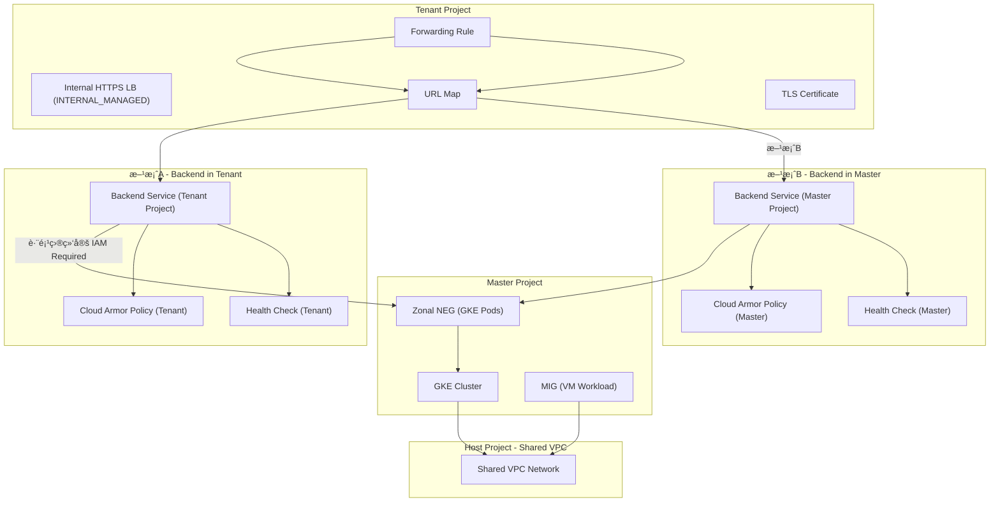
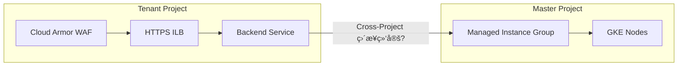
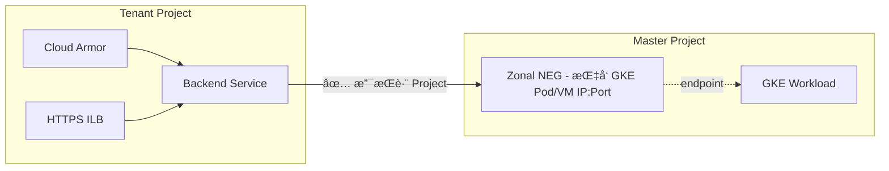
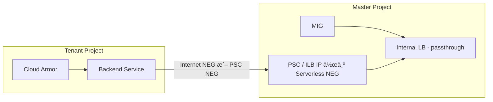
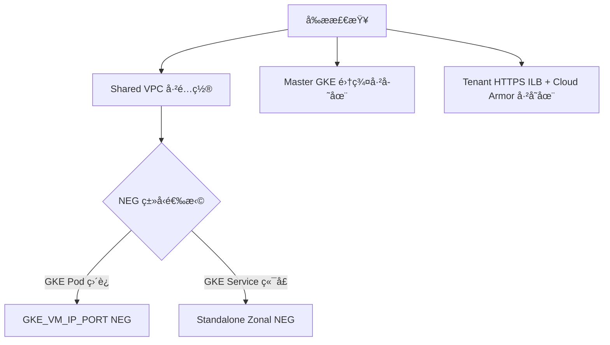
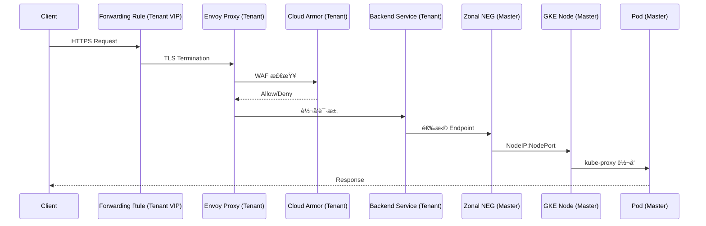

你帮我å»æ¢ç´¢ 主题
在 Shared VPC ç¯å¢ƒä¸‹ Internal HTTPS Load Balancer 跨项目绑定 Backend çš„å¯è¡Œæ€§ç¡®è®¤
⸻
背景说æ˜
我们正在 Google Cloud 上设计一个多租户æ¶æ„，希望确认跨项目 Backend 绑定的官方支æŒæ–¹å¼ã€‚
当å‰æ¶æ„
	•	Tenant 项目 主è¦æ˜¯æƒ³è¦ç”¨æˆ·æ§åˆ¶è‡ªå·±çš„å…¥å£ ç»‘å®šè‡ªå·±å¯¹åº”çš„è§„åˆ™ 比如说其对应的cloud armor 规则的改动，ä¸ä¼šå½±å“我们其他的用户也å¯ä»¥æ”¯æŒè‡ªå·±çš„独立机会 安全éšæ‚£åˆ†æ‘Šåˆ°tenant
	•	Internal HTTPS Load Balancer（INTERNAL_MANAGED）
	•	URL Map + Routing Rules
	•	Backend Service（归 Tenant 项目所有）
	•	Cloud Armor 绑定在 Backend Service 上
	•	TLS è¯ä¹¦åœ¨ Tenant 项目中管ç†
	•	Master 项目 这个也是我们平å°æ–¹åšä¸€ä¸ªæ ¸å¿ƒæ¥æ供一些对应的GKE
	•	Managed Instance Group（MIG） GKE  neg
	•	è¿è¡Œ Compute Engine VM 工作负载 vm 通过一定的方å¼æ¥æš´éœ²æˆ‘们的GKE
	•	两个项目已挂载在åŒä¸€ä¸ª Shared VPC（åŒä¸€ Host Project + åŒä¸€ VPC）
⸻

目标æ¶æ„

我们希望：
	•	ä¿æŒ Internal HTTPS LB å’Œ Backend Service 在 Tenant 项目
                       我们已ç»å®ç°äº†ï¼Œé€šè¿‡ä¿®æ”¹tenant ilb å¯ä»¥ç»‘定到cross project到masterçš„ backend service .当然虽然这个已ç»å®ç°äº†ï¼Œ 我们也å¯ä»¥é’ˆå¯¹æ¯ä¸ªtalent过æ¥çš„用户创建自己对应的backend service 但是我å¯èƒ½è¿˜è¦è¯„估一下对应的工程的æˆæƒæƒ…况è¦åšå®‰å…¨è¯„估，ç°åœ¨åªæ˜¯å®ç°äº†è®¿é—®
                        放在tenant好åƒå¿…须得给tenant projectçš„sa compuer.instanseçš„adm
	•	将 Tenant 项目的 Backend Service 绑定到 Master 项目中的 MIG 或者neg GKE
	•	Cloud Armor ä¾ç„¶åœ¨ Tenant 项目侧生效
	•	通过 Shared VPC å®ç°è·¨é¡¹ç›®ç½‘络共享

希望确认的问题
	1.	在 Shared VPC æ¡ä»¶ä¸‹ï¼ŒBackend Service（Project A）绑定 MIG（Project B）是å¦å±äºå®˜æ–¹æ”¯æŒæ¶æ„？
	2.	是å¦å­˜åœ¨ä»¥ä¸‹æ–¹é¢çš„é™åˆ¶æˆ–最佳å®è·µï¼š
	•	跨项目 IAM æƒé™è¦æ±‚
	•	Health Check çš„å½’å±å’Œå¯è§æ€§
	•	Backend 生命周期管ç†å½±å“
	•	Region é™åˆ¶
	3.	在生产ç¯å¢ƒä¸­æ˜¯å¦å­˜åœ¨å·²çŸ¥é£é™©æˆ–边界情况？
	4.	ä» Google æ¨èæ¶æ„角度，是å¦æ›´æ¨è：
	•	跨项目 MIG 绑定 以åŠè¯¥æ–¹æ¡ˆæ˜¯å¦å¯è¡Œï¼Ÿ
	•	跨项目 NEG 绑定以åŠè¯¥æ–¹æ¡ˆæ˜¯å¦å¯è¡Œï¼Ÿ
	•	或使用 Private Service Connect å®ç°æ›´å¼ºéš”离
如æœè¿™ç§æ–¹æ¡ˆå¯è¡Œçš„è¯ï¼Œæˆ‘们还需è¦è€ƒè™‘一下一些安全的设置，或者是对应工程æˆæƒçš„一些问题以åŠå¯¹åº”的一些计费åŸåˆ™ï¼Œæˆ‘们想对tenant的用户进行独立计费，也è¦è€ƒè™‘计费的方便性
我们希望在进入生产ç¯å¢ƒå‰ç¡®è®¤è¯¥è®¾è®¡ç¬¦åˆ Google Cloud 官方支æŒçš„æ¶æ„模å¼ã€‚
所以我希望你至äºä¸Šé¢çš„这个背景，我å»æ¢ç´¢ä¸€ä¸‹æ˜¯å¦èƒ½å¤Ÿå®ç°
ç›®å‰æœ‰ä¸¤ç§æ¶æ„å®ç°æ–¹æ¡ˆå¯ä¾›è¯„估：
方案一是将 Backend Server 部署在 Talent 项目中；方案二（å³æˆ‘当å‰çš„å®ç°ï¼‰æ˜¯å°† Backend Server ç›´æ¥éƒ¨ç½²åœ¨ Master 项目下。方案 B ä¸æ˜¯â€œå…±ç”¨ä¸€ä¸ª Backend Serviceâ€ï¼Œè€Œæ˜¯â€œæ¯ä¸ª Tenant 一个 Backend Service，但都在 Master 项目â€ã€‚
除了安全性之外，我é‡ç‚¹å…³æ³¨æƒé™ç®¡æ§ï¼ˆAuthorization）ä¸è®¡è´¹æ¶æ„（Billing）。
若采用全é‡éƒ¨ç½²åœ¨ Master 项目的方案，所有 Cloud Armor 的计费费用将由 Master 项目承担。且由äºæˆ‘需è¦åœ¨ Master 项目中创建多个ä¸åŒçš„ Backend Server，å„æœåŠ¡çš„计费维度也需è¦åšè¿›ä¸€æ­¥çš„拆分。


# Shared VPC 跨项目 Internal HTTPS LB 绑定 Backend å¯è¡Œæ€§åˆ†æ

## 🔠问题分æ

核心问题是在 Shared VPC ç¯å¢ƒä¸‹ï¼Œè¯„估两ç§æ¶æ„方案的**å¯è¡Œæ€§ã€æƒé™æ¨¡å‹ã€è®¡è´¹æ‹†åˆ†**：

- **方案 A**：Backend Service 在 Tenant 项目，绑定 Master 项目的 MIG/NEG（跨项目 Backend 绑定）
- **方案 B**：Backend Service 在 Master 项目，æ¯ä¸ª Tenant 独立一个 Backend Service（当å‰å·²å®ç°ï¼‰

---

## 🛠 å¯è¡Œæ€§ç¡®è®¤

### 方案 A：Backend Service（Tenant）→ MIG/NEG（Master）跨项目绑定

#### ✅ MIG 跨项目绑定

| 维度 | 结论 |
|------|------|
| å®˜æ–¹æ”¯æŒ | **有é™æ”¯æŒ**，需 Shared VPC 且满足 IAM æ¡ä»¶ |
| 网络层 | Shared VPC åŒ VPC 网络下 **å¯è¾¾** |
| GCP API 层 | Backend Service 引用跨项目 MIG 需è¦æ˜¾å¼ IAM æˆæƒ |
| Health Check | **å¿…é¡»ä¸ Backend Service åŒé¡¹ç›®**，或æ˜ç¡®æˆæƒ |

**关键 IAM æˆæƒè¦æ±‚（方案 A MIG）**：

```bash
# Tenant 项目的 Cloud Load Balancing Service Agent 需è¦è®¿é—® Master 项目的 MIG
# 在 Master 项目æˆæƒ
gcloud projects add-iam-policy-binding <MASTER_PROJECT_ID> \
  --member="serviceAccount:service-<TENANT_PROJECT_NUMBER>@compute-system.iam.gserviceaccount.com" \
  --role="roles/compute.networkViewer"

# åŒæ—¶éœ€è¦æˆæƒè®¿é—® MIG
gcloud compute instance-groups managed add-iam-policy-binding <MIG_NAME> \
  --region=<REGION> \
  --member="serviceAccount:service-<TENANT_PROJECT_NUMBER>@compute-system.iam.gserviceaccount.com" \
  --role="roles/compute.viewer" \
  --project=<MASTER_PROJECT_ID>
```

#### ✅ NEG（GKE）跨项目绑定

| NEG ç±»å‹ | è·¨é¡¹ç›®æ”¯æŒ | è¯´æ˜ |
|----------|-----------|------|
| Zonal NEG | âš ï¸ å—é™ | éœ€è¦ Shared VPC + 特定 IAM |
| Serverless NEG | ⌠ä¸æ”¯æŒè·¨é¡¹ç›® | åŒé¡¹ç›®é™åˆ¶ |
| Internet NEG | ⌠ä¸é€‚用 | 外部场景 |
| **PSC NEG** | ✅ æ¨è | 通过 Private Service Connect å®ç°å¼ºéš”离 |

---

### 方案 B：Backend Service 全在 Master 项目（当å‰å®ç°ï¼‰

```
✅ 完全官方支æŒï¼Œæ— è·¨é¡¹ç›® API 绑定问题
âš ï¸ æƒé™é—®é¢˜ï¼šTenant 需è¦ä¿®æ”¹è‡ªå·± ILB çš„ URL Map æŒ‡å‘ Master çš„ Backend Service
âš ï¸ è®¡è´¹é—®é¢˜ï¼šCloud Armor 费用全归 Master 项目
```

---

## 📊 两ç§æ–¹æ¡ˆæ¶æ„对比



---

## 💳 计费æ¶æ„分æ

### 方案 A（Tenant 拥有 Backend Service）

| 费用项 | å½’å± | è¯´æ˜ |
|--------|------|------|
| ILB Forwarding Rule | Tenant 项目 | 按规则数计费 |
| Backend Service | Tenant 项目 | å…费资æºå¯¹è±¡ |
| **Cloud Armor** | **Tenant 项目** | ✅ 天然隔离，Tenant 自行承担 |
| 出站æµé‡ | Shared VPC Host | å–决äºæµé‡è·¯å¾„ |
| Health Check | Tenant 项目 | 按æ¢æµ‹æ¬¡æ•°è®¡è´¹ |

### 方案 B（Backend Service 全在 Master）

| 费用项 | å½’å± | 问题 |
|--------|------|------|
| ILB Forwarding Rule | Tenant 项目 | ✅ 独立 |
| **Cloud Armor** | **Master 项目** | ⌠无法直æ¥æ‹†åˆ†è´¦å•åˆ° Tenant |
| Backend Service | Master 项目 | æ··åˆåœ¨ä¸€èµ· |

**方案 B 计费拆分补救方案**：

```bash
# 通过 Labels 打标，å†ç”¨ Billing Export 到 BigQuery 进行费用归因
gcloud compute backend-services update <BS_NAME_FOR_TENANT_X> \
  --global \
  --update-labels tenant=tenant-x,env=prod,cost-center=tenant-x-billing \
  --project=<MASTER_PROJECT_ID>

# BigQuery 查询示例（billing export 表）
# SELECT labels.value as tenant, SUM(cost) as total_cost
# FROM `billing_dataset.gcp_billing_export`
# WHERE labels.key = 'tenant'
# GROUP BY tenant
```

> âš ï¸ Labels 计费拆分是 **软性拆分**，无法在 GCP Console è´¦å•é¡µç›´æ¥ä½“ç°åˆ° Tenant 项目，需è¦é€šè¿‡ BigQuery Billing Export 二次分æ。

---

## 🔠æƒé™ç®¡æ§ï¼ˆAuthorization）关键差异

### 方案 A æƒé™çŸ©é˜µ

| æ“作 | 执行方 | 所需æƒé™ | é£é™© |
|------|--------|----------|------|
| 修改 Cloud Armor | Tenant SA | `compute.securityPolicies.*`（Tenant 项目） | ✅ ä½ï¼Œç§Ÿæˆ·è‡ªæ²» |
| 绑定跨项目 MIG | Tenant SA | `compute.instanceGroups.use`（Master 项目） | âš ï¸ éœ€è¦ç²¾ç¡®æˆæƒ |
| 修改 Health Check | Tenant SA | `compute.healthChecks.*`（Tenant 项目） | ✅ ä½ |
| 删除 Backend Service | Tenant SA | éœ€é˜²æ­¢è¯¯åˆ å½±å“ LB | âš ï¸ éœ€ OrgPolicy ä¿æŠ¤ |

```bash
# 方案A：在 Master 项目给 Tenant SA 最å°æƒé™ï¼ˆä»…å…许 use MIG，ä¸å…许 delete）
gcloud projects add-iam-policy-binding <MASTER_PROJECT_ID> \
  --member="serviceAccount:<TENANT_SA>@<TENANT_PROJECT>.iam.gserviceaccount.com" \
  --role="roles/compute.viewer"

# 自定义 Role ä»…æˆäºˆ use æƒé™
gcloud iam roles create tenantMigUser \
  --project=<MASTER_PROJECT_ID> \
  --permissions="compute.instanceGroups.use,compute.instanceGroups.get"
```

### 方案 B æƒé™çŸ©é˜µ

| æ“作 | 执行方 | é£é™© |
|------|--------|------|
| 修改 Cloud Armor | Master SA / Platform Team | ⌠Tenant 无法自主修改，需通过平å°æ¥å£ |
| 修改 URL Map | Tenant SA | âš ï¸ éœ€æˆäºˆ Tenant 对 Master 项目 URLMap 的写æƒé™ |
| 隔离性 | — | ⌠一个 SA 误æ“作å¯èƒ½å½±å“多 Tenant |

---

## 📋 三ç§æ–¹æ¡ˆæ¨ªå‘å¯¹æ¯”ï¼ˆå« PSC）

| 维度 | 方案A：跨项目 Backend | 方案B：Master 统一 Backend | 方案C：PSC 隔离 |
|------|----------------------|--------------------------|----------------|
| 官方支æŒåº¦ | âš ï¸ æœ‰é™æ”¯æŒï¼Œéœ€ IAM é…ç½® | ✅ å®Œå…¨æ”¯æŒ | ✅ å®Œå…¨æ”¯æŒ |
| Cloud Armor å½’å± | ✅ Tenant 独立 | ⌠Master 统一 | ✅ Tenant 独立 |
| 计费天然隔离 | ✅ 按项目自然隔离 | ⌠需 Label + BigQuery | ✅ 按项目自然隔离 |
| Tenant 自治能力 | ✅ 高 | âš ï¸ ä½ï¼Œä¾èµ–å¹³å° | ✅ 高 |
| å®ç°å¤æ‚度 | âš ï¸ ä¸­ï¼ˆIAM é…ç½®å¤æ‚） | ✅ ä½ï¼ˆå·²å®ç°ï¼‰ | ⌠高（需 PSC é…置） |
| 网络安全隔离 | âš ï¸ ä¸­ï¼ˆåŒ VPC） | âš ï¸ ä¸­ï¼ˆåŒ VPC） | ✅ 强（æœåŠ¡è¾¹ç•Œéš”离） |
| 跨项目 MIG 绑定 | âš ï¸ æ”¯æŒä½†éä¸»æµ | N/A | N/A |
| 跨项目 GKE NEG 绑定 | âš ï¸ å—é™ | N/A | ✅ via PSC NEG |

---

## âš ï¸ ç”Ÿäº§ç¯å¢ƒå·²çŸ¥é£é™©

### 方案 A é£é™©ç‚¹

1. **Health Check 跨项目å¯è§æ€§**：Health Check å¿…é¡»ä¸ Backend Service **åŒé¡¹ç›®**，无法直æ¥æ¢æµ‹è·¨é¡¹ç›® MIG çš„ç§æœ‰ IP（需确认 Firewall 规则放行 `35.191.0.0/16` å’Œ `130.211.0.0/22` 到 Master 项目 VM）

```bash
# Master 项目必须放行 GCP Health Check æ¢é’ˆæº IP
gcloud compute firewall-rules create allow-health-check-from-tenant-lb \
  --network=<SHARED_VPC_NETWORK> \
  --action=ALLOW \
  --rules=tcp:<BACKEND_PORT> \
  --source-ranges=35.191.0.0/16,130.211.0.0/22 \
  --project=<MASTER_PROJECT_ID>
```

2. **跨项目 NEG 绑定 GKE**：GKE NEG 通常åªèƒ½è¢«**åŒé¡¹ç›®**çš„ Backend Service ç›´æ¥å¼•ç”¨ï¼Œè·¨é¡¹ç›®å¼•ç”¨éœ€è¦é€šè¿‡ **PSC** 或者将 NEG 创建动作委托给 Master 项目

3. **Tenant SA éœ€è¦ `compute.instances.admin`**：你æ到已å‘ç°è¿™ä¸ªé—®é¢˜ï¼Œè¿™ä¸ªæƒé™è¿‡å¤§ï¼Œåº”通过**自定义 Role** 缩å°æƒé™é¢

### 方案 B é£é™©ç‚¹

1. Master 项目 SA 误æ“作影å“范围扩大
2. Cloud Armor 规则å˜æ›´éœ€è¦å¹³å°å›¢é˜Ÿä»‹å…¥ï¼ŒTenant 自治性差
3. 计费无法在项目维度自然拆分

---

## 🆠æ¨è结论

```
短期（已å®ç°æ–¹æ¡ˆ B）：
  → 通过 Label + Billing Export BigQuery å®ç°è½¯æ€§è®¡è´¹æ‹†åˆ†
  → 为æ¯ä¸ª Tenant çš„ Backend Service 统一打 tenant=xxx 标签
  → 用自定义 IAM Role 收紧 Tenant 对 Master 项目的æ“作æƒé™

中期（演进到方案 A）：
  → 使用 Shared VPC + 跨项目 MIG 绑定（é…åˆç²¾ç¡® IAM Custom Role）
  → Health Check 放在 Tenant 项目，Firewall 规则在 Master 项目放行
  → Cloud Armor 计费天然归 Tenant 项目

长期（规模化多租户）：
  → 考虑 Private Service Connect（PSC）
  → Master 项目å‘布 PSC Service Attachment
  → Tenant 项目通过 PSC NEG æ¥å…¥ï¼Œå®ç°æœåŠ¡è¾¹ç•Œçº§éš”离
  → 完全解耦两个项目的生命周期ä¾èµ–
```

---

## 🔧 方案 A è½åœ°æœ€å° IAM é…ç½®å‚考

```bash
# 1. 创建自定义 Role（Master 项目），仅å…许 Tenant 引用 MIG/NEG，ä¸å…许删除
gcloud iam roles create crossProjectBackendUser \
  --project=<MASTER_PROJECT_ID> \
  --title="Cross Project Backend User" \
  --permissions="compute.instanceGroups.use,compute.instanceGroups.get,compute.networkEndpointGroups.use,compute.networkEndpointGroups.get,compute.instances.get"

# 2. æˆæƒ Tenant 项目的 LB Service Agent
gcloud projects add-iam-policy-binding <MASTER_PROJECT_ID> \
  --member="serviceAccount:service-<TENANT_PROJECT_NUMBER>@compute-system.iam.gserviceaccount.com" \
  --role="projects/<MASTER_PROJECT_ID>/roles/crossProjectBackendUser"

# 3. åŒæ—¶æˆæƒ compute.networkViewer 以便 LB 解æ Shared VPC 网络
gcloud projects add-iam-policy-binding <MASTER_PROJECT_ID> \
  --member="serviceAccount:service-<TENANT_PROJECT_NUMBER>@compute-system.iam.gserviceaccount.com" \
  --role="roles/compute.networkViewer"
```

---

**核心结论**：
- 方案 A（Tenant 拥有 Backend + 跨项目 MIG）**技术å¯è¡Œä½† IAM é…ç½®å¤æ‚**，Cloud Armor 和计费天然隔离，是长期æ¨èæ–¹å‘
- 方案 B（当å‰å®ç°ï¼‰**工程最简å•**，但计费和æƒé™éš”离需è¦é¢å¤–工程ä¿éšœ
- 如æœä½ çš„核心诉求是 **Tenant 独立计费 + Cloud Armor 自治**，应优先æ¨è¿›æ–¹æ¡ˆ A 或 PSC 方案


# Gemini

This is a classic "Platform vs. Tenant" architectural challenge. In a Shared VPC environment, Google Cloud provides several paths, but the choice between Cross-Project Backend Attachment and Private Service Connect (PSC) hinges on how much "trust" you have between the Master and Tenant projects.
As your Technical Partner, here is the architectural breakdown and feasibility confirmation.
1. Feasibility Confirmation
Is it officially supported?
Yes. In a Shared VPC environment, a Regional Internal HTTP(S) Load Balancer (Project A) can officially reference Backends (NEGs or MIGs) located in Project B, provided both projects are service projects attached to the same Shared VPC Host Project.
Implementation Logic
 * The Network context: Since both projects share the same VPC, the underlying IP reachability is native.
 * The Resource context: The Backend Service (in Tenant Project) points to the self_link of the NEG or MIG (in Master Project).
 * The Region constraint: The ILB, Backend Service, and the NEGs/MIGs must reside in the same GCP Region. Cross-region backend binding is not supported for Internal HTTPS LBs.
2. Architecture Comparison: Option A vs. Option B vs. PSC
Based on your requirements for independent billing and Tenant-level Cloud Armor, here is how the options stack up:
| Feature | Option A: Backend Service in Tenant (Your Current) | Option B: Backend Service in Master | Option C: Private Service Connect (Recommended) |
|---|---|---|---|
| Cloud Armor Policy | Owned by Tenant | Owned by Master (Hard to split) | Owned by Tenant |
| Billing (LB + WAF) | Tenant Project | Master Project | Tenant Project |
| IAM Complexity | High (Cross-project perms) | Low | Medium |
| Security Isolation | Network-level (Shared VPC) | Shared | Consumer-Provider Abstraction |
| Scalability | Good | Hard to manage at scale | Best (Cleanest handoff) |
Why Private Service Connect (PSC) might be your "North Star"
While your current cross-project binding works, PSC is the Google-recommended way for multi-tenant platforms.
 * Producer (Master): You create a "Service Attachment" pointing to your GKE internal load balancer.
 * Consumer (Tenant): The tenant creates a PSC NEG in their project.
 * Result: The Tenant’s ILB points to the PSC NEG. The Tenant pays for their own ILB and Cloud Armor. You (Master) only pay for the GKE resources. No cross-project IAM on MIGs/NEGs is required.
3. Deep Dive: Cross-Project IAM & Permissions
If you stick with Option A (Backend Service in Tenant), you must solve the "Permission Leakage" issue you mentioned.
Required Roles
To allow the Tenant Project to "see" and "use" the Master Project's backends:
 * LB Service Agent: The service-PROJECT_NUMBER@gcp-sa-compute.iam.gserviceaccount.com in the Tenant Project needs:
   * roles/compute.networkUser on the Shared VPC Host subnet.
   * roles/compute.loadBalancerServiceUser on the Master Project (to bind NEGs).
 * Automation/User Identity: The principal creating the Backend Service needs compute.instances.use or compute.networkEndpointGroups.use on the Master resources.
> Risk Warning: Giving a Tenant Project Service Account compute.instanceAdmin on the Master project is a critical security risk. You should use a custom role or strictly scoped compute.loadBalancerServiceUser to ensure the Tenant cannot delete or modify your GKE nodes.
> 
4. Billing & Cost Attribution
In Option A (Tenant-side ILB/Backend Service):
 * Load Balancing Fees: Charged to the Tenant Project.
 * Cloud Armor Fees: Charged to the Tenant Project.
 * Data Processing: Charged to the project where the LB is defined (Tenant).
 * Compute (GKE Nodes): Charged to the Master Project.
This aligns perfectly with your goal of independent billing for security and traffic-heavy features (WAF).
5. Summary & Recommendation
Which Backend type?
 * Use NEGs (Network Endpoint Groups): Since you are on GKE, standalone NEGs are superior to MIGs. They allow container-native load balancing (skipping the NodePort hop), reducing latency and simplifying health checks.
Final Verdict
 * Immediate Fix (Current Path): Continue with Cross-Project NEG binding. Refine IAM: Remove instanceAdmin and replace it with compute.loadBalancerServiceUser at the project level, or better, granted only on specific NEGs via IAM conditions.
 * Structural Improvement (Long-term): Move to Private Service Connect (PSC). It removes the need for the Tenant to have any direct IAM visibility into your Master Project. The interface becomes a "Service Attachment" URL.
Next Step
Would you like me to provide the Terraform/YAML manifest for setting up a PSC Service Attachment in the Master project and a PSC NEG in the Tenant project to see how that simplifies your security boundary?


# Cross-Project Backend Service 绑定 Master MIG å¯è¡Œæ€§åˆ†æ

## 澄清你的æ¶æ„æ„图



---

## 结论：**ä¸å¯è¡Œï¼ˆç¡¬é™åˆ¶ï¼‰**

> GCP Backend Service **åªèƒ½ç»‘å®šåŒ Project 内的 Instance Group（MIG/UIG）**。  
> è¿™ä¸æ˜¯æƒé™é—®é¢˜ï¼Œæ˜¯ GCP 资æºå¼•ç”¨æ¨¡å‹çš„硬约æŸã€‚

验è¯ä¸€ä¸‹ï¼š
```bash
# å°è¯•è·¨ Project 添加 MIG 到 Backend Service 会直æ¥æŠ¥é”™
gcloud compute backend-services add-backend TENANT_BS \
    --instance-group=projects/MASTER_PROJECT/zones/ZONE/instanceGroups/master-mig \
    --project=TENANT_PROJECT_ID

# 报错：
# ERROR: Invalid value for field 'resource.backends[0].group':
# 'projects/MASTER_PROJECT/...' Backend must be in the same project
```

---

## 但你说的「Cross-Project Backendã€æ˜¯å¦ä¸€å›äº‹


**GCP 支æŒçš„ Cross-Project 是：**  
ILB çš„ **URL Map routing rule** ç›´æ¥å¼•ç”¨å¦ä¸€ä¸ª Project çš„ **Backend Service**  
→ 但 Cloud Armor Policy 是绑在 **Tenant 自己的 Backend Service** 上的  
→ æµé‡èµ°åˆ° Master çš„ Backend Service 时，**Cloud Armor ä¸ä¼šç”Ÿæ•ˆ**

---

## 你的核心诉求 vs å®é™…é™åˆ¶

| 诉求 | 是å¦å¯è¡Œ |
|------|---------|
| Cloud Armor 在 Tenant Project | ✅ |
| Backend Service 在 Tenant Project | ✅ |
| Tenant BS ç›´æ¥ç»‘定 Master MIG | ⌠硬é™åˆ¶ |
| ILB routing 到 Master BS（Cloud Armor 失效） | ✅ 但ä¸æ»¡è¶³ WAF 需求 |

---

## 真正å¯è¡Œçš„方案：Cross-Project NEG（é MIG）



**关键区别：MIG ä¸èƒ½è·¨ Project，但 NEG å¯ä»¥ã€‚**

```bash
# Master Project 创建 NEG
gcloud compute network-endpoint-groups create master-workload-neg \
    --network-endpoint-type=GCE_VM_IP_PORT \
    --zone=ZONE \
    --project=MASTER_PROJECT_ID

# 添加 GKE Node/Pod endpoints
gcloud compute network-endpoint-groups update master-workload-neg \
    --add-endpoint='instance=INSTANCE_NAME,ip=POD_IP,port=8080' \
    --zone=ZONE \
    --project=MASTER_PROJECT_ID

# Tenant Project Backend Service 绑定 Master NEG ✅
gcloud compute backend-services add-backend TENANT_BS \
    --network-endpoint-group=projects/MASTER_PROJECT_ID/zones/ZONE/networkEndpointGroups/master-workload-neg \
    --network-endpoint-group-zone=ZONE \
    --project=TENANT_PROJECT_ID \
    --global
```

---

## 如æœä½ çš„ Master 必须用 MIG，唯一路径



在 Tenant BS 里用 **Private Service Connect NEG** 或 **Hybrid NEG** æŒ‡å‘ Master çš„ Internal LB IP，间æ¥æ‰“通，Cloud Armor ä¾ç„¶åœ¨ Tenant 侧生效。

---

## 总结建议

**å¦‚æœ Master 是 GKE** → 改用 Cross-Project Zonal NEG，完全满足你的需求  
**å¦‚æœ Master 必须是 MIG** → PSC NEG é—´æ¥ç»‘定，多一跳但 WAF ä¸å—å½±å“


# Cross-Project Zonal NEG 方案细化

## å‰ææ¡ä»¶ç¡®è®¤



---

## 整体æ¶æ„


---

## 详细å®æ–½æ­¥éª¤

### Step 1：Master Project - 准备 GKE Service 暴露方å¼

GKE 侧需è¦è®©æµé‡å¯ä»¥é€šè¿‡ **NodePort** 或 **Pod IP ç›´è¿** è¿›æ¥ï¼š

```yaml
# Master Project - K8s Service 使用 NodePort
apiVersion: v1
kind: Service
metadata:
  name: master-workload-svc
  namespace: default
spec:
  type: NodePort
  selector:
    app: master-workload
  ports:
    - port: 80
      targetPort: 8080
      nodePort: 30080   # 固定 NodePortï¼Œä¾¿äº NEG é…ç½®
```

```bash
kubectl apply -f service.yaml --context=MASTER_GKE_CONTEXT
```

---

### Step 2：Master Project - 创建 Standalone Zonal NEG

```bash
# 创建 NEGï¼Œç½‘ç»œæŒ‡å‘ Shared VPC
gcloud compute network-endpoint-groups create master-gke-neg \
    --network-endpoint-type=GCE_VM_IP_PORT \
    --zone=asia-east1-b \
    --network=projects/HOST_PROJECT_ID/global/networks/SHARED_VPC_NAME \
    --subnetwork=projects/HOST_PROJECT_ID/regions/asia-east1/subnetworks/SUBNET_NAME \
    --project=MASTER_PROJECT_ID

# 查看 GKE Node å®ä¾‹å
kubectl get nodes -o wide --context=MASTER_GKE_CONTEXT
# 记录 NODE_NAME 和 INTERNAL_IP

# å°† GKE Node 加入 NEG（NodePort æ–¹å¼ï¼‰
gcloud compute network-endpoint-groups update master-gke-neg \
    --add-endpoint='instance=GKE_NODE_INSTANCE_NAME,ip=NODE_INTERNAL_IP,port=30080' \
    --zone=asia-east1-b \
    --project=MASTER_PROJECT_ID

# 多节点全部加入
gcloud compute network-endpoint-groups update master-gke-neg \
    --add-endpoint='instance=GKE_NODE_2,ip=NODE_2_IP,port=30080' \
    --zone=asia-east1-b \
    --project=MASTER_PROJECT_ID
```

> âš ï¸ GKE 节点 Auto Scaling 时，需è¦è‡ªåŠ¨åŒæ­¥ NEG endpointsï¼Œè§ Step 6。

---

### Step 3：IAM æˆæƒ - Tenant å¯ä»¥ä½¿ç”¨ Master NEG

```bash
# æ–¹å¼ä¸€ï¼šç²¾ç»†åŒ–到具体 NEG 资æºï¼ˆæ¨è）
gcloud compute network-endpoint-groups add-iam-policy-binding master-gke-neg \
    --member="serviceAccount:TENANT_COMPUTE_SA@TENANT_PROJECT.iam.gserviceaccount.com" \
    --role="roles/compute.networkEndpointGroupAdmin" \
    --zone=asia-east1-b \
    --project=MASTER_PROJECT_ID

# æ–¹å¼äºŒï¼šProject 级别（æƒé™è¾ƒå¤§ï¼Œä¸æ¨è生产）
gcloud projects add-iam-policy-binding MASTER_PROJECT_ID \
    --member="serviceAccount:TENANT_COMPUTE_SA@TENANT_PROJECT.iam.gserviceaccount.com" \
    --role="roles/compute.networkViewer"
```

---

### Step 4：Tenant Project - Backend Service 绑定 Master NEG

```bash
# 4.1 创建 Health Check（在 Tenant Project，æ¢æµ‹ Master GKE NodePort）
gcloud compute health-checks create http master-neg-hc \
    --port=30080 \
    --request-path=/healthz \
    --check-interval=10s \
    --timeout=5s \
    --healthy-threshold=2 \
    --unhealthy-threshold=3 \
    --project=TENANT_PROJECT_ID \
    --global

# 4.2 创建 Backend Service 并绑定 Cloud Armor
gcloud compute backend-services create tenant-bs-master \
    --protocol=HTTP \
    --health-checks=master-neg-hc \
    --security-policy=YOUR_CLOUD_ARMOR_POLICY \
    --global \
    --project=TENANT_PROJECT_ID

# 4.3 绑定 Master Project 的 NEG ✅
gcloud compute backend-services add-backend tenant-bs-master \
    --network-endpoint-group=projects/MASTER_PROJECT_ID/zones/asia-east1-b/networkEndpointGroups/master-gke-neg \
    --network-endpoint-group-zone=asia-east1-b \
    --balancing-mode=RATE \
    --max-rate-per-endpoint=100 \
    --global \
    --project=TENANT_PROJECT_ID
```

---

### Step 5：防ç«å¢™è§„则 - å…许 Health Check å’Œæµé‡è¿›å…¥ Master GKE

```bash
# Health Check æº IP 范围（GCP 固定）
gcloud compute firewall-rules create allow-tenant-hc-to-master-gke \
    --network=SHARED_VPC_NAME \
    --allow=tcp:30080 \
    --source-ranges=130.211.0.0/22,35.191.0.0/16 \
    --target-tags=gke-MASTER_CLUSTER_NAME-node \
    --project=HOST_PROJECT_ID \   # 防ç«å¢™è§„则在 Host Project
    --description="Allow GCP HC to Master GKE NodePort"

# å…许 ILB Proxy å­ç½‘æµé‡åˆ° Master GKE
gcloud compute firewall-rules create allow-tenant-ilb-to-master-gke \
    --network=SHARED_VPC_NAME \
    --allow=tcp:30080 \
    --source-ranges=PROXY_SUBNET_CIDR \
    --target-tags=gke-MASTER_CLUSTER_NAME-node \
    --project=HOST_PROJECT_ID
```

---

### Step 6：Node 动æ€æ‰©ç¼©å®¹æ—¶ NEG 自动åŒæ­¥

GKE 节点å˜åŒ–时需è¦è‡ªåŠ¨æ›´æ–° NEG，æ¨è使用 **GKE + Custom Controller** 或脚本：

```bash
# 方案：GKE Node 加 label，é…åˆ DaemonSet 自注册（简化版用脚本）
# ç›‘å¬ GKE Node å˜åŒ–，自动 add/remove NEG endpoint

#!/bin/bash
# sync-neg-endpoints.sh

ZONE="asia-east1-b"
NEG_NAME="master-gke-neg"
MASTER_PROJECT="MASTER_PROJECT_ID"
NODE_PORT="30080"

# è·å–当å‰æ‰€æœ‰ Ready Node
CURRENT_NODES=$(kubectl get nodes --context=MASTER_GKE_CONTEXT \
    -o jsonpath='{range .items[*]}{.metadata.name},{.status.addresses[?(@.type=="InternalIP")].address}{"\n"}{end}')

# è·å–å½“å‰ NEG 中的 endpoints
CURRENT_NEG=$(gcloud compute network-endpoint-groups list-network-endpoints $NEG_NAME \
    --zone=$ZONE --project=$MASTER_PROJECT \
    --format="value(networkEndpoint.instance,networkEndpoint.ipAddress)")

echo "$CURRENT_NODES" | while IFS=',' read -r name ip; do
    gcloud compute network-endpoint-groups update $NEG_NAME \
        --add-endpoint="instance=$name,ip=$ip,port=$NODE_PORT" \
        --zone=$ZONE \
        --project=$MASTER_PROJECT 2>/dev/null
done
```

> 💡 **更优方案**：使用 GKE Ingress with Container-native Load Balancing，GKE ä¼šè‡ªåŠ¨ç®¡ç† NEG endpointsï¼Œä½†è¿™éœ€è¦ GKE 侧也åšå¯¹åº”é…置。

---

## 完整æµé‡è·¯å¾„验è¯



---

## 关键注æ„事项

| 项目 | 注æ„点 |
|------|--------|
| NEG ä¸ GKE åŒ Zone | NEG 必须在 GKE Node 相åŒçš„ Zone，多 Zone 需创建多个 NEG |
| Health Check ç«¯å£ | 需è¦ä¸ NodePort 一致，且防ç«å¢™æ”¾é€š HC æº IP |
| GKE Node Autoscaler | 节点扩缩容需è¦åŒæ­¥æ›´æ–° NEG endpoints |
| Shared VPC å­ç½‘ | NEG 创建时必须指定 Shared VPC çš„ subnet |
| Cloud Armor 生效ä½ç½® | 绑定在 Tenant BS 上，在æµé‡è¿›å…¥ NEG 之å‰å·²ç”Ÿæ•ˆ ✅ |
| 多 Zone 高å¯ç”¨ | æ¯ä¸ª Zone 创建独立 NEG，BS 绑定所有 Zone çš„ NEG |