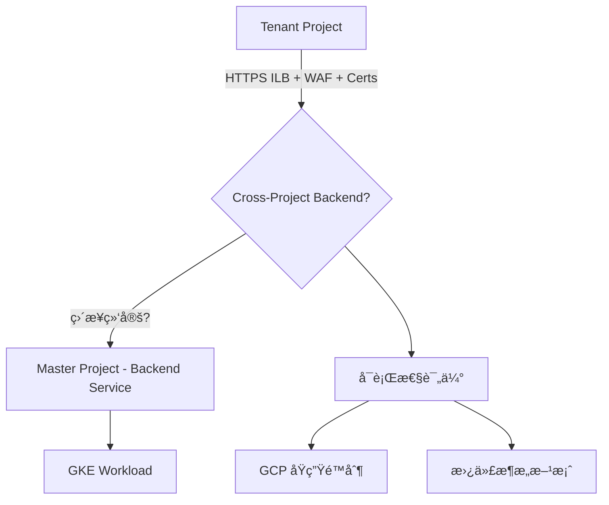
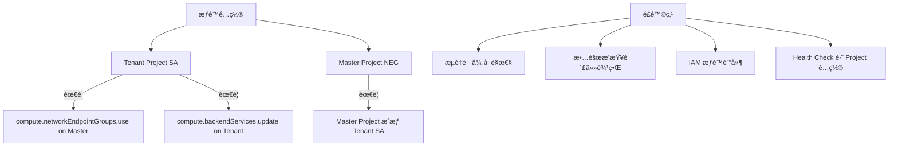
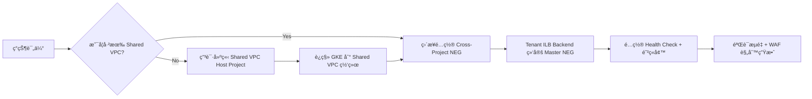

# Claude

# GCP Cross-Project Internal HTTPS LB Backend Service 绑定å¯è¡Œæ€§åˆ†æ

## 1. 核心问题分æ



## 2. å¯è¡Œæ€§ç»“论：**åŸç”Ÿä¸æ”¯æŒï¼Œä½†æœ‰æˆç†Ÿæ›¿ä»£æ–¹æ¡ˆ**

> GCP Internal HTTPS LB çš„ Backend Service **ä¸èƒ½ç›´æ¥è·¨ Project 绑定**。Backend Service å¿…é¡»ä¸ Forwarding Rule 在åŒä¸€ Project 内。这是 GCP 资æºæ¨¡å‹çš„硬é™åˆ¶ã€‚

---

## 3. 替代方案æ¶æ„评估

### 方案一：Shared VPC（æ¨è）

```mermaid
graph LR
    subgraph Host Project [Host Project - 网络层]
        VPC[Shared VPC]
    end
    subgraph Tenant Project [Tenant Project]
        ILB[HTTPS ILB]
        WAF[Cloud Armor WAF]
        CERT[Certs]
        ILB --> BS[Backend Service]
        WAF --> ILB
    end
    subgraph Master Project [Master Project]
        GKE[GKE NEG/NEG Endpoint]
        SVC[K8s Service]
        GKE --> SVC
    end
    BS -->|è·¨ Project NEG| GKE
    Tenant Project -.->|attach| Host Project
    Master Project -.->|attach| Host Project
```

**关键点：**

- Shared VPC å…许 Tenant Project çš„ Backend Service 使用  **Master Project çš„ Zonal NEG（Network Endpoint Group）**
- GKE 集群在 Master Project，通过 NEG 暴露 Pod/Service endpoints
- ILBã€WAFã€è¯ä¹¦å…¨éƒ¨ç•™åœ¨ Tenant Project ✅

**æ“作步骤：**

```bash
# 1. 设置 Shared VPC Host Project
gcloud compute shared-vpc enable HOST_PROJECT_ID

# 2. 将 Tenant 和 Master 作为 Service Project 挂载
gcloud compute shared-vpc associated-projects add TENANT_PROJECT_ID \
    --host-project HOST_PROJECT_ID

gcloud compute shared-vpc associated-projects add MASTER_PROJECT_ID \
    --host-project HOST_PROJECT_ID

# 3. Master Project GKE 创建 NEG（standalone zonal NEG）
gcloud compute network-endpoint-groups create master-neg \
    --network-endpoint-type=GCE_VM_IP_PORT \
    --zone=asia-east1-a \
    --network=projects/HOST_PROJECT/global/networks/shared-vpc \
    --project=MASTER_PROJECT_ID

# 4. Tenant Project Backend Service 绑定 Master Project NEG
gcloud compute backend-services add-backend TENANT_BACKEND_SERVICE \
    --network-endpoint-group=projects/MASTER_PROJECT_ID/zones/asia-east1-a/networkEndpointGroups/master-neg \
    --project=TENANT_PROJECT_ID \
    --global  # or --region
```

---

### 方案二：PSC（Private Service Connect）


**适用场景：**  两个 Project 网络完全隔离，ä¸ä½¿ç”¨ Shared VPC  
**缺点：**  多一跳 LB，延迟略高，é…ç½®å¤æ‚

---

### 方案三：VPC Peering + 独立 NEG

```mermaid
graph LR
    subgraph Tenant VPC
        ILB --> BS[Backend Service]
    end
    subgraph Master VPC
        GKE[GKE Pods]
    end
    BS -->|Peering Route| GKE
    Tenant VPC <-->|VPC Peering| Master VPC
```

**缺点：** VPC Peering ä¸å¯ä¼ é€’，NEG è·¨ Project 引用ä»å—é™ï¼Œéœ€è¦é¢å¤–é…ç½®

---

## 4. 方案对比

| 方案                           | è·¨ Project NEG | å¤æ‚度 | 延迟 | æ¨è度     |
| ------------------------------ | -------------- | ------ | ---- | ---------- |
| Shared VPC + Cross-Project NEG | ✅ åŸç”Ÿæ”¯æŒ    | 中     | ä½   | â­â­â­â­â­ |
| PSC                            | ✅ æ”¯æŒ        | 高     | 略高 | â­â­â­     |
| VPC Peering                    | âš ï¸ æœ‰é™        | 中     | ä½   | â­â­       |

---

## 5. æƒé™ä¸é£é™©è¯„ä¼°



**关键 IAM æˆæƒï¼š**

```bash
# Tenant Project çš„ Service Account 需è¦åœ¨ Master Project 上有 NEG 使用æƒé™
gcloud projects add-iam-policy-binding MASTER_PROJECT_ID \
    --member="serviceAccount:TENANT_SA@TENANT_PROJECT.iam.gserviceaccount.com" \
    --role="roles/compute.networkViewer"

# 精细化æƒé™ï¼ˆæ¨è）
gcloud compute network-endpoint-groups add-iam-policy-binding master-neg \
    --member="serviceAccount:TENANT_SA" \
    --role="roles/compute.networkEndpointGroupAdmin" \
    --zone=asia-east1-a \
    --project=MASTER_PROJECT_ID
```

**主è¦é£é™©ï¼š**

| é£é™©                                                   | 等级 | 缓解æªæ–½                                      |
| ------------------------------------------------------ | ---- | --------------------------------------------- |
| Health Check 需在 Tenant Project é…置但æ¢æµ‹ Master GKE | 中   | 开放 HC 防ç«å¢™è§„则到 Master VPC               |
| IAM æƒé™è·¨ Project 管ç†å¤æ‚                            | 中   | 使用 Workload Identity + 最å°æƒé™             |
| æ•…éšœæ’查边界模糊                                       | 中   | 建立清晰的 runbook，æ˜ç¡®å„ Project owner èŒè´£ |
| Shared VPC å•ç‚¹ä¾èµ–                                    | ä½   | Host Project åšå¥½èµ„æºä¿æŠ¤å’Œå®¡è®¡               |

---

## 6. æ¨èè½åœ°è·¯å¾„



**结论：Shared VPC + Cross-Project NEG 是最å¯è¡Œã€æœ€åŸç”Ÿçš„方案**，完全满足你的核心诉求：Tenant æŒæœ‰ ILB/WAF/Cert，Master æŒæœ‰ GKE workload，通过 NEG è·¨ Project 打通 Backend。

# ChatGPT

Cross-Project Internal HTTPS Load Balancer 绑定 Backend Service å¯è¡Œæ€§åˆ†æ

1ï¸âƒ£ 问题分æ

你的目标æ¶æ„：

Tenant Project

-> Internal HTTPS LB (ILB)

+ WAF (Cloud Armor)

+ Certs

-> Backend Service (å¸Œæœ›æŒ‡å‘ Master Project)

Master Project

-> Backend Service (KBP)

-> GKE

核心问题：

Tenant 工程中的 Internal HTTPS LB 是å¦å¯ä»¥ç›´æ¥ç»‘定 Master 工程中的 Backend Service？

2ï¸âƒ£ 结论：是å¦å¯è¡Œï¼Ÿ

âŒ ç›´æ¥ Cross-Project 绑定 Backend Service —— ä¸å¯è¡Œ

åŸå› 

在 GCP 设计中：

- Load Balancer ä¸ Backend Service å¿…é¡»å±äºåŒä¸€ä¸ª Project
- Backend Service ä¸èƒ½è¢«å…¶ä»– Project çš„ Forwarding Rule ç›´æ¥å¼•ç”¨
- Backend Service ä¸æ˜¯ Shareable 资æºï¼ˆä¸åƒ Subnet 或 Instance Template）

GCP ä¸æ”¯æŒï¼š

Tenant Project LB

-> Master Project Backend Service   ⌠ä¸æ”¯æŒ

â— åŸå› æœ¬è´¨

Backend Service 是：

- 区域或全局资æº
- å¼ºç»‘å®šåˆ°æ‰€å± project
- 由 forwarding rule / target proxy 调用

GCP 没有跨 Project Backend 引用机制。

3ï¸âƒ£ 官方支æŒçš„ Cross-Project 方案

虽然ä¸èƒ½ç›´æ¥ç»‘定 Backend Service，但å¯ä»¥é€šè¿‡ä»¥ä¸‹æ–¹å¼å®ç°è·¨é¡¹ç›®æ¶æ„。

✅ 方案一：Shared VPC + Cross-Project NEG（æ¨è）

这是 GCP 官方支æŒæ–¹å¼ã€‚

æ¶æ„æ€è·¯

- Master Project 作为 Service Project
- Tenant Project 使用 Shared VPC
- Backend 使用 NEG æŒ‡å‘ Master GKE Service

æ¶æ„æµç¨‹å›¾

graph TD

A["Tenant Client"] --> B["Tenant Project ILB"]

B --> C["Tenant Backend Service"]

C --> D["Cross-Project NEG"]

D --> E["Master Project GKE Service"]

å®ç°æ–¹å¼

Step 1：建立 Shared VPC

Host Project：

gcloud compute shared-vpc enable HOST_PROJECT_ID

Service Project å…³è”：

gcloud compute shared-vpc associated-projects add TENANT_PROJECT_ID \

--host-project HOST_PROJECT_ID

Step 2：Master GKE 使用 Shared VPC Subnet

ç¡®ä¿ï¼š

- GKE Cluster 使用 Shared VPC
- Service ç±»å‹ä¸º NEG

apiVersion: v1

kind: Service

metadata:

name: my-service

annotations:

cloud.google.com/neg: '{"exposed_ports":{"443":{}}}'

spec:

type: ClusterIP

Step 3：Tenant Project 创建 Backend Service

gcloud compute backend-services create tenant-ilb-backend \

--load-balancing-scheme=INTERNAL_MANAGED \

--protocol=HTTPS \

--region=asia-northeast1

Step 4：添加 Cross-Project NEG

gcloud compute backend-services add-backend tenant-ilb-backend \

--network-endpoint-group=NEG_NAME \

--network-endpoint-group-region=asia-northeast1 \

--project=TENANT_PROJECT_ID

注æ„：

- NEG å¯ä»¥è·¨ Project
- 但必须在 Shared VPC ç¯å¢ƒä¸‹

æƒé™è¦æ±‚

|        |                                   |
| ------ | --------------------------------- |
| 角色   | éœ€è¦                              |
| Tenant | compute.backendServicesAdmin      |
| Master | compute.networkEndpointGroups.use |
| Host   | compute.networkAdmin              |

å¤æ‚度评估

âš™ï¸ Moderate – Enterprise 级别设计

适åˆï¼š

- 部门隔离
- 多租户
- 统一网络管ç†

âš ï¸ æ–¹æ¡ˆäºŒï¼šInternal HTTPS LB -> PSC -> Master ILB

如æœä½ ä¸æƒ³ Shared VPC，å¯ä»¥ç”¨ï¼š

Private Service Connect (PSC)

æ¶æ„æµç¨‹

graph TD

A["Tenant Client"] --> B["Tenant ILB"]

B --> C["PSC Endpoint"]

C --> D["Master ILB"]

D --> E["Master GKE"]

逻辑

- Master Project 暴露 ILB
- 通过 PSC 作为 Service Attachment
- Tenant 通过 PSC Endpoint 消费

优点

- 无需 Shared VPC
- 网络隔离更强
- Project 独立性更高

缺点

- 多一层 LB
- æˆæœ¬å¢åŠ 
- é…ç½®å¤æ‚度更高

å¤æ‚度

âš™ï¸ Advanced / Enterprise

âš ï¸ æ–¹æ¡ˆä¸‰ï¼šInternal TCP Proxy + VPC Peering（ä¸æ¨è）

å¯ä»¥é€šè¿‡ï¼š

- VPC Peering
- 内部 IP ç›´è¿

但缺点：

- 无法共享 ILB
- å¤±å» WAF æ§åˆ¶
- ä¸æ”¯æŒé«˜çº§ Layer7 功能

4ï¸âƒ£ é£é™©è¯„ä¼°

æƒé™é£é™©

|                     |                         |
| ------------------- | ----------------------- |
| é£é™©                | æè¿°                    |
| Tenant æ§åˆ¶ Backend | 需è¦é™åˆ¶ IAM            |
| Shared VPC æƒé™æ‰©å¤§ | éœ€è¦ Network Admin æ§åˆ¶ |
| PSC Service 暴露    | 需é™åˆ¶ consumer project |

网络é£é™©

- NEG 跨项目ä¾èµ–
- GKE ç»´æŠ¤å½±å“ Tenant ILB
- è¯ä¹¦ç”Ÿå‘½å‘¨æœŸç‹¬ç«‹

è¿ç»´é£é™©

- 两个 Project Release ä¸åŒæ­¥
- 版本å‡çº§å½±å“ NEG

5ï¸âƒ£ æ¨èæ¶æ„选择

|                  |            |                |
| ---------------- | ---------- | -------------- |
| 方案             | æ¨è度     | 适åˆåœºæ™¯       |
| Shared VPC + NEG | â­â­â­â­   | ä¼ä¸šå†…部多租户 |
| PSC              | â­â­â­â­â­ | è·¨ BU 强隔离   |
| VPC Peering      | â­         | 简å•å®éªŒ       |

6ï¸âƒ£ 总结结论

⌠直æ¥è·¨ Project 绑定 Backend Service —— ä¸æ”¯æŒ

✅ 官方å¯è¡Œæ–¹æ¡ˆï¼š

1. Shared VPC + Cross Project NEG（æ¨è）
2. PSC Service Attachment（更隔离）
3. VPC Peering（ä¸æ¨è生产）

7ï¸âƒ£ 你的场景建议

结åˆä½ å½“å‰ï¼š

- 多租户平å°
- 有 WAF / MTLS / Cloud Armor
- å…¥å£åœ¨ Tenant Project
- Master Project 维护 GKE

我建议：

å¦‚æœ Tenant å±äºåŒä¸€ç»„织内部门 —— 使用 Shared VPC + NEG

å¦‚æœ Tenant å±äºä¸åŒ BU 或对安全隔离è¦æ±‚高 —— 使用 PSC\*\*

如æœä½ æ„¿æ„，我å¯ä»¥ï¼š

- 给你åšä¸€ç‰ˆ Production-Grade æ¶æ„图
- 给你一套 Terraform 结æ„
- 或者帮你对比æˆæœ¬æ¨¡å‹

你想往哪个方å‘深入？

# Gemini

**Defining the Architecture**

I'm currently focused on defining the initial architecture. My primary goal is understanding the user's intent to set up a Cross-Project Internal HTTPS Load Balancer in a multi-tenant GCP environment. I'm breaking down the setup process step-by-step to visualize the flow, starting from the Tenant Project.

**Analyzing Cross-Project LB**

I'm now diving deep into feasibility, questioning the core concept: can a tenant project's Internal HTTPS Load Balancer actually connect to a backend service residing in a master project? I'm exploring the implications of cross-project load balancing and cross-project service referencing within GCP to find out. My focus is on determining feasibility, then mapping out the steps and potential alternatives. I'll also be considering permissions and risks.

**Confirming Feasibility Now**

I have confirmed the technical feasibility! Specifically, Google Cloud _does_ support Cross-Project Service Referencing for Internal Application Load Balancers, and External ones too. This is great news. The next step is to examine the conditions for Internal HTTPS Load Balancers to be sure.

**Reviewing Internal Architecture**

I've confirmed that the Internal Application Load Balancer is compatible with Cross-Project Service Referencing, made possible by Shared VPC. Furthermore, Cloud Armor's functionality is available with Regional Internal Application Load Balancers. I am continuing to review the specifics to confirm I understand the implications.

**Confirming Service Referencing**

I've learned certificates are supported on the Internal Application Load Balancer frontend, and GKE is supported as the backend within the master project. Now, I'm working to confirm service referencing across projects. Both projects will need to be service projects within the same Shared VPC to leverage the ILB. Additionally, Cloud Armor policies are associated with the Backend Service, which complicates things since that service appears to be in the master project.

**Clarifying Cross-Project Referencing**

I'm now zeroing in on the cross-project service referencing capabilities. It seems Cloud Armor policies are tied to the Backend Service, which complicates matters, since I now believe Backend Services can exist in either project. A user wanting WAF rules in the Tenant project likely needs to create the Backend Service there, referencing NEGs in the Master project. I'm exploring whether this configuration is feasible, given cross-project referencing allows Backend Services to reference NEGs in other projects.

**Evaluating Project Configurations**

I've determined that the Backend Service and Network Endpoint Groups (NEGs)/Instance Groups must reside in the same project, but I am still working to confirm the implications for the user. Cloud Armor must be configured in the same project as the Backend Service, which may or may not be acceptable. If the user strictly needs WAF in the Tenant project, I'm considering Private Service Connect as a potential alternative.

**Confirming Feasibility**

I have confirmed that using PSC NEG as a backend for the Internal Application Load Balancer is indeed supported. My thought process has advanced, and I've identified two viable approaches for implementation. I'm focusing on the "Shared VPC + Cross-Project Service Referencing" strategy, specifically how the tenant ILB frontend references a Backend Service.

**Evaluating PSC Advantages**

I'm now evaluating the Private Service Connect (PSC) approach in more depth. It appears to offer significant advantages, particularly regarding project independence and isolation. The architecture using PSC NEGs and Service Attachments looks promising. I am exploring how it aligns perfectly with the requirements for the Internal Application Load Balancer and Cloud Armor in the tenant project, addressing the need for HTTPS ILB, WAF rules, and certificates.

**Analyzing Project Roles**

My current analysis centers on the implications of cross-project binding and WAF management. Approach 1, using a cross-project Backend Service, presents a potential conflict: WAF policy ownership. If the tenant admins need to manage WAF, attaching Cloud Armor to the Master's Backend Service complicates matters. Giving them IAM permissions is a workaround, but it's not ideal. Conversely, Approach 2, the PSC Backend (PSC NEG) method, provides the tenant with full ownership, which may be beneficial.

**Outlining Architectural Flows**

I'm now outlining both approaches, focusing on detailed architectural flows. I'm prioritizing clarity. I'm focusing on Mermaid diagrams for visualization, and detailing the operational steps. I'll outline the permissions and risks for each approach as well, along with feasibility.

**Clarifying Cross-Project Ownership**

I'm revisiting the question of WAF policy ownership in the context of the cross-project Backend Service approach. Can the tenant project truly own and manage the WAF if the Backend Service is shared across projects? It seems like this could be a problem, given the constraints. I'm focusing on clarifying this potential bottleneck in the cross-project configuration.

**Confirming NEG Interoperability**

I am now confirming my understanding of NEG interoperability between projects. I've realized that the WAF policy's location dictates the Backend Service's location. This means the tenant project must house the Backend Service if they manage WAF. I'm exploring whether a Tenant Backend Service can reference a Master NEG. I've re-reviewed Google's cross-project referencing documentation to see if this is an option. It looks promising based on what I am seeing.

**Refining PSC Advantages**

I've just confirmed a key limitation: cross-project referencing _ends_ at the Backend Service. You cannot have a Backend Service in one project directly reference a NEG in another. This reinforces the advantages of the PSC approach (Approach 2). Tenant project WAF management is now clearly facilitated by PSC, because it can place WAF on the Backend Service, which can sit in the tenant project.

**Validating Cloud Armor Integration**

I've just validated that Cloud Armor can indeed be integrated with a Backend Service that utilizes a Private Service Connect (PSC) Network Endpoint Group (NEG), and this is fully supported for Regional Internal Application Load Balancers as well. Cloud Armor provides centralized control, visibility, and security, including load balancer access logs and metrics. Customers can also utilize their own domain names and certificates when frontending managed services. I have also clarified that there are two primary architectural approaches, with PSC being the highly recommended one.

**Detailing Operational Steps**

I'm now detailing the operational steps for both Private Service Connect (PSC) and Cross-Project Service Referencing (Shared VPC) architectures. I've focused on clarity in the steps. The PSC method involves creating a Service Attachment in the Master project, a PSC NEG in the Tenant, and a Backend Service with Cloud Armor. The Shared VPC method requires careful WAF placement in the Master project, and a URL Map in the Tenant.

**Evaluating Shared VPC Setup**

I am now evaluating the Shared VPC approach's setup. This requires both the master and tenant projects to be service projects. I've broken down the steps into creating a Backend Service with Cloud Armor and granting permissions in the Master project. Then I must create a URL Map, Target HTTPS Proxy and Forwarding Rule in the Tenant project. Permissions are also a focus.

**Assessing Permission Requirements**

I'm now diving into the specific IAM role assignments required for the Shared VPC approach. I've confirmed the Master project needs to grant `roles/compute.loadBalancerServiceUser` to the Tenant. The Shared VPC setup itself is also a key factor. I'm noting the risks, limitations, and how these affect the "Tenant owns WAF" requirement. Troubleshooting might be simpler.

**Visualizing Architectures**

I'm now focusing on Mermaid diagrams for both the Private Service Connect (PSC) and Shared VPC Cross-Project approaches. I've successfully visualized the architectural flows and clarified the key components and their interactions, with an emphasis on project boundaries. The diagrams are crucial for understanding the operational steps involved. I'm prioritizing clarity.

**Revisiting Cloud Armor Constraints**

I'm verifying that Cloud Armor is compatible with both Regional and Cross-Region Internal Application Load Balancers. The documentation confirms full support, addressing the "Internal HTTPS LB" requirement. I'm also confirming PSC NEG interoperability with Internal Application Load Balancers. I am clarifying that WAF (Cloud Armor) is configured at the Backend Service level, and this is crucial for choosing between PSC and cross-project setups.

**Finalizing Shared VPC Plan**

I'm now finalizing the Shared VPC plan, focusing on architectural diagrams, operational steps, and permission assessments. The goal remains cross-project Backend Service binding, specifically an Internal Application Load Balancer in the tenant project referencing the Backend Service in the master project. I'm focusing on Mermaid diagrams for both the PSC and Shared VPC approaches. I have refined the Chinese translation for key terms to ensure clarity.

**Clarifying WAF Implications**

I'm now clarifying a key implication of the cross-project referencing approach. The Tenant's URL Map binds to the Master's Backend Service, but because WAF (Cloud Armor) is bound to the Backend Service, it forces WAF to reside in the Master project, not the Tenant. This contradicts the user's requirement for the tenant to own and manage HTTPS ILB, WAF rules, and certificates. Thus, the PSC approach is now favored to avoid the GCP design limitation.

I've also started detailing PSC steps:

- Master: GKE expose service with internal LB (L4/L7). Create Service Attachment bind above ILB's forwarding rule.
- Tenant: Create PSC NEG.

**Detailing Deployment Steps**

I'm now detailing deployment steps for both Private Service Connect (PSC) and Cross-Project Service Referencing. I'm focusing on clarity. PSC involves a Master service attachment, a tenant Backend Service, a Cloud Armor policy, URL Map, Proxy, and forwarding rule. Cross-project requires Shared VPC, a Master Backend Service with Cloud Armor, and tenant URL Map, Proxy, and forwarding rule. Risks are also detailed.

I am finalizing both plans, including the risks: PSC has potential data costs, NAT config in the master, and the PROXY protocol is needed. Shared VPC has no PROXY problems, but the WAF is difficult. I am confirming my analysis.

这是一个é常ç»å…¸ä¸”高级的多租户 (Multi-tenant) GCP 网络æ¶æ„需求。

**结论：完全å¯è¡Œã€‚**

在 GCP 中，想è¦å®ç° `Tenant (Frontend + Cert + WAF) -> Master (GKE)` 的跨项目调用，目å‰ä¸»è¦æœ‰ä¸¤ç§ä¸»æµçš„æ¶æ„方案。由äºä½ æ到了一个é常关键的需求细节：**WAF rules è¦æ”¾åœ¨ Tenant 工程中**，这将直æ¥å†³å®šæˆ‘们如何设计 Backend Service。

在 GCP 中，**Cloud Armor (WAF) 是直æ¥æŒ‚载在 Backend Service 上的**。

- 如æœä½¿ç”¨å®˜æ–¹çš„ **Cross-Project Service Referencing**，URL Map 在 Tenant，但 Backend Service 必须在 Master，这æ„å‘³ç€ WAF 规则也必须建在 Master 工程。
- 如æœå¸Œæœ› **WAFã€Certs å’Œ Backend Service 完全å±äº Tenant 工程管æ§**，并且两个项目网络隔离，那么必须使用 **Private Service Connect (PSC)** 方案。

下é¢ä¸ºæ‚¨è¯¦ç»†æ¢ç´¢è¿™ä¸¤ç§æ–¹æ¡ˆçš„æ¶æ„设计ã€æ“作步骤ã€æƒé™åŠé£é™©è¯„估。

---

### æ–¹æ¡ˆä¸€ï¼šåŸºäº Private Service Connect (PSC) çš„æ¶æ„（🌟 强烈æ¨è）

è¿™ç§æ–¹æ¡ˆæ˜¯ GCP 最佳的“生产者-消费者 (Producer-Consumer)â€è§£è€¦æ¨¡å¼ã€‚Tenant 作为消费者，Master 作为生产者。Tenant 项目å¯ä»¥å®Œå…¨æŒæ§è‡ªå·±çš„ ILBã€WAFã€è¯ä¹¦å’Œ Backend Service，而 Master 项目åªè´Ÿè´£æš´éœ² GKE æœåŠ¡ã€‚

#### 1. æ¶æ„æµç¨‹å›¾

```mermaid
graph LR
    subgraph Tenant Project [Tenant 工程 (Consumer)]
        Client([客户端 / 租户 VPC])
        FR[Forwarding Rule<br/>内部 IP]
        Proxy[Target HTTPS Proxy<br/>+ 租户 TLS è¯ä¹¦]
        URLMap[URL Map]
        BS[Backend Service<br/>+ Cloud Armor WAF]
        PSC_NEG[PSC NEG]

        Client --> FR --> Proxy --> URLMap --> BS --> PSC_NEG
    end

    subgraph Master Project [Master 工程 (Producer)]
        SA[Service Attachment<br/>æœåŠ¡è¿æ¥]
        ILB[内部负载å‡è¡¡å™¨<br/>TCP/UDP 或 ALB]
        NEG[GKE NEG]
        GKE[GKE Cluster]

        PSC_NEG -. PSC 专用链路 .-> SA
        SA --> ILB --> NEG --> GKE
    end

    style Tenant Project fill:#f8f9fa,stroke:#4285f4,stroke-width:2px
    style Master Project fill:#f8f9fa,stroke:#34a853,stroke-width:2px
```

#### 2. 具体æ“作步骤

**在 Master 工程中 (Producer)：**

1. **暴露 GKE æœåŠ¡**：通过 GKE Service/Gateway 在 Master 项目中创建一个内部负载å‡è¡¡å™¨ (Internal L4/L7 LB)。
2. **创建 PSC NAT å­ç½‘**：在 Master çš„ VPC ä¸­åˆ›å»ºä¸€ä¸ªä¸“ç”¨äº PSC çš„å­ç½‘（`purpose=PRIVATE_SERVICE_CONNECT`）。
3. **创建 Service Attachment (æœåŠ¡è¿æ¥)**：将上述 ILB çš„å‰ç«¯è½¬å‘规则 (Forwarding Rule) 绑定到 Service Attachment 上，并è·å–其唯一的 URI。å¯ä»¥é…置“æ¥å—列表 (Accept List)â€åªå…许指定的 Tenant 项目è¿æ¥ã€‚

**在 Tenant 工程中 (Consumer)：**

1. **创建 PSC NEG**：创建一个网络端点组 (NEG)，类å‹é€‰æ‹© `Private Service Connect NEG (Regional)`ï¼Œç›®æ ‡æŒ‡å‘ Master 项目æ供的 Service Attachment URI。
2. **é…ç½® Backend Service**：在 Tenant 项目中创建 Backend Service，将刚刚创建的 PSC NEG 作为å端添加进å»ã€‚
3. **挂载 WAF**：在 Tenant 项目中创建 Cloud Armor 安全策略，并附加到这个 Backend Service 上。
4. **é…ç½®å‰ç«¯å…¥å£**：ä¾æ¬¡åˆ›å»º URL Map（指å‘该 Backend Service）ã€Target HTTPS Proxy（挂载 Tenant 自己的 SSL è¯ä¹¦ï¼‰å’Œ Forwarding Rule（分é…内部 IP）。

#### 3. æƒé™ä¸é£é™©è¯„ä¼°

- **æƒé™éœ€æ±‚**：
    - **Master**ï¼šéœ€è¦ `roles/compute.networkAdmin` 创建 Service Attachment。
    - **Tenant**ï¼šéœ€è¦ `roles/compute.loadBalancerAdmin` 创建 PSC NEG å’Œå‰ç«¯ç»„ä»¶ï¼›éœ€è¦ `roles/compute.securityAdmin` ç®¡ç† Cloud Armor WAF。
- **优点**：项目完全解耦，无需ä¾èµ– Shared VPCï¼›Tenant 拥有 100% çš„å…¥å£å®‰å…¨ç®¡æ§æƒï¼ˆè¯ä¹¦å’Œ WAF 都在 Tenant）。
- **æ¶æ„é£é™©/盲点**：
    - **æº IP 丢失**：由äºæµé‡ç»è¿‡ PSC 转æ¢ï¼ŒMaster GKE ä¸­çœ‹åˆ°çš„æº IP 是 Master 端 PSC NAT å­ç½‘çš„ IPã€‚å¦‚æœ GKE 业务代ç éœ€è¦è·å–真å®çš„ Client IP，必须在 Master ILB ä¸Šå¼€å¯ **PROXY Protocol** æ¥é€ä¼ çœŸå® IP。
    - **æˆæœ¬**：会引入少é‡çš„ PSC æ•°æ®å¤„ç†è´¹ç”¨ï¼Œä»¥åŠ Master 侧多一层的 LB 费用。

---

### æ–¹æ¡ˆäºŒï¼šåŸºäº Shared VPC 的跨项目æœåŠ¡å¼•ç”¨ (Cross-Project Service Referencing)

这是 GCP åŸç”Ÿæ供的跨项目 LB 绑定能力。它å…许 URL Map（在 Tenant 项目）直æ¥è·¨é¡¹ç›®å¼•ç”¨ Backend Service（在 Master 项目）。**但å‰æ是：两个项目必须在åŒä¸€ä¸ª Shared VPC 下。**

**âš ï¸ æ ¸å¿ƒæ³¨æ„**：因为 WAF 是绑定在 Backend Service 上的，所以在这个方案中，WAF 规则将被迫建立在 Master 工程中，Tenant 工程åªç®¡è¯ä¹¦å’Œ URL 路由。

#### 1. æ¶æ„æµç¨‹å›¾

```mermaid
graph LR
    subgraph Tenant Project [Tenant 工程 (Frontend)]
        Client([客户端])
        FR[Forwarding Rule<br/>内部 IP]
        Proxy[Target HTTPS Proxy<br/>+ 租户 TLS è¯ä¹¦]
        URLMap[URL Map]
    end

    subgraph Master Project [Master 工程 (Backend)]
        BS[Backend Service<br/>+ Cloud Armor WAF]
        NEG[GKE Standalone NEG]
        GKE[GKE Cluster]
    end

    subgraph Shared VPC [Shared VPC Host Project]
        Subnet[共享代ç†å­ç½‘ / 业务å­ç½‘]
    end

    Client --> FR --> Proxy --> URLMap
    URLMap -. 跨项目跨æƒå¼•ç”¨ .-> BS
    BS --> NEG --> GKE

    Tenant Project -. 使用共享网络 .-> Shared VPC
    Master Project -. 使用共享网络 .-> Shared VPC

    style Tenant Project fill:#f8f9fa,stroke:#4285f4,stroke-width:2px
    style Master Project fill:#f8f9fa,stroke:#34a853,stroke-width:2px
    style Shared VPC fill:#fff,stroke:#ea4335,stroke-width:2px,stroke-dasharray: 5 5
```

#### 2. 具体æ“作步骤

**å‰ç½®æ¡ä»¶**：组织æ¶æ„层é¢ï¼ŒTenant å’Œ Master 必须是åŒä¸€ä¸ª Shared VPC Host 项目下的 Service Projects。

**在 Master 工程中：**

1. **创建 Backend Service**：直æ¥ä½¿ç”¨ GKE Ingress/Standalone NEG 作为å端，创建一个 Internal Backend Service。
2. **挂载 WAF**：在 Master 项目中创建 Cloud Armor 并挂载到上述 Backend Service。
3. **跨项目æˆæƒ**：赋予 Tenant 项目的管ç†å‘˜ï¼ˆæˆ–其使用的 Service Account）特定的 IAM 角色：`roles/compute.loadBalancerServiceUser`（计算负载å‡è¡¡å™¨æœåŠ¡ç”¨æˆ·ï¼‰ã€‚这是å®ç°è·¨é¡¹ç›®å¼•ç”¨çš„关键。

**在 Tenant 工程中：**

1. **创建å‰ç«¯å…¥å£**：创建 Forwarding Rule å’Œ Target HTTPS Proxy (挂载è¯ä¹¦)。
2. **跨项目绑定 URL Map**：创建 URL Map 时，在 Backend Service 的选项中，直æ¥å¡«å…¥ Master 项目中 Backend Service 的完整 URI（例如：`projects/MASTER_PROJECT_ID/regions/REGION/backendServices/BS_NAME`）。

#### 3. æƒé™ä¸é£é™©è¯„ä¼°

- **æƒé™éœ€æ±‚**：
    - **Master**：必须精确æ§åˆ¶ `compute.loadBalancerServiceUser` çš„ IAM æˆæƒï¼Œé˜²æ­¢æœªæˆæƒçš„ Tenant æ¶æ„调用 Master çš„ Backend Service。
    - **组织**ï¼šéœ€è¦ Shared VPC Admin æƒé™æ‰“通网络。
- **优点**：网络æ¶æ„æ‰å¹³ï¼Œæ²¡æœ‰ NAT 转æ¢ï¼Œæ€§èƒ½æœ€ä½³ï¼Œå»¶è¿Ÿæœ€ä½ï¼›æ— é¢å¤–çš„ PSC æµé‡è½¬å‘费用。
- **æ¶æ„é£é™©/盲点**：
    - **责任边界模糊**：Tenant 想è¦è‡ªå·±è°ƒæ•´ WAF è§„åˆ™æ—¶ï¼Œç”±äº WAF 挂载在 Master 项目的 Backend Service 上，Tenant 必须跨部门找 Master 团队å»ä¿®æ”¹ï¼Œæˆ–者 Master è¦ç»™ Tenant 赋予 Master 项目内部的 Security Admin æƒé™ï¼Œè¿™ä¼šå¸¦æ¥å®¡è®¡å’Œåˆè§„é£é™©ã€‚
    - **强网络耦åˆ**：è¦æ±‚所有租户都在åŒä¸€ä¸ªå¤§ Shared VPC 下。如æœä¸å¸Œæœ›ç§Ÿæˆ·ä¹‹é—´ç½‘络互通，需è¦æå…¶å¤æ‚的防ç«å¢™è§„则进行隔离。

---

### 💡 最终建议选å‹

1. 如æœæ‚¨ä»¬éƒ¨é—¨ï¼ˆMaster）希望æ供一个标准的 SaaS 化底座，**租户 VPC ä¸ä½ ä»¬å®Œå…¨éš”离**，并且租户è¦æ±‚**自行æŒæ§ WAF 规则和è¯ä¹¦** $\rightarrow$ **毫ä¸çŠ¹è±«é€‰æ‹©ã€Œæ–¹æ¡ˆä¸€ï¼šPSC æ¶æ„ã€**。这也是ç°ä»£åŒ–多云/多租户网络隔离的最佳å®è·µã€‚
2. 如æœå…¬å¸å†…部采用统一的 **Shared VPC**，所有工程网络本就互通，且 Tenant 仅仅是åšä¸€ä¸ªç»Ÿä¸€åŸŸåçš„å…¥å£æ˜ å°„，**WAF ç­–ç•¥å¯ä»¥ç”±ä½ ä»¬ï¼ˆMaster 团队）代为集中管æ§** $\rightarrow$ **选择「方案二：跨项目æœåŠ¡å¼•ç”¨ã€**，æˆæœ¬æ›´ä½ï¼Œç½‘络æŸè€—æ›´å°ã€‚


# Cross-Project Internal HTTPS LB Backend Binding Exploration

> Document Version: 1.0  
> Last Updated: 2026-02-27  
> Author: Infrastructure Team  
> Architecture Context: Master Project (IDMZ) → Tenant Project (EDMZ)  
> Prerequisites: VPC Peering established, GKE clusters deployed

---

## Executive Summary

This document explores the feasibility and implementation of **cross-project Internal HTTPS Load Balancer (ILB) binding** in your multi-tenant GCP architecture.

**Your Current Architecture:**
```
Internet
    ↓
Global HTTPS LB (Entry Project)
    ↓
Cloud Armor + WAF + Cert Manager
    ↓
R-PROXY (Master Project - IDMZ)
    ↓
Nginx L7 Proxy (Master Project)
    ↓
GKE Backend (Tenant Project - EDMZ)
```

**Core Question:** Can Internal HTTPS LB in Master Project directly bind to Backend Services in Tenant Projects?

**Short Answer:** ✅ **Yes, this is supported** via cross-project Backend Service references, but requires specific IAM permissions and network configuration.

---

## Table of Contents

1. [Architecture Context](#1-architecture-context)
2. [Feasibility Analysis](#2-feasibility-analysis)
3. [Implementation Models](#3-implementation-models)
4. [Step-by-Step Implementation](#4-step-by-step-implementation)
5. [Network and IAM Requirements](#5-network-and-iam-requirements)
6. [Security Considerations](#6-security-considerations)
7. [Traffic Flow Analysis](#7-traffic-flow-analysis)
8. [Limitations and Quotas](#8-limitations-and-quotas)
9. [Troubleshooting Guide](#9-troubleshooting-guide)
10. [Comparison Matrix](#10-comparison-matrix)
11. [Recommendations](#11-recommendations)
12. [Appendix](#12-appendix)

---

## 1. Architecture Context

### 1.1 Your Current Multi-Tenant Model

Based on your existing architecture documents:

```
┌─────────────────────────────────────────────────────────────â”
│ Master Project (Platform)                                   │
│ VPC: idmz-vpc                                               │
│                                                             │
│ ┌─────────────────────────────────────────────────────────┠│
│ │ Internal HTTPS LB                                       │ │
│ │ (Cloud Armor + WAF + Cert Manager)                      │ │
│ └───────────────────┬─────────────────────────────────────┘ │
│                     │                                       │
│ ┌───────────────────▼─────────────────────────────────────┠│
│ │ Nginx L7 Proxy                                          │ │
│ │ (Multi-NIC Compute Engine)                              │ │
│ └───────────────────┬─────────────────────────────────────┘ │
│                     │                                       │
│ ┌───────────────────▼─────────────────────────────────────┠│
│ │ VPC Peering (idmz-vpc ↔ edmz-vpc)                       │ │
│ └───────────────────┬─────────────────────────────────────┘ │
└─────────────────────┼───────────────────────────────────────┘
                      │
┌─────────────────────┼───────────────────────────────────────â”
│ Tenant Project A    │                                       │
│ VPC: edmz-vpc-a     │                                       │
│                     │                                       │
│ ┌───────────────────▼─────────────────────────────────────┠│
│ │ GKE Cluster A                                           │ │
│ │ - NEG (Network Endpoint Group)                          │ │
│ │ - Services: t1-api, t1-ui, t1-ms                        │ │
│ └─────────────────────────────────────────────────────────┘ │
└─────────────────────────────────────────────────────────────┘

┌─────────────────────┼───────────────────────────────────────â”
│ Tenant Project B    │                                       │
│ VPC: edmz-vpc-b     │                                       │
│                     │                                       │
│ ┌───────────────────▼─────────────────────────────────────┠│
│ │ GKE Cluster B                                           │ │
│ │ - NEG (Network Endpoint Group)                          │ │
│ │ - Services: t2-api, t2-ui, t2-ms                        │ │
│ └─────────────────────────────────────────────────────────┘ │
└─────────────────────────────────────────────────────────────┘
```

### 1.2 Current Traffic Flow

**North-South (External):**
```
Client → Global HTTPS LB → R-PROXY → Nginx L7 → GKE (Tenant)
```

**Internal (Within Master):**
```
Internal Client → Internal HTTPS LB → Nginx L7 → GKE (Master)
```

**Target State (Cross-Project):**
```
Internal Client → Internal HTTPS LB (Master) → GKE (Tenant Project)
```

---

## 2. Feasibility Analysis

### 2.1 GCP Capability Assessment

| Capability | Supported | Notes |
|------------|-----------|-------|
| Cross-project Backend Service | ✅ Yes | Via IAM delegation |
| Cross-project NEG reference | ✅ Yes | `compute.networkUser` role |
| Internal HTTPS LB cross-project | ✅ Yes | Same as global, but regional |
| VPC Peering required | âš ï¸ Depends | Required for private IP access |
| Shared VPC alternative | ✅ Yes | Simpler but less isolation |

### 2.2 Technical Requirements

**Must Have:**
1. ✅ VPC Peering between Master (IDMZ) and Tenant (EDMZ) VPCs
2. ✅ IAM permissions: `compute.networkUser` granted to Master Project
3. ✅ NEG enabled on Tenant GKE clusters
4. ✅ Firewall rules allowing traffic from Master to Tenant subnet
5. ✅ Non-overlapping CIDR ranges

**Should Have:**
1. ✅ Private Google Access enabled
2. ✅ Cloud NAT for egress
3. ✅ VPC Flow Logs for troubleshooting
4. ✅ Monitoring and alerting configured

### 2.3 Architecture Decision Points

| Decision | Option A (Recommended) | Option B |
|----------|------------------------|----------|
| **Load Balancer Type** | Regional Internal HTTPS LB | Global Internal HTTPS LB |
| **Backend Reference** | Cross-project NEG | Cross-project Instance Group |
| **Network Model** | VPC Peering | Shared VPC |
| **Certificate Management** | Private CA per project | Shared Certificate Manager |
| **IAM Model** | Per-project service accounts | Centralized service accounts |

---

## 3. Implementation Models

### 3.1 Model A: Direct Cross-Project Backend Service (Recommended)

**Architecture:**
```
┌─────────────────────────────────────────────────────────â”
│ Master Project (idmz-vpc)                               │
│                                                         │
│ ┌─────────────────────────────────────────────────────┠│
│ │ Internal HTTPS LB                                   │ │
│ │ - Regional                                          │ │
│ │ - Cloud Armor (internal rules)                      │ │
│ │ - Private Certificate                               │ │
│ └───────────────────┬─────────────────────────────────┘ │
│                     │                                   │
│ ┌───────────────────▼─────────────────────────────────┠│
│ │ Backend Service (cross-project reference)           │ │
│ │ - Points to Tenant Project NEG                      │ │
│ │ - IAM: compute.networkUser                          │ │
│ └───────────────────┬─────────────────────────────────┘ │
└─────────────────────┼───────────────────────────────────┘
                      │
                      │ VPC Peering
                      │
┌─────────────────────┼───────────────────────────────────â”
│ Tenant Project (edmz-vpc)           │                   │
│                                     │                   │
│ ┌─────────────────▼───────────────────────────────────┠│
│ │ NEG (Network Endpoint Group)                        │ │
│ │ - GKE Serverless NEG                                │ │
│ │ - Points to Kubernetes Service                      │ │
│ └─────────────────┬───────────────────────────────────┘ │
│                   │                                     │
│ ┌─────────────────▼───────────────────────────────────┠│
│ │ GKE Cluster                                         │ │
│ │ - Service: my-api                                   │ │
│ │ - Pods: API workloads                               │ │
│ └─────────────────────────────────────────────────────┘ │
└─────────────────────────────────────────────────────────┘
```

**Pros:**
- ✅ Clean separation of concerns
- ✅ Tenant controls their own NEG
- ✅ Master controls routing and security
- ✅ Aligns with your 1 Team = 1 Project model

**Cons:**
- âš ï¸ Requires cross-project IAM setup
- âš ï¸ More complex initial configuration
- âš ï¸ Troubleshooting spans multiple projects

**Best For:** Your multi-tenant platform with strong isolation requirements

---

### 3.2 Model B: Shared VPC Host Project

**Architecture:**
```
┌─────────────────────────────────────────────────────────â”
│ Host Project (idmz-vpc)                                 │
│                                                         │
│ ┌─────────────────────────────────────────────────────┠│
│ │ Internal HTTPS LB                                   │ │
│ │ - All subnets shared                                │ │
│ │ - Centralized management                            │ │
│ └───────────────────┬─────────────────────────────────┘ │
│                     │                                   │
│ ┌───────────────────▼─────────────────────────────────┠│
│ │ Backend Service (same VPC)                          │ │
│ │ - No cross-project IAM needed                       │ │
│ │ - Simpler networking                                │ │
│ └───────────────────┬─────────────────────────────────┘ │
└─────────────────────┼───────────────────────────────────┘
                      │
┌─────────────────────┼───────────────────────────────────â”
│ Service Project A   │   Service Project B               │
│ (GKE Cluster A)     │   (GKE Cluster B)                 │
│                     │                                   │
│ ┌─────────────────▼─┴─────────────────────────────────┠│
│ │ NEG (attached to shared VPC)                        │ │
│ │ GKE clusters use shared subnets                     │ │
│ └─────────────────────────────────────────────────────┘ │
└─────────────────────────────────────────────────────────┘
```

**Pros:**
- ✅ Simpler networking (single VPC)
- ✅ No cross-project IAM complexity
- ✅ Easier troubleshooting

**Cons:**
- âš ï¸ Less isolation between tenants
- âš ï¸ Network policies shared across projects
- âš ï¸ Harder to enforce tenant boundaries

**Best For:** Organizations with strong central network team

---

### 3.3 Model C: Nginx L7 Proxy as Cross-Project Gateway

**Architecture (Your Current Baseline):**
```
┌─────────────────────────────────────────────────────────â”
│ Master Project (idmz-vpc)                               │
│                                                         │
│ ┌─────────────────────────────────────────────────────┠│
│ │ Internal HTTPS LB                                   │ │
│ └───────────────────┬─────────────────────────────────┘ │
│                     │                                   │
│ ┌───────────────────▼─────────────────────────────────┠│
│ │ Nginx L7 Proxy (Multi-NIC CE)                       │ │
│ │ - Acts as application gateway                       │ │
│ │ - Cross-project routing logic                       │ │
│ └───────────────────┬─────────────────────────────────┘ │
│                     │                                   │
│                     │ VPC Peering                       │
│                     │                                   │
│ ┌───────────────────▼─────────────────────────────────┠│
│ │ Tenant Project Backend                              │ │
│ │ (via private IP or ILB)                             │ │
│ └─────────────────────────────────────────────────────┘ │
└─────────────────────────────────────────────────────────┘
```

**Pros:**
- ✅ Maximum flexibility (custom routing logic)
- ✅ Can implement tenant-specific policies
- ✅ Works with existing architecture

**Cons:**
- âš ï¸ Additional hop (latency)
- âš ï¸ Nginx management overhead
- âš ï¸ Not cloud-native

**Best For:** Complex routing requirements not supported by ILB

---

## 4. Step-by-Step Implementation

### 4.1 Prerequisites Checklist

Before starting, ensure:

- [ ] VPC Peering established between `idmz-vpc` and `edmz-vpc`
- [ ] Both VPCs have non-overlapping CIDR ranges
- [ ] Firewall rules allow traffic between VPCs
- [ ] GKE clusters have NEG enabled
- [ ] Required APIs enabled in both projects
- [ ] IAM permissions configured (see Section 5)

---

### 4.2 Phase 1: Enable Required APIs

**In Master Project:**
```bash
MASTER_PROJECT="master-project-id"

gcloud services enable \
  compute.googleapis.com \
  container.googleapis.com \
  servicenetworking.googleapis.com \
  cloudresourcemanager.googleapis.com \
  --project=${MASTER_PROJECT}
```

**In Tenant Project:**
```bash
TENANT_PROJECT="tenant-project-id"

gcloud services enable \
  compute.googleapis.com \
  container.googleapis.com \
  servicenetworking.googleapis.com \
  --project=${TENANT_PROJECT}
```

---

### 4.3 Phase 2: Configure VPC Peering

**Step 2.1: Create Peering from Master to Tenant**
```bash
gcloud compute networks peerings create idmz-to-edmz \
  --project=${MASTER_PROJECT} \
  --network=idmz-vpc \
  --peer-project=${TENANT_PROJECT} \
  --peer-network=edmz-vpc \
  --import-custom-routes \
  --export-custom-routes \
  --import-subnet-routes-with-public-ip \
  --export-subnet-routes-with-public-ip
```

**Step 2.2: Create Peering from Tenant to Master**
```bash
gcloud compute networks peerings create edmz-to-idmz \
  --project=${TENANT_PROJECT} \
  --network=edmz-vpc \
  --peer-project=${MASTER_PROJECT} \
  --peer-network=idmz-vpc \
  --import-custom-routes \
  --export-custom-routes \
  --import-subnet-routes-with-public-ip \
  --export-subnet-routes-with-public-ip
```

**Step 2.3: Verify Peering Status**
```bash
gcloud compute networks peerings list \
  --project=${MASTER_PROJECT} \
  --filter="network=idmz-vpc"

gcloud compute networks peerings list \
  --project=${TENANT_PROJECT} \
  --filter="network=edmz-vpc"
```

Expected output: `state: ACTIVE`

---

### 4.4 Phase 3: Configure IAM Permissions

**Step 3.1: Get Master Project Number**
```bash
MASTER_PROJECT_NUMBER=$(gcloud projects describe ${MASTER_PROJECT} \
  --format="value(projectNumber)")
```

**Step 3.2: Grant compute.networkUser to Master Project**
```bash
gcloud projects add-iam-policy-binding ${TENANT_PROJECT} \
  --member="serviceAccount:service-${MASTER_PROJECT_NUMBER}@compute-system.iam.gserviceaccount.com" \
  --role="roles/compute.networkUser"
```

**Step 3.3: Grant additional roles for NEG management**
```bash
# For GKE service account
GKE_SA_EMAIL="$(gcloud services identity create \
  --service=container.googleapis.com \
  --project=${TENANT_PROJECT} \
  --format='get(email)')"

gcloud projects add-iam-policy-binding ${TENANT_PROJECT} \
  --member="serviceAccount:${GKE_SA_EMAIL}" \
  --role="roles/compute.networkUser"

gcloud projects add-iam-policy-binding ${TENANT_PROJECT} \
  --member="serviceAccount:${GKE_SA_EMAIL}" \
  --role="roles/compute.loadBalancerServiceUser"
```

---

### 4.5 Phase 4: Create GKE NEG in Tenant Project

**Step 4.1: Deploy Sample Service**
```yaml
# tenant-service.yaml
apiVersion: v1
kind: Service
metadata:
  name: my-api-service
  namespace: t1-api
  annotations:
    cloud.google.com/neg: '{"ingress": true}'
    cloud.google.com/backend-config: '{"default": "my-backend-config"}'
spec:
  type: ClusterIP
  selector:
    app: my-api
  ports:
  - port: 80
    targetPort: 8080
    protocol: TCP
---
apiVersion: cloud.google.com/v1
kind: BackendConfig
metadata:
  name: my-backend-config
  namespace: t1-api
spec:
  healthCheck:
    checkIntervalSec: 30
    timeoutSec: 5
    healthyThreshold: 1
    unhealthyThreshold: 2
    type: HTTP
    requestPath: /health
    port: 8080
```

**Step 4.2: Apply Configuration**
```bash
kubectl apply -f tenant-service.yaml --context=${TENANT_CLUSTER_CONTEXT}
```

**Step 4.3: Get NEG Name**
```bash
NEG_NAME=$(kubectl get service my-api-service -n t1-api \
  -o jsonpath='{.metadata.annotations.cloud\.google\.com/neg-status}' | \
  jq -r '.network_endpoint_groups["asia-southeast1-a"]' | \
  cut -d'/' -f11)

echo "NEG Name: ${NEG_NAME}"
```

---

### 4.6 Phase 5: Create Cross-Project Backend Service

**Step 5.1: Create Backend Service in Master Project**
```bash
ZONE="asia-southeast1-a"

gcloud compute backend-services create my-api-backend \
  --project=${MASTER_PROJECT} \
  --global \
  --protocol=HTTPS \
  --port-name=https \
  --health-checks=my-api-health-check \
  --enable-cdn \
  --connection-draining-timeout=300
```

**Step 5.2: Add Cross-Project NEG as Backend**
```bash
gcloud compute backend-services add-backend my-api-backend \
  --project=${MASTER_PROJECT} \
  --global \
  --network-endpoint-group=${NEG_NAME} \
  --network-endpoint-group-zone=${ZONE} \
  --balancing-mode=RATE \
  --max-rate-per-endpoint=100
```

**Step 5.3: Verify Backend Service**
```bash
gcloud compute backend-services describe my-api-backend \
  --project=${MASTER_PROJECT} \
  --global
```

Expected output should show the NEG from tenant project.

---

### 4.7 Phase 6: Create Internal HTTPS Load Balancer

**Step 6.1: Reserve Internal IP Address**
```bash
gcloud compute addresses create my-api-ilb-ip \
  --project=${MASTER_PROJECT} \
  --region=asia-southeast1 \
  --subnet=idmz-subnet \
  --address-type=INTERNAL
```

**Step 6.2: Create Health Check**
```bash
gcloud compute health-checks create https my-api-health-check \
  --project=${MASTER_PROJECT} \
  --port=8080 \
  --request-path=/health \
  --check-interval=30s \
  --timeout=5s \
  --healthy-threshold=1 \
  --unhealthy-threshold=2
```

**Step 6.3: Create SSL Certificate (Private)**
```bash
# Option A: Self-signed for testing
openssl req -x509 -nodes -days 365 -newkey rsa:2048 \
  -keyout my-api.key \
  -out my-api.crt \
  -subj "/CN=my-api.internal.aibang.com"

gcloud compute ssl-certificates create my-api-cert \
  --project=${MASTER_PROJECT} \
  --certificate=my-api.crt \
  --private-key=my-api.key
```

```bash
# Option B: Private CA (recommended for production)
gcloud compute ssl-certificates create my-api-cert \
  --project=${MASTER_PROJECT} \
  --certificate=cert-from-private-ca.crt \
  --private-key=private-key.key
```

**Step 6.4: Create URL Map**
```bash
gcloud compute url-maps create my-api-url-map \
  --project=${MASTER_PROJECT} \
  --default-service=my-api-backend
```

**Step 6.5: Create Target HTTPS Proxy**
```bash
gcloud compute target-https-proxies create my-api-proxy \
  --project=${MASTER_PROJECT} \
  --url-map=my-api-url-map \
  --ssl-certificates=my-api-cert
```

**Step 6.6: Create Forwarding Rule**
```bash
ILB_IP=$(gcloud compute addresses describe my-api-ilb-ip \
  --project=${MASTER_PROJECT} \
  --region=asia-southeast1 \
  --format="value(address)")

gcloud compute forwarding-rules create my-api-forwarding-rule \
  --project=${MASTER_PROJECT} \
  --region=asia-southeast1 \
  --load-balancing-scheme=INTERNAL \
  --network=idmz-vpc \
  --subnet=idmz-subnet \
  --ip-protocol=TCP \
  --ports=443 \
  --address=${ILB_IP} \
  --target-https-proxy=my-api-proxy
```

---

### 4.8 Phase 7: Configure Firewall Rules

**In Master Project (allow ILB to reach Tenant):**
```bash
TENANT_CIDR="10.2.0.0/16"  # Replace with actual Tenant VPC CIDR

gcloud compute firewall-rules create allow-ilb-to-tenant \
  --project=${MASTER_PROJECT} \
  --network=idmz-vpc \
  --direction=EGRESS \
  --action=ALLOW \
  --rules=tcp:443,tcp:8080 \
  --destination-ranges=${TENANT_CIDR}
```

**In Tenant Project (allow Master VPC to reach NEG):**
```bash
MASTER_CIDR="10.1.0.0/16"  # Replace with actual Master VPC CIDR

gcloud compute firewall-rules create allow-master-to-neg \
  --project=${TENANT_PROJECT} \
  --network=edmz-vpc \
  --direction=INGRESS \
  --action=ALLOW \
  --rules=tcp:8080,tcp:443 \
  --source-ranges=${MASTER_CIDR}
```

---

### 4.9 Phase 8: Testing and Validation

**Step 8.1: Test from Master Project VM**
```bash
# SSH to a VM in Master Project
gcloud compute ssh test-vm \
  --project=${MASTER_PROJECT} \
  --zone=asia-southeast1-a

# Test connectivity
curl -k https://${ILB_IP}/health
curl -k https://my-api.internal.aibang.com/health \
  --resolve my-api.internal.aibang.com:443:${ILB_IP}
```

**Step 8.2: Verify End-to-End Flow**
```bash
# Check load balancer logs
gcloud logging read \
  "resource.type=\"http_load_balancer\" AND \
   jsonPayload.targetDetails.target=\"${ILB_IP}\"" \
  --project=${MASTER_PROJECT} \
  --limit=10

# Check NEG health
gcloud compute network-endpoint-groups get-health ${NEG_NAME} \
  --project=${TENANT_PROJECT} \
  --zone=${ZONE}
```

**Step 8.3: Validate Traffic Distribution**
```bash
# Send multiple requests and check backend distribution
for i in {1..10}; do
  curl -k -s https://${ILB_IP}/health | jq '.pod_name'
done
```

---

## 5. Network and IAM Requirements

### 5.1 Network Requirements Summary

| Requirement | Master Project | Tenant Project |
|-------------|----------------|----------------|
| **VPC** | idmz-vpc | edmz-vpc |
| **Subnet CIDR** | 10.1.0.0/16 (example) | 10.2.0.0/16 (example) |
| **VPC Peering** | idmz-to-edmz | edmz-to-idmz |
| **Private Google Access** | Enabled | Enabled |
| **Cloud NAT** | Recommended | Recommended |
| **Firewall (Ingress)** | Allow from internal clients | Allow from Master CIDR |
| **Firewall (Egress)** | Allow to Tenant CIDR | Allow to Master CIDR |

---

### 5.2 IAM Permissions Matrix

| Role | Granted To | Purpose |
|------|------------|---------|
| `roles/compute.networkUser` | Master Project SA | Reference Tenant NEG |
| `roles/compute.loadBalancerServiceUser` | Master Project SA | Create LB resources |
| `roles/container.hostServiceAgentUser` | Master Project SA | Access GKE resources |
| `roles/compute.admin` | Platform Team | Manage LB and networking |
| `roles/container.admin` | Platform Team | Manage GKE and NEG |

**Service Accounts Involved:**

```bash
# Master Project Compute Service Account
service-${MASTER_PROJECT_NUMBER}@compute-system.iam.gserviceaccount.com

# Master Project GKE Service Account
service-${MASTER_PROJECT_NUMBER}@container-engine-robot.iam.gserviceaccount.com

# Tenant Project GKE Service Account
service-${TENANT_PROJECT_NUMBER}@container-engine-robot.iam.gserviceaccount.com
```

---

### 5.3 Required APIs

**Master Project:**
```yaml
- compute.googleapis.com
- container.googleapis.com
- servicenetworking.googleapis.com
- cloudresourcemanager.googleapis.com
- logging.googleapis.com
- monitoring.googleapis.com
```

**Tenant Project:**
```yaml
- compute.googleapis.com
- container.googleapis.com
- servicenetworking.googleapis.com
- logging.googleapis.com
- monitoring.googleapis.com
```

---

## 6. Security Considerations

### 6.1 TLS/Certificate Strategy

**Option A: Private CA (Recommended for Production)**

```
Master Project
├── Private CA (Certificate Authority)
├── SSL Certificate (issued by Private CA)
└── Trust Config (shared with Tenant)
```

**Implementation:**
```bash
# Create Private CA
gcloud privateca pools create my-pool \
  --project=${MASTER_PROJECT} \
  --location=asia-southeast1 \
  --tier=ENTERPRISE

# Issue certificate
gcloud privateca certificates create my-api-cert \
  --project=${MASTER_PROJECT} \
  --location=asia-southeast1 \
  --pool=my-pool \
  --common-name=my-api.internal.aibang.com \
  --subject-alternative-names="my-api.internal.aibang.com"
```

**Option B: Certificate Manager with DNS Validation**

```bash
gcloud certificate-manager certificates create my-api-cert \
  --project=${MASTER_PROJECT} \
  --domains="my-api.internal.aibang.com"
```

---

### 6.2 Network Security Best Practices

1. **Minimize Firewall Rules:**
   ```bash
   # ⌠Too permissive
   --source-ranges=0.0.0.0/0
   
   # ✅ Specific to Master VPC
   --source-ranges=10.1.0.0/16
   ```

2. **Enable VPC Flow Logs:**
   ```bash
   gcloud compute networks subnets update idmz-subnet \
     --project=${MASTER_PROJECT} \
     --region=asia-southeast1 \
     --enable-flow-logs
   
   gcloud compute networks subnets update edmz-subnet \
     --project=${TENANT_PROJECT} \
     --region=asia-southeast1 \
     --enable-flow-logs
   ```

3. **Implement Cloud Armor Policies:**
   ```bash
   gcloud compute security-policies create my-api-policy \
     --project=${MASTER_PROJECT}
   
   gcloud compute security-policies rules create 1000 \
     --project=${MASTER_PROJECT} \
     --security-policy=my-api-policy \
     --description="Allow internal only" \
     --src-ip-ranges="10.0.0.0/8" \
     --action="allow"
   ```

---

### 6.3 IAM Security Best Practices

1. **Principle of Least Privilege:**
   - Grant roles at project level, not org level
   - Use service accounts, not user accounts
   - Review permissions quarterly

2. **Audit Logging:**
   ```bash
   gcloud logging sinks create iam-audit-sink \
     logging.googleapis.com/projects/${MASTER_PROJECT}/locations/global/buckets/central-logs \
     --log-filter='protoPayload.methodName:"compute.*.insert"' \
     --project=${MASTER_PROJECT}
   ```

3. **Service Account Key Rotation:**
   - Avoid long-lived keys
   - Use workload identity where possible
   - Rotate keys every 90 days

---

## 7. Traffic Flow Analysis

### 7.1 Request Flow (Client to Backend)

```
┌──────────────â”
│ Client VM    │
│ (Master VPC) │
└──────┬───────┘
       │ 1. HTTPS Request to ILB IP
       â–¼
┌──────────────────────────────â”
│ Internal HTTPS LB            │
│ - Terminates TLS             │
│ - Applies Cloud Armor rules  │
│ - Selects backend            │
└──────┬───────────────────────┘
       │ 2. Forward to Backend Service
       â–¼
┌──────────────────────────────â”
│ Backend Service              │
│ - Load balancing algorithm   │
│ - Health check validation    │
└──────┬───────────────────────┘
       │ 3. Route to NEG
       â–¼
┌──────────────────────────────â”
│ NEG (Tenant Project)         │
│ - Serverless NEG             │
│ - Points to GKE Service      │
└──────┬───────────────────────┘
       │ 4. VPC Peering
       â–¼
┌──────────────────────────────â”
│ GKE Cluster (Tenant)         │
│ - Kubernetes Service         │
│ - Pod endpoints              │
└──────────────────────────────┘
```

---

### 7.2 Response Flow (Backend to Client)

```
┌──────────────────────────────â”
│ Pod (GKE Cluster)            │
│ - Processes request          │
│ - Returns response           │
└──────┬───────────────────────┘
       │ 1. Response to NEG
       â–¼
┌──────────────────────────────â”
│ NEG (Tenant Project)         │
│ - Aggregates pod responses   │
└──────┬───────────────────────┘
       │ 2. VPC Peering
       â–¼
┌──────────────────────────────â”
│ Backend Service              │
│ - Collects from all NEGs     │
└──────┬───────────────────────┘
       │ 3. Forward to Target Proxy
       â–¼
┌──────────────────────────────â”
│ Target HTTPS Proxy           │
│ - Re-encrypts if needed      │
└──────┬───────────────────────┘
       │ 4. Forward to Forwarding Rule
       â–¼
┌──────────────────────────────â”
│ Forwarding Rule              │
│ - Routes to client           │
└──────┬───────────────────────┘
       │ 5. HTTPS Response
       â–¼
┌──────────────â”
│ Client VM    │
│ (Master VPC) │
└──────────────┘
```

---

### 7.3 Health Check Flow

```
┌──────────────────────────────â”
│ Health Check Service         │
│ (Master Project)             │
└──────┬───────────────────────┘
       │ 1. HTTP GET /health (every 30s)
       â–¼
┌──────────────────────────────â”
│ VPC Peering                  │
└──────┬───────────────────────┘
       │ 2. Route to Tenant VPC
       â–¼
┌──────────────────────────────â”
│ NEG Endpoints                │
│ (Tenant Project)             │
└──────┬───────────────────────┘
       │ 3. Forward to Pod
       â–¼
┌──────────────────────────────â”
│ Pod (GKE)                    │
│ - Returns 200 OK             │
│ - Returns 500 if unhealthy   │
└──────────────────────────────┘
```

**Health Check Configuration:**
```yaml
checkIntervalSec: 30
timeoutSec: 5
healthyThreshold: 1
unhealthyThreshold: 2
requestPath: /health
port: 8080
```

---

## 8. Limitations and Quotas

### 8.1 GCP Quotas (Default)

| Resource | Default Limit | Can Increase | Notes |
|----------|---------------|--------------|-------|
| Backend Services per project | 500 | ✅ Yes | Request via support |
| NEGs per project | 1000 | ✅ Yes | Per zone |
| Cross-project NEG references | 100 | ✅ Yes | Per backend service |
| Internal LBs per region | 50 | ✅ Yes | Per project |
| Firewall rules per VPC | 200 | ✅ Yes | Consider using policies |
| VPC Peering connections | 25 | ✅ Yes | Per VPC |
| IAM policy bindings | 1500 | ✅ Yes | Per project |

**Check Your Quotas:**
```bash
gcloud compute project-info describe --project=${MASTER_PROJECT} \
  --format="table(quotas.metric,quotas.limit,quotas.usage)"
```

---

### 8.2 Performance Considerations

| Metric | Expected Value | Notes |
|--------|----------------|-------|
| **Latency (cross-project)** | +1-3ms | VPC peering overhead |
| **Throughput** | Up to 60 Gbps | Per LB |
| **Connections per second** | 1M+ | Depends on backend |
| **Health check delay** | 30-60s | To mark unhealthy |
| **NEG endpoint limit** | 1000 per NEG | Per zone |

---

### 8.3 Known Limitations

1. **Regional Scope:**
   - Internal HTTPS LB is regional
   - NEG must be in same region as LB
   - Cross-region requires Global LB

2. **NEG Types:**
   - Serverless NEG (GKE) supported ✅
   - VM-based NEG supported ✅
   - App Engine NEG supported âš ï¸ (same region only)

3. **VPC Peering:**
   - Non-transitive routing
   - No overlapping CIDRs
   - Limited to 25 peerings per VPC (default)

4. **Cross-Project:**
   - Requires explicit IAM grants
   - Troubleshooting spans multiple projects
   - Audit logs in separate projects

---

## 9. Troubleshooting Guide

### 9.1 Common Issues and Solutions

#### Issue 1: Backend Shows "Unhealthy"

**Symptoms:**
```bash
gcloud compute backend-services get-health my-api-backend --global
# Output: healthStatus: UNHEALTHY
```

**Troubleshooting Steps:**

1. **Check NEG Health:**
   ```bash
   gcloud compute network-endpoint-groups get-health ${NEG_NAME} \
     --project=${TENANT_PROJECT} \
     --zone=${ZONE}
   ```

2. **Verify Pod Health:**
   ```bash
   kubectl get pods -n t1-api -l app=my-api
   kubectl logs -n t1-api -l app=my-api
   ```

3. **Test Health Endpoint:**
   ```bash
   kubectl exec -n t1-api <pod-name> -- curl -s http://localhost:8080/health
   ```

4. **Check Firewall Rules:**
   ```bash
   gcloud compute firewall-rules list \
     --project=${TENANT_PROJECT} \
     --filter="network=edmz-vpc"
   ```

5. **Verify VPC Peering:**
   ```bash
   gcloud compute networks peerings list \
     --project=${MASTER_PROJECT} \
     --filter="state!=ACTIVE"
   ```

---

#### Issue 2: 403 Permission Denied

**Symptoms:**
```bash
ERROR: (gcloud.compute.backend-services.add-backend) Could not fetch resource:
- Required 'compute.networks.use' permission for resource
```

**Solution:**

1. **Verify IAM Permissions:**
   ```bash
   gcloud projects get-iam-policy ${TENANT_PROJECT} \
     --flatten="bindings[].members" \
     --format="table(bindings.role)" \
     --filter="bindings.members:service-${MASTER_PROJECT_NUMBER}@compute-system"
   ```

2. **Grant Missing Permissions:**
   ```bash
   gcloud projects add-iam-policy-binding ${TENANT_PROJECT} \
     --member="serviceAccount:service-${MASTER_PROJECT_NUMBER}@compute-system.iam.gserviceaccount.com" \
     --role="roles/compute.networkUser"
   ```

---

#### Issue 3: Traffic Not Reaching Backend

**Symptoms:**
```bash
curl https://${ILB_IP}/health
# Connection timeout or 502 Bad Gateway
```

**Troubleshooting Steps:**

1. **Check Forwarding Rule:**
   ```bash
   gcloud compute forwarding-rules describe my-api-forwarding-rule \
     --project=${MASTER_PROJECT} \
     --region=asia-southeast1
   ```

2. **Verify Backend Service:**
   ```bash
   gcloud compute backend-services describe my-api-backend \
     --project=${MASTER_PROJECT} \
     --global
   ```

3. **Check Load Balancer Logs:**
   ```bash
   gcloud logging read \
     "resource.type=\"http_load_balancer\" AND \
      severity>=ERROR" \
     --project=${MASTER_PROJECT} \
     --limit=20
   ```

4. **Test from VM in Master VPC:**
   ```bash
   gcloud compute ssh test-vm \
     --project=${MASTER_PROJECT} \
     --zone=asia-southeast1-a \
     --command="curl -k https://${ILB_IP}/health"
   ```

5. **Check VPC Flow Logs:**
   ```bash
   gcloud logging read \
     "resource.type=\"gce_subnetwork\" AND \
      jsonPayload.connection.src_ip=\"${ILB_IP}\"" \
     --project=${MASTER_PROJECT} \
     --limit=10
   ```

---

#### Issue 4: Certificate Validation Failed

**Symptoms:**
```bash
curl: (60) SSL certificate problem: unable to get local issuer certificate
```

**Solution:**

1. **Verify Certificate Chain:**
   ```bash
   openssl x509 -in my-api.crt -text -noout
   ```

2. **Check Certificate Expiry:**
   ```bash
   gcloud compute ssl-certificates describe my-api-cert \
     --project=${MASTER_PROJECT}
   ```

3. **Use CA Bundle:**
   ```bash
   curl --cacert ca-bundle.crt https://${ILB_IP}/health
   ```

---

### 9.2 Diagnostic Commands Reference

```bash
# Check all LB components
gcloud compute target-https-proxies describe my-api-proxy --project=${MASTER_PROJECT}
gcloud compute url-maps describe my-api-url-map --project=${MASTER_PROJECT}
gcloud compute backend-services describe my-api-backend --project=${MASTER_PROJECT}
gcloud compute forwarding-rules describe my-api-forwarding-rule --project=${MASTER_PROJECT} --region=asia-southeast1

# Check NEG status
gcloud compute network-endpoint-groups list --project=${TENANT_PROJECT}
gcloud compute network-endpoint-groups get-health ${NEG_NAME} --project=${TENANT_PROJECT} --zone=${ZONE}

# Check VPC connectivity
gcloud compute networks peerings list --project=${MASTER_PROJECT}
gcloud compute routes list --project=${MASTER_PROJECT}

# Check firewall rules
gcloud compute firewall-rules list --project=${MASTER_PROJECT} --format="table(name,direction,sourceRanges,targetTags)"
gcloud compute firewall-rules list --project=${TENANT_PROJECT} --format="table(name,direction,sourceRanges,targetTags)"

# Check IAM permissions
gcloud projects get-iam-policy ${MASTER_PROJECT}
gcloud projects get-iam-policy ${TENANT_PROJECT}

# Real-time monitoring
gcloud logging tail --filter="resource.type=\"http_load_balancer\""
```

---

## 10. Comparison Matrix

### 10.1 Solution Comparison

| Criteria | Direct Cross-Project | Shared VPC | Nginx L7 Proxy |
|----------|---------------------|------------|---------------|
| **Complexity** | Medium | Low | High |
| **Isolation** | High | Medium | High |
| **Performance** | â­â­â­â­ | â­â­â­â­â­ | â­â­â­ |
| **Flexibility** | â­â­â­â­ | â­â­â­ | â­â­â­â­â­ |
| **Cloud Native** | ✅ Yes | ✅ Yes | âš ï¸ Partial |
| **Maintenance** | Medium | Low | High |
| **Cost** | $ | $ | $$ (VM costs) |
| **Recommended** | ✅ **Yes** | âš ï¸ Maybe | ⌠No |

---

### 10.2 Feature Comparison

| Feature | Direct Cross-Project | Shared VPC | Nginx L7 Proxy |
|---------|---------------------|------------|----------------|
| Cross-project IAM | Required | Not required | Required |
| VPC Peering | Required | Not required | Required |
| Cloud Armor | ✅ Supported | ✅ Supported | âš ï¸ Manual |
| Cloud CDN | ✅ Supported | ✅ Supported | ⌠Not supported |
| Auto-scaling | ✅ Automatic | ✅ Automatic | âš ï¸ Manual |
| Health Checks | ✅ Managed | ✅ Managed | âš ï¸ Self-managed |
| TLS Termination | ✅ Managed | ✅ Managed | âš ï¸ Self-managed |
| Monitoring | ✅ Cloud Monitoring | ✅ Cloud Monitoring | âš ï¸ Custom |
| Logging | ✅ Cloud Logging | ✅ Cloud Logging | âš ï¸ Custom |

---

## 11. Recommendations

### 11.1 Architecture Recommendation

**For Your Multi-Tenant Platform:**

✅ **Recommended: Model A (Direct Cross-Project Backend Service)**

**Rationale:**
1. Aligns with your 1 Team = 1 Project model
2. Maintains strong tenant isolation
3. Cloud-native and fully managed
4. Integrates with existing Cloud Armor and Cert Manager
5. Minimal operational overhead

**Implementation Priority:**
1. Start with non-production POC (1 tenant)
2. Validate end-to-end connectivity
3. Implement monitoring and alerting
4. Create Terraform modules
5. Roll out to production tenants

---

### 11.2 Security Recommendations

1. **Use Private CA for certificates**
   - Don't use self-signed in production
   - Implement automatic certificate rotation

2. **Implement Cloud Armor policies**
   - Restrict to internal IP ranges
   - Add rate limiting and DDoS protection

3. **Enable VPC Flow Logs**
   - Critical for troubleshooting
   - Required for compliance

4. **Audit IAM permissions quarterly**
   - Remove unused service account grants
   - Implement least privilege

---

### 11.3 Operational Recommendations

1. **Infrastructure as Code:**
   - Use Terraform for all LB resources
   - Version control all configurations
   - Implement CI/CD for infrastructure changes

2. **Monitoring and Alerting:**
   ```yaml
   Alerts to implement:
   - Backend unhealthy (>50% endpoints)
   - High error rate (>5% 5xx responses)
   - High latency (p99 > 500ms)
   - Certificate expiry (<30 days)
   - VPC peering state changes
   ```

3. **Documentation:**
   - Document network topology
   - Maintain runbook for troubleshooting
   - Create escalation procedures

4. **Testing:**
   - Regular failover tests
   - Load testing before production rollout
   - Security penetration testing

---

### 11.4 Migration Path

**Phase 1: Foundation (Week 1-2)**
- Set up VPC peering
- Configure IAM permissions
- Deploy test GKE service

**Phase 2: POC (Week 3-4)**
- Create cross-project backend service
- Deploy Internal HTTPS LB
- Test end-to-end connectivity

**Phase 3: Production (Week 5-8)**
- Implement monitoring and alerting
- Create Terraform modules
- Roll out to first production tenant

**Phase 4: Scale (Week 9+)**
- Automate tenant onboarding
- Implement guardrails
- Optimize performance

---

## 12. Appendix

### 12.1 Terraform Module Example

```hcl
# Cross-Project Internal HTTPS LB

variable "master_project" {
  type = string
}

variable "tenant_project" {
  type = string
}

variable "region" {
  type = string
}

variable "neg_name" {
  type = string
}

variable "neg_zone" {
  type = string
}

# Backend Service
resource "google_compute_backend_service" "cross_project" {
  name                  = "my-api-backend"
  project               = var.master_project
  protocol              = "HTTPS"
  load_balancing_scheme = "INTERNAL"
  health_checks         = [google_compute_health_check.default.id]

  backend {
    group          = "https://www.googleapis.com/compute/v1/projects/${var.tenant_project}/zones/${var.neg_zone}/networkEndpointGroups/${var.neg_name}"
    balancing_mode = "RATE"
    max_rate_per_endpoint = 100
  }
}

# Health Check
resource "google_compute_health_check" "default" {
  name    = "my-api-health-check"
  project = var.master_project

  https_health_check {
    port     = 8080
    request_path = "/health"
  }
}

# Internal HTTPS LB
resource "google_compute_forwarding_rule" "ilb" {
  name                  = "my-api-ilb"
  project               = var.master_project
  region                = var.region
  load_balancing_scheme = "INTERNAL"
  network               = "idmz-vpc"
  subnetwork            = "idmz-subnet"
  ip_protocol           = "TCP"
  ports                 = [443]
  target                = google_compute_target_https_proxy.default.id
}

resource "google_compute_target_https_proxy" "default" {
  name    = "my-api-proxy"
  project = var.master_project
  url_map = google_compute_url_map.default.id
  ssl_certificates = [google_compute_ssl_certificate.default.id]
}

resource "google_compute_url_map" "default" {
  name    = "my-api-url-map"
  project = var.master_project
  default_service = google_compute_backend_service.cross_project.id
}

resource "google_compute_ssl_certificate" "default" {
  name    = "my-api-cert"
  project = var.master_project
  certificate = file("certs/my-api.crt")
  private_key = file("certs/my-api.key")
}
```

---

### 12.2 Checklist for Production Deployment

**Pre-Deployment:**
- [ ] VPC peering established and ACTIVE
- [ ] IAM permissions granted
- [ ] Firewall rules configured
- [ ] Health check endpoint validated
- [ ] Certificate issued and uploaded
- [ ] NEG created and healthy

**Deployment:**
- [ ] Backend service created
- [ ] NEG added as backend
- [ ] Health check passing
- [ ] LB components created
- [ ] Forwarding rule active

**Post-Deployment:**
- [ ] End-to-end connectivity tested
- [ ] Monitoring dashboards created
- [ ] Alerts configured
- [ ] Runbook documented
- [ ] Team trained on troubleshooting

---

### 12.3 References

- [Cross-Project Load Balancing](https://cloud.google.com/load-balancing/docs/cross-project-load-balancing)
- [Serverless NEG](https://cloud.google.com/load-balancing/docs/negs/serverless-neg-concepts)
- [Internal HTTPS LB](https://cloud.google.com/load-balancing/docs/l7-internal)
- [VPC Peering](https://cloud.google.com/vpc/docs/vpc-peering)
- [IAM for Cross-Project](https://cloud.google.com/iam/docs/cross-project-access)

---

### 12.4 Glossary

| Term | Definition |
|------|------------|
| **ILB** | Internal Load Balancer |
| **NEG** | Network Endpoint Group |
| **VPC** | Virtual Private Cloud |
| **IDMZ** | Internal Demilitarized Zone (Master Project) |
| **EDMZ** | External Demilitarized Zone (Tenant Project) |
| **L7** | Layer 7 (Application Layer) |
| **Cloud Armor** | GCP WAF and DDoS protection |

---

## Summary

### Key Takeaways:

1. ✅ **Cross-project Internal HTTPS LB is feasible** and supported by GCP
2. ✅ **Direct Backend Service reference** is the recommended approach
3. ✅ **VPC Peering + IAM** are the two critical prerequisites
4. ✅ **Cloud-native and fully managed** - no need for Nginx L7 proxy
5. âš ï¸ **Requires careful IAM and network configuration**
6. âš ï¸ **Troubleshooting spans multiple projects**

### Next Steps:

1. **Week 1**: Set up VPC peering and IAM
2. **Week 2**: Deploy POC with test service
3. **Week 3**: Validate and test end-to-end
4. **Week 4**: Create Terraform modules
5. **Week 5+**: Production rollout

---

**Document Owner**: Infrastructure Team  
**Review Cycle**: Quarterly  
**Feedback**: Contact platform-architecture@aibang.com
