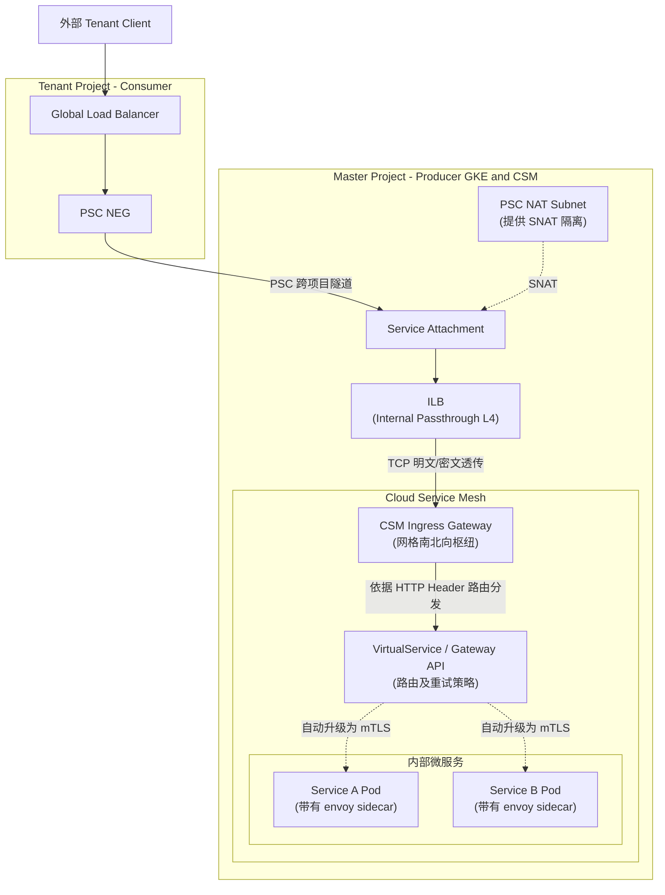

# 跨项目 PSC 结合 Cloud Service Mesh 架构部署指南

## 1. 架构演变背景

在现有的跨项目架构中，你已经通过 **PSC NEG** 成功打通了从 Tenant Project 到 Master Project 的流量路径。现在，你希望在 Master Project 的 GKE 集群中引入 **Cloud Service Mesh (CSM / Anthos Service Mesh)**，以实现更精细的流量治理、mTLS 加密传输和深度的可观测性。

### 核心结论
* **对于 Tenant Project (Consumer) 测：无需任何改变。** Tenant 项目仍然像原来一样通过 GLB 连接 PSC NEG。
* **对于 Master Project (Producer) 测：** PSC Service Attachment 依然保留，但它后端的 ILB (内部负载均衡) 不再直接指向具体的业务 Pod，而是指向 **Cloud Service Mesh 的 Ingress Gateway (网格入口网关)**。

---

## 2. 目标架构全景图

引入 Mesh 后的整体流量架构如下：



### 此架构的优势
1. **边界极其清晰**：Service Attachment 代表了网络边界，而 Ingress Gateway 代表了安全与路由分发边界。
2. **安全可控与防抖**：网格 Ingress Gateway 可作为“看门人”，统一进行 速率限制 (Rate Limiting)、二次身份验证 (JWT验证) 和统一 CORS 分发，后端业务微服务完全屏蔽复杂的外部网关逻辑。
3. **零信任网络**：流量一旦进入 Gateway，在网格集群内部向 Service A / Service B 的流转，会自动被强制加密成 mTLS 流量。

---

## 3. Master Project 具体实施与接入步骤

为了实现这个架构，在 Master Project 的 GKE 集群上方，你需要按顺序实施这些重要任务：

### 第一步：安装 Cloud Service Mesh (CSM) 底座
1. 将 Master GKE 集群注册到 Google Cloud Fleet（舰队管理）。
2. 使用 CSM 托管功能（Managed Anthos Service Mesh）配置集群，为命名空间打上如 `istio-injection=enabled` 之类的标签开启 Sidecar 注入机制。

### 第二步：部署 Mesh Ingress Gateway（接入核心）
你需要一个专用的 Deployment 承接所有外部流量。
使用 Kubernetes `Service` 暴露它，必须是 `LoadBalancer` 类型，且带有内部 LB 的 GCP 注解：

```yaml
apiVersion: v1
kind: Service
metadata:
  name: istio-ingressgateway
  namespace: istio-system  # 或是专门的网关命名空间
  annotations:
    # 强制创建 L4 Inernal Load Balancer
    networking.gke.io/load-balancer-type: "Internal"
    # (可选) 若有多网络，可指定 subnet
    # networking.gke.io/internal-load-balancer-subnet: "master-tier-subnet"
spec:
  type: LoadBalancer
  selector:
    # 匹配网关 Pod 的 Label
    app: istio-ingressgateway
  ports:
    - port: 80
      targetPort: 8080
      name: http2
    - port: 443
      targetPort: 8443
      name: https
```
此步骤会在 GCP 控制台中自动生成一个 **Internal Forwarding Rule**。

### 第三步：更新 PSC Service Attachment
把你新生成的那个 Ingress Gateway 的 Internal Forwarding Rule 的名字，绑定到 PSC Service Attachment 上。

```bash
gcloud compute service-attachments create master-mesh-attachment \
    --region=asia-east1 \
    --producer-forwarding-rule=YOUR_INGRESS_ILB_FWD_RULE \
    --connection-preference=ACCEPT_MANUAL \
    --nat-subnets=psc-nat-subnet \
    --consumer-accept-list=tenant-project-id=100
```
> **注意：** 你可以直接将之前指向某个业务后端的旧 Service Attachment 改成指向 Ingress Gateway，或者重新建一个新的配合新的 PSC NEG，实现平滑迁移替换。

### 第四步：配置网格内路由分发 (Istio CRD)
通过配置 `Gateway` 和 `VirtualService`，拦截到达 Ingress Gateway 的 HTTP/HTTPS 请求，并安全地内网流转到具体业务 Pod。

```yaml
# 1. 声明 Gateway 监听端口
apiVersion: networking.istio.io/v1beta1
kind: Gateway
metadata:
  name: master-ingress-gateway
spec:
  selector:
    app: istio-ingressgateway
  servers:
  - port:
      number: 80
      name: http
      protocol: HTTP
    hosts:
    - "*"  # 这里可以限制为某个具体的 Tenant 请求域名

---
# 2. 从 Gateway 分发给 Master 的微服务 A
apiVersion: networking.istio.io/v1beta1
kind: VirtualService
metadata:
  name: vs-route-to-service-a
spec:
  hosts:
  - "*"
  gateways:
  - master-ingress-gateway
  http:
  - match:
    - uri:
        prefix: /master-api/svc-a/
    route:
    - destination:
        host: service-a.application-ns.svc.cluster.local # 目标 Service
        port:
          number: 80
```

---

## 4. 与 Tenant通信模式解析：深度探讨

你提到"还可以跟我的 tenant project进行一些通信"。根据业务紧密程度，通常有两套通信模式。

### 模式一：API 网关南北向解耦模式 (当前采用，高度推荐)
- **原理**：正如上述架构，Tenant 把 Master 当纯粹的服务提供方。两者通过 GLB + PSC NEG + Mesh Ingress Gateway 进行标准的 HTTP API 调用。
- **优点**：极度松耦合、独立计费（Tenant 付 GLB 的钱，Master 付处理网关钱）、不存在重名冲突问题。即使 Tenant 是无服务器服务（Cloud Run 或非 GCP 资源），只要能连 PSC，都可以完美打通。

### 模式二：多集群 Mesh 联邦 (Multi-Cluster Mesh Federation) 东西向打通
- **原理**：如果 Tenant 项目也是 GKE，双方不通过 GLB+PSC 搞南北向调用，而是通过 Anthos Service Mesh 设置**多集群联邦网络**，建立东西向跨集群网关（East-West Gateway），实现直接通过服务名 `service-a.tenant-namespace.svc.cluster.local` 相互请求并建立 mTLS。
- **缺点与评估**：
  * 对网络连通性要求极高，控制面非常复杂。
  * 破坏了独立性边界（如果 Master 想进行版本大更新，需兼顾考量所有联通的 Tenant 集群控制面板的兼容性）。
  * 除非你们想把 Master 和 Tenant 变成一个超级大规模的联合微服务系统，**否则生产环境强烈不建议一开始上来就使用这种深耦合模式。** 
- **总结建议：** 坚持目前 PSC 的模式。Tenant 访问 Master 的网格用入口调用（南北向）。安全、隔离、维护成本都降到了最低。

---

## 5. Mesh 引入后的避坑指南 (Checklist)

1. **真实 Client IP 丢失问题 (SNAT 问题)**
   - 流量穿过 PSC 的 NAT Subnet 后，源 IP 会被转变成 PSC Subnet 内部的某个 IP。这导致 Master 端 Mesh 的 Ingress Gateway 看不出到底是谁（真实公网 IP 或客户端 IP）发来的。
   - **解决方式**：GLB 在最外侧往往会将真实客户端 IP 注入到 `X-Forwarded-For` HTTP Header 中（GLB 也会发送 `X-Forwarded-For`，即使经过 NEG 和 PSC 皆能保持该 HTTP Header）。需配置 Ingress Gateway 启用 `numTrustedProxies` 或者信任外部的 Header。

2. **健康检查层数加深的挑战**
   - GLB 探针 -> PSC -> ILB -> Ingress Gateway 的 Pod。
   - Ingress Gateway 默认提供了 `/healthz/ready` (端口 15021) 供 K8s 检查。建议你的 GLB Endpoint 的健康监控路径专门修改为此专门的路由，而不是探测具体的某个微服务接口，避免由于具体后端的偶发抖动引发整个通道被判定不可用。

3. **加密终结点选择**
   - **最佳性能做法:** GLB 上配置 SSL 证书做 HTTPS 卸载。GLB 走到 PSC -> ILB -> Gateway 是走后端的 HTTP（非加密协议）。进入 Ingress Gateway 之后，它会自动再用 Mesh 内部专属的 Envoy 证书对后续流量加设 mTLS 加密。这样即保证了证书放在 GLB 易于管理，又完成了内部链路的全面加密信任环境。
