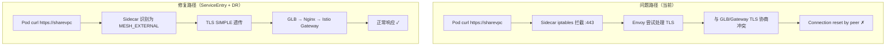

对于我的follow流，GCP 里面glb nginx+ istio gateway + runtime namespace 
curl sharevpc-fqnd.appdev.aibang/这个是没有任何问题的。这个意思就是说，我从外部访问这个地址，或者从其他地方访问这个地址，没有任何问题。
我现在遇到了这样一个问题。就是说，当我在我的Runtime Namespace Pod  call 这个一个入口URL域名的时候。curl https://sharevpc-fqnd.appdev.aibang  直接出现了下面这样的报错。但是有一点，就是说我的Pod访问其他域名，或者说其他的FQDN、其他的URL又是没有问题的。也就是说，只要不是我这个Gateway里边对应的资源，就是没有问题的。具体的报错大概是下面这样的。
当然，为了完整的测试，我将DNS的绑定，其实不仅仅是将IP让其解析到对应的Shared VPC的入口，我也让它访问到我的GitLab的入口，或者说让它访问到我的Cluster的IP，好像都是这样的报错。
> kubectl exec -n runtime-ns -it kafka-app01-toolbox-66db5954f-rq9tn -- curl -vvv https://sharevpc-fqnd.appdev.aibang/pmu-cicd-ms-proxy/v1/.well-known/health
* Host sharevpc-fqnd.appdev.aibang:443 was resolved.
* IPv6: (none)
* IPv4: 10.105.0.249
* Trying 10.105.0.249:443...
* Connected to sharevpc-fqnd.appdev.aibang (10.105.0.249) port 443
* ALPN: curl offers h2,http/1.1
* TLSv1.3 (OUT), TLS handshake, Client hello (1):
* CAfile: /etc/ssl/certs/ca-certificates.crt
* CApath: /etc/ssl/certs
* Recv failure: Connection reset by peer
* OpenSSL SSL_connect: Connection reset by peer in connection to sharevpc-fqnd.appdev.aibang:443
* Closing connection
curl: (35) Recv failure: Connection reset by peer
command terminated with exit code 35


## 🔍 问题分析

这是一个经典的 **hairpin / loopback 流量问题**。

核心矛盾：Pod 发出的请求，经过 GLB → Nginx → Istio Gateway 路由后，最终目标又回到了**同一个集群内**。Istio 的 Sidecar 在这条回环路径上干预了连接，导致 TLS 握手被 reset。

---

## 根本原因定位

```
Pod (runtime-ns)
  └─ curl https://sharevpc-fqnd.appdev.aibang
       └─ DNS → 10.105.0.249 (GLB/Nginx 入口 IP)
            └─ GLB → Nginx → Istio Gateway
                 └─ VirtualService 路由 → 回到 runtime-ns 的 Service
                      └─ ← Sidecar 拦截 → TLS reset ✗
```

你测试了三个 IP（Shared VPC 入口、GitLab 入口、Cluster IP），**都报同样错误**，这说明问题不在 DNS 解析，而在于：**从集群内部发出的流量，经过 Istio Sidecar 拦截后，与 Gateway 之间的 TLS 协商失败**。

具体有两个叠加原因：

**原因 A：Envoy Sidecar 对出站 HTTPS 流量的处理**

Pod 的 Sidecar 拦截了 `443` 出站流量，尝试对其做 TLS origination 或透传，但与 Gateway 侧的期望不匹配，导致握手 reset。

**原因 B：Istio 对 `*.appdev.aibang` 域名的 ServiceEntry 或 PassthroughCluster 行为**

如果没有显式的 `ServiceEntry` 声明这个外部域名，Istio 默认走 `PassthroughCluster`，但 Sidecar 的 iptables 会拦截 443 并尝试做处理，与直接透传产生冲突。

---

## 解决方案

有三种方案，按推荐优先级排列：

### 方案一（推荐）：为域名创建 ServiceEntry，声明为外部直通

```yaml
apiVersion: networking.istio.io/v1beta1
kind: ServiceEntry
metadata:
  name: sharevpc-external-entry
  namespace: runtime-ns        # 在 runtime namespace 下生效
spec:
  hosts:
  - "sharevpc-fqnd.appdev.aibang"
  ports:
  - number: 443
    name: https
    protocol: HTTPS
  location: MESH_EXTERNAL      # 声明为网格外部服务
  resolution: DNS
```

这告诉 Istio：这个域名是外部服务，Sidecar 不要干预其 TLS，直接透传。

---

### 方案二：配合 DestinationRule 明确 TLS 透传

仅 ServiceEntry 有时不够，需要同时告诉 Sidecar 如何处理出站 TLS：

```yaml
apiVersion: networking.istio.io/v1beta1
kind: DestinationRule
metadata:
  name: sharevpc-external-dr
  namespace: runtime-ns
spec:
  host: "sharevpc-fqnd.appdev.aibang"
  trafficPolicy:
    tls:
      mode: SIMPLE              # Sidecar 发起标准单向 TLS，不做 mTLS
      # 如果证书是自签的，加下面两行
      # insecureSkipVerify: true
```

---

### 方案三：Sidecar 资源排除出站拦截（适合整个 namespace 级别控制）

如果 runtime-ns 的 Pod 需要大量访问外部 HTTPS 服务，可以用 `Sidecar` 资源精确控制出站范围：

```yaml
apiVersion: networking.istio.io/v1beta1
kind: Sidecar
metadata:
  name: runtime-ns-sidecar
  namespace: runtime-ns
spec:
  egress:
  - hosts:
    - "./*"                     # 网格内部所有服务（正常 mTLS）
    - "istio-system/*"
    - "istio-ingressgateway-int/*"
  outboundTrafficPolicy:
    mode: REGISTRY_ONLY         # 只允许 ServiceEntry 中注册的外部服务
```

与方案一配合，`REGISTRY_ONLY` 确保只有显式声明的外部服务才可访问，安全性更高。

---

## 排查步骤

先确认具体是哪一层的问题：

```bash
# Step 1: 检查 Istio 对这个域名的路由决策
kubectl exec -n runtime-ns <pod> -c istio-proxy -- \
  pilot-agent request GET clusters | grep sharevpc

# Step 2: 检查出站流量的 listener 配置
kubectl exec -n runtime-ns <pod> -c istio-proxy -- \
  pilot-agent request GET listeners | grep -A5 "0.0.0.0_443"

# Step 3: 查看 Sidecar 的实时访问日志（看 reset 发生在哪段）
kubectl logs -n runtime-ns <pod> -c istio-proxy --tail=50 | grep sharevpc

# Step 4: 确认当前 outboundTrafficPolicy
kubectl get meshconfig -n istio-system istio -o jsonpath='{.spec.meshConfig.outboundTrafficPolicy}'
```

---

## 流量路径对比



---

## ⚠️ 注意事项

1. **ServiceEntry 的 namespace 范围**：如果多个 namespace 的 Pod 都需要访问这个域名，建议把 ServiceEntry 放在 `istio-system` 下，这样全局生效。

2. **`outboundTrafficPolicy` 默认值确认**：如果你的 mesh 配置是 `REGISTRY_ONLY`，那所有未在 ServiceEntry 中声明的外部域名都会被拦截，必须显式注册。如果是 `ALLOW_ANY`（默认），ServiceEntry 不是必须的，但 DestinationRule 里的 `tls.mode: SIMPLE` 仍然需要。

3. **这不是 hairpin NAT 问题**：虽然流量绕了一圈回到集群，但 GKE 的 kube-proxy 可以处理这种回环。真正的根因是 Istio Sidecar 在出站 443 上的 TLS 干预


需要更多信息来精准定位。先跑几个诊断命令，看看 Sidecar 实际上对这个域名做了什么决策：

```bash
# 1. 确认 ServiceEntry 和 DR 已经下发到 Sidecar
kubectl exec -n runtime-ns <pod> -c istio-proxy -- \
  pilot-agent request GET clusters 2>/dev/null | grep -i sharevpc

# 2. 查看 443 端口的 outbound listener 类型
kubectl exec -n runtime-ns <pod> -c istio-proxy -- \
  pilot-agent request GET listeners 2>/dev/null \
  | python3 -c "
import sys,json
data=json.load(sys.stdin)
for l in data:
  name=l.get('name','')
  if '443' in name or 'sharevpc' in name.lower():
    print(json.dumps(l,indent=2))
" 2>/dev/null | head -80

# 3. 查看 Sidecar 的实时出站日志（另开一个终端先跑这个，再 curl）
kubectl logs -n runtime-ns <pod> -c istio-proxy -f | grep -E "sharevpc|443|reset|UF|UC|URX"

# 4. 最关键：看 istio-proxy 的 access log 里 response_flag 是什么
kubectl exec -n runtime-ns <pod> -c istio-proxy -- \
  pilot-agent request GET stats | grep -E "sharevpc|ssl.handshake|ssl.connection_error"

# 5. 确认 outboundTrafficPolicy 全局设置
kubectl get configmap istio -n istio-system -o jsonpath='{.data.mesh}' | grep -A3 outbound
```

把上面命令的输出贴出来，重点是命令 1、2、3 的结果。在你跑诊断的同时，我需要再确认几个关键信息：等你的选择和诊断输出。在等待的同时，补充一个**最常见的遗漏点**——即使 ServiceEntry + DR 配置正确，有一个场景会让它们完全失效：

---

## 高概率遗漏：IP 直连绕过了 SNI 匹配

你的 curl 输出里有这一行：

```
* IPv4: 10.105.0.249
* Trying 10.105.0.249:443...
```

Istio 的 ServiceEntry（`resolution: DNS`）是基于**域名**匹配路由的。但 Sidecar 的 iptables 拦截是基于**目标 IP + 端口**的。

当流量被拦截后，Envoy 需要从 SNI（TLS ClientHello 里的域名）反查到对应的 Cluster，才能应用你的 DR 规则。如果这个 `10.105.0.249` 同时也是集群内某个 Service 的 ClusterIP 或者被其他规则匹配，DR 就不会生效。

**验证这个假设：**

```bash
# 看这个 IP 在 Envoy 路由表里命中了什么 cluster
kubectl exec -n runtime-ns <pod> -c istio-proxy -- \
  pilot-agent request GET clusters 2>/dev/null \
  | grep "10.105.0.249"

# 看 443 的 outbound listener，是 SNI-based routing 还是 TCP passthrough
kubectl exec -n runtime-ns <pod> -c istio-proxy -- \
  pilot-agent request GET config_dump 2>/dev/null \
  | python3 -c "
import sys,json
d=json.load(sys.stdin)
for sec in d.get('configs',[]):
  if sec.get('@type','').endswith('ListenersConfigDump'):
    for l in sec.get('dynamic_listeners',[]):
      name = l.get('active_state',{}).get('listener',{}).get('name','')
      if '443' in name:
        print(json.dumps(l,indent=2))
" 2>/dev/null | head -100
```

---

## 另一个高概率原因：`resolution: DNS` 下 Envoy 会主动解析域名并建新连接

使用 `resolution: DNS` 时，Envoy 会**自己 DNS 解析**这个域名然后直连，而不是透传原始连接。这意味着：

- 如果目标是 GLB（有自己的 TLS 证书），Envoy 用 `SIMPLE` TLS 去连，正常
- 但如果目标 IP 恰好也是集群内的某个入口（比如你测试的 Cluster IP），Envoy 连上去后对端是 Istio Gateway，Gateway 期望的是带正确 SNI 的 TLS 握手，但 Envoy 发出的 ClientHello 可能不携带正确的 SNI 或使用了错误的证书验证逻辑

**可以先用这个最小化测试排除 Sidecar 干扰：**

```bash
# 完全绕过 Sidecar，直接从 Pod 网络栈发出请求
# traffic.sidecar.istio.io/excludeOutboundIPRanges 临时排除这个 IP
kubectl exec -n runtime-ns <pod> -- \
  curl -vvv --connect-timeout 5 \
  --resolve sharevpc-fqnd.appdev.aibang:443:10.105.0.249 \
  https://sharevpc-fqnd.appdev.aibang/pmu-cicd-ms-proxy/v1/.well-known/health \
  2>&1 | head -30
```

如果这个还是 reset，问题就**不在 Istio**，而在 GLB/Nginx/Gateway 本身拒绝了来自集群内的请求（比如 Cloud Armor 规则、或者 GLB 的 backend health check 把集群内 IP 列为不可信来源）。

如果这个**成功了**，100% 确认是 Sidecar 干扰，再针对性修 ServiceEntry/DR。


好眼力，这个细节非常关键。我之前的分析方向需要修正。

---

## 重新定位问题

你测试了三个完全不同的入口 IP：

| 入口                  | IP 类型   | 结果  |
| --------------------- | --------- | ----- |
| GLB / Shared VPC 入口 | 外部 IP   | reset |
| GitLab Ingress 入口   | 另一个 IP | reset |
| Cluster IP            | 集群内 IP | reset |

三个 IP 都报同样的 `Connection reset by peer`，**这说明问题根本不在目标端，而在出发端——就是 Pod 自身的 Sidecar 在出站 443 上统一做了某种拦截或干预。**

ServiceEntry + DR 没有解决问题，是因为**根本原因不是路由匹配问题，而是 Sidecar 对所有出站 443 流量的处理方式**。

---

## 真正的根因：出站 443 listener 的 TLS 检测冲突

当你的 Pod Sidecar 拦截出站 `443` 流量时，Envoy 会对这个端口上的流量做 **`auto` 协议探测**。

问题在于：**你的 Pod 发出的是明文 HTTP 到 8443（内部），但对外的 443 请求是 HTTPS（TLS）。** Sidecar 的出站 listener 在 443 上如果被配置为 `HTTP` 或者做了 `HTTP_INSPECTOR`，它会把你的 TLS ClientHello 当成 HTTP 来解析，直接 reset 连接。

**验证这一点：**

```bash
# 查看 0.0.0.0_443 这个 outbound listener 的完整配置
kubectl exec -n runtime-ns <pod> -c istio-proxy -- \
  pilot-agent request GET config_dump 2>/dev/null | \
  python3 -c "
import sys, json
d = json.load(sys.stdin)
for sec in d.get('configs', []):
  t = sec.get('@type', '')
  if 'ListenersConfigDump' in t:
    for l in sec.get('dynamic_listeners', []):
      name = l.get('active_state', {}).get('listener', {}).get('name', '')
      if name == '0.0.0.0_443':
        print(json.dumps(l, indent=2))
"
```

重点看输出里有没有这个字段：

```json
"listener_filters": [
  { "name": "envoy.filters.listener.http_inspector" }
]
```

如果有 `http_inspector`，这就是根因。

---

## 解决方案：强制声明 443 为 TLS 透传

不管目标是谁，只要出站走 443，都应该是 TLS 透传而不是 HTTP 处理。

### 方案 A：在 runtime-ns 级别声明 443 端口协议为 TLS

```yaml
apiVersion: networking.istio.io/v1beta1
kind: ServiceEntry
metadata:
  name: external-https-443
  namespace: runtime-ns
spec:
  hosts:
  - "*.appdev.aibang"          # 匹配你所有的外部域名
  ports:
  - number: 443
    name: tls                   # 关键：声明为 tls 而不是 https
    protocol: TLS               # TLS = 透传，HTTPS = Envoy 解析
  location: MESH_EXTERNAL
  resolution: NONE              # NONE = 不做 DNS 解析，直接透传原始连接
```

`resolution: NONE` + `protocol: TLS` 的组合告诉 Envoy：**不要碰这个流量，直接透传**。

---

### 方案 B：用 Sidecar 资源把 443 出站完全排除拦截

```yaml
apiVersion: networking.istio.io/v1beta1
kind: Sidecar
metadata:
  name: runtime-ns-egress
  namespace: runtime-ns
spec:
  egress:
  - port:
      number: 443
      protocol: TLS             # 声明协议，让 iptables 规则正确处理
    hosts:
    - "runtime-ns/*"
    - "istio-ingressgateway-int/*"
    - "istio-system/*"
    - "*/*.appdev.aibang"
  outboundTrafficPolicy:
    mode: ALLOW_ANY
```

---

### 方案 C（最快验证）：给 Pod 加注解，临时排除 443 出站拦截

在 Pod 或 Deployment 上加这个 annotation，让 iptables **完全不拦截**出站 443：

```yaml
# 在 Deployment spec.template.metadata.annotations 下加
annotations:
  traffic.sidecar.istio.io/excludeOutboundPorts: "443"
```

**这个方案会让所有出站 443 完全绕过 Sidecar**，安全上有取舍，但可以用来**快速验证根因**——如果加了这个注解后 curl 成功，100% 确认是 Sidecar 出站 443 的问题，再用方案 A/B 精细化处理。

---

## 排查优先级建议

```
第一步：加注解 excludeOutboundPorts: "443" 重启 Pod 验证
    ↓ 成功 → 根因确认，用方案 A 修复
    ↓ 还是 reset → 问题在 Pod 外部（NetworkPolicy 或上游拒绝）

第二步：查 0.0.0.0_443 listener 配置，确认有没有 http_inspector

第三步：换方案 A（resolution: NONE + protocol: TLS）替换之前的 ServiceEntry
```

先跑方案 C 的注解测试，结果出来我们就能确定方向。