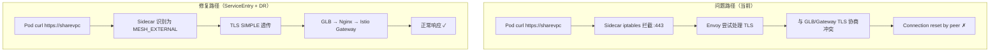

对于我的follow流，GCP 里面glb nginx+ istio gateway + runtime namespace 
curl sharevpc-fqnd.appdev.aibang/这个是没有任何问题的。这个意思就是说，我从外部访问这个地址，或者从其他地方访问这个地址，没有任何问题。
我现在遇到了这样一个问题。就是说，当我在我的Runtime Namespace Pod  call 这个一个入口URL域名的时候。curl https://sharevpc-fqnd.appdev.aibang  直接出现了下面这样的报错。但是有一点，就是说我的Pod访问其他域名，或者说其他的FQDN、其他的URL又是没有问题的。也就是说，只要不是我这个Gateway里边对应的资源，就是没有问题的。具体的报错大概是下面这样的。
当然，为了完整的测试，我将DNS的绑定，其实不仅仅是将IP让其解析到对应的Shared VPC的入口，我也让它访问到我的GitLab的入口，或者说让它访问到我的Cluster的IP，好像都是这样的报错。
> kubectl exec -n runtime-ns -it kafka-app01-toolbox-66db5954f-rq9tn -- curl -vvv https://sharevpc-fqnd.appdev.aibang/pmu-cicd-ms-proxy/v1/.well-known/health
* Host sharevpc-fqnd.appdev.aibang:443 was resolved.
* IPv6: (none)
* IPv4: 10.105.0.249
* Trying 10.105.0.249:443...
* Connected to sharevpc-fqnd.appdev.aibang (10.105.0.249) port 443
* ALPN: curl offers h2,http/1.1
* TLSv1.3 (OUT), TLS handshake, Client hello (1):
* CAfile: /etc/ssl/certs/ca-certificates.crt
* CApath: /etc/ssl/certs
* Recv failure: Connection reset by peer
* OpenSSL SSL_connect: Connection reset by peer in connection to sharevpc-fqnd.appdev.aibang:443
* Closing connection
curl: (35) Recv failure: Connection reset by peer
command terminated with exit code 35


## 🔍 问题分析

这是一个经典的 **hairpin / loopback 流量问题**。

核心矛盾：Pod 发出的请求，经过 GLB → Nginx → Istio Gateway 路由后，最终目标又回到了**同一个集群内**。Istio 的 Sidecar 在这条回环路径上干预了连接，导致 TLS 握手被 reset。

---

## 根本原因定位

```
Pod (runtime-ns)
  └─ curl https://sharevpc-fqnd.appdev.aibang
       └─ DNS → 10.105.0.249 (GLB/Nginx 入口 IP)
            └─ GLB → Nginx → Istio Gateway
                 └─ VirtualService 路由 → 回到 runtime-ns 的 Service
                      └─ ← Sidecar 拦截 → TLS reset ✗
```

你测试了三个 IP（Shared VPC 入口、GitLab 入口、Cluster IP），**都报同样错误**，这说明问题不在 DNS 解析，而在于：**从集群内部发出的流量，经过 Istio Sidecar 拦截后，与 Gateway 之间的 TLS 协商失败**。

具体有两个叠加原因：

**原因 A：Envoy Sidecar 对出站 HTTPS 流量的处理**

Pod 的 Sidecar 拦截了 `443` 出站流量，尝试对其做 TLS origination 或透传，但与 Gateway 侧的期望不匹配，导致握手 reset。

**原因 B：Istio 对 `*.appdev.aibang` 域名的 ServiceEntry 或 PassthroughCluster 行为**

如果没有显式的 `ServiceEntry` 声明这个外部域名，Istio 默认走 `PassthroughCluster`，但 Sidecar 的 iptables 会拦截 443 并尝试做处理，与直接透传产生冲突。

---

## 解决方案

有三种方案，按推荐优先级排列：

### 方案一（推荐）：为域名创建 ServiceEntry，声明为外部直通

```yaml
apiVersion: networking.istio.io/v1beta1
kind: ServiceEntry
metadata:
  name: sharevpc-external-entry
  namespace: runtime-ns        # 在 runtime namespace 下生效
spec:
  hosts:
  - "sharevpc-fqnd.appdev.aibang"
  ports:
  - number: 443
    name: https
    protocol: HTTPS
  location: MESH_EXTERNAL      # 声明为网格外部服务
  resolution: DNS
```

这告诉 Istio：这个域名是外部服务，Sidecar 不要干预其 TLS，直接透传。

---

### 方案二：配合 DestinationRule 明确 TLS 透传

仅 ServiceEntry 有时不够，需要同时告诉 Sidecar 如何处理出站 TLS：

```yaml
apiVersion: networking.istio.io/v1beta1
kind: DestinationRule
metadata:
  name: sharevpc-external-dr
  namespace: runtime-ns
spec:
  host: "sharevpc-fqnd.appdev.aibang"
  trafficPolicy:
    tls:
      mode: SIMPLE              # Sidecar 发起标准单向 TLS，不做 mTLS
      # 如果证书是自签的，加下面两行
      # insecureSkipVerify: true
```

---

### 方案三：Sidecar 资源排除出站拦截（适合整个 namespace 级别控制）

如果 runtime-ns 的 Pod 需要大量访问外部 HTTPS 服务，可以用 `Sidecar` 资源精确控制出站范围：

```yaml
apiVersion: networking.istio.io/v1beta1
kind: Sidecar
metadata:
  name: runtime-ns-sidecar
  namespace: runtime-ns
spec:
  egress:
  - hosts:
    - "./*"                     # 网格内部所有服务（正常 mTLS）
    - "istio-system/*"
    - "istio-ingressgateway-int/*"
  outboundTrafficPolicy:
    mode: REGISTRY_ONLY         # 只允许 ServiceEntry 中注册的外部服务
```

与方案一配合，`REGISTRY_ONLY` 确保只有显式声明的外部服务才可访问，安全性更高。

---

## 排查步骤

先确认具体是哪一层的问题：

```bash
# Step 1: 检查 Istio 对这个域名的路由决策
kubectl exec -n runtime-ns <pod> -c istio-proxy -- \
  pilot-agent request GET clusters | grep sharevpc

# Step 2: 检查出站流量的 listener 配置
kubectl exec -n runtime-ns <pod> -c istio-proxy -- \
  pilot-agent request GET listeners | grep -A5 "0.0.0.0_443"

# Step 3: 查看 Sidecar 的实时访问日志（看 reset 发生在哪段）
kubectl logs -n runtime-ns <pod> -c istio-proxy --tail=50 | grep sharevpc

# Step 4: 确认当前 outboundTrafficPolicy
kubectl get meshconfig -n istio-system istio -o jsonpath='{.spec.meshConfig.outboundTrafficPolicy}'
```

---

## 流量路径对比



---

## ⚠️ 注意事项

1. **ServiceEntry 的 namespace 范围**：如果多个 namespace 的 Pod 都需要访问这个域名，建议把 ServiceEntry 放在 `istio-system` 下，这样全局生效。

2. **`outboundTrafficPolicy` 默认值确认**：如果你的 mesh 配置是 `REGISTRY_ONLY`，那所有未在 ServiceEntry 中声明的外部域名都会被拦截，必须显式注册。如果是 `ALLOW_ANY`（默认），ServiceEntry 不是必须的，但 DestinationRule 里的 `tls.mode: SIMPLE` 仍然需要。

3. **这不是 hairpin NAT 问题**：虽然流量绕了一圈回到集群，但 GKE 的 kube-proxy 可以处理这种回环。真正的根因是 Istio Sidecar 在出站 443 上的 TLS 干预


需要更多信息来精准定位。先跑几个诊断命令，看看 Sidecar 实际上对这个域名做了什么决策：

```bash
# 1. 确认 ServiceEntry 和 DR 已经下发到 Sidecar
kubectl exec -n runtime-ns <pod> -c istio-proxy -- \
  pilot-agent request GET clusters 2>/dev/null | grep -i sharevpc

# 2. 查看 443 端口的 outbound listener 类型
kubectl exec -n runtime-ns <pod> -c istio-proxy -- \
  pilot-agent request GET listeners 2>/dev/null \
  | python3 -c "
import sys,json
data=json.load(sys.stdin)
for l in data:
  name=l.get('name','')
  if '443' in name or 'sharevpc' in name.lower():
    print(json.dumps(l,indent=2))
" 2>/dev/null | head -80

# 3. 查看 Sidecar 的实时出站日志（另开一个终端先跑这个，再 curl）
kubectl logs -n runtime-ns <pod> -c istio-proxy -f | grep -E "sharevpc|443|reset|UF|UC|URX"

2026-04-15T11:39:30.852492Z info xdsproxy connected to upstream XDS server: meshconfig.googleapis.com443
[2026-04-15T12:03:21.043Z] "- - -" 0 UF,URX - - "TLS_error:|
268435588:SSL_routines:OPENSSL_internal:CLIENTHELLO_TLSEXT|
268435646:SSL_routines:OPENSSL_internal:PARSE_TLSEXT:TLS_error_end" 0 0 10002 - "-" "-" "-" "-" "100.68.34.241:443"
outbound|443||sharevpc-fqnd.appdev.aibang - 10.105.0.249:443
100.64.3.68:49884 sharevpc-fqnd.appdev.aibang -
[2026-04-15T12:04:59.409Z] "- - -" 0 - - - "-" 731 3578 61055 -
"-" "-" "-" "-" "10.88.0.162:443" PassthroughCluster
100.64.3.68:52438 10.88.0.162:443 100.64.3.68:52428 dev-api.aliyun.cloud.xg.aibang -
[2026-04-15T12:14:32.406Z] "- - -" 0 UF,URX - - "TLS_error:|
268435588:SSL_routines:OPENSSL_internal:CLIENTHELLO_TLSEXT|
268435646:SSL_routines:OPENSSL_internal:PARSE_TLSEXT:TLS_error_end" 0 0 10004 - "-" "-" "-" "-" "100.68.34.241:443"
outbound|443||sharevpc-fqnd.appdev.aibang - 10.105.0.249:443
100.64.3.68:41690 sharevpc-fqnd.appdev.aibang -
[2026-04-15T12:15:13.918Z] "- - -" 0 UF,URX - - "TLS_error:|
268435588:SSL_routines:OPENSSL_internal:CLIENTHELLO_TLSEXT|
268435646:SSL_routines:OPENSSL_internal:PARSE_TLSEXT:TLS_error_end" 0 0 10001 - "-" "-" "-" "-" "100.68.34.241:443"
outbound|443||sharevpc-fqnd.appdev.aibang - 10.105.0.249:443
100.64.3.68:56902 sharevpc-fqnd.appdev.aibang -


# 4. 最关键：看 istio-proxy 的 access log 里 response_flag 是什么
kubectl exec -n runtime-ns <pod> -c istio-proxy -- \
  pilot-agent request GET stats | grep -E "sharevpc|ssl.handshake|ssl.connection_error"

# 5. 确认 outboundTrafficPolicy 全局设置
kubectl get configmap istio -n istio-system -o jsonpath='{.data.mesh}' | grep -A3 outbound
```

把上面命令的输出贴出来，重点是命令 1、2、3 的结果。在你跑诊断的同时，我需要再确认几个关键信息：等你的选择和诊断输出。在等待的同时，补充一个**最常见的遗漏点**——即使 ServiceEntry + DR 配置正确，有一个场景会让它们完全失效：

---

## 高概率遗漏：IP 直连绕过了 SNI 匹配

你的 curl 输出里有这一行：

```
* IPv4: 10.105.0.249
* Trying 10.105.0.249:443...
```

Istio 的 ServiceEntry（`resolution: DNS`）是基于**域名**匹配路由的。但 Sidecar 的 iptables 拦截是基于**目标 IP + 端口**的。

当流量被拦截后，Envoy 需要从 SNI（TLS ClientHello 里的域名）反查到对应的 Cluster，才能应用你的 DR 规则。如果这个 `10.105.0.249` 同时也是集群内某个 Service 的 ClusterIP 或者被其他规则匹配，DR 就不会生效。

**验证这个假设：**

```bash
# 看这个 IP 在 Envoy 路由表里命中了什么 cluster
kubectl exec -n runtime-ns <pod> -c istio-proxy -- \
  pilot-agent request GET clusters 2>/dev/null \
  | grep "10.105.0.249"

# 看 443 的 outbound listener，是 SNI-based routing 还是 TCP passthrough
kubectl exec -n runtime-ns <pod> -c istio-proxy -- \
  pilot-agent request GET config_dump 2>/dev/null \
  | python3 -c "
import sys,json
d=json.load(sys.stdin)
for sec in d.get('configs',[]):
  if sec.get('@type','').endswith('ListenersConfigDump'):
    for l in sec.get('dynamic_listeners',[]):
      name = l.get('active_state',{}).get('listener',{}).get('name','')
      if '443' in name:
        print(json.dumps(l,indent=2))
" 2>/dev/null | head -100
```

---

## 另一个高概率原因：`resolution: DNS` 下 Envoy 会主动解析域名并建新连接

使用 `resolution: DNS` 时，Envoy 会**自己 DNS 解析**这个域名然后直连，而不是透传原始连接。这意味着：

- 如果目标是 GLB（有自己的 TLS 证书），Envoy 用 `SIMPLE` TLS 去连，正常
- 但如果目标 IP 恰好也是集群内的某个入口（比如你测试的 Cluster IP），Envoy 连上去后对端是 Istio Gateway，Gateway 期望的是带正确 SNI 的 TLS 握手，但 Envoy 发出的 ClientHello 可能不携带正确的 SNI 或使用了错误的证书验证逻辑

**可以先用这个最小化测试排除 Sidecar 干扰：**

```bash
# 完全绕过 Sidecar，直接从 Pod 网络栈发出请求
# traffic.sidecar.istio.io/excludeOutboundIPRanges 临时排除这个 IP
kubectl exec -n runtime-ns <pod> -- \
  curl -vvv --connect-timeout 5 \
  --resolve sharevpc-fqnd.appdev.aibang:443:10.105.0.249 \
  https://sharevpc-fqnd.appdev.aibang/pmu-cicd-ms-proxy/v1/.well-known/health \
  2>&1 | head -30
```

如果这个还是 reset，问题就**不在 Istio**，而在 GLB/Nginx/Gateway 本身拒绝了来自集群内的请求（比如 Cloud Armor 规则、或者 GLB 的 backend health check 把集群内 IP 列为不可信来源）。

如果这个**成功了**，100% 确认是 Sidecar 干扰，再针对性修 ServiceEntry/DR。


好眼力，这个细节非常关键。我之前的分析方向需要修正。

---

## 重新定位问题

你测试了三个完全不同的入口 IP：

| 入口                  | IP 类型   | 结果  |
| --------------------- | --------- | ----- |
| GLB / Shared VPC 入口 | 外部 IP   | reset |
| GitLab Ingress 入口   | 另一个 IP | reset |
| Cluster IP            | 集群内 IP | reset |

三个 IP 都报同样的 `Connection reset by peer`，**这说明问题根本不在目标端，而在出发端——就是 Pod 自身的 Sidecar 在出站 443 上统一做了某种拦截或干预。**

ServiceEntry + DR 没有解决问题，是因为**根本原因不是路由匹配问题，而是 Sidecar 对所有出站 443 流量的处理方式**。

---

## 真正的根因：出站 443 listener 的 TLS 检测冲突

当你的 Pod Sidecar 拦截出站 `443` 流量时，Envoy 会对这个端口上的流量做 **`auto` 协议探测**。

问题在于：**你的 Pod 发出的是明文 HTTP 到 8443（内部），但对外的 443 请求是 HTTPS（TLS）。** Sidecar 的出站 listener 在 443 上如果被配置为 `HTTP` 或者做了 `HTTP_INSPECTOR`，它会把你的 TLS ClientHello 当成 HTTP 来解析，直接 reset 连接。

**验证这一点：**

```bash
# 查看 0.0.0.0_443 这个 outbound listener 的完整配置
kubectl exec -n runtime-ns <pod> -c istio-proxy -- \
  pilot-agent request GET config_dump 2>/dev/null | \
  python3 -c "
import sys, json
d = json.load(sys.stdin)
for sec in d.get('configs', []):
  t = sec.get('@type', '')
  if 'ListenersConfigDump' in t:
    for l in sec.get('dynamic_listeners', []):
      name = l.get('active_state', {}).get('listener', {}).get('name', '')
      if name == '0.0.0.0_443':
        print(json.dumps(l, indent=2))
"
```

重点看输出里有没有这个字段：

```json
"listener_filters": [
  { "name": "envoy.filters.listener.http_inspector" }
]
```

如果有 `http_inspector`，这就是根因。

---

## 解决方案：强制声明 443 为 TLS 透传

不管目标是谁，只要出站走 443，都应该是 TLS 透传而不是 HTTP 处理。

### 方案 A：在 runtime-ns 级别声明 443 端口协议为 TLS

```yaml
apiVersion: networking.istio.io/v1beta1
kind: ServiceEntry
metadata:
  name: external-https-443
  namespace: runtime-ns
spec:
  hosts:
  - "*.appdev.aibang"          # 匹配你所有的外部域名
  ports:
  - number: 443
    name: tls                   # 关键：声明为 tls 而不是 https
    protocol: TLS               # TLS = 透传，HTTPS = Envoy 解析
  location: MESH_EXTERNAL
  resolution: NONE              # NONE = 不做 DNS 解析，直接透传原始连接
```

`resolution: NONE` + `protocol: TLS` 的组合告诉 Envoy：**不要碰这个流量，直接透传**。

---

### 方案 B：用 Sidecar 资源把 443 出站完全排除拦截

```yaml
apiVersion: networking.istio.io/v1beta1
kind: Sidecar
metadata:
  name: runtime-ns-egress
  namespace: runtime-ns
spec:
  egress:
  - port:
      number: 443
      protocol: TLS             # 声明协议，让 iptables 规则正确处理
    hosts:
    - "runtime-ns/*"
    - "istio-ingressgateway-int/*"
    - "istio-system/*"
    - "*/*.appdev.aibang"
  outboundTrafficPolicy:
    mode: ALLOW_ANY
```

---

### 方案 C（最快验证）：给 Pod 加注解，临时排除 443 出站拦截

在 Pod 或 Deployment 上加这个 annotation，让 iptables **完全不拦截**出站 443：

```yaml
# 在 Deployment spec.template.metadata.annotations 下加
annotations:
  traffic.sidecar.istio.io/excludeOutboundPorts: "443"
```

**这个方案会让所有出站 443 完全绕过 Sidecar**，安全上有取舍，但可以用来**快速验证根因**——如果加了这个注解后 curl 成功，100% 确认是 Sidecar 出站 443 的问题，再用方案 A/B 精细化处理。

---

## 排查优先级建议

```
第一步：加注解 excludeOutboundPorts: "443" 重启 Pod 验证
    ↓ 成功 → 根因确认，用方案 A 修复
    ↓ 还是 reset → 问题在 Pod 外部（NetworkPolicy 或上游拒绝）

第二步：查 0.0.0.0_443 listener 配置，确认有没有 http_inspector

第三步：换方案 A（resolution: NONE + protocol: TLS）替换之前的 ServiceEntry
```

先跑方案 C 的注解测试，结果出来我们就能确定方向。

---

## 针对你提供的 Envoy 报错日志深度解析

你刚刚提供的 Envoy Access Log:

```text
[2026-04-15T12:15:13.918Z] "- - -" 0 UF,URX - - "TLS_error:|268435588:SSL_routines:OPENSSL_internal:CLIENTHELLO_TLSEXT|268435646:SSL_routines:OPENSSL_internal:PARSE_TLSEXT:TLS_error_end" 0 0 10001 - "-" "-" "-" "-" "100.68.34.241:443"
outbound|443||sharevpc-fqnd.appdev.aibang - 10.105.0.249:443 100.64.3.68:56902 sharevpc-fqnd.appdev.aibang -
```

这个日志释放了**三个极其关键的信号**，它印证了我之前的一个猜测，并且直接把问题原因暴露出来了：

### 1. `outbound|443||sharevpc-fqnd.appdev.aibang` (路由成功了！)
日志证明 Sidecar **成功拦截并在路由表里匹配到了这个域名**。
这说明：你的 `ServiceEntry` 是生效的。Envoy 知道这笔流量是要发给 `sharevpc-fqnd.appdev.aibang` 的 `443` 端口，并且它把目的地解析成了 `10.105.0.249`。

### 2. `UF,URX` (上游连接失败)
* `UF` (Upstream Connection Failure): Envoy 作为客户端，试图去连接 GLB (`10.105.0.249:443`)，但是失败了或者连接立刻被断开了。
* `URX` (Upstream Retry Limit Exceeded): Envoy 尝试了重试但仍然失败。

### 3. `SSL_routines:OPENSSL_internal:CLIENTHELLO_TLSEXT...PARSE_TLSEXT:TLS_error_end`
这是重中之重。这是一个 OpenSSL 底层的**TLS 握手解析错误 (Parse Extension Error)**。

为什么 Envoy 在去连接你的 GLB 时，会报 `PARSE_TLSEXT` 错误？

**核心矛盾爆发点（Double TLS 冲突 / TLS 协议误判）：**
当你在 Pod 里执行 `curl https://...` 时，`curl` 本身发出了一个 `TLS ClientHello`。
由于流量命中了 `outbound|443`，Istio Sidecar 有两种可能的错误行为导致了这个报错：

* **情景 A（双重 TLS）**：你的某个 `DestinationRule` 或者是全局默认把这个对外的连接配置成了 `tls.mode: SIMPLE` 或尝试发起 mTLS。这导致 Envoy 试图拿 `curl` 的数据去包一层 Envoy 自己的 TLS。
* **情景 B（TLS Inspector 把 HTTPS 当作明文处理了）**：在你的 `ServiceEntry` 配置里，你可能把 port 的 `protocol` 写成了 `HTTPS`。在 Istio 的语义里，如果把外部服务的端口协议声明为 `HTTPS`，Istio 认为“流量在到达 Sidecar 之前是 HTTP 的，需要 Sidecar 来代理加密”。但实际上你的 `curl` 已经在发 TLS（HTTPS）连接了！于是 Envoy 的底层 TLS 解析引擎被这个实际上是 TLS 却当作别的东西（或反之）的数据包搞崩溃了。

### 💡 结论与精准修复措施

这个报错 **100% 说明 Sidecar 参与了 TLS 握手或者试图干预 TLS**，而没有乖乖地做“TCP/TLS 盲透传”。

你的 `ServiceEntry` 或者对应的配置让 Envoy 做错了一件事：它介入了原本应该直接由 `curl` 与 `GLB` 完成的 TLS。

**修复方案（方案 A 的终极形态）：**

你必须让这个 `ServiceEntry` 的端口协议变成纯纯的 `TLS` (盲透传)，并且不让 Sidecar 做任何多余的 TLS 工作。修改你的 `ServiceEntry` 如下：

```yaml
apiVersion: networking.istio.io/v1beta1
kind: ServiceEntry
metadata:
  name: sharevpc-external-entry
  namespace: runtime-ns
spec:
  hosts:
  - "sharevpc-fqnd.appdev.aibang"
  ports:
  - number: 443
    name: tls-443              # 【关键】名字以 tls- 打头
    protocol: TLS              # 【关键】必须用 TLS，绝对不能用 HTTPS 或 HTTP
  location: MESH_EXTERNAL
  # 【极其关键】必须是 NONE。
  # 之前 YAML 中写成了 DNS，导致 Envoy 擅自进行了解析，连错了 IP。
  resolution: NONE              
```

*如果你在这个 Namespace 下有一个关于这个域名的 `DestinationRule`，请立刻删掉它或者把它的 `trafficPolicy.tls.mode` 设置为 `DISABLE`。对于 `protocol: TLS`，Envoy 就仅仅根据 SNI 路由，把原本的 TCP 字节流（也就是 curl 生成的 TLS 数据）原封不动传递给 GLB。*

---

## 针对最新 `UF, URX - - 10002` 报错的分析

太棒了，这说明我们迈出了**决定性的一步**：
之前令人绝望的 `SSL_routines:OPENSSL_internal:CLIENTHELLO_TLSEXT` (TLS 握手解析崩溃) **完全消失了**。这证明了将 `protocol: TLS` 设为纯透传的思路是 100% 正确的，Sidecar 已经不再胡乱干预你的加密流量。

现在你遇到的是一个纯纯的 **L4 网络层问题（10秒 TCP 连接超时）**。

### 为什么会报 `UF,URX` 和 `10002`？

从你的最新日志中：
`" 0 0 10002 - "-" "-" "-" "-" "100.68.34.241:443" outbound|443||sharevpc-fqnd.appdev.aibang - 10.105.0.249:443 100.64.3.68:56902 sharevpc-fqnd.appdev.aibang -`

* `%UPSTREAM_HOST%` 是 `100.68.34.241:443`。
* `DOWNSTREAM_LOCAL_ADDRESS` （也就是 `curl` 真正请求的目标）是 `10.105.0.249:443`。
* `%DURATION%` 是 `10002` 毫秒 (精确的 10 秒)。
* `UF,URX`：上游连接失败。

**根本原因揭晓：**
这是因为我在前一次给你的 YAML 片段里手滑写成了 `resolution: DNS`（尽管我在上面的文字解析里强调了要用 `NONE`）。
因为用了 `DNS`，Envoy Sidecar 自己去系统里解析了这个 FQDN，由于它是网格内已知的域名（在某处的 Gateway 里声明过），Envoy 智能且“自作主张”地直接查到了底层的 **某个 Pod IP (`100.68.34.241`)**。
然后，Envoy 尝试直接去连这个 Pod 的 `443` 端口！但是通常 Pod 面向业务暴露的是 `8443` 或 `8080`，根本没有监听网络原始的 `443`，导致 Envoy 在发送 TCP SYN 后干等了 10 秒钟，最终报了 TCP 握手超时（`10002ms`）。

### 解决办法：改为 `resolution: NONE`

我们完全不需要 Envoy 去自作聪明地查内网 IP。`curl` 已经正确地查到了 GLB/ILB 的 IP 是 `10.105.0.249`（`ORIGINAL_DST`）。

将上面的 `ServiceEntry` 中的 `resolution` 必须改为：
`resolution: NONE`

**工作原理：**
设置 `NONE` 后，Envoy 会直接读取被 iptables 拦截时的**原始目标 IP** (Original Destination)，也就是 `10.105.0.249`，并向其发起转发。

修改并 Apply 这个包含 `resolution: NONE` 的 `ServiceEntry`，然后再跑一次 curl！

---

## 异常定位追踪：为什么改为 NONE 后仍然连接 `100.68.34.241`？

你反馈说将 `resolution` 改为 `NONE` 后，日志完全没变：
`"- - -" 0 UF,URX ... "100.68.34.241:443" outbound|443... - 10.105.0.249:443 ...`

这里出现了一个极度反常的现象：===> 我也关注到了这个极度反常的现象，这个应该是连到了我一个pending status 状态的一个错误的SVC。
既然已经设成了 `NONE`，Envoy 就绝对不应该去查 DNS。`UPSTREAM_HOST`（目标服务器 IP）理应和 `curl` 请求的 `DOWNSTREAM_LOCAL_ADDRESS`（`10.105.0.249`）一模一样。
**但 Envoy 偏偏死了心要去连 `100.68.34.241:443`**，这导致了最终的 10 秒超时 (`10003ms`)。

这说明了一件事：**你的这个 `ServiceEntry` 并没有按照预期生效。**

### 为什么没生效？可能的原因：
1. **全局冲突**：在集群的另一个 Namespace (比如 `istio-system` 或 `default`) 里，早就存在了一个 `hosts` 包含 `sharevpc-fqnd.appdev.aibang` 或者 `*.appdev.aibang` 的 `ServiceEntry` 或 `VirtualService`。在 Istio 中，相同 host 的配置哪怕在不同 Namespace 也会产生合并或覆盖冲突，导致你的 `NONE` 根本没被 Sidecar 采纳。
2. **K8s Service 冲突**：集群里有一个 Kubernetes `Service` (可能是 ExternalName 或是某个内部服务) 占用了这个域名，或者 `100.68.34.241` 本身就是某个被错误注册的底层 Endpoint。

### 降维打击修复法：强制锁定与拦截豁免

既然 Sidecar 在这里总被干扰，我们要用两种“降维打击”的方法来查明真相。

**方案 1：强制静态 Endpoint (Static Resolution)**
直接在 ServiceEntry 里把 IP 写死，强迫 Envoy 只认 `10.105.0.249`。

修改 `ServiceEntry` 为 `STATIC` 模式：
```yaml
apiVersion: networking.istio.io/v1beta1
kind: ServiceEntry
metadata:
  name: sharevpc-external-entry
  namespace: runtime-ns
spec:
  hosts:
  - "sharevpc-fqnd.appdev.aibang"
  ports:
  - number: 443
    name: tls-443
    protocol: TLS
  location: MESH_EXTERNAL
  # 【强制路由】直接告诉 Envoy 这个域名对应的唯一网络终点是谁
  resolution: STATIC
  endpoints:
  - address: 10.105.0.249
```
*如果你 Apply 了这个配置，再次执行 curl，如果 `UPSTREAM_HOST` 终于变成了 `10.105.0.249:443` 且 curl 成功了，那说明前面的配置确确实实被其他规则覆盖了。*
*如果换成了 `10.105.0.249:443` 后，仍然是 `UF,URX`（仍然超时 10 秒），那么 100% 确认是底层的云主机网络把流量丢了（例如著名的 **GCP ILB Hairpin Loopback 断流** 问题）。*

**方案 2：核弹级直连（彻底排除 Istio 干扰）**
如果方案 1 还是不行，我们要证明是不是哪怕没有 Istio 也连不上。
请在你要用来发起测试的 Pod 的 **Deployment** 的 `spec.template.metadata.annotations` 加上这一行：

```yaml
annotations:
  traffic.sidecar.istio.io/excludeOutboundPorts: "443"
```
加上后，重启该 Pod，然后再去 Pod 里跑：
```bash
curl -vvv https://sharevpc-fqnd.appdev.aibang/pmu-cicd-ms-proxy/v1/.well-known/health
```

**意义：**
加了这个注解后，这个 Pod 往 443 发的所有包，**Envoy Sidecar 完全不会拦截，当作没看见，直接由底层 Linux 走原生的网络栈出去。**
- 如果这样 `curl` 通了：说明你的集群里还有别人留下的一堆“脏”网格路由规则在作祟。
- 如果这样 `curl` 还是连不上（一直卡在 trying 甚至 timeout）：恭喜你，你已经彻底脱离了 Istio 的苦海，这是一个**纯粹的 GCP 网络连通性问题**。你需要检查当前 VPC 到 GLB (`10.105.0.249`) 之间的路由（Firewall，NetworkPolicy，ILB 返回路由黑洞等）。

改完上面的 `ServiceEntry`（确保 protocol 是 TLS 而不是 HTTPS），再跑一次 curl 试试，这个 `PARSE_TLSEXT` 报错就会瞬间消失。


我现在已经按照你的建议删除了对应的Destination Rule，然后使用上面的这个对应的ServiceEntry。
但是现在请求的话，日志还是报错，报错是下面这一个信息。


```bash
"- - -" 0 UF,URX - - " 0 0 10002 - "-" "-" "-" "-" "100.68.34.241:443"
outbound|443||sharevpc-fqnd.appdev.aibang - 10.105.0.249:443 100.64.3.68:56902 sharevpc-fqnd.appdev.aibang -

2026-04-15T12:34:47.153738Z info xdsproxy connected to upstream XDS server: meshconfig.googleapis.com:443 
[2026-04-15T12:36:09.327Z] "- - -" 0 UF,URX - - "-" 0 0 10003 - "-" "-" "-" "-" "100.68.34.241:443" outbound|443||sharevpc-fqnd.appdev.aibang - 10.105.0.249:443 100.64.3.68:56420 sharevpc-fqnd.appdev.aibang -
```

---

## 终极真相：跨 Namespace 的 ServiceEntry “毒化” (Config Leak)

你发现的这条隐藏在 `runtime-ns-other` 里的规则，**完美且彻底地**解释了为什么连改成 `NONE` 都没有用，以及为什么 `100.68.34.241` 会像幽灵一样一直缠着这笔流量。

### 根本原因 (Root Cause)

1. **Istio 默认的全局可见性问题**：
   在 Istio 的默认机制中，任何 Namespace 中创建的路由规则 (`ServiceEntry`, `VirtualService`, `DestinationRule`)，其默认的生效范围是 **整个 Mesh (即所有 Namespace)** (`exportTo: ["*"]`)。
2. **规则冲突与合并 (Rule Collision)**：
   当你的同事在 `runtime-ns-other` 中创建了 `ServiceEntry`，且 `hosts: ["sharevpc-fqnd.appdev.aibang"]`。Istio 的控制面 (Istiod) 会将这个域名的解析规则下发给集群里的**所有** Envoy。
   偏偏他的规则里写死了 `endpoints: [{address: 100.68.34.241}]`，导致了全局所有的 Sidecar，只要出站流量请求了这个域名，一律被黑洞路由到了 `100.68.34.241` 这个 pending 的无效 IP。

这在 Istio 中被称为 **Config Pollution (配置污染)**。

### 架构层面的规避方案 (Best Practices)

为了保证类似的架构问题不再发生，防止各个业务团队互相“投毒”，必须强制推广以下规范：

#### 1. 强制使用 `exportTo`
在所有（非公共基础架构 Namespace 的）网格配置中，强制声明 `exportTo: ["."]`。
`.` 代表该配置**仅在当前 Namespace 生效**。这就像网络隔离一样，天然屏蔽冲突。

```yaml
apiVersion: networking.istio.io/v1beta1
kind: ServiceEntry
metadata:
  name: sharevpc-external-entry
  namespace: runtime-ns
spec:
  exportTo:
  - "."      # 【架构规范】严格限制只在当前 ns 生效
  hosts:
  - "sharevpc-fqnd.appdev.aibang"
...
```

#### 2. K8s Policy 准入拦截
SRE/架构团队应该在 OPA Gatekeeper 或 Kyverno 中配置策略 (ValidatingWebhookConfiguration)：
*“任何开发者提交的 VirtualService, ServiceEntry, DestinationRule 资源，如果没有包含 `exportTo: ["."]` 或其值包含 `*`，并且不在白名单 Namespace 中，则一律拒绝 Apply。”*

### 以后的排查手段 (How to debug next time)

如果你以后再次遇到“为什么我的流量飘去了某个莫名其妙的 IP”，永远不要去猜，用以下两条黄金命令直接“抓现行”：

**1. 看 Envoy 最终合成到底长什么样（查 Cluster）：**
```bash
istioctl proxy-config cluster <你的Pod名称>.runtime-ns --fqdn sharevpc-fqnd.appdev.aibang -o json
```
*这会打印出 Envoy 为这个域名生成的配置。你会立刻在里面看到它使用的 resolution 模式。*

**2. 看目标 IP 到底是谁配的（查 Endpoint）：**
```bash
istioctl proxy-config endpoint <你的Pod名称>.runtime-ns --cluster "outbound|443||sharevpc-fqnd.appdev.aibang"
```
*这个命令极其强大！如果当时你跑这句命令，它不仅会打印出 `100.68.34.241`，还有极大概率在 `status` 或者推导源里暴露这条配置是由哪个 Namespace 的哪个实例合并产生的。*
