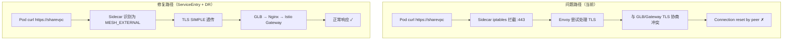

对于我的follow流，GCP 里面glb nginx+ istio gateway + runtime namespace 
curl sharevpc-fqnd.appdev.aibang/这个是没有任何问题的。这个意思就是说，我从外部访问这个地址，或者从其他地方访问这个地址，没有任何问题。
我现在遇到了这样一个问题。就是说，当我在我的Runtime Namespace Pod  call 这个一个入口URL域名的时候。curl https://sharevpc-fqnd.appdev.aibang  直接出现了下面这样的报错。但是有一点，就是说我的Pod访问其他域名，或者说其他的FQDN、其他的URL又是没有问题的。也就是说，只要不是我这个Gateway里边对应的资源，就是没有问题的。具体的报错大概是下面这样的。
当然，为了完整的测试，我将DNS的绑定，其实不仅仅是将IP让其解析到对应的Shared VPC的入口，我也让它访问到我的GitLab的入口，或者说让它访问到我的Cluster的IP，好像都是这样的报错。
> kubectl exec -n runtime-ns -it kafka-app01-toolbox-66db5954f-rq9tn -- curl -vvv https://sharevpc-fqnd.appdev.aibang/pmu-cicd-ms-proxy/v1/.well-known/health
* Host sharevpc-fqnd.appdev.aibang:443 was resolved.
* IPv6: (none)
* IPv4: 10.105.0.249
* Trying 10.105.0.249:443...
* Connected to sharevpc-fqnd.appdev.aibang (10.105.0.249) port 443
* ALPN: curl offers h2,http/1.1
* TLSv1.3 (OUT), TLS handshake, Client hello (1):
* CAfile: /etc/ssl/certs/ca-certificates.crt
* CApath: /etc/ssl/certs
* Recv failure: Connection reset by peer
* OpenSSL SSL_connect: Connection reset by peer in connection to sharevpc-fqnd.appdev.aibang:443
* Closing connection
curl: (35) Recv failure: Connection reset by peer
command terminated with exit code 35


## 🔍 问题分析

这是一个经典的 **hairpin / loopback 流量问题**。

核心矛盾：Pod 发出的请求，经过 GLB → Nginx → Istio Gateway 路由后，最终目标又回到了**同一个集群内**。Istio 的 Sidecar 在这条回环路径上干预了连接，导致 TLS 握手被 reset。

---

## 根本原因定位

```
Pod (runtime-ns)
  └─ curl https://sharevpc-fqnd.appdev.aibang
       └─ DNS → 10.105.0.249 (GLB/Nginx 入口 IP)
            └─ GLB → Nginx → Istio Gateway
                 └─ VirtualService 路由 → 回到 runtime-ns 的 Service
                      └─ ← Sidecar 拦截 → TLS reset ✗
```

你测试了三个 IP（Shared VPC 入口、GitLab 入口、Cluster IP），**都报同样错误**，这说明问题不在 DNS 解析，而在于：**从集群内部发出的流量，经过 Istio Sidecar 拦截后，与 Gateway 之间的 TLS 协商失败**。

具体有两个叠加原因：

**原因 A：Envoy Sidecar 对出站 HTTPS 流量的处理**

Pod 的 Sidecar 拦截了 `443` 出站流量，尝试对其做 TLS origination 或透传，但与 Gateway 侧的期望不匹配，导致握手 reset。

**原因 B：Istio 对 `*.appdev.aibang` 域名的 ServiceEntry 或 PassthroughCluster 行为**

如果没有显式的 `ServiceEntry` 声明这个外部域名，Istio 默认走 `PassthroughCluster`，但 Sidecar 的 iptables 会拦截 443 并尝试做处理，与直接透传产生冲突。

---

## 解决方案

有三种方案，按推荐优先级排列：

### 方案一（推荐）：为域名创建 ServiceEntry，声明为外部直通

```yaml
apiVersion: networking.istio.io/v1beta1
kind: ServiceEntry
metadata:
  name: sharevpc-external-entry
  namespace: runtime-ns        # 在 runtime namespace 下生效
spec:
  hosts:
  - "sharevpc-fqnd.appdev.aibang"
  ports:
  - number: 443
    name: https
    protocol: HTTPS
  location: MESH_EXTERNAL      # 声明为网格外部服务
  resolution: DNS
```

这告诉 Istio：这个域名是外部服务，Sidecar 不要干预其 TLS，直接透传。

---

### 方案二：配合 DestinationRule 明确 TLS 透传

仅 ServiceEntry 有时不够，需要同时告诉 Sidecar 如何处理出站 TLS：

```yaml
apiVersion: networking.istio.io/v1beta1
kind: DestinationRule
metadata:
  name: sharevpc-external-dr
  namespace: runtime-ns
spec:
  host: "sharevpc-fqnd.appdev.aibang"
  trafficPolicy:
    tls:
      mode: SIMPLE              # Sidecar 发起标准单向 TLS，不做 mTLS
      # 如果证书是自签的，加下面两行
      # insecureSkipVerify: true
```

---

### 方案三：Sidecar 资源排除出站拦截（适合整个 namespace 级别控制）

如果 runtime-ns 的 Pod 需要大量访问外部 HTTPS 服务，可以用 `Sidecar` 资源精确控制出站范围：

```yaml
apiVersion: networking.istio.io/v1beta1
kind: Sidecar
metadata:
  name: runtime-ns-sidecar
  namespace: runtime-ns
spec:
  egress:
  - hosts:
    - "./*"                     # 网格内部所有服务（正常 mTLS）
    - "istio-system/*"
    - "istio-ingressgateway-int/*"
  outboundTrafficPolicy:
    mode: REGISTRY_ONLY         # 只允许 ServiceEntry 中注册的外部服务
```

与方案一配合，`REGISTRY_ONLY` 确保只有显式声明的外部服务才可访问，安全性更高。

---

## 排查步骤

先确认具体是哪一层的问题：

```bash
# Step 1: 检查 Istio 对这个域名的路由决策
kubectl exec -n runtime-ns <pod> -c istio-proxy -- \
  pilot-agent request GET clusters | grep sharevpc

# Step 2: 检查出站流量的 listener 配置
kubectl exec -n runtime-ns <pod> -c istio-proxy -- \
  pilot-agent request GET listeners | grep -A5 "0.0.0.0_443"

# Step 3: 查看 Sidecar 的实时访问日志（看 reset 发生在哪段）
kubectl logs -n runtime-ns <pod> -c istio-proxy --tail=50 | grep sharevpc

# Step 4: 确认当前 outboundTrafficPolicy
kubectl get meshconfig -n istio-system istio -o jsonpath='{.spec.meshConfig.outboundTrafficPolicy}'
```

---

## 流量路径对比



---

## ⚠️ 注意事项

1. **ServiceEntry 的 namespace 范围**：如果多个 namespace 的 Pod 都需要访问这个域名，建议把 ServiceEntry 放在 `istio-system` 下，这样全局生效。

2. **`outboundTrafficPolicy` 默认值确认**：如果你的 mesh 配置是 `REGISTRY_ONLY`，那所有未在 ServiceEntry 中声明的外部域名都会被拦截，必须显式注册。如果是 `ALLOW_ANY`（默认），ServiceEntry 不是必须的，但 DestinationRule 里的 `tls.mode: SIMPLE` 仍然需要。

3. **这不是 hairpin NAT 问题**：虽然流量绕了一圈回到集群，但 GKE 的 kube-proxy 可以处理这种回环。真正的根因是 Istio Sidecar 在出站 443 上的 TLS 干预。