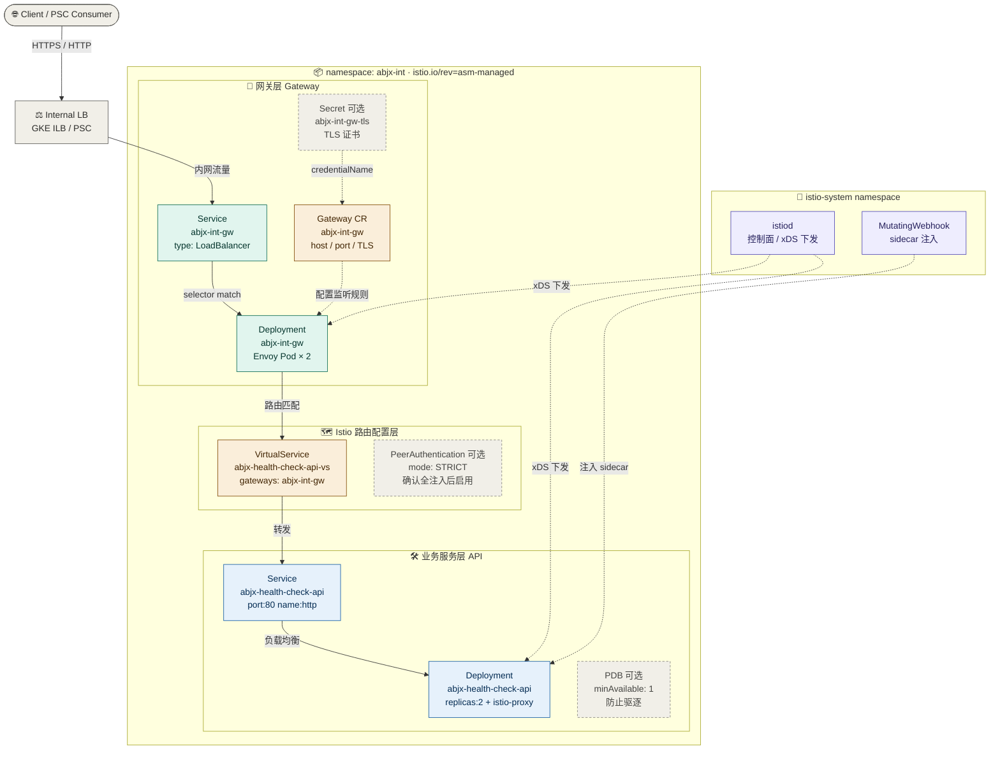
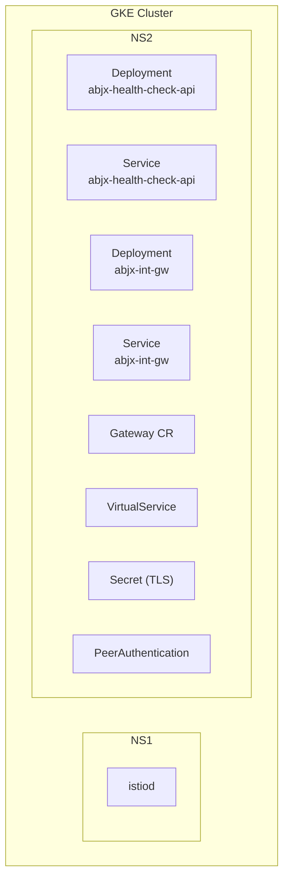
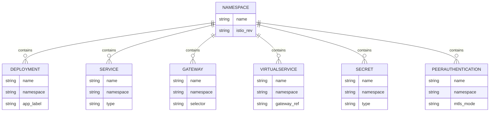
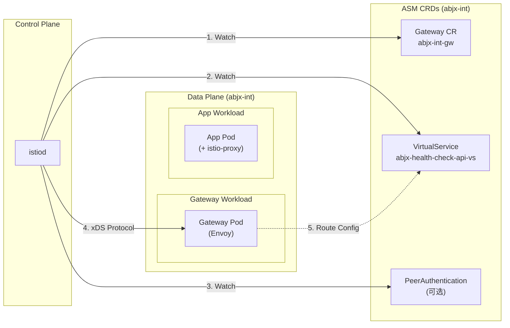
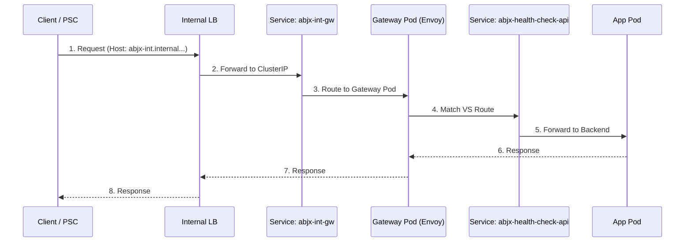
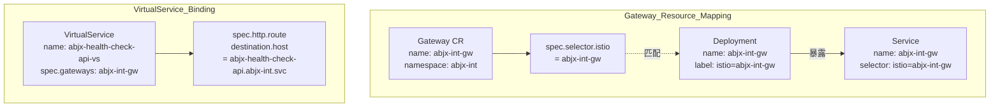

直接给你可以复制粘贴到 `.md` 的 Mermaid 源码：



---

**颜色说明**（`classDef` 对应关系）：

| class | 颜色 | 含义 |
|-------|------|------|
| `ext` | 灰色 | 集群外部：Client、ILB |
| `ctrl` | 紫色 | 控制面：istiod、Webhook |
| `gw` | 绿色 | 网关工作负载：Service、Deployment |
| `cfg` | 橙色 | Istio 配置对象：Gateway CR、VirtualService |
| `api` | 蓝色 | 业务服务：API Deployment、Service |
| `opt` | 灰色虚线 | 可选资源：Secret、PeerAuthentication、PDB |

这份 Mermaid 在 GitHub、GitLab、Obsidian、Typora 等主流 Markdown 渲染器里都可以直接显示颜色。


# ASM on GKE — 资源分层部署图 (Mermaid)

本文档通过 Mermaid 图表展示 ASM 部署中各类资源在 Namespace 下的分布关系，帮助更清晰地理解部署架构。

---

## 1. Namespace 分层总览

```mermaid
flowchart TB
    subgraph GKE["GKE Cluster"]
        subgraph istio-system["istio-system (Control Plane)"]
            istiod["istiod<br/>(ASM Control Plane)"]
        end
        
        subgraph abjx-int["abjx-int (Tenant Namespace)"]
            direction TB
            subgraph workload["Workloads"]
                api Deploy["Deployment<br/>abjx-health-check-api"]
                gw DeployGW["Deployment<br/>abjx-int-gw"]
            end
            
            subgraph svc["Services"]
                api SVC["Service<br/>abjx-health-check-api"]
                gw SVCGW["Service<br/>abjx-int-gw<br/>(ILB/ClusterIP)"]
            end
            
            subgraph asmcr["ASM CRDs"]
                gw CR["Gateway CR<br/>abjx-int-gw"]
                vs["VirtualService<br/>abjx-health-check-api-vs"]
                pa["PeerAuthentication<br/>default (可选)"]
            end
            
            subgraph sec["Secrets"]
                tls["Secret<br/>abjx-int-gw-tls<br/>(可选)"]
            end
        end
    end
    
    istiod -.->|"xDS Config"| gw DeployGW
    istiod -.->|"xDS Config"| Deploy
```

---

## 2. 资源分布详情

### 2.1 Namespace 层级



---

## 3. 资源与 Namespace 对照表



---

## 4. 数据流与控制流

### 4.1 控制面配置流



### 4.2 数据面流量



---

## 5. 资源部署顺序

```mermaid
flowchart LR
    subgraph Phase1["Phase 1: 基础设施"]
        N1["1. Namespace<br/>abjx-int"]
    end
    
    subgraph Phase2["Phase 2: 业务应用"]
        D1["2. Deployment<br/>abjx-health-check-api"]
        S1["3. Service<br/>abjx-health-check-api"]
    end
    
    subgraph Phase3["Phase 3: 网关"]
        D2["4. Deployment<br/>abjx-int-gw"]
        S2["5. Service<br/>abjx-int-gw"]
    end
    
    subgraph Phase4["Phase 4: ASM 配置"]
        G["6. Gateway CR"]
        V["7. VirtualService"]
    end
    
    subgraph Phase5["Phase 5: 安全 (可选)"]
        T["8. Secret (TLS)"]
        P["9. PeerAuthentication"]
    end
    
    N1 --> D1
    D1 --> S1
    S1 --> D2
    D2 --> S2
    S2 --> G
    G --> V
    V --> T
    T --> P
```



---

## 6. 资源清单汇总

### 6.1 abjx-int Namespace

| 资源类型 | 名称 | 说明 |
|----------|------|------|
| `Namespace` | `abjx-int` | 租户隔离 namespace |
| `Deployment` | `abjx-health-check-api` | 业务 API 应用 |
| `Service` | `abjx-health-check-api` | 业务 API 服务暴露 |
| `Deployment` | `abjx-int-gw` | Gateway Envoy 工作负载 |
| `Service` | `abjx-int-gw` | Gateway 服务 (ILB/ClusterIP) |
| `Gateway` | `abjx-int-gw` | Gateway CR 定义监听 |
| `VirtualService` | `abjx-health-check-api-vs` | 路由规则绑定 Gateway |
| `Secret` | `abjx-int-gw-tls` | TLS 证书 (HTTPS 时) |
| `PeerAuthentication` | `default` | mTLS 配置 (可选) |

### 6.2 istio-system Namespace

| 资源类型 | 名称 | 说明 |
|----------|------|------|
| `Deployment` | `istiod` | ASM 控制面 |
| `Service` | `istiod` | 控制面服务 |

---

## 7. 关键映射关系



---

## 8. 快速参考

### 资源查找命令

```bash
# 查看 abjx-int namespace 所有资源
kubectl get all,gateways,virtualservices,secrets -n abjx-int

# 查看 Gateway CR 配置
kubectl get gateway abjx-int-gw -n abjx-int -o yaml

# 查看 VirtualService 配置
kubectl get virtualservice abjx-health-check-api-vs -n abjx-int -o yaml

# 验证 selector 匹配
kubectl get gateway abjx-int-gw -n abjx-int -o jsonpath='{.spec.selector}'
kubectl get pods -n abjx-int -l istio=abjx-int-gw
```
