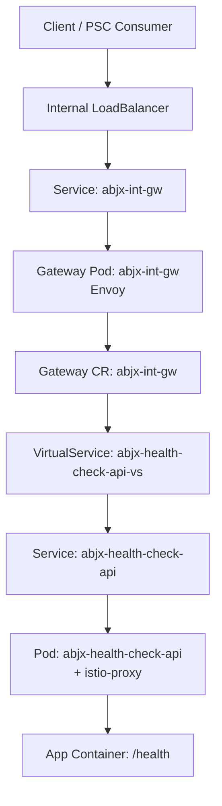
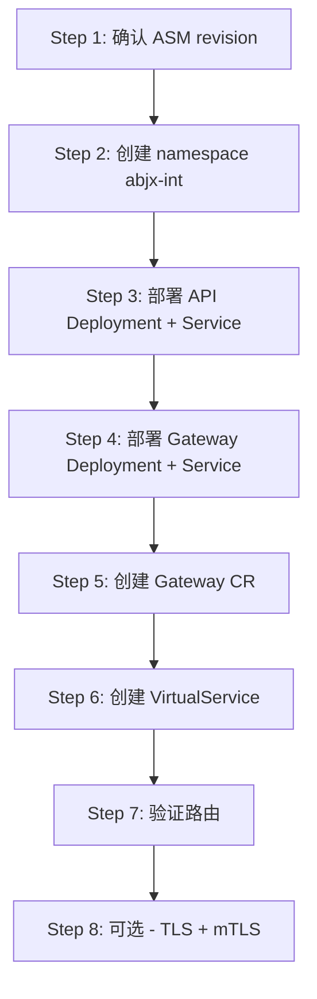

文档已成功读取。你的目标非常清晰，我基于此生成一份精炼、结构完整的实施文档：

---

# ASM on GKE — `abjx-int` Namespace 部署实施说明 (V1)

## 目标

| 目标 | 说明 |
|------|------|
| 创建 namespace | `abjx-int` |
| 部署 health check API | `abjx-health-check-api` in `abjx-int` |
| 每个 rt namespace 独立网关 | gateway 与 namespace 一一对应 |
| 网关命名规范 | `abjx-int` → `abjx-int-gw` |
| VirtualService 绑定 | 绑定到 `abjx-int-gw` |

---

## 1. 架构总览



---

## 2. 关键对象一览

| 资源类型 | 名称 | Namespace | 说明 |
|----------|------|-----------|------|
| `Namespace` | `abjx-int` | - | 租户隔离 |
| `Deployment` | `abjx-health-check-api` | `abjx-int` | 业务 API |
| `Service` | `abjx-health-check-api` | `abjx-int` | 暴露 API 端口 |
| `Deployment` | `abjx-int-gw` | `abjx-int` | Gateway Envoy 工作负载 |
| `Service` | `abjx-int-gw` | `abjx-int` | 暴露 Gateway 端口（ILB 或 ClusterIP） |
| `Gateway` CR | `abjx-int-gw` | `abjx-int` | 定义 host/port/TLS 监听 |
| `VirtualService` | `abjx-health-check-api-vs` | `abjx-int` | 路由规则，绑定到 `abjx-int-gw` |
| `Secret` | `abjx-int-gw-tls` | `abjx-int` | TLS 证书（HTTPS 时启用） |

---

## 3. 部署流程



---

## 4. 详细实施清单

### Step 1: 确认 ASM revision

```bash
kubectl get mutatingwebhookconfigurations | grep -E "istio|asm|mesh"
kubectl get pods -A | grep -E "istiod|asm"
```

> ⚠️ 以下示例使用 `asm-managed`，请替换为你集群实际的 revision 标签值。

---

### Step 2: 创建 Namespace（`00-namespace-abjx-int.yaml`）

```yaml
apiVersion: v1
kind: Namespace
metadata:
  name: abjx-int
  labels:
    istio.io/rev: asm-managed
```

```bash
kubectl apply -f 00-namespace-abjx-int.yaml
```

---

### Step 3: 部署 API（`10-abjx-health-check-api.yaml`）

```yaml
apiVersion: apps/v1
kind: Deployment
metadata:
  name: abjx-health-check-api
  namespace: abjx-int
spec:
  replicas: 2
  selector:
    matchLabels:
      app: abjx-health-check-api
  template:
    metadata:
      labels:
        app: abjx-health-check-api
    spec:
      containers:
      - name: app
        image: gcr.io/google-samples/hello-app:1.0  # 替换为你的镜像
        ports:
        - containerPort: 8080
        readinessProbe:
          httpGet:
            path: /healthz
            port: 8080
          initialDelaySeconds: 3
          periodSeconds: 5
        livenessProbe:
          httpGet:
            path: /healthz
            port: 8080
          initialDelaySeconds: 10
          periodSeconds: 10
        resources:
          requests:
            cpu: 100m
            memory: 128Mi
          limits:
            cpu: 500m
            memory: 256Mi
---
apiVersion: v1
kind: Service
metadata:
  name: abjx-health-check-api
  namespace: abjx-int
spec:
  selector:
    app: abjx-health-check-api
  ports:
  - name: http      # 必须命名为 http，Istio 协议识别依赖此字段
    port: 80
    targetPort: 8080
```

```bash
kubectl apply -f 10-abjx-health-check-api.yaml
```

---

### Step 4: 部署 Gateway Service（`20-abjx-int-gw-service.yaml`）

```yaml
apiVersion: v1
kind: Service
metadata:
  name: abjx-int-gw
  namespace: abjx-int
  annotations:
    networking.gke.io/load-balancer-type: "Internal"  # 内部 ILB；集群内验证可改 ClusterIP
spec:
  type: LoadBalancer
  selector:
    istio: abjx-int-gw
  ports:
  - name: status-port   # GKE ILB 健康检查依赖此端口
    port: 15021
    targetPort: 15021
  - name: http2
    port: 80
    targetPort: 8080
  - name: https
    port: 443
    targetPort: 8443
```

### Step 4b: 部署 Gateway Workload（`21-abjx-int-gw-deployment.yaml`）

```yaml
apiVersion: apps/v1
kind: Deployment
metadata:
  name: abjx-int-gw
  namespace: abjx-int
spec:
  replicas: 2
  selector:
    matchLabels:
      istio: abjx-int-gw
  template:
    metadata:
      labels:
        istio: abjx-int-gw
      annotations:
        inject.istio.io/templates: gateway
        sidecar.istio.io/inject: "true"
    spec:
      containers:
      - name: istio-proxy
        image: auto
        ports:
        - containerPort: 15021
        - containerPort: 8080
        - containerPort: 8443
        resources:
          requests:
            cpu: 100m
            memory: 128Mi
          limits:
            cpu: 1000m
            memory: 512Mi
```

```bash
kubectl apply -f 20-abjx-int-gw-service.yaml
kubectl apply -f 21-abjx-int-gw-deployment.yaml
```

---

### Step 5: 创建 Gateway CR（`30-abjx-int-gateway.yaml`）

```yaml
apiVersion: networking.istio.io/v1beta1
kind: Gateway
metadata:
  name: abjx-int-gw          # CR 名称与 gateway workload 对齐
  namespace: abjx-int
spec:
  selector:
    istio: abjx-int-gw       # 必须匹配 Gateway Pod 的 label
  servers:
  - port:
      number: 80
      name: http
      protocol: HTTP
    hosts:
    - "abjx-int.internal.example.com"  # 替换为真实 FQDN
```

```bash
kubectl apply -f 30-abjx-int-gateway.yaml
```

---

### Step 6: 创建 VirtualService（`40-abjx-health-check-api-vs.yaml`）

```yaml
apiVersion: networking.istio.io/v1beta1
kind: VirtualService
metadata:
  name: abjx-health-check-api-vs
  namespace: abjx-int
spec:
  hosts:
  - "abjx-int.internal.example.com"
  gateways:
  - abjx-int-gw              # 绑定到 abjx-int-gw Gateway CR
  http:
  - match:
    - uri:
        prefix: /health
    route:
    - destination:
        host: abjx-health-check-api.abjx-int.svc.cluster.local
        port:
          number: 80
  - match:
    - uri:
        prefix: /
    route:
    - destination:
        host: abjx-health-check-api.abjx-int.svc.cluster.local
        port:
          number: 80
```

```bash
kubectl apply -f 40-abjx-health-check-api-vs.yaml
```

---

### Step 7（可选）: TLS 配置

#### 7.1 创建 TLS Secret

```bash
kubectl create -n abjx-int secret tls abjx-int-gw-tls \
  --key=tls.key \
  --cert=tls.crt
```

#### 7.2 更新 Gateway CR 支持 HTTPS

```yaml
apiVersion: networking.istio.io/v1beta1
kind: Gateway
metadata:
  name: abjx-int-gw
  namespace: abjx-int
spec:
  selector:
    istio: abjx-int-gw
  servers:
  - port:
      number: 443
      name: https
      protocol: HTTPS
    tls:
      mode: SIMPLE
      credentialName: abjx-int-gw-tls   # 对应 Secret 名称
    hosts:
    - "abjx-int.internal.example.com"
```

> ℹ️ **说明**：外部→Gateway 的 TLS 由你自己管理；Gateway→Pod 之间的 mTLS 由 ASM 控制面自动签发轮转，无需手动干预。

---

### Step 8（可选）: namespace 内启用 STRICT mTLS

```yaml
# 50-abjx-int-peerauthentication.yaml
# ⚠️ 仅在确认所有 Pod 都已注入 sidecar 后再启用
apiVersion: security.istio.io/v1beta1
kind: PeerAuthentication
metadata:
  name: default
  namespace: abjx-int
spec:
  mtls:
    mode: STRICT
```

---

## 5. 验证命令

```bash
# 1. 确认 sidecar 注入
kubectl get pods -n abjx-int
kubectl get pod -n abjx-int <pod-name> -o jsonpath='{.spec.containers[*].name}'
# 期望：app istio-proxy

# 2. 确认 gateway 状态
kubectl get pods -n abjx-int -l istio=abjx-int-gw
kubectl get svc abjx-int-gw -n abjx-int
kubectl get gateway abjx-int-gw -n abjx-int -o yaml
kubectl get virtualservice abjx-health-check-api-vs -n abjx-int -o yaml

# 3. 验证路由（HTTP）
GW_IP=$(kubectl get svc abjx-int-gw -n abjx-int -o jsonpath='{.status.loadBalancer.ingress[0].ip}')
curl -H 'Host: abjx-int.internal.example.com' http://${GW_IP}/health

# 4. 验证路由（HTTPS）
curl -k -H 'Host: abjx-int.internal.example.com' https://${GW_IP}/health

# 5. Istio 配置一致性检查
istioctl analyze -n abjx-int
```

---

## 6. 文件清单与应用顺序

```bash
# 文件组织
00-namespace-abjx-int.yaml
10-abjx-health-check-api.yaml
20-abjx-int-gw-service.yaml
21-abjx-int-gw-deployment.yaml
30-abjx-int-gateway.yaml
40-abjx-health-check-api-vs.yaml
50-abjx-int-peerauthentication.yaml   # 可选，确认全注入后启用

# 应用顺序
kubectl apply -f 00-namespace-abjx-int.yaml
kubectl apply -f 10-abjx-health-check-api.yaml
kubectl apply -f 20-abjx-int-gw-service.yaml
kubectl apply -f 21-abjx-int-gw-deployment.yaml
kubectl apply -f 30-abjx-int-gateway.yaml
kubectl apply -f 40-abjx-health-check-api-vs.yaml
```

---

## 7. Handoff Checklist

- [ ] 已确认集群 ASM revision 标签（如 `asm-managed`）
- [ ] 已创建 `abjx-int` namespace 并打上 `istio.io/rev`
- [ ] 已部署 `abjx-health-check-api` Deployment + Service，port.name 为 `http`
- [ ] 已部署 `abjx-int-gw` Deployment + Service，label 为 `istio: abjx-int-gw`
- [ ] 已创建 `Gateway` CR，selector 与 Deployment label 对齐
- [ ] 已创建 `VirtualService`，`gateways` 字段指向 `abjx-int-gw`
- [ ] 已通过 `curl` 验证 `/health` 路由可达
- [ ] 如需 HTTPS，已创建 `abjx-int-gw-tls` Secret
- [ ] 如需 mTLS，已确认 namespace 内所有 Pod 均已注入 sidecar

---

## 8. 最容易踩的坑

| 问题 | 原因 | 解法 |
|------|------|------|
| Gateway 无流量 | `selector` 与 Pod label 不一致 | 检查 `istio: abjx-int-gw` |
| VirtualService 不生效 | `gateways` 字段写错 | 确认是 `abjx-int-gw` 而非其他 |
| Service port 协议错误 | `port.name` 未写 `http` | 补上 `name: http` |
| mTLS 打断流量 | 部分 Pod 未注入 sidecar | 先 PERMISSIVE，再 STRICT |
| GKE ILB 健康检查失败 | 未暴露 `15021` 端口 | Service 中保留 `status-port: 15021` |