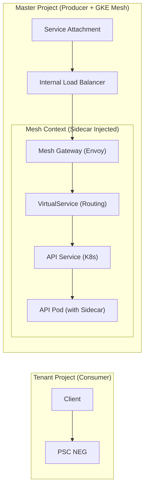

# ASM Simple API 部署指南 (GKE Managed ASM + PSC 架构)

> **场景说明**：在 Master-Tenant 架构中，流量通过 Private Service Connect (PSC) 进入 Master 项目，并由托管式 Anthos Service Mesh (ASM) 进行统一治理。本指南展示如何在 Mesh 内部部署并暴露一个 Simple API。

---

## 1. 部署架构概览



---

## 2. 部署流程详解

### 第一阶段：环境准备与 Sidecar 注入
Managed ASM 采用 **Revision-based** 注入模式。

1. **获取 Revision 标签**：
   ```bash
   kubectl get mutatingwebhookconfigurations | grep istio.io/rev
   # 常见值为 asm-managed 或类似的特定版本号
   ```

2. **创建并配置 Namespace**：
   ```yaml
   apiVersion: v1
   kind: Namespace
   metadata:
     name: simple-api-ns
     labels:
       # 核心：将 Namespace 绑定到 ASM 托管控制面
       istio.io/rev: asm-managed 
   ```

---

### 第二阶段：部署基础 API 资源
定义标准的 Kubernetes Deployment 和 Service。

1. **Deployment (API 实现)**：
   ```yaml
   apiVersion: apps/v1
   kind: Deployment
   metadata:
     name: simple-api
     namespace: simple-api-ns
   spec:
     replicas: 2
     selector:
       matchLabels:
         app: simple-api
     template:
       metadata:
         labels:
           app: simple-api # Sidecar 自动注入的基础
       spec:
         containers:
         - name: api
           image: gcr.io/google-samples/hello-app:1.0
           ports:
           - containerPort: 8080
   ```

2. **Service (ClusterIP)**：
   ```yaml
   apiVersion: v1
   kind: Service
   metadata:
     name: simple-api-svc
     namespace: simple-api-ns
   spec:
     selector:
       app: simple-api
     ports:
     - name: http # 必须指定协议名称
       protocol: TCP
       port: 80
       targetPort: 8080
   ```

---

### 第三阶段：网关与路由配置 (Mesh Ingress)
将内部服务通过 Mesh Gateway 暴露，并映射到外部可访问的域名。

1. **Gateway (入口定义)**：
   ```yaml
   apiVersion: networking.istio.io/v1beta1
   kind: Gateway
   metadata:
     name: api-gateway
     namespace: simple-api-ns
   spec:
     selector:
       istio: ingressgateway # 匹配 Master 项目中部署的网关 Pod
     servers:
     - port:
         number: 80
         name: http
         protocol: HTTP
       hosts:
       - "api.internal.aibang" # 目标域名
   ```

2. **VirtualService (路由转发)**：
   ```yaml
   apiVersion: networking.istio.io/v1beta1
   kind: VirtualService
   metadata:
     name: api-vs
     namespace: simple-api-ns
   spec:
     hosts:
     - "api.internal.aibang"
     gateways:
     - api-gateway
     http:
     - route:
       - destination:
           host: simple-api-svc
           port:
             number: 80
   ```

---

### 第四阶段：安全策略与证书

1. **启用内部 mTLS (PeerAuthentication)**：
   在命名空间级别强制要求双向 TLS 加密。
   ```yaml
   apiVersion: security.istio.io/v1beta1
   kind: PeerAuthentication
   metadata:
     name: default
     namespace: simple-api-ns
   spec:
     mtls:
       mode: STRICT
   ```

2. **外部 HTTPS 证书配置**：
   如果 Gateway 需要支持 HTTPS，需创建 K8s Secret：
   ```bash
   kubectl create -n istio-system secret tls api-tls-cert \
     --key=key.pem --cert=cert.pem
   ```
   然后在 `Gateway` 的 `tls`字段引用 `credentialName: api-tls-cert`。

3. **身份校验 (RequestAuthentication)**：
   在入口网关校验 JWT 令牌（可选）：
   ```yaml
   apiVersion: security.istio.io/v1beta1
   kind: RequestAuthentication
   metadata:
     name: jwt-auth
     namespace: simple-api-ns
   spec:
     selector:
       matchLabels:
         istio: ingressgateway
     jwtRules:
     - issuer: "https://issuer.example.com"
       jwksUri: "https://issuer.example.com/.well-known/jwks.json"
   ```

---

## 3. 关键配置项对照表

| 资源名称 | 核心作用 | 备注 |
| :--- | :--- | :--- |
| **Namespace Label** | 激活 Sidecar 注入 | 必须指向正确的 ASM Revision |
| **Deployment Labels** | 流量识别与指标收集 | `app` 标签用于 VS 和 Service 的选择 |
| **Gateway** | 监听端口与域名绑定 | 相当于 Nginx 的 `server_name` |
| **VirtualService** | 流量分发与路径匹配 | 相当于 Nginx 的 `location` |
| **DestinationRule** | 子集定义与负载均衡策略 | 可用于实现蓝绿/灰度发布 |
| **PeerAuthentication** | 控制 mTLS 状态 | `STRICT` 模式提供最高安全性 |

---

## 4. 验证与排障

1. **Pod 注入验证**：
   ```bash
   kubectl get pods -n simple-api-ns
   # READY 列应显示 2/2（应用容器 + istio-proxy）
   ```

2. **配置一致性检查**：
   ```bash
   istioctl analyze -n simple-api-ns
   ```

3. **流量追踪**：
   检查 Envoy 代理日志确认流量路径：
   ```bash
   kubectl logs <pod-name> -c istio-proxy -n simple-api-ns
   ```