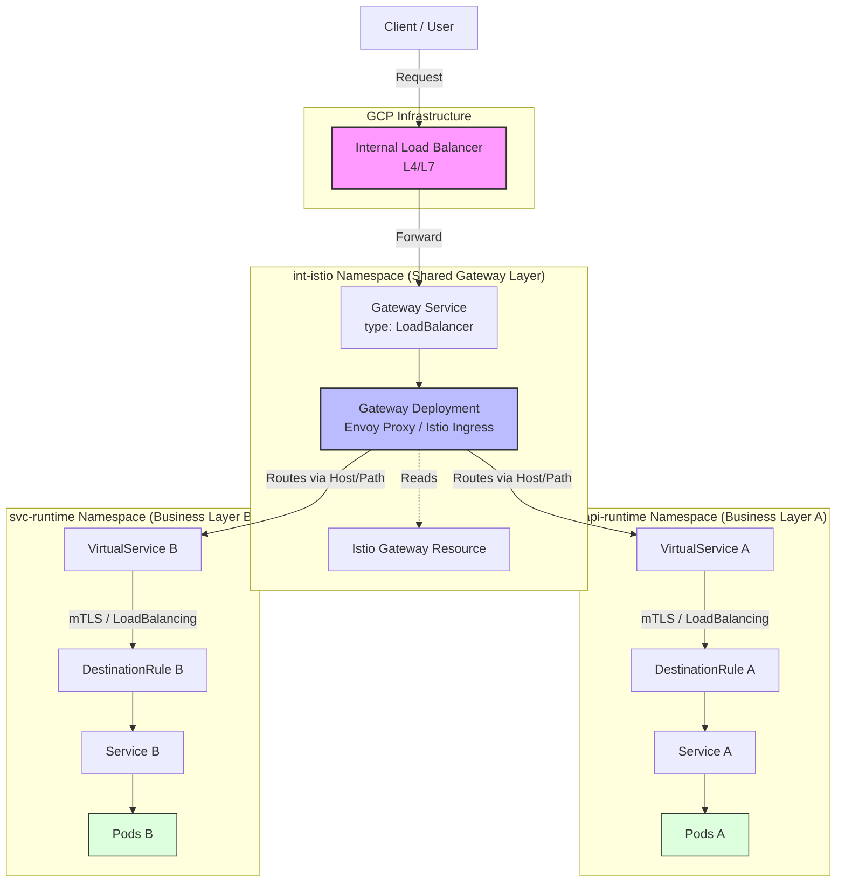

现在我来为你画这个 Cloud Service Mesh Ingress 流量路径图，使用 swimlane 风格区分不同的 namespace。流量路径图已画好，几个关键设计点说明：

**数据面 (Data Plane) — 实线箭头**

```
Client → ILB (GCP Forwarding Rule)
       → Gateway SVC (LoadBalancer)
       → Gateway Pod (Envoy, sidecar)
         ├─ host match → VirtualService (api-runtime) → Service → Pod
         └─ host match → VirtualService (svc-runtime) → Service → Pod
```

**控制面 (Control Plane) — 紫色虚线**

```
istiod → xDS push → Gateway CRD → bind → Gateway Pod (Envoy listener config)
```

**Namespace 隔离设计的核心优势体现在图中：**

| 关注点 | 说明 |
|---|---|
| `int-istio` ns 独立 | Gateway SVC / Pod / CRD 完全自治，可单独扩缩容 |
| `api-runtime` / `svc-runtime` | 只持有 VirtualService + DestinationRule，零感知 Gateway 实现 |
| cross-ns routing | VS 通过 `gateways: [int-istio/int-istio-gw]` 引用，不需要在同一 ns |
| mTLS | DestinationRule 配置 `ISTIO_MUTUAL`，Pod sidecar 间端到端加密 |

如需进一步展开某个层次（比如 Envoy xDS listener/cluster 的配置链路，或 PeerAuthentication + AuthorizationPolicy 的叠加逻辑），可以告诉我。


# Istio Flow Diagrams — 目录索引

> GKE ASM Istio 架构流程图集合 (dark-themed HTML SVG)
>
> 基于 `trace-istio.sh` / `trace-istio-and-export.sh` 脚本分析生成
> 参考: `../asm-flow.md`

---

## 流量入口 (Ingress)

### [istio-ingress-flow.html](./istio-ingress-flow.html)
**Istio 入口流量架构 — GKE ASM**

外部请求完整路径:

```
Client → ILB/PSC → Gateway(int-istio) → VirtualService → DestinationRule → Service → Pod
         ←────────────── istiod xDS 控制 ──────────────────────→
```

- Gateway 位于 `int-istio` 命名空间 (独立部署)
- VirtualService / DestinationRule / Service / Pod 位于 Runtime namespace
- istiod 统一下发 xDS 到所有 Envoy sidecar

---

## CRD 链路关系

### [istio-crds-chain.html](./istio-crds-chain.html)
**Istio CRD 链路关系 — trace-istio.sh 追踪路径**

```
Gateway → VirtualService → DestinationRule → Service → Pod
 STEP1    STEP2             STEP3            STEP4    STEP5
```

每个 STEP 的关键字段对照, 包含 namespace 分离逻辑与 FQDN 补全规则.

---

## 命名空间隔离

### [istio-namespace-isolation.html](./istio-namespace-isolation.html)
**Istio 命名空间隔离架构 — int-istio Gateway**

展示多 Runtime namespace 共用 `int-istio` Gateway 的架构:

```
int-istio namespace: Gateway 专属
  - Gateway Deployment (Envoy sidecar)
  - Gateway SVC (LoadBalancer)
  - Gateway CRD

api-runtime namespace: 业务服务层
  - VirtualService (gateways: [int-istio-gw])
  - DestinationRule
  - Service / Pod

svc-runtime namespace: 另一个业务 namespace
  - VirtualService (gateways: [int-istio-gw])
  - ...
```

优势: Gateway 独立变更/扩缩容, 业务 namespace 零耦合.

---

## Sidecar 注入流程

### [istio-sidecar-injection.html](./istio-sidecar-injection.html)
**Istio Sidecar 注入流程 — istiod + MutatingWebhook**

Pod 创建时的自动注入路径:

```
Kube API Server → MutatingWebhook (istio-sidecar-injector)
  → istiod (istio-injection=enabled?)
    → Patch Pod spec (istio-proxy + istio-init)
      → Kubelet (拉镜像/启动容器)
        → Pod 运行 (Envoy sidecar 已注入)
          → Envoy 向 istiod 拉取 xDS 配置
```

注入控制:
- `kubectl label ns runtime istio-injection=enabled`
- ASM GKE: `istio.io/rev=asm-managed`

---

## Ambient Mode 架构

### [gke-asm-ambient-arch.html](./gke-asm-ambient-arch.html)
**GKE ASM Ambient Mode 架构 (GKE 默认)**

无需 Sidecar 的零信任网络:

```
Client → ILB → Gateway(int-istio, Envoy sidecar)
         → ztunnel (Node 级 DaemonSet, L4 mTLS)
           → Pod (无 Sidecar, 原生容器)
             ↓
           Waypoint Proxy (namespace 级 Envoy)
             ↓
           AuthorizationPolicy / PeerAuthentication
```

**Ambient 核心组件:**
- **ztunnel**: Node 级 L4 mTLS 透明加密, 每 Node 一个 Pod
- **Waypoint Proxy**: 命名空间级 Envoy 代理, 替代 Sidecar
- **Gateway API**: HTTPRoute / GRPCRoute (不是 Istio VirtualService)

---

## 出口流量 (Egress)

### [istio-egress-flow.html](./istio-egress-flow.html)
**Istio 出口流量架构 — ServiceEntry + Egress Gateway**

两种出口模式:

**模式A — 直接出口 (Sidecar 直接连接)**
```
Pod Envoy → ServiceEntry (注册外部服务)
  → 外部 API / SaaS / DB
```

**模式B — Egress Gateway (集中出口)**
```
Pod Envoy → Egress Gateway (istio-egress)
  → TLS 终止/建立 → 外部服务
```

包含 ServiceEntry 注册外部服务、DestinationRule 出口 TLS 配置、AuthorizationPolicy 出口白名单的完整流程.

---

## 相关文件

| 文件 | 说明 |
|------|------|
| `../trace-istio.sh` | 全链路追踪脚本 (URL → CRD 链路) |
| `../trace-istio-and-export.sh` | 追踪 + YAML 导出脚本 |
| `../asm-flow.md` | 原有的 Mermaid 流程图参考 |
| `../istio-egress/` | 出口流量完整 YAML 配置示例 |
| `../gloo/` | Gloo Gateway vs Istio 对比资料 |


