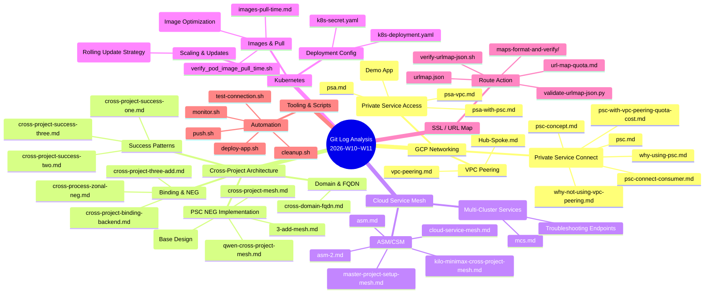
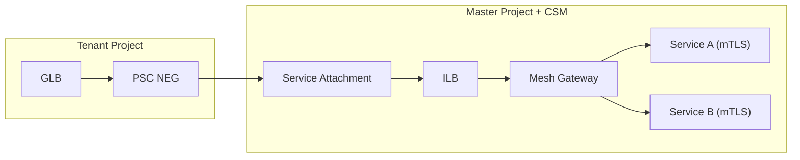
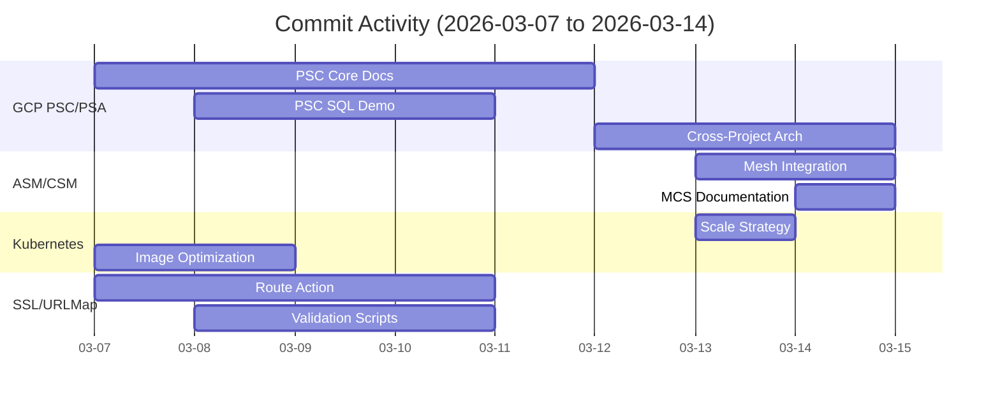
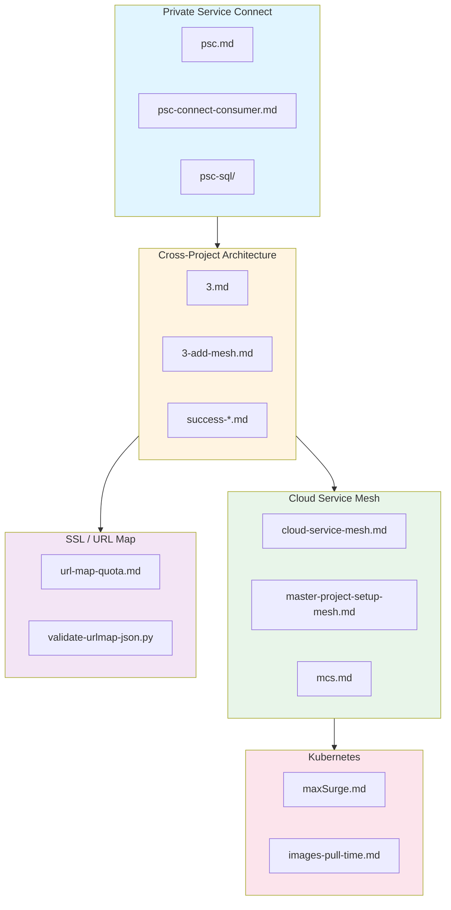

# Git Log Analysis Report (Last Week)

> Report Generated: 2026-03-14  
> Time Range: 2026-03-07 ~ 2026-03-14  
> Total Commits: 21 (non-merge)

---

## Executive Summary

| Metric | Value |
|--------|-------|
| **Total Commits** | 21 |
| **Active Days** | 7 |
| **Files Modified** | 80+ |
| **Technical Domains** | 5 |
| **Primary Focus** | GCP PSC/PSA & Cross-Project Architecture |

---

## Technical Domain Categorization



---

## Key Knowledge Points by Domain

### 1. GCP PSC (Private Service Connect) 🔥 **Primary Focus**

**Files Modified:** 15+ files in `gcp/psa-psc/`

**Core Concepts Documented:**
- PSC vs PSA comparison (`psc-psa-compare.md`)
- PSC connection flow for consumers (`psc-connect-consumer.md`)
- Why PSC over VPC Peering (`why-using-psc.md`, `why-not-using-vpc-peering.md`)
- Quota and cost analysis with VPC Peering (`psc-with-vpc-peering-quota-cost.md`)

**Key Learnings:**
```
┌─────────────────────────────────────────────────────────┐
│ PSC Architecture Pattern                                │
├─────────────────────────────────────────────────────────┤
│ Consumer Project → PSC NEG → Service Attachment        │
│                      ↓                                  │
│ Producer Project → ILB → Backend (GKE/VM/Cloud SQL)    │
└─────────────────────────────────────────────────────────┘

Benefits:
✓ No IP exposure for producer
✓ Consumer access control via allowlist
✓ Service-level isolation
✓ Cross-project native support
```

**Demo Application:** `psc-sql/` - Complete PSC + CloudSQL demo with:
- Dockerfile, Go application
- K8s deployment manifests
- Secret management
- README documentation

---

### 2. Cross-Project Architecture 🎯 **Implementation Focus**

**Files Modified:** 12+ files in `gcp/cross-project/` and `gcp/asm/`

**Architecture Evolution:**
```
V1: GLB → NON_GCP_PRIVATE_IP_PORT NEG → ILB IP → Backend
    ❌ Producer IP exposed, no access control

V2: GLB → PSC NEG → Service Attachment → ILB → Backend
    ✅ No IP exposure, producer controls consumers

V3: GLB → PSC NEG → Service Attachment → ILB → Mesh Gateway → Services
    ✅ + mTLS, + AuthZ, + Rate Limiting, + Observability
```

**Success Patterns Documented:**
- `cross-project-success-one.md` - First successful connection
- `cross-project-success-two.md` - Multi-tenant pattern
- `cross-project-success-three.md` - Production-ready setup

**Key Design Decisions:**
| Decision | Rationale |
|----------|-----------|
| PSC NEG over direct IP NEG | Security + Access Control |
| Mesh Gateway as boundary | Centralized governance |
| Master-only Mesh (V1) | Minimize blast radius |
| Revision-based injection | Safe rollouts |

---

### 3. Cloud Service Mesh (ASM/CSM) 📊

**Files Modified:** 8+ files in `gcp/asm/`

**Core Documentation:**
- `cloud-service-mesh.md` - Complete CSM setup guide for multi-tenant GKE
- `master-project-setup-mesh.md` - Master project CSM configuration
- `cross-project-mesh.md` - PSC + CSM integration pattern
- `qwen-cross-project-mesh.md` - Consolidated implementation guide

**Architecture Pattern:**


**Implementation Checklist:**
- [x] Fleet registration
- [x] API enablement (mesh, meshca, gkehub, etc.)
- [x] IAM cross-project bindings
- [x] Sidecar injection (revision-based)
- [x] Gateway deployment (Internal ILB)
- [x] JWT authentication at boundary
- [x] AuthorizationPolicy per tenant
- [x] Gradual mTLS rollout

---

### 4. Kubernetes Operations ⚙️

**Files Modified:** 6+ files in `k8s/`

**Key Topics:**

#### 4.1 Rolling Update Strategy (`maxSurge.md`)
```yaml
# Understanding maxSurge in Deployment
strategy:
  type: RollingUpdate
  rollingUpdate:
    maxSurge: 25%       # How many extra pods during update
    maxUnavailable: 25% # How many pods can be down
```

**Trade-offs:**
| maxSurge | maxUnavailable | Use Case |
|----------|----------------|----------|
| High (50%) | Low (0%) | Zero-downtime critical |
| Balanced (25%) | Balanced (25%) | Standard production |
| Low (0%) | High (25%) | Resource-constrained |

#### 4.2 Image Pull Optimization (`images-pull-time.md`)
- Script: `verify_pod_image_pull_time.sh`
- Tool: `molo.md` (image optimization)
- Focus: Reduce pod startup latency

---

### 5. SSL / URL Map Configuration 🔧

**Files Modified:** 15+ files in `ssl/docs/claude/routeaction/`

**Key Artifacts:**
- `url-map-quota.md` - Quota analysis and limits
- `urlmap.json` - Production URL map configuration
- `validate-urlmap-json.py` - Validation script
- `verify-urlmap-json.sh` - Verification script
- `maps-format-and-verify/` - Complete test suite

**URL Map Structure:**
```json
{
  "defaultService": "backend-service-a",
  "hostRules": [...],
  "pathMatchers": {
    "path-matcher-1": {
      "defaultService": "backend-service-a",
      "routeRules": [
        {
          "priority": 1,
          "service": "backend-service-b",
          "urlRedirect": {...}
        }
      ]
    }
  }
}
```

**Validation Pipeline:**
```
JSON Schema Validation → Quota Check → Apply → Verify
```

---

## Commit Activity Timeline



---

## Knowledge Graph



---

## Actionable Insights

### What Went Well ✅
1. **Comprehensive PSC Documentation** - Complete reference from concept to production
2. **Incremental Architecture** - Clear V1 → V2 → V3 evolution path
3. **Automation Scripts** - Validation, deployment, monitoring all scripted
4. **Demo Applications** - Working PSC + CloudSQL reference implementation

### Areas for Improvement 📈
1. **Script Consolidation** - Multiple `merged-scripts.md` suggest fragmentation
2. **Test Coverage** - Limited evidence of automated testing
3. **Monitoring Integration** - Observability mentioned but not deeply documented

### Recommended Next Steps 🎯
1. **Consolidate Scripts** - Merge `merged-scripts.md` files into single source of truth
2. **Add E2E Tests** - Create automated validation for PSC + Mesh integration
3. **Document Rollback** - Expand runbooks for incident response
4. **Cost Analysis** - Deep dive on PSC vs VPC Peering TCO

---

## File Statistics by Domain

| Domain | Files Modified | % of Total |
|--------|----------------|------------|
| GCP PSC/PSA | 25+ | 31% |
| Cross-Project | 12+ | 15% |
| Cloud Service Mesh | 8+ | 10% |
| SSL/URL Map | 15+ | 19% |
| Kubernetes | 6+ | 8% |
| Tooling/Scripts | 10+ | 12% |
| Other | 4+ | 5% |

---

## Conclusion

**Primary Achievement:** Established a production-ready **Cross-Project PSC + Cloud Service Mesh** architecture with comprehensive documentation, demo applications, and validation tooling.

**Technical Depth:** Deep expertise demonstrated in GCP networking (PSC/PSA/VPC), service mesh (ASM/CSM), and Kubernetes operations.

**Documentation Quality:** High - Multiple layered documents from concept → implementation → troubleshooting.

**Next Phase Focus:** Consolidation, automation, and operational excellence.

---

*Report generated by analyzing git commit history from 2026-03-07 to 2026-03-14*
