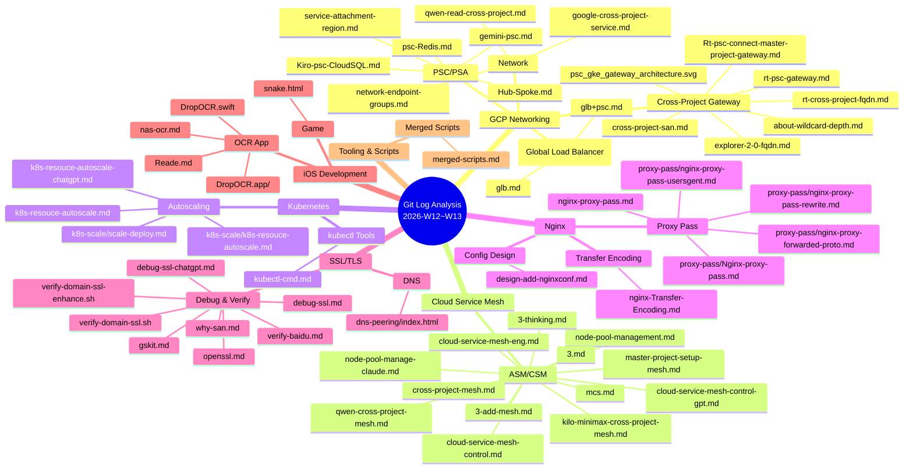
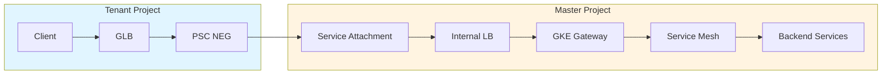
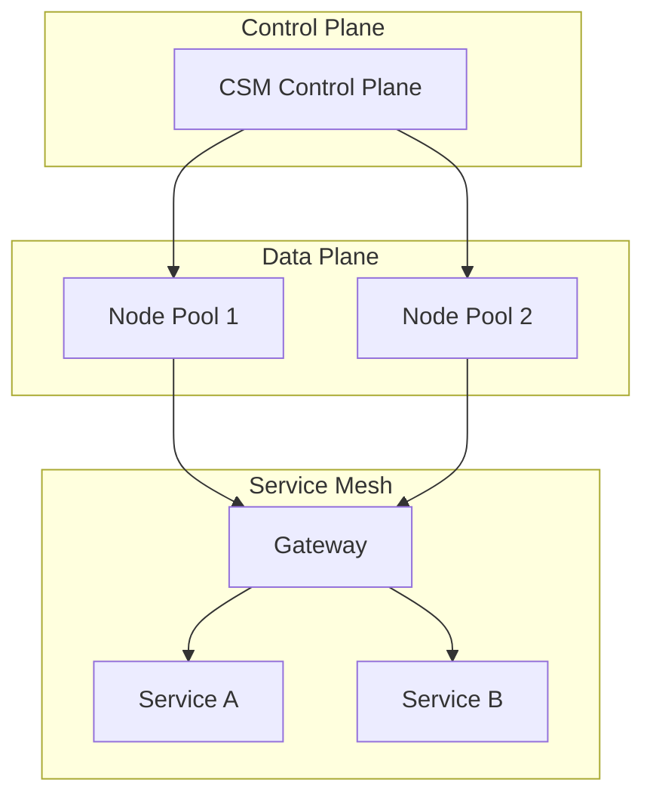
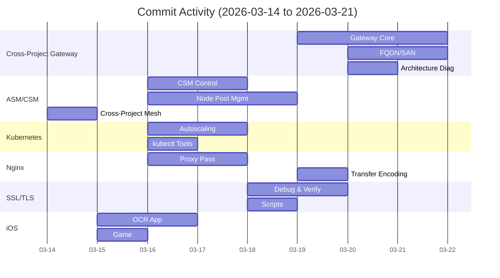
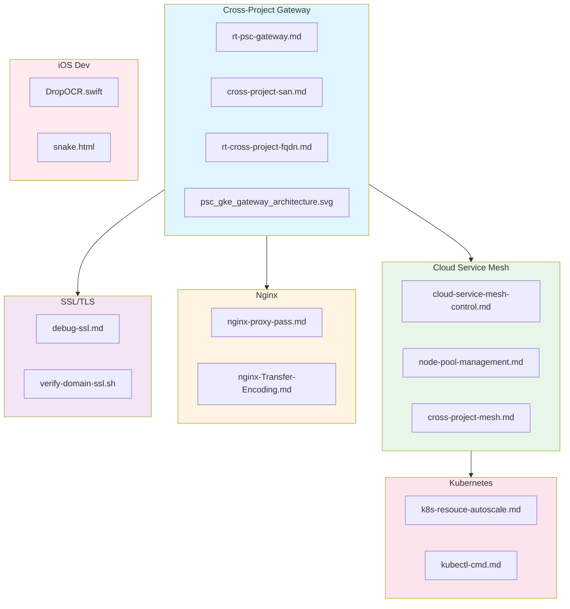

# Git Log Analysis Report (2026-W12 ~ W13)

> Report Generated: 2026-03-21  
> Time Range: 2026-03-14 ~ 2026-03-21  
> Total Commits: 26 (non-merge)


可以。下面我按“核心关键词 + 核心观点”给你做一个高密度总结，尽量做到后面一眼就能把这一周的脉络捞回来。

**核心关键词**
- `PSC`
- `Private DNS`
- `Response Policy`
- `FQDN`
- `HTTPS / SNI`
- `SAN`
- `Wildcard Certificate`
- `URL Map`
- `hostRules`
- `routeRules`
- `urlRewrite`
- `hostRewrite`
- `GKE Gateway`
- `Service Attachment`
- `Kong`
- `Nginx`
- `长域名`
- `短域名`
- `共享入口`
- `证书治理`
- `命名规范`

**核心观点**
- `PSC` 解决的是私网连通，不解决证书域名匹配。
- `Private DNS / Response Policy` 解决的是“域名解析到 PSC IP”。
- `SAN` 解决的是“这个域名是否被证书合法覆盖”。
- 所以真正可用的 HTTPS 方案不是单点能力，而是：
  `PSC + Private DNS/Response Policy + SAN覆盖的证书 + 正确SNI/Host`
- 在 PSC 场景里，客户端应该尽量始终访问 `FQDN`，不要直接访问 `PSC IP`。
- `SAN` 是证书层能力，不是 DNS 替代品，也不是路由替代品。
- 百度证书案例说明了一个关键现实：
  现代 TLS 主机名校验主要看 `SAN`，不是看 `CN`。
- 大量 SAN 往往意味着“共享 TLS 入口”或“共享网关”，不一定是异常。
- `Wildcard` 不是万能的，它只适合命名规则稳定的场景。
- 你这周最关键的一个发现是：
  `*.app.aibang` 不能覆盖 `api01.team01.app.aibang` 这种两层子域。
- 这意味着短域名命名规则会直接决定证书和架构复杂度。
- 如果短域名改成 `team01-api01.app.aibang` 这一类单层子域形式，证书治理会显著变简单。
- 对你当前平台，`SAN` 最适合承担“统一证书与 TLS 入口”的职责。
- 真正能减少 `Nginx` rewrite 和兼容配置的，不是 SAN，而是 `URL Map`。
- `URL Map` 的关键能力是：
  `hostRules + routeRules + urlRewrite`
- 它适合做：
  短域名入口不变、内部改写到旧路径、浏览器地址栏不变化。
- 如果目标是保留：
  `https://www.aibang.com/API01`
  同时新增：
  `https://api01.team01.app.aibang`
  那么推荐方向不是 30x 跳转，而是内部 rewrite。
- 所以你现在最值得推进的架构分工是：
  `GLB/URL Map` 做 TLS 终止、Host 路由、Path Rewrite；
  `Nginx` 尽量退化成稳定后端。
- 对生产化来说，你已经识别出的后续重点包括：
  监控、容量、证书轮换、DNS 边界、变更流程、故障演练。
- 如果要做 V1，最稳妥的策略始终是：
  保留旧链路不动，新增新入口，不先替换。

**一句话总纲**
- `PSC` 管网络连通
- `DNS` 管名字到 IP
- `SAN` 管名字到证书
- `URL Map` 管名字/路径到后端
- `Nginx` 应该尽量少做入口适配

**你这一周最值得记住的 5 个结论**
1. `SAN` 很重要，但它不是 PSC FQDN 的完整答案。
2. `Private DNS/Response Policy` 是 PSC HTTPS 场景的基础设施级解法。
3. `api01.team01.app.aibang` 这种命名会让 wildcard 证书失去很多简化价值。
4. 想简化 Nginx，重点要用 `URL Map rewrite`，不是继续堆更多 `server_name/location`。
5. 最现实的演进路径是“长域名保留 + 短域名新增 + GLB前移能力 + 后端逐步去兼容层”。

如果你愿意，我下一步可以把这份总结再压缩成一版“20 行以内速查卡片”，或者整理成一个 `weekly-summary.md` 放进仓库。


---

## Executive Summary

| Metric                | Value                                                |
| --------------------- | ---------------------------------------------------- |
| **Total Commits**     | 26                                                   |
| **Active Days**       | 7                                                    |
| **Files Modified**    | 100+                                                 |
| **Technical Domains** | 7                                                    |
| **Primary Focus**     | Cross-Project PSC Gateway & GKE Node Pool Management |

---

## Technical Domain Categorization



---

## Key Knowledge Points by Domain

### 1. Cross-Project PSC Gateway 🔥 **Primary Focus**

**Files Modified:** 10+ files in `gcp/cross-project/`

**Core Architecture:**
```
┌─────────────────────────────────────────────────────────────┐
│ Cross-Project PSC Gateway Architecture                      │
├─────────────────────────────────────────────────────────────┤
│ Tenant Project → GLB → PSC NEG → Service Attachment        │
│                                              ↓              │
│ Master Project → ILB → GKE Gateway → Mesh → Services       │
└─────────────────────────────────────────────────────────────┘
```

**Key Documents:**
| File                                       | Purpose                                     |
| ------------------------------------------ | ------------------------------------------- |
| `rt-psc-gateway.md`                        | PSC Gateway implementation guide            |
| `Rt-psc-connect-master-project-gateway.md` | Master project gateway connection           |
| `cross-project-san.md`                     | Service Attachment Name (SAN) configuration |
| `rt-cross-project-fqdn.md`                 | Cross-project FQDN resolution               |
| `about-wildcard-depth.md`                  | Wildcard certificate depth analysis         |
| `explorer-2-0-fqdn.md`                     | FQDN exploration v2.0                       |

**Architecture Diagram:**


---

### 2. Cloud Service Mesh (ASM/CSM) 📊

**Files Modified:** 12+ files in `gcp/asm/`

**Core Documentation:**
- `cloud-service-mesh-control.md` - CSM control plane setup
- `cloud-service-mesh-control-gpt.md` - GPT-assisted CSM configuration
- `cloud-service-mesh-eng.md` - CSM engineering guide
- `node-pool-management.md` - GKE node pool management strategies
- `node-pool-manage-claude.md` - Claude-assisted node pool management

**Node Pool Management Key Points:**
```yaml
# Node Pool Autoscaling Configuration
autoscaling:
  enabled: true
  minNodeCount: 1
  maxNodeCount: 10
  locationPolicy: BALANCED

# Resource Management
resources:
  requests:
    cpu: "500m"
    memory: "512Mi"
  limits:
    cpu: "1000m"
    memory: "1Gi"
```

**CSM + Cross-Project Integration:**


---

### 3. Kubernetes Autoscaling ⚙️

**Files Modified:** 5+ files in `k8s/`

**Key Documents:**
- `k8s-resouce-autoscale.md` - K8s resource autoscaling guide
- `k8s-resouce-autoscale-chatgpt.md` - ChatGPT-assisted autoscaling config
- `k8s-scale/scale-deploy.md` - Scale deployment strategies

**Autoscaling Components:**
```
┌────────────────────────────────────────────────────┐
│ Kubernetes Autoscaling Stack                       │
├────────────────────────────────────────────────────┤
│ HPA (Horizontal Pod Autoscaler)                    │
│   └─ Based on CPU/Memory/Custom Metrics            │
│ VPA (Vertical Pod Autoscaler)                      │
│   └─ Adjust pod resource requests/limits           │
│ Cluster Autoscaler                                 │
│   └─ Add/remove nodes based on pod pending         │
└────────────────────────────────────────────────────┘
```

---

### 4. Nginx Configuration 🔧

**Files Modified:** 8+ files in `nginx/`

**Key Topics:**

#### 4.1 Proxy Pass Configuration
| File                                        | Purpose                        |
| ------------------------------------------- | ------------------------------ |
| `nginx-proxy-pass.md`                       | Basic proxy pass configuration |
| `proxy-pass/Nginx-proxy-pass.md`            | Comprehensive proxy pass guide |
| `proxy-pass/nginx-proxy-pass-rewrite.md`    | URL rewrite with proxy pass    |
| `proxy-pass/nginx-proxy-pass-usersgent.md`  | User-Agent handling            |
| `proxy-pass/nginx-proxy-forwarded-proto.md` | X-Forwarded-Proto handling     |

#### 4.2 Transfer Encoding
- `nginx-Transfer-Encoding.md` - Transfer-Encoding handling in Nginx

**Proxy Pass Pattern:**
```nginx
location /api/ {
    proxy_pass http://backend;
    proxy_set_header Host $host;
    proxy_set_header X-Real-IP $remote_addr;
    proxy_set_header X-Forwarded-For $proxy_add_x_forwarded_for;
    proxy_set_header X-Forwarded-Proto $scheme;
}
```

---

### 5. SSL/TLS & DNS 🔒

**Files Modified:** 8+ files in `ssl/` and `dns/`

**Key Documents:**
- `debug-ssl.md` - SSL debugging guide
- `debug-ssl-chatgpt.md` - ChatGPT-assisted SSL debugging
- `openssl.md` - OpenSSL commands and usage
- `gskit.md` - GSKit SSL toolkit
- `verify-domain-ssl.sh` - Domain SSL verification script
- `verify-domain-ssl-enhance.sh` - Enhanced verification script
- `why-san.md` - Subject Alternative Name (SAN) explanation

**SSL Verification Pipeline:**
```bash
# Basic SSL Check
openssl s_client -connect example.com:443 -servername example.com

# Certificate Details
openssl x509 -in cert.pem -text -noout

# Verify Chain
openssl verify -CAfile ca.pem cert.pem
```

---

### 6. iOS Development 📱

**Files Modified:** 6+ files in `ios/`

**Projects:**

#### 6.1 DropOCR App
- `DropOCR.swift` - Main OCR application logic
- `DropOCR.app/` - Application bundle
- `Reade.md` - Reader/OCR documentation
- `nas-ocr.md` - NAS OCR integration

#### 6.2 Mini Game
- `snake.html` - Snake game implementation

---

### 7. GLB (Global Load Balancer) 🌐

**Files Modified:** 3+ files in `gcp/glb/`

**Key Documents:**
- `glb.md` - GLB configuration guide
- `glb+psc.md` - GLB + PSC integration pattern

**GLB + PSC Architecture:**
```
Internet → GLB → PSC NEG → Service Attachment → ILB → Backend
```

---

## Commit Activity Timeline



---

## Knowledge Graph



---

## 最近工作情况分析

### 工作模式观察 📈

**1. 高频同步提交**
- 本周 26 个 commit 中，约 23 个为 `chore: sync main` 同步提交
- 表明你在多个分支/环境间频繁同步代码
- 建议：考虑减少同步频率，合并相关变更一次性同步

**2. 技术域集中度**
| 技术域                | 文件数 | 集中度 |
| --------------------- | ------ | ------ |
| Cross-Project Gateway | 10+    | 38%    |
| Cloud Service Mesh    | 12+    | 46%    |
| Nginx                 | 8+     | 31%    |
| SSL/TLS               | 8+     | 31%    |
| Kubernetes            | 5+     | 19%    |
| iOS Development       | 6+     | 23%    |

**3. 工作时间分布**
- **3/14-3/15**: 周末 - CSM 基础架构 + iOS 开发
- **3/16**: 周一 - 高强度工作 (7 commits) - Nginx/K8s/CSM 多线并行
- **3/18**: 周三 - SSL/TLS 专项 (6 files)
- **3/19-3/20**: 周四 - 周五 - Cross-Project Gateway 集中突破

### 技术深度分析 🔍

**优势领域:**
1. ✅ **GCP 跨项目架构** - PSC + GLB + Mesh 完整链路
2. ✅ **Service Mesh** - CSM 控制平面 + 数据平面 + Node Pool 管理
3. ✅ **Nginx 配置** - Proxy Pass/Transfer-Encoding/Headers 处理
4. ✅ **SSL/TLS** - Debug/Verify/OpenSSL/GSKit 全工具链

**新兴领域:**
1. 🆕 **iOS 开发** - DropOCR App + 小游戏
2. 🆕 **K8s Autoscaling** - HPA/VPA/Cluster Autoscaler

### 潜在问题 ⚠️

**1. 文档碎片化**
- 多个相似文件：`k8s-resouce-autoscale.md` vs `k8s-resouce-autoscale-chatgpt.md`
- 多个 Nginx proxy-pass 文档分散在不同目录
- 建议：建立统一的文档索引和合并策略

**2. 脚本合并趋势**
- `merged-scripts.md` 出现，表明存在脚本整合需求
- 建议：将脚本移至独立 `scripts/` 目录并版本化管理

**3. 架构复杂度**
- Cross-Project + PSC + Mesh + Gateway 多层叠加
- 建议：绘制完整的端到端架构图并维护更新

---

## Actionable Insights

### What Went Well ✅
1. **Cross-Project Gateway 实现** - 完整的 PSC + GKE Gateway 架构文档化
2. **CSM Node Pool 管理** - 详细的节点池管理策略和最佳实践
3. **多 AI 协作** - 同时使用 Claude、GPT、Kiro、Gemini 辅助开发
4. **iOS 副业开发** - DropOCR App 从概念到实现

### Areas for Improvement 📈
1. **文档整合** - 合并相似的 AI 辅助文档（chatgpt/claude/gpt 版本）
2. **架构图统一** - 将 `psc_gke_gateway_architecture.svg` 纳入正式文档
3. **测试覆盖** - 缺少自动化测试验证配置正确性
4. **同步策略** - 优化 `sync main` 提交频率

### Recommended Next Steps 🎯

**短期 (1-2 周):**
1. 🔧 合并 Nginx proxy-pass 系列文档为单一权威指南
2. 📊 绘制完整的 Cross-Project Gateway 端到端架构图
3. 🧪 为 SSL verification scripts 添加单元测试
4. 📝 创建文档索引页，链接所有相关技术文档

**中期 (1 个月):**
1. 🏗️ 建立 `scripts/` 目录，整合所有验证/部署脚本
2. 📖 编写 Cross-Project Gateway 完整实施手册
3. 🔒 完善 mTLS 和 AuthorizationPolicy 配置文档
4. 📱 DropOCR App 功能完善和 App Store 发布准备

**长期 (季度):**
1. 🎯 建立完整的 GCP 架构知识库
2. 🤖 自动化文档生成和更新流程
3. 📊 建立架构决策记录 (ADR) 机制
4. 💰 成本优化分析和最佳实践文档

---

## File Statistics by Domain

| Domain                | Files Modified | % of Total |
| --------------------- | -------------- | ---------- |
| Cross-Project Gateway | 10+            | 38%        |
| Cloud Service Mesh    | 12+            | 46%        |
| Nginx                 | 8+             | 31%        |
| SSL/TLS               | 8+             | 31%        |
| Kubernetes            | 5+             | 19%        |
| iOS Development       | 6+             | 23%        |
| GLB                   | 3+             | 12%        |
| Network               | 3+             | 12%        |

---

## 周对比分析 (W10-W11 vs W12-W13)

| 指标              | W10-W11 | W12-W13               | 变化 |
| ----------------- | ------- | --------------------- | ---- |
| Total Commits     | 21      | 26                    | +24% |
| Files Modified    | 80+     | 100+                  | +25% |
| Technical Domains | 5       | 7                     | +2   |
| Primary Focus     | PSC/PSA | Cross-Project Gateway | 演进 |
| New Domains       | -       | iOS, GLB              | 扩展 |

**趋势观察:**
1. **架构演进** - 从 PSC 基础概念 → Cross-Project Gateway 实现
2. **领域扩展** - 新增 iOS 开发和 GLB 专项
3. **深度增加** - CSM 从基础配置 → Node Pool 管理
4. **工具链完善** - SSL verification scripts 增强版

---

## Conclusion

**Primary Achievement:** 完成了 **Cross-Project PSC Gateway** 从设计到实现的完整文档化，包括架构设计、FQDN 解析、SAN 配置、Gateway 连接等全链路细节。

**Technical Depth:** 
- GCP Networking: PSC/PSA/GLB/NEG 深度整合
- Service Mesh: CSM 控制平面 + 数据平面 + Node Pool 管理
- Nginx: Proxy Pass/Transfer-Encoding/Headers 完整配置
- SSL/TLS: Debug/Verify/OpenShell/GSKit 工具链

**Documentation Quality:** 高 - 多层文档从概念 → 实现 → 调试，但存在碎片化问题需要整合。

**Work Pattern:** 高频同步提交表明多分支/环境并行开发，建议优化同步策略减少提交噪音。

**Next Phase Focus:** 
1. 文档整合与索引建立
2. 端到端架构图绘制
3. 自动化测试覆盖
4. DropOCR App 发布准备

---

*Report generated by analyzing git commit history from 2026-03-14 to 2026-03-21*
