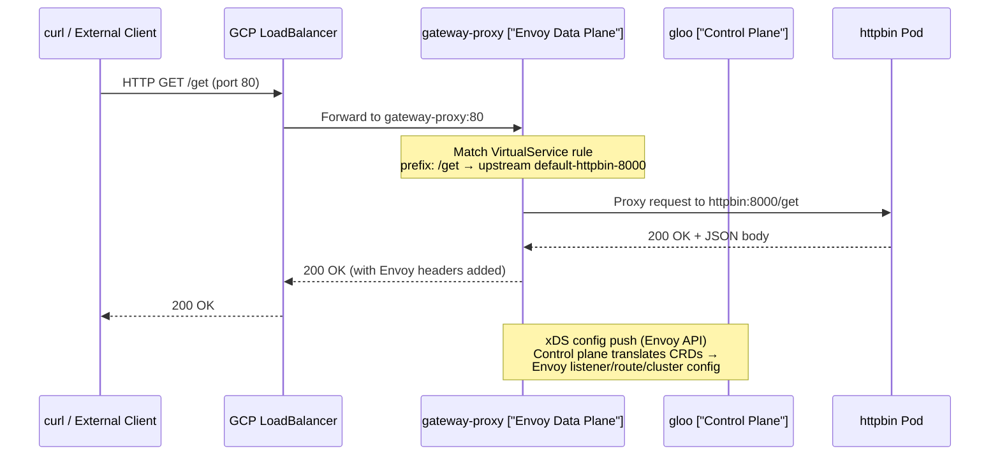
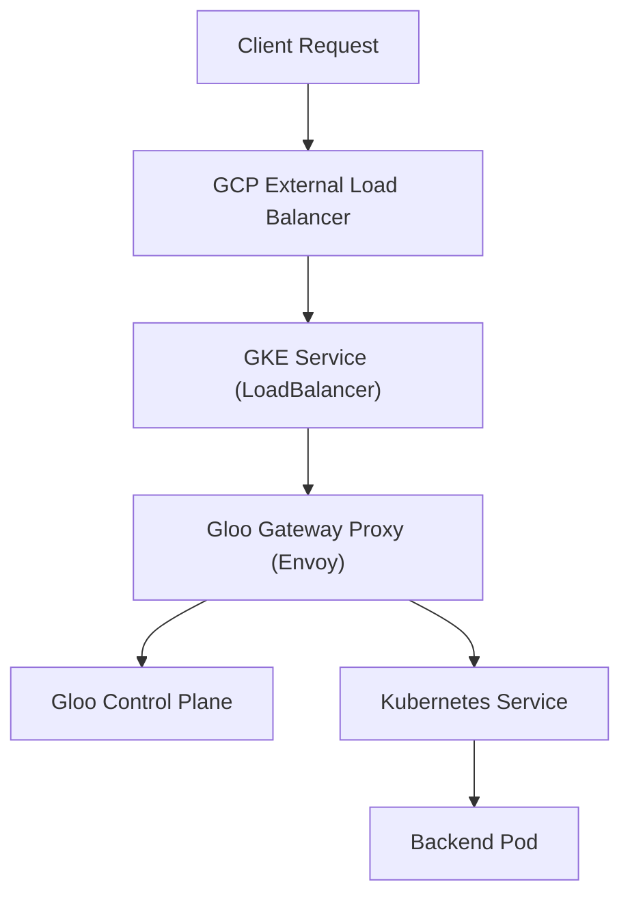
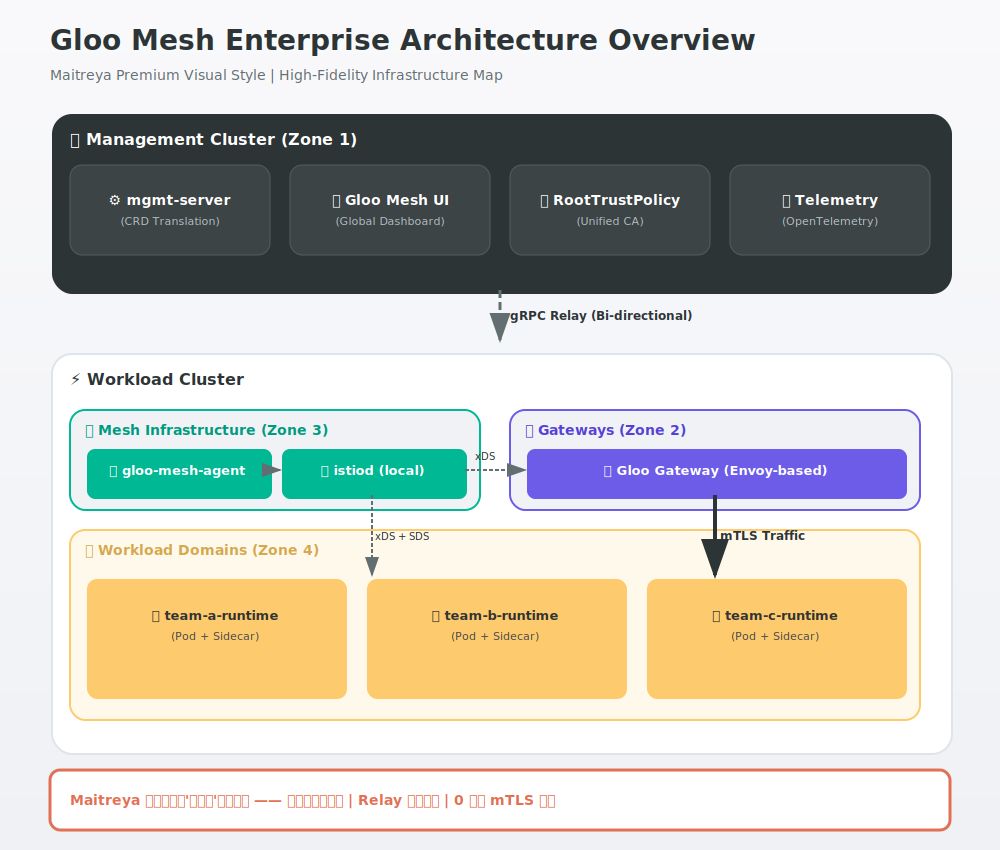
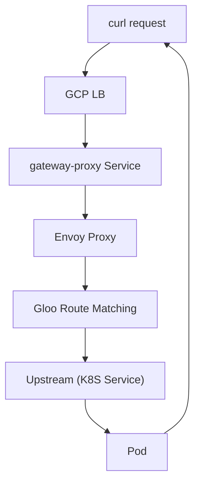

# q
需要你参考我的历史记录。我现在需要一个e2e的，在谷歌的GKE环境里边安装企业版的gloo的一个完整的步骤。然后我希望这个步骤有一些详细的说明，比如说是命令行之类的。然后给我输出一个step by 
    step的过程。你也可以在安装的过程中阐述一些最基本的概念给我。这个背景的前提是，你不用考虑我以前是不是有谷歌管理的istio 也就是Google的service 
    mesh因为谷歌的这个Service mesh 是不能满足我的需求，我现在需要用Gloo来进行对应的替换。希望你对应的输出全部是一个英文文档的，不包括中文的。然后里边的注释和描述也都是英文的。但是我需要一些详细的步骤，比如说你步骤里边要有详
    细的1234。如果是有对应的命令行的话，也帮我生成对应的命令。我需要一个e2e的安装的流程，一直到我部署一个对应的API可以访问。


# claude

# Gloo Gateway Enterprise — End-to-End Installation Guide on GKE

> **Context**: This guide replaces Google-managed Anthos Service Mesh (ASM) / Istio with
> Gloo Gateway Enterprise (built on Envoy proxy) in a GKE environment. It covers everything
> from cluster preparation to deploying and accessing a sample API through the gateway.

-----

## Table of Contents

1. [Architecture Overview](#1-architecture-overview)
1. [Prerequisites & Tools](#2-prerequisites--tools)
1. [GKE Cluster Preparation](#3-gke-cluster-preparation)
1. [Install `glooctl` CLI](#4-install-glooctl-cli)
1. [Add Helm Repositories](#5-add-helm-repositories)
1. [Install Gloo Gateway Enterprise via Helm](#6-install-gloo-gateway-enterprise-via-helm)
1. [Verify the Installation](#7-verify-the-installation)
1. [GKE-Specific: Fix Firewall for Admission Webhook](#8-gke-specific-fix-firewall-for-admission-webhook)
1. [Deploy a Sample Backend API](#9-deploy-a-sample-backend-api)
1. [Create an Upstream (Gloo routing destination)](#10-create-an-upstream-gloo-routing-destination)
1. [Create a VirtualService (Routing Rule)](#11-create-a-virtualservice-routing-rule)
1. [Expose the Gateway via GKE LoadBalancer](#12-expose-the-gateway-via-gke-loadbalancer)
1. [Test End-to-End API Access](#13-test-end-to-end-api-access)
1. [Enterprise Features Quickstart](#14-enterprise-features-quickstart)
1. [Troubleshooting Reference](#15-troubleshooting-reference)

-----

## 1. Architecture Overview

```
┌─────────────────────────────────────────────────────────────┐
│  GKE Cluster                                                │
│                                                             │
│  ┌──────────────┐    ┌───────────────────────────────────┐  │
│  │  gloo-system  │    │  default / app namespace          │  │
│  │               │    │                                   │  │
│  │  gloo         │    │  Upstream CRD ──────────────────┐ │  │
│  │  (control     │◄───│  VirtualService CRD             │ │  │
│  │   plane)      │    │                                  │ │  │
│  │               │    │  Sample API Pod (httpbin)        │ │  │
│  │  gateway-     │    │  Service: httpbin:8000           │ │  │
│  │  proxy        │    └───────────────────────────────────┘ │  │
│  │  (Envoy data  │                                         │
│  │   plane)      │                                         │
│  └──────┬────────┘                                         │
│         │ LoadBalancer Service (port 80/443)               │
└─────────┼───────────────────────────────────────────────────┘
          │
    External Traffic (curl / browser)
```

**Key Concepts:**

| Term               | Description                                                                          |
| ------------------ | ------------------------------------------------------------------------------------ |
| **Control Plane**  | The `gloo` deployment that watches CRDs and translates them into Envoy xDS config    |
| **Data Plane**     | The `gateway-proxy` Envoy deployment that actually forwards traffic                  |
| **Upstream**       | A Gloo CRD that defines a routing destination (K8s Service, static host, etc.)       |
| **VirtualService** | A Gloo CRD that defines domain-level routing rules (similar to Istio VirtualService) |
| **Gateway**        | The Gloo CRD that defines what ports/protocols the Envoy proxy listens on            |

-----

## 2. Prerequisites & Tools

### 2.1 Required Tools

| Tool         | Minimum Version     | Installation                                               |
| ------------ | ------------------- | ---------------------------------------------------------- |
| `gcloud` CLI | latest              | https://cloud.google.com/sdk/docs/install                  |
| `kubectl`    | 1.27+               | bundled with gcloud or `gcloud components install kubectl` |
| `helm`       | 3.12+               | https://helm.sh/docs/intro/install/                        |
| `glooctl`    | matching EE version | See Step 4                                                 |

### 2.2 Required Access

- GCP project with billing enabled
- `roles/container.admin` and `roles/iam.serviceAccountAdmin` on the project
- A valid **Gloo Gateway Enterprise license key** (contact Solo.io or request a trial at https://www.solo.io/free-trial/)

### 2.3 Environment Variables (set once, reuse throughout)

```bash
# ------- Edit these values to match your environment -------
export PROJECT_ID="my-gcp-project"
export CLUSTER_NAME="gloo-gke-cluster"
export CLUSTER_ZONE="us-central1-a"
export GLOO_EE_VERSION="1.18.3"          # Latest stable EE version as of writing
export GLOO_LICENSE_KEY="<YOUR_LICENSE_KEY>"
export NAMESPACE_GLOO="gloo-system"
export NAMESPACE_APP="default"
# -----------------------------------------------------------
```

> **Tip**: Add the above exports to your `~/.bashrc` or a local `.envrc` file so they persist across terminal sessions.

-----

## 3. GKE Cluster Preparation

### 3.1 Create a Standard GKE Cluster

```bash
gcloud container clusters create "${CLUSTER_NAME}" \
  --zone="${CLUSTER_ZONE}" \
  --num-nodes=3 \
  --machine-type=e2-standard-4 \
  --workload-pool="${PROJECT_ID}.svc.id.goog" \
  --enable-ip-alias \
  --release-channel=regular \
  --project="${PROJECT_ID}"
```

**Key flags explained:**

- `--enable-ip-alias`: Enables VPC-native networking (required for proper pod-to-pod routing)
- `--workload-pool`: Enables Workload Identity for future GCP service integrations
- `--machine-type=e2-standard-4`: Gloo control plane + Envoy data plane needs at least 2 vCPU per node

### 3.2 Get Cluster Credentials

```bash
gcloud container clusters get-credentials "${CLUSTER_NAME}" \
  --zone="${CLUSTER_ZONE}" \
  --project="${PROJECT_ID}"

# Verify context
kubectl config current-context
# Expected output: gke_<PROJECT_ID>_<ZONE>_<CLUSTER_NAME>
```

### 3.3 Create Cluster-Admin Binding for Your User

> **Permission check**: Run this as the GCP account that owns the project or has `container.clusterRoleBindings.create` permission.

```bash
kubectl create clusterrolebinding cluster-admin-binding \
  --clusterrole=cluster-admin \
  --user="$(gcloud config get-value account)"
```

This is required because Gloo Gateway installs CRDs and cluster-scoped RBAC resources.

### 3.4 Create the `gloo-system` Namespace (optional pre-create)

```bash
kubectl create namespace "${NAMESPACE_GLOO}"
```

-----

## 4. Install `glooctl` CLI

`glooctl` is Gloo’s dedicated CLI tool for managing gateways, virtual services, and debugging. It is **separate from Helm** but complements it.

### 4.1 Install `glooctl` on Linux/macOS

```bash
# Download the binary matching your OS
curl -sL https://run.solo.io/gloo/install | sh

# Add to PATH
export PATH=$HOME/.gloo/bin:$PATH

# Or install a specific version
curl -sLO \
  "https://github.com/solo-io/gloo/releases/download/v${GLOO_EE_VERSION}/glooctl-linux-amd64"
chmod +x glooctl-linux-amd64
sudo mv glooctl-linux-amd64 /usr/local/bin/glooctl
```

### 4.2 Verify

```bash
glooctl version
# Expected: Client: {"version":"1.18.x"}
# Server: undefined (not yet installed in cluster)
```

-----

## 5. Add Helm Repositories

Gloo Gateway Enterprise uses two Helm chart sources:

```bash
# Add the open-source Gloo repo (used as a sub-chart dependency)
helm repo add gloo https://storage.googleapis.com/solo-public-helm

# Add the Enterprise Gloo repo
helm repo add glooe https://storage.googleapis.com/gloo-ee-helm

# Update the local cache
helm repo update

# Verify repos are available
helm search repo glooe/gloo-ee --versions | head -10
```

-----

## 6. Install Gloo Gateway Enterprise via Helm

### 6.1 Create a Custom `values.yaml` for GKE

Create a file named `gloo-ee-values.yaml` with the following content:

```yaml
# gloo-ee-values.yaml
# Production-grade values for GKE deployment

license_key: ""  # Leave empty here; pass via --set-string at install time

gloo:
  # Discovery watches K8s Services and auto-creates Upstream CRDs
  discovery:
    enabled: true

  # The Gateway proxy is the Envoy data plane
  gatewayProxies:
    gatewayProxy:
      # Use a LoadBalancer Service on GKE so Google Cloud provisions an external IP
      service:
        type: LoadBalancer
        # Annotate to use an internal LoadBalancer instead (if desired):
        # extraAnnotations:
        #   cloud.google.com/load-balancer-type: "Internal"
        httpPort: 80
        httpsPort: 443

      # Set resource requests/limits for the Envoy data plane
      podTemplate:
        resources:
          requests:
            cpu: "500m"
            memory: "256Mi"
          limits:
            cpu: "2000m"
            memory: "1Gi"

  # Gloo control plane resources
  deployment:
    resources:
      requests:
        cpu: "500m"
        memory: "256Mi"
      limits:
        cpu: "1000m"
        memory: "512Mi"

# Enable Gloo Federation (optional — set false for single-cluster)
gloo-fed:
  enabled: false

# Enable built-in observability stack (Prometheus + Grafana)
prometheus:
  enabled: true

grafana:
  defaultInstallationEnabled: true

# Redis is required by Enterprise features (rate limiting, ext-auth caching)
redis:
  deployment:
    enabled: true
```

### 6.2 Install with Helm

```bash
helm install gloo-ee glooe/gloo-ee \
  --namespace "${NAMESPACE_GLOO}" \
  --create-namespace \
  --version "${GLOO_EE_VERSION}" \
  --set-string license_key="${GLOO_LICENSE_KEY}" \
  -f gloo-ee-values.yaml \
  --wait \
  --timeout 10m
```

**What each flag does:**

- `--namespace gloo-system`: All Gloo control-plane components land here
- `--create-namespace`: Creates the namespace if it does not exist
- `--version`: Pins the exact EE chart version (always pin in production)
- `--set-string license_key`: Injects the license key without writing it to `values.yaml`
- `--wait`: Waits until all Helm-managed pods are `Running/Ready` before returning
- `--timeout 10m`: GKE may take a few minutes to provision the LoadBalancer; 10 min is safe

### 6.3 Alternative: Install via `glooctl` (simpler for dev/test)

```bash
glooctl install gateway enterprise \
  --license-key "${GLOO_LICENSE_KEY}" \
  --version "${GLOO_EE_VERSION}"
```

> For production, Helm is strongly recommended over `glooctl install` because it gives you full declarative control of values, upgrade history, and rollback capability.

-----

## 7. Verify the Installation

### 7.1 Check All Pods are Running

```bash
kubectl get pods -n "${NAMESPACE_GLOO}"
```

Expected output (abbreviated):

```
NAME                                  READY   STATUS    RESTARTS   AGE
discovery-xxxxxxx                     1/1     Running   0          2m
gateway-proxy-xxxxxxx                 1/1     Running   0          2m
gloo-xxxxxxx                          1/1     Running   0          2m
gloo-fed-xxxxxxx                      1/1     Running   0          2m
observability-xxxxxxx                 1/1     Running   0          2m
rate-limit-xxxxxxx                    1/1     Running   0          2m
redis-xxxxxxx                         1/1     Running   0          2m
extauth-xxxxxxx                       1/1     Running   0          2m
```

### 7.2 Check CRDs are Installed

```bash
kubectl get crd | grep solo.io
```

Key CRDs you should see:

```
gateways.gateway.solo.io
virtualservices.gateway.solo.io
upstreams.gloo.solo.io
upstreamgroups.gloo.solo.io
routetables.gateway.solo.io
authconfigs.enterprise.gloo.solo.io
ratelimitconfigs.ratelimit.solo.io
```

### 7.3 Validate with `glooctl`

```bash
glooctl check
```

Expected output:

```
Checking deployments... OK
Checking pods... OK
Checking upstreams... OK
Checking upstream groups... OK
Checking secrets... OK
Checking virtual services... OK
Checking gateways... OK
Checking proxies... OK
No problems detected.
```

### 7.4 Check `glooctl` Server Version

```bash
glooctl version
# Both Client and Server versions should be present and matching
```

-----

## 8. GKE-Specific: Fix Firewall for Admission Webhook

> **This step is critical for GKE**. Without it, creating `VirtualService` and `Upstream`
> resources will time out with: `Timeout: request did not complete within requested timeout 30s`

**Why**: Gloo installs a Kubernetes admission webhook that validates gateway configs before applying them. The webhook server runs on **port 8443** inside the cluster. GKE’s default firewall rules only allow the API server (master node) to reach worker nodes on ports `443` and `10250`. You must explicitly open port `8443`.

### 8.1 Identify the Master CIDR

```bash
# Get the master authorized networks CIDR for your cluster
MASTER_CIDR=$(gcloud container clusters describe "${CLUSTER_NAME}" \
  --zone="${CLUSTER_ZONE}" \
  --project="${PROJECT_ID}" \
  --format="value(privateClusterConfig.masterIpv4CidrBlock)")

echo "Master CIDR: ${MASTER_CIDR}"
```

### 8.2 Get the Node Network Tag

```bash
# GKE nodes get an auto-generated network tag in format: gke-<cluster>-<hash>-node
NODE_TAG=$(gcloud compute instances list \
  --filter="name~'${CLUSTER_NAME}'" \
  --format="value(tags.items[0])" | head -1)

echo "Node tag: ${NODE_TAG}"
```

### 8.3 Create the Firewall Rule

```bash
gcloud compute firewall-rules create "allow-gloo-webhook-${CLUSTER_NAME}" \
  --project="${PROJECT_ID}" \
  --network=default \
  --allow=tcp:8443 \
  --source-ranges="${MASTER_CIDR}" \
  --target-tags="${NODE_TAG}" \
  --description="Allow GKE API server to reach Gloo admission webhook on port 8443"
```

### 8.4 Verify the Firewall Rule

```bash
gcloud compute firewall-rules describe "allow-gloo-webhook-${CLUSTER_NAME}" \
  --project="${PROJECT_ID}"
```

-----

## 9. Deploy a Sample Backend API

We will use **`httpbin`** — a lightweight HTTP testing service — as our sample backend API.

```bash
# Deploy httpbin to the app namespace
kubectl apply -n "${NAMESPACE_APP}" -f - <<EOF
apiVersion: apps/v1
kind: Deployment
metadata:
  name: httpbin
  namespace: ${NAMESPACE_APP}
  labels:
    app: httpbin
    version: v1
spec:
  replicas: 2
  selector:
    matchLabels:
      app: httpbin
  template:
    metadata:
      labels:
        app: httpbin
        version: v1
    spec:
      containers:
      - name: httpbin
        image: kennethreitz/httpbin:latest
        imagePullPolicy: IfNotPresent
        ports:
        - containerPort: 80
          name: http
        resources:
          requests:
            cpu: "100m"
            memory: "64Mi"
          limits:
            cpu: "200m"
            memory: "128Mi"
---
apiVersion: v1
kind: Service
metadata:
  name: httpbin
  namespace: ${NAMESPACE_APP}
  labels:
    app: httpbin
spec:
  selector:
    app: httpbin
  ports:
  - name: http
    port: 8000
    targetPort: 80
    protocol: TCP
  type: ClusterIP
EOF
```

### Verify the Pod is Running

```bash
kubectl get pods -n "${NAMESPACE_APP}" -l app=httpbin
# Expected: 2/2 Running

kubectl get svc -n "${NAMESPACE_APP}" httpbin
# Expected: ClusterIP with port 8000
```

-----

## 10. Create an Upstream (Gloo Routing Destination)

**Concept**: An `Upstream` in Gloo is the equivalent of a “backend” or “destination”. It can point to a Kubernetes Service, a static external host, AWS Lambda, etc. The Gloo `discovery` component auto-creates Upstreams for K8s Services, but creating them explicitly gives you full control.

```bash
kubectl apply -f - <<EOF
apiVersion: gloo.solo.io/v1
kind: Upstream
metadata:
  name: default-httpbin-8000
  namespace: ${NAMESPACE_GLOO}
  labels:
    app: httpbin
spec:
  kube:
    # Reference to the K8s Service in the app namespace
    serviceName: httpbin
    serviceNamespace: ${NAMESPACE_APP}
    servicePort: 8000
EOF
```

### Verify the Upstream is Accepted

```bash
kubectl get upstream -n "${NAMESPACE_GLOO}" default-httpbin-8000

# Check status — should be "Accepted"
glooctl get upstream default-httpbin-8000 -n "${NAMESPACE_GLOO}"
```

Expected output:

```
+----------------------+------------+----------+------------------------+
| UPSTREAM             | TYPE       | STATUS   | DETAILS                |
+----------------------+------------+----------+------------------------+
| default-httpbin-8000 | Kubernetes | Accepted | svc name: httpbin      |
|                      |            |          | svc namespace: default |
|                      |            |          | port: 8000             |
+----------------------+------------+----------+------------------------+
```

> **Discovery auto-creates Upstreams**: If you deployed httpbin before Gloo, you may already see an Upstream named `default-httpbin-8000` auto-created by discovery. Check with `kubectl get upstreams -n gloo-system`. If it exists, skip this step.

-----

## 11. Create a VirtualService (Routing Rule)

**Concept**: A `VirtualService` in Gloo defines how incoming requests (matched by domain, path, headers, etc.) are routed to an Upstream. It is the central routing CRD in Gloo Edge (equivalent to a combination of Istio `Gateway` + `VirtualService`).

```bash
kubectl apply -f - <<EOF
apiVersion: gateway.solo.io/v1
kind: VirtualService
metadata:
  name: httpbin-vs
  namespace: ${NAMESPACE_GLOO}
spec:
  virtualHost:
    # Accept any hostname — change to your real domain in production
    domains:
    - "*"
    routes:
    # Route 1: /get path → httpbin /get
    - matchers:
      - prefix: /get
      routeAction:
        single:
          upstream:
            name: default-httpbin-8000
            namespace: ${NAMESPACE_GLOO}
      options:
        # Automatically rewrite the Host header to the upstream service
        autoHostRewrite: true
    # Route 2: /headers path → httpbin /headers
    - matchers:
      - prefix: /headers
      routeAction:
        single:
          upstream:
            name: default-httpbin-8000
            namespace: ${NAMESPACE_GLOO}
      options:
        autoHostRewrite: true
    # Route 3: Catch-all → httpbin root
    - matchers:
      - prefix: /
      routeAction:
        single:
          upstream:
            name: default-httpbin-8000
            namespace: ${NAMESPACE_GLOO}
EOF
```

### Verify the VirtualService is Accepted

```bash
glooctl get virtualservice -n "${NAMESPACE_GLOO}"
```

Expected output:

```
+-----------------+--------------+---------+------+----------+-----------------+----------------------------------+
| VIRTUAL SERVICE | DISPLAY NAME | DOMAINS | SSL  |  STATUS  | LISTENERPLUGINS |             ROUTES               |
+-----------------+--------------+---------+------+----------+-----------------+----------------------------------+
| httpbin-vs      |              | *       | none | Accepted |                 | /get, /headers, / -> upstream    |
+-----------------+--------------+---------+------+----------+-----------------+----------------------------------+
```

-----

## 12. Expose the Gateway via GKE LoadBalancer

### 12.1 Check LoadBalancer External IP

The `gateway-proxy` service should already be a `LoadBalancer` type (configured in `values.yaml`). GKE will provision a Google Cloud External IP automatically.

```bash
kubectl get svc -n "${NAMESPACE_GLOO}" gateway-proxy

# Watch until EXTERNAL-IP is assigned (can take 1-3 minutes)
kubectl get svc -n "${NAMESPACE_GLOO}" gateway-proxy -w
```

Expected output once provisioned:

```
NAME            TYPE           CLUSTER-IP      EXTERNAL-IP      PORT(S)                      AGE
gateway-proxy   LoadBalancer   10.100.200.50   34.72.xxx.xxx    80:32000/TCP,443:32001/TCP   5m
```

### 12.2 Save the External IP as a Variable

```bash
GATEWAY_IP=$(kubectl get svc -n "${NAMESPACE_GLOO}" gateway-proxy \
  -o jsonpath='{.status.loadBalancer.ingress[0].ip}')

echo "Gateway IP: ${GATEWAY_IP}"
```

### 12.3 Optional: Use an Internal LoadBalancer (recommended for internal APIs)

If your platform routes internal traffic only (matching your existing ASM architecture pattern), annotate the service to use a GCP internal LB:

```bash
kubectl annotate svc gateway-proxy \
  -n "${NAMESPACE_GLOO}" \
  cloud.google.com/load-balancer-type="Internal"
```

Or include this in `values.yaml` from the start:

```yaml
gloo:
  gatewayProxies:
    gatewayProxy:
      service:
        type: LoadBalancer
        extraAnnotations:
          cloud.google.com/load-balancer-type: "Internal"
```

-----

## 13. Test End-to-End API Access

### 13.1 Basic HTTP Test

```bash
# Test the /get route
curl -i http://${GATEWAY_IP}/get

# Expected: 200 OK with JSON from httpbin
```

Expected response:

```json
{
  "args": {},
  "headers": {
    "Accept": "*/*",
    "Host": "34.72.xxx.xxx",
    "User-Agent": "curl/8.x",
    "X-Envoy-Expected-Rq-Timeout-Ms": "15000",
    "X-Forwarded-Proto": "http",
    "X-Request-Id": "xxxxxxxx-xxxx-xxxx-xxxx-xxxxxxxxxxxx"
  },
  "url": "http://34.72.xxx.xxx/get"
}
```

> **Note**: The `X-Request-Id` and `X-Envoy-Expected-Rq-Timeout-Ms` headers confirm traffic is flowing through the Envoy data plane.

### 13.2 Test the /headers Route

```bash
curl -i http://${GATEWAY_IP}/headers \
  -H "X-Custom-Header: aibang-platform"
```

### 13.3 Test with a Custom Host Header

```bash
# Simulate a named virtual host (useful when you have domain-based routing)
curl -i http://${GATEWAY_IP}/get \
  -H "Host: api.myteam.internal"
```

### 13.4 Test via `glooctl proxy url`

```bash
# glooctl can discover the proxy URL automatically
PROXY_URL=$(glooctl proxy url)
echo "Proxy URL: ${PROXY_URL}"

curl -i ${PROXY_URL}/get
```

### 13.5 Traffic Flow Diagram



-----

## 14. Enterprise Features Quickstart

Gloo Gateway Enterprise provides features not available in the open-source version. Here are quickstart examples for the most commonly used ones.

### 14.1 Rate Limiting

```bash
kubectl apply -f - <<EOF
apiVersion: ratelimit.solo.io/v1alpha1
kind: RateLimitConfig
metadata:
  name: global-rate-limit
  namespace: ${NAMESPACE_GLOO}
spec:
  raw:
    descriptors:
    - key: remote_address
      rateLimit:
        requestsPerUnit: 100
        unit: MINUTE
    rateLimits:
    - actions:
      - remoteAddress: {}
EOF
```

Reference it in your VirtualService under `options`:

```yaml
spec:
  virtualHost:
    options:
      rateLimitConfigs:
        refs:
        - name: global-rate-limit
          namespace: gloo-system
```

### 14.2 External Authentication (API Key)

```bash
kubectl apply -f - <<EOF
apiVersion: enterprise.gloo.solo.io/v1
kind: AuthConfig
metadata:
  name: apikey-auth
  namespace: ${NAMESPACE_GLOO}
spec:
  configs:
  - apiKeyAuth:
      headerName: "x-api-key"
      labelSelector:
        team: platform
EOF
```

Reference in VirtualService:

```yaml
options:
  extauth:
    configRef:
      name: apikey-auth
      namespace: gloo-system
```

### 14.3 JWT Token Validation (OIDC-style)

```yaml
options:
  jwt:
    providers:
      myidp:
        issuer: "https://accounts.google.com"
        audiences:
        - "my-client-id.apps.googleusercontent.com"
        jwks:
          remote:
            url: "https://www.googleapis.com/oauth2/v3/certs"
            upstreamRef:
              name: "google-jwks"
              namespace: gloo-system
```

### 14.4 Web Application Firewall (WAF / ModSecurity)

```yaml
# Attach to a VirtualService to enable OWASP Core Rule Set
options:
  waf:
    ruleSets:
    - ruleStr: |
        SecRuleEngine On
        SecRule REQUEST_HEADERS:User-Agent "BadBot" \
          "id:1001,phase:1,deny,status:403,msg:'Bad Bot Detected'"
```

### 14.5 Transformation (Header Manipulation)

```yaml
# Add a custom header to every response, rename upstream headers
options:
  transformations:
    responseTransformation:
      transformationTemplate:
        headers:
          x-platform-version:
            text: "aibang-gloo-1.18"
          x-powered-by:
            text: "envoy"
```

-----

## 15. Troubleshooting Reference

### 15.1 VirtualService Stuck in “Pending” Status

```bash
# Check the gloo control plane logs
kubectl logs -n "${NAMESPACE_GLOO}" deployment/gloo -f

# Check if the upstream is healthy
glooctl check upstreams
```

**Common cause**: Upstream points to a Service that does not exist or has no ready endpoints.

### 15.2 Admission Webhook Timeout

```bash
# Symptom: kubectl apply -f virtualservice.yaml hangs 30s then fails
# Fix: Ensure firewall rule for port 8443 is applied (see Step 8)

# Verify webhook is reachable from API server
kubectl get validatingwebhookconfigurations | grep gloo
```

### 15.3 gateway-proxy Not Getting External IP

```bash
# Check GKE events on the service
kubectl describe svc gateway-proxy -n "${NAMESPACE_GLOO}"

# Common causes:
# - Quota exceeded for external IPs in project
# - VPC subnet exhausted
# - GKE Cloud NAT not configured for private clusters
```

### 15.4 Envoy Proxy Debug

```bash
# Dump the live Envoy config to inspect all listeners, clusters, and routes
glooctl proxy dump

# Check proxy logs
glooctl proxy logs --level debug

# Check served config vs CRD config
glooctl proxy served-config
```

### 15.5 Check Upstream Discovery

```bash
# List all auto-discovered upstreams
kubectl get upstreams -n "${NAMESPACE_GLOO}"

# Check if discovery is processing a specific service
kubectl logs -n "${NAMESPACE_GLOO}" deployment/discovery | grep httpbin
```

### 15.6 License Issues

```bash
# Validate your license key
glooctl license validate --license-key "${GLOO_LICENSE_KEY}"

# Check license expiry in the running cluster
kubectl logs -n "${NAMESPACE_GLOO}" deployment/gloo | grep -i license
```

### 15.7 Useful `glooctl` Diagnostic Commands

```bash
# Full system health check
glooctl check

# Get all virtual services with route details
glooctl get virtualservice -n "${NAMESPACE_GLOO}" -o yaml

# Get all upstreams
glooctl get upstream -n "${NAMESPACE_GLOO}"

# Get gateway proxy URL
glooctl proxy url

# Get gateway proxy address
glooctl proxy address

# Get a snapshot of xDS config currently pushed to Envoy
glooctl proxy snapshot
```

-----

## Appendix A: Clean Up Resources

```bash
# Remove the sample app
kubectl delete deployment,svc httpbin -n "${NAMESPACE_APP}"

# Remove the Gloo routing resources
kubectl delete virtualservice httpbin-vs -n "${NAMESPACE_GLOO}"
kubectl delete upstream default-httpbin-8000 -n "${NAMESPACE_GLOO}"

# Uninstall Gloo Gateway Enterprise (Helm)
helm uninstall gloo-ee -n "${NAMESPACE_GLOO}"

# Delete the namespace
kubectl delete namespace "${NAMESPACE_GLOO}"

# Delete the firewall rule
gcloud compute firewall-rules delete "allow-gloo-webhook-${CLUSTER_NAME}" \
  --project="${PROJECT_ID}" --quiet

# Delete the GKE cluster (DESTRUCTIVE — check before running)
# gcloud container clusters delete "${CLUSTER_NAME}" \
#   --zone="${CLUSTER_ZONE}" --project="${PROJECT_ID}" --quiet
```

-----

## Appendix B: Key Gloo CRD Cheat Sheet

| CRD               | API Group                      | Purpose                                               |
| ----------------- | ------------------------------ | ----------------------------------------------------- |
| `Gateway`         | `gateway.solo.io/v1`           | Define listener ports and protocols (L4 config)       |
| `VirtualService`  | `gateway.solo.io/v1`           | Define L7 routing rules per domain                    |
| `RouteTable`      | `gateway.solo.io/v1`           | Delegated route rules (shared across VirtualServices) |
| `Upstream`        | `gloo.solo.io/v1`              | Define routing destinations                           |
| `UpstreamGroup`   | `gloo.solo.io/v1`              | Weighted routing across multiple Upstreams            |
| `AuthConfig`      | `enterprise.gloo.solo.io/v1`   | External auth policy (API key, OIDC, JWT)             |
| `RateLimitConfig` | `ratelimit.solo.io/v1alpha1`   | Rate limiting descriptors                             |
| `GraphQLApi`      | `graphql.gloo.solo.io/v1beta1` | GraphQL schema stitching (EE only)                    |

-----

## Appendix C: Comparison with ASM/Istio CRDs

| Istio / ASM           | Gloo Gateway Equivalent               | Notes                                                        |
| --------------------- | ------------------------------------- | ------------------------------------------------------------ |
| `Gateway`             | `Gateway` (gloo)                      | Gloo Gateway CRD also manages the proxy deployment lifecycle |
| `VirtualService`      | `VirtualService` (gloo)               | Gloo VS also handles routing to non-K8s upstreams            |
| `DestinationRule`     | `Upstream` options                    | TLS mode, load balancing policy set on the Upstream CRD      |
| `ServiceEntry`        | `Upstream` (static)                   | External services registered as static Upstreams             |
| `AuthorizationPolicy` | `AuthConfig` + VirtualService options | Gloo uses a more plugin-based model                          |
| `PeerAuthentication`  | Upstream mTLS config                  | Per-upstream mTLS settings in the Upstream CRD spec          |
| `EnvoyFilter`         | Route/VH `options` fields             | Most filter config is done declaratively via CRD options     |

-----

*Document Version: 1.0 | Gloo Gateway Enterprise Version: 1.18.x | GKE Version: 1.27+*
*Reference: https://docs.solo.io/gloo-edge/latest/*
# ChatGPT 

# Gloo Enterprise on GKE — End-to-End Deployment Guide (Production-Oriented)
---
## 1. Problem Analysis
You want to:
- Replace Google-managed Service Mesh with **Gloo Enterprise**
- Deploy it on **GKE**
- Build a **full traffic path** (Ingress → Gloo → Upstream Service)
- Validate with a real API request
This is an **API Gateway + Service Mesh alternative architecture**, where:
- Gloo = **Ingress + Gateway + Traffic Control**
- Envoy = **Data Plane**
- Kubernetes = **Orchestration Layer**
---
## 2. Architecture Overview




⸻

3. Prerequisites

3.1 Required Tools

# Check tools
gcloud version
kubectl version --client
helm version

3.2 GKE Cluster

# Create cluster (if not exists)
gcloud container clusters create gloo-cluster \
  --zone us-central1-a \
  --num-nodes 3 \
  --machine-type e2-standard-4 \
  --enable-ip-alias
# Get credentials
gcloud container clusters get-credentials gloo-cluster --zone us-central1-a

⸻

4. Install Gloo Enterprise

Gloo Enterprise requires license

4.1 Add Helm Repo

helm repo add glooe https://storage.googleapis.com/gloo-ee-helm
helm repo update

⸻

4.2 Create Namespace

kubectl create namespace gloo-system

⸻

4.3 Create License Secret

kubectl create secret generic glooe-license \
  -n gloo-system \
  --from-literal=license-key=<YOUR_LICENSE_KEY>

⸻

4.4 Install Gloo Enterprise

helm install gloo glooe/gloo-ee \
  --namespace gloo-system \
  --set license_key=<YOUR_LICENSE_KEY> \
  --set gatewayProxies.gatewayProxy.service.type=LoadBalancer

⸻

5. Verify Installation

kubectl get pods -n gloo-system

Expected:

* gloo
* gateway-proxy
* discovery
* rate-limit (optional)

⸻

kubectl get svc -n gloo-system

Get external IP:

kubectl get svc gateway-proxy -n gloo-system

⸻

6. Deploy Sample Application

6.1 Deploy Echo Service

kubectl create deployment echo --image=ealen/echo-server
kubectl expose deployment echo --port=80

⸻

6.2 Verify Service

kubectl get svc echo

⸻

7. Configure Gloo Routing

7.1 Create Upstream
```yaml
apiVersion: gloo.solo.io/v1
kind: Upstream
metadata:
  name: echo-upstream
  namespace: gloo-system
spec:
  kube:
    serviceName: echo
    serviceNamespace: default
    servicePort: 80
```
kubectl apply -f upstream.yaml

⸻

7.2 Create Virtual Service
```yaml
apiVersion: gateway.solo.io/v1
kind: VirtualService
metadata:
  name: echo
  namespace: gloo-system
spec:
  virtualHost:
    domains:
      - "*"
    routes:
      - matchers:
          - prefix: /
        routeAction:
          single:
            upstream:
              name: echo-upstream
              namespace: gloo-system
```
kubectl apply -f virtualservice.yaml

⸻

8. Test End-to-End

8.1 Get External IP

export GATEWAY_IP=$(kubectl get svc gateway-proxy -n gloo-system -o jsonpath='{.status.loadBalancer.ingress[0].ip}')
echo $GATEWAY_IP

⸻

8.2 Send Request

curl http://$GATEWAY_IP

Expected:

* Echo response from backend pod
* Includes request headers

⸻

9. Request Flow Deep Dive

⸻

10. Key Concepts (Minimal but Critical)

10.1 Upstream

* Represents backend service
* Similar to:
    * Kubernetes Service abstraction
    * Kong Service

⸻

10.2 VirtualService

* Defines routing rules
* Equivalent to:
    * Ingress
    * Kong Route

⸻

10.3 Gateway Proxy (Envoy)

* Actual traffic handler
* Runs as data plane

⸻

10.4 Control Plane

* Gloo = config + translation layer
* Converts CRDs → Envoy config

⸻

11. Production Considerations

11.1 High Availability

gatewayProxies:
  gatewayProxy:
    replicaCount: 3

⸻

11.2 Resource Requests

resources:
  requests:
    cpu: 500m
    memory: 512Mi

⸻

11.3 Pod Disruption Budget

apiVersion: policy/v1
kind: PodDisruptionBudget
metadata:
  name: gloo-pdb
spec:
  minAvailable: 2
  selector:
    matchLabels:
      gloo: gateway-proxy

⸻

11.4 Rolling Update Strategy

strategy:
  type: RollingUpdate
  rollingUpdate:
    maxUnavailable: 0
    maxSurge: 1

⸻

12. Troubleshooting Checklist

Issue	Check
No external IP	Service type LoadBalancer
404 from Gloo	VirtualService mismatch
503 upstream	Upstream config
Pod not ready	readinessProbe
Connection reset	Envoy logs

⸻

Useful Debug Commands

kubectl logs -n gloo-system deploy/gateway-proxy
kubectl get upstream -n gloo-system
kubectl describe virtualservice -n gloo-system

⸻

13. Next Step (Recommended)

You should extend:

1. TLS / HTTPS
2. mTLS between services
3. Rate limiting
4. Auth (JWT / OIDC)
5. Traffic splitting (canary)

⸻

14. Complexity Assessment

Layer	Complexity
Basic install	Simple
Routing	Simple
Production HA	Moderate
Security (mTLS/Auth)	Advanced

⸻

15. Final Summary

You now have:

* Gloo Enterprise installed on GKE
* Envoy handling ingress traffic
* Working API exposed externally
* Full E2E validation completed

This setup is a production-ready baseline, and can replace:

* Nginx Ingress
* Kong Gateway (partially)
* Google Service Mesh (depending on features)

⸻

If you want next step, I can help you design:

* Gloo + Cloud Load Balancer + mTLS + Cloud Armor full architecture
* Or map your existing Nginx → Kong → Gloo migration path


