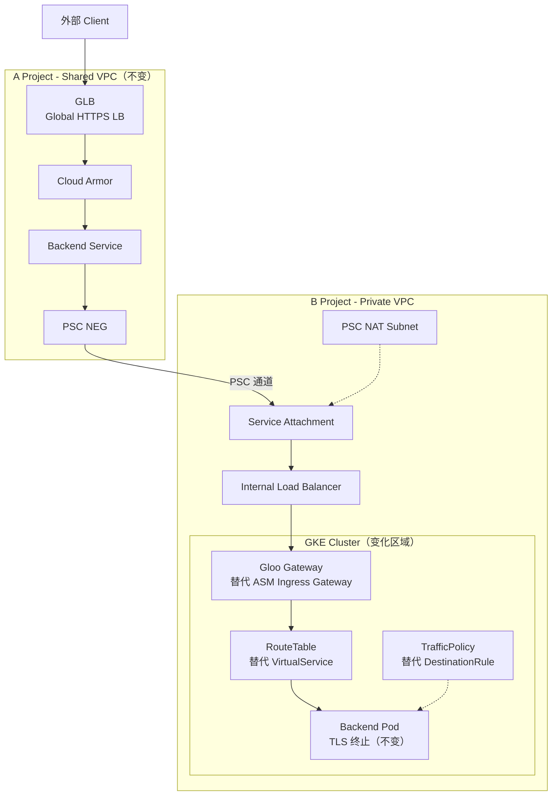
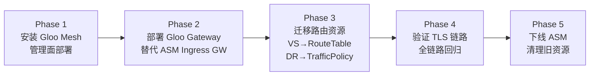
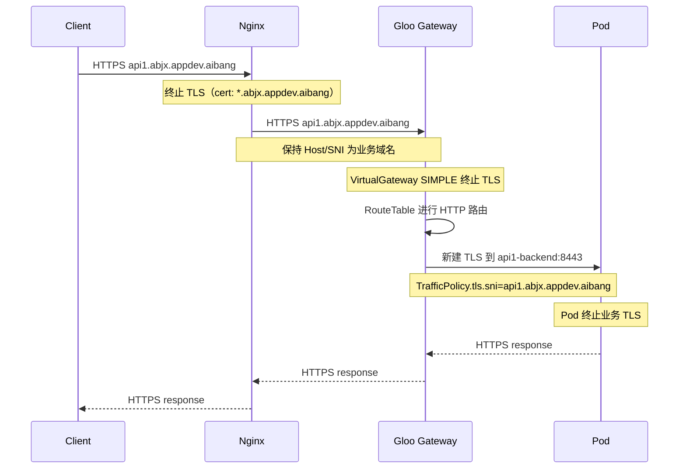

# Cross-Project 架构下 Gloo Mesh 替换 ASM 方案探索

> **文档定位**：本文档在当前 Cross-Project PSC NEG 大架构不变的前提下，探索用 Gloo Mesh（Solo.io）替换 GKE ASM（Anthos/Cloud Service Mesh）的可行性、资源映射、配置调整和迁移路径。
>
> **核心前提**：`nginx+simple+merge.md` 中定义的端到端 TLS、域名不变、Host/SNI 保留、证书统一等硬需求，在 Gloo Mesh 下**必须全部保持不变**。

---

## 1. 为什么考虑替换 ASM

### 1.1 ASM 的局限（你们遇到的痛点）

| 痛点 | 说明 |
| --- | --- |
| Google 托管控制面灵活性不足 | ASM Managed 版本升级节奏由 Google 决定，无法精确控制 |
| 多集群/多环境管理复杂 | ASM 的多集群方案依赖 GKE Fleet，与非 GCP 环境难以统一 |
| 运维对象过多 | Gateway + VirtualService + DestinationRule + ServiceEntry + PeerAuthentication 组合复杂 |
| 与 GCP 深度绑定 | 如果未来有混合云/多云需求，ASM 的可移植性受限 |

### 1.2 Gloo Mesh 的定位

Gloo Mesh（Solo.io）是一个**基于 Istio 的企业级服务网格管理平台**，核心特征：

- **底层仍然是 Istio + Envoy**：不是从零替换，而是在 Istio 之上提供更高层级的抽象
- **管理面（Management Plane）集中式管控**：统一管理多集群 Istio 实例
- **API 抽象层**：用 `VirtualGateway`、`RouteTable`、`VirtualDestination` 等高阶 CRD 替代直接操作 Istio CRD
- **内置 API Gateway 能力**：Gloo Gateway 可以同时作为 Ingress Gateway 和 API Gateway

---

## 2. Gloo Mesh vs ASM 核心对比

### 2.1 架构层对比

| 维度 | ASM (Cloud Service Mesh) | Gloo Mesh (Solo.io) |
| --- | --- | --- |
| 控制面 | Google 托管 istiod | Solo.io 管理面 + 自管/托管 Istio |
| 数据面 | Envoy Sidecar | Envoy Sidecar（相同） |
| API 模型 | 标准 Istio CRD（Gateway, VS, DR, SE） | 高阶 CRD（VirtualGateway, RouteTable 等） |
| 多集群 | GKE Fleet + Istio Multi-cluster | 内置 Workspace + 跨集群联邦 |
| Gateway | Istio Ingress Gateway | Gloo Gateway（基于 Envoy，兼容 Istio） |
| 证书管理 | 依赖 istiod CA 或外部 CA | 内置 CA 或集成外部 CA（cert-manager/Vault） |
| 运维工具 | istioctl + GCP Console | meshctl + Gloo UI |
| 适用场景 | GCP 单云、GKE 为主 | 多云、混合云、复杂多集群 |

### 2.2 资源对象映射

这是迁移的核心——你现有的 Istio 资源如何映射到 Gloo Mesh 资源：

| 当前 ASM 资源 | Gloo Mesh 等价物 | 说明 |
| --- | --- | --- |
| `Gateway` | `VirtualGateway` | 定义入口网关监听器、TLS 配置 |
| `VirtualService` | `RouteTable` | 路由规则，支持 delegation（路由委托） |
| `DestinationRule` | `TrafficPolicy` / `VirtualDestination` | 后端 TLS、负载均衡、连接池配置 |
| `ServiceEntry` | `ExternalService` / `ExternalEndpoint` | 注册外部或跨集群服务 |
| `PeerAuthentication` | `AccessPolicy` / `SecurityPolicy` | mTLS 策略和访问控制 |
| `Secret (TLS)` | `Secret (TLS)`（不变） | K8s Secret 通用 |

### 2.3 关键差异详解

#### Gloo Mesh 的 RouteTable 支持 Delegation

ASM 中所有路由规则都写在 `VirtualService` 里，多团队协作容易冲突。Gloo Mesh 的 `RouteTable` 支持**分层委托**：

```
平台团队: 定义 VirtualGateway + 根 RouteTable（域名级）
    ↓ delegate
业务团队 A: 子 RouteTable（/api1/* 路径）
业务团队 B: 子 RouteTable（/api2/* 路径）
```

这对你们"Gateway 作为标准模板，用户只关注 runtime 侧资源"的需求是**天然匹配**的。

#### Gloo Mesh 的 Workspace 隔离

Gloo Mesh 引入 `Workspace` 概念，每个 Workspace 可以隔离：
- 路由策略
- 安全策略
- 服务发现范围

这比 ASM 的 namespace 级隔离更精细。

---

## 3. Cross-Project 架构：Gloo Mesh 替换后的变化

### 3.1 不变的部分

以下组件和配置**完全不变**：

| 组件 | 说明 |
| --- | --- |
| A Project GLB + Cloud Armor + PSC NEG | 入口层不涉及 mesh，完全不变 |
| B Project Service Attachment + PSC NAT Subnet | Producer 侧 PSC 配置不变 |
| B Project ILB | ILB 作为 GKE 入口，不变 |
| 端到端 TLS 硬需求 | 全链路加密、域名不变、Host/SNI 保留、wildcard 证书统一 |
| Nginx 配置 | Nginx 层面不涉及 mesh CRD，配置不变 |
| Pod TLS 终止 | Pod 自己监听 HTTPS、挂载证书，不变 |

### 3.2 变化的部分

变化**仅发生在 B Project GKE 集群内部**，具体是 mesh 控制面和流量治理资源：



### 3.3 流量路径对比

#### ASM 当前路径

```text
ILB → ASM Ingress Gateway (Envoy)
    → Gateway CR (SIMPLE, 终止 TLS)
    → VirtualService (HTTP 路由)
    → DestinationRule (TLS origination to Pod)
    → Pod (终止业务 TLS)
```

#### Gloo Mesh 替换后路径

```text
ILB → Gloo Gateway (Envoy, 功能等价)
    → VirtualGateway (SIMPLE, 终止 TLS)
    → RouteTable (HTTP 路由 + delegation)
    → TrafficPolicy (TLS origination to Pod)
    → Pod (终止业务 TLS)
```

**本质上流量路径和 TLS 处理逻辑完全一致**，只是管理面抽象不同。

---

## 4. 配置迁移详解

### 4.1 Gateway → VirtualGateway

**ASM 当前配置**（来自 `nginx+simple+merge.md`）：

```yaml
# ASM Istio Gateway
apiVersion: networking.istio.io/v1beta1
kind: Gateway
metadata:
  name: runtime-team-gateway
  namespace: abjx-int
spec:
  selector:
    app: runtime-istio-ingressgateway
  servers:
  - port:
      number: 443
      name: https-team
      protocol: HTTPS
    hosts:
    - "*.abjx.appdev.aibang"
    tls:
      mode: SIMPLE
      credentialName: wildcard-abjx-appdev-aibang-cert
      minProtocolVersion: TLSV1_2
```

**Gloo Mesh 等价配置**：

```yaml
# Gloo VirtualGateway
apiVersion: networking.gloo.solo.io/v2
kind: VirtualGateway
metadata:
  name: runtime-team-gateway
  namespace: abjx-int
spec:
  workloads:
  - selector:
      labels:
        app: gloo-gateway        # Gloo Gateway Pod 标签
      namespace: abjx-int
  listeners:
  - http: {}
    port:
      number: 443
    tls:
      mode: SIMPLE
      secretName: wildcard-abjx-appdev-aibang-cert
    allowedRouteTables:
    - host: "*.abjx.appdev.aibang"
```

**差异说明**：
- `selector` 改为 `workloads[].selector`
- `credentialName` 改为 `secretName`（引用同一个 K8s TLS Secret）
- 新增 `allowedRouteTables` 控制哪些 RouteTable 可以绑定
- TLS 模式（SIMPLE）和证书不变

### 4.2 VirtualService → RouteTable

**ASM 当前配置**：

```yaml
# ASM VirtualService
apiVersion: networking.istio.io/v1beta1
kind: VirtualService
metadata:
  name: api1-abjx-vs
  namespace: abjx-int
spec:
  gateways:
  - runtime-team-gateway
  hosts:
  - api1.abjx.appdev.aibang
  http:
  - name: route-api1
    match:
    - uri:
        prefix: /
    route:
    - destination:
        host: api1-backend.abjx-int.svc.cluster.local
        port:
          number: 8443
    timeout: 60s
    retries:
      attempts: 2
      perTryTimeout: 20s
      retryOn: gateway-error,connect-failure,reset
```

**Gloo Mesh 等价配置**：

```yaml
# Gloo RouteTable
apiVersion: networking.gloo.solo.io/v2
kind: RouteTable
metadata:
  name: api1-abjx-rt
  namespace: abjx-int
spec:
  hosts:
  - api1.abjx.appdev.aibang
  virtualGateways:
  - name: runtime-team-gateway
    namespace: abjx-int
  http:
  - name: route-api1
    matchers:
    - uri:
        prefix: /
    forwardTo:
      destinations:
      - ref:
          name: api1-backend
          namespace: abjx-int
        port:
          number: 8443
    labels:
      route: api1
  # 超时和重试通过 RouteOption 或 RouteTable 内联配置
```

**差异说明**：
- `gateways` 改为 `virtualGateways`
- `route[].destination` 改为 `forwardTo.destinations[].ref`
- 超时/重试可通过 `RouteOption` CRD 或内联方式配置
- **RouteTable 支持 delegation**：平台团队可以定义根 RouteTable，业务团队维护子 RouteTable

### 4.3 DestinationRule → TrafficPolicy

**ASM 当前配置**：

```yaml
# ASM DestinationRule
apiVersion: networking.istio.io/v1beta1
kind: DestinationRule
metadata:
  name: api1-backend-dr
  namespace: abjx-int
spec:
  host: api1-backend.abjx-int.svc.cluster.local
  trafficPolicy:
    tls:
      mode: SIMPLE
      sni: api1.abjx.appdev.aibang
```

**Gloo Mesh 等价配置**：

```yaml
# Gloo TrafficPolicy
apiVersion: trafficcontrol.policy.gloo.solo.io/v2
kind: TrafficPolicy
metadata:
  name: api1-backend-tls
  namespace: abjx-int
spec:
  applyToDestinations:
  - selector:
      name: api1-backend
      namespace: abjx-int
  policy:
    tls:
      mode: SIMPLE
      sni: api1.abjx.appdev.aibang
```

**差异说明**：
- `host` 字符串改为 `applyToDestinations[].selector`（按 label 或 name 选择）
- TLS 配置语义完全一致：mode=SIMPLE + sni 保持业务域名
- **这是最关键的对象**：它保证 Gateway → Pod 继续使用 TLS，SNI 维持为真实业务域名

### 4.4 ServiceEntry → ExternalService

**ASM 当前配置**（east-west 用途）：

```yaml
# ASM ServiceEntry
apiVersion: networking.istio.io/v1beta1
kind: ServiceEntry
metadata:
  name: api1-abjx-se
  namespace: abjx-int
spec:
  hosts:
  - api1.abjx.appdev.aibang
  location: MESH_INTERNAL
  ports:
  - number: 443
    name: https
    protocol: TLS
  resolution: DNS
```

**Gloo Mesh 等价配置**：

```yaml
# Gloo ExternalService
apiVersion: networking.gloo.solo.io/v2
kind: ExternalService
metadata:
  name: api1-abjx-ext
  namespace: abjx-int
spec:
  hosts:
  - api1.abjx.appdev.aibang
  ports:
  - name: https
    number: 443
    protocol: TLS
```

### 4.5 不变的资源

以下资源**完全不需要修改**：

| 资源 | 文件 | 原因 |
| --- | --- | --- |
| Nginx 配置 | `server_name`, `proxy_pass`, `proxy_ssl_*` | Nginx 不感知 mesh 类型 |
| Pod TLS Secret | `wildcard-abjx-appdev-aibang-pod-cert` | K8s Secret 通用 |
| Gateway TLS Secret | `wildcard-abjx-appdev-aibang-cert` | K8s Secret 通用 |
| Deployment | Pod 监听 8443 + 挂载证书 | 应用层不变 |
| Service | `api1-backend:8443` | K8s Service 通用 |

---

## 5. 迁移步骤建议

### 5.1 迁移阶段



### Phase 1：安装 Gloo Mesh 管理面

```bash
# 安装 meshctl CLI
curl -sL https://run.solo.io/meshctl/install | sh

# 安装 Gloo Mesh 管理面
meshctl install \
  --kubecontext=b-project-gke \
  --license-key=<YOUR_LICENSE_KEY>

# 注册 GKE 集群
meshctl cluster register \
  --cluster-name=b-project-gke \
  --mgmt-context=b-project-gke
```

### Phase 2：部署 Gloo Gateway

```bash
# 部署 Gloo Gateway 到 abjx-int namespace
# 使用与 ASM Ingress Gateway 相同的 Service type: LoadBalancer
# 确保 ILB 流量能到达新 Gateway
```

> **关键**：在 ILB 层面可以先用 traffic splitting，让新旧 Gateway 并行运行，逐步切流。

### Phase 3：迁移路由资源

1. 创建 `VirtualGateway`（等价于现有 `Gateway`）
2. 创建 `RouteTable`（等价于现有 `VirtualService`）
3. 创建 `TrafficPolicy`（等价于现有 `DestinationRule`）
4. 如有 east-west 需求，创建 `ExternalService`

### Phase 4：验证 TLS 链路

**必须验证的检查项**（与 `nginx+simple+merge.md` 一致）：

```bash
# North-South 验证
curl --resolve api1.abjx.appdev.aibang:443:<NGINX_IP> \
     https://api1.abjx.appdev.aibang/healthz -v

# 检查项:
# 1. Nginx Host 保持 api1.abjx.appdev.aibang ✓
# 2. Gloo Gateway 匹配 *.abjx.appdev.aibang ✓
# 3. Gateway → Pod 使用 TLS ✓
# 4. Pod 证书 SAN 覆盖 api1.abjx.appdev.aibang ✓
```

```bash
# East-West 验证
kubectl exec -n abjx-int -it <api2-pod> -- \
  curl https://api1.abjx.appdev.aibang/healthz -v

# 确认:
# 1. 内部 DNS 解析正确 ✓
# 2. 返回证书为 *.abjx.appdev.aibang ✓
```

### Phase 5：下线 ASM

```bash
# 确认所有流量已切换到 Gloo Gateway
# 删除旧 ASM 资源
kubectl delete gateway runtime-team-gateway -n abjx-int
kubectl delete virtualservice api1-abjx-vs -n abjx-int
kubectl delete destinationrule api1-backend-dr -n abjx-int

# 卸载 ASM
# 注意：按 Google 文档操作，避免影响 sidecar
```

---

## 6. 端到端 TLS 在 Gloo Mesh 下的完整链路

### 6.1 三层 TLS 分工（不变）

| 层 | 对象 | TLS 角色 | Gloo Mesh 配置 |
| --- | --- | --- | --- |
| Client → Nginx | Nginx `ssl_certificate` | 终止外部 TLS | **不变** |
| Nginx → Gateway | `proxy_ssl_server_name` + `proxy_ssl_name` | 重新发起 TLS | **不变** |
| Gateway | `VirtualGateway.tls.mode: SIMPLE` | 终止 Nginx→Gateway TLS | Secret 引用方式微调 |
| Gateway → Pod | `TrafficPolicy.tls` | 对后端发起 TLS | 配置语法调整 |
| Pod | 应用 HTTPS 监听 | 终止最终业务 TLS | **不变** |

### 6.2 完整流量图



---

## 7. Gloo Mesh 的额外收益

### 7.1 对你们架构的直接好处

| 收益 | 说明 |
| --- | --- |
| **RouteTable Delegation** | 平台团队管理域名级路由，业务团队管理 path 级路由，天然匹配你们"Gateway 作为标准模板"的需求 |
| **Workspace 隔离** | 多团队/多租户场景下，策略和服务发现范围可以精确隔离 |
| **统一 Gateway + API Gateway** | Gloo Gateway 同时具备 Ingress Gateway 和 API Gateway 能力，减少组件数量 |
| **更灵活的升级控制** | 不依赖 Google 托管的升级节奏，可以自行控制 Istio 版本 |
| **多集群原生支持** | 如果未来有多集群/多 Region 需求，Gloo Mesh 的跨集群联邦更成熟 |

### 7.2 需要关注的风险

| 风险 | 说明 | 建议 |
| --- | --- | --- |
| **商业授权** | Gloo Mesh 企业版需要 Solo.io 商业许可 | 确认预算和合同 |
| **运维复杂度** | 管理面本身需要维护（ASM 是 Google 托管的） | 评估团队运维能力 |
| **学习成本** | 团队需要学习 Gloo Mesh CRD 和工具链 | 安排培训和 PoC |
| **迁移过渡期** | 新旧 Gateway 并行期间需要额外关注 | 计划灰度迁移方案 |
| **社区生态** | Gloo Mesh 社区小于 Istio/ASM | 依赖 Solo.io 支持 |

---

## 8. Cross-Project PSC 架构下的注意事项

### 8.1 ILB → Gateway 对接

ILB 的后端 Service 需要从指向 ASM Ingress Gateway 的 Pod 切换为指向 Gloo Gateway 的 Pod：

```bash
# 旧：ILB → ASM Ingress Gateway Service
# Service: runtime-istio-ingressgateway.abjx-int.svc.cluster.local:443

# 新：ILB → Gloo Gateway Service
# Service: gloo-gateway.abjx-int.svc.cluster.local:443
```

**Nginx 的 `proxy_pass` 也需要对应修改**：

```nginx
# 旧
proxy_pass https://runtime-istio-ingressgateway.abjx-int.svc.cluster.local:443;

# 新
proxy_pass https://gloo-gateway.abjx-int.svc.cluster.local:443;
```

### 8.2 健康检查通道

GLB → PSC NEG → Service Attachment → ILB → Gateway 的健康检查链路不变，但需要确认：

- Gloo Gateway Pod 有正确的健康检查端口和路径
- ILB 的健康检查配置指向新的 Gateway Service
- PSC 通道对健康检查流量仍然透明

### 8.3 SRE 监控适配

`cross-project-sre-summary.md` 中定义的监控需求大部分不受影响，但需要调整：

| 监控项 | 需要调整的内容 |
| --- | --- |
| Gateway Pod 监控 | 从 ASM Ingress Gateway Pod 切换到 Gloo Gateway Pod |
| istioctl 诊断命令 | 改为 `meshctl` 诊断命令 |
| Envoy 指标名称 | 基本不变（底层仍是 Envoy） |
| 控制面监控 | 从 istiod 切换到 Gloo 管理面组件 |

---

## 9. 总结与建议

### 9.1 替换影响范围评估

```
影响范围: ★★☆☆☆（仅 GKE 集群内部 mesh 层）

不变: GLB / Cloud Armor / PSC NEG / Service Attachment / ILB
不变: Nginx 配置（仅改 proxy_pass 目标）
不变: Pod TLS / 证书 / Deployment / Service
不变: 端到端 TLS 硬需求

变化: mesh 控制面（ASM → Gloo Mesh）
变化: Gateway Pod（ASM Ingress GW → Gloo Gateway）
变化: 流量治理 CRD（Gateway/VS/DR/SE → VirtualGateway/RouteTable/TrafficPolicy/ExternalService）
```

### 9.2 建议路径

| 阶段 | 行动 | 输出 |
| --- | --- | --- |
| **PoC** | 在非生产 GKE 集群部署 Gloo Mesh，验证 TLS 全链路 | PoC 报告 |
| **迁移计划** | 确定 CRD 映射、灰度策略、回滚方案 | 迁移手册 |
| **灰度上线** | ILB 层面做 traffic splitting，逐步切流 | 灰度验证报告 |
| **全量切换** | 100% 流量切到 Gloo Gateway，下线 ASM | 完成切换 |
| **运维稳态** | 建立 Gloo Mesh 监控、告警、Runbook | 运维文档 |

### 9.3 优先确认事项

| # | 问题 | 影响 |
| --- | --- | --- |
| 1 | Solo.io 商业许可是否已评估？ | 决定是否可行 |
| 2 | Gloo Mesh 是否支持你们的 GKE 版本？ | 兼容性 |
| 3 | 团队是否有 Gloo Mesh 使用经验？ | 决定培训投入 |
| 4 | 是否有多集群/多云需求？ | 决定 Gloo Mesh 的 ROI |
| 5 | 当前 ASM sidecar 注入策略是什么？ | 影响迁移方式 |

---

## 10. 参考资料

- [Gloo Mesh 官方文档](https://docs.solo.io/gloo-mesh-enterprise/)
- [Gloo Gateway 文档](https://docs.solo.io/gloo-mesh-gateway/)
- [Solo.io: Migrating from Istio to Gloo Mesh](https://www.solo.io/topics/istio/istio-to-gloo-mesh/)
- [Gloo Mesh API Reference](https://docs.solo.io/gloo-mesh-enterprise/latest/reference/api/)
- 本仓库：[nginx+simple+merge.md](../../nginx/docs/proxy-pass/nginx+simple+merge.md) — 端到端 TLS 硬需求
- 本仓库：[cross-project-sre-summary.md](../cross-project/cross-project-sre-summary.md) — SRE 监控需求

---

*文档版本: 1.0*
*创建日期: 2026-04-07*
*状态: 探索阶段，需 PoC 验证*
