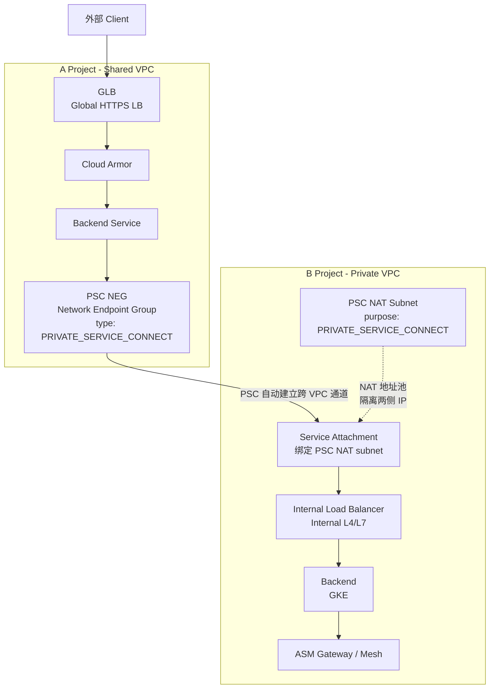
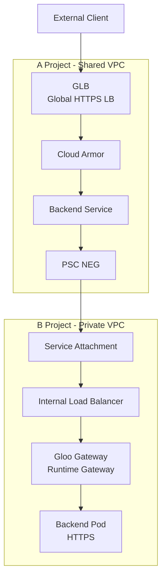
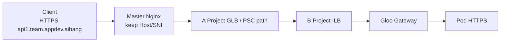

# Cross-Project Gloo 方案

> 目标：在当前 `A Project GLB -> PSC NEG -> B Project Service Attachment -> ILB -> GKE/ASM Gateway` 架构基础上，评估如何用 Gloo 替换现有 ASM 路径，同时保持 [nginx+simple+merge.md](/Users/lex/git/knowledge/nginx/docs/proxy-pass/nginx+simple+merge.md) 中已经确定的硬需求不变，尤其是统一业务域名、Host/SNI 不改写、全链路 TLS、Pod 终止业务 TLS、east-west 加密和 team wildcard 证书体系。

> 重要前提：如果同事说“用 Gloo 替换 ASM”，必须先明确他们说的是 `Gloo Gateway`，还是 `Gloo Mesh / Solo Enterprise for Istio`。这两者不是一回事。

---

## 1. Goal And Constraints

### 1.1 当前已知架构

当前跨项目数据面大致是：

### 1.2 不变的硬需求

根据 [nginx+simple+merge.md](/Users/lex/git/knowledge/nginx/docs/proxy-pass/nginx+simple+merge.md)，以下目标必须保持不变：

- 外部访问域名始终为 `{apiname}.{team}.appdev.aibang`
- Nginx 不做 Host 改写，不做内部域名转换，并尽量保留原始 Host/SNI
- `Client -> Nginx -> runtime Gateway -> Pod` 全链路保持 TLS
- Pod-to-Pod 通信也必须加密
- Pod 自己终止业务 TLS
- 证书尽量复用同一套 `*.{team}.appdev.aibang`
- runtime Gateway 必须作为标准模板存在
- 如果内部也复用同一套 wildcard 证书，east-west 不能回到 `cluster.local` 语义

### 1.3 这次评估真正要回答的问题

这次不是单纯做产品对比，而是要回答：

1. `ASM` 当前提供了什么能力
2. `Gloo` 在你的场景下能替代哪一部分
3. 用 `Gloo` 之后，`nginx+simple+merge.md` 那套 north-south / east-west / TLS 模型要怎么调整
4. 是否需要“完整 service mesh 替换”，还是只替换“入口 gateway 层”

### 1.4 复杂度评级

`Advanced / Enterprise`

因为你不是在做单集群 ingress 替换，而是在做：

- Cross Project
- PSC
- Master Project 统一入口
- Team 级别域名与证书体系
- 端到端 TLS
- 可能涉及 mesh 到 gateway 的产品边界重构

---

## 2. Recommended Architecture (V1)

### 2.1 先说核心结论

如果你的同事说“用 Gloo 替换掉所有 ASM / Service Mesh”，我建议先把这个目标拆成两层：

#### 方案 A：只替换 Gateway 层

用 `Gloo Gateway` 替换当前 ASM Gateway / Istio Ingress Gateway，保留 Pod 业务 TLS 和应用级 east-west 加密策略。

#### 方案 B：替换完整 Mesh 管控层

用 `Gloo Mesh / Solo Enterprise for Istio` 替代 ASM 的 mesh 生命周期管理和多集群策略管理。

### 2.2 我的 V1 推荐

推荐 V1 先走：

`Master Nginx 保持不变 + PSC/ILB 保持不变 + 将 runtime Gateway 从 ASM Gateway 替换为 Gloo Gateway + 先不做完整 mesh 替换`

原因：

1. 你当前硬需求核心在 `Nginx -> runtime Gateway -> Pod` 这一层，而不是一定要保留 ASM 的全量 mesh 能力。
2. `Gloo Gateway` 更直接对位你现在 runtime gateway 的角色。
3. 如果直接“一步到位替换整个 service mesh”，项目风险会明显高于先替换入口层。
4. 你文档里的强需求本质上更像“标准化 north-south gateway + app-level end-to-end TLS”，而不是“必须强依赖完整 mesh 才能成立”。

### 2.3 为什么不是直接推荐“Gloo 替换全部 ASM”

因为这里有一个产品边界必须说清楚：

| 产品 | 定位 | 是否能单独替代 ASM Mesh |
| --- | --- | --- |
| `Gloo Gateway` | API Gateway / Ingress / Gateway API 控制面 | 不能 |
| `Gloo Mesh / Solo Enterprise for Istio` | 基于 Istio 的 service mesh 生命周期与多集群管理 | 更接近可以 |
| `Cloud Service Mesh / ASM` | Google 管理或支持的 service mesh | 你当前现状 |

也就是说：

- 如果你只是上 `Gloo Gateway`，你替掉的是 gateway，不是 mesh
- 如果你想替的是 ASM 整体，那你更接近在评估 `Gloo Mesh / Solo Enterprise for Istio`

### 2.4 推荐的阶段化目标

#### Phase 1

保持：

- A Project GLB / Cloud Armor / PSC NEG
- B Project Service Attachment / ILB
- Master Project Nginx
- Pod 自己终止 TLS

替换：

- runtime gateway 从 ASM Gateway 换成 Gloo Gateway

#### Phase 2

如果后续仍然需要：

- 多集群服务发现
- 统一 east-west mTLS
- locality-aware routing
- mesh 级策略和 observability

再评估：

- 是否引入 `Gloo Mesh / Solo Enterprise for Istio`

---

## 3. Trade-Offs And Alternatives

### 3.1 ASM / Cloud Service Mesh 和 Gloo 最大区别

基于 Google 和 Solo 官方资料：

- Google 的 `Cloud Service Mesh` 是完整 service mesh 方案，Google 负责 managed control/data plane 的一部分能力，尤其在 GKE 上强调托管和升级治理。[Sources: Google Cloud Service Mesh overview](https://cloud.google.com/service-mesh/docs/overview), [supported features](https://cloud.google.com/service-mesh/docs/supported-features-managed)
- Solo 的 `Gloo Gateway` 是基于 Envoy 和 Kubernetes Gateway API 的 API gateway / ingress 控制面，偏 north-south 和 gateway policy。[Sources: Gloo Gateway overview](https://docs.solo.io/gateway/2.1.x/about/overview/)
- Solo 的 `Gloo Mesh / Solo Enterprise for Istio` 本质上还是围绕 Istio 做 mesh 生命周期管理、ambient/sidecar 运营、多集群分发和可观测性增强。[Sources: Gloo Mesh overview](https://docs.solo.io/gloo-mesh/main/setup/about/overview/)

### 3.2 从你的场景看，两者真正的差异

| 维度 | ASM / Cloud Service Mesh | Gloo Gateway | Gloo Mesh / Solo Enterprise for Istio |
| --- | --- | --- | --- |
| 产品类型 | Service mesh | API gateway | Service mesh management |
| 主要方向 | east-west + mesh policy + ingress | north-south gateway | multicluster mesh + Istio lifecycle |
| 是否天然对位 runtime gateway | 一部分对位 | 是 | 不是直接对位 gateway，而是对位 mesh |
| 是否能单独解决 Pod-to-Pod mTLS | 是 | 否 | 是，更接近 |
| 是否适合先做低风险替换 | 中 | 高 | 低 |
| 与你当前 Nginx 文档的耦合度 | 中 | 高 | 中 |

### 3.3 对你现在最重要的判断

如果你当前真正的核心诉求是：

- 统一业务域名
- 保留 Master Nginx
- runtime 层需要标准 gateway 模板
- 保持全链路 TLS 到 Pod
- 尽量减少 Host/SNI 改写

那么优先对位的其实是：

`Gloo Gateway`

而不是一上来就去替整个 mesh。

### 3.4 如果未来还要完整替 mesh

那就要接受一个事实：

`Gloo Mesh` 并不是“彻底摆脱 Istio 思维”，而更像“用 Solo 的商业控制面与运维能力来管理 Istio / ambient / multicluster mesh”。 

这点很重要，因为它决定了迁移预期：

- 如果团队想完全放弃 mesh，Gloo Gateway 更适合
- 如果团队只是想放弃 Google ASM 的运维模型，而保留 mesh 能力，Gloo Mesh 更适合

### 3.5 我对当前决策的建议

不要把问题表述成：

`Gloo 能不能替掉所有 ASM`

更好的表述是：

`我们是要替掉 ASM Gateway，还是要替掉 ASM Mesh 的整套生命周期和多集群能力？`

---

## 4. Implementation Steps

### 4.1 推荐的 V1 目标架构

如果还保留 Master Project Nginx 统一入口，可再细化为：

### 4.2 你原文档里哪些内容保持不变

以下内容在换成 Gloo Gateway 后仍然成立：

- `server_name *.{team}.appdev.aibang`
- `proxy_set_header Host $host`
- `proxy_ssl_server_name on`
- `proxy_ssl_name $host`
- Pod 监听 HTTPS
- Pod 挂 team wildcard 证书
- `apiX.{team}.appdev.aibang` 作为 north-south / east-west 统一域名

也就是说：

`Nginx + team wildcard cert + preserve Host/SNI + Pod business TLS`

这套思路不需要因为 Gloo 而改变。

### 4.3 你原文档里哪些对象要替换

如果你从 ASM Gateway 切到 Gloo Gateway，那么最直接变化的是 runtime 侧资源模型。

原来你用的是类似：

- `Gateway`
- `VirtualService`
- `DestinationRule`
- `ServiceEntry`

切到 Gloo Gateway 后，V1 更接近：

- `GatewayClass`
- `Gateway`
- `HTTPRoute` / `TLSRoute`
- Gloo 扩展策略 CRD

也就是说，最大的变化不在 Nginx，而在：

`runtime Gateway 的配置语言从 Istio API 转向 Kubernetes Gateway API + Gloo 扩展`

### 4.4 Gloo Gateway V1 配置策略

在你的场景里，我建议 V1 先对应到：

#### North-south

- Master Nginx 仍然终止/重建 TLS
- Gloo Gateway 接收来自 ILB/Nginx 的 TLS 流量
- Gloo Gateway 做 HTTP 路由
- Gloo Gateway 到 Pod 继续发起 TLS

#### East-west

不要在 Phase 1 里指望 Gloo Gateway 单独解决完整 east-west mesh 问题。

更现实的选择是：

1. 先继续依赖业务域名 + Pod HTTPS
2. 内部解析先用你文档里的 `apiX.{team}.appdev.aibang` 路线
3. 如果后面确实需要 locality、service discovery、mesh mTLS，再引入 Gloo Mesh

### 4.5 V1 映射关系

| 现有 ASM / Istio 思路 | Gloo 迁移后的思路 |
| --- | --- |
| `VirtualService.http` | `HTTPRoute` |
| `Gateway` | `Gateway` + `GatewayClass` |
| `DestinationRule.tls.sni` | Gloo / Envoy upstream TLS policy |
| `PASSTHROUGH + tls + sniHosts` | `TLSRoute` |
| ingressgateway deployment | Gloo managed gateway proxy |

### 4.6 一个很重要的现实判断

你在 [nginx+simple+merge.md](/Users/lex/git/knowledge/nginx/docs/proxy-pass/nginx+simple+merge.md) 里保留了一个非常关键的判断：

`如果还要 path/header/rewrite/retry/JWT，就不要走纯 passthrough。`

这点在 Gloo 下仍然成立，而且更适合 Gloo Gateway：

- Gloo Gateway 本来就偏 HTTP gateway 能力
- 它更适合 `SIMPLE terminate + HTTPRoute + upstream TLS`
- 而不是把所有东西都做成纯 TLS passthrough

所以对你来说，Gloo 的推荐姿势不是：

`让 Gloo 变成一个更复杂的透明转发层`

而是：

`把 Gloo 用成标准 north-south runtime gateway`

### 4.7 迁移顺序建议

#### Step 1

先保留 PSC / ILB / Master Nginx，不动网络骨架。

#### Step 2

在 B Project 新部署 Gloo Gateway，先做一条灰度链路。

#### Step 3

把现有 ASM Gateway 上的 north-south 路由规则迁移为：

- `Gateway`
- `HTTPRoute`
- upstream TLS policy

#### Step 4

验证：

- Host/SNI 是否保持不变
- Gloo -> Pod 是否仍然是 TLS
- Pod 返回证书 SAN 是否覆盖业务域名

#### Step 5

在 north-south 稳定后，再决定 east-west 是：

- 保持 app-level TLS
- 还是继续上 Gloo Mesh / Solo Enterprise for Istio

---

## 5. Validation And Rollback

### 5.1 迁移验证清单

#### 外部入口

- `curl --resolve api1.{team}.appdev.aibang:443:<ENTRY_IP> https://api1.{team}.appdev.aibang -vk`
- 确认业务域名不变
- 确认 Nginx 收到的 Host 不变

#### Gloo Gateway

- 确认 `Gateway` / `HTTPRoute` 命中正确 listener 和 host
- 确认 Gloo proxy 日志中看到的是原始业务域名

#### Gloo -> Pod

- 确认 upstream 仍然走 TLS
- 确认 upstream SNI 仍然是 `api1.{team}.appdev.aibang`
- 确认 Pod 证书 SAN 匹配

#### East-west

- 从 pod 内访问 `https://api1.{team}.appdev.aibang`
- 确认内部解析和证书匹配路径未被破坏

### 5.2 回滚策略

建议以“保网络、换 gateway”为原则：

1. 先回滚 Gloo Gateway listener/route
2. 再回切到 ASM Gateway
3. 不要在同一次变更里同时改 PSC、ILB、Nginx、Pod TLS

原因：

- PSC / ILB 是骨架层
- Nginx 是平台共享入口层
- Gloo / ASM 切换应尽量局部化在 runtime gateway 层

---

## 6. Reliability And Cost Optimizations

### 6.1 用 Gloo 的主要收益

如果只看你当前场景，Gloo Gateway 的主要收益大概是：

- Gateway API 模型更现代
- north-south API gateway 能力更聚焦
- 策略扩展和多环境治理更清晰
- 在“保留 Master Nginx + runtime Gateway”这个模式下更自然

### 6.2 不能误判的地方

不要把这些收益误解成：

- 自动替代完整 mesh
- 自动替代 east-west mTLS
- 自动替代多集群 service discovery

这些只有在你进一步引入 `Gloo Mesh / Solo Enterprise for Istio` 时才更有可比性。

### 6.3 我对长期目标的判断

如果你们长期目标是：

`用 Gloo 替换 ASM`

我建议最终拆成两张 roadmap：

#### Roadmap 1: Gateway 替换

ASM Gateway -> Gloo Gateway

#### Roadmap 2: Mesh 替换

ASM / Cloud Service Mesh -> Gloo Mesh / Solo Enterprise for Istio

这两个 roadmap 不应该混成一次性交付。

### 6.4 最稳的长期演进方式

对你现在的团队和架构来说，最稳的顺序是：

1. 先把 gateway 层替出来
2. 保持 `nginx+simple+merge.md` 那套硬需求不变
3. 用真实流量验证 `Host/SNI/TLS/POD cert` 模型
4. 再决定是否保留 mesh，或者引入 Gloo Mesh

---

## 7. Handoff Checklist

### 7.1 给架构团队先确认的问题

- 你们说的 “Gloo” 到底是 `Gloo Gateway` 还是 `Gloo Mesh`
- 你们是要替换 runtime gateway，还是替换整套 service mesh 生命周期管理
- east-west 需求是不是当前阶段刚需
- `nginx+simple+merge.md` 里的 app-level TLS 是否仍然是硬要求

### 7.2 我给你的最终建议

如果按你当前需求收敛，我的建议是：

`先用 Gloo Gateway 替换 ASM Gateway，不要第一阶段就去替整个 ASM Mesh。`

因为这最符合你现在的实际重点：

- Cross Project PSC 架构不动
- Master Nginx 不动
- team FQDN / team wildcard cert / preserve Host/SNI 不动
- runtime gateway 标准化能力升级

### 7.3 一句话总结

如果只保留一句话，我建议这样写：

`在当前 Cross Project 架构下，Gloo 最适合先替换 runtime gateway，而不是直接替掉整套 ASM Mesh；先保持 Nginx + PSC + Pod TLS 模型不变，再逐步评估 mesh 层是否还需要由 Gloo Mesh 接管。`

---

## References

- [Cloud Service Mesh overview](https://cloud.google.com/service-mesh/docs/overview)
- [Supported features using Istio APIs (managed control plane)](https://cloud.google.com/service-mesh/docs/supported-features-managed)
- [Gloo Mesh overview](https://docs.solo.io/gloo-mesh/main/setup/about/overview/)
- [Gloo Gateway overview](https://docs.solo.io/gateway/2.1.x/about/overview/)
- [Gloo Mesh service mesh deployment patterns](https://docs.solo.io/gloo-mesh-gateway/latest/concepts/about/deployment-patterns/service-mesh/)
