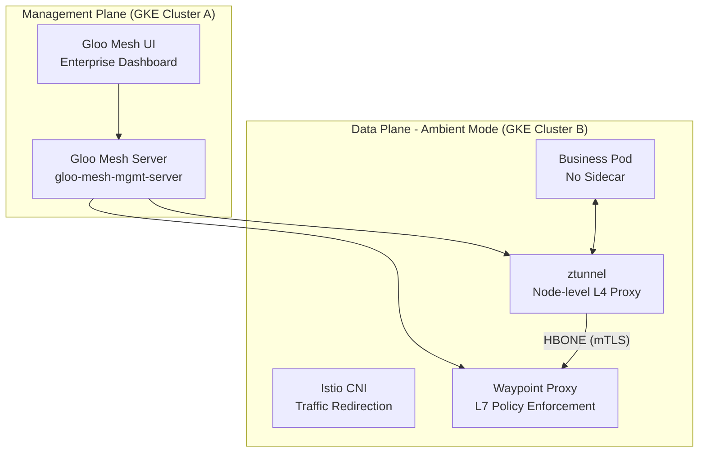

# Gloo Mesh Enterprise 核心概念与选型指南 (2026版)

> **文档定位**：面向在 GCP GKE 集群上部署 **Gloo Mesh Enterprise**（Solo.io 企业版）的团队，涵盖核心概念、环境化（Ambient）架构选型、GKE 安装部署及运维。
>
> **版本说明**：本文档基于 **Gloo Mesh Enterprise** 最新演进，重点包含 **Ambient Mesh (Sidecarless)** 特性。
>
> **前置条件**：已有 GKE 集群 (建议 1.29+)，已获取 Solo.io Enterprise License Key。

---

## 1. Gloo Mesh Enterprise 架构概览

### 1.1 架构模式对比：Sidecar vs. Ambient

随着 Istio 技术的演进，Gloo Mesh 目前支持两种主流架构。对于企业级选型，**Ambient Mesh** 是降低成本和简化运维的核心方向。

| 特性 | Sidecar 模式 (传统) | Ambient 模式 (环境化) | 企业收益 |
| :--- | :--- | :--- | :--- |
| **部署位置** | 注入到每个业务 Pod 内部 | 运行在 Node 级的基础设施层 | **解耦**：业务 Pod 保持 1/1 状态 |
| **组件构成** | 每个 Pod 一个 Envoy Sidecar | **Ztunnel** (Node 级) + **Waypoint** (L7) | **性能**：资源消耗降低 70%-90% |
| **拦截机制** | iptables (Pod 级拦截) | **eBPF / Pod 重定向** | **无感**：升级网格不重启业务 Pod |
| **L7 处理** | 全量处理（无论是否需要） | **按需部署** (Waypoint Proxy) | **精简**：仅在需要 L7 时消耗资源 |

### 1.2 核心组件 (Ambient 增强版)



---

## 2. 版本选型与评比 (2026 专家建议)

针对 GKE 环境，下表对比了 Gloo Mesh Enterprise 各个主流版本的特性，帮助您做出确切结论：

| 版本系列 | 状态 | Ambient 支持度 | 核心特性 | GKE 建议 |
| :--- | :--- | :--- | :--- | :--- |
| **2.11 / 2.12** | **最新稳定** | **GA (增强型)** | 支持 Istio 1.28+，原生适配 GKE Dataplane V2，支持 Autopilot。 | **首选**。适配 GKE 最新内核，Ambient 性能最稳。 |
| **2.8 / 2.10** | 稳定 | GA | **Flat Network** 支持，跨集群 Ambient 通信无需 Gateway。 | 适用于底层网络打通的大规模多集群环境。 |
| **2.6** | 兼容 | 初代 GA | 实现 Ztunnel 与 Waypoint 的基础生命周期管理。 | 基础版本，如无特殊需求建议向上升级。 |
| **2.5 及以下** | 维护 | 预览/实验性 | 侧重于 Sidecar 模式的自动化注入与联邦。 | **不建议** 用于 Ambient 架构选型。 |

> [!IMPORTANT]
> **选型结论**：如果您确定转向 **No Sidecar (Ambient)** 架构，建议直接采用 **Gloo Mesh 2.11+**，以获得最佳的 GKE CNI 兼容性和性能优化。

---

## 3. 核心 CRD 资源

### 3.1 租户隔离：Workspace
在 Ambient 模式下，Workspace 依然是隔离边界，但它不再关注 Sidecar 注入，而是关注命名空间是否打上 Ambient 标签。

```yaml
apiVersion: admin.gloo.solo.io/v2
kind: Workspace
metadata:
  name: team-a-workspace
  namespace: gloo-mesh
spec:
  workloadClusters:
  - name: gke-cluster-1
    namespaces:
    - name: team-a-runtime  # 此命名空间下的服务将自动纳入 Ambient 网格
```

### 3.2 流量治理：RouteTable 与 Waypoint
*   **L4 转发**：由 Ztunnel 处理（基于 IP/身份的简单访问）。
*   **L7 路由**：当配置了复杂的 `RouteTable`（路径匹配、重试等）时，Gloo 会自动为其配置 **Waypoint Proxy**。

---

## 4. 在 GKE 上安装与实现逻辑

### 4.1 安装关键逻辑 (Ambient 模式)

在 GKE 上，最关键的是处理与 **Dataplane V2 (Cilium)** 的兼容性。必须通过 Helm 开启 `enableAmbient` 和 `istio-cni`。

```bash
# 安装管理面并启用环境化特性
helm install gloo-platform gloo-platform/gloo-platform \
  --namespace gloo-mesh \
  --version 2.11.0 \
  --values - <<EOF
licensing:
  glooMeshLicenseKey: ${LICENSE_KEY}
glooMgmtServer:
  enabled: true
istiod:
  enabled: true
  global:
    meshConfig:
      enableAmbient: true    # 核心：启用 Ambient
  ztunnel:
    enabled: true            # 部署 Node 级代理
  istio-cni:
    enabled: true            # GKE 环境必需，处理流量劫持
EOF
```

### 4.2 将服务纳入网格
不再使用 `istio-injection=enabled`，而是使用新的标签：

```bash
# 激活命名空间的 Ambient 模式
kubectl label namespace team-a-runtime istio.io/dataplane-mode=ambient
```

---

## 5. mTLS 加密与安全策略

### 5.1 Ambient 模式下的安全 (HBONE)
Ambient 使用 **HBONE (HTTP-based Overlay Network Environment)** 协议，在 Ztunnel 之间建立 mTLS 隧道。

*   **L4 安全**：使用 `AccessPolicy` 定义 Service-to-Service 的访问，由 Ztunnel 执行。
*   **L7 安全**：涉及 JWT 校验、Header 操作时，由 Waypoint Proxy 执行。

### 5.2 策略示例：强制 STRICT mTLS
```yaml
apiVersion: security.policy.gloo.solo.io/v2
kind: AccessPolicy
metadata:
  name: restrict-access
  namespace: team-a-runtime
spec:
  applyToWorkloads:
  - selector: { app: backend-api }
  config:
    authn:
      tlsMode: STRICT # 强制所有进入流量必须带 mTLS 证书
```

---

## 6. 资源调度与性能优化

### 6.1 Ambient 的优势
*   **资源归集**：不再需要为每个小微服务 Pod 预留 50MB 的 Sidecar 内存。
*   **独立扩展**：Waypoint Proxy 可以根据流量负载独立进行 HPA 扩缩容，而不影响业务 Pod。

### 6.2 GKE 节点优化
*   建议为 Ztunnel 设置 **PriorityClass**，确保其在节点资源紧张时不会被驱逐。
*   GKE 节点池建议使用 `e2-standard-4` 或更高规格，以应对 Ztunnel 的网络吞吐。

---

## 7. 深度分析与 Debug (Ambient 专项)

### 7.1 常用诊断命令

```bash
# 1. 检查节点 Ztunnel 的工作负载发现情况 (确认 Pod 是否已被 Ztunnel 捕获)
istioctl ztunnel-config workload

# 2. 验证 HBONE 连接 (15008 端口)
kubectl logs -n istio-system ds/ztunnel | grep "hbone"

# 3. 查看 Waypoint Proxy 状态
kubectl get waypoints -n team-a-runtime

# 4. 全局健康检查 (包含 Ambient 特性验证)
meshctl check
```

---

## 8. 监控与可观测性
Ambient 模式下的指标分为两类：
1.  **L4 指标**：由 Ztunnel 上报，涵盖 TCP 连接数、字节数。
2.  **L7 指标**：由 Waypoint 上报，涵盖 HTTP 状态码、请求延迟。

Gloo Mesh UI 会自动聚合这两类指标，并在拓扑图中展示。

---

## 9. 快速参考 Cheatsheet

| 任务 | 命令 |
| :--- | :--- |
| **开启 Ambient** | `kubectl label ns <ns> istio.io/dataplane-mode=ambient` |
| **检查 Ztunnel** | `kubectl get pods -n istio-system -l app=ztunnel` |
| **手动创建 Waypoint** | `istioctl x waypoint apply --name namespace-wp -n <ns>` |
| **查看管理面板** | `meshctl dashboard` |

---

## 10. 参考资料

- [Gloo Mesh Ambient Mode 官方文档](https://docs.solo.io/gloo-mesh-enterprise/latest/setup/ambient/)
- [Istio Ambient Mesh 深度解析](https://istio.io/latest/docs/ops/ambient/)
- [GKE Dataplane V2 与 Istio 兼容性指南](https://cloud.google.com/kubernetes-engine/docs/how-to/service-mesh-istio-cni)

---
*文档版本: 1.2 (Ambient & Enterprise)*
*更新日期: 2026-04-19*
*状态: 已同步 2.x 最新选型逻辑*
