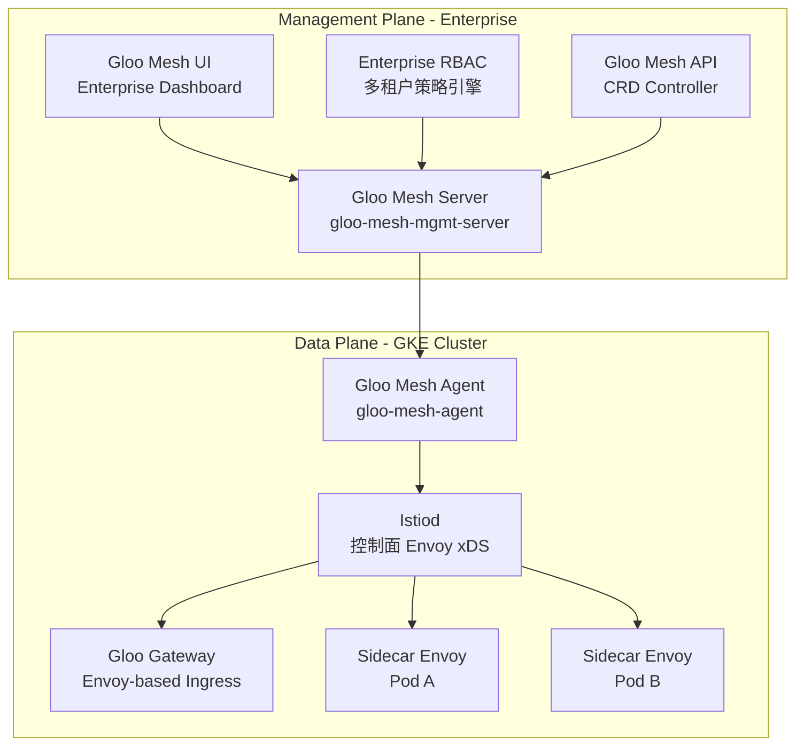
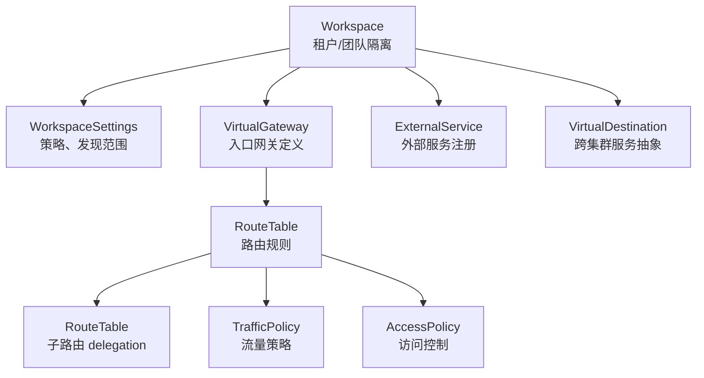

# Gloo Mesh Enterprise 核心概念与运维指南

> **文档定位**：面向在 GCP GKE 集群上部署 **Gloo Mesh Enterprise**（Solo.io 企业版）的团队，
> 涵盖核心概念、安装部署、mTLS 加密、出口流量管理、资源调度、深度分析与 Debug 方法。
>
> **版本说明**：本文档基于 **Gloo Mesh Enterprise**（商业授权版），包含 Gloo Mesh UI、
> RBAC、多集群联邦、高级可观测性等企业级功能。社区版（OSS）不包含这些能力。
>
> **前置条件**：已有 GKE 集群，已获取 Solo.io Enterprise License Key，计划用 Gloo Mesh Enterprise 替代 ASM 作为服务网格和 Gateway。

---

## 1. Gloo Mesh Enterprise 架构概览

### 1.1 核心组件



| 组件 | 部署位置 | 职责 |
|---|---|---|
| `gloo-mesh-mgmt-server` | 管理集群 | 接收高阶 CRD，翻译为 Istio 原生资源下发 |
| `gloo-mesh-agent` | 每个工作集群 | 上报集群状态，接收管理面指令 |
| `gloo-mesh-ui` | 管理集群 | **Enterprise 专属**：可视化 Dashboard，展示拓扑、策略、健康状态 |
| `istiod` | 每个工作集群 | 标准 Istio 控制面，管理 Envoy xDS 配置 |
| Gloo Gateway | 每个工作集群 | 基于 Envoy 的入口网关，替代 Istio Ingress Gateway |
| Sidecar Proxy | 每个业务 Pod | 标准 Envoy sidecar，拦截进出流量 |

> [!NOTE]
> **Enterprise vs OSS 关键差异**：Enterprise 版包含 Gloo Mesh UI、RootTrustPolicy（统一 CA）、
> 多集群联邦、高级 RBAC、WAF/DLP 集成、商业 SLA 支持。
> 本文档所有功能均基于 Enterprise 版。

### 1.2 单集群 vs 多集群

| 模式 | 管理面位置 | 适用场景 |
|---|---|---|
| 单集群 | 管理面和数据面同集群 | PoC、小规模部署 |
| 多集群 | 独立管理集群 | 生产环境、多 Region |

---

## 2. 核心 CRD 资源

### 2.1 资源层级关系



### 2.2 核心 CRD 速查

| CRD | API Group | 等价 Istio 资源 | 用途 |
|---|---|---|---|
| `Workspace` | `admin.gloo.solo.io/v2` | — | 定义团队/租户边界，隔离策略和服务发现 |
| `WorkspaceSettings` | `admin.gloo.solo.io/v2` | — | 配置 Workspace 内的服务发现、策略继承 |
| `VirtualGateway` | `networking.gloo.solo.io/v2` | `Gateway` | 定义入口网关监听器、TLS 终止 |
| `RouteTable` | `networking.gloo.solo.io/v2` | `VirtualService` | HTTP/TCP 路由规则，支持分层 delegation |
| `TrafficPolicy` | `trafficcontrol.policy.gloo.solo.io/v2` | `DestinationRule` | 后端 TLS、重试、超时、负载均衡、熔断 |
| `AccessPolicy` | `security.policy.gloo.solo.io/v2` | `AuthorizationPolicy` | L7 访问控制 |
| `ExternalService` | `networking.gloo.solo.io/v2` | `ServiceEntry` | 注册外部/跨集群服务 |
| `VirtualDestination` | `networking.gloo.solo.io/v2` | — | 跨集群服务的统一入口 |
| `ExternalEndpoint` | `networking.gloo.solo.io/v2` | — | 指定外部服务的具体地址 |

### 2.3 Workspace — 租户隔离核心

```yaml
apiVersion: admin.gloo.solo.io/v2
kind: Workspace
metadata:
  name: team-a-workspace
  namespace: gloo-mesh               # Workspace 统一定义在管理 NS
spec:
  workloadClusters:
  - name: gke-cluster-1               # 集群名
    namespaces:
    - name: team-a-runtime             # 业务 NS
    - name: team-a-gateway             # Gateway NS
```

```yaml
apiVersion: admin.gloo.solo.io/v2
kind: WorkspaceSettings
metadata:
  name: team-a-settings
  namespace: team-a-runtime
spec:
  importFrom:
  - workspaces:
    - name: infra-workspace            # 允许导入 infra 的 Gateway
  exportTo:
  - workspaces:
    - name: infra-workspace            # 将服务暴露给 infra
  options:
    serviceIsolation:
      enabled: true                    # 仅允许 Workspace 内服务互相发现
    trimProxyConfig: true              # 精简 Envoy 配置，减小内存占用
```

### 2.4 RouteTable Delegation（路由委托）

这是 Gloo Mesh 最核心的差异化能力：

```yaml
# ① 平台团队：根 RouteTable（域名级）
apiVersion: networking.gloo.solo.io/v2
kind: RouteTable
metadata:
  name: root-abjx-rt
  namespace: abjx-int
spec:
  hosts:
  - "*.abjx.appdev.aibang"
  virtualGateways:
  - name: runtime-team-gateway
    namespace: abjx-int
  http:
  - name: delegate-to-teams
    delegate:
      routeTables:                     # 委托给子 RouteTable
      - labels:
          workspace: team-a
      sortMethod: ROUTE_SPECIFICITY    # 按路径精确度排序
```

```yaml
# ② 业务团队 A：子 RouteTable（路径级，团队自治）
apiVersion: networking.gloo.solo.io/v2
kind: RouteTable
metadata:
  name: api1-rt
  namespace: team-a-runtime
  labels:
    workspace: team-a
spec:
  http:
  - name: api1-route
    matchers:
    - uri:
        prefix: /api1
    forwardTo:
      destinations:
      - ref:
          name: api1-backend
          namespace: team-a-runtime
        port:
          number: 8443
```

**优势**：平台团队只管域名和 Gateway，业务团队自助管理自己的路由，互不冲突。

---

## 3. 在 GKE 上安装 Gloo Mesh

### 3.1 前置要求

| 要求 | 说明 |
|---|---|
| GKE 版本 | ≥ 1.25（推荐 1.28+） |
| Helm | ≥ 3.12 |
| `meshctl` CLI | Solo.io 提供，Enterprise 版专用 CLI |
| **Enterprise License Key** | **必须**：从 Solo.io 获取的商业授权 Key，安装时通过 `licensing.glooMeshLicenseKey` 注入 |
| 集群资源 | 管理面 ≈ 2 vCPU / 4GB RAM（含 UI + RBAC）；Agent ≈ 0.5 vCPU / 512MB |

### 3.2 安装步骤

```bash
# 1. 安装 meshctl（Enterprise 版）
curl -sL https://run.solo.io/meshctl/install | sh
export PATH=$HOME/.gloo-mesh/bin:$PATH

# 2. 验证（确认显示 Enterprise 版本号）
meshctl version

# 3. 添加 Helm repo（Enterprise chart 统一在 gloo-platform 仓库）
helm repo add gloo-platform https://storage.googleapis.com/gloo-platform/helm-charts
helm repo update
```

```bash
# 4. 安装 CRD（Enterprise 和 OSS 共用同一 CRD chart）
helm install gloo-platform-crds gloo-platform/gloo-platform-crds \
  --namespace gloo-mesh \
  --create-namespace \
  --version ${GLOO_VERSION}

# 5. 安装管理面（Enterprise 版，单集群模式）
#    ⚠️ LICENSE_KEY 为 Solo.io 提供的 Enterprise License
helm install gloo-platform gloo-platform/gloo-platform \
  --namespace gloo-mesh \
  --version ${GLOO_VERSION} \
  --values - <<EOF
licensing:
  glooMeshLicenseKey: ${LICENSE_KEY}    # Enterprise License Key（必填）
glooMgmtServer:
  enabled: true
glooAgent:
  enabled: true
  relay:
    serverAddress: gloo-mesh-mgmt-server.gloo-mesh.svc.cluster.local:9900
telemetryCollector:
  enabled: true
glooUi:
  enabled: true                          # Enterprise 专属 Dashboard
EOF
```

```bash
# 6. 部署 Gloo Gateway（Envoy ingress，Enterprise 支持 WAF/DLP/ExtAuth 插件）
kubectl create namespace gloo-gateway

helm install gloo-gateway gloo-platform/gloo-platform \
  --namespace gloo-gateway \
  --version ${GLOO_VERSION} \
  --values - <<EOF
glooGateway:
  enabled: true
  gatewayProxies:
    gatewayProxy:
      service:
        type: ClusterIP             # GKE 环境用 ClusterIP + ILB/NEG
glooPortalServer:                   # Enterprise 专属：开发者门户（可选）
  enabled: false
EOF
```

### 3.3 验证安装

```bash
# 检查管理面
meshctl check

# 检查所有 Pod
kubectl get pods -n gloo-mesh
kubectl get pods -n gloo-gateway

# 期望输出：
# gloo-mesh-mgmt-server-xxx    Running
# gloo-mesh-agent-xxx           Running
# gloo-mesh-ui-xxx              Running
# gloo-telemetry-collector-xxx  Running
# gloo-gateway-xxx              Running     (in gloo-gateway NS)
```

### 3.4 注册集群

```bash
# 单集群模式下，集群在安装时自动注册
# 多集群模式需手动注册：
meshctl cluster register \
  --cluster-name=gke-workload-cluster \
  --mgmt-context=gke-mgmt-context \
  --remote-context=gke-workload-context
```

---

## 4. mTLS 加密与安全策略

### 4.1 mTLS 机制

Gloo Mesh 底层仍使用 Istio 的 mTLS 机制（基于 SPIFFE 身份）：

```
Sidecar A → mTLS (自动, SPIFFE证书) → Sidecar B
```

**证书链**：`istiod Root CA → WorkloadCertificate → Envoy Sidecar`

### 4.2 全局 STRICT mTLS

```yaml
# 通过 Istio 原生 PeerAuthentication 或 Gloo 的 SecurityPolicy 控制
apiVersion: security.istio.io/v1beta1
kind: PeerAuthentication
metadata:
  name: default-strict
  namespace: istio-system              # mesh-wide
spec:
  mtls:
    mode: STRICT
```

> [!NOTE]
> Gloo Mesh 不替换 Istio 的 mTLS 机制，而是在上层管理它。
> `PeerAuthentication` 仍然有效，Gloo 的 `AccessPolicy` 是额外的 L7 层控制。

### 4.3 AccessPolicy — L7 访问控制

```yaml
apiVersion: security.policy.gloo.solo.io/v2
kind: AccessPolicy
metadata:
  name: allow-gateway-to-runtime
  namespace: team-a-runtime
spec:
  applyToWorkloads:
  - selector:
      labels:
        app: api1-backend
  config:
    authn:
      tlsMode: STRICT                 # 强制 mTLS
    authz:
      allowedClients:
      - serviceAccountSelector:
          name: gloo-gateway-sa        # 仅允许 Gateway SA 访问
          namespace: gloo-gateway
```

### 4.4 自定义 CA / 外部 CA 集成

```yaml
# 使用 cert-manager + Vault 签发网格证书
apiVersion: admin.gloo.solo.io/v2
kind: RootTrustPolicy
metadata:
  name: custom-ca
  namespace: gloo-mesh
spec:
  config:
    intermediateCertOptions:
      secretType: Opaque
    mgmtServerCa:
      generated:
        ttlDays: 365
    autoRestartPods: true              # CA 轮换时自动重启 Pod
```

---

## 5. 出口流量管理（Egress）

### 5.1 默认行为

Istio 默认 `outboundTrafficPolicy: ALLOW_ANY`，所有出站流量放行。
生产环境推荐改为 `REGISTRY_ONLY`，仅允许注册的外部服务。

```yaml
# meshctl CLI 或直接修改 IstioOperator / MeshConfig
# outboundTrafficPolicy.mode: REGISTRY_ONLY
```

### 5.2 ExternalService — 注册外部服务

```yaml
apiVersion: networking.gloo.solo.io/v2
kind: ExternalService
metadata:
  name: external-payment-api
  namespace: team-a-runtime
spec:
  hosts:
  - payment.external-provider.com
  ports:
  - name: https
    number: 443
    protocol: TLS
```

### 5.3 ExternalEndpoint — 指定具体地址

```yaml
apiVersion: networking.gloo.solo.io/v2
kind: ExternalEndpoint
metadata:
  name: payment-api-endpoint
  namespace: team-a-runtime
  labels:
    external-service: payment-api
spec:
  address: 203.0.113.50
  ports:
  - name: https
    number: 443
```

### 5.4 出口 TLS Origination

```yaml
apiVersion: trafficcontrol.policy.gloo.solo.io/v2
kind: TrafficPolicy
metadata:
  name: egress-tls-to-payment
  namespace: team-a-runtime
spec:
  applyToDestinations:
  - kind: EXTERNAL_SERVICE
    selector:
      name: external-payment-api
      namespace: team-a-runtime
  policy:
    tls:
      mode: SIMPLE
      sni: payment.external-provider.com
```

### 5.5 Egress Gateway（可选）


如需集中管控出站流量（审计、限流、合规），可部署独立的 Egress Gateway：

```yaml
# RouteTable 将外部流量路由到 Egress Gateway
apiVersion: networking.gloo.solo.io/v2
kind: RouteTable
metadata:
  name: egress-route
  namespace: gloo-mesh-gateways
spec:
  hosts:
  - payment.external-provider.com
  http:
  - forwardTo:
      destinations:
      - kind: EXTERNAL_SERVICE
        ref:
          name: external-payment-api
          namespace: team-a-runtime
```

---

## 6. 资源调度与性能优化

### 6.1 Sidecar 资源请求/限制

```yaml
# 通过 Pod annotation 控制 sidecar 资源
apiVersion: apps/v1
kind: Deployment
metadata:
  name: api1-backend
spec:
  template:
    metadata:
      annotations:
        sidecar.istio.io/proxyCPU: "100m"
        sidecar.istio.io/proxyCPULimit: "500m"
        sidecar.istio.io/proxyMemory: "128Mi"
        sidecar.istio.io/proxyMemoryLimit: "512Mi"
    spec:
      containers:
      - name: api1
        resources:
          requests:
            cpu: 250m
            memory: 256Mi
          limits:
            cpu: 1000m
            memory: 1Gi
```

### 6.2 ProxyConfig — 精简 Envoy 配置

减少 sidecar 内存占用，只配置 Pod 实际需要的上游服务：

```yaml
# Gloo Mesh 方式：WorkspaceSettings 中启用 trimProxyConfig
# 或使用 Istio 原生 Sidecar resource：
apiVersion: networking.istio.io/v1beta1
kind: Sidecar
metadata:
  name: team-a-sidecar
  namespace: team-a-runtime
spec:
  egress:
  - hosts:
    - "./*"                            # 本 NS 所有服务
    - "istio-system/*"                 # 控制面
    - "team-a-gateway/*"               # Gateway
    - "~/*.external-provider.com"      # 指定外部服务
```

### 6.3 HPA 与 PDB

```yaml
# Gateway Pod HPA
apiVersion: autoscaling/v2
kind: HorizontalPodAutoscaler
metadata:
  name: gloo-gateway-hpa
  namespace: gloo-gateway
spec:
  scaleTargetRef:
    apiVersion: apps/v1
    kind: Deployment
    name: gloo-gateway
  minReplicas: 2
  maxReplicas: 10
  metrics:
  - type: Resource
    resource:
      name: cpu
      target:
        type: Utilization
        averageUtilization: 70

---
# Gateway PDB
apiVersion: policy/v1
kind: PodDisruptionBudget
metadata:
  name: gloo-gateway-pdb
  namespace: gloo-gateway
spec:
  minAvailable: 1
  selector:
    matchLabels:
      app: gloo-gateway
```

---

## 7. 深度分析与 Debug

### 7.1 常用诊断命令

```bash
# ─── Gloo Mesh 管理面诊断 ───────────────────────

# 全局健康检查
meshctl check

# 查看已注册集群
meshctl cluster list

# 查看 Workspace 状态
kubectl get workspaces -n gloo-mesh

# 查看翻译后的 Istio 资源（Gloo Mesh 自动生成的）
kubectl get virtualservices,destinationrules,gateways -A

# 检查管理面日志
kubectl logs -n gloo-mesh deployment/gloo-mesh-mgmt-server -f
```

```bash
# ─── Istio / Envoy 数据面诊断 ───────────────────

# 查看 proxy 状态（与 istioctl 兼容）
istioctl proxy-status

# 查看特定 Pod 的 Envoy 配置
istioctl proxy-config all <pod-name> -n <namespace> -o json

# 检查 listener
istioctl proxy-config listener <pod-name> -n <namespace>

# 检查 route
istioctl proxy-config route <pod-name> -n <namespace>

# 检查 cluster（upstream）
istioctl proxy-config cluster <pod-name> -n <namespace>

# 检查 endpoint
istioctl proxy-config endpoint <pod-name> -n <namespace>

# 检查 secret（证书）
istioctl proxy-config secret <pod-name> -n <namespace>
```

### 7.2 常见问题排查

#### 问题 1：503 Service Unavailable

```bash
# 排查步骤：
# 1. 检查 endpoint 是否存在
istioctl proxy-config endpoint <gateway-pod> -n gloo-gateway \
  --cluster "outbound|8443||api1-backend.team-a-runtime.svc.cluster.local"

# 2. 检查 upstream 健康状态
kubectl exec -n gloo-gateway <gateway-pod> -c istio-proxy -- \
  curl -s localhost:15000/clusters | grep api1-backend

# 3. 检查 RouteTable 是否生效
kubectl get routetable -n team-a-runtime -o yaml

# 4. 检查翻译后的 VirtualService
kubectl get vs -A | grep api1
```

#### 问题 2：mTLS 握手失败

```bash
# 1. 检查 PeerAuthentication 模式
kubectl get peerauthentication -A

# 2. 检查双方证书身份
istioctl proxy-config secret <source-pod> -n <ns>
istioctl proxy-config secret <dest-pod> -n <ns>

# 3. 检查 AccessPolicy 是否放行
kubectl get accesspolicy -n <ns> -o yaml

# 4. 查看 Envoy 访问日志
kubectl logs <pod> -c istio-proxy | grep "403\|RBAC"
```

#### 问题 3：Gloo Mesh 翻译失败（CRD 未生效）

```bash
# 1. 检查管理面日志
kubectl logs -n gloo-mesh deployment/gloo-mesh-mgmt-server | grep -i error

# 2. 检查资源状态
kubectl get routetable <name> -n <ns> -o jsonpath='{.status}'

# 3. 检查 Workspace 配置是否覆盖了目标 NS
kubectl get workspace -n gloo-mesh -o yaml | grep -A5 namespaces

# 4. 检查 Agent 连接
meshctl check
```

### 7.3 Envoy 访问日志分析

```bash
# 开启详细访问日志
kubectl exec -n gloo-gateway <pod> -c istio-proxy -- \
  curl -XPOST localhost:15000/logging?level=debug

# 访问日志字段参考：
# [%RESPONSE_CODE%] [%RESPONSE_FLAGS%] [%UPSTREAM_HOST%]
#
# 关键 RESPONSE_FLAGS：
#   UF  = upstream connection failure
#   UO  = upstream overflow (circuit breaker)
#   NR  = no route configured
#   RL  = rate limited
#   DC  = downstream connection termination
#   URX = upstream retry limit exceeded
```

### 7.4 流量抓包

```bash
# 在 sidecar 容器内抓包（需 debug 镜像）
kubectl debug -n <ns> <pod> --image=nicolaka/netshoot -it -- \
  tcpdump -i any -w /tmp/capture.pcap port 8443

# 或使用 ephemeral container
kubectl exec -n <ns> <pod> -c istio-proxy -- \
  curl -s localhost:15000/config_dump > /tmp/envoy-config.json
```

---

## 8. 监控与可观测性

### 8.1 指标体系

Gloo Mesh 提供三层指标：

| 层级 | 来源 | 关键指标 |
|---|---|---|
| 管理面 | `gloo-mesh-mgmt-server` | 翻译延迟、CRD 处理量、Agent 连接数 |
| 控制面 | `istiod` | xDS push 延迟、配置同步状态 |
| 数据面 | Envoy sidecar | 请求延迟、错误率、连接数、上游健康 |

### 8.2 关键 Prometheus 指标

```promql
# Gateway 请求成功率
sum(rate(istio_requests_total{reporter="destination",response_code!~"5.*"}[5m]))
/
sum(rate(istio_requests_total{reporter="destination"}[5m]))

# P99 延迟
histogram_quantile(0.99,
  sum(rate(istio_request_duration_milliseconds_bucket{reporter="destination"}[5m])) by (le)
)

# mTLS 覆盖率
sum(rate(istio_requests_total{connection_security_policy="mutual_tls"}[5m]))
/
sum(rate(istio_requests_total[5m]))
```

---

## 9. 快速参考 Cheatsheet

### meshctl 常用命令（Enterprise）

| 命令 | 用途 |
|---|---|
| `meshctl check` | 全局健康检查（含 License 有效性验证） |
| `meshctl cluster list` | 列出注册集群 |
| `meshctl dashboard` | 打开 Gloo Mesh Enterprise UI |
| `meshctl debug report` | 生成诊断报告（打包日志和配置，适合发给 Solo.io Support） |
| `meshctl version` | 查看版本（确认 Enterprise 标识） |

### 资源查看

```bash
# 查看所有 Gloo CRD
kubectl api-resources | grep solo.io

# 查看特定类型资源
kubectl get virtualgateway,routetable,trafficpolicy,accesspolicy -A
kubectl get workspace,workspacesettings -n gloo-mesh

# 查看翻译后的 Istio 原生资源（带 solo.io label）
kubectl get vs,dr,gw -A -l "reconciler.mesh.gloo.solo.io/name"
```

### Debug 流量路径

```bash
# 完整链路排查顺序：
# 1. Gateway listener → 2. RouteTable match → 3. TrafficPolicy → 4. Endpoint

istioctl proxy-config listener <gw-pod> -n gloo-gateway     # Step 1
istioctl proxy-config route <gw-pod> -n gloo-gateway         # Step 2
istioctl proxy-config cluster <gw-pod> -n gloo-gateway       # Step 3
istioctl proxy-config endpoint <gw-pod> -n gloo-gateway      # Step 4
```

---

## 10. 参考资料

- [Gloo Mesh Enterprise 官方文档](https://docs.solo.io/gloo-mesh-enterprise/)
- [Gloo Gateway Enterprise 文档](https://docs.solo.io/gloo-mesh-gateway/)
- [Gloo Mesh Enterprise API Reference](https://docs.solo.io/gloo-mesh-enterprise/latest/reference/api/)
- [Solo.io Enterprise Support Portal](https://support.solo.io/)（商业客户专属）
- [Solo.io Blog](https://www.solo.io/blog/)
- 本仓库：[cross-project-gloo-mesh.md](./cross-project-gloo-mesh.md) — Cross-Project 架构下 Gloo Mesh 替换 ASM 方案

---

*文档版本: 1.1*
*创建日期: 2026-04-17*
*版本说明: Gloo Mesh Enterprise（商业授权版）*
*状态: 初始版本，待 PoC 验证补充*
