https://claude.ai/public/artifacts/03952fd0-9f57-41ed-848f-b73c59f0bc9f

外部客户端HTTPS 请求 *.team-a.appdev.aibang

1 HTTPS / TLS(外部证书)namespace: istio-ingressgateway-intIstio Gateway PodTLS SIMPLE 终止 · 持有域名证书Envoy SidecarSPIFFE 身份 · 持有 istiod 颁发证书明文istiod CA(SDS)→ 自动签发 SPIFFE 证书,每 24h 轮转,存于 Sidecar 内存,不落盘,不可见

2 mTLS(自动加密)SPIFFE 双向证书验证NetworkPolicyL3/L4 仅放行 :8443namespace: team-a-runtimePeerAuthenticationSTRICT — 强制 mTLS,无证书即拒绝AuthorizationPolicydefault-deny-all + allow gateway SABusiness PodEnvoy Sidecar接收 mTLS 流量验证 SPIFFE 证书

3 明文localhost业务容器 AppHTTP :8443(明文)完全感知不到 mTLSiptables 规则由 istio-init 注入,自动拦截所有出入站流量至 Sidecar(App 无感知)安全层说明1 外部 TLS(SIMPLE)客户端 → Gateway 终止。使用业务域名证书(team-a 独立证书)。Gateway 之后无外部 TLS。

2 网格内 mTLS(自动)Sidecar ↔ Sidecar 自动加密。istiod 颁发 SPIFFE 证书,无需手动配置。PeerAuthentication STRICT 强制。

3 Pod 内明文(localhost)Sidecar → App 容器,走 localhost,不经过网络,安全边界由 Sidecar 保障。双层防护NetworkPolicy(L3/L4)+ AuthorizationPolicy(L7 SPIFFE)同时生效,互为补充。


我需要你现在读这个flow,这个其实是我的一个在GKE里面用Istio service mesh的一个flow流,也就是我关心的它一些流向和加密的一个方式。那么如果我是在GKE里边安装了不是Gloo,而且是Gloo的企业版本的话,那么它这个对应的follow应该是什么样的呢?我比较关心。你可以先帮我生成对应的Markdown的follow流,然后也可以生成SVG。


无法直接访问这个 artifact 链接。能否把那个 flow 的内容贴到对话里？或者描述一下它的主要流程节点？

同时，为了让我生成的 Gloo Enterprise 对应 flow 更准确，帮我确认几点：我先基于你描述的场景（GKE + Istio service mesh，关注流向和加密方式）以及 Gloo Enterprise 的架构特性，给你生成对应的完整 flow。我会覆盖 **标准 Istio flow** 和 **Gloo Enterprise 替换后的 flow** 的对比，方便你直接理解差异。现在我基于 Istio service mesh 的标准架构和 Gloo Enterprise 的特性，为你生成完整的对比 Flow。先输出 Markdown，再渲染 SVG。

---

## Istio vs Gloo Enterprise：GKE 流量 & 加密 Flow 对比

### 架构对比概览

| 层级         | Istio（原生）                        | Gloo Enterprise（替换后）                |
| ------------ | ------------------------------------ | ---------------------------------------- |
| 入口控制器   | Istio Ingress Gateway（Envoy）       | Gloo Gateway（基于 Envoy，扩展企业能力） |
| mTLS         | PeerAuthentication + DestinationRule | GlooMesh mTLS（跨集群，证书统一管理）    |
| 流量策略     | VirtualService / DestinationRule     | RouteTable / VirtualGateway              |
| 观测性       | Prometheus + Jaeger + Kiali          | Gloo Dashboard + 内置 OpenTelemetry      |
| OIDC/JWT/WAF | 需自行集成 AuthorizationPolicy       | 原生 ExtAuthPolicy（OIDC/LDAP/OPA/WAF）  |
| 证书管理     | istiod CA 或外部 cert-manager        | Gloo Mesh 内置 CA 或 Vault 集成          |
| 多集群       | 手动配置 east-west gateway           | GlooMesh 原生多集群服务发现              |

---

### Markdown Flow 文档

#### Flow 1：Istio 原生（标准三层架构）

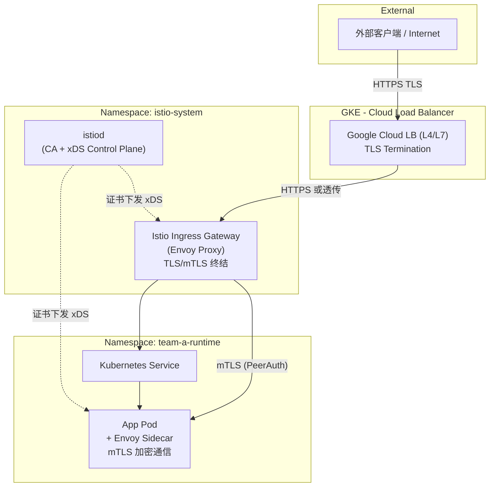
- 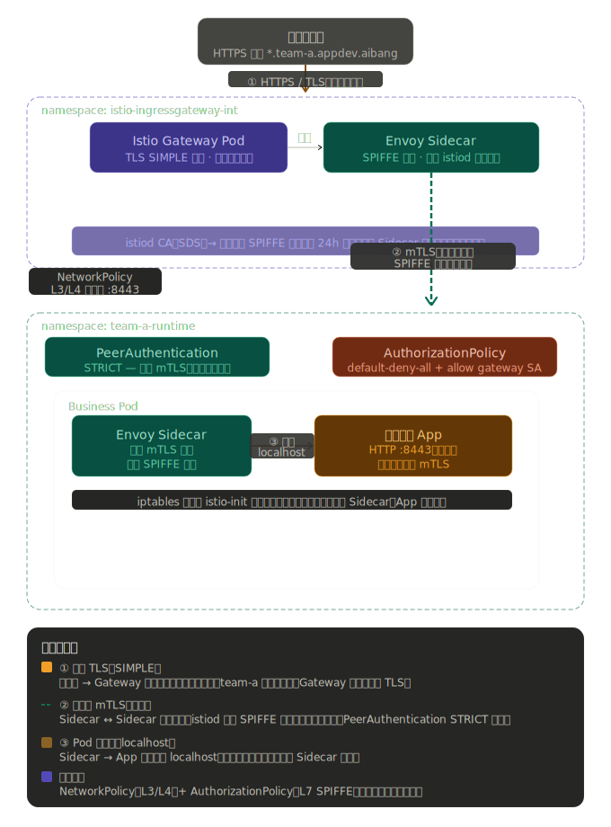

**加密链路说明：**

```
Client → GLB: TLS 1.3（公网证书）
GLB → Istio GW: HTTPS 或 TLS 透传（取决于 GLB 配置）
Istio GW → Pod Sidecar: mTLS（istiod 签发的 SPIFFE 证书）
Pod Sidecar → App Container: 127.0.0.1 明文（进程间）
```

---

#### Flow 2：Gloo Enterprise（替换 Istio 控制面 + 增强入口）

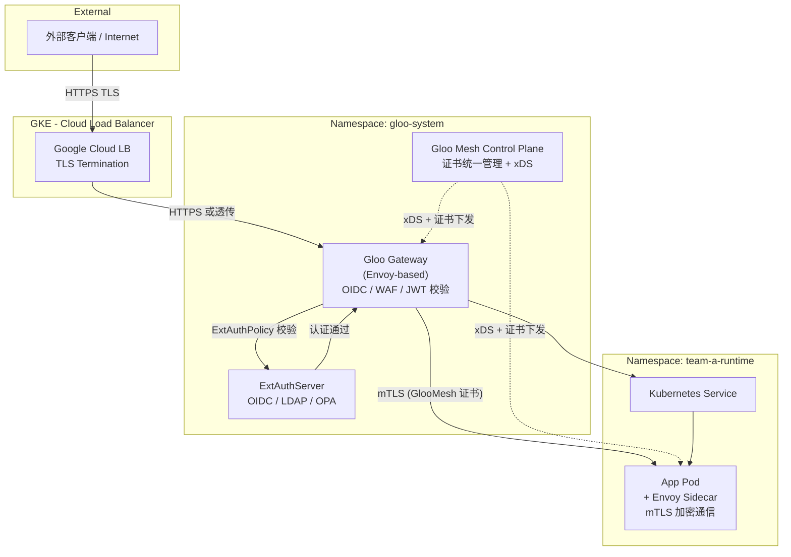

**加密链路说明：**

```
Client → GLB:       TLS 1.3（公网证书）
GLB → Gloo GW:      HTTPS 或 TLS 透传
Gloo GW:            OIDC/JWT 校验（ExtAuthPolicy）+ WAF 过滤
Gloo GW → Pod:      mTLS（Gloo Mesh 签发的 SPIFFE/SVID 证书）
Pod Sidecar → App:  127.0.0.1 明文
```

---

#### 关键差异：资源对象对比

| Istio 资源            | Gloo Enterprise 对应资源                              |
| --------------------- | ----------------------------------------------------- |
| `Gateway`             | `VirtualGateway`                                      |
| `VirtualService`      | `RouteTable`                                          |
| `DestinationRule`     | `TrafficPolicy`                                       |
| `PeerAuthentication`  | `PeerAuthentication`（兼容）或 `GlooMesh mTLS Policy` |
| `AuthorizationPolicy` | `AccessPolicy` + `ExtAuthPolicy`                      |
| `EnvoyFilter`         | `ListenerOption` / `RouteOption`                      |

---

现在渲染 SVG 可视化对比图：
- 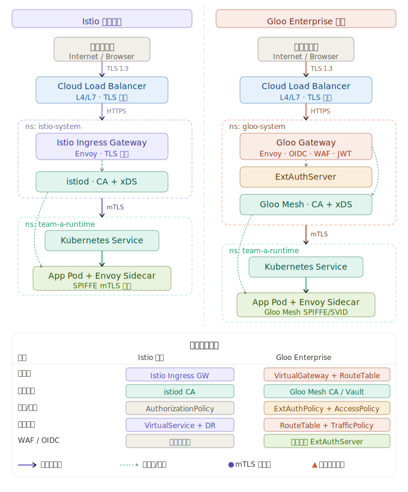

---

## Gloo Mesh Enterprise 完整加密 Flow（三层架构详解）

> 以下是将 Istio Service Mesh 完整替换为 **Gloo Mesh Enterprise** 后，
> 对应原始 `istio_mtls_full_flow.svg` 的等价加密流程。
> **用户请求路径不变**，仅替换网格控制面和入口网关组件。

### 整体流量路径总览

```
外部客户端
  │
  │ HTTPS 请求 *.team-a.appdev.aibang
  │
  ▼
┌─────────────────────────────────────────────────────────┐
│ ① HTTPS / TLS（外部证书）                                │
│                                                         │
│ namespace: gloo-gateway                                 │
│ ┌─────────────────────────────────────────────────────┐ │
│ │ Gloo Gateway Pod（Envoy-based，本身持有 SPIFFE 身份）│ │
│ │ VirtualGateway TLS SIMPLE 终止                      │ │
│ │ 持有域名证书 wildcard-team-a-cert                   │ │
│ │ 🆔 SPIFFE: spiffe://cluster.local/ns/gloo-gateway  │ │
│ │ 🔐 Gloo Mesh CA 签发证书（通过 istiod SDS 下发）   │ │
│ └─────────────────────────────────────────────────────┘ │
│                                                         │
│ Control Plane 证书下发路径：                             │
│ mgmt-server ↔ gloo-mesh-agent（gRPC relay）            │
│ → agent 同步配置到 istiod（ns: istio-system）           │
│ → istiod 通过 SDS 自动签发 SPIFFE 证书                  │
│ → 每 24h 轮转，存于 Envoy 内存，不落盘                  │
└─────────────────────────────────────────────────────────┘
  │
  │ ② mTLS（自动加密）
  │ SPIFFE 双向证书验证（Gloo Mesh CA 签发）
  │ Gateway Pod 直接发起 mTLS（Gateway 本身即 Envoy）
  │
  ▼
┌─────────────────────────────────────────────────────────┐
│ namespace: team-a-runtime                               │
│                                                         │
│ ┌─────────────────────────────────────────────────────┐ │
│ │ NetworkPolicy: L3/L4 仅放行 :8443                   │ │
│ └─────────────────────────────────────────────────────┘ │
│                                                         │
│ ┌────────────────────┐  ┌────────────────────────────┐  │
│ │ PeerAuthentication │  │ AccessPolicy               │  │
│ │ STRICT             │  │ (Gloo Mesh Enterprise)     │  │
│ │ 强制 mTLS          │  │ default-deny +             │  │
│ │ 无证书即拒绝       │  │ allow gloo-gateway SA      │  │
│ └────────────────────┘  └────────────────────────────┘  │
│                                                         │
│ ┌─── Business Pod ────────────────────────────────────┐ │
│ │ ┌─────────────────┐    ③ 明文     ┌──────────────┐ │ │
│ │ │ Envoy Sidecar   │──localhost──→│ 业务容器 App │ │ │
│ │ │ 接收 mTLS 流量  │              │ HTTP :8443   │ │ │
│ │ │ 验证 SPIFFE 证书│              │ 无感知 mTLS  │ │ │
│ │ └─────────────────┘              └──────────────┘ │ │
│ │                                                     │ │
│ │ iptables 规则由 istio-init 注入（Gloo Mesh 复用）    │ │
│ │ 自动拦截所有出入站流量至 Sidecar（App 无感知）       │ │
│ └─────────────────────────────────────────────────────┘ │
└─────────────────────────────────────────────────────────┘
```

### Mermaid 流程图

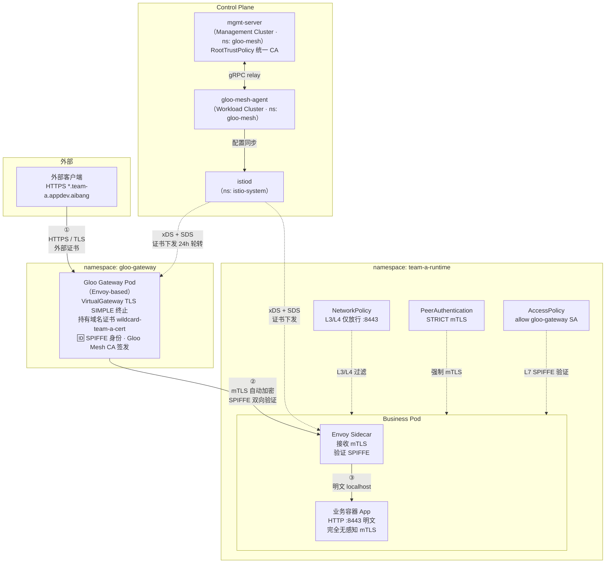
- 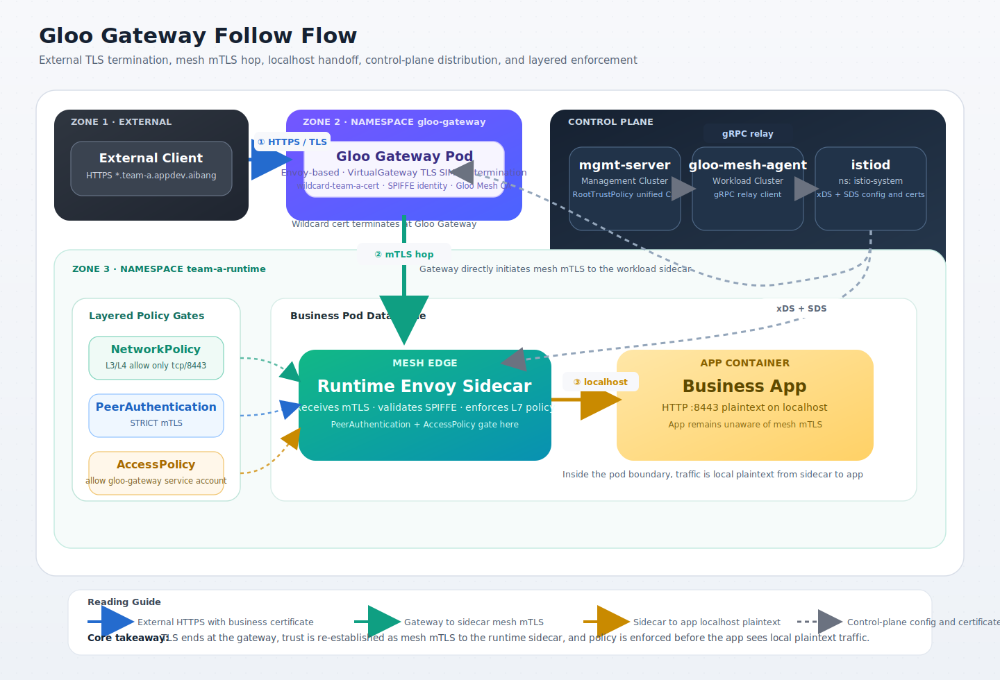

### Sequence Diagram — 完整请求生命周期

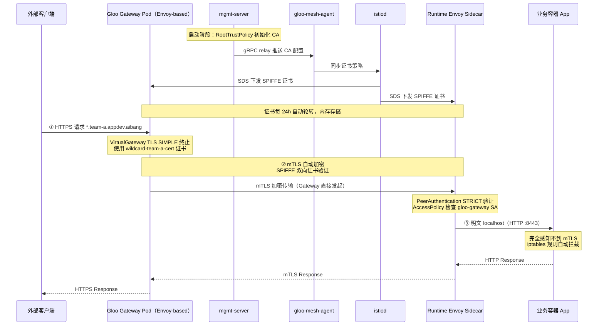

### 三层安全说明（Gloo Enterprise 版）

| 安全层                        | 说明                                                                                                                                                                   | Gloo Enterprise 配置                                           |
| ----------------------------- | ---------------------------------------------------------------------------------------------------------------------------------------------------------------------- | -------------------------------------------------------------- |
| **① 外部 TLS（SIMPLE）**      | 客户端 → Gloo Gateway 终止。使用业务域名证书（team-a 独立 wildcard 证书）。Gateway 之后无外部 TLS。                                                                    | `VirtualGateway` + `tls.mode: SIMPLE` + `secretName`           |
| **② 网格内 mTLS（自动）**     | Sidecar ↔ Sidecar 自动加密。**Gloo Mesh Control Plane** 通过 `RootTrustPolicy` 统一管理 CA，SDS 自动签发 SPIFFE 证书，无需手动配置。`PeerAuthentication STRICT` 强制。 | `PeerAuthentication` + `RootTrustPolicy` + Gloo Mesh CA        |
| **③ Pod 内明文（localhost）** | Sidecar → App 容器，走 localhost，不经过网络，安全边界由 Sidecar 保障。iptables 规则由 istio-init 注入（Gloo Mesh 复用 Istio 数据面机制）。                            | 自动（与 Istio 完全一致）                                      |
| **双层防护**                  | NetworkPolicy（L3/L4）+ **AccessPolicy**（L7 SPIFFE）同时生效，互为补充。                                                                                              | `NetworkPolicy` + `AccessPolicy`（替代 `AuthorizationPolicy`） |

### Istio → Gloo Enterprise 资源配置迁移对照

| 安全层      | Istio 配置                                        | Gloo Enterprise 配置                                  | 变化点                                               |
| ----------- | ------------------------------------------------- | ----------------------------------------------------- | ---------------------------------------------------- |
| ① TLS 终止  | `Gateway` + `tls.mode: SIMPLE` + `credentialName` | `VirtualGateway` + `tls.mode: SIMPLE` + `secretName`  | CRD 名称和字段名变化，语义一致                       |
| ② mTLS 证书 | `istiod` CA 内置签发                              | `Gloo Mesh Control Plane` + `RootTrustPolicy` 统一 CA | **Enterprise 优势**：跨集群统一 CA，支持外部 CA 集成 |
| ② PeerAuth  | `PeerAuthentication` STRICT                       | `PeerAuthentication` STRICT（**兼容，不变**）         | 直接复用，无需修改                                   |
| ② 访问控制  | `AuthorizationPolicy` default-deny + allow SA     | `AccessPolicy` default-deny + allow SA                | CRD 替换，SPIFFE principals 语义一致                 |
| ② 路由规则  | `VirtualService` host/path 匹配                   | `RouteTable` host/path 匹配 + delegation              | **Enterprise 优势**：支持路由委托                    |
| ③ localhost | iptables（istio-init 注入）                       | iptables（istio-init 注入，**完全一致**）             | 不变                                                 |
| 防护叠加    | `NetworkPolicy` + `AuthorizationPolicy`           | `NetworkPolicy` + `AccessPolicy`                      | L3/L4 不变，L7 CRD 名称变化                          |

### Gloo Enterprise 关键 YAML 参考

#### VirtualGateway（替代 Istio Gateway）

```yaml
apiVersion: networking.gloo.solo.io/v2
kind: VirtualGateway
metadata:
  name: team-a-gateway
  namespace: gloo-gateway
spec:
  workloads:
  - selector:
      labels:
        app: gloo-gateway
      namespace: gloo-gateway
  listeners:
  - http: {}
    port:
      number: 443
    tls:
      mode: SIMPLE                                # ① TLS 终止（与 Istio 完全一致）
      secretName: wildcard-team-a-appdev-aibang-cert
    allowedRouteTables:
    - host: "*.team-a.appdev.aibang"
```

#### AccessPolicy（替代 AuthorizationPolicy）

```yaml
apiVersion: security.policy.gloo.solo.io/v2
kind: AccessPolicy
metadata:
  name: allow-gateway-only
  namespace: team-a-runtime
spec:
  applyToWorkloads:
  - selector:
      labels:
        app: api1-backend
  config:
    authn:
      tlsMode: STRICT                             # ② 强制 mTLS
    authz:
      allowedClients:
      - serviceAccountSelector:
          name: gloo-gateway-sa                    # 仅允许 Gateway SA
          namespace: gloo-gateway
```

#### RootTrustPolicy（Enterprise 专属：统一 CA 管理）

```yaml
apiVersion: admin.gloo.solo.io/v2
kind: RootTrustPolicy
metadata:
  name: unified-ca
  namespace: gloo-mesh
spec:
  config:
    intermediateCertOptions:
      secretType: Opaque
    mgmtServerCa:
      generated:
        ttlDays: 365                               # CA 有效期
    autoRestartPods: true                           # CA 轮换时自动重启 Pod
```

### 核心结论

> [!IMPORTANT]
> **Gloo Mesh Enterprise 替换 Istio 后，三层加密架构完全保持不变**：
> - ① 外部 TLS SIMPLE 终止 → `VirtualGateway`（等价替换 `Gateway`）
> - ② 网格内 mTLS 自动加密 → `Gloo Mesh CA` + `PeerAuthentication STRICT`（证书管理升级，PeerAuth 直接兼容）
> - ③ Pod 内 localhost 明文 → 完全不变
>
> **唯一的本质区别**：证书签发从 `istiod 内置 CA` 升级为 `Gloo Mesh Control Plane + RootTrustPolicy`，
> 支持跨集群统一 CA、外部 CA 集成（Vault/cert-manager）、集中式证书轮换管理。
> 数据面（Envoy Sidecar + iptables 拦截）**完全不变**。

---

## Gloo Mesh Enterprise 可视化 Flow 图集

### 🔷 图 1：North-South 完整流量路径（带加密标注）

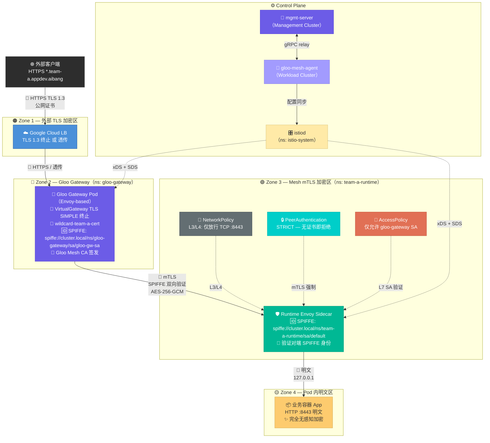

### 🔷 图 2：Gloo Mesh 证书生命周期

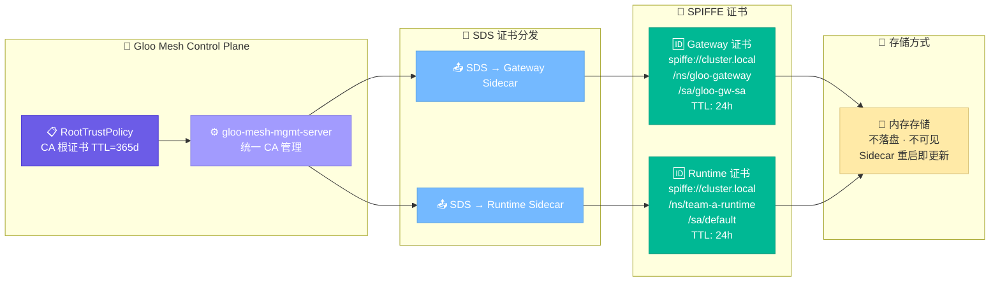

### 🔷 图 3：安全防护层级纵深

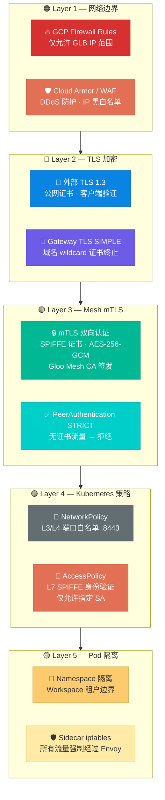

### 🔷 图 4：East-West Mesh 内部流量加密

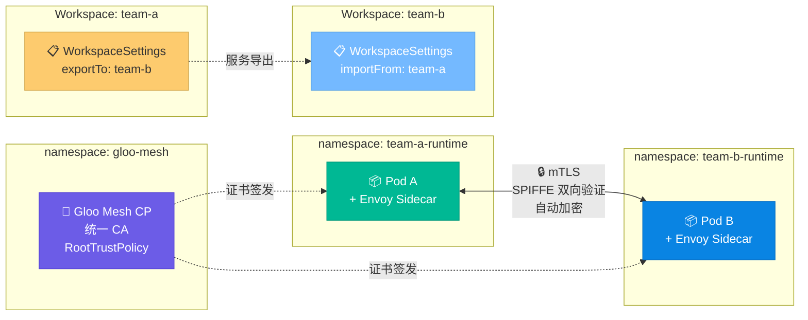

### 🔷 图 5：完整请求加密区域标注图

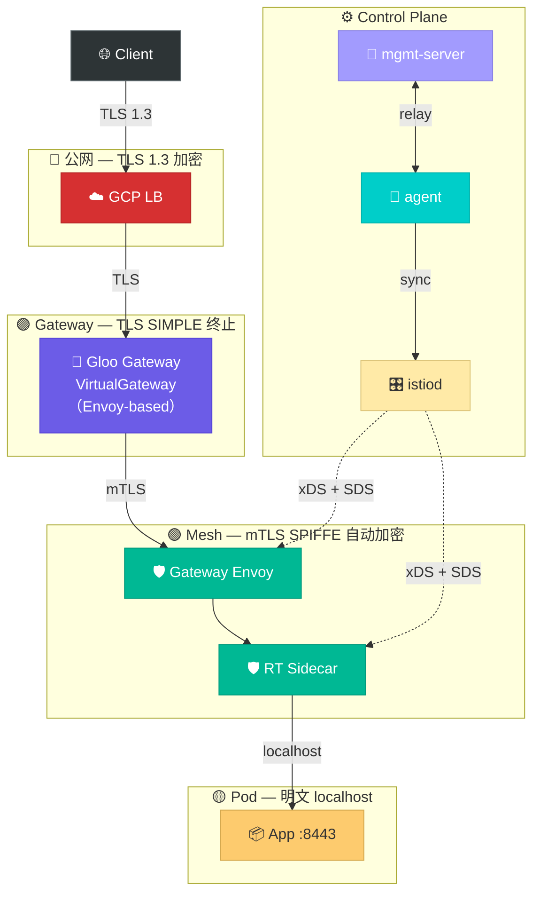

### 🔷 图 6：Gloo Gateway 请求处理管线

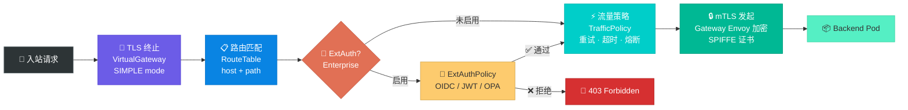

### 🔷 图 7：Gloo Mesh Enterprise 组件全景

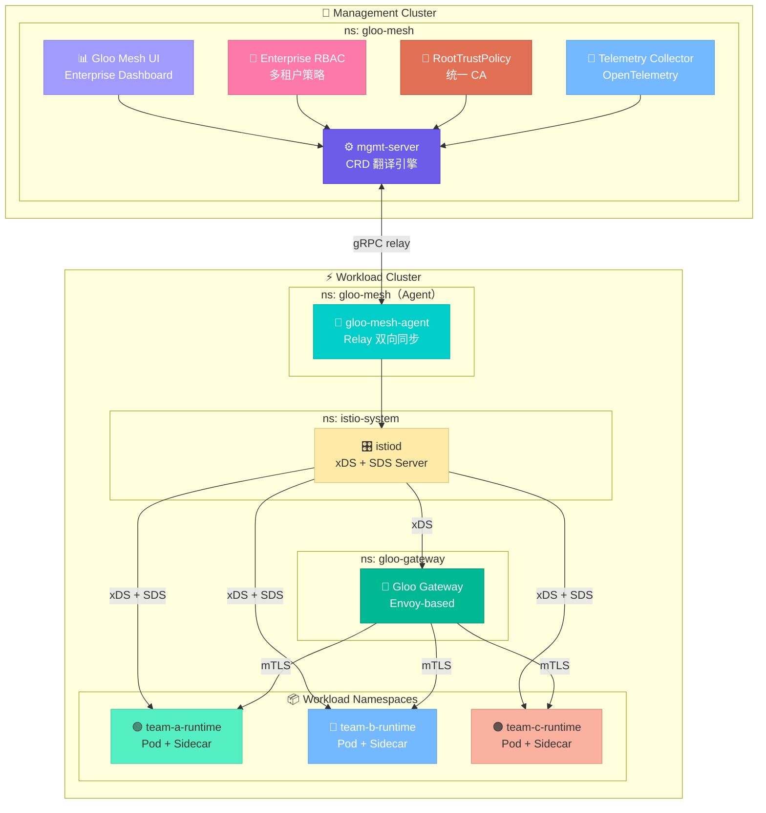

---

## 🏗️ Maitreya Premium Visualization

### 🔷 图 8：Gloo Mesh Enterprise 全景 (Maitreya Premium Style)

> [!TIP]
> **Maitreya 视角**：本图通过色彩分层与 `classDef` 强化了管理面（Zone 1）、网关层（Zone 2）、网格基础设施（Zone 3）与业务负载（Zone 4）的逻辑边界。
> 
> 

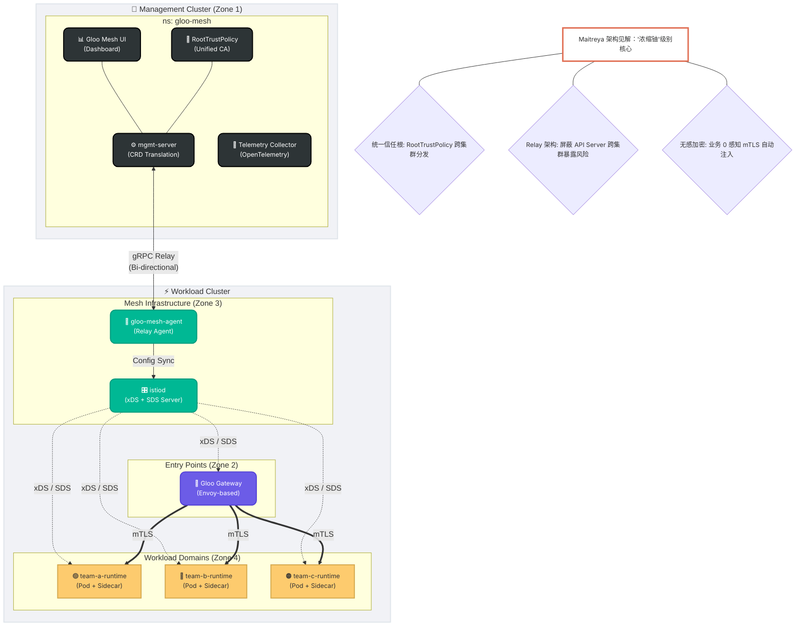
