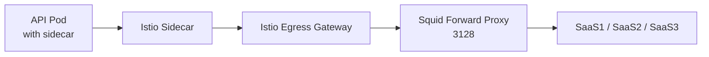
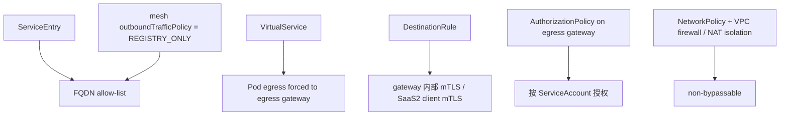

- [GKE Private Cluster 中基于 Istio Egress Gateway 的 SaaS 出站控制方案](#gke-private-cluster-中基于-istio-egress-gateway-的-saas-出站控制方案)
  - [0. 核心澄清（Squid）](#0-核心澄清squid)
    - [这意味着什么](#这意味着什么)
    - [对当前文档和清单的影响](#对当前文档和清单的影响)
    - [当前建议](#当前建议)
  - [1. Goal and Constraints](#1-goal-and-constraints)
    - [目标](#目标)
    - [场景矩阵](#场景矩阵)
    - [核心约束](#核心约束)
    - [先说结论](#先说结论)
  - [2. Recommended Architecture (V1)](#2-recommended-architecture-v1)
    - [推荐 V1](#推荐-v1)
    - [流量图](#流量图)
    - [控制图](#控制图)
    - [一个关键现实约束](#一个关键现实约束)
  - [3. Trade-offs and Alternatives](#3-trade-offs-and-alternatives)
    - [方案 A：完全按你描述的链路落地](#方案-a完全按你描述的链路落地)
    - [方案 B：只用 ServiceEntry + sidecar，不引入 egress gateway](#方案-b只用-serviceentry--sidecar不引入-egress-gateway)
    - [方案 C：让 Squid 改为 intercept/tproxy，或改用更适合的出口组件](#方案-c让-squid-改为-intercepttproxy或改用更适合的出口组件)
  - [4. Implementation Steps](#4-implementation-steps)
    - [4.0 对当前清单的修正说明](#40-对当前清单的修正说明)
    - [4.1 环境前提](#41-环境前提)
    - [`REGISTRY_ONLY`](#registry_only)
    - [4.2 FQDN allow-list：只注册允许访问的 SaaS](#42-fqdn-allow-list只注册允许访问的-saas)
    - [4.3 为上游代理建立 mesh 内部别名](#43-为上游代理建立-mesh-内部别名)
    - [4.4 把 mesh 内流量先导到 egress gateway](#44-把-mesh-内流量先导到-egress-gateway)
    - [egress gateway 监听器](#egress-gateway-监听器)
    - [sidecar 到 gateway 的内部 mTLS](#sidecar-到-gateway-的内部-mtls)
    - [路由规则](#路由规则)
    - [4.5 SaaS2 客户端 mTLS 由 egress gateway 代发](#45-saas2-客户端-mtls-由-egress-gateway-代发)
    - [客户端证书 secret](#客户端证书-secret)
    - [到 proxy-saas2 的 TLS 策略](#到-proxy-saas2-的-tls-策略)
    - [重要边界](#重要边界)
    - [4.6 按 ServiceAccount 做细粒度授权](#46-按-serviceaccount-做细粒度授权)
    - [推荐做法](#推荐做法)
    - [策略示例](#策略示例)
    - [4.7 网络层堵死绕行](#47-网络层堵死绕行)
    - [Pod 级 L3/L4 强制](#pod-级-l3l4-强制)
    - [还不够，还要做节点级隔离](#还不够还要做节点级隔离)
  - [5. Validation and Rollback](#5-validation-and-rollback)
    - [5.1 验证矩阵](#51-验证矩阵)
    - [功能验证](#功能验证)
    - [绕行验证](#绕行验证)
    - [gateway 证书与路由验证](#gateway-证书与路由验证)
    - [日志验证](#日志验证)
    - [5.2 回滚策略](#52-回滚策略)
  - [6. Reliability and Cost Optimizations](#6-reliability-and-cost-optimizations)
  - [7. Handoff Checklist](#7-handoff-checklist)
  - [附：这个方案里最容易踩坑的三个点](#附这个方案里最容易踩坑的三个点)
    - [1. `ServiceEntry` 不等于强 allow-list](#1-serviceentry-不等于强-allow-list)
    - [2. `AuthorizationPolicy.hosts` 不能覆盖 TLS passthrough 场景](#2-authorizationpolicyhosts-不能覆盖-tls-passthrough-场景)
    - [3. `SaaS2` 的 mTLS origination 不是“透明魔法”](#3-saas2-的-mtls-origination-不是透明魔法)
  - [参考资料](#参考资料)

# GKE Private Cluster 中基于 Istio Egress Gateway 的 SaaS 出站控制方案

## 0. 核心澄清（Squid）

这里先修正一个非常关键的前提：

- 你们的 `core proxy:3128` 实际上是 `Squid explicit forward proxy`
- 它不是“透明 L4 TCP proxy”
- `3128` 只是监听端口，底层跑在 TCP 上，但转发语义是 `L7 forward proxy`

这会直接影响整个链路设计。

### 这意味着什么

我前一版文档里把 `core proxy` 按“relay / transparent / SNI-aware TCP proxy”来描述，这对你们当前实际环境并不准确。

对 `Squid` 来说，默认 forward proxy 模式下：

- `HTTP` 请求通常要以 absolute-form 的代理请求发给 Squid
- `HTTPS` 请求通常要先发 `HTTP CONNECT host:443` 给 Squid，再在隧道里跑 TLS

也就是说：

- `egress gateway -> squid:3128` 不能只是“把原始 TLS/TCP 流量直接丢过去”
- 如果没有 `CONNECT` 或显式代理语义，Squid 默认不会把这条流量当作标准 forward proxy 请求处理

### 对当前文档和清单的影响

1. `GKE Standard` 仍然适合这个方案，这一点不变。
2. 但当前 [istioyaml](/Users/lex/git/knowledge/gcp/asm/istioyaml) 清单 **不是 Squid 场景的可直接 apply 版本**。
3. 这套清单成立的前提是“上游是 relay 型 proxy / 非显式代理 / 或透明插入式出口”。
4. 如果要继续保留 `Pod -> sidecar -> egress gateway -> Squid -> SaaS` 这条链路，那么 egress gateway 需要具备对 Squid 发显式代理请求的能力，通常意味着：
   - 对 HTTPS 出站生成 `CONNECT`
   - 对 HTTP 出站生成标准 forward proxy request
   - 这通常已经超出单纯 `ServiceEntry + VirtualService + DestinationRule` 的范围，往往需要 `EnvoyFilter` 或自定义 egress gateway 配置

### 当前建议

把这篇文档理解成两层：

- 架构目标和控制原则仍然成立
- 之前那套 YAML 只适合作为“relay 型出口”的参考草稿，不适合作为 `Squid explicit forward proxy` 的直接实施清单

如果你要看专门面向 Squid 的版本，请直接参考：

- [istio-egress-squid.md](/Users/lex/git/knowledge/gcp/asm/istio-egress-squid.md)
## 1. Goal and Constraints

### 目标

在 `GKE Private Cluster / Private VPC` 中，为访问外部 SaaS 域名的出站流量建立一条强约束路径：

```text
Pod -> sidecar -> Istio Egress Gateway -> Squid forward proxy -> SaaS
```

并满足以下控制目标：

- 按 SaaS FQDN 做 allow-list
- 按 Kubernetes `ServiceAccount` 做细粒度授权
- 尽量做到 `non-bypassable`
- 对 `SaaS2` 由 egress gateway 代发客户端 mTLS
- 可验证、可审计、可观测

### 场景矩阵

- `API1` 只能访问 `SaaS1`
- `API2` 可以访问 `SaaS1 + SaaS2`
- `API3` 只能访问 `SaaS3`
- `API4` 全部禁止

### 核心约束

- 集群是私有集群，默认不希望业务 Pod 直接访问公网
- 现有中心化出口是 `Squid explicit forward proxy (port 3128)`
- `SaaS1 / SaaS3` 走 TLS passthrough
- `SaaS2` 要求客户端证书链、私钥、CA、指定 `SNI=api.saas2.com`

### 先说结论

这是一个 `Advanced` 级别方案，但可以拆成一个可落地的 V1。

不过有两个前提必须先写清楚：

1. `ServiceEntry` 本身不是硬性的 FQDN allow-list。要让“未注册外部域名一律不通”成立，必须配合 `outboundTrafficPolicy: REGISTRY_ONLY`。
2. `SaaS2` 如果要由 egress gateway 代发客户端 mTLS，那么应用到 gateway 这一段不能是“端到端 HTTPS 透传”。换句话说，应用侧要么走明文 HTTP 到 mesh，由 gateway 对外发 mTLS；要么你做 TLS MITM，这通常不建议作为 V1。

---

## 2. Recommended Architecture (V1)

### 推荐 V1

把能力拆成两层：

- `Istio / ASM` 负责：
  - FQDN allow-list
  - 所有 SaaS 流量先导到 egress gateway
  - 基于 `ServiceAccount` 的授权
  - `SaaS2` 的 mTLS origination
- 网络层负责：
  - 业务 Pod 只能到 egress gateway
  - egress gateway 只能到 Squid
  - 普通工作负载节点没有直接公网出口能力

### 流量图



### 控制图



### 一个关键现实约束

既然你们的上游是 `Squid explicit forward proxy`，那 `egress gateway -> squid:3128` 这一跳就必须满足 forward proxy 语义，而不是普通 L4 中转语义。

换句话说：

- 对 `HTTPS` 出站，egress gateway 一般需要先对 Squid 发 `CONNECT`
- 对 `HTTP` 出站，egress gateway 需要发送标准 proxy request
- 默认的 `ServiceEntry + VirtualService + DestinationRule` 只负责路由和 TLS 策略，并不会自动把普通出站请求改写成“面向 Squid 的显式代理协议”

这也是为什么前一版把 Squid 当成“纯 TCP relay”会有偏差。

---

## 3. Trade-offs and Alternatives

### 方案 A：完全按你描述的链路落地

优点：

- 权限和审计集中在 egress gateway
- 证书集中管理
- 与现有中心化出口兼容度高

风险：

- `SaaS2` 的 mTLS origination 对应用接入方式有要求
- egress gateway 必须具备显式对接 `Squid` 的代理语义
- `NetworkPolicy` 只能约束 Pod 级流量，不能单独解决节点直出问题

结论：

- 架构方向成立，但实现层不能只靠前一版那组基础 Istio CRD

### 方案 B：只用 ServiceEntry + sidecar，不引入 egress gateway

问题：

- 无法把证书、审计、授权集中到一个出口点
- `ServiceAccount` 级别策略会分散到各 workload

结论：

- 不推荐

### 方案 C：让 Squid 改为 intercept/tproxy，或改用更适合的出口组件

优点：

- 如果走 intercept/tproxy，会更接近“透明出口”模型
- 如果改用更适合与 Envoy 对接的出口组件，Istio 集成复杂度更低

缺点：

- 需要改现网出口实现或交付模型

结论：

- 不是必须，但这是把实现复杂度降下来的有效方向

---

## 4. Implementation Steps

### 4.0 对当前清单的修正说明

当前目录下的 [istioyaml](/Users/lex/git/knowledge/gcp/asm/istioyaml) 清单：

- **不是** `Squid explicit forward proxy` 的可直接 apply 版本
- 它对应的是“relay 型上游 / 非显式代理”的示例
- 可以保留作参考，但不能直接拿去对接你现在的 Squid

原因很简单：

- 清单里把 `3128` 当成了普通上游端口
- 但对 `Squid` 来说，真正需要的是 `CONNECT` / proxy request 语义

所以从这一节开始，下面的 YAML 更适合理解成“控制面拆解示意”，而不是 `Squid` 的最终可执行配置

### 4.1 环境前提

在做 CRD 之前，先保证下面几件事：

1. 业务 namespace 已开启 sidecar 注入。
2. mesh 内部 mTLS 已开启，至少 `sidecar -> egress gateway` 必须拿得到 `source.principal`。
3. 出站模式改为 `REGISTRY_ONLY`。
4. 业务节点池不要拥有直接公网出口能力。
5. `Squid` 的地址固定，例如 `10.10.20.15:3128`，并且 egress gateway 可以访问它。

### `REGISTRY_ONLY`

如果你不把 outbound policy 改成 `REGISTRY_ONLY`，那么 `ServiceEntry` 只是“声明外部服务”，不是“未声明一律禁止”。

---

### 4.2 FQDN allow-list：只注册允许访问的 SaaS

这里把 `SaaS1`、`SaaS3` 按 TLS passthrough 处理，把 `SaaS2` 按 gateway origination 处理。

```yaml
apiVersion: networking.istio.io/v1
kind: ServiceEntry
metadata:
  name: saas-egress
  namespace: istio-system
spec:
  hosts:
  - api.saas1.com
  - api.saas3.com
  ports:
  - number: 443
    name: tls
    protocol: TLS
  resolution: DNS
  location: MESH_EXTERNAL
---
apiVersion: networking.istio.io/v1
kind: ServiceEntry
metadata:
  name: saas2-egress
  namespace: istio-system
spec:
  hosts:
  - api.saas2.com
  ports:
  - number: 80
    name: http
    protocol: HTTP
    targetPort: 443
  resolution: DNS
  location: MESH_EXTERNAL
```

这里的含义是：

- `SaaS1 / SaaS3`：应用侧按 `https://api.saasX.com`
- `SaaS2`：V1 里应用侧按 `http://api.saas2.com`，由 gateway 对外升级为 mTLS 到 `443`

如果应用必须以 `https://api.saas2.com` 的方式访问，并且不允许 gateway 终止/重发 TLS，那么“gateway 代发客户端证书”这个需求不成立。

---

### 4.3 为上游代理建立 mesh 内部别名

如果上游是 relay 型代理，这种别名方式是可行的。

但对当前 `Squid explicit forward proxy` 来说，这一段**只保留为旧思路参考**，因为 Squid 需要的是显式代理语义，不是简单把流量路由到 `3128`。

```yaml
apiVersion: networking.istio.io/v1
kind: ServiceEntry
metadata:
  name: core-proxy-aliases
  namespace: istio-system
spec:
  hosts:
  - proxy-saas1.mesh.local
  - proxy-saas2.mesh.local
  - proxy-saas3.mesh.local
  ports:
  - number: 3128
    name: tcp-proxy
    protocol: TCP
  resolution: STATIC
  endpoints:
  - address: 10.10.20.15
```

这样做的目的是：

- `proxy-saas1.mesh.local` 和 `proxy-saas3.mesh.local` 走纯 TCP passthrough
- `proxy-saas2.mesh.local` 可以单独挂 `MUTUAL + credentialName + sni`

---

### 4.4 把 mesh 内流量先导到 egress gateway

### egress gateway 监听器

```yaml
apiVersion: networking.istio.io/v1
kind: Gateway
metadata:
  name: saas-egress-gw
  namespace: istio-system
spec:
  selector:
    istio: egressgateway
  servers:
  - port:
      number: 443
      name: tls-passthrough
      protocol: TLS
    tls:
      mode: ISTIO_MUTUAL
    hosts:
    - api.saas1.com
    - api.saas3.com
  - port:
      number: 80
      name: http-origination
      protocol: HTTP
    hosts:
    - api.saas2.com
```

### sidecar 到 gateway 的内部 mTLS

```yaml
apiVersion: networking.istio.io/v1
kind: DestinationRule
metadata:
  name: egress-gateway-mtls
  namespace: istio-system
spec:
  host: istio-egressgateway.istio-system.svc.cluster.local
  trafficPolicy:
    tls:
      mode: ISTIO_MUTUAL
```

### 路由规则

```yaml
apiVersion: networking.istio.io/v1
kind: VirtualService
metadata:
  name: saas-egress-routing
  namespace: istio-system
spec:
  hosts:
  - api.saas1.com
  - api.saas2.com
  - api.saas3.com
  gateways:
  - mesh
  - saas-egress-gw
  tls:
  - match:
    - gateways:
      - mesh
      port: 443
      sniHosts:
      - api.saas1.com
      - api.saas3.com
    route:
    - destination:
        host: istio-egressgateway.istio-system.svc.cluster.local
        port:
          number: 443
  - match:
    - gateways:
      - saas-egress-gw
      port: 443
      sniHosts:
      - api.saas1.com
    route:
    - destination:
        host: proxy-saas1.mesh.local
        port:
          number: 3128
  - match:
    - gateways:
      - saas-egress-gw
      port: 443
      sniHosts:
      - api.saas3.com
    route:
    - destination:
        host: proxy-saas3.mesh.local
        port:
          number: 3128
  http:
  - match:
    - gateways:
      - mesh
      port: 80
      headers:
        :authority:
          exact: api.saas2.com
    route:
    - destination:
        host: istio-egressgateway.istio-system.svc.cluster.local
        port:
          number: 80
  - match:
    - gateways:
      - saas-egress-gw
      port: 80
      headers:
        :authority:
          exact: api.saas2.com
    route:
    - destination:
        host: proxy-saas2.mesh.local
        port:
          number: 3128
```

这个 `VirtualService` 做了两件事：

- 在 `mesh` 上把目标 SaaS 流量重定向到 egress gateway
- 在 `egress gateway` 上把流量继续送到中心 proxy

---

### 4.5 SaaS2 客户端 mTLS 由 egress gateway 代发

### 客户端证书 secret

把 `client cert chain`、`private key`、`CA` 放到 `istio-system`，供 egress gateway 通过 SDS 读取。

```bash
kubectl -n istio-system create secret generic saas2-client-credential \
  --from-file=tls.crt=client-chain.pem \
  --from-file=tls.key=client.key \
  --from-file=ca.crt=saas2-ca.pem
```

### 到 proxy-saas2 的 TLS 策略

这一段同样基于“relay 型上游”假设。

如果当前上游是 `Squid explicit forward proxy`，这里并不能直接成立，因为 egress gateway 还需要先和 Squid 完成显式代理协商。

```yaml
apiVersion: networking.istio.io/v1
kind: DestinationRule
metadata:
  name: proxy-saas2-mtls
  namespace: istio-system
spec:
  host: proxy-saas2.mesh.local
  trafficPolicy:
    portLevelSettings:
    - port:
        number: 3128
      tls:
        mode: MUTUAL
        credentialName: saas2-client-credential
        sni: api.saas2.com
        subjectAltNames:
        - api.saas2.com
```

含义是：

- egress gateway 连的是 `proxy-saas2.mesh.local:3128`
- 但它发起的 TLS 握手使用 `SNI=api.saas2.com`
- 如果 proxy 只是 TCP relay，那么最终证书校验对象仍然是 `api.saas2.com`

### 重要边界

这里并不是“应用发 HTTPS 给 SaaS2，gateway 自动插一张客户端证书进去”。

真正成立的是：

- 应用对 mesh 发的是 HTTP
- gateway 代表应用对外发 mTLS

如果应用必须自己发 HTTPS 到 `api.saas2.com`，那就变成 TLS passthrough，gateway 无法再代发客户端证书。

---

### 4.6 按 ServiceAccount 做细粒度授权

### 推荐做法

在 egress gateway 上只写 `ALLOW` 规则，不要写“全局 DENY all”。

原因是：

- 对同一个 workload 只要存在 `ALLOW` policy
- 未命中的请求天然就是 `deny`

这比一条绝对 `DENY all` 更安全，避免把所有流量先全部挡死。

### 策略示例

```yaml
apiVersion: security.istio.io/v1
kind: AuthorizationPolicy
metadata:
  name: egress-saas-access
  namespace: istio-system
spec:
  selector:
    matchLabels:
      istio: egressgateway
  action: ALLOW
  rules:
  - from:
    - source:
        principals:
        - cluster.local/ns/apps/sa/api1
    to:
    - operation:
        ports: ["443"]
    when:
    - key: connection.sni
      values: ["api.saas1.com"]
  - from:
    - source:
        principals:
        - cluster.local/ns/apps/sa/api2
    to:
    - operation:
        ports: ["443"]
    when:
    - key: connection.sni
      values: ["api.saas1.com", "api.saas3.com"]
  - from:
    - source:
        principals:
        - cluster.local/ns/apps/sa/api2
    to:
    - operation:
        ports: ["80"]
        hosts: ["api.saas2.com"]
  - from:
    - source:
        principals:
        - cluster.local/ns/apps/sa/api3
    to:
    - operation:
        ports: ["443"]
    when:
    - key: connection.sni
      values: ["api.saas3.com"]
```

解释：

- `SaaS1 / SaaS3` 走 TLS passthrough，授权依据用 `connection.sni`
- `SaaS2` 走 HTTP 到 gateway，再对外发 mTLS，授权依据用 HTTP `hosts`
- `API4` 没有任何匹配规则，因此天然拒绝

如果你更偏好直接使用 K8s service account 语法，也可以改用 `serviceAccounts`。

---

### 4.7 网络层堵死绕行

### Pod 级 L3/L4 强制

业务 namespace：

- 只允许到 `istio-egressgateway` 和 `kube-dns`
- 不允许直接到 `Squid`
- 不允许直接到公网

egress gateway：

- 只允许到 `Squid:3128` 和 `kube-dns`

示例：

```yaml
apiVersion: networking.k8s.io/v1
kind: NetworkPolicy
metadata:
  name: apps-only-to-egress-gw
  namespace: apps
spec:
  podSelector: {}
  policyTypes:
  - Egress
  egress:
  - to:
    - namespaceSelector:
        matchLabels:
          kubernetes.io/metadata.name: istio-system
      podSelector:
        matchLabels:
          istio: egressgateway
    ports:
    - protocol: TCP
      port: 80
    - protocol: TCP
      port: 443
  - to:
    - namespaceSelector:
        matchLabels:
          kubernetes.io/metadata.name: kube-system
      podSelector:
        matchLabels:
          k8s-app: kube-dns
    ports:
    - protocol: UDP
      port: 53
    - protocol: TCP
      port: 53
---
apiVersion: networking.k8s.io/v1
kind: NetworkPolicy
metadata:
  name: egress-gw-only-to-core-proxy
  namespace: istio-system
spec:
  podSelector:
    matchLabels:
      istio: egressgateway
  policyTypes:
  - Egress
  egress:
  - to:
    - ipBlock:
        cidr: 10.10.20.15/32
    ports:
    - protocol: TCP
      port: 3128
  - to:
    - namespaceSelector:
        matchLabels:
          kubernetes.io/metadata.name: kube-system
      podSelector:
        matchLabels:
          k8s-app: kube-dns
    ports:
    - protocol: UDP
      port: 53
    - protocol: TCP
      port: 53
```

### 还不够，还要做节点级隔离

`NetworkPolicy` 只能限制 Pod 流量，不能单独保证“节点没有其他出口路径”。

所以要再补两件事：

1. 普通业务节点池不要绑定直接公网 NAT 或被防火墙允许直出
2. 只允许 egress gateway 所在节点池访问 `Squid` 或受控出口

如果不做这层，`hostNetwork`、特权 Pod、节点逃逸场景都可能绕过 Pod 级策略。

---

## 5. Validation and Rollback

### 5.1 验证矩阵

### 功能验证

```bash
# API1 -> SaaS1 允许
kubectl exec -n apps deploy/api1 -- curl -skI https://api.saas1.com

# API1 -> SaaS3 拒绝
kubectl exec -n apps deploy/api1 -- curl -skI https://api.saas3.com

# API2 -> SaaS1 允许
kubectl exec -n apps deploy/api2 -- curl -skI https://api.saas1.com

# API2 -> SaaS2 允许（注意这里是 HTTP，由 gateway 代发 mTLS）
kubectl exec -n apps deploy/api2 -- curl -sSI http://api.saas2.com

# API3 -> SaaS3 允许
kubectl exec -n apps deploy/api3 -- curl -skI https://api.saas3.com

# API4 -> 全拒绝
kubectl exec -n apps deploy/api4 -- curl -skI https://api.saas1.com
```

### 绕行验证

```bash
# 业务 Pod 直接碰 Squid，应该失败
kubectl exec -n apps deploy/api1 -- nc -vz 10.10.20.15 3128

# 业务 Pod 直接访问公网，应该失败
kubectl exec -n apps deploy/api1 -- curl -m 5 http://1.1.1.1
```

### gateway 证书与路由验证

```bash
# 检查 egress gateway 是否拿到 SaaS2 client cert
istioctl pc secret -n istio-system \
  "$(kubectl get pod -n istio-system -l istio=egressgateway -o jsonpath='{.items[0].metadata.name}')"

# 查看 egress gateway cluster 配置
istioctl pc clusters -n istio-system \
  "$(kubectl get pod -n istio-system -l istio=egressgateway -o jsonpath='{.items[0].metadata.name}')"
```

### 日志验证

```bash
kubectl logs -n istio-system -l istio=egressgateway -c istio-proxy --tail=200
```

你应该能看到：

- `SaaS1 / SaaS3` 的 egress 记录
- `SaaS2` 的 gateway 访问记录
- Squid 的来源应只剩 egress gateway，而不是业务 Pod

### 5.2 回滚策略

回滚顺序建议：

1. 先放宽 `AuthorizationPolicy`
2. 再撤销 `VirtualService` 的 mesh->gateway 强制路由
3. 再移除 `NetworkPolicy`
4. 最后删除 `ServiceEntry` 和 `DestinationRule`

不要先删 `NetworkPolicy` 以外的资源再保留强封禁，否则会造成大面积出站不可达。

---

## 6. Reliability and Cost Optimizations

- 为 egress gateway 单独建节点池，避免和业务 workload 抢资源。
- 给 egress gateway 配置 `HPA + PDB + anti-affinity`。
- 打开 egress gateway access log，至少保留 `source principal`、`authority`、`sni`、`upstream cluster`。
- 对 `SaaS2` 证书做轮转流程，优先用 `credentialName` + SDS，不要把证书直接写到 Pod 文件系统。
- 如果 SaaS 域名较多，建议按 SaaS 分组拆 `ServiceEntry` 和 `AuthorizationPolicy`，便于变更审计。

---

## 7. Handoff Checklist

- 已确认 mesh 出站模式为 `REGISTRY_ONLY`
- 已确认业务 namespace 开启 sidecar 注入
- 已确认 `source.principal` 在 egress gateway 可见
- 已确认 `Squid` 的 forward proxy 行为、ACL 和 CONNECT 规则符合预期
- 已确认 `SaaS2` 应用接入方式允许 gateway 做 TLS origination
- 已下发 `ServiceEntry / Gateway / VirtualService / DestinationRule / AuthorizationPolicy / NetworkPolicy`
- 已完成允许/拒绝矩阵验证
- 已从 Squid 日志确认出口来源是 egress gateway
- 已在节点/VPC 层关闭普通 workload 的直出路径

---

## 附：这个方案里最容易踩坑的三个点

### 1. `ServiceEntry` 不等于强 allow-list

如果 mesh 还是 `ALLOW_ANY`，未注册域名依然可能出站。

### 2. `AuthorizationPolicy.hosts` 不能覆盖 TLS passthrough 场景

对 `SaaS1 / SaaS3` 这类 TLS passthrough，应该按 `connection.sni` 做授权。

### 3. `SaaS2` 的 mTLS origination 不是“透明魔法”

它要求 gateway 能拿到明文 HTTP 并代表应用重新建 TLS；如果应用自己已经发起端到端 HTTPS，gateway 不能无感插入客户端证书。

---

## 参考资料

- [Istio Egress Gateways](https://istio.io/latest/docs/tasks/traffic-management/egress/egress-gateway/)
- [Istio Egress Gateway TLS Origination](https://istio.io/latest/docs/tasks/traffic-management/egress/egress-gateway-tls-origination/)
- [Istio AuthorizationPolicy Reference](https://istio.io/latest/docs/reference/config/security/authorization-policy/)
- [Istio Authorization Conditions Reference](https://istio.io/latest/docs/reference/config/security/conditions/)
- [Istio Authorization for TCP Traffic](https://istio.io/latest/docs/tasks/security/authorization/authz-tcp/)
- [GKE NetworkPolicy](https://cloud.google.com/kubernetes-engine/docs/how-to/network-policy)
