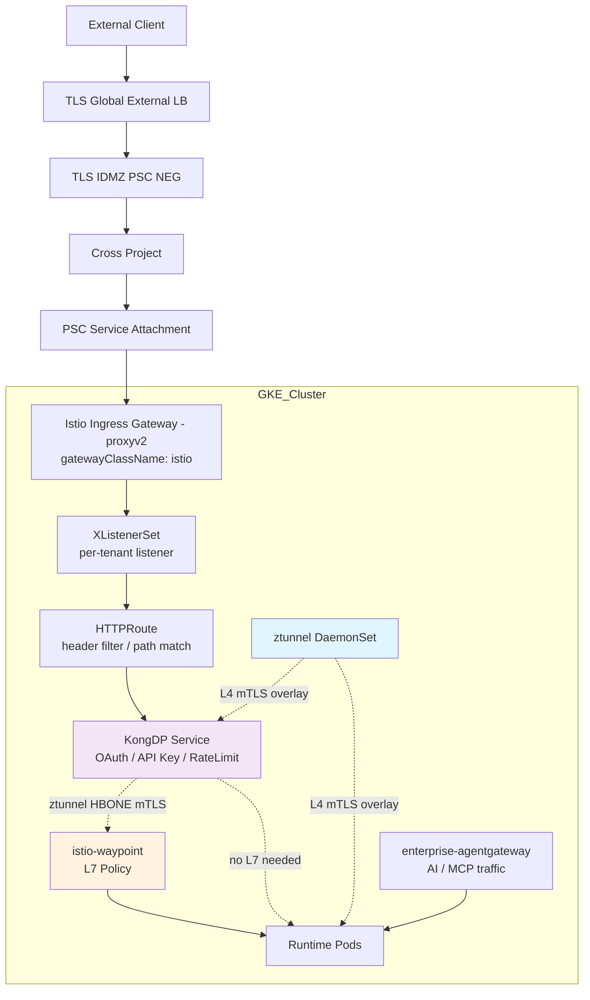
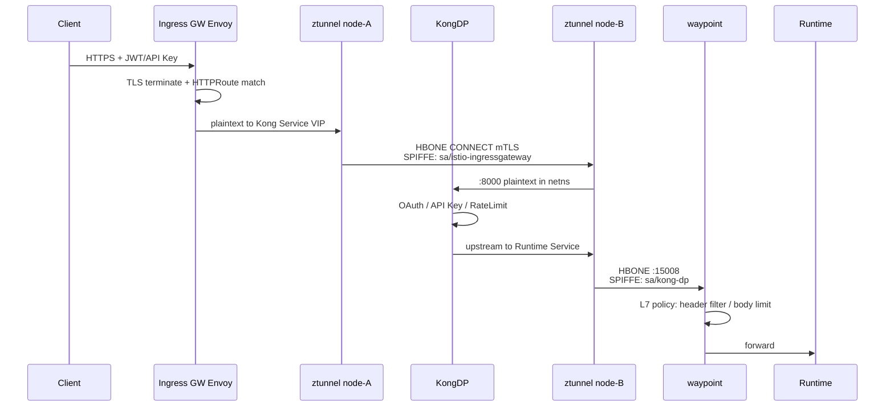

# q

```txt
你看一下能不能基于我下面提供的这些安装包，推导出来我们要在GKE环境里安装的资源
images in our repo: 根据这个，我们只能大概知道我们现在模板是用的开源社区版本的 solo istio 版本 1.30.3
soloio-img/ztunnel:1.30.3-distroless
soloio-img/pilot:1.30.3-distroless
soloio-img/install-cni:1.30.3-distroless
soloio-img/proxyv2:1.30.3-distroless
还有我提供的这些背景信息 我们 要在GKE 里面 安装ambient istio 的工作模式
ztunnel 提供 L4 mTLS
仅在需要 L7 Policy 时，选择性地使用 istio-waypoint 换句话说 waypoint 执行的是 L7 策略
我们确定使用的方案应该是 solo agentGateway

gatewayClassName: enterprise-agentgateway显式声明
是否 需要 去支持
gatewayClassName: istio-waypoint 
我理解我们是需要这个模式的，因为我们需要对用户的 File upload 或者 Head 头进行一些filter

还有一个特别的需求，是我们在这个GKE的集群里面运行了一个 KongDP，我们也希望 KongDP 去成为流量中转的一部分 .也就是说，对于我们 public 的用户，必须要经过 Kong 当然，这仅仅是一个例子。其实对于我们引通的需求也是一样的，也有一部分用户是必须要经过功能的。
这里我简单澄清一下，KongDP做了个什么事情？他专职负责DSP业务接口的安全鉴权 OAuth/API Key的校验与流量的限流
比如for our public ingress 
external clent ==> TLS glb ==> TLS Idmz PSC NEG ==> cross project ==> Istio Gateway [as service attachement] ==> ListenerSet  ==> httproute ==> KongDP ==> Runtime    

Solo 商业模式建立在 Envoy 和istio  之上 其分发的开源版、社区版，本质上是 Solo 基于上游 istio 源码编译的发行版镜像 
```


# Solo Istio 1.30.3 Ambient + agentgateway + KongDP 在 GKE 的落地推导

## 1. 问题分析：这 4 个镜像能推导出什么，不能推导出什么

先把结论放前面：**你给的 4 个镜像只能推导出「Ambient 基础面 + Envoy waypoint」，推导不出 agentgateway。** agentgateway 是完全独立的控制面 + 数据面，独立 Helm chart、独立镜像、独立 License。

### 1.1 镜像 → 组件 → Helm Chart 映射

| 镜像 | 对应组件 | Helm Chart | Ambient 中的角色 |
|------|---------|-----------|-----------------|
| `soloio-img/pilot:1.30.3-distroless` | istiod | `istiod` | 控制面，下发 xDS / ztunnel WDS，签发 SPIFFE 证书 |
| `soloio-img/install-cni:1.30.3-distroless` | istio-cni + ambient node agent | `cni` | DaemonSet，做 pod netns 重定向（Ambient 的**前置必需**） |
| `soloio-img/ztunnel:1.30.3-distroless` | ztunnel | `ztunnel` | DaemonSet，节点级 L4 代理，HBONE + mTLS |
| `soloio-img/proxyv2:1.30.3-distroless` | Envoy | `gateway` / waypoint 自动拉起 | ① Ingress Gateway ② `istio-waypoint` 的数据面 ③ east-west gateway |
| — | **CRD** | `base` | 无镜像，但必须第一个装 |

> 关键推论：`istio-waypoint` GatewayClass 的数据面就是 `proxyv2`，**你已经有了**，不需要额外镜像。而 `enterprise-agentgateway` 的数据面是 `agent-gateway` 容器，**你的清单里没有**。

### 1.2 缺失清单（需要补充到你们的内部镜像仓库）

```text
# Solo Enterprise for agentgateway 控制面 + 数据面
us-docker.pkg.dev/solo-public/enterprise-agentgateway/...   # controller image
us-docker.pkg.dev/solo-public/enterprise-agentgateway/...   # agentgateway dataplane image
# Helm charts (OCI)
oci://us-docker.pkg.dev/solo-public/enterprise-agentgateway/charts/enterprise-agentgateway-crds
oci://us-docker.pkg.dev/solo-public/enterprise-agentgateway/charts/enterprise-agentgateway
```

Solo Enterprise for agentgateway 需要单独的 License，不包含在 Gloo Gateway License 里。这点建议提前跟采购/Solo AM 确认，否则装到一半会卡住。

### 1.3 Tag 需要核对

Solo 发行版的标准 tag 是 `1.30.3-solo` / `1.30.3-solo-distroless`（官方安装指引里 `export ISTIO_IMAGE=${ISTIO_VERSION}-solo`）。你们的 tag 是 `1.30.3-distroless`，少了 `-solo` 后缀。

```bash
# 验证当前镜像到底是不是 Solo 企业版构建
docker pull us-docker.pkg.dev/soloio-img/istio/pilot:1.30.3-distroless
docker inspect us-docker.pkg.dev/soloio-img/istio/pilot:1.30.3-distroless \
  | jq -r '.[0].Config.Labels'
# 或直接看版本串，Solo 构建会带 -solo 标识
kubectl exec -n istio-system deploy/istiod -- pilot-discovery version
```

> 这个差别有实际影响：企业版镜像（`-solo`）才支持 通过 `license.value` / `license.secretRef` 传 Solo License 来解锁企业级特性、n-4 CVE 修复；纯社区构建则没有。

---

## 2. GatewayClass 的三条路线（这是你问题的核心）

`agentgateway` 在不同产品线里 **GatewayClass 名字不一样**，这是最容易踩坑的地方：

| 路线 | Ingress GatewayClass | Waypoint GatewayClass | 控制面 | 成熟度 |
|------|---------------------|----------------------|--------|--------|
| 上游 Istio 1.30 内置 | `istio-agentgateway` | ❌ 不支持 | istiod（`PILOT_ENABLE_AGENTGATEWAY=true`） | 实验性，仅支持作为 Gateway API gateway，不支持 sidecar 或 waypoint |
| **Solo Enterprise for Istio 1.30/1.31** | `enterprise-agentgateway` | `enterprise-agentgateway-waypoint` | 独立 chart（`agentgateway-system`） | waypoint 能力处于 alpha，不建议用于生产 |
| Gloo Gateway 2.0 | `agentgateway-enterprise` | `agentgateway-enterprise-waypoint` | `gloo-system` | GA（gateway 侧） |
| 原生 Istio Envoy | `istio` | `istio-waypoint` | istiod | **GA / 生产级** |

你写的 `gatewayClassName: enterprise-agentgateway` 对应的是 **Solo Enterprise for Istio** 这条线。装完后第一件事：

```bash
kubectl get gatewayclass -o custom-columns=\
NAME:.metadata.name,CONTROLLER:.spec.controllerName,ACCEPTED:.status.conditions[0].status
```

预期输出类似：

```text
NAME                              CONTROLLER                             ACCEPTED
istio                             istio.io/gateway-controller            True
istio-waypoint                    istio.io/gateway-controller            True
istio-remote                      istio.io/unmanaged-gateway-controller  True
enterprise-agentgateway           solo.io/agentgateway                   True
enterprise-agentgateway-waypoint  solo.io/agentgateway                   True
```

### 2.1 是否需要保留 `istio-waypoint`？—— 需要，而且应该作为默认

你的诉求是「对 File upload 和 Header 做 filter」。给一个决策表：

| 需求 | 放哪一层最合适 | 理由 |
|------|--------------|------|
| Header 增删改（南北向） | **Ingress Gateway**（`istio` class） | Gateway API `RequestHeaderModifier` 原生支持，零额外 hop |
| Header 条件路由/校验（南北向） | Ingress Gateway HTTPRoute `matches` | 同上 |
| **File upload 体积限制** | **KongDP**（`request-size-limiting` 插件） | Kong 已经在链路上，Gateway API 没有原生 body-size filter，用 EnvoyFilter 成本更高 |
| Runtime → Runtime 东西向 L7 策略 | **`istio-waypoint`** | ztunnel 只做 L4，L7 必须靠 waypoint |
| Service 粒度 L7 AuthorizationPolicy | **`istio-waypoint`** | ztunnel 上的 AuthorizationPolicy 只有 L4 语义 |
| AI / MCP / LLM 流量、token 级策略 | `enterprise-agentgateway` | agentgateway 的定位就是 agentic 流量 |

**建议的组合拳：**

- `istio` → 南北向 Ingress（生产主链路，PSC service attachment 挂这里）
- `istio-waypoint` → 东西向 L7（Kong → Runtime、Runtime → Runtime），**生产默认**
- `enterprise-agentgateway` → 单独给 AI/agentic 场景开的 Gateway，灰度使用
- `enterprise-agentgateway-waypoint` → 先不上生产（alpha）

> ⚠️ 不要把「waypoint 必须是 agentgateway」当成前提。1.30 的 agentgateway waypoint 还是 alpha；而 `istio-waypoint`（Envoy）是 GA 的，能力覆盖你说的 header filter 场景绰绰有余。

---

## 3. 整体流量架构



链路关键点：



---

## 4. 安装步骤

### 4.1 环境变量与前置检查

```bash
export ISTIO_VERSION=1.30.3
export ISTIO_IMAGE=${ISTIO_VERSION}-distroless      # 按你们实际 tag，官方为 ${ISTIO_VERSION}-solo
export REPO=us-docker.pkg.dev/soloio-img/istio
export HELM_REPO=us-docker.pkg.dev/soloio-img/istio-helm
export ISTIO_NS=istio-system
export GW_NS=istio-abjx-int                          # 沿用你们现有的网关命名空间

# --- 前置检查（Ambient 在 GKE 上有硬约束）---
# 1. 必须是 Standard 集群，Autopilot 不允许 ztunnel/cni 所需的 NET_ADMIN/SYS_ADMIN
gcloud container clusters describe ${CLUSTER} --region ${REGION} \
  --format='value(autopilot.enabled, networkConfig.datapathProvider)'

# 2. Gateway API CRD 版本（1.30 对 TLS passthrough 有最低版本要求）
kubectl get crd gateways.gateway.networking.k8s.io \
  -o jsonpath='{.metadata.annotations.gateway\.networking\.k8s\.io/bundle-version}{"\n"}'

# 3. ListenerSet 属于 experimental channel，必须单独装
kubectl get crd xlistenersets.gateway.networking.x-k8s.io 2>/dev/null \
  || echo "需要安装 Gateway API experimental channel"
```

> 1.30 升级时如果 Gateway API CRD 版本过旧，TLS passthrough 会静默失效；1.31 才把这个日志从 info 提到 warn，所以 1.30 上必须手动核对版本。

### 4.2 Ambient 核心组件（顺序不可颠倒）

```bash
# Step 1: CRDs
helm upgrade -i istio-base oci://${HELM_REPO}/base \
  --version ${ISTIO_VERSION} -n ${ISTIO_NS} --create-namespace

# Step 2: istiod (ambient profile)
helm upgrade -i istiod oci://${HELM_REPO}/istiod \
  --version ${ISTIO_VERSION} -n ${ISTIO_NS} \
  -f values-istiod-ambient.yaml

# Step 3: istio-cni —— Ambient 的重定向依赖它，必须在 ztunnel 之前
helm upgrade -i istio-cni oci://${HELM_REPO}/cni \
  --version ${ISTIO_VERSION} -n ${ISTIO_NS} \
  -f values-cni-gke.yaml

# Step 4: ztunnel
helm upgrade -i ztunnel oci://${HELM_REPO}/ztunnel \
  --version ${ISTIO_VERSION} -n ${ISTIO_NS} \
  -f values-ztunnel.yaml

# Step 5: Ingress Gateway (Envoy)
helm upgrade -i istio-ingressgateway oci://${HELM_REPO}/gateway \
  --version ${ISTIO_VERSION} -n ${GW_NS} --create-namespace \
  -f values-gateway.yaml
```

### 4.3 `values-istiod-ambient.yaml`

```yaml
profile: ambient

global:
  hub: us-docker.pkg.dev/soloio-img/istio
  tag: 1.30.3-distroless
  platform: gke                    # GKE 必须，影响 cniBinDir 等路径
  proxy:
    clusterDomain: cluster.local

# Solo 企业版镜像才需要；社区构建注释掉
license:
  secretRef:
    name: solo-license
    key: license-key

meshConfig:
  accessLogFile: /dev/stdout
  defaultConfig:
    proxyMetadata:
      ISTIO_META_DNS_CAPTURE: "true"
      ISTIO_META_DNS_AUTO_ALLOCATE: "true"
  # 全局 STRICT 交给 PeerAuthentication 控制，这里保守起见先 PERMISSIVE
  trustDomain: cluster.local
  extensionProviders: []

pilot:
  env:
    # Ambient 必开
    PILOT_ENABLE_AMBIENT: "true"
    # 只有走「上游内置 agentgateway」路线才需要；走 Solo 独立控制面则不需要
    # PILOT_ENABLE_AGENTGATEWAY: "true"

    # 1.30 新增：HBONE 窗口调优，大文件上传场景建议调大
    PILOT_HBONE_INITIAL_STREAM_WINDOW_SIZE: "2097152"
    PILOT_HBONE_INITIAL_CONNECTION_WINDOW_SIZE: "8388608"

    # 1.30 破坏性变更：XDS debug 端点强制鉴权，装 Solo UI 到非 gloo-mesh ns 时必须加
    # DEBUG_ENDPOINT_AUTH_ALLOWED_NAMESPACES: "gloo-mesh,istio-abjx-int"
  resources:
    requests: { cpu: "500m", memory: "2Gi" }
  autoscaleMin: 2
```

> `PILOT_HBONE_INITIAL_STREAM_WINDOW_SIZE` / `PILOT_HBONE_INITIAL_CONNECTION_WINDOW_SIZE` 用于配置 waypoint 和 east-west gateway 的 HBONE CONNECT 上游集群初始窗口，可以减少不必要的缓冲——你们有 File upload 场景，这两个参数值得压测后定值。

### 4.4 `values-cni-gke.yaml`

```yaml
profile: ambient

global:
  hub: us-docker.pkg.dev/soloio-img/istio
  tag: 1.30.3-distroless
  platform: gke

cni:
  ambient:
    enabled: true
  # GKE 的 CNI 二进制目录
  cniBinDir: /home/kubernetes/bin
  cniConfDir: /etc/cni/net.d
  # 绝不能把系统 ns 拉进 ambient
  excludeNamespaces:
    - kube-system
    - istio-system
    - gke-managed-system
    - gmp-system
  # 1.30 默认 true
  useAppArmorAnnotation: true
  logLevel: info
```

> ⚠️ **1.30 破坏性变更**：CNI config 文件权限收紧到 `0600`。如果你们有自定义的 CNI 配置巡检脚本，会告警。

### 4.5 `values-ztunnel.yaml`

```yaml
profile: ambient

hub: us-docker.pkg.dev/soloio-img/istio
tag: 1.30.3-distroless

env:
  # 1.30 新增 Tokio runtime metrics
  ZTUNNEL_WORKER_THREADS: "2"

resources:
  requests: { cpu: "200m", memory: "512Mi" }
  limits:   { memory: "1Gi" }

# 非标准 DNS 环境（比如你们有 NodeLocal DNSCache + DNS Peering）可用 1.30 新增字段
# dnsPolicy: ClusterFirst
# dnsConfig:
#   options:
#     - name: ndots
#       value: "2"

terminationGracePeriodSeconds: 30
```

---

## 5. 关键配置文件

### 5.1 命名空间纳管（渐进式）

```yaml
apiVersion: v1
kind: Namespace
metadata:
  name: bbuk-runtime
  labels:
    istio.io/dataplane-mode: ambient        # 纳入 ambient，ztunnel 接管 L4 mTLS
---
apiVersion: v1
kind: Namespace
metadata:
  name: kong
  labels:
    istio.io/dataplane-mode: ambient
```

```bash
# 单个 Pod 临时排除（Kong 出问题时的逃生通道）
kubectl label pod <pod> -n kong istio.io/dataplane-mode=none --overwrite
```

### 5.2 Ingress Gateway + ListenerSet

```yaml
apiVersion: gateway.networking.k8s.io/v1
kind: Gateway
metadata:
  name: bbuk-ingress
  namespace: istio-abjx-int
  annotations:
    # PSC service attachment 的承载 LB
    networking.gke.io/load-balancer-type: "Internal"
    networking.gke.io/internal-load-balancer-allow-global-access: "true"
spec:
  gatewayClassName: istio
  # 允许其他 namespace 挂 ListenerSet —— 多租户关键开关
  allowedListeners:
    namespaces:
      from: Selector
      selector:
        matchLabels:
          bbuk.io/listenerset: "enabled"
  listeners:
    - name: default-https
      port: 443
      protocol: HTTPS
      hostname: "*.bbuk.example.com"
      tls:
        mode: Terminate
        certificateRefs:
          - kind: Secret
            name: bbuk-wildcard-tls
      allowedRoutes:
        namespaces:
          from: All
---
apiVersion: gateway.networking.x-k8s.io/v1alpha1
kind: XListenerSet
metadata:
  name: tenant-dsp-listeners
  namespace: bbuk-int
spec:
  parentRef:
    group: gateway.networking.k8s.io
    kind: Gateway
    name: bbuk-ingress
    namespace: istio-abjx-int
  listeners:
    - name: dsp-public
      hostname: dsp-api.bbuk.example.com
      port: 443
      protocol: HTTPS
      tls:
        mode: Terminate
        certificateRefs:
          - kind: Secret
            name: dsp-api-tls
```

> 1.30 开始 Gateway status 会上报已挂载的 ListenerSet 和 route，另外 1.30.1 修复了 pilot 为 agentgateway 生成配置时忽略 ListenerSet 及其 route 的问题——**所以如果你们要在 agentgateway 上用 ListenerSet，最低必须 1.30.1，1.30.3 没问题。**

### 5.3 HTTPRoute：强制经过 KongDP

```yaml
apiVersion: gateway.networking.k8s.io/v1
kind: HTTPRoute
metadata:
  name: dsp-public-via-kong
  namespace: bbuk-int
spec:
  parentRefs:
    - group: gateway.networking.x-k8s.io
      kind: XListenerSet
      name: tenant-dsp-listeners
      sectionName: dsp-public
  hostnames:
    - dsp-api.bbuk.example.com
  rules:
    - matches:
        - path:
            type: PathPrefix
            value: /
      filters:
        - type: RequestHeaderModifier
          set:
            # 给 Kong 留证据链，便于审计和 Kong 侧 route 匹配
            - name: X-Bbuk-Ingress-Path
              value: "public"
          remove:
            # 剥掉客户端伪造的内部头 —— 这是 header filter 最该做的事
            - X-Internal-Auth
            - X-Bbuk-Trusted
      backendRefs:
        - name: kong-dp-proxy
          namespace: kong
          port: 8000
          weight: 100
---
# 跨 namespace backendRef 必须授权
apiVersion: gateway.networking.k8s.io/v1beta1
kind: ReferenceGrant
metadata:
  name: allow-bbuk-int-to-kong
  namespace: kong
spec:
  from:
    - group: gateway.networking.k8s.io
      kind: HTTPRoute
      namespace: bbuk-int
  to:
    - group: ""
      kind: Service
      name: kong-dp-proxy
```

### 5.4 waypoint（`istio-waypoint`）

```yaml
apiVersion: gateway.networking.k8s.io/v1
kind: Gateway
metadata:
  name: runtime-waypoint
  namespace: bbuk-runtime
  labels:
    # service 粒度；如果要覆盖 ServiceEntry（比如外部 egress）用 all
    istio.io/waypoint-for: service
  annotations:
    # 1.30 新增：让 Runtime 能看到原始客户端 SPIFFE 身份
    ambient.istio.io/xfcc-include-client-identity: "true"
spec:
  gatewayClassName: istio-waypoint
  listeners:
    - name: mesh
      port: 15008
      protocol: HBONE
```

```bash
# 把 Service 绑到 waypoint（只对需要 L7 的服务开，控制成本）
kubectl label svc api-runtime -n bbuk-runtime \
  istio.io/use-waypoint=runtime-waypoint

# 或整个 ns 绑定
kubectl label ns bbuk-runtime istio.io/use-waypoint=runtime-waypoint

# 让南北向 ingress 流量也强制过 waypoint
kubectl label svc api-runtime -n bbuk-runtime \
  istio.io/ingress-use-waypoint=true
```

> 带上 `ambient.istio.io/xfcc-include-client-identity: "true"` 注解后，waypoint 会用 ztunnel 提供的源工作负载 SPIFFE 身份重写 `x-forwarded-client-cert`，入站原有的 XFCC 值会被替换掉。这正好帮你解决「Kong 后面的 Runtime 怎么知道真实调用方」的问题——**注意它会覆盖 Kong 传下来的 XFCC**，如果 Kong 也在写这个头，需要改用自定义头。

### 5.5 waypoint 上的 L7 Filter（Header + Body Size）

```yaml
# Header filter：waypoint 上的 HTTPRoute，parentRef 指向 Service
apiVersion: gateway.networking.k8s.io/v1
kind: HTTPRoute
metadata:
  name: runtime-l7-filter
  namespace: bbuk-runtime
spec:
  parentRefs:
    - group: ""
      kind: Service
      name: api-runtime
      port: 8080
  rules:
    - matches:
        - path:
            type: PathPrefix
            value: /v1/upload
      filters:
        - type: RequestHeaderModifier
          set:
            - name: X-Upload-Route
              value: "waypoint-validated"
      backendRefs:
        - name: api-runtime
          port: 8080
```

Body size 限制 Gateway API 没有原生 filter，两个选择：

```yaml
# 选项 A（推荐）：交给 Kong 插件，零 Istio 定制
apiVersion: configuration.konghq.com/v1
kind: KongPlugin
metadata:
  name: upload-size-limit
  namespace: kong
config:
  allowed_payload_size: 50        # MB
  size_unit: megabytes
plugin: request-size-limiting
```

```yaml
# 选项 B：EnvoyFilter 挂到 waypoint（维护成本高，升级易失效）
apiVersion: networking.istio.io/v1alpha3
kind: EnvoyFilter
metadata:
  name: waypoint-body-limit
  namespace: bbuk-runtime
spec:
  targetRefs:
    - group: gateway.networking.k8s.io
      kind: Gateway
      name: runtime-waypoint
  configPatches:
    - applyTo: HTTP_FILTER
      match:
        context: SIDECAR_INBOUND
        listener:
          filterChain:
            filter:
              name: envoy.filters.network.http_connection_manager
      patch:
        operation: INSERT_BEFORE
        value:
          name: envoy.filters.http.buffer
          typed_config:
            "@type": type.googleapis.com/envoy.extensions.filters.http.buffer.v3.Buffer
            max_request_bytes: 52428800
```

> 1.30 引入了 `TrafficExtension` API 统一替代 `WasmPlugin`，可同时作用于 sidecar、gateway 和 waypoint。如果后面要做复杂的自定义 filter，优先用 `TrafficExtension` 而不是 `EnvoyFilter`。

### 5.6 身份与授权（SPIFFE）

这里有个 **Ambient 模式下的重要纠正**：

```yaml
# ❌ Ambient 下 DestinationRule 的 tls 设置基本不生效
#    ztunnel 自动做 mTLS，不读 DestinationRule 的 ISTIO_MUTUAL
# apiVersion: networking.istio.io/v1
# kind: DestinationRule
# spec:
#   trafficPolicy:
#     tls:
#       mode: ISTIO_MUTUAL
#       subjectAltNames: ["spiffe://cluster.local/ns/kong/sa/kong-dp"]
```

正确做法是 `PeerAuthentication` + `AuthorizationPolicy`：

```yaml
apiVersion: security.istio.io/v1
kind: PeerAuthentication
metadata:
  name: default
  namespace: bbuk-runtime
spec:
  mtls:
    mode: STRICT          # ztunnel 强制 HBONE mTLS
---
# L4 授权：只允许 Kong 和 Ingress GW 访问 Runtime
apiVersion: security.istio.io/v1
kind: AuthorizationPolicy
metadata:
  name: runtime-allow-kong-only
  namespace: bbuk-runtime
spec:
  targetRefs:
    - group: ""
      kind: Service
      name: api-runtime
  action: ALLOW
  rules:
    - from:
        - source:
            principals:
              - "cluster.local/ns/kong/sa/kong-dp"
---
# L7 授权：必须挂在 waypoint 上，ztunnel 无法执行 L7 规则
apiVersion: security.istio.io/v1
kind: AuthorizationPolicy
metadata:
  name: runtime-l7-rules
  namespace: bbuk-runtime
spec:
  targetRefs:
    - group: gateway.networking.k8s.io
      kind: Gateway
      name: runtime-waypoint
  action: DENY
  rules:
    - to:
        - operation:
            methods: ["DELETE"]
            paths: ["/v1/admin/*"]
      from:
        - source:
            notPrincipals:
              - "cluster.local/ns/bbuk-int/sa/admin-sa"
```

**规则要点：**

| 策略挂载位置 | 执行者 | 可用语义 |
|-------------|--------|---------|
| `selector` 选 Pod / `targetRefs` 选 Service | ztunnel | 仅 L4：principals / namespaces / ipBlocks / ports |
| `targetRefs` 选 waypoint Gateway | waypoint Envoy | 完整 L7：methods / paths / headers / JWT claims |

> 🔥 **1.30 安全公告必读**：CVE-2026-39350——AuthorizationPolicy 的 SPIFFE/namespace 字段中的正则元字符未被转义。如果你们的 principals 里有 `.`、`*` 之类字符，升级到 1.30.3 后行为可能变化，务必回归测试所有 AuthorizationPolicy。

---

## 6. KongDP 融入 Ambient 的专项注意事项

### 6.1 端口排除

Kong 有一堆管理/状态端口不应该被 ztunnel 捕获：

```yaml
apiVersion: apps/v1
kind: Deployment
metadata:
  name: kong-dp
  namespace: kong
spec:
  template:
    metadata:
      annotations:
        # Kong status(8100) / admin(8444) / CP 通信(8005,8006) 走原生
        traffic.sidecar.istio.io/excludeInboundPorts: "8100,8444"
        traffic.sidecar.istio.io/excludeOutboundPorts: "8005,8006"
```

> Kong DP 到 Kong CP（或 `/kong_prefix` 的 hybrid 通道）走的是自带 mTLS，**再套一层 ztunnel mTLS 没有意义且可能握手失败**，必须排除。

### 6.2 Host 头必须透传

Kong 的 route 匹配强依赖 `Host`。Ingress Gateway 上**不要**做 Host rewrite：

```yaml
# ❌ 这样 Kong 的 route 会匹配不到
# filters:
#   - type: URLRewrite
#     urlRewrite:
#       hostname: kong-dp-proxy.kong.svc.cluster.local
```

如果 Kong 侧确实需要按内部名匹配，改成 Kong 里配 `preserve_host: true` + 在 Service 上配 route host。

### 6.3 ztunnel 不解析 Host，走 Service VIP

Ambient 里从 Ingress GW 到 Kong 是 **Service VIP → ztunnel HBONE → Kong Pod**，L4 透明。所以：

- Ingress GW 的 `backendRefs` 必须指到 **Kong 的 Service**，不能是 headless 直连 Pod IP（否则 ztunnel 走 workload 路径，丢 Service 级策略）
- Kong Service 建议开 `trafficDistribution: PreferSameZone` 降低跨 AZ 成本

> ⚠️ 1.30.1 修过一个相关 bug：`publishNotReadyAddresses: true` 与 `PreferSameZone`/`PreferSameNode` 同时使用时，ztunnel 会对所有使用同一 traffic-distribution 预设的 Service 收到 `healthPolicy: AllowAll`，导致全集群流量被路由到 not-ready 端点。1.30.3 已修复，但如果你们 Kong Service 开了 `publishNotReadyAddresses`，建议关掉。

### 6.4 双 L7 hop 的性能账


一次公网请求最多 5 次 TLS/mTLS 握手 + 3 次 L7 解析（Envoy、Kong、waypoint）。优化建议：

| 优化项 | 做法 |
|--------|------|
| 减少 L7 hop | Runtime 不需要东西向 L7 时，**不要**绑 waypoint |
| 连接复用 | Ingress GW → Kong 开启 HTTP/2 + 长连接；ztunnel HBONE 本身是 H2 多路复用 |
| 大文件上传 | 调大 `PILOT_HBONE_*_WINDOW_SIZE`，避免 waypoint 缓冲 |
| 握手超时 | 大 payload 场景设 `PILOT_GATEWAY_TRANSPORT_SOCKET_CONNECT_TIMEOUT` |

---

## 7. 验证与排错

```bash
# --- Ambient 基础健康 ---
kubectl get ds -n istio-system istio-cni-node ztunnel
istioctl version
istioctl analyze -A

# --- 确认工作负载已被 ztunnel 纳管 ---
istioctl ztunnel-config workload --node <node-name> \
  -o json | jq -r '.[] | select(.namespace=="kong") |
    {name, protocol, node, waypoint: .waypoint.destination}'
# protocol 应为 HBONE，未纳管时是 TCP

# --- 确认 waypoint 绑定关系 ---
istioctl ztunnel-config service --node <node> \
  | grep -E 'bbuk-runtime|kong'
kubectl get svc api-runtime -n bbuk-runtime \
  -o jsonpath='{.metadata.labels.istio\.io/use-waypoint}{"\n"}'

# --- 查看 waypoint 上的实际 Envoy 路由 ---
istioctl proxy-config route deploy/runtime-waypoint -n bbuk-runtime -o json \
  | jq '.[].virtualHosts[].routes[] | {match: .match.path, cluster: .route.cluster}'

# --- 证书 / SPIFFE 身份确认 ---
istioctl ztunnel-config certificate --node <node> \
  | grep -i kong
# 期望看到 spiffe://cluster.local/ns/kong/sa/kong-dp

# --- Gateway / ListenerSet 状态 ---
kubectl get gateway bbuk-ingress -n istio-abjx-int -o yaml \
  | yq '.status.listeners[] | {name, attachedRoutes, conditions: .conditions[].reason}'
kubectl get xlistenerset -A
```

### 常见故障对照表

| 现象 | 大概率原因 | 排查动作 |
|------|-----------|---------|
| Pod 加 ambient label 后流量全断 | istio-cni 未就绪或 `cniBinDir` 路径不对（GKE 必须是 `/home/kubernetes/bin`） | `kubectl logs ds/istio-cni-node -n istio-system` |
| Kong 到 Runtime 403 | AuthorizationPolicy 的 principal 拼错，或 L7 规则挂在了 ztunnel 而非 waypoint | `istioctl ztunnel-config workload` 看 SA |
| ListenerSet 不生效 | Gateway 没配 `allowedListeners`，或 experimental CRD 未装 | `kubectl get xlistenerset -o yaml` 看 status |
| TLS passthrough 突然失效 | Gateway API CRD 版本低于 1.30 要求 | 核对 `bundle-version` 注解 |
| 大文件上传超时/截断 | HBONE 窗口过小 或 waypoint buffer filter 限制 | 调 `PILOT_HBONE_*_WINDOW_SIZE` |
| `curl: (35) Connection reset` | 老问题：`http_inspector` 把 TLS ClientHello 当 HTTP 解析 | 显式声明 listener protocol，不要靠自动探测 |

---

## 8. 待确认清单（建议先拉齐这几项再动手）

1. **镜像 tag**：`1.30.3-distroless` 是不是 Solo 企业版构建？没有 `-solo` 后缀意味着可能拿不到企业特性和 n-4 CVE 支持。
2. **License**：Solo Enterprise for Istio 的 License ≠ Solo Enterprise for agentgateway 的 License，后者要单独买。
3. **agentgateway 镜像和 chart**：目前完全缺失，需要新增 mirror 规则。
4. **GKE 集群形态**：Ambient 需要 Standard 集群；Dataplane V2（Cilium）与 istio-cni 的兼容性需要在测试集群实测。
5. **Gateway API experimental channel**：ListenerSet 的前置条件。Solo 侧还提供了 `EnterpriseListenerSets` CRD 作为 XListenerSet 的稳定替代（需 `installEnterpriseListenerSetCRD=true`），值得评估。
6. **agentgateway waypoint 的成熟度**：1.30/1.31 都还是 alpha，生产链路建议先用 `istio-waypoint`。

---

需要的话我可以把这份内容整理成一份完整的 `.md` 文件（带目录，适合直接放进 `aibangjuxin/knowledge`），或者单独拆出「Kong 在 Ambient 中的接入与验证」这一章做成可执行的 shell 检查脚本。


# Solo agentGateway + Ambient Mesh 在 GKE 上的安装路径(独立方案)

> **TL;DR**:
> - 你的镜像列表(`soloio-img/ztunnel:1.30.3-distroless` + `pilot` + `install-cni` + `proxyv2`)是 **Solo 分发的 Istio 1.30.3 Standard 镜像**,无 license,纯社区方案(见 `18-solo-distribution-vs-upstream-istio-comparison.md`)
> - **本次新需求**:在 ambient 之上叠加 **Solo agentGateway** 控制面,提供 CEL-based L7 策略 + AI-aware 数据面
> - **核心架构**:K8s Gateway API → 入口 Gateway(`enterprise-agentgateway`)+ ambient mesh(ztunnel L4 + agentGateway waypoint L7)+ Kong DP 前置鉴权
> - **3 个 GatewayClass 不是二选一,是 3 个独立角色**:`enterprise-agentgateway`(ingress)、`enterprise-agentgateway-waypoint`(L7 waypoint)、`istio-waypoint`(社区 waypoint)
> - **回答你的关键疑问**:waypoint **必须装**,因为你的需求是「File upload / Header filter」= 至少 L7 AuthZ/Header 改写,**ztunnel 不解析 HTTP**
> - **Kong DP 怎么放**:**mesh 外前置网关**,因为 ambient 不支持 L7 网关做 workload sidecar 角色;流量 `external → TLS GLB → Kong → Istio Gateway[SA] → ambient`,**Kong 不在 mesh 内**

---

## 0. 文档定位

### 0.1 与已有文档的关系

| 已有文档 | 覆盖什么 | 本文补充什么 |
|---|---|---|
| `18-solo-distribution-vs-upstream-istio-comparison.md` | Solo Standard vs Solo vs 上游 Istio 的镜像/license 选型 | **不动** — 本文默认你已经选好 Standard 镜像 |
| `02-install-ambient-helm.md` | Helm 安装 istiod + istio-cni + ztunnel(Solo 仓库) | **不重复** — 本文只补充 agentGateway 控制面 |
| `03-waypoint-design.md` | 社区 `istio-waypoint` 的 per-namespace vs per-service 设计 | **新增维度** — `enterprise-agentgateway-waypoint` 与社区版的并列对比 |
| `06-policy-capabilities.md` | ambient 下 AuthorizationPolicy 能力矩阵 | **新增维度** — `EnterpriseAgentgatewayPolicy` CEL 模型 |
| `14-parametersRef-vs-targetRefs-concept-clarity.md` | 两个 Refs 字段语义 | **不重复** |
| `PERSONAL-FOCUS-LIST.md` | Lex 个人关注清单 | 本文回答其中的「agentGateway 引入路径」项 |

**本文是独立补充,不复述前文细节,只说新维度**(agentGateway 控制面 + 3 个 GatewayClass 分工 + Kong 整合模式)。

### 0.2 起点(已有)

| 项目 | 现状 |
|---|---|
| 集群 | `dev-lon-cluster-xxxxxx` @ `europe-west2`(GKE Autopilot)|
| Istio | 已装 Solo Standard `1.30.3-distroless`,`profile=minimal` 只跑了 istiod |
| 镜像 | `soloio-img/ztunnel:1.30.3-distroless` + `pilot` + `install-cni` + `proxyv2` 已 push GAR |
| Gateway | K8s Gateway API v1.5.1,`gatewayClassName: istio`,ListenerSet 多租户 |
| 业务 ns | 已注入 sidecar |

### 0.3 本次新增(本文回答)

1. agentGateway 控制面是否独立于 istiod?**是**,需要单独装 Enterprise for agentgateway Helm chart
2. `gatewayClassName: enterprise-agentgateway` 是做什么的?**入口 Gateway**,不是 waypoint
3. `istio-waypoint` 还需要吗?**需要选**(见 §4.2)
4. Kong DP 在 ambient mesh 里能跑吗?**能,但是放在 mesh 外作为前置网关**(见 §6)
5. 用 DestinationRule 里的 SPIFFE 怎么验证 Kong 身份?**RequestAuthentication + AuthorizationPolicy 配 peer identities**(见 §6.4)

---

## 1. 核心概念:agentGateway 不是一个东西,是 3 个独立产品

### 1.1 简化 vs 严格定义

| 概念 | 简化解释 | 严格定义 |
|---|---|---|
| **agentgateway(数据面)** | 下一代 AI-aware proxy,基于 Envoy + Rust 内核扩展 | "An open source, AI-first data plane that provides connectivity for agents, MCP tools, LLMs, and inferences in any environment." — [Solo agentgateway docs](https://docs.solo.io/agentgateway/kubernetes/latest/) |
| **Solo Enterprise for agentgateway(控制面)** | 部署 agentgateway 数据面的 K8s operator | "A control plane for managing the agentgateway data plane in Kubernetes, providing custom resources, certificate provisioning, and lifecycle management." — [Solo agentgateway Helm install](https://docs.solo.io/agentgateway/kubernetes/latest/install/helm) |
| **agentGateway as waypoint** | 把 agentgateway 数据面用作 ambient 的 L7 waypoint | "When deployed as a waypoint in a Solo Enterprise for Istio ambient mesh, the agentgateway pod enforces CEL-based L7 policies via the EnterpriseAgentgatewayPolicy CRD." — [Solo Istio 1.30 agentic-mesh](https://docs.solo.io/istio/1.30.x/agentic-mesh) |

> 来源:[docs.solo.io agentgateway](https://docs.solo.io/agentgateway/kubernetes/latest/) + [Solo Istio 1.30 agentic-mesh overview](https://docs.solo.io/istio/1.30.x/agentic-mesh)

### 1.2 三个 GatewayClass 角色分工(关键澄清)

| GatewayClass | 角色 | 部署位置 | 谁监听 | 数据面 |
|---|---|---|---|---|
| **`enterprise-agentgateway`** | **南北向 ingress Gateway** | `agentgateway-system` ns | 公网 / 集群入口 | agentgateway pod(独立) |
| **`enterprise-agentgateway-waypoint`** | **ambient L7 waypoint**(L7 策略执行器) | 业务 ns(ztunnel HBONE 转过来)| ztunnel 15008(HBONE)| agentgateway pod(每 waypoint 一个) |
| **`istio-waypoint`** | **社区版 ambient L7 waypoint**(Envoy) | 业务 ns | ztunnel 15008(HBONE) | Envoy proxy pod(每 waypoint 一个) |
| `solo-ztunnel-egress` | L4 egress(ztunnel-native)| istio-system | 出向 L4 | 不部署 pod,直接复用 ztunnel DaemonSet |

**3 个 GatewayClass 都可以同时存在**,因为它们由不同的 controller 管理:

```text
agentgateway-system ns:
└─ Gateway CR with gatewayClassName: enterprise-agentgateway
   → 由 agentgateway controller 监听(部署 agentgateway pod)
   → 用途:接外部流量 / GLB / API 网关

业务 ns(team-a-runtime):
├─ Gateway CR with gatewayClassName: enterprise-agentgateway-waypoint
│  → 由 agentgateway controller 监听(在 ns 内部署 agentgateway pod)
│  → 用途:CEL-based L7 策略
│
└─ Gateway CR with gatewayClassName: istio-waypoint
   → 由 istiod 监听(在 ns 内部署 Envoy pod)
   → 用途:标准 Istio AuthPolicy / HTTPRoute
```

> 来源:[Solo Istio 1.30 waypoints overview](https://docs.solo.io/istio/1.31.x/waypoints/overview) + [Solo agentgateway waypoint install](https://docs.solo.io/agentgateway/latest/integrations/agentic-mesh/waypoint/install/)

### 1.3 为什么需要 agentGateway(而不是只用社区 `istio-waypoint`)

| 维度 | 社区 `istio-waypoint` | `enterprise-agentgateway-waypoint` |
|---|---|---|
| **策略模型** | Istio `AuthorizationPolicy`(声明式 YAML)| **`EnterpriseAgentgatewayPolicy`(CEL 表达式)** |
| **EnvoyFilter 依赖** | 高级场景需要 | **不需要** |
| **AI / agentic 支持** | ❌ | ✅(LLM 路由、MCP target、WIMSE token)|
| **JWT 验证** | ✅(RequestAuthentication) | ✅(JWKS 内联或远程)|
| **Rate limit** | ✅(Envoy RLS)| ✅(token-based / CEL-based / 请求级)|
| **状态** | GA | **Alpha** in 1.30 / 1.31 |
| **License** | Apache 2.0 | **需要 Enterprise license** |
| **多集群** | ✅ | ✅(需要 trust domain 配置)|

> 来源:[Solo Istio 1.31 waypoints overview](https://docs.solo.io/istio/1.31.x/waypoints/overview/) 的对比表

**判断**:
- 你的需求是 **File upload filter / Header filter** → 社区 `istio-waypoint` + `AuthorizationPolicy` 就能做(声明式 filter),**不需要 agentGateway waypoint**
- 如果将来要 **AI agent / MCP / LLM 路由** → 必须 `enterprise-agentgateway-waypoint`
- 如果想 **少写 EnvoyFilter,用 CEL 一行表达** → agentGateway waypoint 体验更好

---

## 2. 安装路径总览(7 步)

```text
Step 1  镜像确认(Solo Standard 1.30.3-distroless,你已完成)
        ↓
Step 2  K8s Gateway API CRDs(v1.5.0,你已装 v1.5.1)
        ↓
Step 3  Solo Istio ambient 组件(istio-base + istiod + cni + ztunnel,见 02-)
        ↓
Step 4  ⭐ Solo Enterprise for agentgateway 控制面 ← 本文档新内容
        ↓
Step 5  ⭐ 创建 Gateway CR(3 个 GatewayClass 分别创建)← 本文档新内容
        ↓
Step 6  ⭐ 创建 EnterpriseAgentgatewayPolicy(L7 策略)← 本文档新内容
        ↓
Step 7  业务 ns 切 ambient(label + 删 sidecar 注入)
```

### 2.1 与已有文档的边界

| Step | 本文覆盖 | 其他文档 |
|---|---|---|
| 1 | 镜像确认一句话带过 | `18-` 详述 |
| 2 | CRD 版本要求 | `02-` 已包含 |
| 3 | **不重复** | `02-install-ambient-helm.md` 详述 |
| 4 | **⭐ 主线**(agentGateway control plane install)| — |
| 5 | **⭐ 主线**(3 个 GatewayClass 创建)| — |
| 6 | **⭐ 主线**(CEL Policy 模板)| — |
| 7 | 不重复 | `04-runtime-migration.md` 详述 |

---

## 3. Step 1-3:前置(快速复述,见 `02-` 详述)

### 3.1 镜像仓库与 tag

```bash
# Solo Standard 分发 = Solo 镜像 + 无 solo 后缀 + 无 license
export ISTIO_VERSION=1.30.3
export ISTIO_IMAGE="${ISTIO_VERSION}-distroless"
export REPO="us-docker.pkg.dev/soloio-img/istio"
export HELM_REPO="us-docker.pkg.dev/soloio-img/istio-helm"
```

> 来源:[Solo Istio 1.30 image overview](https://docs.solo.io/istio/1.30.x/ambient/about/images/overview/) — 镜像确认你的列表与官方一致。

### 3.2 Helm 安装 4 个组件(从 `02-` 复述,只列命令骨架)

```bash
# istio-base(CRD + ClusterRole)
helm install istio-base "${HELM_REPO}/base" -n istio-system --create-namespace --wait

# istiod(profile=ambient 是关键)
helm install istiod "${HELM_REPO}/istiod" -n istio-system --set profile=ambient --wait

# istio-cni(节点拦截,zones 和 ambient profile 必设)
helm install istio-cni "${HELM_REPO}/cni" -n kube-system --set profile=ambient --set cni.ambient.enabled=true --wait

# ztunnel DaemonSet(L4 mTLS)
helm install ztunnel "${HELM_REPO}/ztunnel" -n istio-system --wait
```

**验证 4 个组件 Ready**:
```bash
kubectl get pods -n istio-system -l app=istiod
kubectl get pods -n istio-system -l app=ztunnel
kubectl get pods -n kube-system -l k8s-app=istio-cni
```

---

## 4. Step 4:安装 Solo Enterprise for agentgateway 控制面

> **这是本文档的新内容主线**。agentGateway 控制面是独立于 istiod 的另一套 control plane,通过 `--set istio.autoEnabled=true` 让它与 istiod 自动联动。

### 4.1 Helm 仓库与 chart 名

```bash
# Solo 公开 OCI 仓库
export AGW_VERSION="2026.7.0"   # 兼容 Solo Istio 1.30.x 的 agentgateway 版本
export AGW_HELM="oci://us-docker.pkg.dev/solo-public/enterprise-agentgateway/charts/enterprise-agentgateway"
export AGW_CRDS_HELM="oci://us-docker.pkg.dev/solo-public/enterprise-agentgateway/charts/enterprise-agentgateway-crds"
```

> 来源:[Solo agentgateway Helm install](https://docs.solo.io/agentgateway/kubernetes/latest/install/helm) + [Solo Istio 1.30 agentic-mesh install](https://docs.solo.io/istio/1.30.x/agentic-mesh/install/)

### 4.2 安装 CRD chart

```bash
helm upgrade -i enterprise-agentgateway-crds "${AGW_CRDS_HELM}" \
  --version "${AGW_VERSION}" \
  --namespace agentgateway-system \
  --create-namespace
```

这一步会创建 `EnterpriseAgentgatewayPolicy`、`EnterpriseAgentgatewayParameters`、`AgentgatewayBackend` 等 CRD。

### 4.3 安装 control plane chart

**关键 Helm value**:`istio.autoEnabled=true` 让 controller 自动发现 istiod 并把 agentgateway 作为 waypoint 集成进去。

```bash
# 不需要 agentgateway enterprise license 才能跑(只有 waypoint 特性需要)
helm upgrade -i enterprise-agentgateway "${AGW_HELM}" \
  --version "${AGW_VERSION}" \
  --namespace agentgateway-system \
  --set licensing.licenseKey="${AGENTGATEWAY_LICENSE_KEY}" \
  --set istio.autoEnabled=true \
  --set controller.replicaCount=2 \
  --set controller.podDisruptionBudget.minAvailable=1
```

> ⚠️ **License 说明**:
> - **Gateway 入口模式**(`gatewayClassName: enterprise-agentgateway`):**需要 license**(Enterprise / Premium tier)
> - **Waypoint 模式**(`gatewayClassName: enterprise-agentgateway-waypoint`):**需要 license + Solo Istio Enterprise license**
> - 两者都依赖 `enterprise-agentgateway` Helm chart,但 **是否激活对应 GatewayClass 由 chart 渲染**

> 来源:[Solo agentgateway Helm reference](https://docs.solo.io/agentgateway/latest/reference/helm/agentgateway) — `licensing.licenseKey` 字段必填

### 4.4 values.yaml 完整示例(生产推荐配置)

```yaml
# values-agentgateway.yaml
# 用途:agentGateway 控制面生产配置
# 范围:Helm install/upgrade enterprise-agentgateway 时通过 -f 传入

# === 控制面副本 ===
controller:
  replicaCount: 2                    # HA,2 副本
  podDisruptionBudget:
    minAvailable: 1                  # PDB 保 1 个
  resources:
    requests:
      cpu: 500m
      memory: 512Mi
    limits:
      cpu: 2000m
      memory: 2Gi
  priorityClassName: system-cluster-critical
  affinity:
    podAntiAffinity:
      preferredDuringSchedulingIgnoredDuringExecution:
        - weight: 100
          podAffinityTerm:
            topologyKey: kubernetes.io/hostname
            labelSelector:
              matchLabels:
                app.kubernetes.io/name: enterprise-agentgateway

# === Istio 集成(关键,自动注册 enterprise-agentgateway-waypoint GatewayClass)===
istio:
  autoEnabled: true                  # 让 controller 自动连接 istiod
  clusterId: dev-lon-cluster         # 标识当前 cluster(多集群时区分)
  network: network-1                 # 当前 cluster 的网络域(多集群区分)

# === 多集群 ambient(若启用 Enterprise license,需要 trust domain) ===
# additionalTrustDomains:
#   - cluster.local                   # 默认 trust domain

# === License ===
licensing:
  licenseKey: ""                     # 从 Vault / Secret Manager 注入,不在 values 里写明文

# === Controller service(集群内通信) ===
controller.service:
  type: ClusterIP
  annotations: {}

# === 镜像(可选,默认已经是 distroless)===
controller:
  image:
    registry: us-docker.pkg.dev
    repository: solo-public/enterprise-agentgateway/enterprise-agentgatewayy-controller
    tag: ""                          # 空 = 用 chart 默认(匹配 --version)
    pullPolicy: IfNotPresent

# === 资源标签(给 SRE/计费用)===
commonLabels:
  managed-by: helm
  profile: minimal+ambient+agentgateway
  environment: dev
```

### 4.5 验证安装

```bash
# 检查 CRD
kubectl get crd | grep -E '(enterpriseagentgateway|agentgateway)'

# 检查 controller pod
kubectl -n agentgateway-system get pods -l app.kubernetes.io/name=enterprise-agentgateway

# 检查 GatewayClass(此时应该看到 enterprise-agentgateway 和 enterprise-agentgateway-waypoint 两个)
kubectl get gatewayclass
```

**期望输出**(3 个 GatewayClass 同时存在):
```
NAME                              CONTROLLER                                       ACCEPTED   AGE
enterprise-agentgateway           agentgateway.dev/agentgateway                    True       5m
enterprise-agentgateway-waypoint  agentgateway.dev/agentgateway-waypoint           True       5m
istio                             istio.io/gateway-controller                      True       30d
istio-waypoint                    istio.io/waypoint                                True       30d
```

---

## 5. Step 5:创建 3 个 GatewayClass 对应的 Gateway 资源

> **关键认知**:「显式声明 `gatewayClassName: enterprise-agentgateway`」= 你创建的是 **南北向入口 Gateway**,**不是 waypoint**。这两个角色的 Gateway CR 分开创建。

### 5.1 Gateway A:南北向入口 Gateway(`enterprise-agentgateway`)

**用途**:接外部流量,放在 `agentgateway-system` ns。

```yaml
# gateway-ingress.yaml
apiVersion: gateway.networking.k8s.io/v1
kind: Gateway
metadata:
  name: agentgateway-ingress
  namespace: agentgateway-system
  labels:
    app: ingress
spec:
  gatewayClassName: enterprise-agentgateway       # ⭐ 入口 Gateway
  listeners:
    - name: http
      protocol: HTTP
      port: 80
      allowedRoutes:
        namespaces:
          from: All                                 # 接所有 ns 的 HTTPRoute
    - name: https
      protocol: HTTPS
      port: 443
      tls:
        mode: Terminate
        certificateRefs:
          - name: ingress-tls-cert
            kind: Secret
      allowedRoutes:
        namespaces:
          from: All
```

> 来源:[Set up an agentgateway proxy](https://docs.solo.io/agentgateway/kubernetes/latest/setup/gateway/) — 官方样例

### 5.2 Gateway B:ambient L7 waypoint(`enterprise-agentgateway-waypoint`)

**用途**:在业务 ns 内提供 CEL-based L7 策略(文件上传限制、Header 改写、CEL 鉴权)。

```yaml
# gateway-waypoint.yaml
# 部署到每个需要 L7 策略的业务 namespace
# 此处以 team-a-runtime 为例
apiVersion: gateway.networking.k8s.io/v1
kind: Gateway
metadata:
  name: agentgateway-waypoint
  namespace: team-a-runtime
  labels:
    istio.io/waypoint-for: all                     # ⭐ 处理 service + workloadEntry + serviceEntry
spec:
  gatewayClassName: enterprise-agentgateway-waypoint  # ⭐ Solo agentGateway waypoint
  listeners:
    - name: mesh
      port: 15008
      protocol: HBONE                              # ⭐ 与 ztunnel 通信必须 HBONE
```

> 来源:[Solo Istio 1.30 Install agentgateway as a waypoint](https://docs.solo.io/istio/1.30.x/agentic-mesh/install/) — 单集群步骤 2

**验证**:
```bash
# 应该看到 1 个 agentgateway pod + 1 个 service
kubectl -n team-a-runtime get pods -l gateway.networking.k8s.io/gateway-name=agentgateway-waypoint
kubectl -n team-a-runtime get svc agentgateway-waypoint

# 检查 Gateway 是否 Programmed
kubectl -n team-a-runtime get gateway agentgateway-waypoint
# 期望:PROGRAMMED=True, ADDRESS=<agentgateway pod IP>
```

### 5.3 Gateway C(可选):社区 `istio-waypoint`

**用途**:如果某些 ns 不想用 agentGateway(比如 License 不覆盖),可以并行用社区 `istio-waypoint`。

```yaml
# gateway-waypoint-community.yaml
apiVersion: gateway.networking.k8s.io/v1
kind: Gateway
metadata:
  name: istio-waypoint
  namespace: team-b-runtime
  labels:
    istio.io/waypoint-for: service                  # 默认值:service
spec:
  gatewayClassName: istio-waypoint                 # ⭐ 社区版 waypoint
  listeners:
    - name: mesh
      port: 15008
      protocol: HBONE
```

> 来源:[Istio Configure waypoints](https://istio.io/latest/docs/ambient/usage/waypoint/) — 官方样例

### 5.4 三 Gateway 何时共存 vs 互斥

| 场景 | Gateway A(ingress)| Gateway B(agentgw-waypoint)| Gateway C(istio-waypoint)|
|---|---|---|---|
| **公共 ingress + agentGateway 全栈** | ✅ | ✅(per-ns)| ❌(不需要)|
| **公共 ingress + 社区 waypoint** | ✅ | ❌ | ✅(per-ns)|
| **agentGateway ingress + 社区 waypoint** | ✅ | ❌ | ✅ |
| **仅社区 ambient(本次起点)** | ❌(不需要)| ❌ | ✅(per-ns)|

**结论**:**A 至少 1 个**(任何南北向 ingress);**B 和 C 不能在同一个 ns 共存**(都监听 15008/HBONE 会冲突,虽然 controller 不同,但 ztunnel `istio.io/use-waypoint` label 一次只能指一个 waypoint)。

### 5.5 业务 ns enroll waypoint(声明要走 waypoint)

```yaml
# ns-label.yaml
apiVersion: v1
kind: Namespace
metadata:
  name: team-a-runtime
  labels:
    istio.io/dataplane-mode: ambient               # 切 ambient
    istio.io/use-waypoint: agentgateway-waypoint   # ⭐ 强制走 agentGateway waypoint
```

> ⚠️ **强制 vs 可选**:
> - 加 `istio.io/use-waypoint: agentgateway-waypoint` = **强制所有流量走 waypoint**(L7 策略强制生效)
> - 不加 label = 可选(ztunnel 直转给业务 pod,L4 mTLS 生效,但 L7 策略不强制)
> - 想让 waypoint 强制生效,必须用 `AuthorizationPolicy` 配 `principals: ["cluster.local/ns/team-a-runtime/sa/agentgateway-waypoint"]`,这样未走 waypoint 的请求会被 ztunnel 在 L4 拒绝

> 来源:[Istio Configure waypoints — Make waypoint mandatory](https://istio.io/latest/docs/ambient/usage/waypoint/)

---

## 6. Step 6:Kong DP 整合(关键新需求)

### 6.1 业务场景

```
external client
  → TLS GLB(GCP HTTPS LB)
  → IDMZ PSC NEG(cross-project)
  → Istio Gateway(as Service Attachment)
  → ListenerSet → HTTPRoute
  → KongDP(OAuth/API Key 校验 + 限流)
  → Runtime(业务 pod,ambient mesh)
```

**关键约束**:
- Kong DP 专职 DSP 业务接口的安全鉴权 + 限流
- 必须经过 Kong 才能到达 Runtime
- 引通(internal traffic)有部分用户也必须经过 Kong

### 6.2 Kong DP 必须放哪里?**mesh 外前置网关**

| 选项 | Kong 在哪里 | 是否可行 |
|---|---|---|
| **A. mesh 外**(推荐) | 不在 ambient mesh 内 | ✅ **可行**,Kong 是前置网关 |
| B. mesh 内 ambient | 业务 pod 加入 ambient,Kong 也是 workload | ❌ **不可行**,Kong 自身不做 sidecar 角色 |
| C. mesh 内 sidecar | Kong 注入 sidecar | ❌ **不推荐**,Kong 自己就是 L7 网关,不需要再被另一层 L7 拦截 |

**为什么 mesh 外**:
1. **角色冲突**:Kong DP 自己是 L7 网关,ambient mesh 已经用 ztunnel (L4) + waypoint (L7) 两层,再叠 Kong 在 mesh 里没意义
2. **License 边界**:Kong DP 通常是 Kong 商业产品,绑 ambient mesh 会让 Kong 的 plugin chain 受 istio AuthPolicy 影响
3. **职责清晰**:Kong 负责「**对外鉴权**」(OAuth/API Key),mesh 负责「**对内零信任**」(mTLS + workload identity SPIFFE)

### 6.3 完整流量路径(Kong 前置模式)

```text
┌────────────────────────────────────────────────────────────────────┐
│                         external client                          │
└──────────────────────────────────────┬─────────────────────────────┘
                                       │ HTTPS (TLS)
                                       ▼
┌────────────────────────────────────────────────────────────────────┐
│  GCP HTTPS Load Balancer(GLB)                                     │
│  - external IP / managed cert                                     │
│  - target: NEG (cross-project IDMZ)                               │
└──────────────────────────────────────┬─────────────────────────────┘
                                       │ TLS
                                       ▼
┌────────────────────────────────────────────────────────────────────┐
│  Cross-Project NEG / PSC Service Attachment                       │
│  - IDMZ project → runtime project                                 │
│  - IAM: only GLB proxy can reach                                  │
└──────────────────────────────────────┬─────────────────────────────┘
                                       │ mTLS (HBONE optional)
                                       ▼
┌────────────────────────────────────────────────────────────────────┐
│  Istio Gateway CR (gatewayClassName: enterprise-agentgateway)     │
│  Namespace: agentgateway-system                                   │
│  - TLS termination (or passthrough)                               │
│  - HTTPRoute → kong-dp.team-a-runtime.svc:8000                    │
└──────────────────────────────────────┬─────────────────────────────┘
                                       │ HTTP (内部)
                                       ▼
┌────────────────────────────────────────────────────────────────────┐
│  Kong DP (Deployment)                                              │
│  Namespace: team-a-runtime (NOT in ambient mesh)                  │
│  - OAuth2 / API Key / Key Auth plugins                            │
│  - Rate limiting plugins                                          │
│  - 校验通过后 → 转发到 Runtime                                     │
│  ⚠ Kong 不加 ambient label,不 enroll waypoint                   │
└──────────────────────────────────────┬─────────────────────────────┘
                                       │ HTTP (mesh 内部,自动 mTLS)
                                       ▼
┌────────────────────────────────────────────────────────────────────┐
│  Runtime Pods (Deployment)                                         │
│  Namespace: team-a-runtime, ambient mesh                          │
│  - ztunnel 在节点层做 L4 mTLS                                     │
│  - agentgateway-waypoint 在 ns 层做 L7 CEL 策略                   │
│  - DestinationRule SPIFFE 校验 Kong 身份                          │
└────────────────────────────────────────────────────────────────────┘
```

### 6.4 用 DestinationRule SPIFFE 验证 Kong 身份

> **疑问**:Kong 不在 mesh 内,怎么用 DestinationRule 的 SPIFFE?
> **答案**:**Kong 不在 mesh**,所以 **不能用 mesh 内的 SPIFFE 验证 Kong**(没有 workload cert)。改用 mesh **外**的 Kong → Runtime 段,用 Kong 自己的 plugin 验证 Kong 自身,然后 mesh 内部 ztunnel 用 SPIFFE 验证 Runtime pod 之间的身份。

#### 6.4.1 Kong DP 在 mesh 内的边界处理

| 流量段 | 鉴权方式 | 配置位置 |
|---|---|---|
| external → GLB → IDMZ NEG | TLS + GCP IAM | GCP 层,不归 Istio 管 |
| NEG → Istio Gateway | mTLS(若 NEG 用 TLS) | Gateway listener |
| Istio Gateway → Kong DP | **Kong 自己的 plugin**(OAuth/API Key)| Kong plugin config |
| Kong DP → Runtime | **L7 AuthPolicy(用 Kong service account SPIFFE)** | mesh 内 |
| Runtime ↔ Runtime | ztunnel L4 mTLS(SPIFFE)| mesh 内,默认 |

#### 6.4.2 DestinationRule 配 SPIFFE 用于 mesh 内 Kong → Runtime 段

**前提**:Kong DP 要做 mesh 客户端,需要给 Kong 一个 SPIFFE 身份。

**方案 A:Kong 不入 mesh(推荐)**
- Kong 不带 SPIFFE,Runtime 上游不校验 Kong 的 SPIFFE
- 安全边界在 Kong 自己的 plugin 处收口
- DestinationRule 不需要特殊 SPIFFE 配置(走普通 mTLS)

**方案 B:Kong 以 service account `kong-dp-sa` 接入 mesh**
```yaml
# 给 Kong Pod 打 SPIFFE identity
# 前提:Kong 部署时配 serviceAccountName: kong-dp-sa
# Kong 不加 ambient label,所以 Kong 是 mesh 外 client → mesh 内 server

# DestinationRule:让 Runtime 端的 mTLS 知道 Kong 是 mesh 外 client
apiVersion: networking.istio.io/v1
kind: DestinationRule
metadata:
  name: runtime-mtls
  namespace: team-a-runtime
spec:
  host: runtime.team-a-runtime.svc.cluster.local
  trafficPolicy:
    tls:
      mode: ISTIO_MUTUAL
    # 不写 spiffe 限定(默认接受 mesh 外 client)
```

**方案 C:严格模式 — 只允许 Kong SPIFFE 访问 Runtime**
```yaml
apiVersion: security.istio.io/v1
kind: PeerAuthentication
metadata:
  name: runtime-strict
  namespace: team-a-runtime
spec:
  selector:
    matchLabels:
      app: runtime
  mtls:
    mode: STRICT
---
# AuthorizationPolicy: 只允许 Kong 的 SPIFFE 访问
apiVersion: security.istio.io/v1
kind: AuthorizationPolicy
metadata:
  name: allow-kong-only
  namespace: team-a-runtime
spec:
  selector:
    matchLabels:
      app: runtime
  action: ALLOW
  rules:
    - from:
        - source:
            principals:
              - cluster.local/ns/team-a-runtime/sa/kong-dp-sa
              # Kong 的 KSA,前提是 Kong 加了 sidecar 或 ambient
```

> ⚠️ **方案 C 的坑**:Kong DP 必须以 `kong-dp-sa` 身份跑,且必须有 SPIFFE 签发(需要 Kong 注入 sidecar 或 ambient)。**不推荐**,因为 Kong 自身就是网关,叠 sidecar 性能损失大。

### 6.5 HTTPRoute 把 Gateway 路由到 Kong

```yaml
# httproute-public-to-kong.yaml
apiVersion: gateway.networking.k8s.io/v1
kind: HTTPRoute
metadata:
  name: public-to-kong
  namespace: team-a-runtime
spec:
  parentRefs:
    - name: agentgateway-ingress             # 指 Gateway A
      namespace: agentgateway-system
      sectionName: https
  hostnames:
    - "api.example.com"
  rules:
    - matches:
        - path:
            type: PathPrefix
            value: /dsp
      backendRefs:
        - name: kong-dp                       # ⭐ Kong DP service
          port: 8000
```

### 6.6 引通(内部用户)怎么走 Kong

> **用户描述**:「对于我们引通的需求也是一样的,也有一部分用户是必须要经过功能的」

**解读**:内部引通(internal traffic)有部分用户必须经过 Kong 做额外校验。

**架构模式**:**双 Gateway 入口**

```text
external client ──┐
                  ├→ Istio Gateway (gatewayClassName: enterprise-agentgateway)
internal user ────┘    │
                       ├── /public/*  → Kong DP → Runtime
                       └── /internal-with-auth/* → Kong DP → Runtime
```

**实现**:通过不同 listener / hostname 区分:

```yaml
# gateway-internal-with-kong.yaml
apiVersion: gateway.networking.k8s.io/v1
kind: HTTPRoute
metadata:
  name: internal-with-kong
  namespace: team-a-runtime
spec:
  parentRefs:
    - name: agentgateway-ingress
      namespace: agentgateway-system
      sectionName: https
  hostnames:
    - "internal-api.example.com"
  rules:
    - matches:
        - path:
            type: PathPrefix
            value: /premium-api
      backendRefs:
        - name: kong-dp
          port: 8000
    - matches:
        - path:
            type: PathPrefix
            value: /standard-api
      # 标准路径不走 Kong,直接到 Runtime
      backendRefs:
        - name: runtime
          port: 8080
```

> 引通用户对 **「必须经过 Kong」** 的部分走 `/premium-api/*`,对 **「可以直接到 Runtime」** 的部分走 `/standard-api/*`。这种路径级拆分在 HTTPRoute 里非常自然。

---

## 7. Step 6.5:L7 策略(EnterpriseAgentgatewayPolicy)

> **关键说明**:`EnterpriseAgentgatewayPolicy` 是 Solo agentGateway 专属 CRD,**仅在 agentGateway waypoint 上生效**。如果用社区 `istio-waypoint`,改用 `AuthorizationPolicy`。

### 7.1 File upload 大小限制(CEL-based)

```yaml
# policy-file-upload-limit.yaml
# 用途:限制上传文件大小 ≤ 50MB
# 强制位置:agentgateway-waypoint(waypoint 拦截所有 L7 流量)
apiVersion: enterpriseagentgateway.solo.io/v1alpha1
kind: EnterpriseAgentgatewayPolicy
metadata:
  name: file-upload-limit
  namespace: team-a-runtime
spec:
  targetRefs:
    - group: ''                              # core API group
      kind: Service
      name: runtime                          # 绑定到 runtime Service
  traffic:
    transformation:
      request:
        set:
          - name: x-upload-limit
            value: "52428800"               # 50MB in bytes
    # 用 CEL expression 做 size check
    authorization:
      action: Deny
      policy:
        matchExpressions:
          - 'request.method == "POST" && request.path.startsWith("/upload") && request.header("content-length").orValue("0").parseInt() > 52428800'
```

> 来源:[Solo EnterpriseAgentgatewayPolicy reference](https://docs.solo.io/istio/1.31.x/agentic-mesh/policies)

### 7.2 Header 过滤(强制必备头)

```yaml
# policy-required-headers.yaml
# 用途:所有 /api/* 请求必须带 X-Request-ID 和 Authorization
apiVersion: enterpriseagentgateway.solo.io/v1alpha1
kind: EnterpriseAgentgatewayPolicy
metadata:
  name: required-headers
  namespace: team-a-runtime
spec:
  targetRefs:
    - group: ''
      kind: Service
      name: runtime
  traffic:
    authorization:
      action: Deny                           # 默认拒绝
      policy:
        matchExpressions:
          # /api/* 路径必须带 X-Request-ID
          - '!(request.path.startsWith("/api/") && has(request.header("x-request-id")))'
          # 必须带 Authorization
          - '!has(request.header("authorization"))'
```

### 7.3 SPIFFE-based 鉴权(workload identity)

```yaml
# policy-spiffe-authz.yaml
# 用途:只允许特定 SPIFFE 身份的 workload 调用 /internal/*
apiVersion: enterpriseagentgateway.solo.io/v1alpha1
kind: EnterpriseAgentgatewayPolicy
metadata:
  name: spiffe-internal-only
  namespace: team-a-runtime
spec:
  targetRefs:
    - group: ''
      kind: Service
      name: runtime
  traffic:
    authorization:
      action: Allow                          # 显式 Allow,默认 Deny
      policy:
        matchExpressions:
          - 'request.path.startsWith("/internal/") && source.identity.namespace == "team-a-runtime" && source.identity.serviceAccount == "internal-svc"'
```

> CEL 表达式可用字段:
> - `source.identity.trustDomain`
> - `source.identity.namespace`
> - `source.identity.serviceAccount`
> - `request.method` / `request.path` / `request.headers.*`

> 来源:[Solo Istio 1.31 EnterpriseAgentgatewayPolicy reference](https://docs.solo.io/istio/1.31.x/agentic-mesh/policies) — CEL attributes

---

## 8. 验证清单(全链路)

### 8.1 控制面验证

```bash
# 1. istiod + ztunnel + cni 都 Ready
kubectl get pods -n istio-system
kubectl get pods -n kube-system -l k8s-app=istio-cni

# 2. agentgateway controller Ready
kubectl get pods -n agentgateway-system

# 3. 4 个 GatewayClass 都在(istio + istio-waypoint + enterprise-agentgateway + enterprise-agentgateway-waypoint)
kubectl get gatewayclass
```

### 8.2 数据面验证

```bash
# 1. ambient 启用
kubectl get ns -L istio.io/dataplane-mode
# 期望:team-a-runtime 显示 ambient

# 2. waypoint pod 启动
kubectl -n team-a-runtime get pods -l gateway.networking.k8s.io/gateway-name=agentgateway-waypoint

# 3. ztunnel HBONE 端口监听(节点层)
kubectl -n istio-system exec -it <ztunnel-pod> -- ss -tlnp | grep 15008

# 4. 业务 pod 走 ambient(CNI 注入 redirect iptables 规则)
istioctl proxy-config status <runtime-pod> -n team-a-runtime
```

### 8.3 端到端验证

```bash
# 1. 外部访问:external → GLB → Istio Gateway → Kong → Runtime
curl -H "Host: api.example.com" https://<GLB-IP>/dsp/health
# 期望:200 OK,响应来自 Runtime,Kong 校验通过

# 2. 内部访问:internal → Istio Gateway → Runtime(不走 Kong)
curl -H "Host: internal-api.example.com" -H "X-User: alice" https://<GLB-IP>/standard-api/health
# 期望:200 OK,响应来自 Runtime,未过 Kong

# 3. SPIFFE 验证:从 Runtime pod 内 curl 另一个 Runtime pod,验证 mTLS
istioctl proxy-config secret <runtime-pod> -n team-a-runtime
# 期望:看到 SPIFFE 证书,san 包含 spiffe://cluster.local/ns/team-a-runtime/sa/runtime

# 4. L7 策略验证:故意超 50MB 上传
dd if=/dev/zero bs=1M count=60 | curl -X POST -H "Content-Type: application/octet-stream" --data-binary @- https://api.example.com/upload
# 期望:agentGateway waypoint 返回 413 Payload Too Large(被 CEL 拒绝)
```

---

## 9. 决策表(快速选型参考)

### 9.1 「要不要装 agentGateway 控制面?」

| 需求 | 装 | 不装 |
|---|---|---|
| 仅需 L4 mTLS(L7 策略用社区 `istio-waypoint`)| ❌ | ✅ |
| 需要 CEL-based 鉴权(少写 EnvoyFilter)| ✅ | ❌ |
| 需要 AI / MCP / LLM 路由 | ✅ | ❌ |
| 需要多集群 ambient + agentGateway | ✅(需 Enterprise license)| ❌ |
| 需要 OBO / Token Exchange(STS)| ✅ | ❌ |

### 9.2 「waypoint 用哪个 GatewayClass?」

| 需求 | `istio-waypoint` | `enterprise-agentgateway-waypoint` |
|---|---|---|
| 仅 HTTP 路由 + 标准 AuthPolicy | ✅(GA,稳定)| ❌(过度)|
| 复杂 CEL 表达式 | ❌(要写 EnvoyFilter)| ✅ |
| File upload / Header filter(声明式) | ✅ | ✅ |
| AI agent / MCP backend | ❌ | ✅ |
| 生产稳定性要求高 | ✅(GA)| ❌(Alpha)|
| 不想买 Enterprise license | ✅ | ❌ |

### 9.3 「Kong 放哪里?」

| 部署模式 | Kong 在 mesh 外 | Kong 在 mesh 内 ambient | Kong 在 mesh 内 sidecar |
|---|---|---|---|
| 角色 | 前置网关 | mesh 内 workload | mesh 内 sidecar workload |
| 可行性 | ✅ | ❌(角色冲突)| ❌(不必要)|
| 性能 | 高 | 低(多一层 L7)| 低(双 L7)|
| 鉴权归属 | Kong plugin | Kong plugin + mesh AuthPolicy | Kong plugin + mesh AuthPolicy |
| 推荐度 | ⭐⭐⭐ | ⭐ | ⭐ |

---

## 10. 已知坑 / Pitfalls

### 10.1 GatewayClass 冲突

- **坑**:`enterprise-agentgateway-waypoint` 和 `istio-waypoint` 都在同 ns 监听 15008/HBONE
- **解决**:同 ns 二选一;不同 ns 互不影响

### 10.2 License 与 Image 关系

- **坑**:`1.30.3-solo-distroless`(带 solo 后缀)= 包含 Solo 企业 Envoy filters;**但跑企业功能必须同时有 Enterprise license**
- **解决**:本场景用 `1.30.3-distroless`(无 solo 后缀),无 license,功能等同上游 Istio

### 10.3 agentGateway 控制面 vs 数据面 License

- **坑**:agentGateway control plane chart(`enterprise-agentgateway`)需要 license 才能启用 `enterprise-agentgateway-waypoint` GatewayClass
- **不激活**:即使 chart 装好了,GatewayClass 也不会注册,创建 Gateway CR 会一直 Pending
- **检查**:`kubectl get gatewayclass enterprise-agentgateway-waypoint` 看是否 ACCEPTED

### 10.4 ztunnel SPIFFE 不能跨出 mesh

- **坑**:mesh 内的 SPIFFE 身份只在 mesh 内有效,Kong 在 mesh 外就没有 SPIFFE 身份
- **解决**:Kong → Runtime 段的鉴权用 Kong 自己的 plugin(OAuth/API Key);mesh 内的 Runtime ↔ Runtime 用 ztunnel mTLS

### 10.5 ambient ↔ sidecar 共存期间

- **坑**:如果某些 ns 还有 sidecar workload,激活 waypoint label 必须等所有 sidecar 移除后
- **解决**:严格按 `04-runtime-migration.md` 的渐进式迁移步骤

### 10.6 端口 15008 NetworkPolicy

- **坑**:节点上的 15008 必须 allow,否则 ztunnel HBONE 隧道不通
- **解决**:NetworkPolicy 见 `08-ambient-networkpolicy.md`

### 10.7 Kong → Runtime 之间无 mTLS

- **坑**:Kong 不在 mesh,默认 Kong → Runtime 段是明文 HTTP
- **解决**:
  1. Kong 用 TLS 发到 Runtime(`kong-dp` Service 配 TLS upstream)
  2. 或:让 Kong 以 service account `kong-dp-sa` 入 mesh(不推荐,见 §6.4.2 方案 C)

---

## 11. 权威证据(引用来源)

### 11.1 Solo agentGateway 官方

- [Set up an agentgateway proxy](https://docs.solo.io/agentgateway/kubernetes/latest/setup/gateway/) — `enterprise-agentgateway` GatewayClass 入口 Gateway 创建
- [Install Solo Enterprise for agentgateway with Helm](https://docs.solo.io/agentgateway/kubernetes/latest/install/helm) — control plane Helm 安装
- [Solo agentgateway Helm value reference](https://docs.solo.io/agentgateway/latest/reference/helm/agentgateway) — 所有 Helm values 字段
- [Install agentgateway as a waypoint](https://docs.solo.io/istio/1.30.x/agentic-mesh/install/) — Solo Istio 1.30 waypoint 安装(含 `enterprise-agentgateway-waypoint` GatewayClass)
- [Solo Istio 1.31 EnterpriseAgentgatewayPolicy reference](https://docs.solo.io/istio/1.31.x/agentic-mesh/policies) — CEL policy 字段 + 例子
- [JWT auth for services — Solo agentgateway](https://docs.solo.io/agentgateway/latest/mcp/mcp-access) — JWKS 内联 / 远程
- [Solo Istio 1.31 waypoints overview](https://docs.solo.io/istio/1.31.x/waypoints/overview/) — community vs agentgateway waypoint 对比表

### 11.2 Solo Istio 1.30 ambient 官方

- [Solo Istio 1.30 distribution overview](https://docs.solo.io/istio/1.30.x/ambient/about/images/overview/) — Solo Standard vs Solo 镜像 / tag 区别
- [Solo Istio 1.30 Helm install for ambient](https://docs.solo.io/istio/1.30.x/ambient/setup/install/manual) — Helm 装 ambient 完整步骤
- [Solo Istio 1.30 agentic-mesh overview](https://docs.solo.io/istio/1.30.x/agentic-mesh) — agentgateway 与 ambient mesh 集成的 overview

### 11.3 Istio ambient 官方

- [Istio Configure waypoints](https://istio.io/latest/docs/ambient/usage/waypoint/) — `istio-waypoint` 创建 + `istio.io/use-waypoint` label
- [Istio ambient install Helm](https://istio.io/latest/docs/ambient/install/helm/) — Helm 装 ambient(istiod/cni/ztunnel)
- [Istio 1.30 release notes](https://istio.io/latest/news/releases/1.30.x/announcing-1.30/) — 1.30 新 feature(ambient 增强 / Helm v4)

### 11.4 SPIRE / SPIFFE 官方

- [Secure workload identities with SPIRE — Solo Istio](https://docs.solo.io/istio/1.30.x/ambient/security/spire/) — SPIRE + ambient 集成
- [Istio SPIRE integration](https://istio.io/latest/docs/ops/integrations/spire/) — SPIRE 提供 SPIFFE 身份
- [Istio Destination Rule reference](https://istio.io/latest/docs/reference/config/networking/destination-rule/) — ClientTLSSettings 字段

### 11.5 镜像仓库

- `us-docker.pkg.dev/soloio-img/ztunnel:1.30.3-distroless` — Solo Standard ztunnel 镜像
- `us-docker.pkg.dev/soloio-img/pilot:1.30.3-distroless` — Solo Standard pilot 镜像
- `us-docker.pkg.dev/soloio-img/install-cni:1.30.3-distroless` — Solo Standard CNI 镜像
- `us-docker.pkg.dev/soloio-img/proxyv2:1.30.3-distroless` — Solo Standard sidecar proxy 镜像
- `us-docker.pkg.dev/solo-public/enterprise-agentgateway` — Solo agentgateway control plane OCI Helm 仓库

---

## 12. 与已有文档的差异声明

| 主题 | 已有文档 | 本文新内容 |
|---|---|---|
| Solo Standard 镜像选型 | `18-` 详述 | 一句话带过 |
| Helm 装 ambient 4 组件 | `02-` 详述 | 不重复,只列骨架 |
| per-namespace vs per-service waypoint | `03-` 详述 | 不重复 |
| AgentgatewayPolicy CEL 字段 | 无 | **⭐ 新增** |
| 3 个 GatewayClass 分工 | 隐含在 `03-` | **⭐ 显式拆解** |
| Kong DP 整合模式 | 无 | **⭐ 新增** |
| agentGateway control plane Helm install | 无 | **⭐ 新增** |
| values.yaml 完整示例 | `02-` 给 4 组件示例 | **⭐ 补 agentGateway values 示例** |

---

## 13. 决策记录(本地 ADR-LOCAL-002 草稿)

> 本节作为 ADR 草稿,后续可独立成 `ADR-LOCAL-002-agentgateway-introduction.md`

### 决策

**采用 Solo Enterprise for agentgateway 控制面 + Solo Istio 1.30.3 Standard ambient 镜像 + Kong DP 前置网关模式**。

### 备选方案

| 方案 | 描述 | 否决理由 |
|---|---|---|
| A. 仅 ambient + 社区 `istio-waypoint` | 不装 agentGateway 控制面 | 缺 CEL 表达式,Header/File filter 要写 EnvoyFilter,运维成本高 |
| B. ambient + agentGateway 全栈 | 装 agentGateway 控制面 + waypoint | **本文选定** |
| C. 不做 ambient,保持 sidecar | 维持现状 | 与 `01-` 决定冲突,方向锁定 ambient |

### 后果

**正面**:
- L7 策略用 CEL 一行表达,降低 EnvoyFilter 维护成本
- 未来 AI agent / MCP 路由直接复用
- 与 Solo Istio 1.30+ 升级路线兼容(只换 chart 版本)

**负面**:
- `enterprise-agentgateway-waypoint` 仍是 Alpha,1-2 年内可能 API 变化
- 需要 Enterprise license(若启用 waypoint),成本 ↑
- agentGateway 控制面与 istiod 双 control plane,运维复杂度 ↑

### 回滚路径

```bash
# 1. 卸载 agentGateway 控制面
helm uninstall enterprise-agentgateway -n agentgateway-system
helm uninstall enterprise-agentgateway-crds -n agentgateway-system

# 2. 删除 agentGateway waypoint Gateway
kubectl delete gateway agentgateway-waypoint -n team-a-runtime

# 3. ns label 改为社区 waypoint(若保留 ambient)
kubectl label ns team-a-runtime istio.io/use-waypoint=istio-waypoint --overwrite

# 4. 创建社区 waypoint 替代(见 `03-waypoint-design.md`)
```

回滚后 ambient mesh 仍可用,只是 L7 策略改回 `AuthorizationPolicy` 写。
