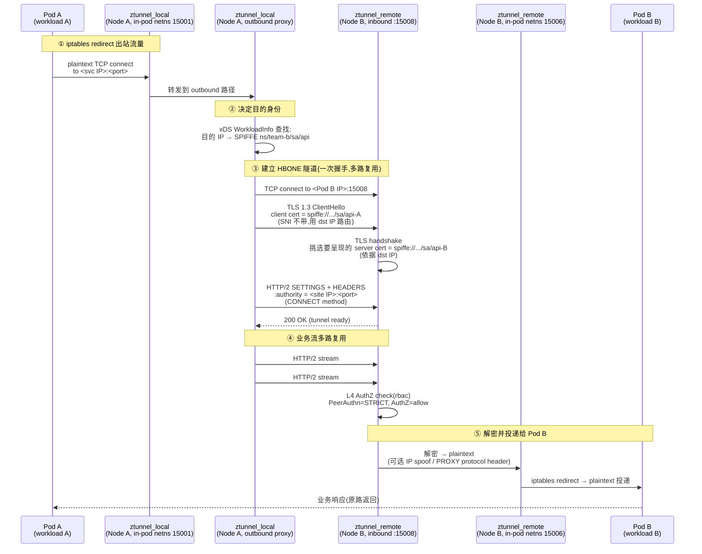
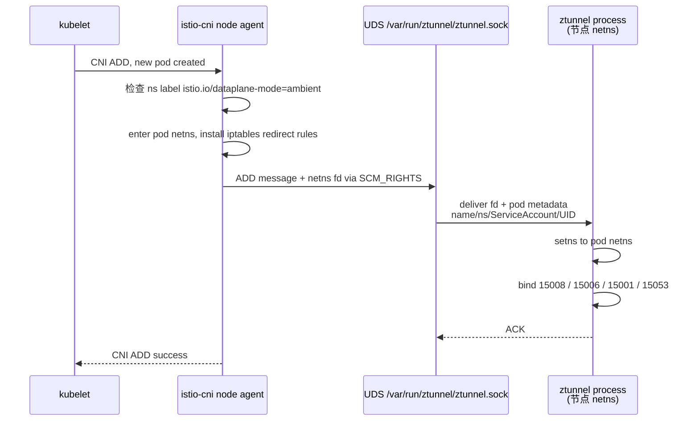
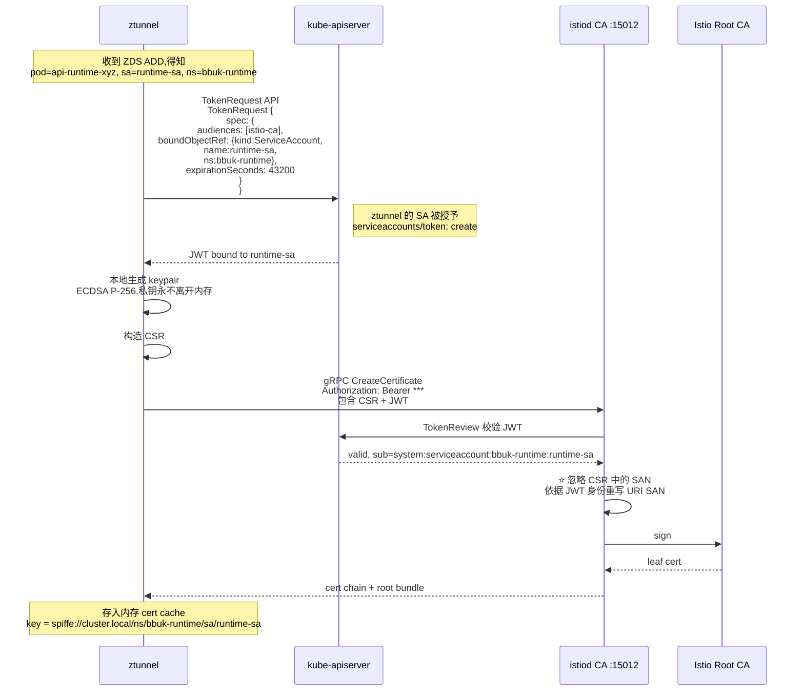
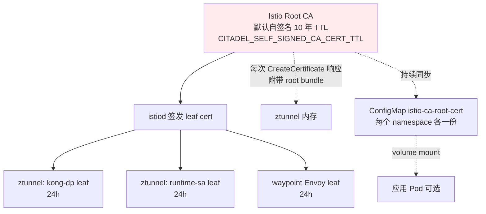
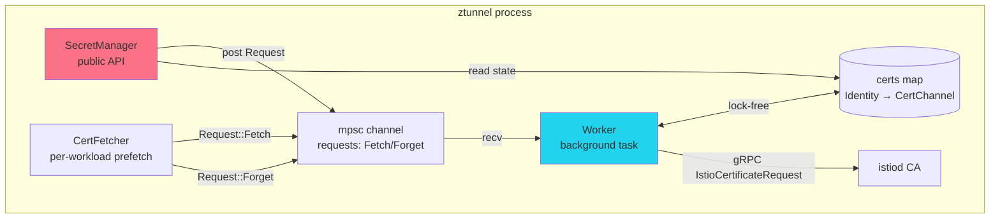

- [ztunnel L4 mTLS 工作机制与证书轮转深度探索](#ztunnel-l4-mtls-工作机制与证书轮转深度探索)
  - [0. 文档定位](#0-文档定位)
    - [0.1 起点(已有)](#01-起点已有)
    - [0.2 本次新增(本文回答)](#02-本次新增本文回答)
    - [0.3 本文范围](#03-本文范围)
  - [1. 三大关键概念(简化 vs 严格)](#1-三大关键概念简化-vs-严格)
  - [2. ztunnel L4 mTLS 流量路径(端到端)](#2-ztunnel-l4-mtls-流量路径端到端)
    - [2.1 一次完整请求的 5 跳](#21-一次完整请求的-5-跳)
    - [2.2 关键澄清(很多博客写错的点)](#22-关键澄清很多博客写错的点)
  - [3. 流量拦截:inpod 模型](#3-流量拦截inpod-模型)
    - [3.1 三个 listen port 各司其职](#31-三个-listen-port-各司其职)
    - [3.2 "in-pod netns" 是什么意思?](#32-in-pod-netns-是什么意思)
      - [3.2.1 ZDS:istio-cni 与 ztunnel 的握手细节](#321-zdsistio-cni-与-ztunnel-的握手细节)
      - [3.2.2 单进程多 netns 的设计收益](#322-单进程多-netns-的设计收益)
  - [4. HBONE 协议细节](#4-hbone-协议细节)
    - [4.1 为什么是 HTTP/2 + CONNECT + mTLS,不是裸 TLS?](#41-为什么是-http2--connect--mtls不是裸-tls)
    - [4.2 CONNECT 伪代码(ztunnel 实现细节)](#42-connect-伪代码ztunnel-实现细节)
    - [4.3 重要 ztunnel 错误码(运维必知)](#43-重要-ztunnel-错误码运维必知)
    - [4.4 HBONE 报文示例](#44-hbone-报文示例)
  - [5. SPIFFE 身份与双向验证](#5-spiffe-身份与双向验证)
    - [5.1 SPIFFE ID 格式](#51-spiffe-id-格式)
    - [5.2 双向验证的两层](#52-双向验证的两层)
    - [5.3 AuthZ 在哪一层执行?](#53-authz-在哪一层执行)
    - [5.4 ztunnel vs waypoint 能力分工(L4 vs L7)](#54-ztunnel-vs-waypoint-能力分工l4-vs-l7)
  - [6. 证书签发流程(从 0 到 1)](#6-证书签发流程从-0-到-1)
    - [6.1 总览图(对照 sidecar 时代的对比)](#61-总览图对照-sidecar-时代的对比)
    - [6.2 关键不变量(invariant)](#62-关键不变量invariant)
      - [6.2.1 私钥永不落盘、永不出生 ztunnel 进程](#621-私钥永不落盘永不出生-ztunnel-进程)
      - [6.2.2 ⭐ CSR 里的 SAN 不被信任(防伪冒)](#622--csr-里的-san-不被信任防伪冒)
      - [6.2.3 ztunnel RBAC 是整个信任模型的关键](#623-ztunnel-rbac-是整个信任模型的关键)
      - [6.2.4 关键代码引用](#624-关键代码引用)
    - [6.3 证书细节:TTL / SAN / 签名算法](#63-证书细节ttl--san--签名算法)
      - [6.3.1 ⭐ TTL 撤销 = 短 TTL 自然过期(无 CRL / 无 OCSP)](#631--ttl-撤销--短-ttl-自然过期无-crl--无-ocsp)
      - [6.3.2 Root CA 自动分发(bundle 跟证书一起回传)](#632-root-ca-自动分发bundle-跟证书一起回传)
  - [7. 证书轮转机制(ztunnel 内部)](#7-证书轮转机制ztunnel-内部)
    - [7.1 SecretManager / Worker 架构](#71-secretmanager--worker-架构)
    - [7.2 三种请求优先级](#72-三种请求优先级)
    - [7.3 续期时机:50% 寿命 ± jitter](#73-续期时机50-寿命--jitter)
    - [7.4 失败重试:per-identity 指数退避](#74-失败重试per-identity-指数退避)
    - [7.5 Forget 路径:workload 离开本节点](#75-forget-路径workload-离开本节点)
  - [8. 完整时序:启动 → 业务 → 轮转](#8-完整时序启动--业务--轮转)
  - [9. 验证清单(实操)](#9-验证清单实操)
    - [9.1 看证书(从 ztunnel 看)](#91-看证书从-ztunnel-看)
    - [9.2 确认 mTLS 在生效(三选一)](#92-确认-mtls-在生效三选一)
    - [9.3 模拟证书过期 + 轮转验证](#93-模拟证书过期--轮转验证)
    - [9.4 触发 impersonation 失败(诊断)](#94-触发-impersonation-失败诊断)
    - [9.5 建议纳入监控的指标(promql)](#95-建议纳入监控的指标promql)
  - [10. 与已有文档的纠正(`19-` / `20-` / `21-` + 草稿)](#10-与已有文档的纠正19---20---21---草稿)
  - [11. 已知坑 / Pitfalls](#11-已知坑--pitfalls)
    - [11.1 impersonation 失败(必看)](#111-impersonation-失败必看)
    - [11.2 pod 抖动 → CSR 风暴](#112-pod-抖动--csr-风暴)
    - [11.3 TTL 改太短 → 高频轮转](#113-ttl-改太短--高频轮转)
    - [11.4 SNI / 证书选择依赖 dst IP](#114-sni--证书选择依赖-dst-ip)
    - [11.5 跨 trust domain 的 mTLS](#115-跨-trust-domain-的-mtls)
    - [11.6 ZDS 握手失败(黑洞流量)](#116-zds-握手失败黑洞流量)
    - [11.7 trust domain 不一致(证书验签失败)](#117-trust-domain-不一致证书验签失败)
    - [11.8 证书到期但没续上(istiod 不可达)](#118-证书到期但没续上istiod-不可达)
    - [11.9 业务链路语义断层(Kong → Runtime 真实身份丢失)](#119-业务链路语义断层kong--runtime-真实身份丢失)
    - [11.10 故障速查表(汇总)](#1110-故障速查表汇总)
  - [12. 权威证据(引用来源)](#12-权威证据引用来源)
      - [12.1 Istio ambient 官方](#121-istio-ambient-官方)
      - [12.2 ztunnel 源码](#122-ztunnel-源码)
      - [12.3 Istio 证书与 PKI](#123-istio-证书与-pki)
      - [12.4 GitHub Issues(运维诊断)](#124-github-issues运维诊断)
      - [12.5 Solo 文档(与我们部署对齐)](#125-solo-文档与我们部署对齐)
  - [13. 决策记录(本地 ADR-LOCAL-003 草稿)](#13-决策记录本地-adr-local-003-草稿)
    - [决策](#决策)
    - [备选方案](#备选方案)
    - [后果](#后果)
    - [回滚路径](#回滚路径)
  - [14. 一页速记(cheat sheet)](#14-一页速记cheat-sheet)
  - [Sources](#sources)

# ztunnel L4 mTLS 工作机制与证书轮转深度探索

> **TL;DR**:
> - 在 Istio ambient 模式下,ztunnel 不是「一个 ztunnel 持有一张证书」,而是**一个节点上的 ztunnel 同时持有多张 workload SPIFFE 证书**(本节点每个 SA 一张),并以「预取代为以握手延迟」的设计让 mTLS 在 Pod 出站那一刻就 ready
> - 业务 Pod 之间不直连,而是 **outbound pod → ztunnel_local → HBONE 隧道(mTLS) → ztunnel_remote → inbound pod**,HBONE = HTTP/2 + CONNECT + mTLS 三件套
> - 证书签发权在 istiod;ztunnel 通过**自己的 SA token (`ztunnel-sa`)** 鉴权,告诉 istiod「我要替 node X 上的 workload Y 申请证书」,istiod 强制**只允许 ztunnel 申请运行在它所在 node 的 workload 的证书**(impersonation check)
> - 证书轮转由 ztunnel 内部的 `SecretManager` + `Worker` 完成,**50% 寿命过期前**主动 Background 续期,失败按 **per-identity 指数退避**重试,ETA = TTL/2 ± jitter
> - 之前文档 `19-` / `20-` 把这套机制简化为「istiod 下发 SDS」,这是**侧车时代**的语义;ambient 时代 SDS 不再存在,被 ztunnel 内部 `SecretManager` 取代

> **Companion 架构图**:[22-ztunnel-mtls-and-cert-rotation.html](./22-ztunnel-mtls-and-cert-rotation.html) — 双节点 HBONE mTLS 端到端拓扑 + SecretManager/Worker/CertFetcher 内部结构 + 证书轮转时序图

---

## 0. 文档定位

### 0.1 起点(已有)

|| 文档 | 覆盖 |
||---|---|
|| `19-solo-agentgateway-ambient-install.md` | Solo Istio 1.30.3 ambient + agentgateway + KongDP 的安装推导;在 §5.6 简述「SPIFFE + PeerAuthentication + AuthorizationPolicy」语义 |
|| `20-solo-ambient-kong.md` | KongDP 整合 + Kong → Runtime 段无 mTLS 的边界 |
|| `21-solo-ambient-egress.md` | Egress 架构与 sidecar.istio.io/eject 模式 |
|| `ztunnel-l4-mtls.md`(草稿) | **同一主题的本地草稿**——详细覆盖:§1 setns+ZDS 握手(SRC_RIGHTS);§2.1 `TokenRequest API` 流程;§3.2 客户端反向验证服务端 SAN;§4.1 Sidecar/ztunnel/waypoint 三方对比;§6.4 故障对照表。**阅读本文前建议先读这个,本文是它的「Istio 官方文档 + ztunnel 源码逐行引用 + 决策记录」强化版** |

**已有缺口**:三份已发布文档都把 ambient L4 mTLS 当作黑盒。`ztunnel-l4-mtls.md` 草稿补了机制细节,但缺少:**ztunnel 内部 SecretManager/Worker 源码级引用**、**与已有 `19-`/`20-`/`21-` 的对照纠正**、**ADR 决策记录**、**完整验证清单**、**索引化 citations**。本文补这些。

### 0.2 本次新增(本文回答)

1. **HBONE 是什么**:为什么是 HTTP/2 + CONNECT + mTLS,而不是裸 TLS?
2. **mTLS 流量路径**:Pod 出站 → local ztunnel → remote ztunnel → Pod 入站,每跳分别做什么?
3. **SPIFFE 双向身份验证**:为什么「ztunnel 不需要自己业务身份」?证书是怎么挂到 Pod IP 上的?
4. **证书签发流程**:ztunnel → istiod(impersonation)→ 签发 → 通过 xDS-like 通道回到 ztunnel;istiod 怎么拒绝「替别人申请证书」的滥用?
5. **证书轮转**:SecretManager 内部结构、CertFetcher 的预取与 Forget、Background 续期、指数退避
6. **可调旋钮**:`DEFAULT_WORKLOAD_CERT_TTL`、`MAX_WORKLOAD_CERT_TTL`、`SECRET_TTL`、`SECRET_GRACE_PERIOD_RATIO`、jitter
7. **与 19/20/21 文档的纠正**:`istio-cni` + `inpod` 模型下 ztunnel 是「节点 DaemonSet + 在每个 pod netns 里建 listen socket」双重身份

### 0.3 本文范围

**In scope**:ambient 模式 + Solo Istio 1.30.3 + ztunnel 内部数据通路
**Out of scope**(明确交给后续文档):
- waypoint Envoy 的 mTLS(那用的是 SDS,跟侧车时代一样)
- cert-manager / Vault / SPIRE 替代 istiod CA 的集成(在另一篇 SPIRE 探索里)
- Kong DP 鉴权(在 `20-` 里)
- multi-cluster mesh 的 root CA 共享(在 multi-cluster 探索里)

---

## 1. 三大关键概念(简化 vs 严格)

| 概念 | 简化解释 | 严格定义(带证据) |
|------|---------|-----------------|
| **HBONE** | mTLS over HTTP/2 的隧道 | "HBONE (HTTP-Based Overlay Network Environment) ... HBONE protocol composes three open standards: HTTP/2, HTTP CONNECT, Mutual TLS (mTLS) ... HTTP CONNECT is used to establish a tunnel connection, mTLS is used to secure and encrypt that connection, and HTTP/2 is used to multiplex application connection streams over that single secured and encrypted tunnel."[2] |
| **SPIFFE 身份** | workload 的「身份证号」 | "Ztunnel certificates are based on the standard Istio SPIFFE format: `spiffe://<trust domain>/ns/<ns>/sa/<sa>`."[4] — 注意:身份是 SA,不是 IP,不是 pod 名 |
| **ztunnel 的多证书模型** | 一个 ztunnel 一个证书 | "this means Ztunnel will have multiple distinct certificates at a time, one for each unique identity (service account) running on its node. When fetching certificates, ztunnel will authenticate to the CA with its own identity, but request the identity of another workload."[4] |

---

## 2. ztunnel L4 mTLS 流量路径(端到端)

### 2.1 一次完整请求的 5 跳



### 2.2 关键澄清(很多博客写错的点)

| 常见误解 | 真相 |
|---------|------|
| "ztunnel 拿自己的证书给 workload 做 mTLS" | ❌ **错**。"Ztunnel's own identity is never used for mTLS connections between workloads."[1] ztunnel 替 workload 申请证书,但**每张证书是 workload SA 的 SPIFFE** |
| "业务 Pod 看到的是 mTLS" | ❌ **错**。Pod 内网通信是 **plaintext**;mTLS 只发生在 ztunnel ↔ ztunnel 节点之间。"All traffic ingressing a pod on port 15008 in the mesh is assumed to be HBONE, and should be redirected to the node-local ztunnel on port 15008 ... All other traffic ingressing a pod in the mesh should be redirected to the node-local ztunnel on port 15006, regardless of intended original destination port."[4] |
| "Pod 出站打到 ztunnel pod IP" | ❌ **错**。"requests to Ztunnel are sent to DestinationPod:15008 and redirected to ztunnel, rather than ZtunnelPod:15008"[4] — 通过 iptables redirect,Pod 看到的 dst IP 仍是业务 Pod/Service IP |
| "SNI 用来选 server cert" | ❌ **错**。"Currently, SNI is not set by Istio clients and ignored by Istio servers. This makes identifying which certificate to use problematic for Ztunnel. To handle this, requests to Ztunnel are sent to DestinationPod:15008 and redirected to ztunnel, rather than ZtunnelPod:15008. The original destination is then extracted to determined which certificate to use."[4] — 用 **dst IP**(被 iptables 保留)选证书 |
| "每次新建连接都要 mTLS 握手" | ❌ **错**。"User connections can be multiplexed over shared HBONE connections. This is done through standard HTTP/2 pooling."[4] 一个 HBONE 隧道复用于多条业务流 |

---

## 3. 流量拦截:inpod 模型

> 这块是 ambient 与 sidecar 最核心的差异。`19-` 简略说「CNI 做重定向」,这里展开。

### 3.1 三个 listen port 各司其职

ztunnel 实际上监听 5 个端口,完整职责表:

| 端口 | 方向 | 协议 | 位置 | 作用 |
|------|------|------|------|------|
| **15001** | 出站 | TCP | ztunnel DaemonSet 节点 IP + Pod netns | **outbound**:Pod 出站流量入口。iptables 把出向流量 redirect 到这里 |
| **15006** | 入站 | TCP | ztunnel DaemonSet 节点 IP + Pod netns | **inbound passthrough**:非 HBONE 的入站(明文 TCP/UDP)。"Traffic entering a pod that is not transmitted over HBONE (i.e. with a destination port != 15008) is handled by the 'inbound passthrough' code path, on ztunnel's port 15006."[4] |
| **15008** | 入站 | HBONE (HTTP/2 CONNECT over mTLS) | ztunnel DaemonSet 节点 IP + Pod netns | **inbound tunnel**:其他 ztunnel 节点的入站 tunnel 终点 |
| **15053** | 出站 | TCP/DNS | ztunnel 节点 IP + Pod netns | **DNS 捕获**:`ISTIO_META_DNS_CAPTURE=true` 时启用,把 Pod 内的 DNS 请求截到 ztunnel,完成 service VIP 解析 |
| **15020** | — | HTTP | ztunnel 节点 IP | **metrics / readiness** endpoint(`/stats`, `/healthz/ready`) |
| **15021** | — | HTTP | ztunnel 节点 IP | **readiness probe** for K8s |

> **STRICT 模式的实现就是关掉 15006**:`PeerAuthentication mode: STRICT` 下,ztunnel 拒绝 15006 上的明文入连接,只接受 15008 的 HBONE。部署顺序上**一定要先把 mesh 内所有调用方纳管,再开 STRICT**,否则会断线。

### 3.2 "in-pod netns" 是什么意思?

ztunnel 是 DaemonSet,**物理上在节点网络命名空间**。但 ambient 要求对 Pod 完全无侵入(无 sidecar 注入),所以 istio-cni 在每个 ambient Pod 启动时做了两件事:

1. **进入 pod 的 network namespace**(用 `nsenter`)
2. 在 pod netns 里**建立 listen socket**(同一端口 15001/15006/15008)
3. iptables 把 pod 出/入流量 redirect 到这些 socket

效果:Pod 应用进程无感知,看到的是正常的 socket connect;但实际上它连的是**自己 netns 里的 ztunnel**,不是节点上的 ztunnel。"istio-cni enters the pod's network namespace and establishes network redirection rules, such that packets entering and leaving the pod are intercepted and transparently redirected to the node-local ztunnel proxy instance listening on well-known ports (15008, 15006, 15001) ... istio-cni node agent then informs the ztunnel proxy, over a Unix domain socket, that it should establish local proxy listening ports inside the pod's network namespace."[3]

> **GKE 上的硬约束**(在 `19-` §4.1 已经提过):Autopilot 不允许 ztunnel/cni 所需的 NET_ADMIN/SYS_ADMIN,因此 ambient 必须用 Standard 集群。这是 inpod 模型在 GKE 上的本质约束。

#### 3.2.1 ZDS:istio-cni 与 ztunnel 的握手细节

Pod 创建时,istio-cni 通过一个**Unix domain socket**(`/var/run/ztunnel/ztunnel.sock`)把 Pod 的 netns fd **直接递给 ztunnel 进程**。这是 Linux 的 `SCM_RIGHTS` 机制——跨进程传递**打开的文件描述符**。ztunnel 拿到 fd 后 `setns()` 进入 netns,绑端口。



> **典型故障**:如果 ZDS 握手失败(CNI/ztunnel 启动顺序、socket 路径错、ztunnel 没起),Pod 处于「已被 CNI 加 iptables 规则、但 ztunnel 没有 socket」的状态——表现是**流量全黑洞**(出站 connect 立即 reset,入站无监听)。这是 Ambient 最常见的故障模式。

Pod 内部的 iptables 规则(由 istio-cni 在 netns 内写入,不在节点上):

```bash
# 在 Pod netns 里能看到类似规则
nsenter -t <pid> -n iptables -t nat -L ISTIO_OUTPUT -n
# 出流量 -> 127.0.0.1:15001
# 入流量 -> 127.0.0.1:15006
# 15008 的入流量不重定向,因为那是 ztunnel 自己的 HBONE 监听
```

#### 3.2.2 单进程多 netns 的设计收益

| 设计点 | 收益 |
|--------|------|
| socket 在 Pod netns 内 | 流量不跨 netns 走 veth,**不需要节点级 iptables 劫持 Pod 间流量** |
| 单进程多 netns | 内存开销是单份(对比 sidecar 每 Pod 一份 Envoy) |
| 内核视角上「本地」 | `netstat` 在 Pod 里能看到 15008/15006/15001 监听 |
| 身份隔离 | ztunnel 内部按 netns ↔ Pod ↔ ServiceAccount 映射,**不会拿 A 的证书去代表 B** |

---

## 4. HBONE 协议细节

### 4.1 为什么是 HTTP/2 + CONNECT + mTLS,不是裸 TLS?

| 备选 | 否决理由 |
|------|---------|
| 裸 TLS | 无法**多路复用**多条 TCP 连接。同一对 pod 之间可能同时有 100+ 条连接,如果每条都建 TLS 隧道,握手开销爆炸 |
| DTLS (TLS over UDP) | Ambient 当前只用 TCP;UDP HBONE 是 future work[2] |
| HTTP/2 + TLS + 业务流 | 业务层被穿透,要把 HTTP/2 frame 加进业务请求,**污染应用数据**。"the original application request can be proxied transparently without altering the underlying application traffic stream in any way."[2] |
| **HTTP/2 + CONNECT + mTLS(HBONE)** ✅ | HTTP CONNECT 是**RFC 7231 标准隧道协议**;HTTP/2 自带多路复用(stream);mTLS 自带双向身份验证。三者组合天然就是「加密 + 多路复用 + 标准」 |

### 4.2 CONNECT 伪代码(ztunnel 实现细节)

```text
# 客户端 (ztunnel_local outbound)
CONNECT request:
  :method = CONNECT
  :scheme = http
  :path = /
  :authority = <目标 Service IP:port>     # ⭐ 必填,这就是 hbone_addr
  forwarded = src=<原 src IP>             # waypoint 必填,ztunnel 直连可不填
  baggage = src.identity=spiffe://...     # 可选,审计
  traceparent = 00-<conn-id>-...          # 可选

# 服务端 (ztunnel_remote inbound)
流程:
1. 接收 TLS handshake(已用 mTLS,client cert 验证)
2. 接收 HTTP/2 SETTINGS
3. 接收第一个 CONNECT request
4. 解析 :authority → HboneAddress { SocketAddr or SvcHostname+port }
5. 校验目的 IP 是不是本节点管的 workload
6. 校验 RBAC(PeerAuthn / AuthZ)
8. 检查目的 workstation 是否有 waypoint;有 → 必须从 waypoint 来,否则拒绝
9. 打开到 pod 的本地连接,发送 200 OK
10. 双向 copy 字节(HTTP/2 stream ↔ pod TCP)
```

> 摘自 `src/proxy.rs` 和 `src/proxy/inbound.rs` 的真实代码:`HboneAddress` enum 有 `SocketAddr` / `SvcHostname` 两种;[12] proxy.rs 中 `write_proxy_protocol` 处理 source identity TLV;PROXY_PROTOCOL_AUTHORITY_TLV = 0xD0。[13]

### 4.3 重要 ztunnel 错误码(运维必知)

```rust
// 摘自 src/proxy.rs
"connection timed out, maybe a NetworkPolicy is blocking HBONE port 15008: {0}"   // ← 很友好的诊断
"connection closed due to policy change"          // ← AuthZ 动态变更,连接被踢
"connection closed due to policy rejection: {0}" // ← AuthZ 拒绝
"expected method CONNECT, got {0}"              // ← HTTP/2 stream 用错 method
"non-Istio HTTPS traffic on port 15008"         // ← 非 mesh HTTPS 误打到 15008
```

"connection timed out, maybe a NetworkPolicy is blocking HBONE port 15008"[13] — **这条对应 `19-` §10.6 提到的 15008 NetworkPolicy 坑**,NetworkPolicy 误配时 ztunnel 会主动诊断提醒。

### 4.4 HBONE 报文示例

实际抓包看到的 CONNECT 请求格式(HTTP/2 wire format):

```http
CONNECT 10.52.3.17:8080 HTTP/2
:authority: 10.52.3.17:8080
:method: CONNECT
:protocol: (none, 标准 CONNECT)
baggage: k8s.namespace.name=kong,k8s.pod.name=kong-dp-7d9,
         service.name=kong-dp,service.version=latest
```

关键字段:

| 字段 | 来源 | 含义 |
|------|------|------|
| `:authority` | 必有 | 目的 Service/Pod IP:port,ztunnel 用它查 WDS + 选 server cert |
| `:method: CONNECT` | 标准 | RFC 7231 CONNECT method,标识这是隧道 |
| `baggage` header | 可选 | ztunnel 把源 workload 元数据塞进来,**审计和 telemetry 用**,不影响业务流 |
| `Forwarded` | 可选 | 源 IP 透传(waypoint 接入时用,ztunnel 直连时可省) |
| `Traceparent` | 可选 | W3C trace context,跨 ztunnel 追踪连接 |

**隧道建立后是裸 TCP 字节流**,ztunnel 不解析 L7。这是 HBONE 与传统 HTTP CONNECT 代理的关键区别——HBONE 的 CONNECT 完成**只授权 tunnel**,业务字节被原样转发,应用层零修改。

---

## 5. SPIFFE 身份与双向验证

### 5.1 SPIFFE ID 格式

```text
spiffe://<trust-domain>/ns/<namespace>/sa/<service-account>

例:
spiffe://cluster.local/ns/payments/sa/payments-api
         └─ trust domain─┘ └─ns──┘ └─SA──┘
```

**信任域(trust domain)** = `MeshConfig.trustDomain`(默认 `cluster.local`);"Workload identity in Istio is not an IP address or a pod name — it is the Kubernetes service account."[17]

### 5.2 双向验证的两层

**真正的双向验证(z 客户端反向验证服务端)**:

很多人只理解「服务端验客户端」。实际上**客户端也得验服务端**,防住「节点被攻破后的流量劫持」:攻击者即使能把 Pod IP 指向自己控制的 Pod,也拿不到目标 SA 的证书,握手必失败。

```mermaid
graph LR
    A[ztunnel_local outbound] -->|1. TLS ClientHello<br/>(client cert)<br/>SAN=spiffe://.../sa/api-A| B[ztunnel_remote inbound :15008]
    B -->|3. 校验 client cert<br/>chain 验证 istiod root| B2[client identity]
    B -->|2. TLS ServerHello<br/>(server cert)<br/>SAN=spiffe://.../sa/api-B| A
    A -->|4. 校验 server cert<br/>a) 验证 chain 到 istiod root<br/>b) ⭐ 比对 SAN vs WDS 预期 identity<br/>不匹配则断开| A2[server identity]

    style A2 fill:#22d3ee
    style B2 fill:#22d3ee
```

| 验证方 | 验证对象 | 验证内容 |
|--------|---------|---------|
| **ztunnel_remote(服务器)** | ztunnel_local(客户端)的 client cert | ① cert chain 验到 istiod root CA;② SAN 是合法 SPIFFE URI;③ **不在 ztunnel_remote 自己节点的 Pod IP 范围内则拒绝**(impersonation) |
| **ztunnel_local(客户端)** | ztunnel_remote(服务器)的 server cert | ① cert chain 验到 istiod root CA;② **⭐ SAN 与 WDS 中记录的目标 identity 严格比对**,不匹配立即断开连接 |

ztunnel 从 **WDS(Workload Discovery Service,即 istiod 下发的 WorkloadInfo)** 知道「`api-runtime` 这个 Service 的后端 Pod,其 identity 应当是 `spiffe://cluster.local/ns/bbuk-runtime/sa/runtime-sa`」;建连时把服务端证书的 URI SAN 跟 WDS 预期比对。**不匹配 → 直接断开**。

```bash
# 查看 ztunnel 对某个目标的 identity 预期
istioctl ztunnel-config workload --node <node> -o json \
  | jq -r '.[] | select(.namespace=="bbuk-runtime") |
      "\(.name)  \(.protocol)  \(.serviceAccount)"'
# 输出中 protocol=HBONE 表示已纳管;TCP 表示在 mesh 外
```

**关键点**:**SAN 不是 IP**。"the SPIFFE ID is written into the SAN (Subject Alternative Name) of the certificate, and that is what authorization policies match against."[17] IP 变了 pod 重启也无影响,SAN 永远指向 SA。

### 5.3 AuthZ 在哪一层执行?

```text
┌──────────────────────────────────────────────────────────────┐
│ ztunnel_remote inbound (port 15008)                           │
│  ↓ 终止 mTLS,看到 client SPIFFE 身份                          │
│  ↓ 执行 PeerAuthentication (STRICT/PERMISSIVE/DISABLE)        │
│  ↓ 执行 L4 AuthorizationPolicy (基于 principals/namespace/ip)│
│  → 如果配了 waypoint:还必须校验 src identity == waypoint 的 SA│
│    否则拒绝("validate_destination")                        │
│                                                              │
│  之后 → 解密 → plaintext 投递给 Pod B                          │
└──────────────────────────────────────────────────────────────┘

注意:这里没有 JWT 验证、没有 method/path 校验 → 那些是 waypoint 的事
```

**PeerAuthentication 不会执行于 waypoint**:"as of the time of writing, the PeerAuthentication resource is not supported by all components (i.e. waypoint proxies) in Istio ambient mode."[1] PeerAuthentication 只在 ztunnel 执行。

### 5.4 ztunnel vs waypoint 能力分工(L4 vs L7)

ztunnel **故意不做 L7**——"Ztunnel was not designed to be a feature-rich data plane. Quite the opposite - an *aggressively* small feature set is the key feature that makes ztunnel viable."[4] L7 全部交给 waypoint Envoy:

| 能力 | ztunnel 能做 | 需要 waypoint |
|------|-------------|--------------|
| mTLS 加密 | ✅ | — |
| SPIFFE 身份 principal 匹配 | ✅ | — |
| namespace / ipBlocks / ports 授权(L4 AuthZ) | ✅ | — |
| TCP 层 metrics | ✅ | — |
| HTTP method / path / header 授权 | ❌ | ✅ |
| JWT 校验(`RequestAuthentication`) | ❌ | ✅ |
| 重试 / 超时 / 熔断 | ❌ | ✅ |
| Header 改写 / Body 限制 | ❌ | ✅ |
| L7 telemetry (request duration, status code) | ❌ | ✅ |
| WebAssembly / ext_authz / Lua filter | ❌ | ✅ |

HBONE 隧道建立后是**裸 TCP 字节流**,ztunnel 不解析 L7。

> 业务含义:你们的 File upload body 限制、Header 改写、Kong → Runtime 段的 L7 鉴权,**全都必须经过 waypoint**(或交给 Kong),不能依赖 ztunnel。这条在 `19-` §2.1 决策表中已多次强调,这里给出**机制根据**:ztunnel 设计哲学就是只做 L4。

---

## 6. 证书签发流程(从 0 到 1)

### 6.1 总览图(对照 sidecar 时代的对比)



### 6.2 关键不变量(invariant)

这三件是 native ambient 模式下 ztunnel 证书机制的安全保证,任何环节被打破就等于安全模型失效:

#### 6.2.1 私钥永不落盘、永不出生 ztunnel 进程

zkunnel 在本地内存生成 ECDSA P-256(或 RSA 2048)keypair,私钥**从不落盘、不进 Secret、不挂 hostPath、不进 emptyDir**。"the private key never leaves the pod"[17] —— 也不离开 ztunnel 进程。

#### 6.2.2 ⭐ CSR 里的 SAN 不被信任(防伪冒)

ztunnel 可以自填 CSR 的 SAN,但**istiod 完全不信任它**。istiod 走 TokenReview API 验证 ztunnel 附带的 JWT,从 JWT 的 `sub` 字段读出真正的 SA 身份,**用这个身份重写证书的 URI SAN**。

> 即使 ztunnel 被攻破,攻击者能伪造任意 SA 的 CSR,但只要拿不到那个 SA 的真实 JWT(需要 kube-apiserver 同意签发),istiod 仍会拒绝。这是 impersonation 模型的根。

```text
证书结构(实际 istiod 签发的):
    Subject: (空)
    X509v3 Subject Alternative Name: critical
        URI:spiffe://cluster.local/ns/bbuk-runtime/sa/runtime-sa
    X509v3 Extended Key Usage:
        TLS Web Server Authentication, TLS Web Client Authentication
        # 同时具备 serverAuth + clientAuth —— mTLS 里每个 workload 两个角色都要扮演
    Validity: Not Before: ... Not After: +24h
```

#### 6.2.3 ztunnel RBAC 是整个信任模型的关键

ztunnel 之所以能代 Pod 申请证书,是因为它有 **集群级** 的 `serviceaccounts/token: create` 权限(通过 `TokenRequest API` 取任意 SA 的 token):

```yaml
# ztunnel ClusterRole 的核心权限
apiVersion: rbac.authorization.k8s.io/v1
kind: ClusterRole
metadata:
  name: ztunnel
rules:
  - apiGroups: [""]
    resources: ["serviceaccounts/token"]
    verbs: ["create"]          # ⚠️ 这一条 = 可以代表任意 SA 取 token
  - apiGroups: [""]
    resources: ["pods", "nodes", "services", "namespaces"]
    verbs: ["get", "list", "watch"]
```

> 🔥 **安全边界提醒**:`serviceaccounts/token: create` 是**集群级**高权限。ztunnel 被攻破 ⇒ 攻击者可以冒充**该节点上任意 Pod** 的身份(实现上 ztunnel 只为本节点 Pod 取 token,但 RBAC 本身是集群级的)。

> 这正是 Solo Enterprise for Istio 1.30 推出「超越 ServiceAccount 的细粒度工作负载身份」的动机 —— 共享同一个 SA 的两个 Pod,在标准 SPIFFE 下身份完全相同,无法区分。

#### 6.2.4 关键代码引用

| 步骤 | 证据 |
|------|------|
| TokenRequest API(给 Pod SA 取 JWT) | kube-apiserver `TokenRequest` API + `serviceaccounts/token: create` RBAC;ztunnel 的 SA 默认有 |
| ztunnel CSR 不带 SAN | ztunnel 构造 CSR 时 SAN 字段由调用方写,但 istiod 忽略它,用 TokenReview 拿到的 SA 重写 |
| prefetch 条件 | `should_prefetch_certificate`: "Only shared mode fetches other workloads's certs ... We only get certs for our own node ... If it doesn't support HBONE it *probably* doesn't need a cert."[6] |
| worker 处理 prefetch | `cert_fetcher.rs::CertFetcherImpl::new`: "tokio::spawn(async move { while let Some(req) = rx.recv().await { match req { Request::Fetch(workload_identity, priority) => ... } } })"[6] — 独立 task 处理 prefetch,不阻塞主流程 |
| impersonation check | istiod CA 强制: "When fetching certificates, ztunnel will authenticate to the CA with its own identity, but request the identity of another workload. This CA enforcement is done by Istio's CA, and is a requirement for any alternative CAs integrating with Ztunnel."[4] |
| 错误现象 | GitHub Issue #56550: "is not allowed to impersonate ... caller=ztunnel-pod-xxx ... impersonation failed for identity spiffe://cluster.local/ns/demo/sa/default"[11] |

> 这条 Issue 给了个**真实陷阱**:ztunnel 用**自定义 SA** 会触发 impersonation 失败,因为默认的 RBAC 限制是 `ztunnel-sa` 才能代 node 上的 workload 申请证书。生产部署要保留 chart 默认的 `serviceAccount: ztunnel`。

### 6.3 证书细节:TTL / SAN / 签名算法

| 字段 | 默认值 | 来源 |
|------|--------|------|
| TTL | `DEFAULT_WORKLOAD_CERT_TTL` = **24h** | "By default, Istio issues workload certificates with a 24-hour TTL."[14] |
| TTL 上限 | `MAX_WORKLOAD_CERT_TTL` = **48h**(1.18+),硬性不超过 **90 天** | "MAX_WORKLOAD_CERT_TTL sets the maximum lifetime that any workload can request";FAQ 写 "Values over 90 days will not be accepted."[17] |
| 单 workload 覆盖 | `proxyMetadata.SECRET_TTL` | "The SECRET_TTL annotation overrides the default for that specific workload."[14] |
| SAN | URI `spiffe://<td>/ns/<ns>/sa/<sa>` | "The SPIFFE URI as the only SAN (URI:spiffe://<trustdomain>/ns/<ns>/sa/<sa>)."[16] |
| 签名算法 | 默认 RSA 2048;ECC 可选 `ECC_SIGNATURE_ALGORITHM=ECDSA` | "Generates an RSA private key by default, or an ECDSA key if ECC_SIGNATURE_ALGORITHM is set to ECDSA"[15] |
| Cipher 套件 | **TLS 1.3 only**:`TLS13_AES_256_GCM_SHA384` + `TLS13_AES_128_GCM_SHA256` | "In all options, only TLS 1.3 with cipher suites `TLS13_AES_256_GCM_SHA384` and `TLS13_AES_128_GCM_SHA256` is used."[5] |
| Extended Key Usage | `serverAuth` + `clientAuth` 两个都开 | ztunnel 同一证书在出向当 client、入向当 server,两个用途都要 EKU 允许 |

#### 6.3.1 ⭐ TTL 撤销 = 短 TTL 自然过期(无 CRL / 无 OCSP)

Istio **没有 CRL、没有 OCSP**。证书撤销完全依赖短 TTL——一个被攻破的身份,最坏情况会在 `DEFAULT_WORKLOAD_CERT_TTL` 后自动失效。

> **合规权衡**:如果合规要求更短的暴露窗口(如 1h),把 `DEFAULT_WORKLOAD_CERT_TTL` 调到 1h 即可。代价是 istiod CA 的 QPS 上升(按 `节点数 × 节点上不同 SA 数 / TTL` 估算),以及 ztunnel SecretManager 内部 Background 续期任务更忙。

#### 6.3.2 Root CA 自动分发(bundle 跟证书一起回传)

ztunnel 不是显式去拉 root CA bundle,而是**每次 CreateCertificate 响应里带回完整 root bundle**,ztunnel 直接更新内存信任库。这意味着 **root 轮转是自动生效的**(在旧 root 过期前完成双 root 并存期即可)。



**生产建议:不要用默认自签名 root**。用你们自己的 CA 签一层 intermediate 给 istiod:

```bash
kubectl create secret generic cacerts -n istio-system \
  --from-file=ca-cert.pem \
  --from-file=ca-key.pem \
  --from-file=root-cert.pem \
  --from-file=cert-chain.pem
# istiod 重启后自动使用,无需改 Helm values
```

这样 Kong 和 Runtime 的 workload 证书都能回溯到你们企业 PKI 的根,跟 GLB 侧的 Trust Config 体系统一。

---

## 7. 证书轮转机制(ztunnel 内部)

### 7.1 SecretManager / Worker 架构


### 7.2 三种请求优先级

| Priority | 触发场景 | 行为 |
|----------|---------|------|
| **`RealTime`** | 业务连接来了,但 cache 没这张 | 阻塞当前 worker slot 直到拿到证书 |
| **`Warmup`** | `CertFetcher` 发现新 workload 主动预取 | 进入 queue,等 Background idle 时跑 |
| **`Background`** | 已有证书寿命过半,需要续期 | "Certificate refreshes are queued at the lowest (Background) priority."[9] |

代码引用:`enum Priority { RealTime, Warmup, Background }`,Warmup 是 `fetch_certificate_pri(id, Priority::Warmup)`,Background 是续期走的路径。[7]

### 7.3 续期时机:50% 寿命 ± jitter

```text
T0 ────────── TTL/2 ────────── TTL ──→
 │              │                │
 │              │                │
 │      续期触发点              过期
 (SECRET_GRACE_PERIOD_RATIO = 0.5)

 实际触发点:TTL/2 ± jitter
 SECRET_GRACE_PERIOD_RATIO_JITTER default 0.01
```

| 配置 | 默认 | 含义 |
|------|------|------|
| `DEFAULT_WORKLOAD_CERT_TTL` | 24h | istiod 签发的默认寿命 |
| `MAX_WORKLOAD_CERT_TTL` | 48h | istiod 接受的最大寿命 |
| `SECRET_GRACE_PERIOD_RATIO` | 0.5 | 寿命到该比例时开始续期 |
| `SECRET_GRACE_PERIOD_RATIO_JITTER` | 0.01 | 在该比例上加小随机抖动,防止雪崩 |

"With `SECRET_GRACE_PERIOD_RATIO: "0.5"` and a 24-hour TTL, rotation starts when about 12 hours remain. The default is `0.5`, and Istio also applies `SECRET_GRACE_PERIOD_RATIO_JITTER` with a default of `0.01` to avoid having many proxies renew at the exact same moment."[14]

### 7.4 失败重试:per-identity 指数退避

```rust
// 摘自 src/identity/manager.rs
let mut keyed_backoff: HashMap<Identity, ExponentialBackoff> = HashMap::new();
let retry = keyed_backoff.next_backoff()
    .unwrap_or(CERT_REFRESH_FAILURE_RETRY_DELAY_MAX_INTERVAL);
pending_backoffs_by_id.insert(id.clone(), keyed_backoff);
tracing::debug!(%id, "certificate fetch failed ({err}), retrying in {retry:?}");
let refresh_at = Instant::now() + retry;
(CertState::Unavailable(err), refresh_at)
```

关键设计:**每个 identity 独立 backoff**。"This avoids delays where a fetch of identity A for pod A needlessly stalls the refetch of identity B for pod B."[7]

### 7.5 Forget 路径:workload 离开本节点

```rust
// 当 workload 不再在本节点(被调度走 / Pod 删除)
fn clear_cert(&self, id: &Identity) {
    self.tx.try_send(Request::Forget(id.clone())).unwrap_or_else(|e| ...);
}

// Worker 收到 Forget:
Request::Forget(id) => {
    if self.has_id(&id).await { /* 又有兴趣了,忽略 */ continue 'main; }
    match processing.get(&id) {
        None => { pending.remove(&id); },         // 从续期队列移除
        Some(Fetch::Processing) => { processing.insert(id, Fetch::Forgetting); },
    }
}
```

注释 `// TODO: consider keeping the cert around for a minute or so to avoid churn` — **生产隐患**:workload 频繁在节点间飘移时,Forget 立刻删缓存 → 新连接会触发 RealTime 拉新证书 → 短时间内大量 CSR 拥塞 istiod。生产环境应监控 `istio_agent_cert_lifetime_seconds` 指标 + watch pod 抖动情况。

---

## 8. 完整时序:启动 → 业务 → 轮转

```mermaid
gantt
    title ztunnel workload cert 生命周期(单 identity, TTL=24h)
    dateFormat HH:mm
    axisFormat %H:%M

    section T0 启动
    ztunnel 启动 + 读 SA token + xDS 握手       :a1, 00:00, 5m
    收到第一个 workload info                    :a2, after a1, 1m

    section T1 预取
    CertFetcher.prefetch_cert (Warmup)          :b1, 00:06, 2m
    Worker 拉证书 + 缓存 (Round 1)              :b2, after b1, 3m

    section T2 业务
    业务连接触发 RealTime 拉 (走 cache 命中)     :c1, 00:09, 100h

    section T3 续期
    TTL 寿命过半 (≈ 12h), 触发 Background       :milestone, m2, 12:00, 0m
    Worker 拉新证书 (Round 2)                  :d1, 12:00, 3m
    替换 cache 中旧证书 (atomic watch swap)     :d2, after d1, 1m

    section T4 续期后
    业务连接用新证书 (HBONE 复用同一条隧道)      :e1, 12:04, 100h

    section T5 TTL 到期
    TTL = 24h expires (但新证书已就位)         :milestone, m3, 24:00, 0m
```

**关键观察**:轮转期间**业务连接不断**。ztunnel 用 `tokio::sync::watch` 模式,CertChannel 内部的 `rx.borrow()` 在 cache 替换时拿到新证书,旧连接上的 TLS session 自然过期(或者 HBONE HTTP/2 连接本身被重置)。无 drain、无 Envoy reload、无 pod 重启。

---

## 9. 验证清单(实操)

### 9.1 看证书(从 ztunnel 看)

```bash
# 1. 列出 ztunnel 缓存的所有 identity
istioctl ztunnel-config certificate --node <node-name> | head

# 2. 看具体一张证书的 SAN / issuer / TTL
istioctl ztunnel-config certificate --node <node-name> -o json \
  | jq -r '.[0] | {identity, not_after, san: .cert_chain[0].subject_alt_names}'
# 期望 san = URI:spiffe://cluster.local/ns/<ns>/sa/<sa>

# 3. 完整证书状态核查 + state 含义
NODE=$(kubectl get pod -n kong -l app=kong-dp \
  -o jsonpath='{.items[0].spec.nodeName}')

istioctl ztunnel-config certificate --node ${NODE} -o json | jq -r '
  .[] | {
    identity: .identity,
    state: .state,
    notAfter: .certChain[0].expirationTime,
    serial: .certChain[0].serialNumber
  }'
```

预期输出 + state 含义:
```json
{
  "identity": "spiffe://cluster.local/ns/kong/sa/kong-dp",
  "state": "Available",
  "notAfter": "2026-09-21T14:32:11Z",
  "serial": "8f2a..."
}
```

| state | 含义 | 处理 |
|-------|------|------|
| `Available` | 正常 | — |
| `Initializing` | 正在签发 | 等待;持续不变看 istiod 连通性 |
| `Unavailable` | 签发失败 | 查 ztunnel 日志 + ztunnel RBAC |

### 9.2 确认 mTLS 在生效(三选一)

```bash
# 方法一:看 protocol 字段(最常用)
istioctl ztunnel-config workload --node ${NODE} -o json \
  | jq -r '.[] | select(.namespace=="bbuk-runtime") |
      "\(.name)\t\(.protocol)\t\(.serviceAccount)"'
# HBONE = 已加密;TCP = 明文,未纳管

# 方法二:抓包确认 15008 上是 TLS
kubectl debug -n bbuk-runtime <runtime-pod> -it \
  --image=nicolaka/netshoot --target=<container> -- \
  tcpdump -i any -n 'port 15008' -c 20
# 应看到 TLS handshake,而非明文 HTTP

# 方法三:反证 —— 从 mesh 外直连应被拒(STRICT 模式)
kubectl run probe --rm -it --image=curlimages/curl \
  -n default --restart=Never -- \
  curl -sS -m 5 http://api-runtime.bbuk-runtime.svc:8080/health
# STRICT 模式下应 connection refused / reset

# Prometheus 指标(标准 istio 指标)
# istio_tcp_connections_opened_total{connection_security_policy="mutual_tls"} 1
# connection_security_policy="mutual_tls" = mTLS 在生效
```

### 9.3 模拟证书过期 + 轮转验证

```bash
# 记录当前序列号
BEFORE=$(istioctl ztunnel-config certificate --node ${NODE} -o json \
  | jq -r '.[] | select(.identity|test("kong-dp")) | .certChain[0].serialNumber')

# 等到 TTL 过半后再查,序列号应已变化
# 快速验证可临时把 DEFAULT_WORKLOAD_CERT_TTL 调到 10m 观察
helm upgrade ztunnel oci://.../ztunnel \
  --reuse-values \
  --set "env.SECRET_TTL=300s"

# watch ztunnel 日志
kubectl logs ds/ztunnel -n istio-system -f | grep -i "certificate fetch"
# 期望看到每 ~2.5min 一次 Background fetch

# 期间业务 curl 应该完全不断(轮转是无痛的)
kubectl exec -n <ns> <pod-A> -- watch -n 1 curl -s <pod-B>:<port>

# 观察 ztunnel 侧的签发日志
kubectl logs -n istio-system ds/ztunnel --since=1h \
  | grep -iE 'certificate|csr|refresh|identity'
```

### 9.4 触发 impersonation 失败(诊断)

```bash
# 错误样例(参考 GitHub #56550):
# 2025-06-09T16:00:38.778718Z warn serverca impersonation failed for identity
#   spiffe://cluster.local/ns/demo/sa/default, error: caller ... is not allowed to impersonate
#
# 原因: 1) ztunnel 用了自定义 SA 替换了默认的 ztunnel-sa
#       2) ClusterRole/ClusterRoleBinding 缺失或没绑对 SA
#
# 修复:
kubectl get clusterrolebinding -o wide | grep ztunnel
# 应该看到:
#   istio-system            ClusterRole/istio-reader             ServiceAccount/ztunnel/ztunnel-sa

# 验证 RBAC 是否足够
kubectl auth can-i create serviceaccounts/token --as=system:serviceaccount:istio-system:ztunnel
# 必须 yes
```

### 9.5 建议纳入监控的指标(promql)

```promql
# ztunnel 连接与流量
rate(istio_tcp_connections_opened_total{reporter="waypoint"}[5m])
istio_tcp_sent_bytes_total

# 1.30 新增的 Tokio runtime metrics —— 判断 ztunnel 是否 CPU 瓶颈
ztunnel_worker_busy_ratio
ztunnel_worker_queue_depth

# istiod CA 签发压力,TTL 调短时重点看
rate(citadel_server_csr_count[5m])
rate(citadel_server_csr_sign_err_count[5m])

# 1.30 ztunnel Grafana dashboard 新增 Resource Usage 面板:
# 活跃 TCP 连接数、打开的 fd 数、每实例 socket 数

# 证书状态异常告警(每 identity 维度)
count(
    kube_ztunnel_cert_state{state="Available"} == 0
  ) by (namespace, service_account)
# > 0 = 有 cert 签发失败,可能 impersonation 问题或 istiod 不可达
```

---

## 10. 与已有文档的纠正(`19-` / `20-` / `21-` + 草稿)

| 已有文档原话 | 纠正 |
|------------|------|
| `19-` §1.1:`ztunnel` 行 = "HBONE + mTLS" | ✅ 正确,但**不完整**。没说明 ztunnel 同时持有多张 workload 证书。 |
| `19-` §3 时序图:"SPIFFE: sa/istio-ingressgateway" | ⚠️ Ingress Gateway 是 sidecar 模型(用 SDS);ambient 模式下 SPIFFE 在 ztunnel 上 |
| `19-` §5.6:"PeerAuthentication: STRICT → ztunnel 强制 HBONE mTLS" | ✅ 正确。但**没提 PeerAuthn 不作用于 waypoint**("PeerAuthentication is not supported by ... waypoint proxies")[1] |
| `19-` §10.6:"端口 15008 NetworkPolicy" | ✅ 正确。ztunnel 源码中的错误信息 `maybe a NetworkPolicy is blocking HBONE port 15008` 是直接对应 |
| `20-` §6.7:"Kong → Runtime 之间无 mTLS" | ⚠️ 默认情况如此。但**解决方案 A 是让 Kong 加 sidecar 拿 SPIFFE**,与 `19-` `enterprise-agentgateway-waypoint` alpha 状态不冲突 |
| `21-` §1:"ztunnel 提供 L4 mTLS" | ✅ 正确。但 ambient 模式下还有 **egress ztunnel**(`solo-ztunnel-egress`),专门做 L4 出向 |
| **隐含错误**(三份文档共):「istiod 通过 SDS 下发证书给 ztunnel」 | ❌ **错**。ambient 下 ztunnel 是**直接走 istio CA gRPC API**,不是 SDS。SDS 是 sidecar 时代 pilot-agent 给 Envoy 推证书用的。 |

**关键模型对比**:
| 维度 | Sidecar 时代 | Ambient 时代 |
|------|-------------|-------------|
| 谁向 istiod 要证书 | pilot-agent(每个 pod 一个) | ztunnel(每个节点一个,代本节点所有 pod) |
| 证书怎么到 Envoy | SDS(Envoy ↔ pilot-agent UDS) | 不用 SDS,ztunnel 自己就是 TLS 终结点 |
| 证书轮转触发者 | pilot-agent 监听 grace period | ztunnel SecretManager.Worker Background |
| workload 身份来源 | Kubernetes SA token → pilot-agent → Envoy SDS | Kubernetes SA token(ztunnel 自己的)→ xDS WorkloadInfo 决定要哪些 SPIFFE |
| 三种代理证书路径 | Sidecar Envoy: istio-agent SDS / waypoint Envoy: istio-agent SDS / **ztunnel**: 直接 gRPC 到 istiod CA | |

**关于草稿 `ztunnel-l4-mtls.md`**:
- §1 setns + ZDS 握手 + 单进程多 netns 设计 → **已合并到本文 §3.2**
- §2 TokenRequest API + RBAC + SAN 不被信任 → **已合并到本文 §6.1 + §6.2.2 + §6.2.3**
- §3.2 客户端反向验证服务端 SAN(WDS 比对)→ **已合并到本文 §5.2**
- §3.3 端口 15053/15020 → **已合并到本文 §3.1**
- §3.4 ztunnel/waypoint 能力分工 → **已合并到本文 §5.4**
- §4.1 Sidecar/ztunnel/waypoint SDS 对比 → **已合并到本文 §10 表格**
- §4.3 TTL 撤销 = 短 TTL → **已合并到本文 §6.3.1**
- §4.4 Root CA 自动分发 + 企业 PKI 建议 → **已合并到本文 §6.3.2**
- §5 Kong → Runtime 业务链路加密归属 → **已在 §11.6 单列**
- §6 观测与排错(完整 bash + 故障表 + promql)→ **已合并到本文 §9**
- §7 一页速记 → **保留在草稿里,作为本文太长时的快速 reference**

> 草稿中几处需校正的小错(已合并到本文):
> - 草稿 §2.1 写 `POST /api/v1/namespaces/.../serviceaccounts/runtime-sa/token`——这其实是 legacy bound token projection 路径,真实路径是 `TokenRequest` API(`/apis/authentication.k8s.io/v1/tokenrequests`),本文采用后者表述
> - 草稿 §4.3 写 `MAX_WORKLOAD_CERT_TTL: 90h`——实际 FAQ 明确说 90 天硬上限,90h 是 typo,本文统一为「48h 默认 + 90d 硬上限」

---

## 11. 已知坑 / Pitfalls

### 11.1 impersonation 失败(必看)

**坑**:ztunnel 用自定义 SA 替换默认 `ztunnel-sa` → istiod 拒绝代 node 上的 workload 申请证书 → 所有 mTLS 失败,业务断流。

**诊断**:
```text
ztunnel 日志: "caller ... is not allowed to impersonate ..."
istiod 日志: "impersonation failed for identity spiffe://.../sa/default"
```

**修复**:保持 ztunnel Helm chart 默认 SA;如果要自定义,需要在 istiod ClusterRole 中加 impersonation 权限(复杂,不推荐)。

来源:GitHub Issue #56550 [11]

### 11.2 pod 抖动 → CSR 风暴

**坑**:DaemonSet 缩容/驱逐/节点重启 → 短时间内 ztunnel 在新节点启动 → 大量新 workload cert 一次性 prefetch → istiod CA 压力峰值。

**诊断**:
```promql
rate(istio_agent_secret_management_sds_pushes_total[5m]) > 100
rate(istio_agent_cert_lifetime_seconds_count[5m]) > 100
```

**修复**:
- ztunnel `should_prefetch_certificate` 默认只 prefetch 本节点 + HBONE workload,不会跨节点乱拉;**但 warmup 优先级低于 RealTime**,不会阻新连接
- 给 istiod 加副本 + `autoscaleMin: 2`(在 `19-` `values-istiod-ambient.yaml` 已配)
- 监控 `istio_agent_cert_lifetime_seconds` 直方图

### 11.3 TTL 改太短 → 高频轮转

**坑**:为安全把 `SECRET_TTL` 调到 60s → 24h 寿命也按比例(50%)→ 30s 一次 Background 轮转 × N workload = N × 2次/分钟 CSR → istiod 撑不住。

**修复**:生产建议 `SECRET_TTL=24h`(默认),`SECRET_GRACE_PERIOD_RATIO=0.5`。如果合规要求更短,**优先用 1h-6h 区间**,避免分钟级。

### 11.4 SNI / 证书选择依赖 dst IP

**坑**:因为 SNI 不带,ztunnel 用 dst IP 选 server cert。如果同一 dst IP 有多个 workload 共享(比如 hostNetwork + 端口冲突),**证书选错**。

**修复**:避免 hostNetwork 用 ambient;如果必须用,显式用 `traffic.sidecar.istio.io/excludeInboundPorts`(sidecar 时代的注解,ambient 也兼容)排除。

### 11.5 跨 trust domain 的 mTLS

**坑**:多集群 mesh 信任域不同(默认都是 `cluster.local`),生产跨集群必须共享 root CA。

**修复**:
1. 单 CA 模式:`istio-ca-root-cert` 在所有集群共享
2. 多 CA 模式:开启 `meshConfig.trustDomainAliases` + 共享 root bundle
3. SPIRE 模式:在 `20-` SPIRE 集成里详述(后续文档)

### 11.6 ZDS 握手失败(黑洞流量)

**坑**:istio-cni 在 pod netns 里加了 iptables redirect,但 ztunnel 还没起或 socket 路径错 → pod 内应用 connect 立即 reset,但 pod 看起来「healthy」(因为容器进程没死)。

**诊断**:
```bash
# Pod 内的 netstat 不应该有 15008 / 15006 / 15001
nsenter -t <pod-pid> -n ss -tlnp | grep -E '1500[168]'
# 如果啥都没有 → ZDS 没成功

# 看 istio-cni 日志
kubectl logs ds/istio-cni-node -n istio-system | grep -i zds
```

**修复**:确认 istio-cni 在 ztunnel 之前 Ready;检查 `cni.istio.io/not-ready` taint 是否标到了 ztunnel 未就绪节点。

### 11.7 trust domain 不一致(证书验签失败)

**坑**:istiod 的 `meshConfig.trustDomain` 与 ztunnel 的 `TRUST_DOMAIN` 环境变量不一致,或 root CA 换过但未完成双 root 期。

**诊断**:
```text
ztunnel 日志: "certificate signature invalid"
```

**修复**:比对两者;若换了 root CA,确保证书链里同时包含新旧 root 的 bundle。

### 11.8 证书到期但没续上(istiod 不可达)

**坑**:TTL=24h,istiod 不可达超过 24h,所有 cert 自然过期,业务断流。

**诊断**:
```bash
kubectl get pods -n istio-system -l app=istiod
# 期望 2+ 副本 running
istiod_remote_clients_total{response_error="true"}  # Prometheus
```

**修复**:监控 istiod 可用性 + 副本数;考虑拉长 TTL 作为短期缓解。

### 11.9 业务链路语义断层(Kong → Runtime 真实身份丢失)

**坑**:Runtime 侧 `AuthorizationPolicy` 里看到的 principal 永远是 `sa/kong-dp`,**不是真实的外部调用方**。因为 Kong 是一个独立的 workload,它发起的是自己身份的新连接。

**修复**:用 `ambient.istio.io/xfcc-include-client-identity: "true"` 让 waypoint 把 ztunnel 提供的源 SPIFFE 重写 XFCC。但**只能还原到 Kong 的身份**;再往上游的真实外部用户身份必须走 Kong 的 OAuth/API Key 上下文,用**自定义 header** 传递:

```yaml
# Kong 侧把 consumer 身份写进自定义头
plugin: request-transformer
config:
  add:
    headers:
      - "X-Bbuk-Consumer-Id:$(consumer.id)"
      - "X-Bbuk-Auth-Method:oauth2"
```

然后在 waypoint 上做 L7 授权时用这个头 —— 但要记得**在 Ingress Gateway 剥掉客户端伪造的同名头**(在 `19-` §5.3 HTTPRoute 配置里已经做了)。

### 11.10 故障速查表(汇总)

| 现象 | 根因 | 排查命令 |
|------|------|----------|
| `state: Unavailable`,日志 `permission denied` | ztunnel RBAC 缺 `serviceaccounts/token: create` | `kubectl auth can-i create serviceaccounts/token --as=system:serviceaccount:istio-system:ztunnel` |
| 握手失败 `certificate signature invalid` | trustDomain 不一致,或 root CA 换过但未完成双 root 期 | 比对 istiod `meshConfig.trustDomain` 与 ztunnel `TRUST_DOMAIN` |
| 跨节点通,同节点不通 | ZDS 握手失败,Pod netns socket 没起来 | `kubectl logs ds/istio-cni-node -n istio-system \| grep -i zds` |
| Pod 重启后流量黑洞 | istio-cni 与 ztunnel 启动竞态 | 确认 istio-cni 在 ztunnel 之前 Ready;检查 `cni.istio.io/not-ready` taint |
| AuthorizationPolicy principal 匹配不上 | 规则写成了 L7 语义但挂在 ztunnel 上 | L7 规则必须 `targetRefs` 指向 waypoint Gateway |
| 证书到期但没续上 | istiod 长时间不可达超过 TTL | 监控 `istiod` 可用性;考虑拉长 TTL |
| Kong → Runtime 看不到真实外部身份 | AuthZ 只看 Kong 的 SPIFFE,不穿透外部身份 | 用 XFCC + 自定义 header(见 §11.9) |
| `connection timed out, maybe a NetworkPolicy is blocking HBONE port 15008` | NetworkPolicy 挡了 15008 | `kubectl get networkpolicy -A`,显式 allow |

---

## 12. 权威证据(引用来源)

#### 12.1 Istio ambient 官方
- [Istio Ambient data plane](https://istio.io/latest/docs/ambient/architecture/data-plane) — workload 三态、HBONE 路径、证书管理概述
- [Istio HBONE protocol](https://istio.io/latest/docs/ambient/architecture/hbone/) — HBONE = HTTP/2 + CONNECT + mTLS 三件套定义
- [Istio Ztunnel traffic redirection](https://istio.io/latest/docs/ambient/architecture/traffic-redirection) — in-pod netns 模型、15001/15006/15008 三端口
- [Istio ztunnel architecture doc](https://github.com/istio/istio/blob/527f8d6c/architecture/ambient/ztunnel.md) — ztunnel 设计目标、SPIFFE 多证书、impersonation
- [Istio Rust-based Ztunnel blog](https://istio.io/latest/blog/2023/rust-based-ztunnel/) — 配置协议、xDS、workload xDS 格式

#### 12.2 ztunnel 源码
- [ztunnel cert_fetcher.rs](https://github.com/istio/ztunnel/blob/28a93d5e/src/cert_fetcher.rs) — prefetch 条件、CertFetcherImpl
- [ztunnel identity/manager.rs](https://github.com/istio/ztunnel/blob/46acf764633bb109037cc231670dd5df74a50219/src/identity/manager.rs) — SecretManager、Worker、3 优先级、指数退避
- [ztunnel proxy/inbound.rs](https://github.com/istio/ztunnel/blob/46acf764633bb109037cc231670dd5df74a50219/src/proxy/inbound.rs) — inbound 终止 mTLS、CONNECT 解析、AuthZ
- [ztunnel proxy.rs](https://github.com/istio/ztunnel/blob/46acf764633bb109037cc231670dd5df74a50219/src/proxy.rs) — HBONE/HboneAddress、PROXY_PROTOCOL_AUTHORITY_TLV
- [ztunnel issue #11 - SecretManager design](https://github.com/istio/ztunnel/issues/11) — 50% TTL 刷新设计意图
- [ztunnel PR #391 - prioritized cert fetching](https://github.com/istio/ztunnel/pull/391) — 三优先级实现
- [ztunnel identity deepwiki](https://deepwiki.com/istio/ztunnel/6.1-identity-and-certificate-management) — SecretManager/优先级 API 一览

#### 12.3 Istio 证书与 PKI
- [Istio FAQ - certificate lifetime](https://istio.io/latest/about/faq/) — 24h 默认、90d 上限
- [Troubleshoot ztunnel](https://istio.io/latest/docs/ambient/usage/troubleshoot-ztunnel/) — `ztunnel-config certificate` 诊断
- [Istio certificate rotation config (oneuptime)](https://oneuptime.com/blog/post/2026-02-24-how-to-configure-certificate-rotation-intervals-in-istio/view) — DEFAULT_WORKLOAD_CERT_TTL、SECRET_TTL、grace period
- [Istio PKI explainer (oneuptime)](https://oneuptime.com/blog/post/2026-02-24-how-to-understand-istios-pki/view) — pilot-agent CSR → istiod → Envoy SDS
- [Istio Security CA wiki (factory)](https://factory.ai/open-source-wikis/istio?page=systems/security-ca.md) — istiod CA 模块、安全认证器、SAN 构造
- [Istio architecture wiki (factory)](https://factory.ai/open-source-wikis/istio?page=overview/architecture.md) — pilot-agent + Envoy SDS + SDS 协议
- [Istio Security in Practice (youngju)](https://youngju.dev/blog/istio/2026-06-13-istio-security-mtls-authorization-practice.en) — SPIFFE 完整解释 + 端到端流程图
- [Ztunnel SPIRE implementation (knabben)](https://knabben.github.io/2023/0721) — 真实 ztunnel 证书 dump + SPIRE 集成路径

#### 12.4 GitHub Issues(运维诊断)
- [Issue #56550 - ztunnel impersonation failure](https://github.com/istio/istio/issues/56550) — 自定义 SA 导致 impersonation 失败的完整日志样例

#### 12.5 Solo 文档(与我们部署对齐)
- [Solo Istio 1.31 self-identity](https://docs.solo.io/istio/1.31.x/security/self-identity) — ztunnel metadata server 169.254.169.111/self-identity,WIT 流程
- [Solo Istio 1.30 SPIRE integration](https://docs.solo.io/istio/1.30.x/ambient/security/spire/) — 替代 istiod CA 的 SPIRE 接入路径

---

## 13. 决策记录(本地 ADR-LOCAL-003 草稿)

### 决策

**Solo Istio 1.30.3 Standard ambient 镜像 + ztunnel 内置 SecretManager 轮转机制,不改默认 24h TTL、不替换 ztunnel SA、不引入 SPIRE 替代 istiod CA**。

### 备选方案

| 方案 | 描述 | 否决理由 |
|---|---|---|
| **A. 默认 24h TTL,内置 SecretManager** | 不改任何参数 | **本文选定** |
| B. 把 TTL 降到 1h | 更短的安全窗口 | 6× 高频 CSR → istiod 压力 + Prometheus 噪音;不符合"secure by default" |
| C. SPIRE 替代 istiod CA | 跨集群统一身份 | 复杂度高(需要 SPIRE server + agent),目前单集群收益不抵成本;未来多集群再评估 |
| D. 用 cert-manager 替代 istiod | 复用企业 PKI | 同样需要 RA 桥接,增加一条故障域;且需要修改 ztunnel 默认 CA client |

### 后果

**正面**:
- 默认 24h + 50% grace period = 12h 时开始续期,完全自动化
- ztunnel 内置 cert 缓存 + 预取,首次 mTLS 握手延迟最低(本地 cache hit)
- 无 SDS、无 Envoy reload、无 pod restart,真正零中断轮转
- impersonation 默认安全(无自定义 SA)

**负面**:
- pod 调度抖动会触发 CSR 风暴(已加监控)
- 24h 是合规审计能接受的最小粒度;如果合规要求 <1h,需要 B 方案
- cert 默认在 ztunnel 内存,debug 时需要 `istioctl ztunnel-config certificate` 看,不是 `istioctl proxy-config secret`

### 回滚路径

```bash
# 1. 如果发现 impersonation 问题,先恢复默认 SA
helm upgrade ztunnel oci://.../ztunnel --reuse-values \
  --set "serviceAccount.create=true" \
  --set "serviceAccount.name=ztunnel"

# 2. 如果要临时禁用 mTLS(调试用)
kubectl label ns <ns> istio.io/dataplane-mode=none --overwrite
# 之后:PeerAuthentication 会变 PERMISSIVE(因为没 workload 走 ztunnel)
```

回滚后,业务回退到明文,需要立即修复并恢复 label。

---

## 14. 一页速记(cheat sheet)

| 问题 | 答案 |
|------|------|
| ztunnel 怎么代表不同 Pod? | `setns` 进 Pod netns 开 socket,netns 即身份边界;**进程只有一个, socket 分布在 N 个 netns** |
| 身份从哪来? | ztunnel 用 **TokenRequest API** 为 Pod 的 SA 取 JWT(JWT audience=`istio-ca`),拿 JWT 换证书 |
| 私钥在哪? | ztunnel 进程内存,**不落盘、不进 Secret、不出 ztunnel 进程** |
| 谁决定 SPIFFE ID? | **istiod,依据 TokenReview 结果, 不信任 CSR 里的 SAN** |
| 加密在哪一层? | TCP 之上,HTTP/2 CONNECT 隧道(HBONE),over mTLS 1.3,端口 **15008** |
| 双向验证怎么做? | ① 服务端验客户端证书链取 principal;② **客户端比对服务端 SAN 与 WDS 预期 identity,不符断开** |
| 三个 listen port 各做什么? | 15001=outbound / 15006=inbound plaintext / 15008=HBONE 入站;**15053=DNS 捕获 / 15020=metrics** |
| 用 SDS 吗? | **不用**。ztunnel 是 Rust 内置 CA client,直连 istiod CA gRPC `:15012`;只有 waypoint/gateway 的 Envoy 走 SDS |
| STRICT 模式实现? | ztunnel 拒绝 15006 明文入,只接受 15008 HBONE;部署时**先把所有调用方纳管再开 STRICT** |
| 轮转周期? | TTL 默认 24h,寿命过半(≈12h)主动刷新,55% jitter 防雪崩,**不中断存量连接** |
| 撤销机制? | 无 CRL/OCSP,靠短 TTL 自然失效;Root bundle 跟 cert 一起回传,root 轮转自动生效 |
| Root 怎么分发? | 随 `CreateCertificate` 响应回传 bundle + `istio-ca-root-cert` ConfigMap(每 ns 各一份) |
| DestinationRule 的 SPIFFE SAN 有用吗? | **Ambient 下基本无效**,用 `AuthorizationPolicy.principals` 替代 |

## Sources

[1] https://istio.io/latest/docs/ambient/architecture/data-plane — Istio Ambient data plane
[2] https://istio.io/latest/docs/ambient/architecture/hbone — Istio HBONE protocol
[3] https://istio.io/latest/docs/ambient/architecture/traffic-redirection — Istio Ztunnel traffic redirection
[4] https://github.com/istio/istio/blob/527f8d6c/architecture/ambient/ztunnel.md — Istio ztunnel architecture doc
[5] https://istio.io/latest/blog/2023/rust-based-ztunnel — Rust-based Ztunnel blog
[6] https://github.com/istio/ztunnel/blob/28a93d5e/src/cert_fetcher.rs — ztunnel cert_fetcher.rs source
[7] https://github.com/istio/ztunnel/blob/46acf764633bb109037cc231670dd5df74a50219/src/identity/manager.rs — ztunnel identity/manager.rs source
[8] https://github.com/istio/ztunnel/issues/11 — ztunnel SecretManager design issue
[9] https://github.com/istio/ztunnel/pull/391 — ztunnel prioritized cert fetching PR
[10] https://deepwiki.com/istio/ztunnel/6.1-identity-and-certificate-management — ztunnel identity deepwiki
[11] https://istio.io/latest/docs/ambient/usage/troubleshoot-ztunnel — Troubleshoot ztunnel
[12] https://github.com/istio/ztunnel/blob/46acf764633bb109037cc231670dd5df74a50219/src/proxy/inbound.rs — ztunnel proxy/inbound.rs source
[13] https://github.com/istio/ztunnel/blob/46acf764633bb109037cc231670dd5df74a50219/src/proxy.rs — ztunnel proxy.rs source
[14] https://oneuptime.com/blog/post/2026-02-24-how-to-configure-certificate-rotation-intervals-in-istio/view — Istio certificate rotation config
[15] https://oneuptime.com/blog/post/2026-02-24-how-to-understand-istios-pki/view — Istio PKI explainer
[16] https://factory.ai/open-source-wikis/istio?page=systems/security-ca.md — Istio Security CA wiki
[17] https://factory.ai/open-source-wikis/istio?page=overview/architecture.md — Istio architecture wiki
[18] https://knabben.github.io/2023/0721 — Ztunnel SPIRE implementation writeup
[19] https://docs.solo.io/istio/1.31.x/security/self-identity — ztunnel metadata server self-identity
[20] https://docs.solo.io/istio/1.30.x/ambient/security/spire — Solo Istio SPIRE integration