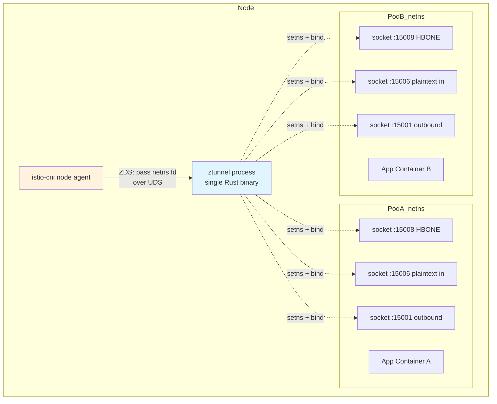
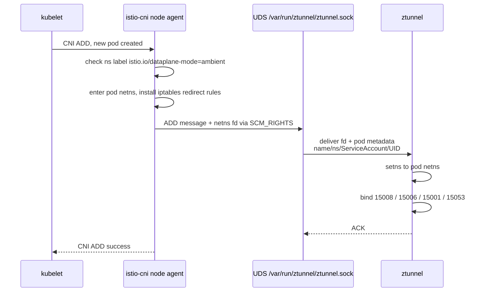
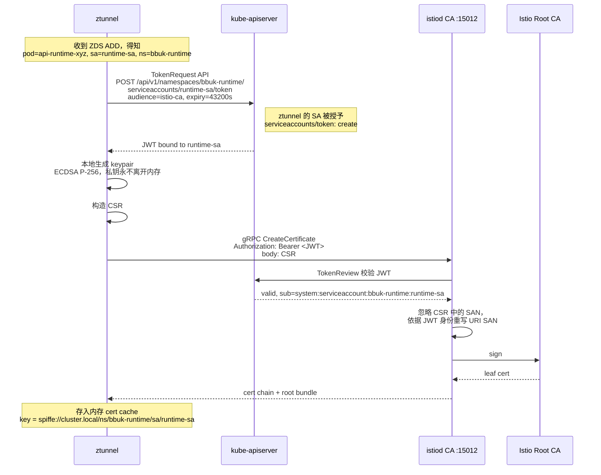
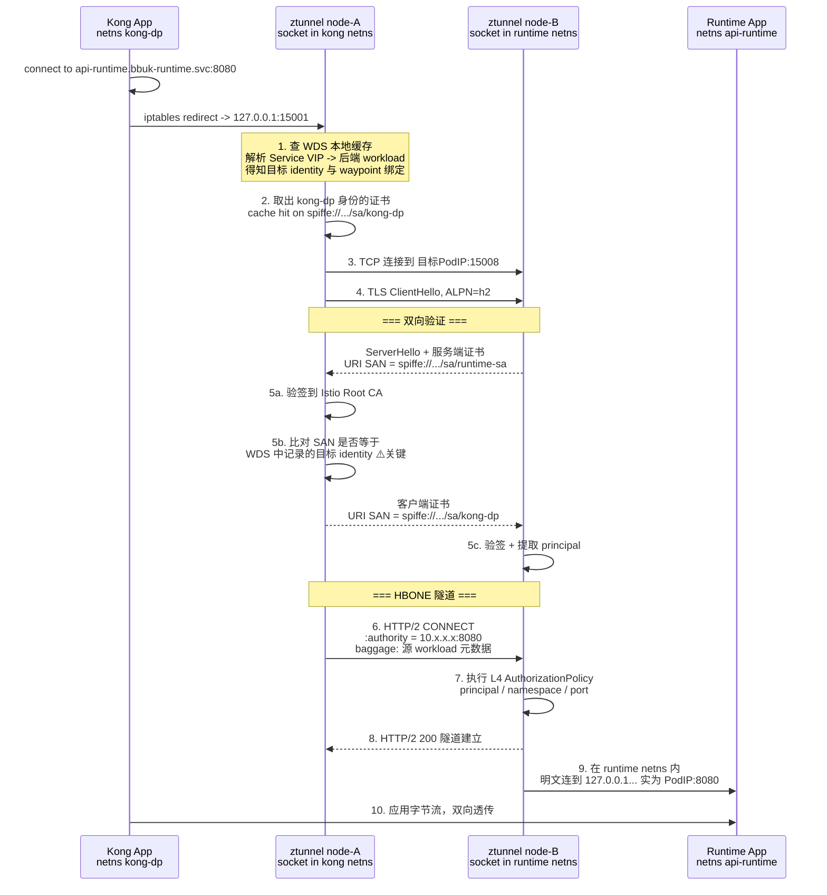
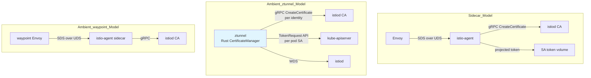
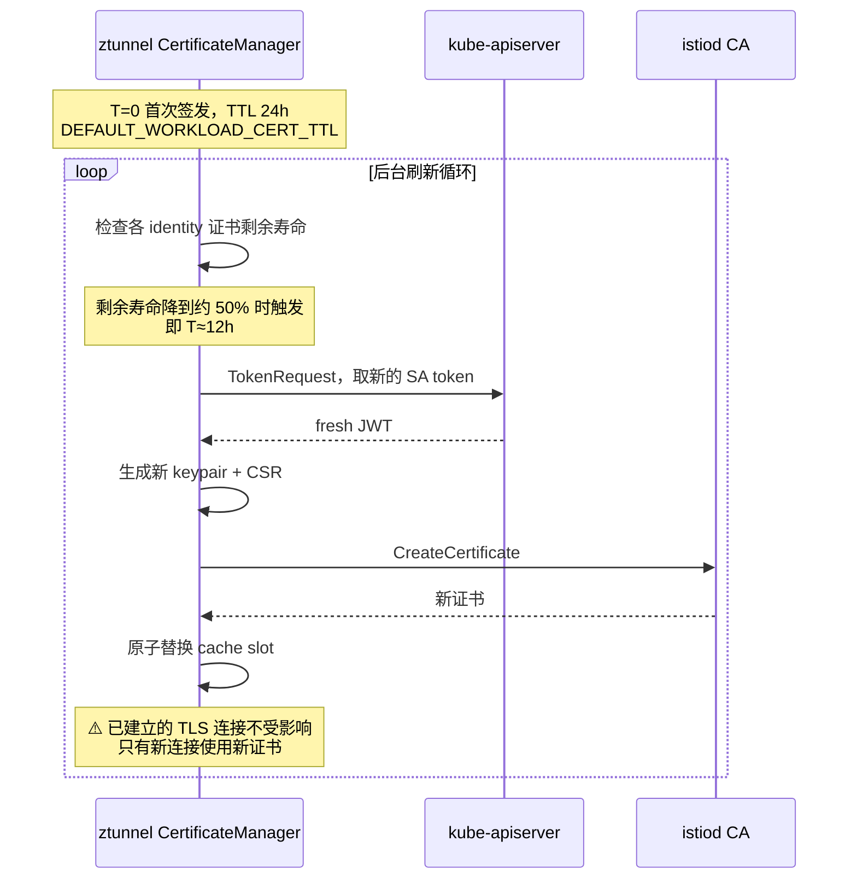
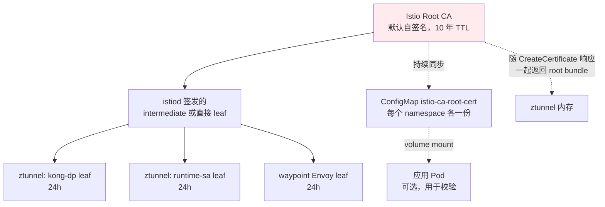
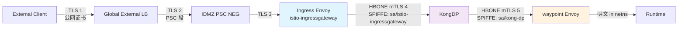

# ztunnel 的 L4 mTLS 与证书生命周期详解

> ⚠️ **本文档状态:早期草稿,内容已合并到正式文档**
>
> 本文(`ztunnel-l4-mtls.md`)的 **20 个关键内容点**已合并到正式文档
> **[`22-ztunnel-mtls-and-cert-rotation.md`](./22-ztunnel-mtls-and-cert-rotation.md)**。
>
> **推荐以 22- 为准**——它有完整 TOC、grounded citations(Istio 官方 + ztunnel 源码引用)、ADR 决策记录、companion 架构图。
>
> 本文档保留作为**早期视角快照**和**快速 reference**,不在此继续维护。
> 若发现本文与 22- 冲突,**以 22- 为准**。
>
> 内容映射:
>
> | 本文(草稿) | 22-(正式) |
> |------------|-----------|
> | §1 setns + ZDS 握手 | → 22- §3.2.1 |
> | §2 TokenRequest API + RBAC | → 22- §6.1, §6.2.2, §6.2.3 |
> | §3.1 流量时序 | → 22- §2.1 |
> | §3.2 客户端反向验服务端 | → 22- §5.2 |
> | §3.3 端口职责表 | → 22- §3.1 |
> | §3.4 HBONE 报文 + 能力分工 | → 22- §4.4, §5.4 |
> | §4.1 三种代理 SDS 对比 | → 22- §10 |
> | §4.2 轮转时序 | → 22- §7 + §8 |
> | §4.3 关键参数 + 短 TTL 撤销 | → 22- §6.3.1 |
> | §4.4 Root CA 自动分发 | → 22- §6.3.2 |
> | §5 Kong→Runtime 业务链路 | → 22- §11.9 |
> | §6.1 证书状态核查 | → 22- §9.1 |
> | §6.2 轮转验证 | → 22- §9.3 |
> | §6.3 mTLS 验证 | → 22- §9.2 |
> | §6.4 故障对照 | → 22- §11.10 |
> | §6.5 监控 promql | → 22- §9.5 |
> | §7 一页速记 | → 22- §14 |

## 1. 核心认知纠正：ztunnel 不是「一个共享代理」

这是理解整个机制的钥匙。很多人以为 ztunnel 是节点上一个共享进程，所有 Pod 流量都汇聚进去 —— 这样就会有个致命问题：**它怎么代表不同 Pod 的身份？**

答案是 ztunnel **通过 `setns` 进入每个 Pod 的 network namespace，在里面创建监听 socket**。进程只有一个，但 socket 分布在 N 个 netns 里。



**为什么这样设计：**

| 设计点 | 收益 |
|--------|------|
| socket 在 Pod netns 内 | 流量不跨 netns 走 veth，**不需要节点级 iptables 劫持 Pod 间流量** |
| 单进程多 netns | 内存开销是单份（对比 sidecar 每 Pod 一份 Envoy） |
| 内核视角上「本地」 | `netstat` 在 Pod 里能看到 15008/15006/15001 监听 |
| 身份隔离 | ztunnel 内部按 netns ↔ Pod ↔ ServiceAccount 映射，**不会拿 A 的证书去代表 B** |

### 1.1 ZDS：istio-cni 与 ztunnel 的握手



> `SCM_RIGHTS` 是 Unix domain socket 传递**文件描述符**的机制。istio-cni 把 netns 的 fd 直接「递」给 ztunnel 进程，ztunnel 拿到就能 `setns()`。这是整个 Ambient 数据面的物理基础。
>
> 如果 ZDS 握手失败，Pod 会一直处于「已被 CNI 加规则、但 ztunnel 没有 socket」的状态 —— 表现就是**流量全黑洞**。这是 Ambient 最典型的故障模式。

Pod 内部的 iptables 规则（由 istio-cni 在 netns 内写入，不在节点上）：

```bash
# 在 Pod netns 里能看到类似规则
nsenter -t <pid> -n iptables -t nat -L ISTIO_OUTPUT -n
# 出流量 -> 127.0.0.1:15001
# 入流量 -> 127.0.0.1:15006
# 15008 的入流量不重定向，因为那是 ztunnel 自己的 HBONE 监听
```

---

## 2. 身份从哪来：ztunnel 如何代表 Pod 拿到 SPIFFE 证书

这是最反直觉的一环。**ztunnel 用自己的特权，为 Pod 的 ServiceAccount 申请证书。**

### 2.1 完整的证书签发链路



**几个必须理解的点：**

1. **私钥从不落盘、从不出 ztunnel 进程。** 没有 Secret、没有 hostPath、没有 emptyDir。
2. **CSR 里的 SAN 不被信任。** istiod 完全依据 TokenReview 返回的 SA 身份来填 URI SAN，所以即使 ztunnel 被攻破也无法自己「声明」任意身份 —— 它必须先能拿到对应 SA 的 token。
3. **ztunnel 的 RBAC 是整个信任模型的关键：**

```yaml
# ztunnel ClusterRole 的核心权限
apiVersion: rbac.authorization.k8s.io/v1
kind: ClusterRole
metadata:
  name: ztunnel
rules:
  - apiGroups: [""]
    resources: ["serviceaccounts/token"]
    verbs: ["create"]          # ⚠️ 这一条 = 可以代表任意 SA 取 token
  - apiGroups: [""]
    resources: ["pods", "nodes", "services", "namespaces"]
    verbs: ["get", "list", "watch"]
```

> 🔥 **安全边界提醒**：`serviceaccounts/token: create` 是集群级高权限。ztunnel 被攻破 ⇒ 攻击者可以冒充**该节点上任意 Pod** 的身份（实现上 ztunnel 只为本节点 Pod 取 token，但 RBAC 本身是集群级的）。
>
> 这正是 Solo Enterprise for Istio 1.30 推出「超越 ServiceAccount 的细粒度工作负载身份」的动机 —— 共享同一个 SA 的两个 Pod，在标准 SPIFFE 下身份完全相同，无法区分。如果你们的 Runtime 有多个 Pod 共享 SA 且需要区分，这是需要单独评估的点。

### 2.2 SPIFFE ID 的构成

```text
spiffe://cluster.local/ns/bbuk-runtime/sa/runtime-sa
        └─trust domain─┘ └──ns──────┘ └────sa─────┘
```

对应到 X.509：

```bash
# 证书结构
Subject: (空)
X509v3 Subject Alternative Name: critical
    URI:spiffe://cluster.local/ns/bbuk-runtime/sa/runtime-sa
X509v3 Extended Key Usage:
    TLS Web Server Authentication, TLS Web Client Authentication
    # 同时具备 serverAuth + clientAuth —— 因为 mTLS 里每个 workload 两个角色都要扮演
Validity: Not Before: ... Not After: +24h
```

**注意 SPIFFE ID 只到 ServiceAccount 粒度**，不含 Pod 名、不含 Node。所以：

```yaml
# ✅ 这样可行
principals: ["cluster.local/ns/kong/sa/kong-dp"]

# ❌ 这样不可行，SPIFFE ID 里没有 pod 信息
principals: ["cluster.local/ns/kong/sa/kong-dp/pod/kong-dp-abc123"]
```

---

## 3. mTLS Traffic Flow：一次完整的 Pod 到 Pod 调用

以你们的 `KongDP → Runtime` 为例（假设不过 waypoint，纯 L4）。

### 3.1 时序全景



### 3.2 第 5b 步是双向验证的精髓

很多人只理解「服务端验客户端」。实际上 **客户端也在验服务端身份是否符合预期**：

- ztunnel 从 **WDS（Workload Discovery Service）** 知道「`api-runtime` 这个 Service 的后端 Pod，其 identity 应当是 `spiffe://cluster.local/ns/bbuk-runtime/sa/runtime-sa`」
- 建连时比对服务端证书的 URI SAN
- **不匹配 → 直接断开**

这防住了什么？**节点被攻破后的流量劫持**。攻击者即使能把 Pod IP 指向自己控制的 Pod，也拿不到目标 SA 的证书，握手必失败。

```bash
# 查看 ztunnel 对某个目标的 identity 预期
istioctl ztunnel-config workload --node <node> -o json \
  | jq -r '.[] | select(.namespace=="bbuk-runtime") |
      "\(.name)  \(.protocol)  \(.serviceAccount)"'
# 输出中 protocol=HBONE 表示已纳管；TCP 表示在 mesh 外
```

### 3.3 端口职责表

| 端口 | 方向 | 用途 | 加密 |
|------|------|------|------|
| `15001` | 出站 | 应用出流量被 iptables 重定向到这里 | 明文（netns 内） |
| `15006` | 入站 | **明文**入流量，PERMISSIVE 模式或 mesh 外调用方 | 明文 |
| `15008` | 入站 | **HBONE** 入流量，mesh 内 mTLS | mTLS |
| `15053` | 出站 | DNS 捕获，`ISTIO_META_DNS_CAPTURE=true` 时启用 | 明文 |
| `15020` | — | metrics / readiness | — |

> **STRICT 模式的实现就是关掉 15006**：`PeerAuthentication mode: STRICT` 下，ztunnel 拒绝 15006 上的明文入连接，只接受 15008 的 HBONE。你们 `bbuk-runtime` 配了 STRICT，意味着任何不在 ambient mesh 里的调用方都连不上 Runtime —— **部署顺序上一定要先把 Kong 纳管，再开 STRICT**，否则会断线。

### 3.4 HBONE 报文形态

```http
CONNECT 10.52.3.17:8080 HTTP/2
:authority: 10.52.3.17:8080
:method: CONNECT
:protocol: (none, 标准 CONNECT)
baggage: k8s.namespace.name=kong,k8s.pod.name=kong-dp-7d9,
         service.name=kong-dp,service.version=latest
```

隧道建立后是**裸 TCP 字节流**，ztunnel 不解析 L7。所以：

| 能力 | ztunnel 能做 | 需要 waypoint |
|------|-------------|--------------|
| mTLS 加密 | ✅ | — |
| SPIFFE 身份 principal 匹配 | ✅ | — |
| namespace / ipBlocks / ports 授权 | ✅ | — |
| TCP 层 metrics | ✅ | — |
| HTTP method / path / header 授权 | ❌ | ✅ |
| 重试 / 超时 / 熔断 | ❌ | ✅ |
| header 改写 / body 限制 | ❌ | ✅ |

---

## 4. 证书轮转：与 Sidecar 的机制完全不同

这是你问题里最需要澄清的地方 —— **ztunnel 不用 Envoy SDS。**

### 4.1 三种代理的证书获取路径对比

| 组件 | 证书获取机制 | 协议 | 存储位置 |
|------|-------------|------|---------|
| **Sidecar Envoy** | istio-agent 作为 SDS server，Envoy 作为 SDS client | SDS over UDS `./var/run/secrets/workload-spiffe-uds/socket` | Envoy 进程内存 |
| **Gateway / waypoint Envoy** | 同上，istio-agent + SDS | SDS over UDS | Envoy 进程内存 |
| **ztunnel** | **内置 Rust CA client，直连 istiod CA** | gRPC `CreateCertificate` on `:15012` | ztunnel 进程内存，按 identity 分槽 |



> 所以「waypoint 的证书轮转」和「ztunnel 的证书轮转」是**两套独立机制**，排错命令也不一样：
> - ztunnel → `istioctl ztunnel-config certificate`
> - waypoint → `istioctl proxy-config secret deploy/runtime-waypoint -n bbuk-runtime`

### 4.2 ztunnel 的轮转时序



**关键特性：**

1. **提前刷新（proactive refresh）**：不等过期，寿命过半就换。留足了 istiod 不可用时的缓冲窗口 —— 即使 istiod 挂了 12 小时，存量流量也不会断。
2. **无损替换**：TLS 会话在握手时就完成了证书交换，之后证书更新**不影响已建立的连接**。所以轮转时你不会看到连接重置。
3. **按需签发**：ztunnel 只为**本节点上实际存在的 Pod 的 SA** 申请证书。Pod 被删除后，对应 identity 从缓存移除，不再续期。
4. **失败退避**：CA 不可达时按指数退避重试，同时继续使用旧证书直到真正过期。

### 4.3 关键参数

```yaml
# istiod 侧
pilot:
  env:
    # workload 证书 TTL，默认 24h
    DEFAULT_WORKLOAD_CERT_TTL: "24h"
    # 允许客户端请求的最大 TTL，防止请求超长有效期证书
    MAX_WORKLOAD_CERT_TTL: "90h"
```

```yaml
# ztunnel 侧（chart values）
env:
  # CA 地址，默认指向 istiod
  CA_ADDRESS: "istiod.istio-system.svc:15012"
  # 信任域，必须与 istiod meshConfig.trustDomain 一致
  TRUST_DOMAIN: "cluster.local"
  # 1.31 新增：按 CPU 限额自动调 worker 线程
  # ZTUNNEL_RESOURCE_CPU_LIMIT: "2"
```

> **TTL 与撤销**：Istio **没有 CRL、没有 OCSP**。证书撤销完全依赖短 TTL —— 一个被攻破的身份，最坏情况会在 24h 后自动失效。如果你们的合规要求更短的暴露窗口，可以把 `DEFAULT_WORKLOAD_CERT_TTL` 调到 `4h` 甚至 `1h`，代价是 istiod CA 的 QPS 上升（按 `节点数 × 节点上不同 SA 数 / TTL` 估算）。

### 4.4 Root CA 与信任链分发



**Root 证书获取途径（ztunnel）：**
- 主路径：每次 `CreateCertificate` 响应里带回完整 root bundle，ztunnel 直接更新内存信任库
- 这意味着 **root 轮转是自动生效的**，只要在旧 root 过期前完成双 root 并存期

**生产建议：不要用默认自签名 root。** 用你们自己的 CA 签一层 intermediate 给 istiod：

```bash
kubectl create secret generic cacerts -n istio-system \
  --from-file=ca-cert.pem \
  --from-file=ca-key.pem \
  --from-file=root-cert.pem \
  --from-file=cert-chain.pem
# istiod 重启后自动使用，无需改 Helm values
```

这样 Kong 和 Runtime 的 workload 证书都能回溯到你们企业 PKI 的根，跟 GLB 侧的 Trust Config 体系统一。

---

## 5. 与你们链路的结合：各段的加密与身份归属



| 段 | 加密 | 证书来源 | 身份可见性 |
|----|------|---------|-----------|
| Client → GLB | TLS | Google 托管 / 你们上传 | 客户端证书经 Trust Config 校验 |
| GLB → PSC → Ingress | TLS | 内部证书 | 原始客户端身份靠 header 透传 |
| Ingress → Kong | **HBONE mTLS** | **ztunnel 自动** | `sa/istio-ingressgateway` |
| Kong → waypoint | **HBONE mTLS** | **ztunnel 自动** | `sa/kong-dp` |
| waypoint → Runtime | 明文（同 netns） | — | 靠 XFCC 头传递 |

**这里有个你必须注意的语义断层：**

Runtime 侧 `AuthorizationPolicy` 里看到的 principal 永远是 `sa/kong-dp`，**不是真实的外部调用方**。因为 Kong 是一个独立的 workload，它发起的是自己身份的新连接。

解决办法就是我上一轮提到的 XFCC 合成：

```yaml
metadata:
  annotations:
    ambient.istio.io/xfcc-include-client-identity: "true"
```

waypoint 会用 ztunnel 提供的源工作负载 SPIFFE 身份重写 `x-forwarded-client-cert`，入站原有值会被替换。但这只能还原到 **Kong 的身份**，再往上游（真实外部用户）的身份必须走 Kong 的 OAuth/API Key 上下文，用自定义 header 传递：

```yaml
# Kong 侧把 consumer 身份写进自定义头
plugin: request-transformer
config:
  add:
    headers:
      - "X-Bbuk-Consumer-Id:$(consumer.id)"
      - "X-Bbuk-Auth-Method:oauth2"
```

然后在 waypoint 上做 L7 授权时用这个头 —— 但要记得**在 Ingress Gateway 剥掉客户端伪造的同名头**（上一轮配置里已经做了）。

---

## 6. 观测与排错

### 6.1 证书状态核查

```bash
NODE=$(kubectl get pod -n kong -l app=kong-dp \
  -o jsonpath='{.items[0].spec.nodeName}')

# 查看该节点 ztunnel 持有的全部身份证书
istioctl ztunnel-config certificate --node ${NODE} -o json | jq -r '
  .[] | {
    identity: .identity,
    state: .state,
    notAfter: .certChain[0].expirationTime,
    serial: .certChain[0].serialNumber
  }'
```

预期输出：

```json
{
  "identity": "spiffe://cluster.local/ns/kong/sa/kong-dp",
  "state": "Available",
  "notAfter": "2026-09-21T14:32:11Z",
  "serial": "8f2a..."
}
```

| state | 含义 | 处理 |
|-------|------|------|
| `Available` | 正常 | — |
| `Initializing` | 正在签发 | 等待；持续不变看 istiod 连通性 |
| `Unavailable` | 签发失败 | 查 ztunnel 日志 + ztunnel RBAC |

### 6.2 轮转行为验证

```bash
# 记录当前序列号
BEFORE=$(istioctl ztunnel-config certificate --node ${NODE} -o json \
  | jq -r '.[] | select(.identity|test("kong-dp")) | .certChain[0].serialNumber')

# 等到 TTL 过半后再查，序列号应已变化
# 快速验证可临时把 DEFAULT_WORKLOAD_CERT_TTL 调到 10m 观察

# 观察 ztunnel 侧的签发日志
kubectl logs -n istio-system ds/ztunnel --since=1h \
  | grep -iE 'certificate|csr|refresh|identity'
```

### 6.3 mTLS 实际生效验证

```bash
# 方法一：看 protocol 字段
istioctl ztunnel-config workload --node ${NODE} -o json \
  | jq -r '.[] | select(.namespace=="bbuk-runtime") |
      "\(.name)\t\(.protocol)\t\(.serviceAccount)"'
# HBONE = 已加密；TCP = 明文，未纳管

# 方法二：抓包确认 15008 上是 TLS
kubectl debug -n bbuk-runtime <runtime-pod> -it \
  --image=nicolaka/netshoot --target=<container> -- \
  tcpdump -i any -n 'port 15008' -c 20
# 应看到 TLS handshake，而非明文 HTTP

# 方法三：反证 —— 从 mesh 外直连应被拒
kubectl run probe --rm -it --image=curlimages/curl \
  -n default --restart=Never -- \
  curl -sS -m 5 http://api-runtime.bbuk-runtime.svc:8080/health
# STRICT 模式下应 connection refused / reset
```

### 6.4 故障对照

| 现象 | 根因 | 排查 |
|------|------|------|
| `state: Unavailable`，日志 `permission denied` | ztunnel RBAC 缺 `serviceaccounts/token: create` | `kubectl auth can-i create serviceaccounts/token --as=system:serviceaccount:istio-system:ztunnel` |
| 握手失败 `certificate signature invalid` | trustDomain 不一致，或 root CA 换过但未完成双 root 期 | 比对 istiod `meshConfig.trustDomain` 与 ztunnel `TRUST_DOMAIN` |
| 跨节点通，同节点不通 | ZDS 握手失败，Pod netns socket 没起来 | `kubectl logs ds/istio-cni-node -n istio-system \| grep -i zds` |
| Pod 重启后流量黑洞 | istio-cni 与 ztunnel 启动竞态 | 确认 istio-cni 在 ztunnel 之前 Ready；检查 `cni.istio.io/not-ready` taint |
| AuthorizationPolicy principal 匹配不上 | 规则写成了 L7 语义但挂在 ztunnel 上 | L7 规则必须 `targetRefs` 指向 waypoint Gateway |
| 证书到期但没续上 | istiod 长时间不可达超过 TTL | 监控 `istiod` 可用性；考虑拉长 TTL |

### 6.5 建议纳入监控的指标

```promql
# ztunnel 连接与流量
rate(istio_tcp_connections_opened_total{reporter="waypoint"}[5m])
istio_tcp_sent_bytes_total

# 1.30 新增的 Tokio runtime metrics —— 判断 ztunnel 是否 CPU 瓶颈
ztunnel_worker_busy_ratio
ztunnel_worker_queue_depth

# istiod CA 签发压力，TTL 调短时重点看
rate(citadel_server_csr_count[5m])
rate(citadel_server_csr_sign_err_count[5m])

# 1.30 ztunnel Grafana dashboard 新增 Resource Usage 面板：
# 活跃 TCP 连接数、打开的 fd 数、每实例 socket 数
```

---

## 7. 一页速记

| 问题 | 答案 |
|------|------|
| ztunnel 怎么代表不同 Pod？ | `setns` 进 Pod netns 开 socket，netns 即身份边界 |
| 身份从哪来？ | ztunnel 用 `TokenRequest` 为 Pod 的 SA 取 JWT，拿 JWT 换证书 |
| 私钥在哪？ | ztunnel 进程内存，不落盘、不进 Secret |
| 谁决定 SPIFFE ID？ | istiod，依据 TokenReview 结果，**不信任 CSR 里的 SAN** |
| 加密在哪一层？ | TCP 之上，HTTP/2 CONNECT 隧道（HBONE），over mTLS，端口 15008 |
| 双向验证怎么做？ | 服务端验客户端证书链取 principal；客户端比对服务端 SAN 与 WDS 预期 identity |
| 用 SDS 吗？ | **不用**。ztunnel 是 Rust 内置 CA client；只有 waypoint/gateway 的 Envoy 走 SDS |
| 轮转周期？ | TTL 默认 24h，寿命过半（≈12h）主动刷新，不中断存量连接 |
| 撤销机制？ | 无 CRL/OCSP，靠短 TTL 自然失效 |
| Root 怎么分发？ | 随 `CreateCertificate` 响应回传 bundle + `istio-ca-root-cert` ConfigMap |
| DestinationRule 的 SPIFFE SAN 有用吗？ | **Ambient 下基本无效**，用 `AuthorizationPolicy.principals` 替代 |

---

需要的话，我可以把这部分整理成一份独立的 `ztunnel-mtls-internals.md`（带完整图表，适合放进 `aibangjuxin/knowledge`），或者写一个 `verify-ambient-mtls.sh` 脚本 —— 输入一个 Service FQDN，自动串起「netns socket 检查 → ztunnel workload 状态 → 证书有效期 → AuthorizationPolicy 命中路径 → 端到端 curl 验证」的完整链路。