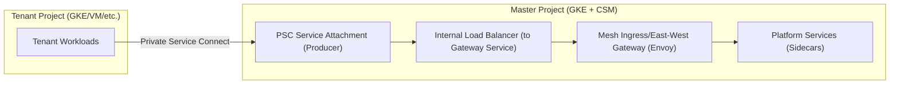

# Master Project Setup: Cloud Service Mesh (CSM) for Cross-Project Tenant Connectivity

> Document Version: 1.0  
> Last Updated: 2026-03-14  
> Target Audience: Platform Engineers, SRE, Infrastructure Team  
> Related: [`cloud-service-mesh.md`](cloud-service-mesh.md)

---

## 1. Goal and Constraints

### Goal

You operate a **Master Project** that runs the main **GKE platform cluster(s)**. You want to:

1. Install **Cloud Service Mesh (CSM)** on the Master Project GKE cluster(s) for traffic governance, security (mTLS), and observability.
2. Enable **cross-project communication** so that workloads in **Tenant Projects** can call platform services running in the Master Project.

### Constraints / Non-Goals (V1)

- **CSM is not your north-south entry**. Keep Global HTTPS LB / Cloud Armor / API Gateway chain for internet traffic.
- **Cross-project + mTLS end-to-end is optional** in V1.
  - If tenant workloads are not in a mesh, you cannot get true workload-to-workload mTLS; you can still enforce mTLS at a **gateway boundary**.
- Prefer **GCP-native connectivity** first (Shared VPC / PSC) over bespoke tunnels.

### Complexity

- **V1 (recommended)**: `Moderate` (Master-only mesh + controlled ingress from tenants)
- **V2 (advanced)**: `Advanced / Enterprise` (multi-cluster / multi-mesh, cross-project identity + trust alignment)

---

## 2. Recommended Architecture (V1)

### V1 Summary

Install CSM on the Master Project GKE cluster(s) using the **Fleet-managed control plane**, then expose a **single controlled entrypoint** for tenant-to-master calls. Keep tenant projects independent.

You have two pragmatic connectivity patterns for tenant-to-master:

1. **PSC to a Master “Mesh Gateway” (recommended for strict boundaries)**
2. **Private routing (Shared VPC / VPC Peering) to a Master Internal LB (simpler but weaker isolation)**

### V1a: PSC + Mesh Gateway (recommended)

Tenants connect to a **PSC endpoint** that lands on an **internal L7 gateway** (Istio Gateway / Envoy gateway) running in the Master cluster. Mesh policies, authz, retries, timeouts, telemetry happen behind that gateway.



Why this is a good V1:

- Strong project boundary: producer controls consumer allowlist/approval (PSC).
- You can enforce **mTLS/JWT** at the gateway even if tenants are not meshed.
- You avoid “mesh sprawl” across tenant projects in the first iteration.

### V1b: Shared VPC / Peering + Internal LB (simpler)

Tenants route privately (shared VPC or VPC peering) to an internal address in Master. Mesh still governs traffic **inside** Master, but the boundary control is weaker than PSC.

---

## 3. Trade-offs and Alternatives

### Alternative A: Put tenants into the same fleet/mesh (V2)

Pros:

- End-to-end mesh identity and mTLS across projects/clusters.
- Unified policy + telemetry plane.

Cons:

- Harder blast-radius management for a multi-tenant platform.
- Higher operational complexity (trust domains, east-west gateways, multi-cluster discovery).

### Alternative B: Don’t mesh tenants; mesh only Master (V1)

Pros:

- Keeps tenant ops simple.
- Mesh value realized on platform services (retries, outlier detection, authz, telemetry).

Cons:

- Not true mTLS end-to-end unless you enforce at the boundary gateway.

---

## 4. Implementation Steps (Master Project)

This section is written so you can implement CSM in a **multi-project environment** (fleet host project may differ from the cluster/network projects).

### 4.1 Discovery Inputs (fill these first)

| Item | Example | Notes |
|---|---|---|
| Fleet host project | `fleet-host-prj` | Recommended to be separate from cluster projects; can be Shared VPC host project |
| Master cluster project | `master-prj` | Where the GKE cluster actually lives |
| Network project | `net-host-prj` | Shared VPC host (if used) |
| Cluster location | `asia-east1` | Prefer regional cluster |
| Cluster name | `master-gke` | |
| Tenant connectivity | `PSC` or `Shared VPC` | Drives gateway pattern |
| Identity | Workload Identity | Required for fleet-managed setup |

### 4.2 Enable Required APIs

Enable APIs on the **fleet host project** (and on the cluster project where required).

Fleet host project (minimum set for managed control plane; adjust to your org policies):

```bash
FLEET_PROJECT_ID="fleet-host-prj"

gcloud services enable \
  mesh.googleapis.com \
  meshca.googleapis.com \
  container.googleapis.com \
  gkehub.googleapis.com \
  monitoring.googleapis.com \
  logging.googleapis.com \
  stackdriver.googleapis.com \
  connectgateway.googleapis.com \
  trafficdirector.googleapis.com \
  networkservices.googleapis.com \
  networksecurity.googleapis.com \
  --project="${FLEET_PROJECT_ID}"
```

If your **cluster project** is different from the fleet host project, ensure `mesh.googleapis.com` is enabled there too:

```bash
CLUSTER_PROJECT_ID="master-prj"
gcloud services enable mesh.googleapis.com --project="${CLUSTER_PROJECT_ID}"
```

### 4.3 IAM Roles (Install + Run)

#### Install-time roles (human/operator)

On the **fleet host project**, the operator typically needs at least:

- `roles/gkehub.admin`
- `roles/serviceusage.serviceUsageAdmin`
- Optional if using CA Service: `roles/privateca.admin`

#### Run-time roles (service account used by CSM)

For cross-project setups (fleet host != network project and/or != cluster project), you must grant the CSM service account in the fleet host project access to those other projects.

Get the fleet project number:

```bash
gcloud projects describe "${FLEET_PROJECT_ID}" --format="value(projectNumber)"
```

Then grant `roles/anthosservicemesh.serviceAgent` in the **network project** and **cluster project**:

```bash
FLEET_PROJECT_NUMBER="123456789012"
CSM_SA="service-${FLEET_PROJECT_NUMBER}@gcp-sa-servicemesh.iam.gserviceaccount.com"

NETWORK_PROJECT_ID="net-host-prj"
CLUSTER_PROJECT_ID="master-prj"

gcloud projects add-iam-policy-binding "${NETWORK_PROJECT_ID}" \
  --member="serviceAccount:${CSM_SA}" \
  --role="roles/anthosservicemesh.serviceAgent"

gcloud projects add-iam-policy-binding "${CLUSTER_PROJECT_ID}" \
  --member="serviceAccount:${CSM_SA}" \
  --role="roles/anthosservicemesh.serviceAgent"
```

### 4.4 Prepare the Master GKE Cluster

Minimum recommendations for a production master cluster to run CSM:

- Prefer a **regional** GKE cluster.
- Enable **Workload Identity**.
- Ensure IP aliasing (VPC-native) is enabled.
- Avoid unsupported patterns (for example, `hostNetwork: true` workloads in meshed namespaces).

If the cluster already exists, verify/update it (example uses an existing cluster):

```bash
CLUSTER_NAME="master-gke"
CLUSTER_LOCATION="asia-east1"   # region or zone
CLUSTER_PROJECT_ID="master-prj"

gcloud container clusters describe "${CLUSTER_NAME}" \
  --project="${CLUSTER_PROJECT_ID}" \
  --location="${CLUSTER_LOCATION}" \
  --format="yaml(workloadIdentityConfig,ipAllocationPolicy,privateClusterConfig)"
```

### 4.5 Register the Master Cluster to the Fleet

Associate the cluster with the fleet host project:

```bash
gcloud container clusters update "${CLUSTER_NAME}" \
  --project="${CLUSTER_PROJECT_ID}" \
  --location="${CLUSTER_LOCATION}" \
  --fleet-project "${FLEET_PROJECT_ID}"
```

Verify membership:

```bash
gcloud container fleet memberships list --project "${FLEET_PROJECT_ID}"
```

Record:

- `MEMBERSHIP_NAME`
- `MEMBERSHIP_LOCATION`

### 4.6 Enable Cloud Service Mesh on the Fleet

Enable the fleet mesh feature (run once per fleet):

```bash
gcloud container fleet mesh enable --project "${FLEET_PROJECT_ID}"
```

Enable automatic management for the master cluster membership:

```bash
MEMBERSHIP_NAME="master-gke-membership"
MEMBERSHIP_LOCATION="asia-east1"   # or "global" depending on membership

gcloud container fleet mesh update \
  --management automatic \
  --memberships "${MEMBERSHIP_NAME}" \
  --project "${FLEET_PROJECT_ID}" \
  --location "${MEMBERSHIP_LOCATION}"
```

Verify:

```bash
gcloud container fleet mesh describe --project "${FLEET_PROJECT_ID}"
```

### 4.7 Enable Sidecar Injection (Master Namespaces)

Start small: mesh only platform namespaces first (for example `platform-*`), and avoid injecting into system namespaces.

```bash
kubectl label namespace platform --overwrite istio-injection=enabled
```

Then redeploy workloads (or restart) so that sidecars appear.

### 4.8 Security Baseline (mTLS and AuthZ)

Important production nuance:

- Setting STRICT mTLS mesh-wide can break traffic from **non-meshed clients** (for example tenant workloads calling through PSC without sidecars), unless traffic enters through a gateway that is configured appropriately.

Recommended V1 baseline:

1. Keep mesh default permissive until your tenant-to-master entrypoint is ready.
2. Enforce STRICT mTLS **inside** critical namespaces after verifying.
3. Put strong policy at the boundary gateway (JWT, mTLS, AuthorizationPolicy).

---

## 5. Tenant-to-Master Communication Patterns (How to Make It Work)

### Pattern 1 (Recommended): PSC to a Master Mesh Gateway

Master-side steps (high level):

1. Deploy an Istio gateway (or Envoy-based gateway) as a Kubernetes `Service` of type `LoadBalancer` (internal).
2. Back it with an internal load balancer (ILB).
3. Publish that ILB via **PSC Service Attachment** (producer side).
4. Tenants consume via PSC endpoint/PSC NEG (consumer side).

Why we prefer this:

- You can keep strict policies at one controlled choke point.
- You can gradually onboard tenants without injecting sidecars into tenants.

### Pattern 2: Private routing to Master ILB

If you already have shared VPC or peering, tenants can call an internal VIP. Use this only if you can accept weaker project boundary controls than PSC.

---

## 6. Validation and Rollback

### Validation checklist

- Fleet registration:
  - `gcloud container fleet memberships list` shows the master cluster membership.
- Mesh enabled:
  - `gcloud container fleet mesh describe` shows status `ACTIVE` for control plane management.
- Sidecar injection:
  - Meshed workloads have `istio-proxy` container.
- Telemetry:
  - Basic request metrics appear in Cloud Monitoring.
- Tenant connectivity:
  - Tenant can reach master gateway/service over PSC or private routing.
- Policy:
  - mTLS/AuthZ enforcement behaves as intended (deny-by-default where required).

### Rollback strategy (practical)

- If mesh causes incident:
  - Remove namespace injection label (`istio-injection-`) and restart workloads (returns to non-meshed behavior).
  - Keep the connectivity path (PSC/ILB) intact so routing does not have to change during rollback.

---

## 7. Reliability and Cost Optimizations

- Start with a limited blast radius:
  - Mesh only platform services first, then expand.
- Avoid over-injection:
  - Sidecars cost CPU/memory; don’t inject into jobs/daemons that don’t need governance.
- Decide your boundary strategy early:
  - PSC gateway boundary is easier to secure and reason about than “many internal VIPs” spread across services.

---

## 8. Handoff Checklist

- [ ] Fleet host project chosen and documented (why this project).
- [ ] APIs enabled list recorded (fleet, cluster, network projects).
- [ ] Cross-project IAM bindings documented (service account + roles).
- [ ] Master cluster prereqs verified (regional, WI, VPC-native).
- [ ] Mesh enabled and verified via `gcloud container fleet mesh describe`.
- [ ] Namespace onboarding policy written (which namespaces are allowed to mesh).
- [ ] Tenant-to-master pattern decided (PSC gateway vs private routing).
- [ ] Security baseline decided (where to enforce mTLS, JWT, AuthZ).
- [ ] Runbook for incident rollback (disable injection, restart).

---

## References

- Google Cloud: Provision a managed Cloud Service Mesh control plane on GKE  
  https://cloud.google.com/service-mesh/docs/onboarding/provision-control-plane
