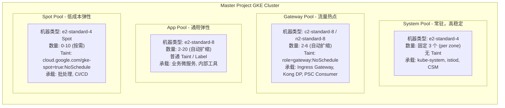
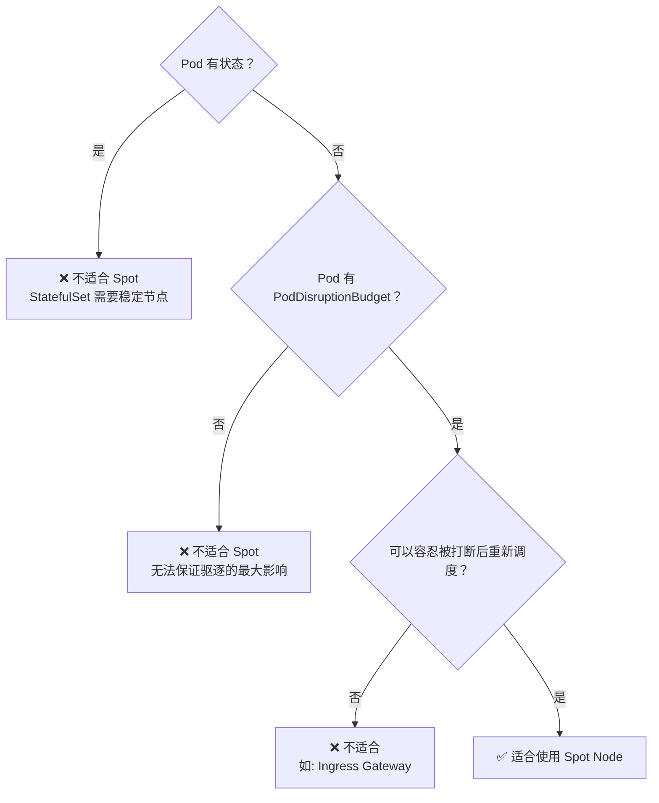

# GKE Node Pool Management：生产级最佳实践

> **背景与切入点**：基于 `3.md` 中你已实现的 Master Project（A Project，使用 Shared VPC + GKE 承载 Cloud Service Mesh / Kong DP / PSC Consumer 等工作负载）的架构，本文深入探索在复杂生产 GKE 集群下，如何从架构层面去规划、管理、更新和运维 Node Pool。

---

## 目录

- [1. Node Pool 存在的意义：为什么不能只用一个？](#1-node-pool-存在的意义为什么不能只用一个)
- [2. 架构评估与分层设计](#2-架构评估与分层设计)
- [3. Node Pool 的核心配置项与决策点](#3-node-pool-的核心配置项与决策点)
- [4. 节点升级策略与零停机更新](#4-节点升级策略与零停机更新)
- [5. 成本优化：Spot / Preemptible 的使用边界](#5-成本优化spot--preemptible-的使用边界)
- [6. 安全加固与最小权限原则](#6-安全加固与最小权限原则)
- [7. 自动扩缩容（Cluster Autoscaler）调优](#7-自动扩缩容cluster-autoscaler调优)
- [8. 可观测性与故障排查](#8-可观测性与故障排查)
- [9. 生产操作清单（Checklist）](#9-生产操作清单checklist)

---

## 1. Node Pool 存在的意义：为什么不能只用一个？

在生产 GKE 集群中，单一 Node Pool 会导致以下问题：

| 问题 | 影响 |
| :--- | :--- |
| 系统组件与业务 Pod 资源争抢 | 节点 OOM 导致系统 Pod（如 kube-proxy、CSM Envoy）被驱逐 |
| 无法应对异构负载需求 | GPU 任务、IO 密集型任务无法按需分配 |
| 升级风险极高 | 全池更新直接影响所有业务 |
| 自动扩缩边界模糊 | 不同负载的弹性需求差异大，统一 HPA/CA 难以调优 |

**结论**：正确做法是按照**工作负载类型**做节点池分层。

---

## 2. 架构评估与分层设计

### 2.1 你的 Master Project 现有工作负载分析

基于 `3.md` 中的架构，你的 Master Project 上可能运行：

| 工作负载类型 | 示例 | 特性 |
| :--- | :--- | :--- |
| **基础设施/系统组件** | Cloud Service Mesh (Istiod), kube-dns | 高可用，不可被抢占，配置少但稳定 |
| **流量入口控制层** | PSC NEG Consumer 相关 Pod, Ingress Gateway, Kong DP | 高并发，对网络延迟敏感 |
| **管理与应用层** | 内部工具服务，监控 (Prometheus, Grafana) | 对抢占容忍，弹性强 |
| **批处理/临时任务** | CI/CD Runner, 数据处理任务 | 适合 Spot 节点 |

### 2.2 推荐的 Node Pool 分层架构



### 2.3 Node Pool 命名与标签规范

清晰的命名是大规模运维的基础：

```bash
# 命名规范建议: {cluster}-{tier}-{region}-{version}
# 示例:
master-system-asia-east1-v1
master-gateway-asia-east1-v1
master-app-asia-east1-v1
master-spot-asia-east1-v1
```

**强制 Label 约定**（用于 Pod 调度 + 监控聚合）：
```yaml
# Node 上的必要 Label
node-pool-tier: system | gateway | app | spot
env: production | staging
region: asia-east1
```

---

## 3. Node Pool 的核心配置项与决策点

### 3.1 创建 Node Pool 的关键参数

以 `Gateway Pool` 为例展示生产级创建命令：

```bash
gcloud container node-pools create master-gateway-pool \
  --cluster=master-cluster \
  --project=master-project \
  --region=asia-east1 \
  --machine-type=n2-standard-8 \
  --disk-type=pd-ssd \
  --disk-size=100GB \
  --num-nodes=2 \                          # 每个 zone 的节点数
  --min-nodes=2 \                          # 自动扩缩下限
  --max-nodes=6 \                          # 自动扩缩上限
  --enable-autoscaling \
  --enable-autorepair \                    # 自动修复不健康节点
  --enable-autoupgrade \                   # 随 Master 自动升级（受控制面版本管理）
  --node-taints=role=gateway:NoSchedule \  # 污点隔离
  --node-labels=node-pool-tier=gateway,env=production \
  --shielded-integrity-monitoring \        # 安全加固
  --shielded-secure-boot \
  --workload-metadata=GKE_METADATA \       # 启用 Workload Identity 数据平面
  --max-surge-upgrade=1 \                  # 升级时最多额外多 1 个节点
  --max-unavailable-upgrade=0              # 升级时保证 0 个节点同时不可用
```

### 3.2 关键配置决策矩阵

| 配置项 | 建议 | 原因与注意事项 |
| :--- | :--- | :--- |
| `--disk-type` | 流量热点用 `pd-ssd`，普通应用用 `pd-balanced` | SSD 的随机 IOPS 是 HDD 的 10~20 倍，适合高 I/O 的网关节点 |
| `--enable-autorepair` | **必须开启** | GKE 会自动检测并重建不可加入集群的节点，避免手动处理节点故障 |
| `--enable-autoupgrade` | **建议开启**，但配合维护窗口 | 不开启意味着手动管理版本，极易产生版本债务 |
| `--workload-metadata=GKE_METADATA` | **强制开启** | 配合 Workload Identity，阻止 Pod 直接访问 Node 的 Service Account，杜绝横向越权 |
| `--max-unavailable-upgrade=0` | 对 Gateway / System Pool 必须设为 0 | 确保升级期间服务不中断，代价是需要额外节点配额 |

---

## 4. 节点升级策略与零停机更新

这是生产运维最高风险的操作，需要系统性方案。

### 4.1 GKE 升级路径理解

```
Google 发布新版本
    ↓
Control Plane (Master) 先升级（GKE 全托管，你无需操作）
    ↓
Node Pool 升级（在 Master 升级后，你的 Node Pool 需要跟进）
    ↓
Pod 被重新调度到新版本节点上
```

> **关键原则**：GKE 要求 Node Pool 版本不能落后 Master 超过 **2 个 minor 版本**（e.g., Master 是 1.30，Node 最低是 1.28）。

### 4.2 升级策略（Surge Upgrade vs Blue/Green）

#### 策略一：Surge Upgrade（推荐用于常规升级）

```bash
# 方式1: 通过 gcloud 命令触发特定 pool 的升级
gcloud container clusters upgrade master-cluster \
  --project=master-project \
  --region=asia-east1 \
  --node-pool=master-gateway-pool \
  --cluster-version=1.30.5-gke.1000

# 方式2: 通过更新 pool 配置触发
gcloud container node-pools update master-gateway-pool \
  --cluster=master-cluster \
  --region=asia-east1 \
  --max-surge-upgrade=1 \         # 最多临时新增 1 个节点
  --max-unavailable-upgrade=0     # 同时不可用为 0（rolling 滚动）
```

**升级流程（Surge 模式）**：
```
开始升级
    ↓
新增 1 个 Surge 节点（新版本）
    ↓
老节点被 Drain（kubectl drain，graceful eviction）
    ↓
Pod 迁移到 Surge 节点 + 现有其他节点
    ↓
老节点被删除
    ↓
循环直到所有节点升级完毕
```

#### 策略二：Blue/Green Node Pool（推荐用于重大基础变更）

当你需要改变 `machine-type`、`disk-type`、`node-label`（这些参数**不可在线修改**）时，必须新建 Pool + 切流 + 删旧 Pool：

```bash
# Step 1: 创建新 pool（新配置）
gcloud container node-pools create master-gateway-pool-v2 \
  --cluster=master-cluster \
  --region=asia-east1 \
  --machine-type=c2-standard-8 \       # 变更机器类型
  --num-nodes=2 \
  --node-taints=role=gateway:NoSchedule

# Step 2: 驱逐旧 pool 上的 Pod（让 Scheduler 把 Pod 调到新 pool）
# 先给旧 pool 的节点加上 Taint，阻止新 Pod 进来
for node in $(kubectl get nodes -l node-pool-tier=gateway-old -o name); do
  kubectl taint nodes ${node/node\//} retiring=true:NoSchedule
  kubectl drain ${node/node\//} --ignore-daemonsets --delete-emptydir-data --force
done

# Step 3: 确认业务全部迁移到新 pool 并稳定后，删除旧 pool
gcloud container node-pools delete master-gateway-pool \
  --cluster=master-cluster \
  --region=asia-east1
```

### 4.3 维护窗口配置

切记要给集群配置维护窗口，避免 GKE 在业务高峰期自动触发升级：

```bash
# 设置维护窗口：每周三 02:00~06:00 (UTC) 进行，排除重要节假日
gcloud container clusters update master-cluster \
  --project=master-project \
  --region=asia-east1 \
  --maintenance-window-start="2024-01-01T18:00:00Z" \
  --maintenance-window-end="2024-01-01T22:00:00Z" \
  --maintenance-window-recurrence="FREQ=WEEKLY;BYDAY=WE"

# 排除特定时间段（如年末）
gcloud container clusters update master-cluster \
  --add-maintenance-exclusion-name="year-end-freeze" \
  --maintenance-exclusion-start="2024-12-20T00:00:00Z" \
  --maintenance-exclusion-end="2025-01-05T00:00:00Z" \
  --maintenance-exclusion-scope=NO_UPGRADES
```

---

## 5. 成本优化：Spot / Preemptible 的使用边界

### 5.1 边界评估（什么业务可以放 Spot？）



| 工作负载 | Spot 是否适合 | 原因 |
| :--- | :---------- | :--- |
| Istiod (Control Plane) | ❌ | 被打断导致 Envoy Sidecar 无法下发证书 |
| Kong DP / Ingress Gateway | ❌ | 流量入口，中断即影响业务 |
| PSC Consumer 相关 Pod | ❌ | 网络入口，稳定性第一 |
| 监控采集 (Prometheus Scrape) | ✅ | 可重试，数据短暂断点可接受 |
| CI/CD Runner | ✅ | 任务幂等，可重试 |
| 批处理、数据处理 | ✅ | 典型 Spot 使用场景 |

### 5.2 Spot Pool 配置

```bash
gcloud container node-pools create master-spot-pool \
  --cluster=master-cluster \
  --region=asia-east1 \
  --machine-type=e2-standard-4 \
  --spot \                                  # 启用 Spot
  --enable-autoscaling \
  --min-nodes=0 \                           # 允许缩到 0
  --max-nodes=10 \
  --node-taints=cloud.google.com/gke-spot=true:NoSchedule
```

在 Pod spec 中明确指定 Spot 节点容忍：
```yaml
spec:
  tolerations:
  - key: "cloud.google.com/gke-spot"
    operator: "Equal"
    value: "true"
    effect: "NoSchedule"
  affinity:
    nodeAffinity:
      requiredDuringSchedulingIgnoredDuringExecution:
        nodeSelectorTerms:
        - matchExpressions:
          - key: cloud.google.com/gke-spot
            operator: In
            values:
            - "true"
```

---

## 6. 安全加固与最小权限原则

### 6.1 Workload Identity 是必须项

在你的 Shared VPC + PSC 架构中，GKE Pod 可能需要访问 GCP API（如 Pub/Sub、GCS、Secret Manager）。**绝对不能**使用节点级别的 Service Account 来授权（会导致节点上所有 Pod 共享同一权限）。

```bash
# 1. 创建 Kubernetes ServiceAccount
kubectl create serviceaccount my-app-sa -n my-namespace

# 2. 创建 GCP Service Account
gcloud iam service-accounts create my-app-gsa \
  --project=master-project

# 3. 授予 GSA 对目标资源的权限（最小化）
gcloud projects add-iam-policy-binding master-project \
  --member="serviceAccount:my-app-gsa@master-project.iam.gserviceaccount.com" \
  --role="roles/pubsub.publisher"

# 4. 关联 KSA 和 GSA（核心绑定步骤）
gcloud iam service-accounts add-iam-policy-binding my-app-gsa@master-project.iam.gserviceaccount.com \
  --role="roles/iam.workloadIdentityUser" \
  --member="serviceAccount:master-project.svc.id.goog[my-namespace/my-app-sa]"

# 5. 给 KSA 打上 annotation
kubectl annotate serviceaccount my-app-sa \
  -n my-namespace \
  iam.gke.io/gcp-service-account=my-app-gsa@master-project.iam.gserviceaccount.com
```

### 6.2 节点级别 Service Account 最小化

创建集群时，不要使用 Compute Engine 默认 SA（权限过高）：

```bash
# 创建最小化 Node SA
gcloud iam service-accounts create gke-node-sa \
  --display-name="GKE Node Service Account"

# 只授予 GKE 节点必需的最小权限
for role in \
  "roles/logging.logWriter" \
  "roles/monitoring.metricWriter" \
  "roles/monitoring.viewer" \
  "roles/stackdriver.resourceMetadata.writer" \
  "roles/storage.objectViewer"; do   # 访问 Container Registry 用
  gcloud projects add-iam-policy-binding master-project \
    --member="serviceAccount:gke-node-sa@master-project.iam.gserviceaccount.com" \
    --role="${role}"
done
```

### 6.3 Binary Authorization（容器镜像签名验证）

防止未授权镜像在生产节点上运行：

```bash
# 启用 Binary Authorization
gcloud container clusters update master-cluster \
  --enable-binauthz \
  --binauthz-evaluation-mode=PROJECT_SINGLETON_POLICY_ENFORCE
```

---

## 7. 自动扩缩容（Cluster Autoscaler）调优

### 7.1 关键参数理解

```bash
# 配置 CA 行为（通常在 cluster 层面）
gcloud container clusters update master-cluster \
  --autoscaling-profile=optimize-utilization \  # 更激进地缩容（适合测试/批处理场景）
  # --autoscaling-profile=balanced             # 默认，保守缩容（适合生产）
```

### 7.2 防止关键 Pod 被误缩

```yaml
# 在关键 Pod（如 Prometheus, Istiod）上添加注解，阻止 CA 因此节点缩容
annotations:
  cluster-autoscaler.kubernetes.io/safe-to-evict: "false"
```

### 7.3 PodDisruptionBudget 是扩缩容的安全网

```yaml
# 确保 Gateway 始终有至少 2 个副本在线
apiVersion: policy/v1
kind: PodDisruptionBudget
metadata:
  name: gateway-pdb
spec:
  minAvailable: 2          # 或者用 maxUnavailable: 1
  selector:
    matchLabels:
      app: ingress-gateway
```

---

## 8. 可观测性与故障排查

### 8.1 核心监控指标

```bash
# 查看节点池的实际资源压力
kubectl top nodes --sort-by=memory
kubectl top pods -A --sort-by=memory

# 查看某节点上所有的 Pod（节点故障时快速定位受影响业务）
kubectl get pods --all-namespaces \
  --field-selector spec.nodeName=<node-name> \
  -o custom-columns=NAMESPACE:.metadata.namespace,NAME:.metadata.name,STATUS:.status.phase

# 查看节点资源详情（allocatable vs requested）
kubectl describe node <node-name> | grep -A 20 "Allocated resources"
```

### 8.2 节点问题诊断流程

```bash
# 1. 查看节点状态
kubectl get nodes -o wide

# 2. 查看异常节点的事件
kubectl describe node <problematic-node>

# 3. 查看系统 Pod 是否有异常（DaemonSet 等）
kubectl get pods -n kube-system -o wide | grep <problematic-node>

# 4. 为故障节点注入临时调试容器（不破坏现有 Pod）
kubectl debug node/<node-name> -it --image=ubuntu:22.04
```

### 8.3 Cloud Monitoring 关键告警

建议在 GCP Cloud Monitoring 中配置以下告警：

| 指标 | 阈值 | 意义 |
| :--- | :--- | :--- |
| `kubernetes.io/node/cpu/allocatable_utilization` | > 80% | 节点 CPU 即将耗尽 |
| `kubernetes.io/node/memory/allocatable_utilization` | > 85% | 节点内存告警 |
| `kubernetes.io/pod/restart_count` | 每小时 > 5 次 | 异常重启（OOMKill 或服务崩溃） |
| `kubernetes.io/node/status_condition` | `Ready = False` | 节点进入 NotReady 状态 |

---

## 9. 生产操作清单（Checklist）

### 9.1 新建/变更 Node Pool 前检查

- [ ] 确认变更 Pool 上运行的业务 Pod，评估影响范围
- [ ] 确认已配置 `PodDisruptionBudget`，防止迁移时服务中断
- [ ] 确认节点配额（CPU、内存、IP 地址）足够支撑 Surge 节点
- [ ] 确认维护窗口时间，避开业务高峰
- [ ] 通知上下游团队变更计划

### 9.2 升级操作流程

```
1. 检查当前集群健康状态
   └── kubectl get nodes && kubectl get pods -A | grep -v Running

2. 在低峰期开始升级
   └── gcloud container clusters upgrade ... --node-pool=...

3. 实时监控升级进度
   └── watch -n 5 "kubectl get nodes -o wide"

4. 升级完成后验证
   ├── kubectl get nodes（版本一致）
   ├── kubectl get pods -A（无异常 Pod）
   └── 业务流量监控（Cloud Monitoring）无告警
```

### 9.3 紧急回滚预案

Node Pool 本身没有直接的"版本回滚"按钮，但可以：

1. **使用 Blue/Green 快速切回**：如果保留了旧版 Pool（v1），重新给旧 Pool 节点移除 Taint，引流回去
2. **修改 PodAffinity 控制调度**：临时调整 Deployment 的 `nodeAffinity`，控制 Pod 去哪个 Pool
3. **联系 GCP 支持**：如 GKE 版本有 Bug，可申请 rollback 窗口（通常 72 小时内）

---

## 参考链接

- [GKE Node Pool 官方文档](https://cloud.google.com/kubernetes-engine/docs/concepts/node-pools)
- [GKE 升级策略](https://cloud.google.com/kubernetes-engine/docs/concepts/cluster-upgrades)
- [GKE Workload Identity](https://cloud.google.com/kubernetes-engine/docs/how-to/workload-identity)
- [Cluster Autoscaler](https://cloud.google.com/kubernetes-engine/docs/concepts/cluster-autoscaler)
- [GKE Maintenance Windows](https://cloud.google.com/kubernetes-engine/docs/how-to/maintenance-windows-and-exclusions)
