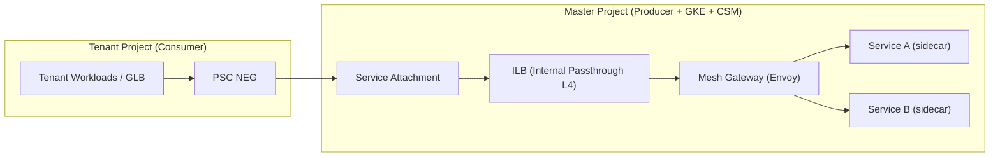

# 跨项目 PSC 结合 Cloud Service Mesh 实现方案

> 文档版本：1.0  
> 创建日期：2026-03-14  
> 目标读者：平台工程 / SRE / 基础设施团队  
> 关联文档：3.md, 3-add-mesh.md, cross-project-mesh.md, cloud-service-mesh.md, master-project-setup-mesh.md

---

## 1. 问题理解

### 1.1 现有实现（来自 3.md）

你已经通过 **PSC NEG** 成功打通了跨项目链路（Tenant/Consumer → Master/Producer），并验证了 Shared VPC 权限粒度、Producer PSC NAT subnet 等关键点。

当前核心链路（简化）：

```
Tenant Project (Consumer)
  GLB / 或内部调用
    ↓
PSC NEG
    ↓
Master Project Service Attachment (Producer)
    ↓
Master Project ILB
    ↓
Backend（GKE / VM / MIG）
```

### 1.2 新目标

在 **Master Project 的 GKE** 上安装并启用 **Cloud Service Mesh (CSM，托管 Istio)**，实现：

- Master 内部服务的 **mTLS、授权、限流/重试、熔断、金丝雀、可观测性**
- Tenant → Master 的调用仍通过 **PSC 边界**，并在 Master 的 **Mesh 入口**统一治理

### 1.3 V1 约束（建议明确）

- V1 推荐：**只给 Master 上 Mesh**，Tenant 不强制上 Mesh（避免多租户场景的爆炸半径与复杂度）。
- **PSC 仍然是跨项目网络边界**，CSM 负责边界之后（Master 内部）的服务治理。
- V1 不追求"跨项目端到端 workload-to-workload mTLS"（Tenant 没 sidecar 时做不到）。
  - 但你仍然可以在 **Mesh Gateway 边界**做到强安全（JWT/mTLS/AuthorizationPolicy）。

复杂度评估：`Moderate`（在现有 PSC 基础上引入 Master Mesh + 入口网关）。

---

## 2. Recommended Architecture (V1)（推荐架构）

### 2.1 核心思想：不改 PSC，只改 Producer 后端指向

Tenant 项目侧（Consumer）：

- **无需改变**：PSC NEG 仍然指向 Master 的 Service Attachment。

Master 项目侧（Producer）：

- PSC Service Attachment 依然保留；
- 但 Service Attachment 背后的 **ILB 不再指向业务服务本身**，而是指向 **Mesh Gateway（Ingress/East-West Gateway）**。



### 2.2 为什么这是最适合你当前状态的"最小改造"

- 你已经验证 PSC NEG 架构可用：继续沿用，**风险最小**。
- Mesh 入口网关成为"统一治理点"：安全策略、路由、重试、观测都集中在 Master。
- Tenant 仍保持隔离：不需要把 Tenant 变成"网格联邦的一部分"。

---

## 3. Trade-offs and Alternatives（取舍与备选）

### 3.1 方案 A（推荐）：PSC → Mesh Gateway → Mesh 内服务

优点：

- 边界清晰：PSC 解决网络边界与接入控制，Mesh 解决边界内的治理。
- 适合多租户：Tenant 不需要统一升级/统一控制面，爆炸半径小。

代价：

- Tenant 端到 Master 服务不是端到端 mTLS（除非 Tenant 也上 mesh 或在边界做双向 TLS）。
- 你需要把"入口治理"设计好（鉴权、租户隔离、健康检查、流量保护）。

### 3.2 方案 B（不建议起步就做）：跨集群/跨项目 Multi-Cluster Mesh 联邦

适合条件：

- 你确实需要 Tenant 与 Master 变成一个"超大统一微服务系统"，跨集群用服务名互调、统一策略与观测；
- 且你能接受复杂的跨集群网关、信任域、服务发现、升级联动成本。

对多租户平台通常风险过高，建议后置到 V2/V3。

---

## 4. Implementation Steps（Master Project 落地步骤）

### 4.1 先确定 4 个输入（否则会绕圈）

| 输入项                   | 你需要确定的值                         | 备注                              |
| ------------------------ | -------------------------------------- | --------------------------------- |
| Fleet host project       | `fleet-host-prj` 或直接用 `master-prj` | Fleet 是 CSM 托管控制面的关键依赖 |
| Master 集群 location     | `asia-east1`（建议 regional）          | CSM/网关/ILB/PSC 同 Region 更稳   |
| Tenant → Master 接入形态 | 继续沿用 PSC（你已实现）               | 这份文档默认你继续用 PSC          |
| 入口模式                 | "一个共享网关"或"每租户一个网关"       | 决定隔离与运维复杂度              |

### 4.2 启用 API（Fleet / Mesh / Observability）

在 Fleet host project（以及 Master cluster project）启用必要 API（按你们 org policy 裁剪）：

```bash
FLEET_PROJECT_ID="fleet-host-prj"
MASTER_PROJECT_ID="master-prj"

gcloud services enable \
  mesh.googleapis.com \
  meshca.googleapis.com \
  gkehub.googleapis.com \
  container.googleapis.com \
  monitoring.googleapis.com \
  logging.googleapis.com \
  connectgateway.googleapis.com \
  trafficdirector.googleapis.com \
  networkservices.googleapis.com \
  networksecurity.googleapis.com \
  --project="${FLEET_PROJECT_ID}"

gcloud services enable mesh.googleapis.com --project="${MASTER_PROJECT_ID}"
```

### 4.3 IAM（跨 Project 时的关键点）

如果 Fleet host project ≠ Master project（或 ≠ Shared VPC host project），需要把 CSM 的 service agent 赋权到相关项目（否则会在 enable / reconcile 时踩坑）。

建议把以下内容写进你们的 IAM Runbook：

1. 查 Fleet project number，推导 service agent：
   - `service-${FLEET_PROJECT_NUMBER}@gcp-sa-servicemesh.iam.gserviceaccount.com`
2. 在 Master project / Network host project 上授予：
   - `roles/anthosservicemesh.serviceAgent`

### 4.4 把 Master 集群注册进 Fleet

你有两种常见方式（选其一即可，取决于你集群生命周期管理习惯）：

方式 1：直接把现有集群关联到 Fleet project（更"平台化"）

```bash
CLUSTER_NAME="master-gke"
CLUSTER_LOCATION="asia-east1"

gcloud container clusters update "${CLUSTER_NAME}" \
  --project="${MASTER_PROJECT_ID}" \
  --location="${CLUSTER_LOCATION}" \
  --fleet-project "${FLEET_PROJECT_ID}"
```

方式 2：用 Membership register（更显式，适合多来源集群）

> 如果你们已经在使用 Fleet，建议统一用同一种方式，避免后续排障时"membership 归属不清"。

验证：

```bash
gcloud container fleet memberships list --project "${FLEET_PROJECT_ID}"
```

### 4.5 启用 Fleet Managed Cloud Service Mesh（托管控制面）

```bash
gcloud container fleet mesh enable --project "${FLEET_PROJECT_ID}"
```

对 Master 集群 membership 开启自动管理（管理平面/数据面版本策略由 Google 管理，减少运维负担）：

```bash
MEMBERSHIP_NAME="master-gke-membership"
MEMBERSHIP_LOCATION="asia-east1"   # 具体值以 memberships list 输出为准

gcloud container fleet mesh update \
  --management automatic \
  --memberships "${MEMBERSHIP_NAME}" \
  --project "${FLEET_PROJECT_ID}" \
  --location "${MEMBERSHIP_LOCATION}"
```

验证：

```bash
gcloud container fleet mesh describe --project "${FLEET_PROJECT_ID}"
```

### 4.5.1 数据面注入策略（强烈建议用 revision 控制爆炸半径）

生产里建议采用 **revision-based injection**，用于平滑升级与回滚，避免全局注入导致"所有 namespace 同时变更"。

落地动作（思路）：

1. 先确认当前集群的 mesh webhook / revision 信息（不同环境显示略有差异）：

```bash
kubectl get mutatingwebhookconfigurations | rg -n "istio|asm|mesh"
kubectl get pods -A | rg -n "istiod|asm"
```

2. 只对目标 namespace 打 revision label（示例）：

```bash
kubectl label namespace platform istio.io/rev=asm-managed --overwrite
```

> 说明：`asm-managed` 只是示例名，实际值以你集群里存在的 revision 为准。目标是把"谁上 mesh"变成可控开关。

### 4.6 网关接入：在 Master 集群部署 Mesh Gateway（对 PSC 暴露的唯一入口）

你需要一个专门承接 Tenant → Master 流量的 Gateway（Envoy），并通过 **内部 ILB** 暴露出来，让 PSC Service Attachment 指向这个 ILB。

关键要求：

- Gateway 需要是一个 K8s `Service`，类型 `LoadBalancer`，并确保创建的是 **Internal** ILB（L4 passthrough）。
- Gateway 后面路由到 mesh 内部服务（通过 VirtualService / DestinationRule / AuthorizationPolicy）。

> 你在 `cross-project-mesh.md` 里已经写了一个可用的 Service 示例，这里建议你把网关单独放一个 namespace（例如 `mesh-gw`），并用 GitOps 管理。

#### 4.6.1 最小可用网关清单（先跑通，再加强）

下面给一个"能落地"的最小网关骨架，便于你把 `PSC → ILB → Gateway` 先打通，再逐步加安全策略与路由治理。

1. namespace（只给网关单独开）：

```yaml
apiVersion: v1
kind: Namespace
metadata:
  name: mesh-gw
  labels:
    istio-injection: disabled
```

2. internal ILB Service（将其作为 PSC Producer 的目标）：

```yaml
apiVersion: v1
kind: Service
metadata:
  name: mesh-gateway-ilb
  namespace: mesh-gw
  annotations:
    networking.gke.io/load-balancer-type: "Internal"
spec:
  type: LoadBalancer
  selector:
    app: mesh-gateway
  ports:
  - name: http
    port: 80
    targetPort: 8080
  - name: https
    port: 443
    targetPort: 8443
```

3. 网关 Deployment（示意，镜像/参数以你们 mesh 发行版与安全基线为准）：

```yaml
apiVersion: apps/v1
kind: Deployment
metadata:
  name: mesh-gateway
  namespace: mesh-gw
spec:
  replicas: 3
  selector:
    matchLabels:
      app: mesh-gateway
  template:
    metadata:
      labels:
        app: mesh-gateway
    spec:
      containers:
      - name: gateway
        image: istio/proxyv2:1.20.0
        args: ["proxy", "router", "--domain", "$(POD_NAMESPACE).svc.cluster.local"]
        ports:
        - containerPort: 8080
        - containerPort: 8443
```

> 说明：上面是"骨架"。真实生产建议使用 CSM/ASM 官方推荐的网关部署方式（Helm/官方清单/平台模板），确保版本兼容与安全基线一致。

### 4.7 更新 Producer：让 PSC Service Attachment 指向网关 ILB

你可以两种策略：

- 平滑迁移（推荐）：新建一个 `service-attachment-mesh-gw`，让新 PSC NEG 指向它；验证后再切换生产流量。
- 直接替换：把现有 Service Attachment 的 backend forwarding rule 改成网关 ILB（风险更高）。

需要的核心信息：

- 网关 ILB 对应的 `Forwarding Rule` 名称（Master project，Region 内部资源）

验证与获取 forwarding rule（示例）：

```bash
gcloud compute forwarding-rules list \
  --project="${MASTER_PROJECT_ID}" \
  --filter="loadBalancingScheme=INTERNAL"
```

然后创建/更新 Service Attachment 指向该 forwarding rule（示例）：

```bash
gcloud compute service-attachments create master-mesh-attachment \
  --project="${MASTER_PROJECT_ID}" \
  --region=asia-east1 \
  --producer-forwarding-rule="YOUR_GW_ILB_FWD_RULE" \
  --connection-preference=ACCEPT_MANUAL \
  --nat-subnets="psc-nat-subnet" \
  --consumer-accept-list="tenant-project-id=100"
```

### 4.8 Mesh 内部路由与隔离（Gateway/VirtualService/Policy）

建议你优先做"租户隔离的入口治理"，而不是先上花哨的流量切分：

- 路由：基于 Host/Path 把请求打到不同的内部服务（或不同租户命名空间）。
- 安全：
  - Gateway 入口校验 JWT（RequestAuthentication）
  - AuthorizationPolicy 按租户 claim / path / host 做授权
- 服务间 mTLS：在内部命名空间逐步开启 STRICT（避免一上来全局 STRICT 把非 mesh 流量打挂）。

#### 4.8.1 一个可直接套用的"租户入口治理"示例（Host/Path + JWT）

目标：Tenant 通过 PSC 调用 Master，网关统一做"身份识别 + 授权 + 路由"，后端服务只专注业务逻辑。

1. RequestAuthentication（校验 JWT）：

```yaml
apiVersion: security.istio.io/v1beta1
kind: RequestAuthentication
metadata:
  name: gw-jwt
  namespace: mesh-gw
spec:
  selector:
    matchLabels:
      app: mesh-gateway
  jwtRules:
  - issuer: "https://issuer.example"
    jwksUri: "https://issuer.example/.well-known/jwks.json"
```

2. AuthorizationPolicy（按 JWT claim 限制租户）：

```yaml
apiVersion: security.istio.io/v1beta1
kind: AuthorizationPolicy
metadata:
  name: gw-tenant-allow
  namespace: mesh-gw
spec:
  selector:
    matchLabels:
      app: mesh-gateway
  action: ALLOW
  rules:
  - to:
    - operation:
        paths: ["/master-api/*"]
    when:
    - key: request.auth.claims[tenant_id]
      values: ["tenant-a", "tenant-b"]
```

3. Gateway + VirtualService（按 host/path 路由到内部服务）：

```yaml
apiVersion: networking.istio.io/v1beta1
kind: Gateway
metadata:
  name: master-gw
  namespace: mesh-gw
spec:
  selector:
    app: mesh-gateway
  servers:
  - port:
      number: 80
      name: http
      protocol: HTTP
    hosts:
    - "ppd01-ajbx.short.fqdn.aibang"
---
apiVersion: networking.istio.io/v1beta1
kind: VirtualService
metadata:
  name: route-master-api
  namespace: mesh-gw
spec:
  hosts:
  - "ppd01-ajbx.short.fqdn.aibang"
  gateways:
  - master-gw
  http:
  - match:
    - uri:
        prefix: /master-api/svc-a/
    route:
    - destination:
        host: service-a.platform.svc.cluster.local
        port:
          number: 80
  - match:
    - uri:
        prefix: /master-api/svc-b/
    route:
    - destination:
        host: service-b.platform.svc.cluster.local
        port:
          number: 80
```

#### 4.8.2 内部 mTLS rollout（建议按 namespace 推进）

等 Tenant → 网关入口稳定后，再逐步把内部 namespace 切到 STRICT：

```yaml
apiVersion: security.istio.io/v1beta1
kind: PeerAuthentication
metadata:
  name: default
  namespace: platform
spec:
  mtls:
    mode: STRICT
```

---

## 5. Validation and Rollback（验证与回滚）

### 5.1 必做验证（建议按顺序）

1. Fleet / Mesh 状态：
   - `gcloud container fleet mesh describe` 状态正常
2. Gateway 是否有 ILB：
   - Master project 中存在 internal forwarding rule
3. PSC 连接是否建立：
   - `gcloud compute service-attachments describe ...` 中 `connectedEndpoints` 有值（并且已 approve）
4. 端到端请求：
   - Tenant 发起请求，能命中 Master Gateway，并路由到目标 Service
5. mTLS 仅在网格内生效（V1 预期）：
   - Gateway → Service A/B 走 mTLS（sidecar 指标/日志可验证）

### 5.2 常见坑（你大概率会遇到）

- **源 IP 变成 PSC NAT IP**：审计不要依赖 source IP；优先依赖 `X-Forwarded-For`/JWT claim。
- **健康检查路径**：不要让健康检查依赖具体业务接口；给 Gateway 单独准备稳定的健康检查路径/端口。
- **一上来全局 STRICT mTLS**：Tenant 流量如果在进入网关前不是 mesh 流量，必须在边界清晰分段，否则会被拒绝。

### 5.3 回滚策略（建议写进 Runbook）

最小可行回滚：

- 只回滚 Producer 侧：把 Service Attachment backend 指回旧 ILB（或旧后端）。
- Mesh 不动：即便 mesh 继续运行，也不影响通过 PSC 直接打旧后端的能力。

---

## 6. Reliability and Cost Optimizations（可靠性与成本）

- 网关高可用：
  - 网关 Deployment 多副本 + PDB
  - 节点跨 zone（GKE regional + 多 zone node pool）
- 防止重试风暴：
  - 在网关层做统一的 `timeout/retry` 策略，避免把下游打穿
- Sidecar 成本控制：
  - 不要全集群注入，按 namespace 分批开启

---

## 7. Handoff Checklist（交付清单）

- [ ] 决策记录：为什么选择"PSC → Mesh Gateway"而不是联邦多集群 mesh
- [ ] Fleet host project / IAM 绑定 / API enable 清单落库
- [ ] Gateway manifests（Service/Deployment/Gateway/VirtualService/Policy）进入 GitOps
- [ ] 健康检查策略落地（路径/端口/阈值）
- [ ] 安全策略落地（JWT/AuthorizationPolicy/内部 mTLS rollout 策略）
- [ ] 回滚 Runbook（指回旧 Service Attachment / 旧 ILB）

---

## 8. 方案评估

### 8.1 合理性分析

| 评估维度 | 评分 | 说明 |
|----------|------|------|
| 架构清晰度 | 5/5 | PSC 边界 + Mesh 治理边界分离，职责明确 |
| 实施复杂度 | 3/5 | 只需在 Master 侧改造，Tenant 无感知 |
| 安全性 | 5/5 | Gateway 边界可做 JWT + mTLS + AuthorizationPolicy |
| 多租户隔离 | 4/5 | Tenant 之间通过 PSC allowlist 隔离，Mesh 内通过 Namespace 隔离 |
| 运维成本 | 4/5 | 不需要管理 Tenant Mesh，爆炸半径可控 |
| 可扩展性 | 4/5 | 新租户只需在 PSC allowlist 添加即可 |

### 8.2 不适合的场景

- 如果需要 Tenant 到 Master 的端到端 mTLS（需要 Tenant 也上 Mesh，形成 Mesh 联邦）
- 如果需要 Tenant 之间通过服务名直接互调（需要跨集群 Mesh 打通）

---

## 9. 总结

### 9.1 方案一句话概括

**PSC 保持跨项目网络边界，Mesh 只在 Master 内部做服务治理，Tenant 通过 Mesh Gateway 统一入口访问。**

### 9.2 实施路线图

| 阶段 | 任务 | 预计时间 |
|------|------|----------|
| 准备 | 确定 Fleet/Master 项目参数 | 0.5 天 |
| 基础 | 启用 API + IAM 配置 | 0.5 天 |
| Mesh | 安装 CSM + 注册集群 | 1 天 |
| 网关 | 部署 Mesh Gateway | 1 天 |
| 接入 | 更新 Service Attachment | 0.5 天 |
| 策略 | 配置路由 + 安全策略 | 1 天 |
| 验证 | 端到端测试 | 1 天 |

### 9.3 后续优化方向

- 多租户 Gateway：如果租户数量增加，可考虑为每个租户创建独立 Gateway
- 金丝雀发布：利用 Mesh 的流量分割能力做 A/B Testing
- 多集群 Mesh：如果 Master 有多个 GKE 集群，可扩展为多集群 Mesh

---

## 参考资料

- 3.md - 跨项目 PSC NEG 实现方案
- 3-add-mesh.md - 在现有 PSC NEG 架构上引入 Cloud Service Mesh
- cross-project-mesh.md - 跨项目 PSC 结合 Cloud Service Mesh 架构部署指南
- cloud-service-mesh.md - Google Cloud Service Mesh Setup Guide
- master-project-setup-mesh.md - Master Project Setup: Cloud Service Mesh
- Google Cloud Service Mesh 文档：https://cloud.google.com/service-mesh/docs
- Anthos Service Mesh 文档：https://cloud.google.com/anthos/service-mesh

---

**文档维护**: Qwen Code  
**审核状态**: 待审核
