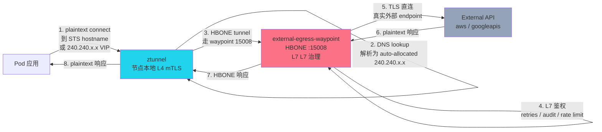

# Istio ServiceEntry 能力矩阵与实战场景

> 适用环境:GKE / Google Cloud Service Mesh(ASM)/ Upstream Istio · sidecar 模式与 ambient 模式都覆盖 · `networking.istio.io/v1`
>
> 姊妹文档:
> - [`authorizationPolicy-capabilities-and-use-cases.md`](./authorizationPolicy-capabilities-and-use-cases.md) — 准入控制(谁允许访问谁)
> - [`peerAuthentication-capabilities-and-use-cases.md`](./peerAuthentication-capabilities-and-use-cases.md) — 传输加密(连接是否要 mTLS)
> - 本篇:**ServiceEntry 的能力矩阵与典型场景** —— 出向流量怎么把"非网格内部的东西"接入治理
>
> 与老版本 `ServiceEntry.md`(2026-04)配套阅读 —— 那篇是基本概念速记,本篇把它深化成能力矩阵 + 12 个生产实战 + ambient 模式差异。

---

## 0. 一句话定位

**`ServiceEntry` 解决的是「**我的网格内部想调一个外部(或不在网格内的)服务,怎么让 sidecar / ztunnel 知道这个目标、怎么对它应用流量策略**」。**

它做的本质是**在网格内部为外部世界注册一个"假名字"**,从而网格内的代理(sidecar 或 ztunnel)能用同一套规则体系对它做路由、mTLS、metrics、retries、circuit breaking。

它的反面:`Kubernetes Service`(自动发现的内部服务)、`WorkloadEntry`(VM/裸金属入网)。三件套关系:
- 内部 Service → **K8s Service** → K8s 自带的服务发现
- VM/裸金属 → **WorkloadEntry**(网络端点) + **ServiceEntry**(把它们聚合成服务)
- external API → **ServiceEntry**(直接)

### 它**不**做的事(常见误解)
- ❌ **不创建 Service VIP** — 它描述的是「流量目的地的元数据」,真正去 DNS 解析 / VIP 分配走的是 sidecar 或 DNS proxy
- ❌ **不做流量拦截** — 默认 mesh 的 `outboundTrafficPolicy` 控制是否拦截未知外部流量(`ALLOW_ANY` vs `REGISTRY_ONLY`)
- ❌ **不做 API key / JWT 验证** — 那是 `RequestAuthentication` + `AuthorizationPolicy` 的活
- ❌ **不做路由改写 / 重试 / 超时** — 那是 `VirtualService` + `DestinationRule` 的活。**ServiceEntry 是它们能生效的前提**

---

## 1. 资源结构骨架

```yaml
apiVersion: networking.istio.io/v1
kind: ServiceEntry
metadata:
  name: external-api          # 同 ns 内唯一
  namespace: production        # 作用命名空间;root namespace = 全 mesh
  labels:
    networking.istio.io/exportTo: "."      # 等价于 exportTo: ["."](namespace 内显式)
    networking.istio.io/enable-autoallocate-ip: "true"  # ambient 下自动分配 240.240.x.x
spec:
  # ── 1. WHERE —— 谁是这个服务 ──
  hosts:                        # 必填;DNS 域名(支持 *.example.com 通配符)
    - api.example.com
    - "*.api.example.com"

  addresses:                    # 可选;CIDR 或 IP 列表
    - 240.0.0.10                # 模拟 VIP,TCP ServiceEntry 必备,详见 §3.4
    - 192.168.10.0/24          # 也支持 CIDR

  # ── 2. WHAT —— 监听什么端口、用什么协议 ──
  ports:
    - number: 443
      name: https
      protocol: TLS             # 重要:HTTP/HTTPS/TLS 决定 sidecar 怎么处理
      targetPort: 443           # 可选;从 endpoint 上的目标端口(详见 §3.3)

  # ── 3. LOCATION —— 在网格内还是外 ──
  location: MESH_EXTERNAL       # MESH_EXTERNAL | MESH_INTERNAL
                                # MESH_EXTERNAL = 真正的外部(Stripe、Google API)
                                # MESH_INTERNAL = 网内但不在 K8s 服务注册表(VM、老 ns)

  # ── 4. HOW —— 怎么把域名解析成 IP ──
  resolution: DNS              # NONE | STATIC | DNS | DNS_ROUND_ROBIN | DYNAMIC_DNS
  endpoints:                    # 可选(与 workloadSelector 二选一)
    - address: 1.2.3.4          # 端点 IP
      ports:
        https: 443              # 端口映射
      labels:
        region: us-east-1
        az: us-east-1a
      network: external-vpc
      weight: 100                # 流量权重(负载均衡用)
    - address: us.foo.bar.com   # 也可以是域名(DNS resolution 时会再解析)
      ports:
        http: 8080
      locality: us-east-1

  workloadSelector:             # 仅 MESH_INTERNAL;用 label 选 WorkloadEntry / K8s Pod
    labels:
      app: legacy-db

  # ── 5. WHO —— 谁可以用(跨 ns 可见性) ──
  exportTo:                     # 可选;默认 [] = 全网格可见
    - "."                      # 同 namespace 才可见(单团队隔离)
    - "team-b"                 # 显式暴露给某个 ns

  # ── 6. AUTH —— mTLS 身份校验 ──
  subjectAltNames:              # 仅 MESH_INTERNAL;服务端证书 SAN 校验
    - "spiffe://cluster.local/ns/production/sa/api-sa"
```

**核心规则**:
- `endpoints` 与 `workloadSelector` **二选一**,不能同时用
- `workloadSelector` **仅 MESH_INTERNAL**
- `addresses` 留空 → 依赖 DNS proxy(`ISTIO_META_DNS_CAPTURE=true`)自动分配 240.240.0.0/16 VIP
- `subjectAltNames` 仅 MESH_INTERNAL,且**只在启用 mTLS 时生效**

---

## 2. 五维度拆分:ServiceEntry 到底能控制什么

| 维度 | 字段 | 类比 |
|------|------|------|
| **WHERE 域名/IP** | `hosts` / `addresses` | DNS 名字 + 可选 VIP |
| **WHAT 端口/协议** | `ports[].protocol` / `ports[].number` / `ports[].targetPort` | Service 的 ports |
| **LOCATION 内外** | `location: MESH_EXTERNAL/INTERNAL` | "这是网格内的人还是外人" |
| **HOW 解析方式** | `resolution` + `endpoints` / `workloadSelector` | DNS / 静态 IP / 选 label |
| **WHO 跨 ns 可见** | `exportTo` / `metadata.labels[networking.istio.io/exportTo]` | ACL — 谁能用到这个 SE |

**所有用例都是这五类的组合。** 下面先讲第五维度(经常被忽视),其他维度在 §3 字段表里展开。

### 2.1 exportTo — 跨 namespace 可见性(配置污染的根)

| 取值 | 语义 |
|------|------|
| `["*"]` 或 `[]`(缺省) | **全 mesh 可见**(危险) |
| `["."]` | **仅当前 namespace 可见** |
| `["ns-a", "ns-b"]` | 显式暴露给指定 ns |

> **生产铁律**:`exportTo: ["."]`。原因 — Istio 1.1.1 起就有的 bug 形态:某团队在 ns-A 写了 `api.stripe.com` 的 ServiceEntry,忘了 `exportTo`,ns-B 的客户端调用同一域名时被 ns-A 的 endpoints 劫持(Issue #13008)。

**`exportTo` 在 sidecar / gateway 模式下生效**;**在 ambient 模式下 ztunnel / waypoint 不读这个字段,固定按 `*` 处理**(所以 ambient 下做隔离要用 `serviceEntryVisibility` mesh config,见 §3.6)。

### 2.2 resolution — 五种解析模式

| 模式 | 何时触发解析 | 适用场景 | 坑 |
|------|-------------|----------|-----|
| **`NONE`** | **不解析**;sidecar 用客户端原始 dst IP | 应用**自己**做了 DNS,只想要 sidecar 看 SNI / Host 路由 | TCP + NONE + 无 `addresses` = 任意 IP 都接受(`0.0.0.0:<port>`)→ 危险 |
| **`STATIC`** | 用 `endpoints[].address` 列表 | 数据库、VM、固定 IP 后端 | 端点固定,但**写错 IP 会一直回"没 VHost"** |
| **`DNS`** | **Envoy 异步解析 hosts**;每个 IP = 一个 endpoint(支持 per-IP 健康检查 + circuit breaking) | 外部 API 多 IP(如 Stripe);Cloud SQL;managed PG 的 DNS endpoint | 需要 DNS proxy enabled,否则 wildcards 不能解析 |
| **`DNS_ROUND_ROBIN`** | 类似 DNS,但**只取第一个 IP** | 大规模 web 服务,不在乎 per-IP 熔断 | consistent hashing **不生效**(无多个 endpoint) |
| **`DYNAMIC_DNS`**(1.31+) | **wildcard host 才用**;由 waypoint 在 SNI/Host 中恢复原始 host 再解析 | `*.example.com` 一条 ServiceEntry 覆盖所有子域 | 必须配 ambient + waypoint;不能用于裸 TCP |

**`resolution` 不影响应用自己的 DNS 解析**——它只决定 sidecar 怎么知道 IP。应用还是要先自己用 DNS 解析到某个 IP 才会被 sidecar 拦截。

---

## 3. 能力矩阵(字段全表)

### 3.1 hosts — 域名匹配规则

| 字段 | 取值 | 匹配方式 | 适用协议 |
|------|------|---------|---------|
| `hosts` | `api.example.com` | HTTP Host header 精确匹配 / SNI 精确匹配 | HTTP/HTTPS/TLS/GRPC |
| `hosts` | `*.example.com` | 通配符前缀;`*` 必须放最前 | 同上 |
| `hosts` + `addresses` | 域名 + VIP | HTTP Host header + dst IP 双匹配(更安全) | HTTP |

**容易混的两点**:
- **DNS 解析 vs 流量匹配**:hosts 用于**匹配流量**(客户端 connect 时看到的域名);**不**等于 sidecar 去问 DNS 的查询。
- **Wildcard hosts 在 ambient 不支持**:`"NOTE 2: Ztunnel and Waypoint proxies do not support wildcard hosts."` —— 见 §3.6 ambient 差异。

### 3.2 location — 两选一,语义不是字面

| 值 | 字面含义 | 实际语义(mTLS / policy / metrics 行为) |
|----|---------|------------------------------------------|
| `MESH_EXTERNAL` | 网格外 | 客户端发起 TLS,**不做 mTLS 服务端校验**;Policy 只在 client-side 生效;metrics label 不同 |
| `MESH_INTERNAL` | 网格内 | **双向 mTLS**;client + server 两端都校验 SPIFFE;Waypoint 双向可挂;等 |

**何时用 INTERNAL**:
- **VM 入网**:VM 跑 sidecar 但不在 K8s(用 `WorkloadEntry` 描述端点 + ServiceEntry 聚合)
- **同一集群但 ns 没启 injection**:老 legacy ns,不想重打 sidecar,ServiceEntry 把它们的 IP 聚合起来 + 启用 mTLS
- **多集群 mesh 把另一集群的 Pod 通过 IP 暴露**:另一集群的 K8s Service 也是 mesh 内部概念

### 3.3 protocol × resolution 的关键组合

不同 `protocol` 决定 sidecar 怎么处理这个端口的字节流,**与 `resolution` 配合**才能正常工作:

| 目标流量形态 | protocol | resolution | hosts 匹配字段 | 备注 |
|------------|----------|-----------|--------------|------|
| **应用层 HTTP** | `HTTP` | `DNS` / `STATIC` | Host header | sidecar 会**试图解析 HTTP** |
| **应用层 HTTPS,sidecar 终止 TLS** | `HTTPS` | `DNS` / `STATIC` | Host header | 需要 DestinationRule 配 `ISTIO_MUTUAL` 才能双向 TLS |
| **TLS 透传(SNI 路由,sidecar 不解)** | `TLS` | `DNS` / `STATIC` / `NONE` | SNI | 外部 HTTPS / mTLS 最稳的方案 |
| **gRPC** | `GRPC` | `DNS` / `STATIC` | Host + path | |
| **HTTP/2 cleartext** | `HTTP2` | `DNS` / `STATIC` | Host | |
| **TCP 任意字节** | `TCP` | `STATIC` / `DNS` + `addresses` | **无**(基于 dst IP) | **必须**配 `addresses` 或用 DNS auto-allocate |
| **MongoDB wire protocol** | `MONGO` | `STATIC` | 无(基于 IP) | 用于 MongoDB 集群 |

**`targetPort` 的坑 — port vs targetPort 不是 K8s Service 那种 NAT**:
```yaml
ports:
  - number: 80                 # sidecar / 应用看到的"虚"端口
    name: http
    protocol: HTTP
    targetPort: 8080           # endpoints[].ports.http = 8080(真实后端端口)
```

→ 客户端 connect `:80` → sidecar 路由到 endpoint `:8080`。这是 **port mapping,不是 K8s Service 的 ClusterIP NAT**。

### 3.4 addresses — TCP ServiceEntry 的"必须品"

`addresses` 字段的语义是:**声明这个 ServiceEntry 占据哪些 VIP/CIDR**。当 `protocol` 不是 HTTP/HTTPS/GRPC(没 Host header)时,sidecar 必须靠 dst IP 匹配 → `addresses` 不可空。

| 场景 | addresses 是否必填 |
|------|-----------------|
| HTTP/HTTPS + DNS | ❌ 不需要(有 Host header) |
| TCP + STATIC endpoints | ❌ |
| TCP + NONE resolution | ⚠️ **必填**(否则 = `0.0.0.0:<port>` 接收任何 IP) |
| TCP + DNS,无 endpoints | ⚠️ **强烈建议**(否则客户端 DNS 解析后 sidecar 看不到路由) |
| MESH_INTERNAL + mTLS 校验 | ✅ 用 SPIFFE SAN 验证时**要求**有 `addresses` 或 `hosts` 的 mTLS 客户端 cert |

**Ambient 模式下的简化**:开启 DNS proxy(`ISTIO_META_DNS_CAPTURE=true`,ambient 默认)后,**`addresses` 可不写**,系统从 `240.240.0.0/16`(Class E)自动分配一个 VIP 给这个 ServiceEntry,客户端 DNS 解析时直接拿到这个 VIP → sidecar 路由到 ServiceEntry → 后端真实 IP。这是 1.25+ ambient 模式的便利。

### 3.5 endpoints + workloadSelector 二选一

```yaml
# 选项 A：endpoints 显式列(适合固定 IP / VM)
spec:
  endpoints:
    - address: 10.0.5.10        # 静态 IP
      ports:
        http: 8080              # 后端真实端口
      labels:                  # 用于 subset 路由
        version: v1
      weight: 100
    - address: 10.0.5.11
      ports:
        http: 8080
      labels:
        version: v2
      weight: 50               # 1:2 流量比例(weight 是相对值)

# 选项 B：workloadSelector 用 label 选(MESH_INTERNAL only)
spec:
  workloadSelector:
    labels:
      app: legacy-db           # 选所有 label app=legacy-db 的 WorkloadEntry / K8s Pod
                                # 用于 VM-to-K8s 迁移期:同一 ServiceEntry 涵盖两类端点
```

**何时用 B**:你正在做 **VM → K8s 迁移**,老 VM 跑 sidecar(K8s ServiceEntry 看不到),新 Pod 是 K8s native —— 用 `workloadSelector` 让两者同时作为同一逻辑服务的 endpoint,客户端无感切换。

### 3.6 ambient 模式差异(1.30+ 必读)

| 字段 | sidecar | ambient(ztunnel + waypoint) |
|------|---------|------------------------------|
| `hosts` 通配符 | ✅ | ❌ **`Ztunnel and Waypoint proxies do not support wildcard hosts`** |
| `resolution: DYNAMIC_DNS` | ✅ MESH_INTERNAL + MESH_EXTERNAL | ⚠️ **仅 MESH_EXTERNAL 且必须挂 waypoint** |
| `exportTo` | ✅ 完整生效 | ❌ **ztunnel 固定按 `*` 处理**;跨 ns 隔离用 `serviceEntryVisibility` mesh config(1.31+) |
| DNS proxy | 可选开启(`ISTIO_META_DNS_CAPTURE=true`) | **默认开启**(1.25+) |
| 地址 auto-allocation(`240.240.x.x`) | 可选,默认关闭 | **必需**(否则 ztunnel 看不到 TCP 流量,Issue #54896) |
| `subjectAltNames` 校验 | ✅ 在 mTLS 连接上 | ⚠️ 必须配 `addresses` 才能生效 |

> **1.31 新特性 `serviceEntryVisibility`**:mesh 级别配置,显式声明每个 ServiceEntry 的可见性(`NAMESPACE` / `PUBLIC`),ztunnel 按 namespace 过滤 → 解决了「ns-A 的外部 ServiceEntry 影响整个 mesh」这个老 bug(Issue #13008)的根。Sidecar 也能 opt-in。

```yaml
# mesh config(根 namespace)
apiVersion: v1
kind: ConfigMap
metadata:
  name: istio
  namespace: istio-system
data:
  mesh: |-
    serviceEntryVisibility: PUBLIC  # 全部 PUBLIC,等价于旧行为
    # 或按 ServiceEntry 的 metadata.labels[serviceentry.istio.io/visibility]:
    # - NAMESPACE (默认,跨 ns 不暴露)
    # - PUBLIC (跨 ns 可见)
```

### 3.7 与 outboundTrafficPolicy 的配合

`meshConfig.outboundTrafficPolicy.mode` 决定 sidecar **没匹配到任何 ServiceEntry 的外部流量**怎么处理:

| mode | 行为 | 何时用 |
|------|------|--------|
| `ALLOW_ANY`(默认) | 未知外部流量 → 通过 sidecar,但**无 telemetry / 无 DestinationRule** | 早期接入,排查期 |
| `REGISTRY_ONLY` | 未知外部流量 → **直接拒绝**(TCP RST / HTTP 502) | 生产默认 |
| `ALLOW_ANY_DYNAMIC_DNS` | 未知外部流量 → 允许 + 动态 DNS 解析 | 不上 `ServiceEntry` 但想要 telemetry 的中间方案 |

→ `REGISTRY_ONLY` 是「**`ServiceEntry` 出向管控生效的开关**」。

```yaml
# mesh operator 全局开 REGISTRY_ONLY
apiVersion: install.istio.io/v1alpha1
kind: IstioOperator
spec:
  meshConfig:
    outboundTrafficPolicy:
      mode: REGISTRY_ONLY
```

> ⚠️ **生产坑**:开 `REGISTRY_ONLY` 后,所有出向流量必须有 ServiceEntry;**Istio 自身控制面**(比如镜像仓库 `gcr.io`)也可能被断;要先在 staging 试,看 `BlackHoleCluster` 指标。

### 3.8 subjectAltNames — mTLS 身份校验

仅 `MESH_INTERNAL` 有效。作用:**sidecar 在 mTLS 握手时,验证对端证书的 SAN 必须匹配列表中的某一项**。

```yaml
spec:
  hosts:
    - details.bookinfo.com
  location: MESH_INTERNAL
  ports:
    - number: 80
      name: http
      protocol: HTTP
      targetPort: 8080
  resolution: STATIC
  workloadSelector:
    labels:
      app: details-legacy
  subjectAltNames:
    - "spiffe://cluster.local/ns/bookinfo-ns/sa/details-sa"
```

→ 用于「这个外部/VM 服务必须以特定 SPIFFE 身份接入 mesh」,**比单纯 IP 校验更安全**。

---

## 4. 实战场景:ServiceEntry 到底能用在哪些事

下面每个场景都对应一个生产需求 + 配套 ServiceEntry + 必要的 `VirtualService` / `DestinationRule` / `WorkloadEntry` 配套。所有 namespace / service / endpoint 都用 `<PLACEHOLDER>` 形式,可直接替换。

### 4.1 外部 HTTPS API(GitHub / Stripe / Google API)

> **需求**:Pod 内 `curl https://api.github.com/...`,要求:
> 1. 流量走 sidecar,能看到 mTLS + telemetry
> 2. 不让 sidecar 二次加密(Connection Reset)
> 3. 支持重试、超时、mTLS 客户端校验

**核心问题**:协议选择 `HTTPS` vs `TLS` 经常搞错。`HTTPS` 让 sidecar 解析应用层 → 客户端已加密 → 解析崩溃 → reset;`TLS` 让 sidecar 只看 SNI 透传 → 安全。

```yaml
# Step 1 — ServiceEntry:TLS 透传模式(盲透传)
apiVersion: networking.istio.io/v1
kind: ServiceEntry
metadata:
  name: external-api-https
  namespace: <NS>
spec:
  hosts:
    - api.github.com
  exportTo:
    - "."                # 单 namespace 隔离,防配置污染
  ports:
    - number: 443
      name: https
      protocol: TLS      # ⭐ 关键:不要用 HTTPS
  location: MESH_EXTERNAL
  resolution: DNS        # 让 Envoy 自己解析多个 IP + 熔断
  # 不写 endpoints,让 Envoy 异步 DNS
---
# Step 2 — DestinationRule:超时 + 重试 + 熔断(可选,但生产强烈建议)
apiVersion: networking.istio.io/v1
kind: DestinationRule
metadata:
  name: external-api-dr
  namespace: <NS>
spec:
  host: api.github.com
  trafficPolicy:
    connectionPool:
      tcp:
        maxConnections: 100
      http:
        h2UpgradePolicy: UPGRADE    # HTTP/2 多路复用
        maxRequestsPerConnection: 100
    outlierDetection:
      consecutive5xxErrors: 5
      interval: 30s
      baseEjectionTime: 60s
    retryPolicy:
      retry:                   # 触发重试的 HTTP code
        - 5xx
        - reset
        - connect-failure
      attempts: 3
      perTryTimeout: 5s
      retryOn: "5xx,reset,connect-failure"
```

**反向案例**(踩坑):
```yaml
# ❌ 错误:protocol 写 HTTPS,客户端也 TLS 加密,sidecar 试图解析 → Connection Reset
ports:
  - number: 443
    protocol: HTTPS           # 这样写 = Connection Reset
```

### 4.2 外部 HTTP API(httpbin / 业务内部 API)

> **需求**:Pod 调 `http://httpbin.org/get`,需要 sidecar 解析 HTTP → 看得到 status code / latency。

```yaml
apiVersion: networking.istio.io/v1
kind: ServiceEntry
metadata:
  name: external-http
  namespace: <NS>
spec:
  hosts:
    - httpbin.org
  exportTo: ["."]
  ports:
    - number: 80
      name: http
      protocol: HTTP          # ⭐ HTTP = service,sidecar 解包 L7
  location: MESH_EXTERNAL
  resolution: DNS

---
# 配套:限定只能 GET /healthz,禁掉其他 path
apiVersion: networking.istio.io/v1
kind: VirtualService
metadata:
  name: external-http-vs
  namespace: <NS>
spec:
  hosts:
    - httpbin.org
  http:
    - match:
        - method:
            exact: GET
          uri:
            prefix: /healthz
      route:
        - destination:
            host: httpbin.org
    - match:
        - method:
            exact: GET
      fault:
        abort:
          percentage:
            value: 0           # 生产可设小比例做 chaos test
          httpStatus: 503
      route:
        - destination:
            host: httpbin.org
```

### 4.3 外部 wildcard 域名(整个 `*.example.com`)

> **需求**:业务要调 `*.googleapis.com`、`*.amazonaws.com` 下几十个 endpoint,不想为每个子域写 ServiceEntry。

```yaml
# Step 1 — ServiceEntry(只 sidecar 模式支持 wildcard)
apiVersion: networking.istio.io/v1
kind: ServiceEntry
metadata:
  name: external-wildcard-googleapis
  namespace: <NS>
spec:
  hosts:
    - "*.googleapis.com"
  exportTo: ["."]
  ports:
    - number: 443
      name: https
      protocol: TLS            # wildcard 通常配 TLS 透传
  location: MESH_EXTERNAL
  resolution: NONE            # ⭐ wildcard + NONE = 客户端解析的 IP 直接转发

---
# Step 2 — 用 VirtualService 按 SNI 路由到不同 endpoint
apiVersion: networking.istio.io/v1
kind: VirtualService
metadata:
  name: googleapis-routing
  namespace: <NS>
spec:
  hosts:
    - "*.googleapis.com"
  tls:
    - match:
        - sniHosts:
            - "*.googleapis.com"
      route:
        - destination:
            host: storage.googleapis.com
```

**Wildcard + DNS 的局限**:通配符的 hosts + DNS resolution 只能解析**第一个匹配到的 IP**;要全解析需 `DYNAMIC_DNS`(ambient + waypoint only,见 §3.6)。

### 4.4 外部 PostgreSQL(Cloud SQL / RDS)

> **需求**:Pod 用 PG driver 连 Cloud SQL,走 Private IP,需要 mTLS 客户端证书校验。

```yaml
# Step 1 — ServiceEntry:TCP + 静态 IP addresses(非 HTTP,无 Host header,必须靠 IP 匹配)
apiVersion: networking.istio.io/v1
kind: ServiceEntry
metadata:
  name: cloudsql-pg
  namespace: <NS>
spec:
  hosts:
    - my-db.cloudsql.internal
  addresses:
    - 10.60.0.5/32            # ⭐ Cloud SQL Private IP
  exportTo: ["."]
  ports:
    - number: 5432
      name: pg
      protocol: TCP           # ⭐ TCP = 不解析应用层
  location: MESH_EXTERNAL
  resolution: STATIC
  endpoints:
    - address: 10.60.0.5      # 实际后端 IP
      ports:
        pg: 5432

---
# Step 2 — DestinationRule:mTLS 客户端证书(Cloud SQL 要求)
apiVersion: networking.istio.io/v1
kind: DestinationRule
metadata:
  name: cloudsql-pg-dr
  namespace: <NS>
spec:
  host: my-db.cloudsql.internal
  trafficPolicy:
    tls:
      mode: MUTUAL
      clientCertificate: /etc/secrets/cloudsql/client-cert.pem
      privateKey: /etc/secrets/cloudsql/client-key.pem
      caCertificates: /etc/secrets/cloudsql/server-ca.pem
      sni: my-db.cloudsql.internal
```

> ambient 模式下这等价于把整个证书管理改成 ztunnel SPIFFE — **但 Cloud SQL 的 mTLS 用的不是 SPIFFE,只能 sidecar 模式支持**。

### 4.5 外部数据库 / 老 legacy VM(内网 IP)

> **需求**:老 PostgreSQL 跑在 VM 上,IP 固定 `10.105.0.249`,Pod 用 PG driver 直连。

```yaml
apiVersion: networking.istio.io/v1
kind: ServiceEntry
metadata:
  name: legacy-db
  namespace: <NS>
spec:
  hosts:
    - internal-legacy-db.local        # ⭐ 合成域名,业务代码用这个
  addresses:
    - 10.105.0.249/32                 # ⭐ 真实 VM IP,所有到达此 IP 的流量匹配本 SE
  exportTo: ["."]
  ports:
    - number: 3306                    # MySQL
      name: mysql
      protocol: TCP
  location: MESH_EXTERNAL
  resolution: STATIC
  endpoints:
    - address: 10.105.0.249
      ports:
        mysql: 3306
```

**Hairpin 问题**:如果 PG driver 在 Pod 内 resolve `internal-legacy-db.local` 到 `10.105.0.249` 后发起连接,但 PG client 端跟这个 IP 在同一台 host(不常见但有) — 用 `Hairpin` 或 NAT 处理,**ServiceEntry 帮不了**,这要看具体网络栈。

### 4.6 VM 入网 — 老 VM 跑 sidecar 接入 mesh

> **需求**:3 个 VM 跑老业务,要接入新 K8s mesh,统一做 mTLS + telemetry + 流量治理。

需要 **ServiceEntry + WorkloadEntry 二件套**:
- `WorkloadEntry` 描述每个 VM 端点(替代 Pod)
- `ServiceEntry` 用 `workloadSelector` 把这些 VM 聚合成同一逻辑服务

```yaml
# Step 1 — 每个 VM 一个 WorkloadEntry
apiVersion: networking.istio.io/v1
kind: WorkloadEntry
metadata:
  name: details-vm-1
  namespace: <NS>
spec:
  serviceAccount: details-sa       # SPIFFE 身份对应的 KSA
  address: 2.2.2.2
  labels:
    app: details
    instance-id: vm1
---
apiVersion: networking.istio.io/v1
kind: WorkloadEntry
metadata:
  name: details-vm-2
  namespace: <NS>
spec:
  serviceAccount: details-sa
  address: 3.3.3.3
  labels:
    app: details
    instance-id: vm2

---
# Step 2 — ServiceEntry 聚合 VM 端点
apiVersion: networking.istio.io/v1
kind: ServiceEntry
metadata:
  name: details-svc
  namespace: <NS>
spec:
  hosts:
    - details.bookinfo.com
  location: MESH_INTERNAL         # ⭐ VM 在网格内
  ports:
    - number: 80
      name: http
      protocol: HTTP
      targetPort: 8080            # 业务代码 listen 8080,但 SE 暴露 80
  resolution: STATIC
  workloadSelector:
    labels:
      app: details                # 选所有 label app=details 的 WorkloadEntry
  subjectAltNames:                # mTLS 校验
    - "spiffe://cluster.local/ns/<NS>/sa/details-sa"
```

### 4.7 VM ↔ K8s 迁移期 — 同一 ServiceEntry 涵盖两类端点

> **需求**:老 VM 在退役,K8s 新 Pod 慢慢上线;ServiceEntry 同时选 WorkloadEntry 和 K8s Pod。

```yaml
apiVersion: networking.istio.io/v1
kind: WorkloadEntry
metadata:
  name: details-vm-legacy
  namespace: <NS>
spec:
  serviceAccount: details-sa
  address: 2.2.2.2
  labels:
    app: details
    instance-id: legacy-vm
---
# K8s Pod 已经有自己的 label,只需保证 app=details
# (不需要 WorkloadEntry,K8s pod 直接被 workloadSelector 选中)

---
apiVersion: networking.istio.io/v1
kind: ServiceEntry
metadata:
  name: details-svc-migration
  namespace: <NS>
spec:
  hosts:
    - details.bookinfo.com
  location: MESH_INTERNAL
  ports:
    - number: 80
      name: http
      protocol: HTTP
  resolution: STATIC
  workloadSelector:
    labels:
      app: details                # ⭐ 自动涵盖 WorkloadEntry + K8s Pod
  subjectAltNames:
    - "spiffe://cluster.local/ns/<NS>/sa/details-sa"
```

**关键洞察**:`workloadSelector` 用 label 而非 IP,**自动**包括 K8s Pod + WorkloadEntry。客户端看到的是同一逻辑服务,流量按权重分配(可加 `weight` 到 WorkloadEntry 慢慢迁移)。

### 4.8 统一外部 egress gateway(集中出向审计)

> **需求**:所有出向流量强制走 `istio-egressgateway`,统一做 protocol 转换 / audit / 限流。

```yaml
# Step 1 — mesh operator 启用 egress gateway
apiVersion: install.istio.io/v1alpha1
kind: IstioOperator
spec:
  components:
    egressGateways:
      - name: istio-egressgateway
        enabled: true
        namespace: istio-system

---
# Step 2 — Sidecar 默认把所有出向引到 egress gateway
apiVersion: networking.istio.io/v1
kind: Sidecar
metadata:
  name: default
  namespace: <NS>
spec:
  egress:
    - hosts:
        - "./external-api-https.*"
        - "istio-system/*"

---
# Step 3 — ServiceEntry + VirtualService + DestinationRule 三件套
apiVersion: networking.istio.io/v1
kind: ServiceEntry
metadata:
  name: external-api-https
  namespace: istio-system
spec:
  hosts:
    - api.example.com
  ports:
    - number: 443
      name: tls
      protocol: TLS
  resolution: DNS
  location: MESH_EXTERNAL

---
apiVersion: networking.istio.io/v1
kind: VirtualService
metadata:
  name: external-api-route
  namespace: istio-system
spec:
  hosts:
    - api.example.com
  gateways:
    - istio-egressgateway
    - mesh
  tls:
    - match:
        - gateways:
            - mesh
          port: 443
          sniHosts:
            - api.example.com
      route:
        - destination:
            host: istio-egressgateway.istio-system.svc.cluster.local
          weight: 100
    - match:
        - gateways:
            - istio-egressgateway
          port: 443
          sniHosts:
            - api.example.com
      route:
        - destination:
            host: api.example.com
          weight: 100

---
apiVersion: networking.istio.io/v1
kind: DestinationRule
metadata:
  name: external-api-dr
  namespace: istio-system
spec:
  host: api.example.com
  trafficPolicy:
    tls:
      mode: SIMPLE               # sidecar 到 egress gateway 是明文
```

### 4.9 Ambient 模式下 external service + waypoint(egress)

> **需求**:ambient 模式下 Pod 调外部 API,**且**所有出向走 waypoint 做 L7 鉴权。



**配置清单**:
```yaml
# Step 1 — ServiceEntry(ambient 必须开 DNS auto-allocate)
apiVersion: networking.istio.io/v1
kind: ServiceEntry
metadata:
  name: external-aws-api
  namespace: <NS>
  labels:
    istio.io/use-waypoint: external-egress-waypoint    # ⭐ 强制走 waypoint
    networking.istio.io/enable-autoallocate-ip: "true" # ⭐ ambient 必须
spec:
  hosts:
    - sts.amazonaws.com
  ports:
    - number: 443
      name: https
      protocol: TLS
  resolution: DNS
  location: MESH_EXTERNAL
  exportTo:
    - "."              # 单 ns 隔离

---
# Step 2 — 创建 egress waypoint(L7 出口审计/限流)
apiVersion: gateway.networking.k8s.io/v1
kind: Gateway
metadata:
  name: external-egress-waypoint
  namespace: <NS>
  labels:
    istio.io/for-service: external-egress            # 标识服务类型
spec:
  gatewayClassName: istio-waypoint
  listeners:
    - name: mesh
      port: 15008
      protocol: HBONE
```

> **关键**:ambient 下 **DNS auto-allocation 必须开启**,否则 ztunnel 看不到 TCP 流量(Issue #54896);**waypoint 必须 `istio.io/use-waypoint` label**,否则 ztunnel 直转发绕过 waypoint。

### 4.10 PSC(Private Service Connect)出口

> **需求**:GKE 上 Pod 通过 Private Service Connect 出向到 Google API(`*.googleapis.com`)。

PSC 走 TCP 直连,但 IP 是动态的 / 内网 IP,**`resolution: DNS` 是必要的**,并开启 DNS proxy 让 ztunnel / sidecar 看到实际 IP:

```yaml
apiVersion: networking.istio.io/v1
kind: ServiceEntry
metadata:
  name: googleapis-psc
  namespace: <NS>
  labels:
    networking.istio.io/enable-autoallocate-ip: "true"
spec:
  hosts:
    - "*.googleapis.com"
  ports:
    - number: 443
      name: https
      protocol: TLS
  resolution: DNS
  location: MESH_EXTERNAL
  exportTo: ["."]

---
# mesh DNS proxy 必须开启
apiVersion: install.istio.io/v1alpha1
kind: IstioOperator
spec:
  meshConfig:
    defaultConfig:
      proxyMetadata:
        ISTIO_META_DNS_CAPTURE: "true"
        ISTIO_META_DNS_AUTO_ALLOCATE: "true"
```

### 4.11 跨集群 mesh — 另一集群的 K8s 服务

> **需求**:两个 cluster 都在 mesh 里,cluster-A 的 Pod 想调 cluster-B 的 K8s Service。

**本质**:另一集群的 K8s Service 是「网格内但不在本集群 service registry」,用 ServiceEntry(per-cluster)描述即可:

```yaml
# 在 cluster-A 创建,描述 cluster-B 的服务
apiVersion: networking.istio.io/v1
kind: ServiceEntry
metadata:
  name: remote-cluster-svc
  namespace: <NS>
spec:
  hosts:
    - remote-svc.cluster-b.svc.cluster.local
  addresses:
    - 10.8.0.0/16            # cluster-B pod CIDR
  ports:
    - number: 8080
      name: http
      protocol: HTTP
  location: MESH_INTERNAL     # ⭐ mesh 内部概念,虽然物理在另一集群
  resolution: DNS
  endpoints:
    - address: remote-svc.cluster-b.svc.cluster.local
      ports:
        http: 8080
      network: cluster-b-network
```

> 实际生产中,multicluster mesh 通常用 **east-west gateway** + **ServiceEntry + workloadSelector** 模式(参考 Istio multicluster install)。

### 4.12 多个 endpoint + Locality 负载均衡

> **需求**:外部 API 在 us-east-1 / us-west-1 / europe-west1 都有 endpoint,优先本 region。

```yaml
apiVersion: networking.istio.io/v1
kind: ServiceEntry
metadata:
  name: external-multi-region
  namespace: <NS>
spec:
  hosts:
    - api.global.example.com
  exportTo: ["."]
  ports:
    - number: 443
      name: https
      protocol: TLS
  location: MESH_EXTERNAL
  resolution: DNS
  endpoints:
    - address: us-east-1.api.example.com
      locality: us-east-1
      labels:
        az: us-east-1a
    - address: us-west-1.api.example.com
      locality: us-west-1
      labels:
        az: us-west-1a
    - address: eu-west-1.api.example.com
      locality: europe-west-1
      labels:
        az: eu-west-1a

---
apiVersion: networking.istio.io/v1
kind: DestinationRule
metadata:
  name: external-multi-region-dr
  namespace: <NS>
spec:
  host: api.global.example.com
  trafficPolicy:
    outlierDetection:
      consecutive5xxErrors: 3
      interval: 30s
      baseEjectionTime: 60s
    localityLbSettings:
      enabled: true
      failoverPriority:
        - "us-east-1"          # ⭐ 优先本 region
        - "us-west-1"
        - "*"                   # 最后兜底
```

---

## 5. 作用域与继承

### 5.1 命名空间与可见性

ServiceEntry 是 **namespace-scoped** 资源(`metadata.namespace`),由 `exportTo` 控制跨 ns 可见性:

| `exportTo` | 同 ns 可用 | 跨 ns 可用 | 跨 mesh 可用 |
|-----------|-----------|-----------|------------|
| `["*"]` 或缺省 | ✅ | ✅ | ✅ |
| `["."]` | ✅ | ❌ | ❌ |
| `["ns-a"]` | ✅ | ✅ ns-a | ❌ |

### 5.2 mesh / namespace / Sidecar 的 inbound/outboundTrafficPolicy 关系

```mermaid
flowchart TB
    A[MeshConfig.outboundTrafficPolicy<br/>mesh 级别<br/>ALLOW_ANY | REGISTRY_ONLY | ALLOW_ANY_DYNAMIC_DNS]
    B[Sidecar.outboundTrafficPolicy<br/>per-namespace / per-workload<br/>ALLOW_ANY | REGISTRY_ONLY]
    C[ServiceEntry<br/>Resolution + endpoints<br/>决定 sidecar 路由路径]
    D[实际 sidecar 行为<br/>拒绝 vs 透传 vs 应用 L7]

    A -->|覆盖| B
    B -->|覆盖| C
    C -->|决定| D

    style A fill:#a78bfa
    style B fill:#22d3ee
    style C fill:#fb7185
    style D fill:#34d399
```

**优先级**:Sidecar(per-namespace) > MeshConfig(mesh 级别)。

### 5.3 ambient 模式的 namespace 隔离

1.31+ 的 `serviceEntryVisibility` 提供显式声明:

```yaml
# mesh 级别
meshConfig:
  serviceEntryVisibility: PUBLIC

# 或 per-SE metadata.labels:
metadata:
  labels:
    serviceentry.istio.io/visibility: NAMESPACE  # 仅 ns 可见
```

**ztunnel / waypoint 默认按 namespace 过滤**(1.31 起),不再受 `exportTo` 控制。

---

## 6. 常见坑(实战验证)

### 6.1 protocol: HTTPS + 客户端已加密 = Connection Reset

**症状**:`curl https://api.example.com` 收到 `connection reset by peer`,Envoy 日志 `upstream connect error (ssl_error)`。

**诊断**:
```bash
# 看 sidecar 是否在解析 L7
istioctl proxy-config cluster <pod> --fqdn api.example.com
# 看 listener 配置,看 filter chain 是 raw TCP 还是有 http_connection_manager
```

**修复**:`protocol: TLS`(透传)+ `resolution: NONE` 或 `DNS`。

### 6.2 配置污染 — 跨 ns ServiceEntry 劫持

**症状**:某 ns-A 业务调 `api.stripe.com` 成功,某天被劫持到错误 IP。Issue:14100。

**修复**:所有 SE 都加 `exportTo: ["."]`;ambient 模式用 `serviceEntryVisibility: PUBLIC`(默认) + 单 ns 团队用 `NAMESPACE`。

### 6.3 REGISTRY_ONLY 开启后控制面流量被断

**症状**:开 `REGISTRY_ONLY` 后,镜像拉取(`gcr.io`)、KMS、健康检查等外部流量被断。

**修复**:用 Sidecar 给 control plane namespace(`istio-system`)`ALLOW_ANY` 例外:

```yaml
apiVersion: networking.istio.io/v1
kind: Sidecar
metadata:
  name: control-plane-exception
  namespace: istio-system
spec:
  outboundTrafficPolicy:
    mode: ALLOW_ANY          # istio-system 例外
```

### 6.4 TCP ServiceEntry 缺 addresses = 任何 IP 命中

**症状**:`protocol: TCP` + `resolution: NONE` + 没 `addresses` = 任意 IP on that port 都被认为属于这个 SE。

**诊断**:
```bash
istioctl proxy-config cluster <pod> --fqdn <SE-host>
# 看 cluster 的 endpoints,如果出现 0.0.0.0:port 立即修
```

**修复**:加 `addresses: [<真实 IP/CIDR>]` 或开 DNS auto-allocate。

### 6.5 Wildcard hosts 在 ambient 不支持

**症状**:`hosts: ["*.example.com"]` 在 ambient 模式下 ztunnel 不会生效。

**修复**:ambient 改用 `resolution: DYNAMIC_DNS` + 挂 waypoint;或者干脆展开成多条精确 host 的 SE。

### 6.6 WorkloadEntry namespace 不匹配

**症状**:ServiceEntry 在 ns-A,WorkloadEntry 在 ns-B,endpoints 不被发现。

**修复**:
> "The `WorkloadEntry` object representing the VMs should be defined in the same namespace as the `ServiceEntry`."

→ WorkloadEntry 必须与引用它的 ServiceEntry 在**同一个 namespace**。

### 6.7 subjectAltNames 仅 MESH_INTERNAL 生效

**症状**:`location: MESH_EXTERNAL` 时写了 `subjectAltNames`,但 mTLS 不校验 SAN。

**修复**:SubjectAltNames 只对 mesh 内部服务(mTLS 双向)生效;外部 SE 用 `protocol: TLS` + SNI 路由 + sidecar 不解 TLS。

### 6.8 targetPort 与 endpoints[].ports 错配

**症状**:连 `:80` 但实际后端在 `:8080`,sidecar 路由失败。

**诊断**:
```bash
istioctl proxy-config endpoint <pod> --cluster "outbound|80||<host>"
# 看 endpoint 的 port 字段
```

**修复**:`ports[].targetPort: 8080` 与 `endpoints[].ports.http: 8080` 必须对齐;没写 targetPort 时默认等于 number。

### 6.9 endpoints + workloadSelector 同时写

**症状**:`kubectl apply` 直接拒绝:`Only one of endpoints or workloadSelector can be specified`。

**修复**:删一个。

### 6.10 Mesh 级别的 `serviceEntryVisibility: PUBLIC` 启用后老 DNS 维度配置丢失

**症状**:1.31 升级后,mesh config 改了 visibility,有些 SE 行为跟以前不一样。

**修复**:逐个 SE 检查 metadata.labels[serviceentry.istio.io/visibility],按业务意图显式标 `NAMESPACE` 或 `PUBLIC`。

### 6.11 ambient + DNS auto-allocate + 重启顺序

**症状**:开了 `PILOT_ENABLE_IP_AUTOALLOCATE=true` 后 e2e 流量还是直接连公网,没走 waypoint。

**诊断**:**重启顺序错了**:必须先重启 istiod,等 istiod 派发新配置,然后**再**重启业务 Pod(Issue #54896)。

**修复**:
```bash
# 1. 重启 istiod
kubectl rollout restart deployment/istiod -n istio-system
# 2. 等 istiod Ready 且 webhook 配置推送完成
kubectl rollout status deployment/istiod -n istio-system
# 3. 重启业务 pod(让 sidecar 重新注入新配置)
kubectl rollout restart deployment/<app> -n <ns>
```

### 6.12 addresses 与 hosts 重复声明导致 DNS 拦截冲突

**症状**:同时写了 `addresses: [10.0.0.0/24]` 和 `hosts: [my-svc.local]`,`my-svc.local` 解析到真实 K8s Service,导致两套路由冲突。

**修复**:
- 要么只用 `addresses`(TCP-style,纯 IP 路由)
- 要么只用 `hosts`(HTTP-style,纯 Host header 路由)
- 二者兼具仅用于「内网 HTTP 服务,但又想避开 K8s Service」,**慎用**

---

## 7. 决策表(快速选型)

| 你想做的事 | 需要 ServiceEntry 吗? | 加什么配置 |
|-----------|---------------------|----------|
| 调外部 HTTPS API(GitHub / Stripe),看 telemetry | ✅ 必须 | `protocol: TLS` + `resolution: DNS` + DestinationRule |
| 调外部 HTTP API(httpbin / 业务内部) | ✅ 必须 | `protocol: HTTP` + `resolution: DNS` |
| 调外部 PostgreSQL/Redis(明文) | ✅ 必须 | `protocol: TCP` + `addresses` + `resolution: STATIC` |
| 调 Cloud SQL(Private IP) | ✅ 必须 | `protocol: TCP` + `addresses` + mTLS DR |
| 老 VM 接入 mesh | ✅ 必须 | ServiceEntry + WorkloadEntry(同 ns) |
| VM → K8s 迁移期 | ✅ 必须 | ServiceEntry + `workloadSelector` |
| 外部 wildcard 域 | ✅ 必须 | `protocol: TLS` + `resolution: NONE`(sidecar) |
| 外部 egress 集中审计 | ✅ 必须 | ServiceEntry + Sidecar(egress 引到 egress GW) |
| ambient + external + L7 治理 | ✅ 必须 | ServiceEntry + DNS auto-allocate + waypoint |
| 跨集群 K8s 服务 mesh 内调 | ✅ 必须 | `MESH_INTERNAL` + `addresses`(另一集群 pod CIDR) |
| 集群内部服务(已经是 K8s Service) | ❌ **不需要** | K8s Service 已自动注册 |
| mTLS / 鉴权 / 重试 | ❌ 不**直接**需要 | 那是 DestinationRule + VirtualService + PeerAuthentication + AuthorizationPolicy |
| DNS 解析失败 | ❌ 不是 SE 的活 | 检查 CoreDNS / sidecar DNS proxy 配置 |

---

## 8. 权威证据(引用来源)

### 8.1 Istio 官方 reference
- [ServiceEntry - Istio reference](https://istio.io/latest/docs/reference/config/networking/service-entry/) — 所有字段定义(本版最权威,字段描述主要引用此)
- [Sidecar - Istio reference](https://istio.io/latest/docs/reference/config/networking/sidecar/) — Sidecar 资源的 `outboundTrafficPolicy` 字段
- [Global Mesh Options - Istio reference](https://istio.io/latest/docs/reference/config/istio.mesh.v1alpha1/) — MeshConfig 级别的 `outboundTrafficPolicy` + `ALLOW_ANY_DYNAMIC_DNS`

### 8.2 Istio 任务文档
- [Accessing External Services](https://istio.io/latest/docs/tasks/traffic-management/egress/egress-control/) — `REGISTRY_ONLY` 模式 + 外部 HTTPS/HTTP 场景(YAML 模板来源)
- [Egress TLS Origination](https://istio.io/latest/docs/tasks/traffic-management/egress/egress-tls-origination/) — Sidecar 替应用发起 TLS 的场景(同 SE 多次用法)
- [TLS Configuration](https://istio.io/latest/docs/ops/configuration/traffic-management/tls-configuration/) — protocol: TLS vs HTTPS 的官方区分

### 8.3 Istio ambient 文档
- [DNS Proxying](https://istio.io/latest/docs/ops/configuration/traffic-management/dns-proxy/) — DNS capture + auto-allocate 240.240.0.0/16 的机制
- [ServiceEntry visibility (ambient)](https://istio.io/latest/docs/ambient/usage/serviceentry-visibility/) — 1.31+ `serviceEntryVisibility` mesh config

### 8.4 GitHub Issues(实战错误案例)
- [Issue #13008 - cross-ns ServiceEntry interference](https://github.com/istio/istio/issues/13008) — 配置污染的根源
- [Issue #54896 - ambient egress not routing through waypoint](https://github.com/istio/istio/issues/54896) — DNS auto-allocate + 重启顺序
- [Issue #47404 - Bad Request This combination of host and port requires TLS](https://github.com/istio/istio/issues/47404) — protocol TLS/HTTPS 错配的 ingress 表现
- [Issue #50823 - ServiceEntry TLS passthrough on IPv6 cluster](https://github.com/istio/istio/issues/50823) — IPv6 cluster 上的特殊问题

### 8.5 WorkloadEntry 配套
- [WorkloadEntry - Istio reference](https://istio.io/latest/docs/reference/config/networking/workload-entry) — VM 入网的端点资源,ServiceEntry `workloadSelector` 的引用对象

### 8.6 实战博客(对官方文档的补充)
- [Istio ServiceEntry: Every Field Explained (Alexandre Vazquez)](https://alexandre-vazquez.com/istio-serviceentry-explained/) — 字段全表 + 各 resolution 模式对比的实战总结
- [How to Block Unauthorized Egress Traffic (OneUptime)](https://oneuptime.com/blog/post/2026-02-24-how-to-block-unauthorized-egress-traffic-in-istio/view) — REGISTRY_ONLY + BlackHoleCluster 监控指标
- [How to Set Default Outbound Traffic Policy (OneUptime)](https://oneuptime.com/blog/post/2026-02-24-how-to-set-default-outbound-traffic-policy-in-istio/view) — ALLOW_ANY vs REGISTRY_ONLY 切换步骤