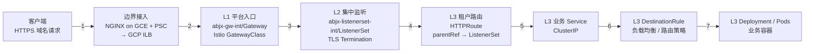

# ASM Solo Gateway 流量转发链路(BG/收工状态总结)

> **本文档定位**: 项目当前已完成、可收工;此页用作"下一个服务接入"时的链路复用速查。
> 新接入一个服务时,改的是 **租户命名空间内部的 4 个 YAML**(`Service / Deployment / HTTPRoute / DestinationRule`),其余(平台 Gateway、ListenerSet、TLS Secret、`abjx-gw-int` 与 `abjx-listenerset-int` 命名空间、NetPol)都不动。
> 详细命名 / FQDN / 域名假设见 [`tenant-namespace-newapi-team1-appdev-aibang.md`](../../cloud/k8s/k8s-gateway/tenant-namespace-newapi-team1-appdev-aibang.md),本文忽略具体命名,只固化流程骨架。

---

## 0. 一句话流程

**Client → 公网/内网入口 → Gateway(Istio GatewayClass) → ListenerSet(TLS 终结)→ HTTPRoute(租户分发)→ Service → DestinationRule(策略)→ Pods**

七个阶段,平台侧三块固定、租户侧一块可复制 — 新服务只复制最后一块。

---

## 1. 角色与命名空间(三层)

| 层 | 命名空间 | 资源 | 谁拥有 | 改动频率 |
|---|---|---|---|---|
| **L1 平台入口** | `abjx-gw-int` | `Gateway`(由 Istio GatewayClass 实现) | 平台/基础设施团队 | **冻结**(收工后不动) |
| **L2 集中监听** | `abjx-listenerset-int` | `ListenerSet` + TLS Secret(通配证书) | 平台/共享层团队 | **冻结**(收工后不动) |
| **L3 租户业务** | `user-rt-ns` / `runtime-int` 等 | `HTTPRoute` / `Service` / `DestinationRule` / `Deployment` / `Pods` | 租户团队 | **每次新服务 = 复制这一层** |

> 这正是 Gateway API 的"角色分离"模型(详见 [`k8s-gateway-api-report.md`](../../cloud/k8s/k8s-gateway/k8s-gateway-api-report.md))。Gateway 用 `spec.allowedRoutes` 显式声明哪类 namespace 可绑,ListenerSet 用 `parentRef` 挂到 Gateway,HTTPRoute 再用 `parentRef` 挂回 ListenerSet — 任何错位绑定都会被 gateway controller 在 admit 阶段拒掉,这是多租户安全的根本边界。

---

## 2. 端到端七阶段(冻结版流程)



### 详细步骤(每步只描述"改的是什么、不改的是什么")

| # | 阶段 | 改 | 不改 |
|---|------|----|------|
| 1 | **客户端 → 边界接入** — 客户端发 HTTPS 请求到目标域名;先经 GCE 上的 NGINX(端口代理 / 协议收敛),再通过 PSC Service Attachment 进入 GCP 内网,送达集群前端 ILB | NGINX 配置 / PSC / ILB | 域名后端锚点(= L1 Gateway) |
| 2 | **边界接入 → Gateway (L1)** — ILB 把流量直接送达 `abjx-gw-int` 里 Gateway 资源的 Service 后端(Istio 注入的 Service) | — | `abjx-gw-int` 命名空间 + Gateway 资源 |
| 3 | **Gateway → ListenerSet (L2)** — Gateway 持有 listener 占位,**真正的 listener 配置由 ListenerSet 通过 `parentRef` 注入**;此处完成 TLS 终结(加载通配 Secret) | — | `abjx-listenerset-int` 命名空间 + ListenerSet 资源 + TLS Secret |
| 4 | **ListenerSet → HTTPRoute (L3,租户侧)** — 流量现在按 hostname/path 分发;ListenerSet 把请求分给各租户 namespace 里 `parentRef` 指到它的 HTTPRoute | **各租户新增 / 修改 HTTPRoute** | ListenerSet 自身的 hostname/sectionName/TLS |
| 5 | **HTTPRoute → Service** — HTTPRoute 把匹配的请求转发到租户 namespace 内的 ClusterIP Service | Service(端口 / selector) | HTTPRoute 的 host/path(可能新增一条 rule) |
| 6 | **Service → DestinationRule** — 同一流量在到达 Pod 前,先经过租户 namespace 内的 DestinationRule(连接池 / outlier / TLS to upstream / load balancing policy) | DestinationRule(mTLS / outlierDetection / connectionPool) | Service selector |
| 7 | **DestinationRule → Pods** — 最终送达 Deployment 管理的 Pod | Deployment / 镜像 / Probe / 资源限制 | — |

---

## 3. 收工状态下"哪些是固定资产、哪些是可复制模板"

### 3.1 固定资产(本次收工后 == 不动)

- **L1 `abjx-gw-int/Gateway`** — 由 Istio GatewayClass 实现,只持有 listener 占位;真正的 listener 由 L2 ListenerSet 注入。
- **L2 `abjx-listenerset-int/ListenerSet`** — 集中持有 hostname(如 `*.teamlevel.caep.uk`)、TLS 终结、引用通配证书 Secret。
- **L1 + L2 的 NetworkPolicy** — `k8s-gateway-netpol.md` 列出的 gateway ns 全集 default-deny + 精确放行规则,只允许 Istio 控制面组件、ListenerSet ns、必要的 Prometheus 抓取通过。
- **TLS Secret** — 通配证书放在 `abjx-listenerset-int`(由平台/共享层管),ListenerSet 通过 `tls.certificateRefs` 引用。

### 3.2 可复制模板(每次加服务只动这一层)

下面 4 个 YAML 是**唯一需要为新服务从零 apply 的资源**:

```yaml
# 1. Service
kind: Service                # ClusterIP 即可(Gateway API 链路不需 NodePort/LB)
spec.selector: {app: <svc>}
spec.ports: [{port: 80, targetPort: <containerPort>}]

# 2. Deployment
kind: Deployment
spec.template.spec.containers[].image: <image>
spec.template.spec.containers[].ports: [{containerPort: <port>}]

# 3. HTTPRoute         ← 关键是 parentRefs 指回 ListenerSet
kind: HTTPRoute
spec.parentRefs:
  - group: gateway.networking.k8s.io
    kind: ListenerSet
    name: <ls-name>          # ⚠️ 必须先 kubectl get 拿到实际名
    sectionName: https       # ⚠️ 必须先 kubectl get 拿到实际 sectionName
spec.hostnames: [<新服务 FQDN>]
spec.rules[].backendRefs[].kind: Service
spec.rules[].backendRefs[].name: <svc-name>

# 4. DestinationRule   ← 生产环境必加(连接池 / outlier / mTLS)
kind: DestinationRule
spec.host: <svc>.<ns>.svc.cluster.local   # 或 *.svc.cluster.local 通配
spec.trafficPolicy: {connectionPool: {...}, outlierDetection: {...}}
```

具体 yaml 完整模板 + 命名约定见 [`tenant-namespace-newapi-team1-appdev-aibang.md` §3](../../cloud/k8s/k8s-gateway/tenant-namespace-newapi-team1-appdev-aibang.md)。

### 3.3 易错点(从 ListenerSet 上踩过的坑)

- ⚠️ **`HTTPRoute.parentRefs` 写错 ListenerSet 名 / sectionName** → controller 在 admit 直接拒,curl 返回 404 而不是 5xx;先 `kubectl get listenerset -n <ns> -o yaml` 取实际名。
- ⚠️ **ListenerSet.hostname 通配不够** → HTTPRoute 无法被 listener 接受,curl 404。
- ⚠️ **证书 Secret 不在 ListenerSet 引用的命名空间** → TLS 终结失败,客户端报证书错误而非流量错误。
- ⚠️ **HTTPRoute 与 Gateway 都各自声明 hostname** → 必须 ListenerSet 的 hostname **包含** HTTPRoute 的 hostnames(最严格允许模式),否则双向握手失败。
- ⚠️ **HTTPRoute 跨 ns 绑 Gateway** → 必须 Gateway `spec.allowedRoutes.namespaces.selector` 显式选到你的租户 ns label,否则拒。

---

## 4. 下一个服务接入的最小动作清单

```text
[ ] kubectl get listenerset -n <租户ns> -o yaml    → 拿到 ls-name / sectionName / hostname 通配
[ ] kubectl get secret    -n <监听ns> -l is-tls=true    → 确认通配证书确实存在
[ ] kubectl get gateway   -n abjx-gw-int -o yaml        → 确认 Gateway 还在 Programmed=True
[ ] apply 4 个 YAML: Service / Deployment / HTTPRoute / DestinationRule
[ ] 用 k8s-gateway-fqdn-minimax.sh(或同等 curl)验证 200
[ ] 必要时给新租户 ns 复制 k8s-gateway-netpol.md §2 的 default-deny + 精确放行规则
```

---

## 5. 权威证据 / 最终定型依据

本流程总结按以下现有文档为唯一依据,不再展开实现细节:

- 链路 e2e + 4 个 YAML 完整模板 → [`cloud/k8s/k8s-gateway/tenant-namespace-newapi-team1-appdev-aibang.md`](../../cloud/k8s/k8s-gateway/tenant-namespace-newapi-team1-appdev-aibang.md) §1 / §3
- Gateway API 三层角色模型 + 跨命名空间绑定约束 → [`cloud/k8s/k8s-gateway/k8s-gateway-api-report.md`](../../cloud/k8s/k8s-gateway/k8s-gateway-api-report.md) §2 / §3
- Gateway / Tenant 两侧 NetworkPolicy 现行规则集 → [`cloud/k8s/k8s-gateway/k8s-gateway-netpol.md`](../../cloud/k8s/k8s-gateway/k8s-gateway-netpol.md) §1 / §2
- ListenerSet 自身 yaml + SNI/TLS 终结方式 → [`cloud/k8s/k8s-gateway/ListenerSet.html`](../../cloud/k8s/k8s-gateway/ListenerSet.html)
- 服务 timeout / 探活 / DR 字段调优 → [`cloud/k8s/k8s-gateway/explorer-k8s-gateway-timeout.md`](../../cloud/k8s/k8s-gateway/explorer-k8s-gateway-timeout.md) + [`DestinationRule*.md`](../../cloud/k8s/k8s-gateway/)
