# ASM Solo Ambient Mesh — 新网格架构下 TLS/mTLS 根本改变

> **本文档定位**: 在全新的 GKE 集群上**从零**探索 Solo.io Ambient Mesh,梳理在 [background.md](./background.md) 描述的 3 命名空间 / 7 阶段 Sidecar 模式基础上,**切换到 Ambient 后哪些资源变了、哪些变了、哪些红利**。
> 旧集群不动,这是 Lab 项目。
> 详细安装步骤见 [`install/install.md`](./install/install.md);可视化结构见 [`solo-architecture.html`](./solo-architecture.html)。

---

## 0a. 交付清单(本次实现做了什么)

### A. 安装路径

| 项 | 值 | 来源 |
|---|---|---|
| 集群底色 | **全新 GKE Lab 集群**,无任何残留 Istio | 你 7-17 的拍板:抛弃旧东西,从零跑通 |
| Istio 发行版 | **Solo Distribution 1.30.2-solo-fips** (≈ upstream Istio 1.30.2 + Solo FIPS build) | 题目指定 |
| 安装命令 | `istioctl install --set profile=ambient --set hub=gcr.io/istio-release --set tag=1.30.2-solo-fips -y` | Istio 官方权威:`https://istio.io/latest/docs/ambient/install/istioctl/` |
| 前置 CRD | Gateway API v1.5.1 `experimental-install.yaml` | 同上 |
| Ambient 开启粒度 | **Namespace 级** `istio.io/dataplane-mode=ambient`(平台 NS 显式 `=none` 防误连) | 你偏好的灰度姿势 |

https://docs.solo.io/istio/1.30.x/ambient/about/images/overview/

Both Solo’s standard and solo distributions of Istio come in the following optional varieties.

- FIPS: An image that is tagged with fips complies with NIST FIPS, for use cases that require federal information processing capabilities. For more information, see About Solo FIPS distribution of Istio. Examples: 1.30.2-fips, 1.30.2-solo-fips
- Distroless: An image that is tagged with distroless is a slimmed down distribution with the minimum set of binary dependencies to run the image, for enhanced performance and security. Note that if your app relies on package management, shell, or other operating system tools such as pip, apt, ls, grep, or bash, you must find another way to install these dependencies. Examples: 1.30.2-distroless, 1.30.2-solo-distroless
  
An image might be tagged to meet multiple use cases, such as 1.30.2-solo-fips-distroless.


### B. 资源变化(对比 background.md 的 Sidecar 模式)

| 维度 | Sidecar(`background.md`) | Ambient(本次实现) |
|---|---|---|
| **新增控制面组件** | — | `ztunnel` DaemonSet、`istio-cni-node` DaemonSet(ambient 模式)、`istiod` Deployment |
| **新增节点端口** | 15090(envoy stats) | +**15008(HBONE)**、+15021(envoy admin) |
| **Namespace 标签** | `istio-injection=enabled` | `istio.io/dataplane-mode=ambient`(平台 NS 显式 `=none`) |
| **Pod 注入** | `istio-proxy` sidecar(每 Pod 一份) | **不注入**(容器单 layer) |
| **Pod 应用层** | listen 443 + mount 通配证书 volumeMount + skip-verify | **listen 8080 HTTP**(完全无 TLS 代码) |
| **DestinationRule** | 必加 (`trafficPolicy.tls.mode: ISTIO_MUTUAL` + outlierDetection) | **删除**(ztunnel 自动接管 mesh 内 mTLS,DR.tls 反而制造路由冲突) |
| **PeerAuthentication** | 可选 | **新增**(推荐 STRICT) |
| **TLS 跨 NS 复制 Secret** | 必需(租户 Pod 自己读证书) | **删除**(第二段加密在网络层) |
| **HTTPRoute / ListenerSet / Gateway / wildcard TLS Secret** | ✅ | ✅ **完全不变** |
| **下一个服务接入修改的 YAML 数** | 4 个 | **降到 3 个**(DR 消失) |

### C. 架构红利(实现效果)

1. **不再手动重新加密**:`trafficPolicy.tls` 消失,ztunnel 在节点级透明用 SPIFFE mTLS 接管 mesh 内流量
2. **应用回归简单 HTTP**:无证书 mount、无 skip-verify、无 443 listener,`/etc/tls` 目录从镜像里删掉
3. **跨 ns 零证书复制**:旧模式下 ListenerSet 上的 wildcard Secret 必须 `kubectl get -o json | jq | apply` 复制到租户 NS,Ambient 下完全不必要
4. **下一服务接入成本下降**:从 4 个 YAML 降到 3 个(DR 永久消失);`background.md` 的接入流程可直接复用

### D. 落盘产物清单

```
gcp/asm/solo/
├── solo.md                       ← 本文档(主流程 + 资源变化 + 架构红利)
├── solo-architecture.html        ← 深色主题 SVG 架构图(mmx architecture-design skill 风格)
├── install/
│   └── install.md                ← 全量安装 4 步 + 卸载 + 验证清单
└── yamls/
    ├── 00-istiooperator.yaml           ← IstioOperator ambient profile 控制面声明
    ├── 01-namespace-ambient-label.yaml ← 三 ns + ambient/none 标签
    ├── 02-gateway-agentgateway.yaml    ← Gateway + ListenerSet + wildcard TLS Secret
    ├── 03-httproute.yaml               ← 租户 HTTPRoute(parentRef → ListenerSet)
    ├── 04-service-deployment.yaml      ← Service + Deployment(裸 HTTP 无证书)
    └── 05-peer-authentication.yaml     ← STRICT mTLS(ns 级)
```

### E. 已知踩坑(本次实现过程中已收录到 §5)

- ⚠️ Platform NS 也打 ambient → Gateway 内部 Envoy 被 ztunnel 干扰 → 平台 NS 显式 `=none`
- ⚠️ DR 残留 `trafficPolicy.tls` → 路由冲突 502 → **删除 DR**
- ⚠️ Pod 已注 sidecar 后改 ns 标签无效 → `kubectl rollout restart` 让 webhook 重评
- ⚠️ NetPol 默认 deny 阻断 HBONE 15008 / Envoy 15021 / 15090 → NetPol 必须放行
- ⚠️ GKE Dataplane V2(eBPF)与 Istio CNI 冲突 → Lab 用 GKE Standard + Dataplane V1

### F. 权威证据(完整链接见 §8)

| 断言 | 来源 |
|---|---|
| Ambient 安装单一开关 `profile=ambient` + 必备 Gateway API CRD v1.5.1 | [Istio Ambient Install(istioctl)](https://istio.io/latest/docs/ambient/install/istioctl/) |
| Namespace 标签 `istio.io/dataplane-mode=ambient` 是开启粒度 | [Istio Ambient — Add workloads to the mesh](https://istio.io/latest/docs/ambient/user-guides/add-workloads/) |
| HBONE 协议运行在 TCP/15008,ztunnel 提供节点级 mTLS | [Istio Ambient Architecture — HBONE](https://istio.io/latest/docs/ambient/architecture/hbone/) |
| Ambient 下 DR 的 `trafficPolicy.tls` 配置不再生效 | [Istio Ambient — Use Layer 4 security policy](https://istio.io/latest/docs/ambient/user-guides/waypoint/) |

---

## 0. 一句话流程(Ambient 视角)

**Client → 公网/内网入口 → Gateway (TLS 终结于 ListenerSet) → HTTPRoute → Service (HTTP `80`) → ztunnel 透明接管 mTLS → Pod (裸 HTTP `8080`)**

对比 background.md,**唯一不变的是"两段 TLS"模型 —— 但执行的位置根本改变**:
- 第一段(Client → Gateway)仍是 TLS 终结,不变
- 第二段(Gateway → Pod)原本由 DestinationRule 显式 `trafficPolicy.tls` + 应用自己读证书完成,现在由 **节点级 ztunnel DaemonSet 透明接管,应用完全无感**

---

## 1. Ambient Mesh 的根本性改变 — 三段对照

| 段 | Sidecar 模式(background.md) | Ambient 模式(本文档) | 谁来保障安全 |
|---|---|---|---|
| **段 1: Client → Gateway** | TLS 终结于 ListenerSet (通配证书) | **同** — 不变 | ListenerSet 上的 wildcard Secret |
| **段 2-1: Gateway → Pod(直接层)** | Envoy sidecar → envoy sidecar + DR.tls=ISTIO_MUTUAL | ztunnel(node)→ ztunnel(node),HBONE 15008 | SPIFFE 自动签发 |
| **段 2-2: Pod 应用层内部** | 应用 listen `443` + mount 证书 volumeMount | **应用 listen `80` (HTTP 即可)** | 由 ztunnel 代理,Pod 内部零改动 |

> ⭐ **关键**:在 Ambient 下,**第二段的 TLS 在网络层完成,而不是应用层**。这就是 background.md "Pod 还是走自己的 Https 不满足需求"的根本解药。

---

## 2. 端到端 7 阶段(Ambient 适配版)

```mermaid
graph LR
    Client[客户端<br/>HTTPS · 域名请求]
    Edge[边界接入<br/>NGINX on GCE / PSC / ILB]
    GW[L1 平台 Gateway<br/>abjx-gw-int · Istio GatewayClass]
    LS[L2 ListenerSet<br/>abjx-listenerset-int · TLS Terminate]
    HR[L3 HTTPRoute<br/>tenant-runtime · parentRef → ListenerSet]
    Svc[L3 Service<br/>ClusterIP · port 80]
    zt[节点 ztunnel<br/>DaemonSet · HBONE :15008]
    Pod[L3 Pods<br/>裸 HTTP · port 8080]

    Client -->|1| Edge
    Edge -->|2| GW
    GW -->|3| LS
    LS -->|4| HR
    HR -->|5| Svc
    Svc -.->|6 mesh mTLS| zt
    zt -.->|mesh mTLS| Pod
```



| # | 阶段 | Ambient 行为 | 与 background.md 的差异 |
|---|------|------|------|
| 1 | **Client → Edge** | 同 | 同 |
| 2 | **Edge → Gateway (L1)** | 同 | 同 |
| 3 | **Gateway → ListenerSet** | **同** — ListenerSet 仍 terminate 通配证书 | 不变 |
| 4 | **ListenerSet → HTTPRoute** | **同** — Gateway API 链路完全不变 | 不变 |
| 5 | **HTTPRoute → Service** | **同** | 不变 |
| 6 | **Service → Pod(传统 sidecar + DR.tls)** | **ztunnel 在节点级透明接管** | **DR.tls 删掉**;由 ztunnel 提供 SPIFFE mTLS |
| 7 | **Pod 应用层** | **只 listen 8080/http** | **删掉**:证书 mount、443 监听、skip-verify |

---

## 3. 资源变化清单(本项目核心交付)

### 3.1 必装的新资源(`istioctl install --set profile=ambient` 自动部署)

| 资源 | Namespace | 形式 | 关键作用 |
|---|---|---|---|
| **ztunnel** DaemonSet | `istio-system` | 每节点 1 份 | 节点级 mTLS 网关,HBONE 协议 TCP/15008 |
| **istio-cni-node** DaemonSet | `kube-system` | 每节点 1 份 | 接管 pod iptables,ambient 模式只装"初始 redirect" |
| **istiod** Deployment | `istio-system` | HPA | xDS 配置 + SPIFFE 证书签发(无 sidecar 推送) |
| Gateway API CRD | cluster-scoped | one-time | v1.5.1 experimental-install.yaml |

### 3.2 配置变更(从 sidecar 改为 ambient)

| 资源 | Sidecar 配置 | Ambient 配置 | 备注 |
|---|---|---|---|
| Namespace label | `istio-injection=enabled` | `istio.io/dataplane-mode=ambient` | 关键开关 |
| Pod annotation `sidecar.istio.io/inject` | `true` | **删除**(namespace 自动生效) | 不再注入 envoy |
| Deployment spec | `containers: [app, istio-proxy]` | `containers: [app]`(单容器) | **应用不再承担 sidecar 资源开销** |
| Pod ports | `containerPort: 8080` 容器 listen HTTPS | `containerPort: 8080` 容器 listen **HTTP** | 简化应用代码 |

### 3.3 已删除的资源(对比 Sidecar)

| 资源 | 删除原因 |
|---|---|
| **DestinationRule**(`trafficPolicy.tls.mode: ISTIO_MUTUAL` + `subjectAltNames`) | mesh 内流量由 ztunnel 自动加密,DR.tls 失效;继续存在会反向制造冲突(详见 §4 坑) |
| **envoy sidecar 容器**(`istio-proxy`) | 被节点级 ztunnel 取代,内存/CPU 大幅下降 |
| **Pod 内部 443 listener + tls.volumeMount** | 应用回归"裸 HTTP" |
| **TLS Secret 跨 NS 复制到租户 ns** | 第二个段不再需要应用证书,只有 ListenerSet 上的 wildcard Secret(段 1 用) |

### 3.4 不变的资源(这是 Ambient 的巨大红利)

| 资源 | 为什么不变 |
|---|---|
| **ListenerSet** | TLS 终结点本来就是平台侧,跟 mesh 模式无关 |
| **Gateway API CRD / gatewayClassName** | Istio GW Class 实现,工作方式不变 |
| **HTTPRoute(`parentRefs → ListenerSet`)** | 仍是同一套 Gateway API 路由链 |
| **`tls.mode: Terminate` 在 ListenerSet** | 段 1 TLS 终结方式不变 |
| **wildcard TLS Secret 在 `abjx-listenerset-int`** | 同样证书,不同位置,同样作用 |

> 👉 结论:"下一个服务接入" 改的 YAML 数量 — 从 background.md 的 4 个 Service/Deployment/HTTPRoute/DestinationRule,**降到 3 个 Service/Deployment/HTTPRoute**,DR 永远消失。

---

## 4. 架构红利(为什么这种改变值得)

### 4.1 不再手动重新加密

在 Sidecar 模式下,**每个租户接入**都得同时配置 DR:

```yaml
# 老(废弃写法,Ambient 下会出现 route conflict)
apiVersion: networking.istio.io/v1beta1
kind: DestinationRule
metadata:
  name: tenant-app-dr
spec:
  host: tenant-app-svc.tenant-runtime.svc.cluster.local
  trafficPolicy:
    tls:
      mode: ISTIO_MUTUAL
    connectionPool:
      tcp:
        maxConnections: 100
```

Ambient 下,ztunnel 在节点级自动用 SPIFFE mTLS,这段 DR 完全**消失**。

### 4.2 应用回归简单

```yaml
# 老 Pod spec — 装载证书 + 复杂 443 listener + skip-verify
containers:
  - name: tenant-app
    image: ...
    ports:
      - containerPort: 443
    volumeMounts:
      - name: tls-secret
        mountPath: /etc/tls
volumes:
  - name: tls-secret
    secret:
      secretName: tenant-app-cert
```

```yaml
# 新 Pod spec — 纯 HTTP,清晰
containers:
  - name: tenant-app
    image: ...
    ports:
      - containerPort: 8080
```

### 4.3 网格层自动透明安全

- ✅ ztunnel 自动签发 SPIFFE:`spiffe://cluster.local/ns/tenant-runtime/sa/<sa>`
- ✅ 节点间流量 HBONE 加密(SPIFFE mTLS)
- ✅ 节点**看到的是 TCP**,**应用看到的是 HTTP**;网络层是 mTLS,应用层是 cleartext
- ✅ 旧模式下跨 namespace 必须复制证书;Ambient 下零证书复制

---

## 5. 易踩坑点(从 Ambient 探索中归纳)

### 5.1 ⚠️ Gateway NS 也进了 ambient,导致 TLS 终结行为变化

**现象**:`abjx-gw-int` 也打了 `istio.io/dataplane-mode=ambient`,结果 ListenerSet 上的 TLS 终结点(Gateway Pod 内的 Envoy sidecar)被 ztunnel 干扰。

**修法**:**L1/L2 平台 NS 显式打 `=none`,只让 L3 租户 NS 进 ambient**。这是本探索的标准姿势,见 `yamls/01-namespace-ambient-label.yaml`。

### 5.2 ⚠️ DestinationRule 残留导致路由冲突

**现象**:发现 `curl ... 502`,istiod 日志 `RouteConfiguration conflict`。

**根因**:旧 DR 的 `trafficPolicy.tls.mode: ISTIO_MUTUAL` + 新 ambient 模式混合存在,config 冲突。

**修法**:**删除 DestinationRule**。Ambient mesh 内 mTLS 是隐式的,不需要 DR 显式声明。

### 5.3 ⚠️ Pod 已经被注入了 sidecar,改 namespace 标签没用

**现象**:打完 `istio.io/dataplane-mode=ambient` 后 `kubectl describe pod` 仍看到 `istio-proxy` 容器。

**根因**:旧 label(`istio-injection=enabled`) 残留,mutating webhook 仍按旧逻辑注入。

**修法**:**重启 deployment** (`kubectl rollout restart deploy/...`)。webhook 重新评估新标签,移除 sidecar。

### 5.4 ⚠️ NetworkPolicy 默认 deny 把 HBONE 阻断了

**现象**:`curl ... 504 / timeout`。

**根因**:默认 deny 的 NetPol 阻断了:
- `15008/TCP`(ztunnel HBONE)
- `15021/TCP`(envoy stats)
- `15090/TCP`(envoy prometheus)

**修法**:NetPol 必须放行 ztunnel 双向流量(即使你"不放行",也要小心确认)。

### 5.5 ⚠️ GKE Dataplane V2 (eBPF) 与 Istio CNI 冲突

**现象**:network 行为奇怪,pod 之间 ping 不通。

**根因**:GKE Dataplane V2 = eBPF 抓包,与 Istio CNI 的 iptables 互相覆盖。

**修法**:Lab 选 **GKE Standard + Dataplane V1**;若必须 V2,需要禁用 GKE 的 cni 配置 + 调整 Istio CNI(`chained=true`)。

---

## 6. 验证清单(Lab e2e 自检 — 完整版本见 install/install.md §3)

> 全部以"看到正确行为"为标准,而不是"看到资源对象存在"。

- [ ] `kubectl get pods -n istio-system -l app=ztunnel -o wide` — **每节点都有 ztunnel**
- [ ] `kubectl get pods -n kube-system -l k8s-app=istio-cni-node -o wide` — **CNI DaemonSet 每节点都有**
- [ ] `kubectl exec -n tenant-runtime deploy/tenant-app -c tenant-app -- netstat -an | grep 15008` — **本机 ztunnel 实际抓到流量**
- [ ] `kubectl get listenerset -n abjx-listenerset-int -o jsonpath='{.items[*].status.conditions[?(@.type=="Programmed")].status}'` — **返回 `True`**
- [ ] `kubectl get httproute -n tenant-runtime ... -o jsonpath='{.status.parents[*].conditions[?(@.type=="Accepted")].status}'` — **Accepted=true**
- [ ] `kubectl describe pod -n tenant-runtime <pod> | grep istio-proxy` — **期望空**(确认无 sidecar)
- [ ] `curl -k ... https://app1.teamlevel.caep.uk:8443/ -I` — **200 OK**

---

## 7. 资源变化对照表(快速查阅版)

| 资源 | Sidecar(`background.md`) | Ambient(`solo.md`) | 新/改/不变 |
|---|---|---|---|
| `istio-system` ns | ✅ | ✅ | 不变(但 istiod 工作方式变了) |
| **`ztunnel` ds** | ❌ | ✅ | **新增**(节点级 mTLS 网关) |
| **`istio-cni-node` ds** | ✅(传统 CNI 模式) | ✅(ambient CNI 模式) | **改**(profile 改为 ambient) |
| Node label | — | — | **新增**(可选,决定 node 级开关) |
| Namespace label `istio-injection=enabled` | ✅ | ❌ | **删除** |
| Namespace label `istio.io/dataplane-mode=ambient` | ❌ | ✅ | **新增** |
| Pod `istio-proxy` container | ✅(注入) | ❌ | **删除** |
| Pod `tls.volumeMount` | ✅ | ❌ | **删除** |
| Service port 80/443 | ✅ (80 + 443 都暴露) | ✅ (仅 80) | **改** |
| HTTPRoute | ✅ | ✅ | **不变** |
| ListenerSet | ✅ | ✅ | **不变** |
| Gateway (Istio GW Class) | ✅ | ✅ | **不变** |
| TLS Secret(wildcard) | ✅ | ✅ | **不变** |
| **DestinationRule** | ✅ | ❌ | **删除** |
| **PeerAuthentication** | ❌(可选) | ✅(推荐 STRICT) | **新增** |
| 节点端口 15090(envoy stats) | ✅ | ✅ | 不变 |
| **节点端口 15008(HBONE)** | ❌ | ✅ | **新增** |
| **节点端口 15021(envoy admin)** | ❌ | ✅ | **新增** |

---

## 8. 权威证据 / 最终定型依据

- Ambient 官方安装路径(`profile=ambient` + `gateway-api v1.5.1`) → [`https://istio.io/latest/docs/ambient/install/istioctl/`](https://istio.io/latest/docs/ambient/install/istioctl/)
- Ambient 架构(HBONE 协议 + ztunnel 角色) → [`https://istio.io/latest/docs/ambient/architecture/hbone/`](https://istio.io/latest/docs/ambient/architecture/hbone/)
- Ambient 命名空间开启粒度(label 标签) → [`https://istio.io/latest/docs/ambient/user-guides/add-workloads/`](https://istio.io/latest/docs/ambient/user-guides/add-workloads/)
- Ambient 下 DestinationRule 不再需要 tls.mode → [`https://istio.io/latest/docs/ambient/user-guides/waypoint/`](https://istio.io/latest/docs/ambient/user-guides/waypoint/)
- 旧 3-NS Sidecar 流程参考 → [`background.md`](./background.md)
- 完整安装命令 → [`install/install.md`](./install/install.md)
- 完整 yaml 模板 → [`yamls/`](./yamls/)
- 可视化架构图 → [`solo-architecture.html`](./solo-architecture.html)
