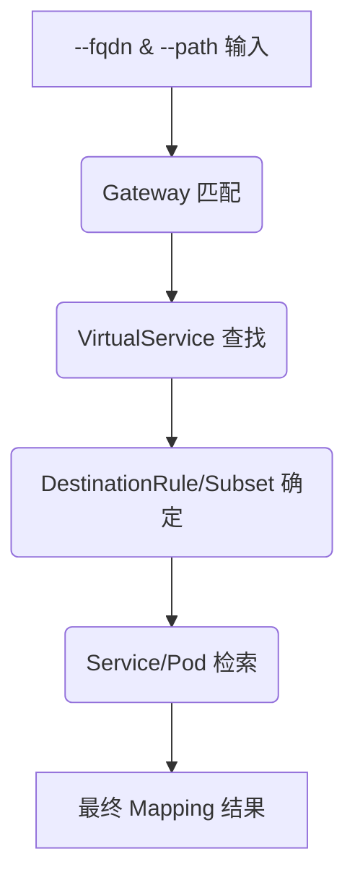
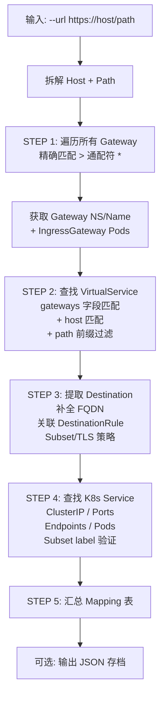

---

# 仅追踪（不导出 YAML）
./trace-istio.sh --url https://api.example.com/v1/health

# 追踪 + 导出干净 YAML（默认目录: ./istio-trace-api-example-com-20240428120000/）
./trace-istio.sh --url https://api.example.com/v1/health --export-yaml

# 指定输出目录
./trace-istio.sh --url https://api.example.com/v1/health --export-yaml --out-dir ./my-api-templates

# 追踪 + YAML + JSON
./trace-istio.sh --url https://api.example.com/v1/health --export-yaml --json --out-dir ./output


# requirement 

在 GKE 管理的 Istio (Anthos Service Mesh / Managed ASM) 环境中，要将流量入口到后端服务的全链路资产串联起来，核心挑战在于 Istio 资源的松耦合特性（通过标签和选择器匹配，而非直接引用）。
要实现从入口 FQDN 到后端 Service 的全链路自动化梳理，建议采用 “逆向递归” 或 “拓扑链条” 的思路。

## 1. 核心映射逻辑梳理

你可以将整个流程拆解为以下四个关键的“锚点”：

### 第一步：定位流量入口 (Gateway)

*   **输入：** 目标域名 (FQDN)。
*   **逻辑：** 遍历集群中所有的 `Gateway` 资源，检查其 `servers.hosts` 列表。
*   **获取：** 匹配到该 FQDN 的 `Gateway` 名称及其所在的 `Namespace`。同时，通过 Gateway 的 `selector`（通常是 `istio: ingressgateway`）可以确认流量经过的具体入口负载均衡器。

### 第二步：关联路由规则 (VirtualService)

*   **输入：** 第一步拿到的 `Gateway` 名称。
*   **逻辑：** 查找 `gateways` 字段中包含该 `Gateway` 名称（格式通常为 `namespace/gateway-name`）的所有 `VirtualService`。
*   **过滤：** 根据你提到的入参（如 `/prefix/version`），匹配 `http.match.uri` 中的前缀。
*   **获取：** 匹配成功的 `http.route.destination.host`。

### 第三步：确定后端目标 (DestinationRule)

*   **逻辑：** `VirtualService` 指向的 `host` 可能是一个短域名（如 `my-svc`）。
*   **处理：**
    *   如果 `VirtualService` 跨 Namespace，需要解析其 FQDN 全称。
    *   检查是否存在对应的 `DestinationRule`。虽然这不是必须的，但如果你需要获取具体的 Subset（版本信息）或 TLS 设置，必须在此步骤关联 `DestinationRule`。

### 第四步：映射到 Kubernetes 实体 (Service & Pods)

*   **逻辑：** 拿着 `host` (Service Name) 去对应的 Namespace 下查找 `v1.Service`。
*   **获取：**
    *   Service 的 `ClusterIP`、`Ports`。
    *   Service 的 `selector`，进而可以查找到后端的 `Pods`。

## 2. 推荐的实现方案：递归发现算法

你可以设计一个脚本，接受 `--fqdn` 和 `--path` 作为初始入参，按以下流程执行：

### 流程图示



### 逻辑伪代码思路

1.  **Context 确定：** 调用 `kubectl get gateway -A` 找到匹配 `hosts` 的 Gateway。
2.  **路由检索：**

    ```bash
    # 查找关联了该 Gateway 的 VirtualService
    kubectl get vs -A -o json | jq '.items[] | select(.spec.gateways[] | contains("GATEWAY_NAME"))'
    ```

3.  **路径匹配：** 在结果中循环 `spec.http[]`，匹配 `match.uri` 是否符合你输入的 `/prefix`。
4.  **目标提取：** 从 `route.destination.host` 提取后端服务名。
5.  **元数据聚合：**
    *   通过 `host` 查找 `Service` 的 Label。
    *   通过 `DestinationRule` 查找流量策略（如是否开启了 mTLS）。

### 3. 实现中的几个坑（注意事项）

*   **全限定域名 (FQDN) 的处理：** Istio 里的 `host` 可能是 `my-svc`，也可能是 `my-svc.my-ns.svc.cluster.local`。脚本需要具备将短域名补全的能力，否则在跨 Namespace 匹配时会失效。
*   **通配符 host：** 很多 Gateway 的 host 配置为 `*`。这种情况下，你的脚本需要具备“回退机制”，即如果精确匹配不到 FQDN，则查找 host 为 `*` 的 Gateway。
*   **多 Destination 权重：** 一个 `VirtualService` 可能会将流量切分到多个 `destination`（灰度发布场景）。脚本需要考虑到输出结果可能是一个列表，而不仅仅是一个服务。
*   **Managed ASM 的特殊性：** 在 Google Managed Istio 中，控制面由 Google 管理，但资源对象（CRDs）依然存在于你的集群中，因此标准的 `kubectl` 或 `client-go` 逻辑完全通用。

## 总结建议的入参设计

为了让脚本最灵活，建议入参设计为：
`./trace-istio.sh --url https://api.example.com/v1/health`

脚本内部逻辑：

1.  拆解 URL 得到 `api.example.com` (Host) 和 `/v1/health` (Path)。
2.  按上述 Gateway -> VS -> DR -> Service 的链路层层过滤。
3.  最终输出一个 JSON 或表格，包含每一层对应的资源名称、Namespace 以及最终指向的 Endpoint IP。
```

好的，我来为你实现这个完整的 Istio 全链路追踪脚本。
```bash
#!/usr/bin/env bash
# =============================================================================
# trace-istio.sh — Istio 全链路资产追踪 + YAML 模板导出脚本
# 用途: 从 URL 反向追踪 Gateway -> VirtualService -> DestinationRule -> Service -> Deployment
#       并将每个关键资源导出为干净的 YAML 模板（可直接用于新 API onboarding）
# 依赖: kubectl, jq, bash >= 4.0
# 用法: ./trace-istio.sh --url https://api.example.com/v1/health
#       ./trace-istio.sh --url https://api.example.com/v1/health --export-yaml
#       ./trace-istio.sh --url https://api.example.com/v1/health --export-yaml --out-dir ./my-templates
# =============================================================================

set -euo pipefail

# --------------------------------------------------------------------------- #
# 颜色 & 格式化
# --------------------------------------------------------------------------- #
RED='\033[0;31m'; YELLOW='\033[1;33m'; GREEN='\033[0;32m'
CYAN='\033[0;36m'; BLUE='\033[0;34m'; BOLD='\033[1m'; RESET='\033[0m'
MAGENTA='\033[0;35m'; WHITE='\033[1;37m'

info()    { echo -e "${CYAN}[INFO]${RESET}  $*"; }
warn()    { echo -e "${YELLOW}[WARN]${RESET}  $*"; }
error()   { echo -e "${RED}[ERROR]${RESET} $*" >&2; }
success() { echo -e "${GREEN}[OK]${RESET}   $*"; }
section() { echo -e "\n${BOLD}${BLUE}══════════════════════════════════════════════════${RESET}"; \
            echo -e "${BOLD}${WHITE}  $*${RESET}"; \
            echo -e "${BOLD}${BLUE}══════════════════════════════════════════════════${RESET}"; }
row()     { printf "  ${CYAN}%-28s${RESET} %s\n" "$1" "$2"; }

# --------------------------------------------------------------------------- #
# 参数解析
# --------------------------------------------------------------------------- #
TARGET_URL=""
HINT_NS=""             # 可选：缩小搜索范围
OUTPUT_JSON=false      # --json 输出原始 JSON
EXPORT_YAML=false      # --export-yaml 导出干净 YAML 模板
OUT_DIR=""             # --out-dir 指定输出目录

usage() {
  cat <<EOF
用法: $(basename "$0") --url <URL> [OPTIONS]

  --url           目标 URL，例如 https://api.example.com/v1/health
  --namespace     可选，指定 Gateway 所在 Namespace，加速搜索
  --json          同时输出原始 JSON 数据到 <out-dir>/trace-output.json
  --export-yaml   导出链路中每个资源的干净 YAML 模板（可直接用于新 API onboarding）
  --out-dir DIR   指定 YAML/JSON 输出目录（默认: ./istio-trace-<host>-<timestamp>）
  -h, --help      显示帮助

示例:
  $(basename "$0") --url https://api.example.com/v1/health
  $(basename "$0") --url https://api.example.com/v1/health --export-yaml
  $(basename "$0") --url https://api.example.com/v1/health --export-yaml --out-dir ./templates --json
EOF
  exit 0
}

while [[ $# -gt 0 ]]; do
  case "$1" in
    --url)         TARGET_URL="$2"; shift 2 ;;
    --namespace)   HINT_NS="$2";    shift 2 ;;
    --json)        OUTPUT_JSON=true; shift ;;
    --export-yaml) EXPORT_YAML=true; shift ;;
    --out-dir)     OUT_DIR="$2"; shift 2 ;;
    -h|--help)     usage ;;
    *) error "未知参数: $1"; usage ;;
  esac
done

[[ -z "$TARGET_URL" ]] && { error "--url 参数必填"; usage; }

# --------------------------------------------------------------------------- #
# URL 拆解
# --------------------------------------------------------------------------- #
# 去掉 schema，提取 host 和 path
_no_schema="${TARGET_URL#*://}"
INPUT_HOST="${_no_schema%%/*}"
INPUT_PATH="/${_no_schema#*/}"
# 如果没有路径，默认 /
[[ "$INPUT_PATH" == "/$INPUT_HOST" || "$INPUT_PATH" == "/" ]] && INPUT_PATH="/"

# --------------------------------------------------------------------------- #
# 依赖检查
# --------------------------------------------------------------------------- #
for cmd in kubectl jq; do
  command -v "$cmd" &>/dev/null || { error "缺少依赖: $cmd"; exit 1; }
done

# --------------------------------------------------------------------------- #
# 全局 JSON 结果对象（用于 --json 输出）
# --------------------------------------------------------------------------- #
RESULT_JSON='{}'

append_json() {
  local key="$1" val="$2"
  RESULT_JSON=$(echo "$RESULT_JSON" | jq --argjson v "$val" ". + {\"$key\": \$v}")
}

# --------------------------------------------------------------------------- #
# 输出目录初始化
# --------------------------------------------------------------------------- #
_HOST_SLUG=$(echo "$INPUT_HOST" | tr '.' '-')
_TIMESTAMP=$(date +%Y%m%d%H%M%S)
[[ -z "$OUT_DIR" ]] && OUT_DIR="./istio-trace-${_HOST_SLUG}-${_TIMESTAMP}"

if [[ "$EXPORT_YAML" == true || "$OUTPUT_JSON" == true ]]; then
  mkdir -p "$OUT_DIR"
  info "输出目录: $(realpath "$OUT_DIR")"
fi

# --------------------------------------------------------------------------- #
# clean_yaml: 从 kubectl get -o yaml 结果中去除运行时噪声字段
# 用法: clean_yaml <kind> <name> <namespace> [<out_file>]
# --------------------------------------------------------------------------- #
clean_yaml() {
  local kind="$1" name="$2" ns="$3" out_file="${4:-}"

  local raw
  raw=$(kubectl get "$kind" "$name" -n "$ns" -o yaml 2>/dev/null) || {
    warn "无法获取 ${kind}/${name} -n ${ns}"; return 1
  }

  # 用 kubectl 自带 --export 已废弃，改用 jq/python 清洗
  # 去除字段: metadata.{managedFields, resourceVersion, uid, generation,
  #           creationTimestamp, annotations."kubectl.kubernetes.io/last-applied-configuration"}
  # 去除: status 块
  local cleaned
  cleaned=$(echo "$raw" | python3 -c "
import sys, yaml, json

data = yaml.safe_load(sys.stdin)
if not data:
    sys.exit(0)

# 清洗 metadata
meta = data.get('metadata', {})
for field in ['managedFields', 'resourceVersion', 'uid', 'generation',
              'creationTimestamp', 'selfLink']:
    meta.pop(field, None)

# 清洗 annotations
ann = meta.get('annotations', {})
ann.pop('kubectl.kubernetes.io/last-applied-configuration', None)
ann.pop('deployment.kubernetes.io/revision', None)
# 去掉所有 kubectl/k8s 内部 annotation (可选，按需开启)
# meta['annotations'] = {k: v for k, v in ann.items() if not k.startswith('kubectl.')}
if not ann:
    meta.pop('annotations', None)

# 去掉 status 块（完全清空）
data.pop('status', None)

# 对 Deployment: 清洗 pod template 的 runtime 字段
if data.get('kind') == 'Deployment':
    spec = data.get('spec', {})
    tmpl_meta = spec.get('template', {}).get('metadata', {})
    for f in ['creationTimestamp']:
        tmpl_meta.pop(f, None)

print(yaml.dump(data, default_flow_style=False, allow_unicode=True, sort_keys=False))
" 2>/dev/null) || {
    warn "python3 yaml 模块不可用，回退到 jq 清洗..."
    cleaned=$(echo "$raw" | kubectl neat 2>/dev/null || \
      echo "$raw" | python3 -c "
import sys
lines = sys.stdin.readlines()
skip = False
result = []
skip_keys = {'  managedFields:', '  resourceVersion:', '  uid:', '  generation:',
             '  creationTimestamp:', '  selfLink:', 'status:'}
i = 0
while i < len(lines):
    line = lines[i]
    stripped = line.strip()
    # 跳过 status 整块
    if line.startswith('status:'):
        i += 1
        while i < len(lines) and (lines[i].startswith(' ') or lines[i] == '\n'):
            i += 1
        continue
    # 跳过 managedFields 块
    if '  managedFields:' in line:
        i += 1
        while i < len(lines) and lines[i].startswith('  - ') or (i < len(lines) and lines[i].startswith('    ')):
            i += 1
        continue
    # 跳过单行噪声字段
    skip_this = False
    for k in ['  resourceVersion:', '  uid:', '  generation:', '  creationTimestamp:', '  selfLink:']:
        if line.strip().startswith(k.strip()):
            skip_this = True; break
    if not skip_this:
        result.append(line)
    i += 1
print(''.join(result))
")
  }

  if [[ -n "$out_file" ]]; then
    {
      echo "# ============================================================"
      echo "# Resource : ${kind}/${name}"
      echo "# Namespace: ${ns}"
      echo "# Exported : $(date -u '+%Y-%m-%dT%H:%M:%SZ')"
      echo "# Source   : $TARGET_URL"
      echo "# NOTE     : 已去除 status/managedFields/uid/resourceVersion 等运行时字段"
      echo "#            可直接修改后 kubectl apply -f 使用"
      echo "# ============================================================"
      echo ""
      echo "$cleaned"
    } > "$out_file"
    success "  → $(basename "$out_file")"
  else
    echo "$cleaned"
  fi
}

# --------------------------------------------------------------------------- #
# export_resource: 统一入口，判断是否需要写文件
# 用法: export_resource <kind> <name> <namespace> <label_prefix>
# --------------------------------------------------------------------------- #
export_resource() {
  local kind="$1" name="$2" ns="$3" prefix="$4"
  if [[ "$EXPORT_YAML" == true ]]; then
    local fname="${OUT_DIR}/${prefix}-$(echo "$ns" | tr '/' '-')-${name}.yaml"
    clean_yaml "$kind" "$name" "$ns" "$fname"
  fi
}


section "🚀 Istio 全链路追踪"
row "目标 URL"   "$TARGET_URL"
row "解析 Host"  "$INPUT_HOST"
row "解析 Path"  "$INPUT_PATH"
[[ -n "$HINT_NS" ]] && row "Hint NS" "$HINT_NS"
echo ""

# =============================================================================
# STEP 1: 定位 Gateway
# =============================================================================
section "📍 STEP 1 — 定位 Gateway"

info "拉取所有 Gateway 资源..."
GW_NS_FLAG="${HINT_NS:+-n $HINT_NS}"
ALL_GW_JSON=$(kubectl get gateway ${GW_NS_FLAG:--A} -o json 2>/dev/null || echo '{"items":[]}')

GW_COUNT=$(echo "$ALL_GW_JSON" | jq '.items | length')
info "共发现 ${GW_COUNT} 个 Gateway"

# 匹配逻辑：精确 host 匹配，或 * 通配
MATCHED_GW=$(echo "$ALL_GW_JSON" | jq --arg host "$INPUT_HOST" '
  [ .items[] |
    . as $gw |
    (.metadata.namespace) as $ns |
    (.metadata.name) as $name |
    (.spec.selector // {}) as $sel |
    [ .spec.servers[]?.hosts[]? |
      select(. == $host or . == "*" or
             (startswith("*.") and ($host | endswith(ltrimstr("*", .))))
      )
    ] |
    if length > 0 then {
      name: $name,
      namespace: $ns,
      selector: $sel,
      matched_host: .[0],
      is_wildcard: (.[0] == "*")
    } else empty end
  ] | sort_by(.is_wildcard)  # 精确匹配排前面
')

GW_MATCH_COUNT=$(echo "$MATCHED_GW" | jq 'length')

if [[ "$GW_MATCH_COUNT" -eq 0 ]]; then
  error "未找到匹配 host='$INPUT_HOST' 的 Gateway（含通配符 *）"
  exit 1
fi

echo "$MATCHED_GW" | jq -r '.[] | "  \(if .is_wildcard then "⚠ [通配符]" else "✓ [精确]" end) \(.namespace)/\(.name)  matched_host=\(.matched_host)  selector=\(.selector | to_entries | map("\(.key)=\(.value)") | join(","))"'

# 取第一个（精确优先）
SELECTED_GW=$(echo "$MATCHED_GW" | jq '.[0]')
GW_NAME=$(echo "$SELECTED_GW" | jq -r '.name')
GW_NS=$(echo "$SELECTED_GW" | jq -r '.namespace')
GW_SELECTOR=$(echo "$SELECTED_GW" | jq -r '.selector | to_entries | map("\(.key)=\(.value)") | join(",")')

echo ""
success "使用 Gateway: ${GW_NS}/${GW_NAME}  (selector: ${GW_SELECTOR})"

# 查找 IngressGateway Pod
info "查找 IngressGateway Pod (selector: ${GW_SELECTOR})..."
IGW_PODS=$(kubectl get pods -A -l "$GW_SELECTOR" \
  --no-headers -o custom-columns="NS:.metadata.namespace,NAME:.metadata.name,STATUS:.status.phase,IP:.status.podIP" 2>/dev/null || true)

if [[ -n "$IGW_PODS" ]]; then
  echo -e "\n  ${BOLD}IngressGateway Pods:${RESET}"
  echo "$IGW_PODS" | while read -r line; do echo "    $line"; done
else
  warn "未找到对应的 IngressGateway Pod，selector 可能不在默认 Namespace"
fi

append_json "gateway" "$SELECTED_GW"

# 导出 Gateway YAML
export_resource "gateway" "$GW_NAME" "$GW_NS" "01-gateway"

# =============================================================================
# STEP 2: 关联 VirtualService
# =============================================================================
section "🔀 STEP 2 — 关联 VirtualService"

info "拉取所有 VirtualService..."
ALL_VS_JSON=$(kubectl get virtualservice -A -o json 2>/dev/null || echo '{"items":[]}')

VS_COUNT=$(echo "$ALL_VS_JSON" | jq '.items | length')
info "共发现 ${VS_COUNT} 个 VirtualService"

# VS 匹配逻辑：gateways 字段包含 GW_NAME 或 GW_NS/GW_NAME
MATCHED_VS=$(echo "$ALL_VS_JSON" | jq --arg gwname "$GW_NAME" --arg gwns "$GW_NS" --arg host "$INPUT_HOST" --arg path "$INPUT_PATH" '
  [ .items[] |
    . as $vs |
    (.metadata.namespace) as $vsns |
    select(
      .spec.gateways // [] |
      any(
        . == $gwname or
        . == "\($gwns)/\($gwname)" or
        . == "mesh"
      )
    ) |
    # 同时检查 vs.spec.hosts 是否匹配
    select(
      .spec.hosts // [] |
      any(. == $host or . == "*")
    ) |
    {
      name: .metadata.name,
      namespace: $vsns,
      gateways: (.spec.gateways // []),
      hosts: (.spec.hosts // []),
      http_routes: [ (.spec.http // [])[] |
        . as $http |
        {
          match_uris: [ (.match // [])[]?.uri | to_entries[] | "\(.key)=\(.value)" ],
          route_destinations: [ (.route // [])[] | {
            host: .destination.host,
            subset: .destination.subset,
            port: .destination.port.number,
            weight: .weight
          }],
          headers: (.headers // null),
          retries: (.retries // null),
          timeout: (.timeout // null)
        }
      ]
    }
  ]
')

VS_MATCH_COUNT=$(echo "$MATCHED_VS" | jq 'length')
if [[ "$VS_MATCH_COUNT" -eq 0 ]]; then
  error "未找到关联 Gateway '${GW_NS}/${GW_NAME}' 且 host 匹配的 VirtualService"
  exit 1
fi

info "找到 ${VS_MATCH_COUNT} 个候选 VirtualService"

# Path 过滤：匹配 INPUT_PATH 前缀
PATH_MATCHED_VS=$(echo "$MATCHED_VS" | jq --arg path "$INPUT_PATH" '
  [ .[] |
    . as $vs |
    (.http_routes | map(
      select(
        .match_uris == [] or
        (.match_uris | any(
          (startswith("prefix=") and ($path | startswith(ltrimstr("prefix=", .)))) or
          (startswith("exact=") and (ltrimstr("exact=", .) == $path)) or
          (startswith("regex=") )
        ))
      )
    )) as $matched_routes |
    if ($matched_routes | length) > 0 then
      $vs + {matched_routes: $matched_routes}
    else empty end
  ]
')

PATH_MATCH_COUNT=$(echo "$PATH_MATCHED_VS" | jq 'length')
if [[ "$PATH_MATCH_COUNT" -eq 0 ]]; then
  warn "路径 '${INPUT_PATH}' 无精确匹配，回退显示所有关联 VirtualService"
  PATH_MATCHED_VS="$MATCHED_VS"
  PATH_MATCHED_VS=$(echo "$MATCHED_VS" | jq '[.[] | . + {matched_routes: .http_routes}]')
fi

echo "$PATH_MATCHED_VS" | jq -r '.[] | "  ✓ \(.namespace)/\(.name)  hosts=\(.hosts | join(","))"'

append_json "virtualservices" "$PATH_MATCHED_VS"

# =============================================================================
# STEP 3: 提取 Destinations & DestinationRule
# =============================================================================
section "🎯 STEP 3 — 提取 Destination & DestinationRule"

info "拉取所有 DestinationRule..."
ALL_DR_JSON=$(kubectl get destinationrule -A -o json 2>/dev/null || echo '{"items":[]}')

# 从匹配的 VS 中提取所有 destination host
ALL_DEST_JSON=$(echo "$PATH_MATCHED_VS" | jq '
  [ .[] |
    .namespace as $vsns |
    .matched_routes[]?.route_destinations[]? |
    {
      raw_host: .host,
      subset: .subset,
      port: .port,
      weight: .weight,
      vs_namespace: $vsns
    }
  ] | unique_by(.raw_host + (.subset // ""))
')

DEST_COUNT=$(echo "$ALL_DEST_JSON" | jq 'length')
info "发现 ${DEST_COUNT} 个 Destination"

# 为每个 destination 补全 FQDN 并关联 DR
ENRICHED_DEST=$(echo "$ALL_DEST_JSON" | jq --argjson drs "$ALL_DR_JSON" '
  [ .[] |
    . as $dest |
    ($dest.raw_host) as $rh |
    ($dest.vs_namespace) as $vsns |
    # 补全 FQDN
    (if ($rh | contains(".svc.cluster.local")) then $rh
     elif ($rh | contains(".")) then $rh
     else "\($rh).\($vsns).svc.cluster.local" end) as $fqdn |
    # 短名称（用于 Service 查找）
    ($rh | split(".")[0]) as $svcname |
    # 关联 DestinationRule
    ([ $drs.items[] |
       select(
         .spec.host == $rh or
         .spec.host == $fqdn or
         (.spec.host | split(".")[0]) == $svcname
       ) |
       {
         name: .metadata.name,
         namespace: .metadata.namespace,
         host: .spec.host,
         subsets: (.spec.subsets // []),
         trafficPolicy: (.spec.trafficPolicy // null)
       }
    ]) as $matched_drs |
    $dest + {
      fqdn: $fqdn,
      svc_name: $svcname,
      destination_rules: $matched_drs
    }
  ]
')

echo "$ENRICHED_DEST" | jq -r '.[] | 
  "  ✓ host=\(.raw_host)  subset=\(.subset // "-")  port=\(.port // "-")  weight=\(.weight // 100)",
  "    FQDN: \(.fqdn)",
  (if (.destination_rules | length) > 0 then
    "    DestinationRule: \(.destination_rules | map("\(.namespace)/\(.name)") | join(", "))"
  else
    "    DestinationRule: (无)"
  end)'

append_json "destinations" "$ENRICHED_DEST"

# 导出 VirtualService YAML（每个匹配的 VS）
if [[ "$EXPORT_YAML" == true ]]; then
  info "导出 VirtualService YAML..."
  while IFS= read -r vs_item; do
    _vs_name=$(echo "$vs_item" | jq -r '.name')
    _vs_ns=$(echo "$vs_item" | jq -r '.namespace')
    export_resource "virtualservice" "$_vs_name" "$_vs_ns" "02-virtualservice"
  done < <(echo "$PATH_MATCHED_VS" | jq -c '.[]')
fi

# 导出 DestinationRule YAML
if [[ "$EXPORT_YAML" == true ]]; then
  info "导出 DestinationRule YAML..."
  echo "$ENRICHED_DEST" | jq -c '[.[].destination_rules[] | {name,namespace}] | unique[]' | \
  while IFS= read -r dr_item; do
    _dr_name=$(echo "$dr_item" | jq -r '.name')
    _dr_ns=$(echo "$dr_item" | jq -r '.namespace')
    export_resource "destinationrule" "$_dr_name" "$_dr_ns" "03-destinationrule"
  done
fi

# =============================================================================
# STEP 4: 映射 Kubernetes Service & Pods
# =============================================================================
section "⚙️  STEP 4 — Kubernetes Service & Endpoints & Pods"

SVC_DETAIL_LIST='[]'

while IFS= read -r dest_item; do
  SVC_NAME=$(echo "$dest_item" | jq -r '.svc_name')
  SVC_NS=$(echo "$dest_item" | jq -r '.vs_namespace')
  SUBSET=$(echo "$dest_item" | jq -r '.subset // ""')

  info "查找 Service: ${SVC_NS}/${SVC_NAME}"

  SVC_JSON=$(kubectl get service "$SVC_NAME" -n "$SVC_NS" -o json 2>/dev/null || echo 'null')

  if [[ "$SVC_JSON" == "null" ]]; then
    warn "Service '${SVC_NS}/${SVC_NAME}' 不存在，尝试跨 Namespace 搜索..."
    SVC_JSON=$(kubectl get service "$SVC_NAME" -A -o json 2>/dev/null | jq '.items[0] // null')
    [[ "$SVC_JSON" == "null" ]] && { warn "Service '$SVC_NAME' 未找到，跳过"; continue; }
    SVC_NS=$(echo "$SVC_JSON" | jq -r '.metadata.namespace')
    info "在 Namespace '$SVC_NS' 找到 Service"
  fi

  SVC_LABELS=$(echo "$SVC_JSON" | jq -r '.metadata.labels // {} | to_entries | map("\(.key)=\(.value)") | join(",")')
  SVC_SELECTOR=$(echo "$SVC_JSON" | jq -r '.spec.selector // {} | to_entries | map("\(.key)=\(.value)") | join(",")')
  SVC_CLUSTERIP=$(echo "$SVC_JSON" | jq -r '.spec.clusterIP // "-"')
  SVC_TYPE=$(echo "$SVC_JSON" | jq -r '.spec.type // "-"')
  SVC_PORTS=$(echo "$SVC_JSON" | jq -r '.spec.ports // [] | map("\(.port)/\(.protocol // "TCP") -> \(.targetPort)") | join(", ")')

  echo -e "\n  ${BOLD}Service: ${SVC_NS}/${SVC_NAME}${RESET}"
  row "  Type"       "$SVC_TYPE"
  row "  ClusterIP"  "$SVC_CLUSTERIP"
  row "  Ports"      "$SVC_PORTS"
  row "  Selector"   "${SVC_SELECTOR:-'(无 selector)'}"
  row "  Labels"     "${SVC_LABELS}"

  # Endpoints
  EP_JSON=$(kubectl get endpoints "$SVC_NAME" -n "$SVC_NS" -o json 2>/dev/null || echo 'null')
  EP_ADDRS=$(echo "$EP_JSON" | jq -r '
    [ .subsets[]?.addresses[]? | "\(.ip):\(.targetRef.name // "?")" ] | join(", ")
  ' 2>/dev/null || echo "-")
  row "  Endpoints"  "${EP_ADDRS:-'(无就绪 Endpoint)'}"

  # Pods
  POD_INFO=""
  if [[ -n "$SVC_SELECTOR" ]]; then
    POD_JSON=$(kubectl get pods -n "$SVC_NS" -l "$SVC_SELECTOR" -o json 2>/dev/null || echo '{"items":[]}')
    POD_COUNT=$(echo "$POD_JSON" | jq '.items | length')
    row "  Pod 数量"   "$POD_COUNT"

    if [[ "$POD_COUNT" -gt 0 ]]; then
      echo -e "\n  ${BOLD}  Pod 列表:${RESET}"
      POD_INFO=$(echo "$POD_JSON" | jq -r '
        .items[] |
        "    \(.metadata.name)  IP=\(.status.podIP // "-")  Node=\(.spec.nodeName // "-")  Phase=\(.status.phase // "-")  Ready=\(
          [.status.containerStatuses[]?.ready] | all | if . then "✓" else "✗" end
        )  Version=\(.metadata.labels["version"] // .metadata.labels["app.kubernetes.io/version"] // "-")"
      ')
      echo "$POD_INFO"
    fi

    # Subset 版本验证
    if [[ -n "$SUBSET" && "$SUBSET" != "null" ]]; then
      echo ""
      info "验证 Subset='${SUBSET}' 的 Pod 匹配..."
      DR_SUBSET_LABELS=$(echo "$dest_item" | jq -r --arg sub "$SUBSET" '
        .destination_rules[0].subsets // [] |
        map(select(.name == $sub)) |
        .[0].labels // {} |
        to_entries | map("\(.key)=\(.value)") | join(",")
      ')
      if [[ -n "$DR_SUBSET_LABELS" ]]; then
        SUBSET_PODS=$(kubectl get pods -n "$SVC_NS" -l "${SVC_SELECTOR},${DR_SUBSET_LABELS}" --no-headers \
          -o custom-columns="NAME:.metadata.name,IP:.status.podIP,PHASE:.status.phase" 2>/dev/null | wc -l | tr -d ' ')
        row "  Subset Pods" "${SUBSET_PODS} 个 (labels: ${DR_SUBSET_LABELS})"
      else
        warn "Subset '${SUBSET}' 在 DestinationRule 中未定义 labels"
      fi
    fi
  else
    warn "Service 无 selector（可能是 ExternalName 或 Headless）"
  fi

  # 组装 SVC detail JSON
  SVC_DETAIL=$(jq -n \
    --arg name "$SVC_NAME" \
    --arg ns "$SVC_NS" \
    --arg clusterip "$SVC_CLUSTERIP" \
    --arg type "$SVC_TYPE" \
    --arg ports "$SVC_PORTS" \
    --arg selector "$SVC_SELECTOR" \
    --arg endpoints "$EP_ADDRS" \
    --arg podinfo "$POD_INFO" \
    '{name: $name, namespace: $ns, clusterIP: $clusterip, type: $type, ports: $ports, selector: $selector, endpoints: $endpoints, pods: $podinfo}')

  SVC_DETAIL_LIST=$(echo "$SVC_DETAIL_LIST" | jq --argjson s "$SVC_DETAIL" '. + [$s]')

  # ── 导出 Service YAML ──────────────────────────────────────────────────────
  export_resource "service" "$SVC_NAME" "$SVC_NS" "04-service"

  # ── 查找并导出关联的 Deployment ────────────────────────────────────────────
  if [[ -n "$SVC_SELECTOR" ]]; then
    info "查找关联 Deployment (selector: ${SVC_SELECTOR})..."
    DEPLOY_JSON=$(kubectl get deployment -n "$SVC_NS" -o json 2>/dev/null || echo '{"items":[]}')
    # 找到 selector matchLabels 包含 Service selector 的 Deployment
    MATCHED_DEPLOYS=$(echo "$DEPLOY_JSON" | jq -r --arg sel "$SVC_SELECTOR" '
      ( $sel | split(",") | map(split("=") | {key: .[0], value: .[1]}) ) as $pairs |
      [ .items[] |
        . as $d |
        (.spec.selector.matchLabels // {}) as $ml |
        select(
          $pairs | all(.key as $k | .value as $v | $ml[$k] == $v)
        ) |
        .metadata.name
      ] | .[]
    ' 2>/dev/null || true)

    if [[ -n "$MATCHED_DEPLOYS" ]]; then
      echo -e "\n  ${BOLD}  关联 Deployment:${RESET}"
      while IFS= read -r deploy_name; do
        [[ -z "$deploy_name" ]] && continue
        row "    Deployment" "${SVC_NS}/${deploy_name}"
        export_resource "deployment" "$deploy_name" "$SVC_NS" "05-deployment"
      done <<< "$MATCHED_DEPLOYS"
    else
      warn "未找到匹配 selector '${SVC_SELECTOR}' 的 Deployment（可能是 StatefulSet 或其他控制器）"
      # 尝试 StatefulSet
      SS_JSON=$(kubectl get statefulset -n "$SVC_NS" -o json 2>/dev/null || echo '{"items":[]}')
      MATCHED_SS=$(echo "$SS_JSON" | jq -r --arg sel "$SVC_SELECTOR" '
        ( $sel | split(",") | map(split("=") | {key: .[0], value: .[1]}) ) as $pairs |
        [ .items[] |
          (.spec.selector.matchLabels // {}) as $ml |
          select($pairs | all(.key as $k | .value as $v | $ml[$k] == $v)) |
          .metadata.name
        ] | .[]
      ' 2>/dev/null || true)
      if [[ -n "$MATCHED_SS" ]]; then
        while IFS= read -r ss_name; do
          [[ -z "$ss_name" ]] && continue
          row "    StatefulSet" "${SVC_NS}/${ss_name}"
          export_resource "statefulset" "$ss_name" "$SVC_NS" "05-statefulset"
        done <<< "$MATCHED_SS"
      fi
    fi
  fi

done < <(echo "$ENRICHED_DEST" | jq -c '.[]')

append_json "services" "$SVC_DETAIL_LIST"

# =============================================================================
# STEP 5: 汇总 Mapping 表
# =============================================================================
section "📊 STEP 5 — 全链路 Mapping 汇总"

echo -e "${BOLD}"
printf "  %-18s %-35s %-25s\n" "层级" "资源 (Namespace/Name)" "关键信息"
echo -e "${RESET}${BLUE}  ──────────────────────────────────────────────────────────────────────────────${RESET}"

printf "  ${GREEN}%-18s${RESET} %-35s %-25s\n" \
  "[1] Gateway" \
  "${GW_NS}/${GW_NAME}" \
  "selector: ${GW_SELECTOR}"

echo "$PATH_MATCHED_VS" | jq -r '.[] | "\(.namespace)/\(.name)|\(.hosts | join(","))"' | while IFS='|' read -r vsref vshosts; do
  printf "  ${YELLOW}%-18s${RESET} %-35s %-25s\n" "[2] VirtualService" "$vsref" "hosts: $vshosts"
done

echo "$ENRICHED_DEST" | jq -r '.[] | "\(.raw_host)|\(.subset // "-")|\(.port // "-")|\(.weight // 100)|\(.destination_rules | map(.namespace + "/" + .name) | join(",") | if . == "" then "(无DR)" else . end)"' | \
while IFS='|' read -r h sub port wt dr; do
  printf "  ${MAGENTA}%-18s${RESET} %-35s %-25s\n" "[3] Destination" "host: $h  subset: $sub" "port: $port  weight: ${wt}%"
  [[ "$dr" != "(无DR)" ]] && printf "  ${MAGENTA}%-18s${RESET} %-35s\n" "  DestinationRule" "$dr"
done

echo "$SVC_DETAIL_LIST" | jq -r '.[] | "\(.namespace)/\(.name)|\(.clusterIP)|\(.ports)|\(.endpoints)"' | while IFS='|' read -r sref cip ports ep; do
  printf "  ${CYAN}%-18s${RESET} %-35s %-25s\n" "[4] Service" "$sref" "ClusterIP: $cip"
  printf "  ${CYAN}%-18s${RESET} %-35s\n" "    Ports" "$ports"
  printf "  ${CYAN}%-18s${RESET} %-35s\n" "    Endpoints" "${ep:-'(无)'}"
done

echo -e "${BLUE}  ──────────────────────────────────────────────────────────────────────────────${RESET}"
echo ""
success "链路追踪完成！"

# =============================================================================
# STEP 6: YAML 导出文件索引
# =============================================================================
if [[ "$EXPORT_YAML" == true ]]; then
  section "📁 STEP 6 — YAML 模板导出清单"
  echo -e "  输出目录: ${BOLD}$(realpath "$OUT_DIR")${RESET}\n"

  YAML_FILES_FOUND=false
  declare -A KIND_EMOJI=(
    ["gateway"]="🌐" ["virtualservice"]="🔀" ["destinationrule"]="🎯"
    ["service"]="⚙️ " ["deployment"]="🚀" ["statefulset"]="🗄️ "
  )

  # 按文件名顺序列出（01- 02- ...保证顺序）
  while IFS= read -r fpath; do
    [[ ! -f "$fpath" ]] && continue
    YAML_FILES_FOUND=true
    fname=$(basename "$fpath")
    fsize=$(wc -l < "$fpath")
    # 从文件头注释提取资源信息
    res_line=$(grep "^# Resource" "$fpath" 2>/dev/null | head -1 | sed 's/# Resource *: *//')
    ns_line=$(grep "^# Namespace" "$fpath" 2>/dev/null | head -1 | sed 's/# Namespace *: *//')
    kind_key=$(echo "$fname" | sed 's/^[0-9]*-//' | cut -d'-' -f1)
    emoji="${KIND_EMOJI[$kind_key]:-📄}"
    printf "  %s  ${BOLD}%-45s${RESET}  %s  [%d lines]\n" \
      "$emoji" "$fname" "ns: $ns_line" "$fsize"
  done < <(find "$OUT_DIR" -name "*.yaml" | sort)

  if [[ "$YAML_FILES_FOUND" == false ]]; then
    warn "未生成任何 YAML 文件（可能资源不存在或权限不足）"
  else
    echo ""
    echo -e "  ${BOLD}使用方式:${RESET}"
    echo -e "  ${CYAN}# 查看某个模板${RESET}"
    echo -e "  cat ${OUT_DIR}/02-virtualservice-*.yaml"
    echo ""
    echo -e "  ${CYAN}# 修改后直接 apply（新 API onboarding）${RESET}"
    echo -e "  kubectl apply -f ${OUT_DIR}/02-virtualservice-*.yaml"
    echo ""
    echo -e "  ${CYAN}# 一键 apply 全部（按顺序）${RESET}"
    echo -e "  for f in \$(ls ${OUT_DIR}/*.yaml | sort); do kubectl apply -f \$f; done"
  fi
fi

# =============================================================================
# JSON 输出
# =============================================================================
if [[ "$OUTPUT_JSON" == true ]]; then
  OUT_FILE="./trace-output-$(date +%Y%m%d%H%M%S).json"
  FINAL_JSON=$(jq -n \
    --arg url "$TARGET_URL" \
    --arg host "$INPUT_HOST" \
    --arg path "$INPUT_PATH" \
    --argjson result "$RESULT_JSON" \
    '{ traced_at: (now | strftime("%Y-%m-%dT%H:%M:%SZ")), input: {url: $url, host: $host, path: $path}, chain: $result }')
  echo "$FINAL_JSON" > "$OUT_FILE"
  success "JSON 结果已写入: $OUT_FILE"
fi
```


```bash
#!/usr/bin/env bash
# =============================================================================
# trace-istio.sh — Istio 全链路资产追踪脚本
# 用途: 从 URL 反向追踪 Gateway -> VirtualService -> DestinationRule -> Service -> Pods
# 依赖: kubectl, jq, bash >= 4.0
# 用法: ./trace-istio.sh --url https://api.example.com/v1/health
#       ./trace-istio.sh --url https://api.example.com/v1/health --namespace istio-system
# =============================================================================

set -euo pipefail

# --------------------------------------------------------------------------- #
# 颜色 & 格式化
# --------------------------------------------------------------------------- #
RED='\033[0;31m'; YELLOW='\033[1;33m'; GREEN='\033[0;32m'
CYAN='\033[0;36m'; BLUE='\033[0;34m'; BOLD='\033[1m'; RESET='\033[0m'
MAGENTA='\033[0;35m'; WHITE='\033[1;37m'

info()    { echo -e "${CYAN}[INFO]${RESET}  $*"; }
warn()    { echo -e "${YELLOW}[WARN]${RESET}  $*"; }
error()   { echo -e "${RED}[ERROR]${RESET} $*" >&2; }
success() { echo -e "${GREEN}[OK]${RESET}   $*"; }
section() { echo -e "\n${BOLD}${BLUE}══════════════════════════════════════════════════${RESET}"; \
            echo -e "${BOLD}${WHITE}  $*${RESET}"; \
            echo -e "${BOLD}${BLUE}══════════════════════════════════════════════════${RESET}"; }
row()     { printf "  ${CYAN}%-28s${RESET} %s\n" "$1" "$2"; }

# --------------------------------------------------------------------------- #
# 参数解析
# --------------------------------------------------------------------------- #
TARGET_URL=""
HINT_NS=""          # 可选：缩小搜索范围
OUTPUT_JSON=false   # --json 输出原始 JSON

usage() {
  cat <<EOF
用法: $(basename "$0") --url <URL> [--namespace <ns>] [--json]

  --url         目标 URL，例如 https://api.example.com/v1/health
  --namespace   可选，指定 Gateway 所在 Namespace，加速搜索
  --json        同时输出原始 JSON 数据到 ./trace-output.json
  -h, --help    显示帮助

示例:
  $(basename "$0") --url https://api.example.com/v1/health
  $(basename "$0") --url https://api.example.com/v1/health --namespace istio-system --json
EOF
  exit 0
}

while [[ $# -gt 0 ]]; do
  case "$1" in
    --url)       TARGET_URL="$2"; shift 2 ;;
    --namespace) HINT_NS="$2";    shift 2 ;;
    --json)      OUTPUT_JSON=true; shift ;;
    -h|--help)   usage ;;
    *) error "未知参数: $1"; usage ;;
  esac
done

[[ -z "$TARGET_URL" ]] && { error "--url 参数必填"; usage; }

# --------------------------------------------------------------------------- #
# URL 拆解
# --------------------------------------------------------------------------- #
# 去掉 schema，提取 host 和 path
_no_schema="${TARGET_URL#*://}"
INPUT_HOST="${_no_schema%%/*}"
INPUT_PATH="/${_no_schema#*/}"
# 如果没有路径，默认 /
[[ "$INPUT_PATH" == "/$INPUT_HOST" || "$INPUT_PATH" == "/" ]] && INPUT_PATH="/"

# --------------------------------------------------------------------------- #
# 依赖检查
# --------------------------------------------------------------------------- #
for cmd in kubectl jq; do
  command -v "$cmd" &>/dev/null || { error "缺少依赖: $cmd"; exit 1; }
done

# --------------------------------------------------------------------------- #
# 全局 JSON 结果对象（用于 --json 输出）
# --------------------------------------------------------------------------- #
RESULT_JSON='{}'

append_json() {
  local key="$1" val="$2"
  RESULT_JSON=$(echo "$RESULT_JSON" | jq --argjson v "$val" ". + {\"$key\": \$v}")
}

# =============================================================================
# STEP 0: 打印追踪目标
# =============================================================================
section "🚀 Istio 全链路追踪"
row "目标 URL"   "$TARGET_URL"
row "解析 Host"  "$INPUT_HOST"
row "解析 Path"  "$INPUT_PATH"
[[ -n "$HINT_NS" ]] && row "Hint NS" "$HINT_NS"
echo ""

# =============================================================================
# STEP 1: 定位 Gateway
# =============================================================================
section "📍 STEP 1 — 定位 Gateway"

info "拉取所有 Gateway 资源..."
GW_NS_FLAG="${HINT_NS:+-n $HINT_NS}"
ALL_GW_JSON=$(kubectl get gateway ${GW_NS_FLAG:--A} -o json 2>/dev/null || echo '{"items":[]}')

GW_COUNT=$(echo "$ALL_GW_JSON" | jq '.items | length')
info "共发现 ${GW_COUNT} 个 Gateway"

# 匹配逻辑：精确 host 匹配，或 * 通配
MATCHED_GW=$(echo "$ALL_GW_JSON" | jq --arg host "$INPUT_HOST" '
  [ .items[] |
    . as $gw |
    (.metadata.namespace) as $ns |
    (.metadata.name) as $name |
    (.spec.selector // {}) as $sel |
    [ .spec.servers[]?.hosts[]? |
      select(. == $host or . == "*" or
             (startswith("*.") and ($host | endswith(ltrimstr("*", .))))
      )
    ] |
    if length > 0 then {
      name: $name,
      namespace: $ns,
      selector: $sel,
      matched_host: .[0],
      is_wildcard: (.[0] == "*")
    } else empty end
  ] | sort_by(.is_wildcard)  # 精确匹配排前面
')

GW_MATCH_COUNT=$(echo "$MATCHED_GW" | jq 'length')

if [[ "$GW_MATCH_COUNT" -eq 0 ]]; then
  error "未找到匹配 host='$INPUT_HOST' 的 Gateway（含通配符 *）"
  exit 1
fi

echo "$MATCHED_GW" | jq -r '.[] | "  \(if .is_wildcard then "⚠ [通配符]" else "✓ [精确]" end) \(.namespace)/\(.name)  matched_host=\(.matched_host)  selector=\(.selector | to_entries | map("\(.key)=\(.value)") | join(","))"'

# 取第一个（精确优先）
SELECTED_GW=$(echo "$MATCHED_GW" | jq '.[0]')
GW_NAME=$(echo "$SELECTED_GW" | jq -r '.name')
GW_NS=$(echo "$SELECTED_GW" | jq -r '.namespace')
GW_SELECTOR=$(echo "$SELECTED_GW" | jq -r '.selector | to_entries | map("\(.key)=\(.value)") | join(",")')

echo ""
success "使用 Gateway: ${GW_NS}/${GW_NAME}  (selector: ${GW_SELECTOR})"

# 查找 IngressGateway Pod
info "查找 IngressGateway Pod (selector: ${GW_SELECTOR})..."
IGW_PODS=$(kubectl get pods -A -l "$GW_SELECTOR" \
  --no-headers -o custom-columns="NS:.metadata.namespace,NAME:.metadata.name,STATUS:.status.phase,IP:.status.podIP" 2>/dev/null || true)

if [[ -n "$IGW_PODS" ]]; then
  echo -e "\n  ${BOLD}IngressGateway Pods:${RESET}"
  echo "$IGW_PODS" | while read -r line; do echo "    $line"; done
else
  warn "未找到对应的 IngressGateway Pod，selector 可能不在默认 Namespace"
fi

append_json "gateway" "$SELECTED_GW"

# =============================================================================
# STEP 2: 关联 VirtualService
# =============================================================================
section "🔀 STEP 2 — 关联 VirtualService"

info "拉取所有 VirtualService..."
ALL_VS_JSON=$(kubectl get virtualservice -A -o json 2>/dev/null || echo '{"items":[]}')

VS_COUNT=$(echo "$ALL_VS_JSON" | jq '.items | length')
info "共发现 ${VS_COUNT} 个 VirtualService"

# VS 匹配逻辑：gateways 字段包含 GW_NAME 或 GW_NS/GW_NAME
MATCHED_VS=$(echo "$ALL_VS_JSON" | jq --arg gwname "$GW_NAME" --arg gwns "$GW_NS" --arg host "$INPUT_HOST" --arg path "$INPUT_PATH" '
  [ .items[] |
    . as $vs |
    (.metadata.namespace) as $vsns |
    select(
      .spec.gateways // [] |
      any(
        . == $gwname or
        . == "\($gwns)/\($gwname)" or
        . == "mesh"
      )
    ) |
    # 同时检查 vs.spec.hosts 是否匹配
    select(
      .spec.hosts // [] |
      any(. == $host or . == "*")
    ) |
    {
      name: .metadata.name,
      namespace: $vsns,
      gateways: (.spec.gateways // []),
      hosts: (.spec.hosts // []),
      http_routes: [ (.spec.http // [])[] |
        . as $http |
        {
          match_uris: [ (.match // [])[]?.uri | to_entries[] | "\(.key)=\(.value)" ],
          route_destinations: [ (.route // [])[] | {
            host: .destination.host,
            subset: .destination.subset,
            port: .destination.port.number,
            weight: .weight
          }],
          headers: (.headers // null),
          retries: (.retries // null),
          timeout: (.timeout // null)
        }
      ]
    }
  ]
')

VS_MATCH_COUNT=$(echo "$MATCHED_VS" | jq 'length')
if [[ "$VS_MATCH_COUNT" -eq 0 ]]; then
  error "未找到关联 Gateway '${GW_NS}/${GW_NAME}' 且 host 匹配的 VirtualService"
  exit 1
fi

info "找到 ${VS_MATCH_COUNT} 个候选 VirtualService"

# Path 过滤：匹配 INPUT_PATH 前缀
PATH_MATCHED_VS=$(echo "$MATCHED_VS" | jq --arg path "$INPUT_PATH" '
  [ .[] |
    . as $vs |
    (.http_routes | map(
      select(
        .match_uris == [] or
        (.match_uris | any(
          (startswith("prefix=") and ($path | startswith(ltrimstr("prefix=", .)))) or
          (startswith("exact=") and (ltrimstr("exact=", .) == $path)) or
          (startswith("regex=") )
        ))
      )
    )) as $matched_routes |
    if ($matched_routes | length) > 0 then
      $vs + {matched_routes: $matched_routes}
    else empty end
  ]
')

PATH_MATCH_COUNT=$(echo "$PATH_MATCHED_VS" | jq 'length')
if [[ "$PATH_MATCH_COUNT" -eq 0 ]]; then
  warn "路径 '${INPUT_PATH}' 无精确匹配，回退显示所有关联 VirtualService"
  PATH_MATCHED_VS="$MATCHED_VS"
  PATH_MATCHED_VS=$(echo "$MATCHED_VS" | jq '[.[] | . + {matched_routes: .http_routes}]')
fi

echo "$PATH_MATCHED_VS" | jq -r '.[] | "  ✓ \(.namespace)/\(.name)  hosts=\(.hosts | join(","))"'

append_json "virtualservices" "$PATH_MATCHED_VS"

# =============================================================================
# STEP 3: 提取 Destinations & DestinationRule
# =============================================================================
section "🎯 STEP 3 — 提取 Destination & DestinationRule"

info "拉取所有 DestinationRule..."
ALL_DR_JSON=$(kubectl get destinationrule -A -o json 2>/dev/null || echo '{"items":[]}')

# 从匹配的 VS 中提取所有 destination host
ALL_DEST_JSON=$(echo "$PATH_MATCHED_VS" | jq '
  [ .[] |
    .namespace as $vsns |
    .matched_routes[]?.route_destinations[]? |
    {
      raw_host: .host,
      subset: .subset,
      port: .port,
      weight: .weight,
      vs_namespace: $vsns
    }
  ] | unique_by(.raw_host + (.subset // ""))
')

DEST_COUNT=$(echo "$ALL_DEST_JSON" | jq 'length')
info "发现 ${DEST_COUNT} 个 Destination"

# 为每个 destination 补全 FQDN 并关联 DR
ENRICHED_DEST=$(echo "$ALL_DEST_JSON" | jq --argjson drs "$ALL_DR_JSON" '
  [ .[] |
    . as $dest |
    ($dest.raw_host) as $rh |
    ($dest.vs_namespace) as $vsns |
    # 补全 FQDN
    (if ($rh | contains(".svc.cluster.local")) then $rh
     elif ($rh | contains(".")) then $rh
     else "\($rh).\($vsns).svc.cluster.local" end) as $fqdn |
    # 短名称（用于 Service 查找）
    ($rh | split(".")[0]) as $svcname |
    # 关联 DestinationRule
    ([ $drs.items[] |
       select(
         .spec.host == $rh or
         .spec.host == $fqdn or
         (.spec.host | split(".")[0]) == $svcname
       ) |
       {
         name: .metadata.name,
         namespace: .metadata.namespace,
         host: .spec.host,
         subsets: (.spec.subsets // []),
         trafficPolicy: (.spec.trafficPolicy // null)
       }
    ]) as $matched_drs |
    $dest + {
      fqdn: $fqdn,
      svc_name: $svcname,
      destination_rules: $matched_drs
    }
  ]
')

echo "$ENRICHED_DEST" | jq -r '.[] | 
  "  ✓ host=\(.raw_host)  subset=\(.subset // "-")  port=\(.port // "-")  weight=\(.weight // 100)",
  "    FQDN: \(.fqdn)",
  (if (.destination_rules | length) > 0 then
    "    DestinationRule: \(.destination_rules | map("\(.namespace)/\(.name)") | join(", "))"
  else
    "    DestinationRule: (无)"
  end)'

append_json "destinations" "$ENRICHED_DEST"

# =============================================================================
# STEP 4: 映射 Kubernetes Service & Pods
# ================================================================================
section "⚙️  STEP 4 — Kubernetes Service & Endpoints & Pods"

SVC_DETAIL_LIST='[]'

while IFS= read -r dest_item; do
  SVC_NAME=$(echo "$dest_item" | jq -r '.svc_name')
  SVC_NS=$(echo "$dest_item" | jq -r '.vs_namespace')
  SUBSET=$(echo "$dest_item" | jq -r '.subset // ""')

  info "查找 Service: ${SVC_NS}/${SVC_NAME}"

  SVC_JSON=$(kubectl get service "$SVC_NAME" -n "$SVC_NS" -o json 2>/dev/null || echo 'null')

  if [[ "$SVC_JSON" == "null" ]]; then
    warn "Service '${SVC_NS}/${SVC_NAME}' 不存在，尝试跨 Namespace 搜索..."
    SVC_JSON=$(kubectl get service "$SVC_NAME" -A -o json 2>/dev/null | jq '.items[0] // null')
    [[ "$SVC_JSON" == "null" ]] && { warn "Service '$SVC_NAME' 未找到，跳过"; continue; }
    SVC_NS=$(echo "$SVC_JSON" | jq -r '.metadata.namespace')
    info "在 Namespace '$SVC_NS' 找到 Service"
  fi

  SVC_LABELS=$(echo "$SVC_JSON" | jq -r '.metadata.labels // {} | to_entries | map("\(.key)=\(.value)") | join(",")')
  SVC_SELECTOR=$(echo "$SVC_JSON" | jq -r '.spec.selector // {} | to_entries | map("\(.key)=\(.value)") | join(",")')
  SVC_CLUSTERIP=$(echo "$SVC_JSON" | jq -r '.spec.clusterIP // "-"')
  SVC_TYPE=$(echo "$SVC_JSON" | jq -r '.spec.type // "-"')
  SVC_PORTS=$(echo "$SVC_JSON" | jq -r '.spec.ports // [] | map("\(.port)/\(.protocol // "TCP") -> \(.targetPort)") | join(", ")')

  echo -e "\n  ${BOLD}Service: ${SVC_NS}/${SVC_NAME}${RESET}"
  row "  Type"       "$SVC_TYPE"
  row "  ClusterIP"  "$SVC_CLUSTERIP"
  row "  Ports"      "$SVC_PORTS"
  row "  Selector"   "${SVC_SELECTOR:-'(无 selector)'}"
  row "  Labels"     "${SVC_LABELS}"

  # Endpoints
  EP_JSON=$(kubectl get endpoints "$SVC_NAME" -n "$SVC_NS" -o json 2>/dev/null || echo 'null')
  EP_ADDRS=$(echo "$EP_JSON" | jq -r '
    [ .subsets[]?.addresses[]? | "\(.ip):\(.targetRef.name // "?")" ] | join(", ")
  ' 2>/dev/null || echo "-")
  row "  Endpoints"  "${EP_ADDRS:-'(无就绪 Endpoint)'}"

  # Pods
  POD_INFO=""
  if [[ -n "$SVC_SELECTOR" ]]; then
    POD_JSON=$(kubectl get pods -n "$SVC_NS" -l "$SVC_SELECTOR" -o json 2>/dev/null || echo '{"items":[]}')
    POD_COUNT=$(echo "$POD_JSON" | jq '.items | length')
    row "  Pod 数量"   "$POD_COUNT"

    if [[ "$POD_COUNT" -gt 0 ]]; then
      echo -e "\n  ${BOLD}  Pod 列表:${RESET}"
      POD_INFO=$(echo "$POD_JSON" | jq -r '
        .items[] |
        "    \(.metadata.name)  IP=\(.status.podIP // "-")  Node=\(.spec.nodeName // "-")  Phase=\(.status.phase // "-")  Ready=\(
          [.status.containerStatuses[]?.ready] | all | if . then "✓" else "✗" end
        )  Version=\(.metadata.labels["version"] // .metadata.labels["app.kubernetes.io/version"] // "-")"
      ')
      echo "$POD_INFO"
    fi

    # Subset 版本验证
    if [[ -n "$SUBSET" && "$SUBSET" != "null" ]]; then
      echo ""
      info "验证 Subset='${SUBSET}' 的 Pod 匹配..."
      DR_SUBSET_LABELS=$(echo "$dest_item" | jq -r --arg sub "$SUBSET" '
        .destination_rules[0].subsets // [] |
        map(select(.name == $sub)) |
        .[0].labels // {} |
        to_entries | map("\(.key)=\(.value)") | join(",")
      ')
      if [[ -n "$DR_SUBSET_LABELS" ]]; then
        SUBSET_PODS=$(kubectl get pods -n "$SVC_NS" -l "${SVC_SELECTOR},${DR_SUBSET_LABELS}" --no-headers \
          -o custom-columns="NAME:.metadata.name,IP:.status.podIP,PHASE:.status.phase" 2>/dev/null | wc -l | tr -d ' ')
        row "  Subset Pods" "${SUBSET_PODS} 个 (labels: ${DR_SUBSET_LABELS})"
      else
        warn "Subset '${SUBSET}' 在 DestinationRule 中未定义 labels"
      fi
    fi
  else
    warn "Service 无 selector（可能是 ExternalName 或 Headless）"
  fi

  # 组装 SVC detail JSON
  SVC_DETAIL=$(jq -n \
    --arg name "$SVC_NAME" \
    --arg ns "$SVC_NS" \
    --arg clusterip "$SVC_CLUSTERIP" \
    --arg type "$SVC_TYPE" \
    --arg ports "$SVC_PORTS" \
    --arg selector "$SVC_SELECTOR" \
    --arg endpoints "$EP_ADDRS" \
    --arg podinfo "$POD_INFO" \
    '{name: $name, namespace: $ns, clusterIP: $clusterip, type: $type, ports: $ports, selector: $selector, endpoints: $endpoints, pods: $podinfo}')

  SVC_DETAIL_LIST=$(echo "$SVC_DETAIL_LIST" | jq --argjson s "$SVC_DETAIL" '. + [$s]')

done < <(echo "$ENRICHED_DEST" | jq -c '.[]')

append_json "services" "$SVC_DETAIL_LIST"

# =============================================================================
# STEP 5: 汇总 Mapping 表
# ================================================================================
section "📊 STEP 5 — 全链路 Mapping 汇总"

echo -e "${BOLD}"
echo "  ${cyan}%-18s${RESET} %-35s %-25s${RESET}"
printf "  %-18s %-35s %-25s\n" "层级" "资源 (Namespace/Name)" "关键信息"
echo -e "${RESET}${BLUE}  ──────────────────────────────────────────────────────────────────────────────${RESET}"

printf "  ${GREEN}%-18s${RESET} %-35s %-25s\n" \
  "[1] Gateway" \
  "${GW_NS}/${GW_NAME}" \
  "selector: ${GW_SELECTOR}"

echo "$PATH_MATCHED_VS" | jq -r '.[] | "\(.namespace)/\(.name)|\(.hosts | join(","))"' | while IFS='|' read -r vsref vshosts; do
  printf "  ${YELLOW}%-18s${RESET} %-35s %-25s\n" "[2] VirtualService" "$vsref" "hosts: $vshosts"
done

echo "$ENRICHED_DEST" | jq -r '.[] | "\(.raw_host)|\(.subset // "-")|\(.port // "-")|\(.weight // 100)|\(.destination_rules | map(.namespace + "/" + .name) | join(",") | if . == "" then "(无DR)" else . end)"' | \
while IFS='|' read -r h sub port wt dr; do
  printf "  ${MAGENTA}%-18s${RESET} %-35s %-25s\n" "[3] Destination" "host: $h  subset: $sub" "port: $port  weight: ${wt}%"
  [[ "$dr" != "(无DR)" ]] && printf "  ${MAGENTA}%-18s${RESET} %-35s\n" "  DestinationRule" "$dr"
done

echo "$SVC_DETAIL_LIST" | jq -r '.[] | "\(.namespace)/\(.name)|\(.clusterIP)|\(.ports)|\(.endpoints)"' | while IFS='|' read -r sref cip ports ep; do
  printf "  ${CYAN}%-18s${RESET} %-35s %-25s\n" "[4] Service" "$sref" "ClusterIP: $cip"
  printf "  ${CYAN}%-18s${RESET} %-35s\n" "    Ports" "$ports"
  printf "  ${CYAN}%-18s${RESET} %-35s\n" "    Endpoints" "${ep:-'(无)'}"
done

echo -e "${BLUE}  ──────────────────────────────────────────────────────────────────────────────${RESET}"
echo ""
success "链路追踪完成！"

# == =================================================================================
# JSON 输出
# =================================================================================
if [[ "$OUTPUT_JSON" == true ]]; then
  OUT_FILE="./trace-output-$(date +%Y%m%d%H%M%S).json"
  FINAL_JSON=$(jq -n \
    --arg url "$TARGET_URL" \
    --arg host "$INPUT_HOST" \
    --arg path "$INPUT_PATH" \
    --argjson result "$RESULT_JSON" \
    '{ traced_at: (now | strftime("%Y-%m-%dT%H:%M:%SZ")), input: {url: $url, host: $host, path: $path}, chain: $result }')
  echo "$FINAL_JSON" > "$OUT_FILE"
  success "JSON 结果已写入: $OUT_FILE"
fi
```

## 🔍 问题分析

核心是将 `URL → Gateway → VirtualService → DestinationRule → Service → Pods` 这条松耦合链路，通过 `jq` 解析自动串联，最终输出结构化的 Mapping 表。脚本已就绪，以下是完整说明：

---

## 💻 用法

```bash
chmod +x trace-istio.sh

# 基础用法
./trace-istio.sh --url https://api.example.com/v1/health

# 指定 Gateway 所在 NS（加速搜索）
./trace-istio.sh --url https://api.example.com/v1/health --namespace istio-system

# 同时输出 JSON 文件（便于后续 jq 分析或存档）
./trace-istio.sh --url https://api.example.com/v1/health --json
```

---

## 📊 输出流程图



---

## 📋 Mapping 输出示例

```
  [1] Gateway          istio-system/api-gateway         selector: istio=ingressgateway
  [2] VirtualService   team-a/api-vs                    hosts: api.example.com
  [3] Destination      host: my-svc  subset: v1         port: 8080  weight: 80%
      DestinationRule  team-a/my-svc-dr
  [4] Service          team-a/my-svc                    ClusterIP: 10.96.0.10
      Ports        8080/TCP -> 8080
      Endpoints    192.168.1.2:pod-a, 192.168.1.3:pod-b
```

---

## ⚠️ 注意事项

| 处理点         | 说明                                                 |
| :------------- | :--------------------------------------------------- |
| 通配符 Gateway | 优先精确匹配，回退 `*`，结果标注 `[通配符]`          |
| 短域名补全     | `my-svc` → `my-svc.<vs_ns>.svc.cluster.local`        |
| 多 Destination | 灰度场景（weight: 80/20）全部输出，不遗漏            |
| Subset 验证    | 从 DR 中取 subset labels，重新 get pods 验证实际命中 |
| 跨 NS Service  | 找不到时自动 `-A` 全局搜索并提示                     |
| Managed ASM    | 全部使用标准 CRD，`kubectl` 完全兼容，无需特殊处理   |
