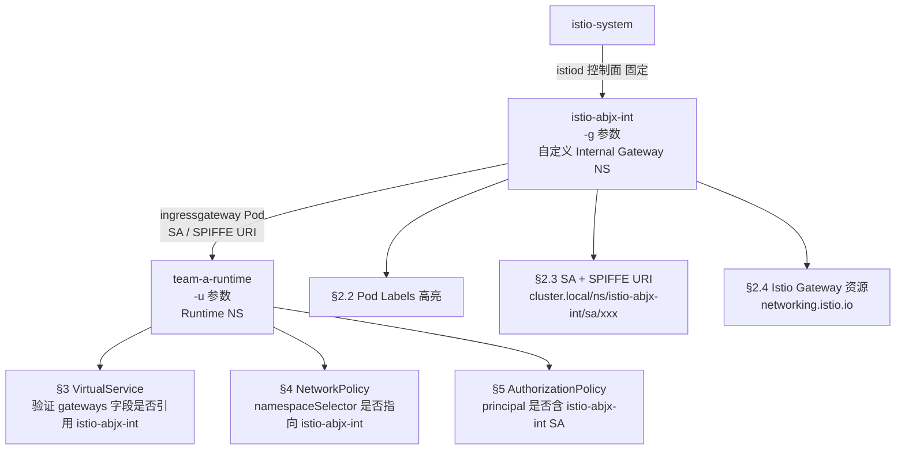

明白了。你的架构是：
	•	istio-abjx-int — 自定义 Istio Ingress Gateway namespace（非 istio-system）
	•	team-a-runtime — 业务 runtime namespace
参数对应：-g istio-abjx-int -u team-a-runtime
核心区别是 Gateway Pod 不在 istio-system，而在独立 namespace，ServiceAccount、SPIFFE URI、NetworkPolicy 的 namespaceSelector 都要基于 istio-abjx-int 来验证。​​​​​​​​​​​​​​​​

chmod +x verify-istio-gw-custom.sh
./verify-istio-gw-custom.sh -g istio-abjx-int -u team-a-runtime


架构映射与核心改动说明

---
```bash
#!/bin/bash

#==============================================================================

# GKE Custom Istio Internal Gateway Verification Script

# 

# Architecture assumption:

# - Istio control plane : istio-system (fixed)

# - Custom Internal GW  : istio-abjx-int  (passed via -g, your actual GW namespace)

# - Runtime namespace   : team-a-runtime  (passed via -u)

# 

# Flow:

# istio-system (istiod)

# └── istio-abjx-int  (ingressgateway pod / SA / NetworkPolicy)

# └── team-a-runtime (VirtualService / AuthorizationPolicy / NetworkPolicy)

# 

# Usage: ./verify-istio-gw-custom.sh -g istio-abjx-int -u team-a-runtime

#==============================================================================

set -euo pipefail

# ── Colors ─────────────────────────────────────────────────────────────────────

RED=’\033[0;31m’
GREEN=’\033[0;32m’
YELLOW=’\033[1;33m’
BLUE=’\033[0;34m’
CYAN=’\033[0;36m’
MAGENTA=’\033[0;35m’
BOLD=’\033[1m’
NC=’\033[0m’

# ── Logging ────────────────────────────────────────────────────────────────────

log_info()      { echo -e “${BLUE}[INFO]${NC}    $1”; }
log_success()   { echo -e “${GREEN}[✔ OK]${NC}    $1”; inc_ok; }
log_warning()   { echo -e “${YELLOW}[⚠ WARN]${NC}  $1”; inc_warn; }
log_error()     { echo -e “${RED}[✘ ERROR]${NC} $1”; inc_err; }
log_highlight() { echo -e “${MAGENTA}${BOLD}$1${NC}”; }
log_check()     { echo -e “${CYAN}[CHECK]${NC}   $1”; }

print_section() {
echo “”
echo -e “${BOLD}${CYAN}╔══════════════════════════════════════════════════════════════════╗${NC}”
printf “${BOLD}${CYAN}║  %-64s║${NC}\n” “$1”
echo -e “${BOLD}${CYAN}╚══════════════════════════════════════════════════════════════════╝${NC}”
}

print_subsection() {
echo “”
echo -e “  ${BOLD}── $1${NC}”
echo -e “  ${CYAN}$(printf ‘%.0s─’ {1..60})${NC}”
}

# ── Counters ───────────────────────────────────────────────────────────────────

OK_COUNT=0; WARN_COUNT=0; ERR_COUNT=0
inc_ok()   { OK_COUNT=$((OK_COUNT+1)); }
inc_warn() { WARN_COUNT=$((WARN_COUNT+1)); }
inc_err()  { ERR_COUNT=$((ERR_COUNT+1)); }

# ── Usage ──────────────────────────────────────────────────────────────────────

show_usage() {
cat <<EOF

Usage: $0 -g <custom-gateway-namespace> -u <runtime-namespace>

Arguments:
-g  Custom Istio Gateway Namespace  (e.g. istio-abjx-int)
-u  Runtime/Team Namespace          (e.g. team-a-runtime)
-h  Help

Architecture:
istio-system (istiod control plane)
└── <custom-gateway-ns>  (-g)   ← your internal Gateway entry point
└── <runtime-ns> (-u)   ← your workload namespace

Example:
$0 -g istio-abjx-int -u team-a-runtime

EOF
exit 1
}

# ── Parse Args ─────────────────────────────────────────────────────────────────

GW_NS=””
RT_NS=””
ISTIOD_NS=“istio-system”   # control plane always here

while getopts “g:u:h” opt; do
case $opt in
g) GW_NS=”$OPTARG” ;;
u) RT_NS=”$OPTARG” ;;
h) show_usage ;;
?) log_error “Invalid option: -$OPTARG”; show_usage ;;
:)  log_error “Option -$OPTARG requires an argument”; show_usage ;;
esac
done

[[ -z “$GW_NS” || -z “$RT_NS” ]] && { log_error “Missing required arguments!”; show_usage; }

echo “”
log_highlight “╔═══════════════════════════════════════════════════════╗”
log_highlight “║   Istio Custom Internal Gateway Verification           ║”
log_highlight “╚═══════════════════════════════════════════════════════╝”
echo “”
echo -e “  ${BOLD}Istiod Control Plane NS${NC} : ${CYAN}${ISTIOD_NS}${NC}  (fixed)”
echo -e “  ${BOLD}Custom Gateway NS${NC}        : ${CYAN}${GW_NS}${NC}”
echo -e “  ${BOLD}Runtime NS${NC}               : ${CYAN}${RT_NS}${NC}”
echo “”

# ── Helper: safe kubectl ───────────────────────────────────────────────────────

kget() { kubectl get “$@” 2>/dev/null || true; }
kjson() { kubectl get “$@” -o json 2>/dev/null || echo ‘{}’; }
kyaml() { kubectl get “$@” -o yaml 2>/dev/null || true; }

#==============================================================================

# SECTION 1: Istio Control Plane (istio-system — fixed)

#==============================================================================
print_section “1. Istio Control Plane — ${ISTIOD_NS}”

print_subsection “1.1 istiod Pods”
ISTIOD_PODS=$(kget pods -n “$ISTIOD_NS” -l app=istiod   
–no-headers -o custom-columns=“NAME:.metadata.name,READY:.status.containerStatuses[0].ready,STATUS:.status.phase”)
if [ -z “$ISTIOD_PODS” ]; then
log_error “istiod not found in ${ISTIOD_NS}”
else
echo “$ISTIOD_PODS”
log_success “istiod running in ${ISTIOD_NS}”
fi

print_subsection “1.2 Istio Core CRDs”
ISTIO_CRDS=(
“gateways.networking.istio.io”
“virtualservices.networking.istio.io”
“destinationrules.networking.istio.io”
“authorizationpolicies.security.istio.io”
“peerauthentications.security.istio.io”
“sidecars.networking.istio.io”
“serviceentries.networking.istio.io”
)
for crd in “${ISTIO_CRDS[@]}”; do
if kubectl get crd “$crd” &>/dev/null; then
log_success “CRD OK: $crd”
else
log_error “CRD MISSING: $crd”
fi
done

#==============================================================================

# SECTION 2: Custom Gateway Namespace — ${GW_NS}

#==============================================================================
print_section “2. Custom Internal Gateway Namespace — ${GW_NS}”

# Verify namespace exists

if ! kubectl get namespace “$GW_NS” &>/dev/null; then
log_error “Namespace ${GW_NS} does NOT exist — aborting”
exit 1
fi
log_success “Namespace ${GW_NS} exists”

# ── 2.1 Discover Gateway Pods ──────────────────────────────────────────────────

print_subsection “2.1 Gateway Pods Discovery in ${GW_NS}”

# Try multiple common label selectors for custom gateway deployments

GW_POD=””
for selector in   
“app=istio-ingressgateway,istio=ingressgateway”   
“istio=ingressgateway”   
“app=istio-ingressgateway”   
“app=ingressgateway”   
“gateway=${GW_NS}”; do

POD_FOUND=$(kget pods -n “$GW_NS” -l “$selector”   
–no-headers -o custom-columns=“NAME:.metadata.name” | head -1)
if [ -n “$POD_FOUND” ]; then
GW_POD=”$POD_FOUND”
GW_SELECTOR=”$selector”
log_success “Gateway pod found via selector: ${selector}”
break
fi
done

if [ -z “$GW_POD” ]; then
log_warning “Cannot determine gateway pod via standard selectors.”
log_info “All pods in ${GW_NS}:”
kget pods -n “$GW_NS”
log_warning “Please identify the gateway pod manually and check labels.”
GW_LABELS_MAP=””
GW_SA=“unknown”
else
GW_POD_COUNT=$(kget pods -n “$GW_NS” -l “$GW_SELECTOR” –no-headers | wc -l | tr -d ’ ’)
log_info “Total gateway pod replicas: ${GW_POD_COUNT}”
kget pods -n “$GW_NS” -l “$GW_SELECTOR”   
-o wide –no-headers   
-o custom-columns=“NAME:.metadata.name,READY:.status.containerStatuses[0].ready,STATUS:.status.phase,NODE:.spec.nodeName”
fi

# ── 2.2 Gateway Pod Labels (critical for cross-namespace policy) ───────────────

print_subsection “2.2 Gateway Pod Labels  ★ Critical for NetworkPolicy / AuthorizationPolicy”

if [ -n “$GW_POD” ]; then
log_highlight “  ▶ All labels on pod: ${GW_POD}”
kubectl get pod “$GW_POD” -n “$GW_NS”   
-o jsonpath=’{range .metadata.labels}{@k}={@v}{”\n”}{end}’   
| sort | while read -r line; do
echo -e “    ${GREEN}${line}${NC}”
done
echo “”

# Extract the two most important labels

APP_LABEL=$(kubectl get pod “$GW_POD” -n “$GW_NS”   
-o jsonpath=’{.metadata.labels.app}’ 2>/dev/null || echo “”)
ISTIO_LABEL=$(kubectl get pod “$GW_NS” -n “$GW_NS”   
-o jsonpath=’{.metadata.labels.istio}’ 2>/dev/null || echo “”)
ISTIO_LABEL=$(kubectl get pod “$GW_POD” -n “$GW_NS”   
-o jsonpath=’{.metadata.labels.istio}’ 2>/dev/null || echo “”)

log_highlight “  ▶ Key label summary (reference for other policies):”
[ -n “$APP_LABEL” ]   && echo -e “    ${BOLD}app${NC}   = ${CYAN}${APP_LABEL}${NC}”
[ -n “$ISTIO_LABEL” ] && echo -e “    ${BOLD}istio${NC} = ${CYAN}${ISTIO_LABEL}${NC}”

# Build label map string for cross-validation below

GW_LABELS_MAP=“app=${APP_LABEL} istio=${ISTIO_LABEL}”
fi

# ── 2.3 Gateway ServiceAccount & SPIFFE URI ────────────────────────────────────

print_subsection “2.3 Gateway ServiceAccount & SPIFFE URI (mTLS Principal)”

if [ -n “$GW_POD” ]; then
GW_SA=$(kubectl get pod “$GW_POD” -n “$GW_NS”   
-o jsonpath=’{.spec.serviceAccountName}’ 2>/dev/null || echo “default”)
SPIFFE_URI=“cluster.local/ns/${GW_NS}/sa/${GW_SA}”

log_highlight “  ▶ ServiceAccount : ${GW_SA}”
log_highlight “  ▶ SPIFFE URI     : ${SPIFFE_URI}”
echo “”
echo -e “  ${YELLOW}This SPIFFE URI must appear in AuthorizationPolicy.spec.rules[].from[].source.principals${NC}”
echo -e “  ${YELLOW}in namespace ${RT_NS} to allow gateway → workload traffic.${NC}”
inc_ok
fi

# ── 2.4 Istio Gateway Resource (networking.istio.io) ──────────────────────────

print_subsection “2.4 Istio Gateway Resources (networking.istio.io) in ${GW_NS}”

GW_RESOURCES=$(kget gateway.networking.istio.io -n “$GW_NS”   
–no-headers -o custom-columns=“NAME:.metadata.name”)
if [ -z “$GW_RESOURCES” ]; then
log_warning “No Istio Gateway (networking.istio.io) in ${GW_NS}”
log_info “Checking ${RT_NS} for Gateway resources…”
GW_IN_RT=$(kget gateway.networking.istio.io -n “$RT_NS”   
–no-headers -o custom-columns=“NAME:.metadata.name”)
if [ -n “$GW_IN_RT” ]; then
log_success “Istio Gateway resources found in ${RT_NS}:”
kget gateway.networking.istio.io -n “$RT_NS”
else
log_warning “No Istio Gateway resource in either ${GW_NS} or ${RT_NS}”
fi
else
log_success “Istio Gateway resources in ${GW_NS}:”
kget gateway.networking.istio.io -n “$GW_NS” -o wide
for gw in $GW_RESOURCES; do
echo “”
log_info “  Selector for gateway ${gw}:”
kyaml gateway.networking.istio.io “$gw” -n “$GW_NS”   
| grep -A5 “selector:” | sed ‘s/^/    /’
echo “”
log_info “  Servers (hosts/ports) for ${gw}:”
kyaml gateway.networking.istio.io “$gw” -n “$GW_NS”   
| grep -A20 “servers:” | sed ‘s/^/    /’
done
fi

# ── 2.5 NetworkPolicy in GW_NS ────────────────────────────────────────────────

print_subsection “2.5 NetworkPolicy in ${GW_NS}”
NP_GW=$(kget networkpolicy -n “$GW_NS” –no-headers   
-o custom-columns=“NAME:.metadata.name”)
if [ -z “$NP_GW” ]; then
log_warning “No NetworkPolicy in ${GW_NS} — gateway is fully open (may be intentional for LB)”
else
NP_GW_COUNT=$(echo “$NP_GW” | wc -l | tr -d ’ ‘)
log_highlight “  NetworkPolicy count in ${GW_NS}: ${NP_GW_COUNT}”
for np in $NP_GW; do
echo “”
echo -e “  ${BOLD}▶ ${np}${NC}”
PT=$(kubectl get networkpolicy “$np” -n “$GW_NS”   
-o jsonpath=’{.spec.policyTypes}’ 2>/dev/null || true)
PS=$(kubectl get networkpolicy “$np” -n “$GW_NS”   
-o jsonpath=’{.spec.podSelector.matchLabels}’ 2>/dev/null || true)
echo -e “    policyTypes : ${CYAN}${PT}${NC}”
echo -e “    podSelector : ${CYAN}${PS}${NC}”
inc_ok
done
fi

#==============================================================================

# SECTION 3: Runtime Namespace — ${RT_NS}

#==============================================================================
print_section “3. Runtime Namespace — ${RT_NS}”

if ! kubectl get namespace “$RT_NS” &>/dev/null; then
log_error “Namespace ${RT_NS} does NOT exist — aborting”
exit 1
fi
log_success “Namespace ${RT_NS} exists”

# ── 3.1 VirtualService ────────────────────────────────────────────────────────

print_subsection “3.1 VirtualService in ${RT_NS}”
VS_LIST=$(kget virtualservice -n “$RT_NS”   
–no-headers -o custom-columns=“NAME:.metadata.name”)
if [ -z “$VS_LIST” ]; then
log_warning “No VirtualService in ${RT_NS}”
else
kget virtualservice -n “$RT_NS” -o wide
for vs in $VS_LIST; do
echo “”
log_info “  VirtualService: ${vs}”
HOSTS=$(kubectl get virtualservice “$vs” -n “$RT_NS”   
-o jsonpath=’{.spec.hosts[*]}’ 2>/dev/null || true)
GWS=$(kubectl get virtualservice “$vs” -n “$RT_NS”   
-o jsonpath=’{.spec.gateways[*]}’ 2>/dev/null || true)
echo -e “    hosts    : ${CYAN}${HOSTS}${NC}”
echo -e “    gateways : ${CYAN}${GWS}${NC}”
# Check if gateways field references the custom GW namespace
if echo “$GWS” | grep -q “$GW_NS”; then
log_success “  VirtualService references custom GW namespace: ${GW_NS}”
else
log_warning “  VirtualService gateways field does not reference ${GW_NS}”
echo -e “    ${YELLOW}Expected format: ${GW_NS}/<gateway-name> or <gateway-name>.${GW_NS}.svc.cluster.local${NC}”
fi
inc_ok
done
fi

# ── 3.2 DestinationRule ───────────────────────────────────────────────────────

print_subsection “3.2 DestinationRule in ${RT_NS}”
DR_LIST=$(kget destinationrule -n “$RT_NS”   
–no-headers -o custom-columns=“NAME:.metadata.name”)
if [ -z “$DR_LIST” ]; then
log_warning “No DestinationRule in ${RT_NS}”
else
kget destinationrule -n “$RT_NS” -o wide
inc_ok
fi

#==============================================================================

# SECTION 4: NetworkPolicy Audit — ${RT_NS}

#==============================================================================
print_section “4. NetworkPolicy Audit — ${RT_NS}”

NP_LIST=$(kget networkpolicy -n “$RT_NS”   
–no-headers -o custom-columns=“NAME:.metadata.name”)

if [ -z “$NP_LIST” ]; then
log_warning “No NetworkPolicy in ${RT_NS} — all traffic is allowed by default”
log_warning “Strongly recommend adding baseline NetworkPolicy for security”
else
NP_COUNT=$(echo “$NP_LIST” | wc -l | tr -d ’ ’)
log_highlight “  ▶ Total NetworkPolicy in ${RT_NS}: ${NP_COUNT}”

# ── Baseline rules we expect to exist ──────────────────────────────────────

echo “”
log_highlight “  ┌─ Baseline NetworkPolicy Coverage Check ──────────────────────”

declare -A NP_BASELINE=(
[“deny-all”]=“Default deny-all — blocks all ingress/egress unless explicitly permitted”
[“allow-dns”]=“Allow egress UDP/TCP 53 — required for DNS resolution”
[“allow-istio-sidecar”]=“Allow Istio sidecar ports 15000-15020 for control plane comms”
[“allow-from-gateway”]=“Allow ingress from ${GW_NS} namespace (the custom gateway pods)”
[“allow-prometheus”]=“Allow Prometheus scraping port 9090 / 15020 from monitoring NS”
[“allow-same-namespace”]=“Allow intra-namespace pod communication”
[“allow-egress-apiserver”]=“Allow egress to kube-apiserver port 443/6443”
)

for kw in “${!NP_BASELINE[@]}”; do
FOUND=$(echo “$NP_LIST” | grep -i “${kw%%[=]*}” || true)
if [ -n “$FOUND” ]; then
echo -e “  │  ${GREEN}✔${NC} ${BOLD}${kw}${NC}”
echo -e “  │    ↳ ${NP_BASELINE[$kw]}”
inc_ok
else
echo -e “  │  ${YELLOW}?${NC} ${BOLD}${kw}${NC}  ← not found by name”
echo -e “  │    ↳ Expected: ${NP_BASELINE[$kw]}”
inc_warn
fi
done
log_highlight “  └──────────────────────────────────────────────────────────────”

# ── Cross-validate: does any NP select from GW_NS? ─────────────────────────

echo “”
print_subsection “4.1 Cross-Validation: Does runtime NP allow ingress FROM ${GW_NS}?”

# Check namespaceSelector references

NS_REF=$(kyaml networkpolicy -n “$RT_NS”   
| grep -A2 “namespaceSelector” | grep -E “name:|kubernetes.io/metadata.name”   
| grep -o “${GW_NS}” || true)
if [ -n “$NS_REF” ]; then
log_success “NetworkPolicy namespaceSelector references ‘${GW_NS}’”
inc_ok
else
log_warning “No NetworkPolicy namespaceSelector references namespace ‘${GW_NS}’”
echo -e “  ${YELLOW}Make sure you have a rule like:${NC}”
cat <<‘YAML’
# Expected ingress rule in runtime NetworkPolicy:
ingress:
- from:
- namespaceSelector:
matchLabels:
kubernetes.io/metadata.name: <GW_NS>   # ← must match your GW namespace
podSelector:
matchLabels:
app: istio-ingressgateway                # ← must match GW pod labels
YAML
inc_warn
fi

# Check if pod labels from GW are referenced

if [ -n “${APP_LABEL:-}” ]; then
LABEL_REF=$(kyaml networkpolicy -n “$RT_NS”   
| grep -c “app: ${APP_LABEL}” || true)
if [ “$LABEL_REF” -gt 0 ]; then
log_success “NetworkPolicy references gateway pod label ‘app=${APP_LABEL}’ (${LABEL_REF} occurrence(s))”
inc_ok
else
log_warning “NetworkPolicy does NOT reference gateway pod label ‘app=${APP_LABEL}’”
inc_warn
fi
fi

# ── Detail print for each NP ────────────────────────────────────────────────

echo “”
print_subsection “4.2 All NetworkPolicy Details in ${RT_NS}”
for np in $NP_LIST; do
echo “”
log_highlight “  ╔ NetworkPolicy: ${np}”
PT=$(kubectl get networkpolicy “$np” -n “$RT_NS”   
-o jsonpath=’{.spec.policyTypes}’ 2>/dev/null || true)
PS=$(kubectl get networkpolicy “$np” -n “$RT_NS”   
-o jsonpath=’{.spec.podSelector.matchLabels}’ 2>/dev/null || true)
echo -e “  ║  policyTypes  : ${CYAN}${PT}${NC}”
echo -e “  ║  podSelector  : ${CYAN}${PS}${NC}”

```
# Ingress from
INGRESS_RULES=$(kubectl get networkpolicy "$np" -n "$RT_NS" \
  -o jsonpath='{range .spec.ingress[*]}{range .from[*]}{"  NS="}
```

{.namespaceSelector.matchLabels}{” POD=”}{.podSelector.matchLabels}{”\n”}{end}{end}’   
2>/dev/null || true)
[ -n “$INGRESS_RULES” ] && echo -e “  ║  ingress.from :\n${INGRESS_RULES}”

```
# Ingress ports
INGRESS_PORTS=$(kubectl get networkpolicy "$np" -n "$RT_NS" \
  -o jsonpath='{range .spec.ingress[*]}{range .ports[*]}{.protocol}/{.port}{" "}{end}{end}' \
  2>/dev/null || true)
[ -n "$INGRESS_PORTS" ] && echo -e "  ║  ingress.ports: ${CYAN}${INGRESS_PORTS}${NC}"

# Egress to
EGRESS_RULES=$(kubectl get networkpolicy "$np" -n "$RT_NS" \
  -o jsonpath='{range .spec.egress[*]}{range .to[*]}{"  NS="}
```

{.namespaceSelector.matchLabels}{” POD=”}{.podSelector.matchLabels}{”\n”}{end}{end}’   
2>/dev/null || true)
[ -n “$EGRESS_RULES” ] && echo -e “  ║  egress.to    :\n${EGRESS_RULES}”

```
echo -e "  ╚$(printf '═%.0s' {1..60})"
inc_ok
```

done
fi

#==============================================================================

# SECTION 5: AuthorizationPolicy Audit — ${RT_NS}

#==============================================================================
print_section “5. AuthorizationPolicy Audit — ${RT_NS}”

AP_LIST=$(kget authorizationpolicy -n “$RT_NS”   
–no-headers -o custom-columns=“NAME:.metadata.name”)

if [ -z “$AP_LIST” ]; then
log_warning “No AuthorizationPolicy in ${RT_NS}”
log_warning “mTLS authorization is NOT enforced — any sidecar principal can reach workloads”
inc_warn
else
AP_COUNT=$(echo “$AP_LIST” | wc -l | tr -d ’ ’)
log_highlight “  ▶ Total AuthorizationPolicy in ${RT_NS}: ${AP_COUNT}”

# ── Baseline AP check ───────────────────────────────────────────────────────

echo “”
log_highlight “  ┌─ AuthorizationPolicy Baseline Coverage ───────────────────────”
declare -A AP_BASELINE=(
[“deny-all”]=“Default DENY — must exist as baseline, then ALLOW rules open specific paths”
[“allow-gateway”]=“ALLOW from gateway SA: cluster.local/ns/${GW_NS}/sa/<sa>”
[“allow-prometheus”]=“ALLOW Prometheus scraping (source: monitoring namespace)”
[“allow-health”]=“ALLOW liveness/readiness health probe paths”
[“allow-same-namespace”]=“ALLOW same-namespace service-to-service calls”
)

for kw in “${!AP_BASELINE[@]}”; do
FOUND=$(echo “$AP_LIST” | grep -i “${kw%%[=]*}” || true)
if [ -n “$FOUND” ]; then
echo -e “  │  ${GREEN}✔${NC} ${BOLD}${kw}${NC}”
echo -e “  │    ↳ ${AP_BASELINE[$kw]}”
inc_ok
else
echo -e “  │  ${YELLOW}?${NC} ${BOLD}${kw}${NC}”
echo -e “  │    ↳ Expected: ${AP_BASELINE[$kw]}”
inc_warn
fi
done
log_highlight “  └──────────────────────────────────────────────────────────────”

# ── Cross-validate: AP principal vs GW SPIFFE URI ──────────────────────────

echo “”
print_subsection “5.1 Cross-Validation: AP principals vs Gateway SPIFFE URI”

if [ -n “${GW_SA:-}” ] && [ “${GW_SA}” != “unknown” ]; then
EXPECTED_PRINCIPAL=“cluster.local/ns/${GW_NS}/sa/${GW_SA}”
log_check “Expected principal: ${EXPECTED_PRINCIPAL}”

```
PRINCIPAL_MATCH=$(kyaml authorizationpolicy -n "$RT_NS" \
  | grep -c "${GW_SA}" || true)
NS_MATCH=$(kyaml authorizationpolicy -n "$RT_NS" \
  | grep -c "${GW_NS}" || true)

if [ "$PRINCIPAL_MATCH" -gt 0 ]; then
  log_success "AP references gateway SA '${GW_SA}' (${PRINCIPAL_MATCH} occurrence(s))"
  inc_ok
else
  log_warning "AP does NOT reference gateway SA '${GW_SA}'"
  echo -e "  ${YELLOW}Add this to your allow-gateway AuthorizationPolicy:${NC}"
  cat <<YAML
# AuthorizationPolicy to allow traffic from ${GW_NS} gateway:
rules:
  - from:
    - source:
        principals:
          - "cluster.local/ns/${GW_NS}/sa/${GW_SA}"
```

YAML
inc_warn
fi

```
if [ "$NS_MATCH" -gt 0 ]; then
  log_success "AP references gateway namespace '${GW_NS}' (${NS_MATCH} occurrence(s))"
  inc_ok
else
  log_warning "AP does NOT reference gateway namespace '${GW_NS}'"
  inc_warn
fi
```

fi

# ── Detail print per AP ─────────────────────────────────────────────────────

echo “”
print_subsection “5.2 All AuthorizationPolicy Details in ${RT_NS}”
for ap in $AP_LIST; do
echo “”
ACTION=$(kubectl get authorizationpolicy “$ap” -n “$RT_NS”   
-o jsonpath=’{.spec.action}’ 2>/dev/null || echo “ALLOW”)
SELECTOR=$(kubectl get authorizationpolicy “$ap” -n “$RT_NS”   
-o jsonpath=’{.spec.selector.matchLabels}’ 2>/dev/null || true)
PRINCIPALS=$(kubectl get authorizationpolicy “$ap” -n “$RT_NS”   
-o jsonpath=’{range .spec.rules[*].from[*].source}{.principals[*]}{”\n”}{end}’   
2>/dev/null || true)
NAMESPACES=$(kubectl get authorizationpolicy “$ap” -n “$RT_NS”   
-o jsonpath=’{range .spec.rules[*].from[*].source}{.namespaces[*]}{”\n”}{end}’   
2>/dev/null || true)
METHODS=$(kubectl get authorizationpolicy “$ap” -n “$RT_NS”   
-o jsonpath=’{range .spec.rules[*].to[*].operation}{.methods[*]}{”\n”}{end}’   
2>/dev/null || true)
PATHS=$(kubectl get authorizationpolicy “$ap” -n “$RT_NS”   
-o jsonpath=’{range .spec.rules[*].to[*].operation}{.paths[*]}{”\n”}{end}’   
2>/dev/null || true)

```
case "$ACTION" in
  DENY)   COLOR="${RED}${BOLD}" ;;
  ALLOW)  COLOR="${GREEN}" ;;
  CUSTOM) COLOR="${MAGENTA}" ;;
  *)      COLOR="${YELLOW}" ;;
esac

log_highlight "  ╔ AuthorizationPolicy: ${ap}"
echo -e "  ║  action     : ${COLOR}${ACTION}${NC}"
echo -e "  ║  selector   : ${CYAN}${SELECTOR:-<all pods>}${NC}"
[ -n "$PRINCIPALS" ] && echo -e "  ║  principals :\n$(echo "$PRINCIPALS" | sed 's/^/  ║    /')"
[ -n "$NAMESPACES" ] && echo -e "  ║  namespaces : ${CYAN}${NAMESPACES}${NC}"
[ -n "$METHODS" ]    && echo -e "  ║  methods    : ${METHODS}"
[ -n "$PATHS" ]      && echo -e "  ║  paths      : ${PATHS}"

# Highlight if DENY with empty rules = deny-all
RULES_COUNT=$(kubectl get authorizationpolicy "$ap" -n "$RT_NS" \
  -o jsonpath='{.spec.rules}' 2>/dev/null || echo "[]")
if [ "$ACTION" = "DENY" ] && [ "$RULES_COUNT" = "[]" -o -z "$RULES_COUNT" ]; then
  echo -e "  ║  ${RED}${BOLD}⚠ This is a DENY-ALL policy (no rules = deny everything)${NC}"
fi

echo -e "  ╚$(printf '═%.0s' {1..60})"
inc_ok
```

done
fi

# ── 5.3 PeerAuthentication ────────────────────────────────────────────────────

print_subsection “5.3 PeerAuthentication in ${RT_NS}”
PA_LIST=$(kget peerauthentication -n “$RT_NS”   
–no-headers -o custom-columns=“NAME:.metadata.name”)
if [ -z “$PA_LIST” ]; then
log_warning “No PeerAuthentication in ${RT_NS} — using mesh default mTLS mode”
inc_warn
else
for pa in $PA_LIST; do
MODE=$(kubectl get peerauthentication “$pa” -n “$RT_NS”   
-o jsonpath=’{.spec.mtls.mode}’ 2>/dev/null || echo “unset”)
if [ “$MODE” = “STRICT” ]; then
log_success “PeerAuthentication ‘${pa}’ → mTLS mode: ${MODE}”
else
log_warning “PeerAuthentication ‘${pa}’ → mTLS mode: ${MODE}  (recommend STRICT)”
inc_warn
fi
done
fi

#==============================================================================

# SECTION 6: Summary

#==============================================================================
print_section “6. Verification Summary”

echo “”
echo -e “  ${BOLD}Architecture verified:${NC}”
echo -e “    ${CYAN}istio-system${NC}  →  ${CYAN}${GW_NS}${NC}  →  ${CYAN}${RT_NS}${NC}”
echo “”
echo -e “  ${BOLD}Results:${NC}”
echo -e “    ${GREEN}✔ OK    : ${OK_COUNT}${NC}”
echo -e “    ${YELLOW}⚠ WARN  : ${WARN_COUNT}${NC}”
echo -e “    ${RED}✘ ERROR : ${ERR_COUNT}${NC}”
echo “”

if [ “$ERR_COUNT” -gt 0 ]; then
log_error “Critical issues detected — review all [✘ ERROR] items above”
elif [ “$WARN_COUNT” -gt 0 ]; then
log_warning “Warnings detected — review [⚠ WARN] items; some may be intentional”
else
log_success “All checks passed!”
fi

echo “”
log_highlight “Checklist Coverage:”
echo “  §1  Istio control plane (istiod, CRDs) in istio-system”
echo “  §2  Custom GW namespace [${GW_NS}]: pods, labels, SA, SPIFFE URI, Istio Gateway resource”
echo “  §3  Runtime namespace [${RT_NS}]: VirtualService (gateway ref), DestinationRule”
echo “  §4  NetworkPolicy audit [${RT_NS}]: baseline coverage + GW namespace cross-validation”
echo “  §5  AuthorizationPolicy audit [${RT_NS}]: baseline, SPIFFE principal validation, mTLS mode”
echo “”
```
关键验证逻辑说明


|检查点                              |验证内容                                     |为什么重要                    |
|---------------------------------|-----------------------------------------|-------------------------|
|§2.2 Gateway Pod Labels          |自动 discover（多 selector 尝试）               |自定义 NS 下 label 可能不是默认值   |
|§2.3 SPIFFE URI                  |`cluster.local/ns/istio-abjx-int/sa/<sa>`|AP principal 必须精确匹配此值    |
|§3.1 VirtualService `gateways` 字段|是否引用 `istio-abjx-int/<gw-name>`          |错误 NS 会导致 VS 无法绑定 Gateway|
|§4.1 NetworkPolicy cross-validate|`namespaceSelector` 是否含 `istio-abjx-int` |否则 Gateway Pod 流量被 NP 拦截 |
|§5.1 AP principal cross-validate |是否含 GW namespace 的 SA                    |否则 mTLS 校验失败 403         |

成功读取了原始脚本。现在基于它的参数风格和结构，生成新的 Istio 专项验证脚本。​​​​​​​​​​​​​​​​

脚本已生成，用法与原脚本保持一致：

chmod +x verify-istio-gateway.sh
./verify-istio-gateway.sh -g istio-system -u production-ns


脚本功能结构说明

graph TD
    A[参数: -g gateway-ns / -u runtime-ns] --> B

    B[Section 1: Istio 控制面健康]
    B --> B1[istiod Pod 状态]
    B --> B2[Istio CRD 完整性检查]

    B --> C[Section 2: Gateway Pod Labels & SA]
    C --> C1[抓取 ingressgateway Pod Labels]
    C --> C2[高亮输出 Key Labels]
    C --> C3[打印 ServiceAccount + SPIFFE URI]
    C --> C4[交叉验证: runtime NetworkPolicy 是否引用了 gateway labels]

    B --> D[Section 3: Istio 资源检查]
    D --> D1[Istio Gateway 资源]
    D --> D2[VirtualService]
    D --> D3[DestinationRule]

    B --> E[Section 4: NetworkPolicy Audit]
    E --> E1[gateway-ns NetworkPolicy]
    E --> E2[runtime-ns NetworkPolicy]
    E2 --> E3[基线规则覆盖度检查 deny-all / allow-dns / allow-istio ...]
    E2 --> E4[高亮打印 podSelector / policyTypes / ingress.from / egress.to]

    B --> F[Section 5: AuthorizationPolicy Audit]
    F --> F1[基线 AP 覆盖度检查]
    F --> F2[action / principals / paths 高亮打印]
    F --> F3[Principal 与 Gateway SA 交叉验证]
    F --> F4[PeerAuthentication mTLS mode 检查]

    B --> G[Section 6: 汇总 OK/WARN/ERR 计数]


核心功能要点


|Section|功能                                            |关键输出                                                               |
|-------|----------------------------------------------|-------------------------------------------------------------------|
|§2.2   |Gateway Pod Labels 高亮                         |`app=istio-ingressgateway`, `istio=ingressgateway`                 |
|§2.3   |ServiceAccount + SPIFFE URI                   |`cluster.local/ns/<ns>/sa/<sa>`                                    |
|§2.4   |交叉验证 runtime NetworkPolicy 是否引用 gateway labels|✔/⚠ 明确告知                                                           |
|§4     |NetworkPolicy 基线覆盖度检查                         |`deny-all` / `allow-dns` / `allow-istio` / `allow-ingressgateway` 等|
|§5     |AuthorizationPolicy action 红/绿高亮              |`DENY`=红, `ALLOW`=绿                                                |
|§5.1   |PeerAuthentication mTLS mode                  |`STRICT` 为 OK，其他为 WARN                                             |

```bash
#!/bin/bash

#==============================================================================

# GKE Istio Gateway Verification Script

# Purpose: Verify Istio Gateway resources, NetworkPolicy, and AuthorizationPolicy

# Author: Infrastructure Team

# Version: 1.0

# Usage: ./verify-istio-gateway.sh -g <istio-gateway-namespace> -u <runtime-namespace>

#==============================================================================

set -euo pipefail

# ── Color Definitions ──────────────────────────────────────────────────────────

RED=’\033[0;31m’
GREEN=’\033[0;32m’
YELLOW=’\033[1;33m’
BLUE=’\033[0;34m’
CYAN=’\033[0;36m’
MAGENTA=’\033[0;35m’
BOLD=’\033[1m’
NC=’\033[0m’

# ── Logging Functions ──────────────────────────────────────────────────────────

log_info()    { echo -e “${BLUE}[INFO]${NC} $1”; }
log_success() { echo -e “${GREEN}[✔ OK]${NC} $1”; }
log_warning() { echo -e “${YELLOW}[WARN]${NC} $1”; }
log_error()   { echo -e “${RED}[✘ ERR]${NC} $1”; }
log_highlight(){ echo -e “${MAGENTA}${BOLD}$1${NC}”; }
log_check()   { echo -e “${CYAN}[CHECK]${NC} $1”; }

print_section() {
echo “”
echo -e “${BOLD}${CYAN}════════════════════════════════════════════════════════════════════${NC}”
echo -e “${BOLD}${CYAN}  $1${NC}”
echo -e “${BOLD}${CYAN}════════════════════════════════════════════════════════════════════${NC}”
}

print_subsection() {
echo “”
echo -e “${BOLD}  ── $1 ──${NC}”
}

# ── Usage ──────────────────────────────────────────────────────────────────────

show_usage() {
echo “Usage: $0 -g <istio-gateway-namespace> -u <runtime-namespace>”
echo “”
echo “Options:”
echo “  -g  Istio Gateway Namespace  (Required, e.g. istio-system or istio-gateway)”
echo “  -u  Runtime/User Namespace   (Required, e.g. my-app-ns)”
echo “  -h  Show help”
echo “”
echo “Example:”
echo “  $0 -g istio-system -u production-ns”
exit 1
}

# ── Argument Parsing ───────────────────────────────────────────────────────────

GATEWAY_NAMESPACE=””
RUNTIME_NAMESPACE=””

while getopts “g:u:h” opt; do
case $opt in
g) GATEWAY_NAMESPACE=”$OPTARG” ;;
u) RUNTIME_NAMESPACE=”$OPTARG” ;;
h) show_usage ;;
?) log_error “Invalid option: -$OPTARG”; show_usage ;;
:)  log_error “Option -$OPTARG requires an argument”; show_usage ;;
esac
done

if [ -z “$GATEWAY_NAMESPACE” ] || [ -z “$RUNTIME_NAMESPACE” ]; then
log_error “Missing required arguments!”
show_usage
fi

log_info “Istio Gateway Namespace : ${GATEWAY_NAMESPACE}”
log_info “Runtime Namespace       : ${RUNTIME_NAMESPACE}”

# ── Counter for summary ────────────────────────────────────────────────────────

WARN_COUNT=0
ERR_COUNT=0
OK_COUNT=0

inc_ok()   { OK_COUNT=$((OK_COUNT+1)); }
inc_warn() { WARN_COUNT=$((WARN_COUNT+1)); }
inc_err()  { ERR_COUNT=$((ERR_COUNT+1)); }

#==============================================================================

# SECTION 1: Istio Control Plane Check

#==============================================================================
print_section “1. Istio Control Plane Health”

print_subsection “1.1 istiod Pod Status”
if kubectl get pods -n “$GATEWAY_NAMESPACE” -l app=istiod 2>/dev/null | grep -q “Running”; then
ISTIOD_PODS=$(kubectl get pods -n “$GATEWAY_NAMESPACE” -l app=istiod   
–no-headers -o custom-columns=“NAME:.metadata.name,STATUS:.status.phase,READY:.status.containerStatuses[0].ready”)
log_success “istiod is running:”
echo “$ISTIOD_PODS”
inc_ok
else

# Try istio-system as fallback

if kubectl get pods -n istio-system -l app=istiod 2>/dev/null | grep -q “Running”; then
log_warning “istiod found in istio-system (not in ${GATEWAY_NAMESPACE})”
kubectl get pods -n istio-system -l app=istiod
inc_warn
else
log_error “istiod not found or not running”
inc_err
fi
fi

print_subsection “1.2 Istio CRD Check”
ISTIO_CRDS=(
“gateways.networking.istio.io”
“virtualservices.networking.istio.io”
“destinationrules.networking.istio.io”
“authorizationpolicies.security.istio.io”
“peerauthentications.security.istio.io”
“sidecars.networking.istio.io”
)
for crd in “${ISTIO_CRDS[@]}”; do
if kubectl get crd “$crd” &>/dev/null; then
log_success “CRD installed: $crd”
inc_ok
else
log_error “CRD MISSING: $crd”
inc_err
fi
done

#==============================================================================

# SECTION 2: Istio Gateway Pod — Labels & ServiceAccount

#==============================================================================
print_section “2. Istio Gateway Pod — Labels & ServiceAccount”

print_subsection “2.1 Istio Gateway Pods in ${GATEWAY_NAMESPACE}”

GW_PODS=$(kubectl get pods -n “$GATEWAY_NAMESPACE”   
-l “app=istio-ingressgateway”   
–no-headers -o custom-columns=“NAME:.metadata.name” 2>/dev/null || true)

if [ -z “$GW_PODS” ]; then

# Try broader label selector

GW_PODS=$(kubectl get pods -n “$GATEWAY_NAMESPACE”   
-l “istio=ingressgateway”   
–no-headers -o custom-columns=“NAME:.metadata.name” 2>/dev/null || true)
fi

if [ -z “$GW_PODS” ]; then
log_warning “No Istio ingressgateway pods found in ${GATEWAY_NAMESPACE}”
log_info “Listing all pods in namespace for reference:”
kubectl get pods -n “$GATEWAY_NAMESPACE” –no-headers 2>/dev/null || true
inc_warn
else
GW_POD_COUNT=$(echo “$GW_PODS” | wc -l | tr -d ’ ’)
log_success “Found ${GW_POD_COUNT} gateway pod(s)”

# Use first pod as reference

FIRST_POD=$(echo “$GW_PODS” | head -1)

print_subsection “2.2 Gateway Pod Labels (reference pod: ${FIRST_POD})”
log_highlight “▶ Gateway Pod Labels:”
kubectl get pod “$FIRST_POD” -n “$GATEWAY_NAMESPACE”   
-o jsonpath=’{range .metadata.labels}{@k}={@v}{”\n”}{end}’ 2>/dev/null   
| sort | sed ‘s/^/    /’
echo “”

# Key labels for cross-namespace reference

APP_LABEL=$(kubectl get pod “$FIRST_POD” -n “$GATEWAY_NAMESPACE”   
-o jsonpath=’{.metadata.labels.app}’ 2>/dev/null || echo “”)
ISTIO_LABEL=$(kubectl get pod “$FIRST_POD” -n “$GATEWAY_NAMESPACE”   
-o jsonpath=’{.metadata.labels.istio}’ 2>/dev/null || echo “”)

log_highlight “▶ Key Labels for NetworkPolicy / AuthorizationPolicy selectors:”
[ -n “$APP_LABEL” ]   && echo -e “    ${GREEN}app=${APP_LABEL}${NC}”
[ -n “$ISTIO_LABEL” ] && echo -e “    ${GREEN}istio=${ISTIO_LABEL}${NC}”
inc_ok

print_subsection “2.3 Gateway Pod ServiceAccount”
GW_SA=$(kubectl get pod “$FIRST_POD” -n “$GATEWAY_NAMESPACE”   
-o jsonpath=’{.spec.serviceAccountName}’ 2>/dev/null || echo “default”)
log_highlight “▶ ServiceAccount: ${GW_SA}”
echo -e “    SPIFFE URI (mTLS principal): ${CYAN}cluster.local/ns/${GATEWAY_NAMESPACE}/sa/${GW_SA}${NC}”
inc_ok

print_subsection “2.4 Validate Runtime Namespace References to Gateway Labels”

# Check if runtime namespace NetworkPolicy correctly selects gateway pod labels

log_check “Checking if runtime NetworkPolicy references gateway pod labels…”

if [ -n “$APP_LABEL” ]; then
MATCH=$(kubectl get networkpolicy -n “$RUNTIME_NAMESPACE” -o yaml 2>/dev/null   
| grep -c “app: ${APP_LABEL}” || true)
if [ “$MATCH” -gt 0 ]; then
log_success “Runtime NetworkPolicy references gateway label ‘app=${APP_LABEL}’ (${MATCH} occurrence(s))”
inc_ok
else
log_warning “Runtime NetworkPolicy does NOT reference ‘app=${APP_LABEL}’ — verify ingress rules!”
inc_warn
fi
fi

if [ -n “$ISTIO_LABEL” ]; then
MATCH=$(kubectl get networkpolicy -n “$RUNTIME_NAMESPACE” -o yaml 2>/dev/null   
| grep -c “istio: ${ISTIO_LABEL}” || true)
if [ “$MATCH” -gt 0 ]; then
log_success “Runtime NetworkPolicy references gateway label ‘istio=${ISTIO_LABEL}’ (${MATCH} occurrence(s))”
inc_ok
else
log_warning “Runtime NetworkPolicy does NOT reference ‘istio=${ISTIO_LABEL}’”
inc_warn
fi
fi
fi

#==============================================================================

# SECTION 3: Istio Gateway & VirtualService Resources

#==============================================================================
print_section “3. Istio Gateway & VirtualService — ${GATEWAY_NAMESPACE} / ${RUNTIME_NAMESPACE}”

print_subsection “3.1 Istio Gateway Resources”
for ns in “$GATEWAY_NAMESPACE” “$RUNTIME_NAMESPACE”; do
GW_LIST=$(kubectl get gateway.networking.istio.io -n “$ns”   
–no-headers -o custom-columns=“NAME:.metadata.name” 2>/dev/null || true)
if [ -z “$GW_LIST” ]; then
log_warning “No Istio Gateway (networking.istio.io) in namespace: $ns”
inc_warn
else
log_success “Istio Gateway resources in $ns:”
kubectl get gateway.networking.istio.io -n “$ns” -o wide
inc_ok
fi
done

print_subsection “3.2 VirtualService Resources in ${RUNTIME_NAMESPACE}”
VS_LIST=$(kubectl get virtualservice -n “$RUNTIME_NAMESPACE”   
–no-headers -o custom-columns=“NAME:.metadata.name” 2>/dev/null || true)
if [ -z “$VS_LIST” ]; then
log_warning “No VirtualService resources in ${RUNTIME_NAMESPACE}”
inc_warn
else
kubectl get virtualservice -n “$RUNTIME_NAMESPACE” -o wide
inc_ok
fi

print_subsection “3.3 DestinationRule Resources in ${RUNTIME_NAMESPACE}”
DR_LIST=$(kubectl get destinationrule -n “$RUNTIME_NAMESPACE”   
–no-headers -o custom-columns=“NAME:.metadata.name” 2>/dev/null || true)
if [ -z “$DR_LIST” ]; then
log_warning “No DestinationRule resources in ${RUNTIME_NAMESPACE}”
inc_warn
else
kubectl get destinationrule -n “$RUNTIME_NAMESPACE” -o wide
inc_ok
fi

#==============================================================================

# SECTION 4: NetworkPolicy Audit

#==============================================================================
print_section “4. NetworkPolicy Audit”

audit_networkpolicy() {
local NS=”$1”
print_subsection “4.x NetworkPolicy in namespace: ${NS}”

NP_LIST=$(kubectl get networkpolicy -n “$NS”   
–no-headers -o custom-columns=“NAME:.metadata.name” 2>/dev/null || true)

if [ -z “$NP_LIST” ]; then
log_warning “No NetworkPolicy found in ${NS}”
inc_warn
return
fi

NP_COUNT=$(echo “$NP_LIST” | wc -l | tr -d ’ ’)
log_highlight “▶ Total NetworkPolicy count in ${NS}: ${NP_COUNT}”

# Required baseline policy keywords

declare -A REQUIRED_KEYWORDS=(
[“deny-all”]=“Default deny-all baseline rule — blocks all traffic unless explicitly allowed”
[“allow-dns”]=“Allow DNS (UDP/TCP port 53) — required for service name resolution”
[“allow-istio”]=“Allow Istio control plane / sidecar communication (port 15000-15020)”
[“allow-ingressgateway”]=“Allow traffic from Istio ingressgateway pod”
[“allow-prometheus”]=“Allow Prometheus scraping (port 9090/15020)”
[“allow-same-namespace”]=“Allow pod-to-pod within same namespace”
)

echo “”
log_highlight “  ┌─ Baseline Policy Coverage Check ─────────────────────────────”
for kw in “${!REQUIRED_KEYWORDS[@]}”; do
FOUND=$(echo “$NP_LIST” | grep -i “$kw” || true)
if [ -n “$FOUND” ]; then
echo -e “  │ ${GREEN}✔${NC} ${BOLD}${kw}${NC}”
echo -e “  │   ↳ ${REQUIRED_KEYWORDS[$kw]}”
inc_ok
else
echo -e “  │ ${YELLOW}?${NC} ${BOLD}${kw}${NC} — not found (check if covered by other policy name)”
echo -e “  │   ↳ Expected: ${REQUIRED_KEYWORDS[$kw]}”
inc_warn
fi
done
log_highlight “  └──────────────────────────────────────────────────────────────”

echo “”
log_info “Detailed NetworkPolicy listing for ${NS}:”
for np in $NP_LIST; do
echo “”
log_highlight “  ▶ Policy: ${np}”
# Show condensed key fields
INGRESS_FROM=$(kubectl get networkpolicy “$np” -n “$NS”   
-o jsonpath=’{range .spec.ingress[*]}{range .from[*]}from: ns={.namespaceSelector.matchLabels} pod={.podSelector.matchLabels}{”\n”}{end}{end}’ 2>/dev/null || true)
EGRESS_TO=$(kubectl get networkpolicy “$np” -n “$NS”   
-o jsonpath=’{range .spec.egress[*]}{range .to[*]}to: ns={.namespaceSelector.matchLabels} pod={.podSelector.matchLabels}{”\n”}{end}{end}’ 2>/dev/null || true)
POD_SELECTOR=$(kubectl get networkpolicy “$np” -n “$NS”   
-o jsonpath=’{.spec.podSelector.matchLabels}’ 2>/dev/null || true)
POLICY_TYPES=$(kubectl get networkpolicy “$np” -n “$NS”   
-o jsonpath=’{.spec.policyTypes}’ 2>/dev/null || true)

```
echo -e "    podSelector  : ${CYAN}${POD_SELECTOR}${NC}"
echo -e "    policyTypes  : ${CYAN}${POLICY_TYPES}${NC}"
[ -n "$INGRESS_FROM" ] && echo -e "    ingress.from : ${INGRESS_FROM}"
[ -n "$EGRESS_TO" ]    && echo -e "    egress.to    : ${EGRESS_TO}"
inc_ok
```

done
}

audit_networkpolicy “$GATEWAY_NAMESPACE”
audit_networkpolicy “$RUNTIME_NAMESPACE”

#==============================================================================

# SECTION 5: AuthorizationPolicy Audit (Runtime Namespace)

#==============================================================================
print_section “5. AuthorizationPolicy Audit — ${RUNTIME_NAMESPACE}”

AP_LIST=$(kubectl get authorizationpolicy -n “$RUNTIME_NAMESPACE”   
–no-headers -o custom-columns=“NAME:.metadata.name” 2>/dev/null || true)

if [ -z “$AP_LIST” ]; then
log_warning “No AuthorizationPolicy found in ${RUNTIME_NAMESPACE}”
log_warning “⚠ Without AuthorizationPolicy, mTLS authorization is not enforced!”
inc_warn
else
AP_COUNT=$(echo “$AP_LIST” | wc -l | tr -d ’ ’)
log_highlight “▶ Total AuthorizationPolicy count in ${RUNTIME_NAMESPACE}: ${AP_COUNT}”

# Required baseline AP patterns

declare -A AP_REQUIRED=(
[“deny-all”]=“Deny-all baseline — explicit default DENY for all principals”
[“allow-gateway”]=“Allow traffic from Istio ingressgateway ServiceAccount (SPIFFE principal)”
[“allow-prometheus”]=“Allow Prometheus scraping from monitoring namespace”
[“allow-health”]=“Allow health check endpoints (liveness/readiness probes)”
)

echo “”
log_highlight “  ┌─ AuthorizationPolicy Coverage Check ─────────────────────────”
for kw in “${!AP_REQUIRED[@]}”; do
FOUND=$(echo “$AP_LIST” | grep -i “$kw” || true)
if [ -n “$FOUND” ]; then
echo -e “  │ ${GREEN}✔${NC} ${BOLD}${kw}${NC}”
echo -e “  │   ↳ ${AP_REQUIRED[$kw]}”
inc_ok
else
echo -e “  │ ${YELLOW}?${NC} ${BOLD}${kw}${NC} — not found”
echo -e “  │   ↳ Expected: ${AP_REQUIRED[$kw]}”
inc_warn
fi
done
log_highlight “  └──────────────────────────────────────────────────────────────”

echo “”
log_info “Detailed AuthorizationPolicy listing:”
for ap in $AP_LIST; do
echo “”
log_highlight “  ▶ AuthorizationPolicy: ${ap}”

```
# Key fields
ACTION=$(kubectl get authorizationpolicy "$ap" -n "$RUNTIME_NAMESPACE" \
  -o jsonpath='{.spec.action}' 2>/dev/null || echo "ALLOW")
SELECTOR=$(kubectl get authorizationpolicy "$ap" -n "$RUNTIME_NAMESPACE" \
  -o jsonpath='{.spec.selector.matchLabels}' 2>/dev/null || true)
PRINCIPALS=$(kubectl get authorizationpolicy "$ap" -n "$RUNTIME_NAMESPACE" \
  -o jsonpath='{range .spec.rules[*].from[*].source}{.principals[*]}{"\n"}{end}' 2>/dev/null || true)
NAMESPACES=$(kubectl get authorizationpolicy "$ap" -n "$RUNTIME_NAMESPACE" \
  -o jsonpath='{range .spec.rules[*].from[*].source}{.namespaces[*]}{"\n"}{end}' 2>/dev/null || true)
METHODS=$(kubectl get authorizationpolicy "$ap" -n "$RUNTIME_NAMESPACE" \
  -o jsonpath='{range .spec.rules[*].to[*].operation}{.methods[*]}{"\n"}{end}' 2>/dev/null || true)
PATHS=$(kubectl get authorizationpolicy "$ap" -n "$RUNTIME_NAMESPACE" \
  -o jsonpath='{range .spec.rules[*].to[*].operation}{.paths[*]}{"\n"}{end}' 2>/dev/null || true)

case "$ACTION" in
  DENY)  echo -e "    action      : ${RED}${BOLD}${ACTION}${NC}" ;;
  ALLOW) echo -e "    action      : ${GREEN}${ACTION}${NC}" ;;
  *)     echo -e "    action      : ${YELLOW}${ACTION}${NC}" ;;
esac

echo -e "    selector    : ${CYAN}${SELECTOR}${NC}"
[ -n "$PRINCIPALS" ] && echo -e "    principals  : ${PRINCIPALS}"
[ -n "$NAMESPACES" ] && echo -e "    namespaces  : ${NAMESPACES}"
[ -n "$METHODS" ]    && echo -e "    methods     : ${METHODS}"
[ -n "$PATHS" ]      && echo -e "    paths       : ${PATHS}"

# Cross-validate: does principal match gateway SA?
if [ -n "$GW_SA" ] && [ -n "$PRINCIPALS" ]; then
  if echo "$PRINCIPALS" | grep -q "$GW_SA"; then
    log_success "  ✔ Principal references gateway ServiceAccount '${GW_SA}'"
    inc_ok
  fi
fi
```

done
fi

print_subsection “5.1 PeerAuthentication in ${RUNTIME_NAMESPACE}”
PA_LIST=$(kubectl get peerauthentication -n “$RUNTIME_NAMESPACE”   
–no-headers -o custom-columns=“NAME:.metadata.name” 2>/dev/null || true)
if [ -z “$PA_LIST” ]; then
log_warning “No PeerAuthentication in ${RUNTIME_NAMESPACE} — mTLS mode may be using mesh default”
inc_warn
else
log_success “PeerAuthentication resources:”
kubectl get peerauthentication -n “$RUNTIME_NAMESPACE” -o wide
for pa in $PA_LIST; do
MODE=$(kubectl get peerauthentication “$pa” -n “$RUNTIME_NAMESPACE”   
-o jsonpath=’{.spec.mtls.mode}’ 2>/dev/null || echo “unset”)
log_highlight “    ${pa} → mTLS mode: ${MODE}”
[ “$MODE” = “STRICT” ] && inc_ok || inc_warn
done
fi

#==============================================================================

# SECTION 6: Summary Report

#==============================================================================
print_section “6. Verification Summary”

echo “”
echo -e “  Namespace checked:”
echo -e “    Gateway Namespace : ${CYAN}${GATEWAY_NAMESPACE}${NC}”
echo -e “    Runtime Namespace : ${CYAN}${RUNTIME_NAMESPACE}${NC}”
echo “”
echo -e “  Results:”
echo -e “    ${GREEN}✔ OK    : ${OK_COUNT}${NC}”
echo -e “    ${YELLOW}⚠ WARN  : ${WARN_COUNT}${NC}”
echo -e “    ${RED}✘ ERROR : ${ERR_COUNT}${NC}”
echo “”

if [ “$ERR_COUNT” -gt 0 ]; then
log_error “Critical issues found — review [✘ ERR] items above”
elif [ “$WARN_COUNT” -gt 0 ]; then
log_warning “Warnings found — review [WARN] items and confirm intent”
else
log_success “All checks passed!”
fi

echo “”
echo -e “${BOLD}Checklist scope:${NC}”
echo “  [1] Istio control plane health (istiod, CRDs)”
echo “  [2] Gateway pod labels, ServiceAccount, SPIFFE URI”
echo “  [3] Label cross-reference: runtime NetworkPolicy → gateway pod labels”
echo “  [4] Istio Gateway / VirtualService / DestinationRule resources”
echo “  [5] NetworkPolicy audit (baseline coverage + highlight)”
echo “  [6] AuthorizationPolicy audit (action, principal, path, mTLS)”
echo “  [7] PeerAuthentication mTLS mode”
echo “”
```