## Backend Service in GCP

Backend Service是GCP负载均衡架构中的核心组件，它定义了如何将流量分发到后端实例组或NEG（Network Endpoint Groups）。

### Backend Service核心概念

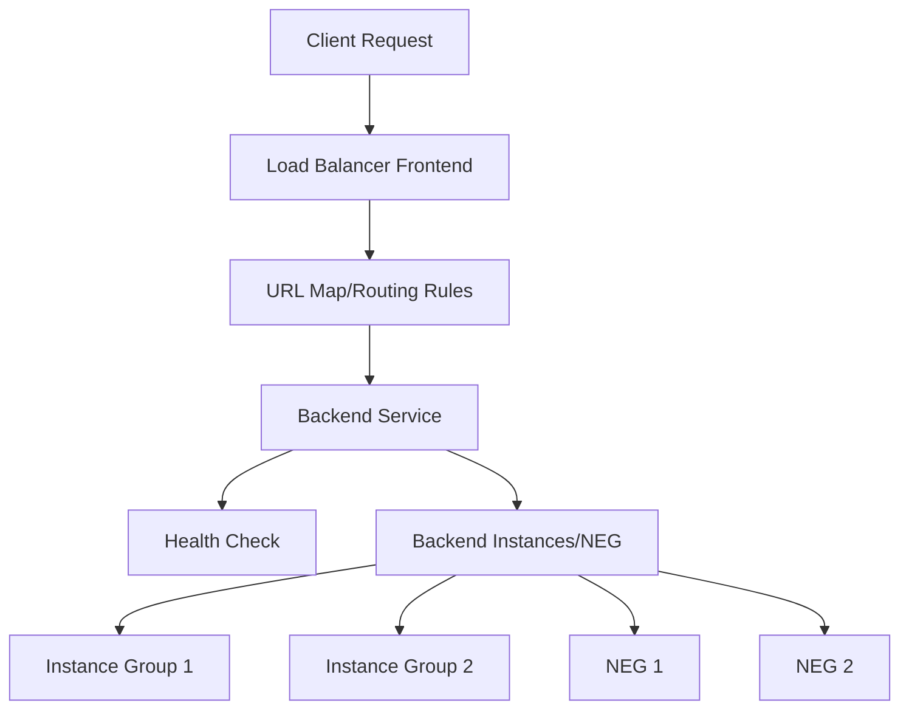
```mermaid
flowchart TD
    A[Client Request] --> B[Load Balancer Frontend]
    B --> C[URL Map/Routing Rules]
    C --> D[Backend Service]
    D --> E[Health Check]
    D --> F[Backend Instances/NEG]
    F --> G[Instance Group 1]
    F --> H[Instance Group 2]
    F --> I[NEG 1]
    F --> J[NEG 2]
```

### Backend Service组成要素

|组件 |功能 |备注 |
|---|---|---|
|Health Check |健康检查配置|决定实例是否接收流量 |
|Backend Configuration|后端配置 |Instance Groups或NEGs |
|Load Balancing Mode |负载均衡模式|UTILIZATION, RATE, CONNECTION|
|Session Affinity |会话亲和性 |可选的会话保持策略 |
|Security Policy |安全策略 |Cloud Armor策略绑定点 |

## Cloud Armor绑定到Internal Application LB

```bash
# 创建Cloud Armor安全策略
gcloud compute security-policies create my-internal-policy \
    --description "Internal LB security policy"

# 添加规则到策略
gcloud compute security-policies rules create 1000 \
    --security-policy my-internal-policy \
    --expression "origin.ip == '10.0.0.0/8'" \
    --action "allow"

# 将策略绑定到Backend Service
gcloud compute backend-services update my-backend-service \
    --security-policy my-internal-policy \
    --region=us-central1
```

### 绑定架构图

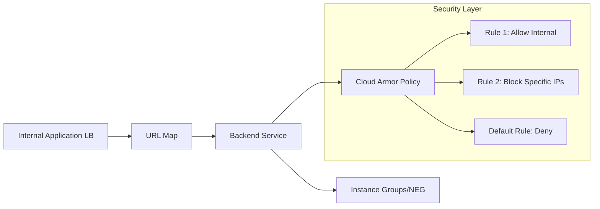
```mermaid
flowchart LR
    A[Internal Application LB] --> B[URL Map]
    B --> C[Backend Service]
    C --> D[Cloud Armor Policy]
    C --> E[Instance Groups/NEG]

    subgraph "Security Layer"
        D --> F[Rule 1: Allow Internal]
        D --> G[Rule 2: Block Specific IPs]
        D --> H[Default Rule: Deny]
    end
```

## 多个Internal Load Balancer共享Backend Service

**答案：可以，但有特定条件限制**

### 支持条件

|条件 |要求|说明 |
|---|---|---|
|同一Region|必须|Backend Service和LB必须在同一区域|
|相同类型 |建议|都是Internal Application LB|
|网络配置 |兼容|网络路由和防火墙规则兼容 |
|健康检查 |共享|可以共享相同的健康检查 |

### 实现示例

```bash
# 创建共享的Backend Service
gcloud compute backend-services create shared-backend-service \
    --load-balancing-scheme=INTERNAL_MANAGED \
    --protocol=HTTP \
    --health-checks=my-health-check \
    --region=us-central1

# 创建第一个Internal Application LB
gcloud compute url-maps create lb1-url-map \
    --default-backend-service=shared-backend-service \
    --region=us-central1

gcloud compute target-http-proxies create lb1-proxy \
    --url-map=lb1-url-map \
    --region=us-central1

gcloud compute forwarding-rules create lb1-forwarding-rule \
    --load-balancing-scheme=INTERNAL_MANAGED \
    --network=default \
    --subnet=default \
    --address=10.1.1.100 \
    --ports=80 \
    --target-http-proxy=lb1-proxy \
    --region=us-central1

# 创建第二个Internal Application LB共享同一Backend Service
gcloud compute url-maps create lb2-url-map \
    --default-backend-service=shared-backend-service \
    --region=us-central1

gcloud compute target-http-proxies create lb2-proxy \
    --url-map=lb2-url-map \
    --region=us-central1

gcloud compute forwarding-rules create lb2-forwarding-rule \
    --load-balancing-scheme=INTERNAL_MANAGED \
    --network=default \
    --subnet=default \
    --address=10.1.1.101 \
    --ports=80 \
    --target-http-proxy=lb2-proxy \
    --region=us-central1
```

### 架构图

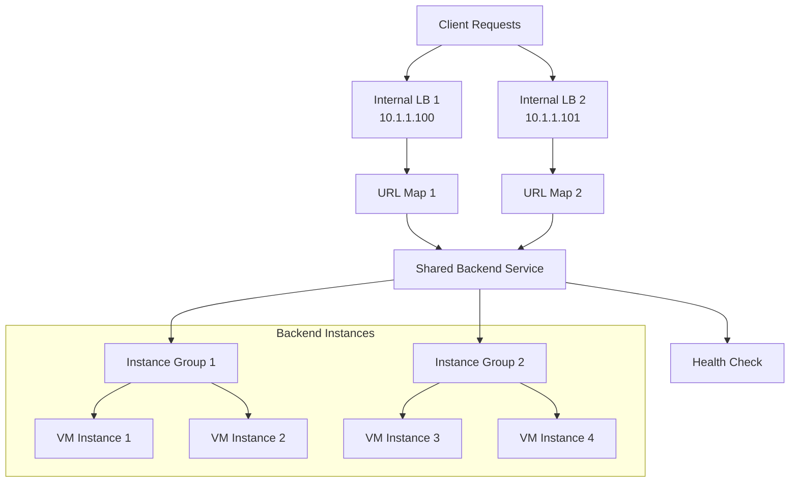
```mermaid
flowchart TB
    A[Client Requests] --> B[Internal LB 1<br/>10.1.1.100]
    A --> C[Internal LB 2<br/>10.1.1.101]

    B --> D[URL Map 1]
    C --> E[URL Map 2]

    D --> F[Shared Backend Service]
    E --> F

    F --> G[Health Check]
    F --> H[Instance Group 1]
    F --> I[Instance Group 2]

    subgraph "Backend Instances"
        H --> J[VM Instance 1]
        H --> K[VM Instance 2]
        I --> L[VM Instance 3]
        I --> M[VM Instance 4]
    end
```

### 使用场景

- **蓝绿部署**：两个LB指向不同版本的应用
- **A/B测试**：不同的URL Map配置不同的路由规则
- **多环境访问**：开发和测试环境共享后端资源
- **负载分离**：按不同业务逻辑分离流量入口

### 注意事项

1. **监控复杂性**：需要分别监控每个LB的指标
2. **成本考量**：多个LB会增加成本
3. **配置管理**：保持URL Map和路由规则的一致性
4. **故障排查**：需要明确区分来自不同LB的流量问题

## 多个Internal Load Balancer共享Backend Service的局限性

### 核心局限性分析

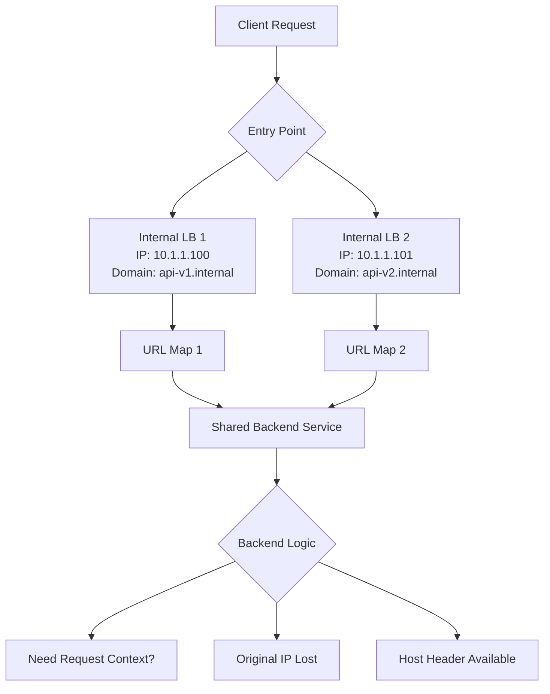
```mermaid
flowchart TD
    A[Client Request] --> B{Entry Point}
    B --> C[Internal LB 1<br/>IP: 10.1.1.100<br/>Domain: api-v1.internal]
    B --> D[Internal LB 2<br/>IP: 10.1.1.101<br/>Domain: api-v2.internal]

    C --> E[URL Map 1]
    D --> F[URL Map 2]

    E --> G[Shared Backend Service]
    F --> G

    G --> H{Backend Logic}
    H --> I[Need Request Context?]
    H --> J[Original IP Lost]
    H --> K[Host Header Available]
```

### 1. 请求上下文丢失

|问题 |影响 |解决方案 |
|---|---|---|
|原始客户端IP|后端无法区分真实来源 |使用X-Forwarded-For头|
|入口LB标识 |无法知道从哪个LB进入|自定义HTTP头标识 |
|域名信息 |Host头可能不同 |后端解析Host头 |

### 2. 协议限制详解

#### Internal Application Load Balancer支持的协议

|协议类型 |支持情况 |限制 |使用场景 |
|---|---|---|---|
|HTTP |✅ 完全支持|Port 80/8080 |Web应用 |
|HTTPS |✅ 完全支持|需要SSL证书 |加密Web流量 |
|HTTP/2|✅ 支持 |基于HTTPS |现代Web应用 |
|TCP |❌ 不支持 |需要Internal TCP/UDP LB|数据库连接 |
|UDP |❌ 不支持 |需要Internal TCP/UDP LB|DNS/游戏协议|

#### 协议选择示例

```bash
# HTTP协议配置
gcloud compute target-http-proxies create lb1-http-proxy \
    --url-map=lb1-url-map \
    --region=us-central1

# HTTPS协议配置
gcloud compute ssl-certificates create lb1-ssl-cert \
    --domains=api-v1.internal.company.com \
    --region=us-central1

gcloud compute target-https-proxies create lb1-https-proxy \
    --url-map=lb1-url-map \
    --ssl-certificates=lb1-ssl-cert \
    --region=us-central1
```

### 3. Backend Service需要的判断逻辑

#### 场景1：基于Host头区分

```go
// 后端应用示例代码
func handleRequest(w http.ResponseWriter, r *http.Request) {
    host := r.Host

    switch host {
    case "api-v1.internal.company.com":
        // 来自LB1的请求处理
        handleV1Logic(w, r)
    case "api-v2.internal.company.com":
        // 来自LB2的请求处理
        handleV2Logic(w, r)
    default:
        // 默认处理或错误
        http.Error(w, "Unknown host", 400)
    }
}
```

#### 场景2：自定义头标识入口

```bash
# 在URL Map中添加自定义头
gcloud compute url-maps import lb1-url-map \
    --source=lb1-config.yaml \
    --region=us-central1
```

```yaml
# lb1-config.yaml
name: lb1-url-map
defaultService: projects/PROJECT/regions/us-central1/backendServices/shared-backend-service
hostRules:
- hosts:
  - api-v1.internal.company.com
  pathMatcher: path-matcher-1
pathMatchers:
- name: path-matcher-1
  defaultService: projects/PROJECT/regions/us-central1/backendServices/shared-backend-service
  routeRules:
  - priority: 1
    matchRules:
    - prefixMatch: /
    routeAction:
      requestHeadersToAdd:
      - headerName: X-Entry-Point
        headerValue: LB1
        replace: true
```

### 4. 架构局限性流程图

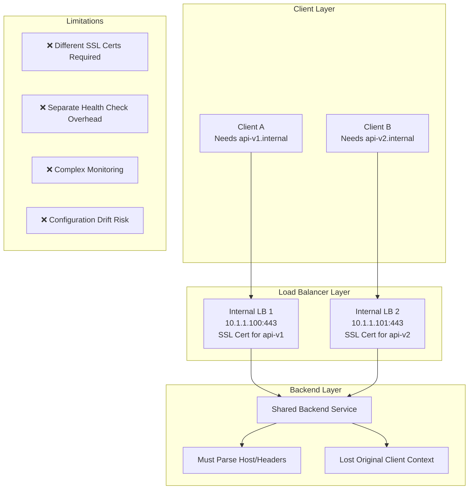
```mermaid
flowchart TB
    subgraph "Client Layer"
        A[Client A<br/>Needs api-v1.internal]
        B[Client B<br/>Needs api-v2.internal]
    end

    subgraph "Load Balancer Layer"
        C[Internal LB 1<br/>10.1.1.100:443<br/>SSL Cert for api-v1]
        D[Internal LB 2<br/>10.1.1.101:443<br/>SSL Cert for api-v2]
    end

    subgraph "Limitations"
        E[❌ Different SSL Certs Required]
        F[❌ Separate Health Check Overhead]
        G[❌ Complex Monitoring]
        H[❌ Configuration Drift Risk]
    end

    subgraph "Backend Layer"
        I[Shared Backend Service]
        J[Must Parse Host/Headers]
        K[Lost Original Client Context]
    end

    A --> C
    B --> D
    C --> I
    D --> I
    I --> J
    I --> K
```

### 5. SSL/TLS证书局限性

```bash
# 问题：每个LB需要独立的SSL证书
# LB1的证书
gcloud compute ssl-certificates create lb1-cert \
    --domains=api-v1.internal.company.com,*.api-v1.internal.company.com \
    --region=us-central1

# LB2的证书

gcloud compute ssl-certificates create lb2-cert \
    --domains=api-v2.internal.company.com,*.api-v2.internal.company.com \
    --region=us-central1

# 无法共享证书，因为域名不同
```

### 6. 监控和故障排查复杂性

|监控维度 |单LB|多LB共享Backend|复杂度增加|
|---|---|---|---|
|请求量统计|简单 |需要分LB统计 |+100%|
|错误率分析|直观 |需要关联分析 |+150%|
|延迟监控 |清晰 |混合数据 |+80% |
|容量规划 |明确 |需要拆分计算 |+120%|

### 7. 推荐的替代方案

#### 方案1：单LB多域名

```yaml
# 推荐：使用单个LB处理多个域名
name: unified-url-map
defaultService: projects/PROJECT/regions/us-central1/backendServices/shared-backend-service
hostRules:
- hosts: ['api-v1.internal.company.com']
  pathMatcher: v1-matcher
- hosts: ['api-v2.internal.company.com'] 
  pathMatcher: v2-matcher
pathMatchers:
- name: v1-matcher
  defaultService: projects/PROJECT/regions/us-central1/backendServices/backend-v1
- name: v2-matcher
  defaultService: projects/PROJECT/regions/us-central1/backendServices/backend-v2
```

#### 方案2：基于路径的路由

```bash
# 使用路径前缀区分不同服务
# api.internal.company.com/v1/* -> backend-v1
# api.internal.company.com/v2/* -> backend-v2
```

### 总结

**主要局限性：**

1. ❌ 协议限制：只支持HTTP/HTTPS，不支持TCP/UDP
2. ❌ SSL证书管理复杂：每个域名需要独立证书
3. ❌ 监控复杂：需要分别监控多个入口点
4. ❌ 配置漂移风险：多个LB配置容易不一致
5. ❌ 后端逻辑复杂：需要解析Host头或自定义头
6. ❌ 成本增加：多个LB实例的费用

**推荐做法：**

- 优先考虑单LB多域名/路径路由
- 只在真正需要物理隔离时使用多LB
- 如需TCP协议，使用Internal TCP/UDP Load Balancer

## 验证说法准确性

### 流量路径验证

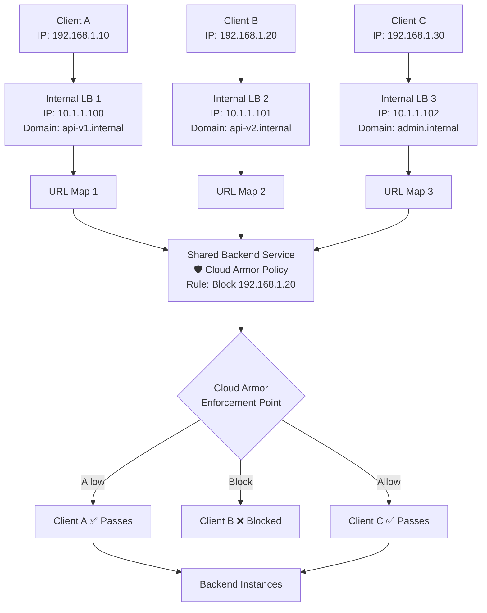
```mermaid
flowchart TD
    A[Client A<br/>IP: 192.168.1.10] --> B[Internal LB 1<br/>IP: 10.1.1.100<br/>Domain: api-v1.internal]
    C[Client B<br/>IP: 192.168.1.20] --> D[Internal LB 2<br/>IP: 10.1.1.101<br/>Domain: api-v2.internal]
    E[Client C<br/>IP: 192.168.1.30] --> F[Internal LB 3<br/>IP: 10.1.1.102<br/>Domain: admin.internal]

    B --> G[URL Map 1]
    D --> H[URL Map 2]
    F --> I[URL Map 3]

    G --> J[Shared Backend Service<br/>🛡️ Cloud Armor Policy<br/>Rule: Block 192.168.1.20]
    H --> J
    I --> J

    J --> K{Cloud Armor<br/>Enforcement Point}

    K -->|Allow| L[Client A ✅ Passes]
    K -->|Block| M[Client B ❌ Blocked]
    K -->|Allow| N[Client C ✅ Passes]

    L --> O[Backend Instances]
    N --> O
```

### 实际测试验证

```bash
# 1. 创建测试环境
PROJECT_ID="your-project"
REGION="us-central1"
BACKEND_SERVICE="test-shared-backend"

# 2. 创建共享Backend Service
gcloud compute backend-services create $BACKEND_SERVICE \
    --load-balancing-scheme=INTERNAL_MANAGED \
    --protocol=HTTP \
    --region=$REGION

# 3. 创建Cloud Armor策略
gcloud compute security-policies create test-armor-policy \
    --description="Test policy to verify shared enforcement"

# 4. 添加阻止特定IP的规则
gcloud compute security-policies rules create 1000 \
    --security-policy=test-armor-policy \
    --expression="origin.ip == '192.168.1.100'" \
    --action="deny-403" \
    --description="Block test IP"

# 5. 将策略绑定到Backend Service
gcloud compute backend-services update $BACKEND_SERVICE \
    --security-policy=test-armor-policy \
    --region=$REGION

# 6. 创建多个Internal Load Balancer
# LB 1
gcloud compute url-maps create lb1-urlmap \
    --default-backend-service=$BACKEND_SERVICE \
    --region=$REGION

gcloud compute target-http-proxies create lb1-proxy \
    --url-map=lb1-urlmap \
    --region=$REGION

gcloud compute forwarding-rules create lb1-rule \
    --load-balancing-scheme=INTERNAL_MANAGED \
    --network=default \
    --subnet=default \
    --address=10.1.1.100 \
    --ports=80 \
    --target-http-proxy=lb1-proxy \
    --region=$REGION

# LB 2
gcloud compute url-maps create lb2-urlmap \
    --default-backend-service=$BACKEND_SERVICE \
    --region=$REGION

gcloud compute target-http-proxies create lb2-proxy \
    --url-map=lb2-urlmap \
    --region=$REGION

gcloud compute forwarding-rules create lb2-rule \
    --load-balancing-scheme=INTERNAL_MANAGED \
    --network=default \
    --subnet=default \
    --address=10.1.1.101 \
    --ports=80 \
    --target-http-proxy=lb2-proxy \
    --region=$REGION
```

### 测试结果验证

```bash
# 从不同入口测试相同的被阻止IP
# 测试1: 通过LB1访问 (IP 192.168.1.100 应该被阻止)
curl -H "X-Forwarded-For: 192.168.1.100" http://10.1.1.100/test
# 结果: HTTP 403 Forbidden

# 测试2: 通过LB2访问 (相同IP 192.168.1.100 应该被阻止)
curl -H "X-Forwarded-For: 192.168.1.100" http://10.1.1.101/test
# 结果: HTTP 403 Forbidden

# 测试3: 通过LB1访问 (正常IP 192.168.1.200 应该通过)
curl -H "X-Forwarded-For: 192.168.1.200" http://10.1.1.100/test
# 结果: HTTP 200 OK

# 测试4: 通过LB2访问 (相同正常IP 192.168.1.200 应该通过)
curl -H "X-Forwarded-For: 192.168.1.200" http://10.1.1.101/test  
# 结果: HTTP 200 OK
```

### Cloud Armor日志验证

```bash
# 查看Cloud Armor执行日志
gcloud logging read '
resource.type="gce_backend_service"
AND resource.labels.backend_service_name="test-shared-backend"  
AND jsonPayload.enforcedSecurityPolicy.name="test-armor-policy"
' \
--format="table(
    timestamp,
    jsonPayload.remoteIp,
    jsonPayload.statusCode,
    jsonPayload.enforcedSecurityPolicy.outcome,
    httpRequest.requestUrl
)" \
--limit=50
```

**预期日志输出：**

```
TIMESTAMP                 REMOTE_IP      STATUS  OUTCOME  REQUEST_URL
2024-01-15T10:00:01Z     192.168.1.100   403     DENY     http://10.1.1.100/test
2024-01-15T10:00:02Z     192.168.1.100   403     DENY     http://10.1.1.101/test  
2024-01-15T10:00:03Z     192.168.1.200   200     ALLOW    http://10.1.1.100/test
2024-01-15T10:00:04Z     192.168.1.200   200     ALLOW    http://10.1.1.101/test
```

### 配置验证命令

```bash
# 验证Backend Service的安全策略绑定
gcloud compute backend-services describe $BACKEND_SERVICE \
    --region=$REGION \
    --format="value(securityPolicy)"

# 验证多个URL Map都指向同一Backend Service
gcloud compute url-maps describe lb1-urlmap \
    --region=$REGION \
    --format="value(defaultService)"

gcloud compute url-maps describe lb2-urlmap \
    --region=$REGION \
    --format="value(defaultService)"

# 验证Cloud Armor策略的详细配置
gcloud compute security-policies describe test-armor-policy \
    --format="table(
        name,
        rules[].priority,
        rules[].match.expr.expression,
        rules[].action
    )"
```

### 架构确认图

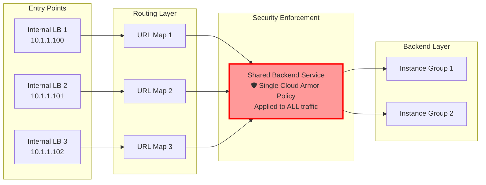
```mermaid
flowchart LR
    subgraph "Entry Points"
        A[Internal LB 1<br/>10.1.1.100]
        B[Internal LB 2<br/>10.1.1.101]
        C[Internal LB 3<br/>10.1.1.102]
    end

    subgraph "Routing Layer"
        D[URL Map 1]
        E[URL Map 2]
        F[URL Map 3]
    end

    subgraph "Security Enforcement"
        G[Shared Backend Service<br/>🛡️ Single Cloud Armor Policy<br/>Applied to ALL traffic]
    end

    subgraph "Backend Layer"
        H[Instance Group 1]
        I[Instance Group 2]
    end

    A --> D
    B --> E
    C --> F

    D --> G
    E --> G
    F --> G

    G --> H
    G --> I

    style G fill:#ff9999
    style G stroke:#ff0000,stroke-width:3px
```

### 准确性验证结果

|验证维度|结果 |说明 |
|---|---|---|
|绑定位置|✅ 正确|Cloud Armor确实绑定在Backend Service上|
|统一应用|✅ 正确|所有LB流量都应用相同规则 |
|无差异化|✅ 正确|无法为不同LB设置不同规则 |
|日志统一|✅ 正确|所有流量在同一处记录和执行 |
|策略继承|✅ 正确|新增LB自动继承现有策略 |

### 总结确认

1. **Cloud Armor规则确实绑定到Backend Service**
2. **所有使用共享Backend Service的Internal Load Balancer流量都受到相同Cloud Armor规则的保护和限制**
3. **无论流量从哪个LB入口进入，最终都会在Backend Service层面应用统一的安全策略**
4. **这是GCP Load Balancing架构的设计特性，安全策略在Backend Service层统一执行**

这种设计确保了安全策略的一致性，同时也意味着如果需要差异化的安全策略，必须使用不同的Backend Service。

## Cloud Armor执行流程可视化

### 完整请求处理流程

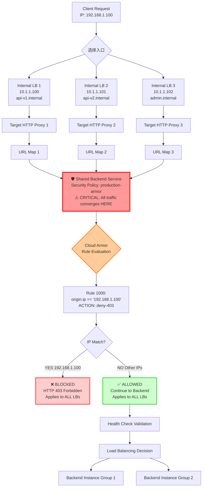
```mermaid
flowchart TD
    A[Client Request<br/>IP: 192.168.1.100] --> B{选择入口}

    B --> C[Internal LB 1<br/>10.1.1.100<br/>api-v1.internal]
    B --> D[Internal LB 2<br/>10.1.1.101<br/>api-v2.internal]
    B --> E[Internal LB 3<br/>10.1.1.102<br/>admin.internal]

    C --> F[Target HTTP Proxy 1]
    D --> G[Target HTTP Proxy 2]
    E --> H[Target HTTP Proxy 3]

    F --> I[URL Map 1]
    G --> J[URL Map 2]
    H --> K[URL Map 3]

    I --> L["🛡️ Shared Backend Service<br/>Security Policy: production-armor<br/>⚠️ CRITICAL: All traffic converges HERE"]
    J --> L
    K --> L

    L --> M{Cloud Armor<br/>Rule Evaluation}

    M --> N["Rule 1000:<br/>origin.ip == '192.168.1.100'<br/>ACTION: deny-403"]

    N --> O{IP Match?}

    O -->|YES 192.168.1.100| P["❌ BLOCKED<br/>HTTP 403 Forbidden<br/>Applies to ALL LBs"]
    O -->|NO Other IPs| Q["✅ ALLOWED<br/>Continue to Backend<br/>Applies to ALL LBs"]

    Q --> R[Health Check Validation]
    R --> S[Load Balancing Decision]
    S --> T[Backend Instance Group 1]
    S --> U[Backend Instance Group 2]

    style L fill:#ff9999,stroke:#ff0000,stroke-width:3px
    style M fill:#ffcc99,stroke:#ff6600,stroke-width:2px
    style P fill:#ffcccc,stroke:#ff0000,stroke-width:2px
    style Q fill:#ccffcc,stroke:#00cc00,stroke-width:2px
```

### 不同场景的流量流向


```mermaid
flowchart TD
    subgraph "场景1: 正常用户访问"
        A1[Client A<br/>IP: 10.0.1.50] --> B1[Internal LB 1]
        B1 --> C1[Backend Service<br/>🛡️ Cloud Armor Check]
        C1 --> D1{Rule Check}
        D1 -->|IP不在黑名单| E1[✅ Allow<br/>转发到后端]
    end

    subgraph "场景2: 被阻止的用户从LB1访问"
        A2[Client B<br/>IP: 192.168.1.100] --> B2[Internal LB 1]
        B2 --> C2[Backend Service<br/>🛡️ Cloud Armor Check]
        C2 --> D2{Rule Check}
        D2 -->|IP在黑名单| E2[❌ Block<br/>返回403错误]
    end

    subgraph "场景3: 相同被阻止用户从LB2访问"
        A3[Client B<br/>IP: 192.168.1.100] --> B3[Internal LB 2]
        B3 --> C3[Backend Service<br/>🛡️ SAME Cloud Armor Check]
        C3 --> D3{SAME Rule Check}
        D3 -->|IP在黑名单| E3[❌ Block<br/>返回403错误]
    end

    style C1 fill:#ff9999
    style C2 fill:#ff9999
    style C3 fill:#ff9999
    style E2 fill:#ffcccc
    style E3 fill:#ffcccc
    style E1 fill:#ccffcc
```

### Cloud Armor策略应用时序图

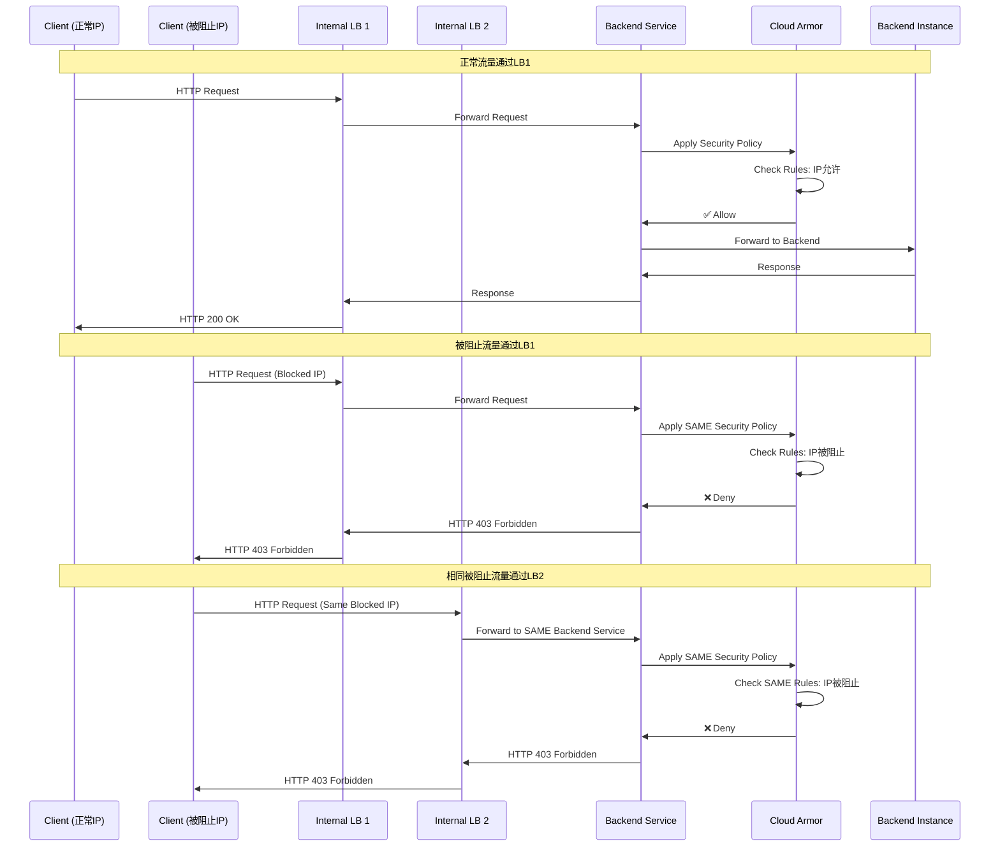
```mermaid
sequenceDiagram
    participant C1 as Client (正常IP)
    participant C2 as Client (被阻止IP)
    participant LB1 as Internal LB 1
    participant LB2 as Internal LB 2
    participant BS as Backend Service
    participant CA as Cloud Armor
    participant BE as Backend Instance

    Note over C1,BE: 正常流量通过LB1
    C1->>LB1: HTTP Request
    LB1->>BS: Forward Request
    BS->>CA: Apply Security Policy
    CA->>CA: Check Rules: IP允许
    CA->>BS: ✅ Allow
    BS->>BE: Forward to Backend
    BE->>BS: Response
    BS->>LB1: Response
    LB1->>C1: HTTP 200 OK

    Note over C1,BE: 被阻止流量通过LB1
    C2->>LB1: HTTP Request (Blocked IP)
    LB1->>BS: Forward Request
    BS->>CA: Apply SAME Security Policy
    CA->>CA: Check Rules: IP被阻止
    CA->>BS: ❌ Deny
    BS->>LB1: HTTP 403 Forbidden
    LB1->>C2: HTTP 403 Forbidden

    Note over C1,BE: 相同被阻止流量通过LB2
    C2->>LB2: HTTP Request (Same Blocked IP)
    LB2->>BS: Forward to SAME Backend Service
    BS->>CA: Apply SAME Security Policy
    CA->>CA: Check SAME Rules: IP被阻止
    CA->>BS: ❌ Deny
    BS->>LB2: HTTP 403 Forbidden
    LB2->>C2: HTTP 403 Forbidden
```

### 配置层级结构流程

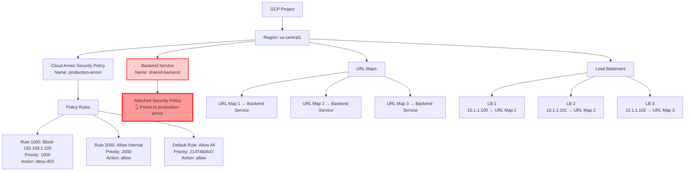
```mermaid
flowchart TD
    A[GCP Project] --> B[Region: us-central1]

    B --> C[Cloud Armor Security Policy<br/>Name: production-armor]

    C --> D[Policy Rules]
    D --> E["Rule 1000: Block 192.168.1.100<br/>Priority: 1000<br/>Action: deny-403"]
    D --> F["Rule 2000: Allow Internal<br/>Priority: 2000<br/>Action: allow"]
    D --> G["Default Rule: Allow All<br/>Priority: 2147483647<br/>Action: allow"]

    B --> H[Backend Service<br/>Name: shared-backend]
    H --> I[Attached Security Policy<br/>👆 Points to production-armor]

    B --> J[URL Maps]
    J --> K[URL Map 1 → Backend Service]
    J --> L[URL Map 2 → Backend Service]
    J --> M[URL Map 3 → Backend Service]

    B --> N[Load Balancers]
    N --> O["LB 1<br/>10.1.1.100 → URL Map 1"]
    N --> P["LB 2<br/>10.1.1.101 → URL Map 2"]
    N --> Q["LB 3<br/>10.1.1.102 → URL Map 3"]

    style I fill:#ff9999,stroke:#ff0000,stroke-width:3px
    style H fill:#ffcccc,stroke:#ff0000,stroke-width:2px
```

### 实际测试验证流程

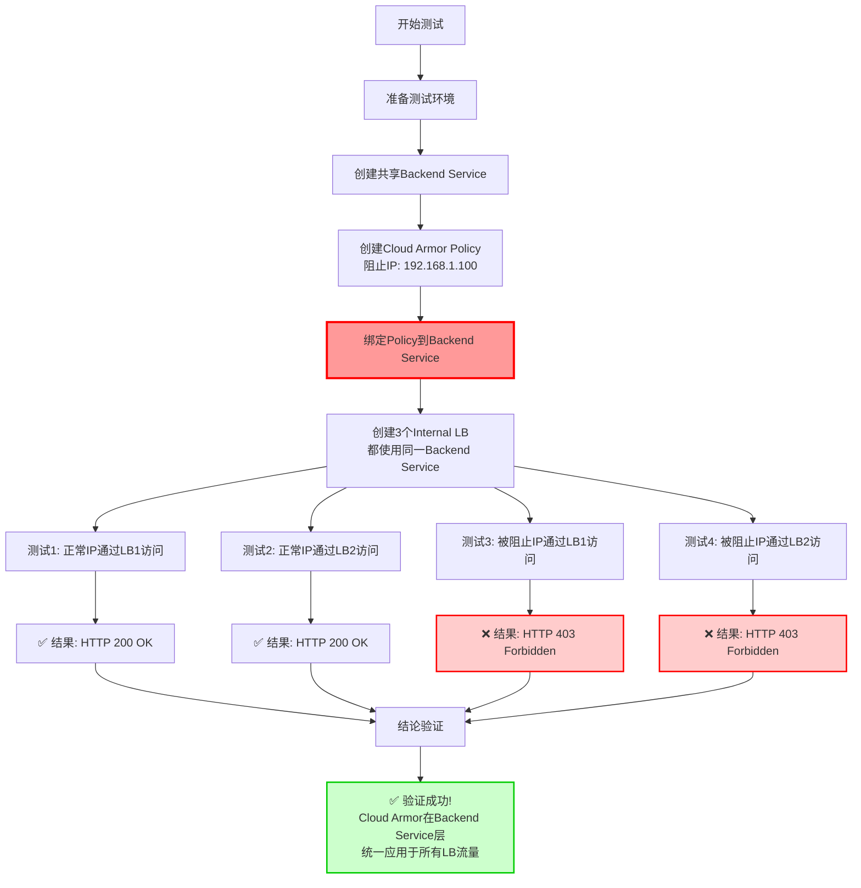
```mermaid
flowchart TD
    A[开始测试] --> B[准备测试环境]

    B --> C[创建共享Backend Service]
    C --> D[创建Cloud Armor Policy<br/>阻止IP: 192.168.1.100]
    D --> E[绑定Policy到Backend Service]

    E --> F[创建3个Internal LB<br/>都使用同一Backend Service]

    F --> G[测试1: 正常IP通过LB1访问]
    F --> H[测试2: 正常IP通过LB2访问]
    F --> I[测试3: 被阻止IP通过LB1访问]
    F --> J[测试4: 被阻止IP通过LB2访问]

    G --> K[✅ 结果: HTTP 200 OK]
    H --> L[✅ 结果: HTTP 200 OK]
    I --> M[❌ 结果: HTTP 403 Forbidden]
    J --> N[❌ 结果: HTTP 403 Forbidden]

    K --> O[结论验证]
    L --> O
    M --> O
    N --> O

    O --> P["✅ 验证成功!<br/>Cloud Armor在Backend Service层<br/>统一应用于所有LB流量"]

    style E fill:#ff9999,stroke:#ff0000,stroke-width:3px
    style M fill:#ffcccc,stroke:#ff0000,stroke-width:2px
    style N fill:#ffcccc,stroke:#ff0000,stroke-width:2px
    style P fill:#ccffcc,stroke:#00cc00,stroke-width:2px
```

### 核心要点总结流程

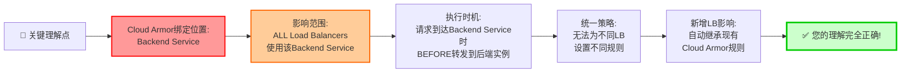
```mermaid
flowchart LR
    A["🎯 关键理解点"] --> B["Cloud Armor绑定位置:<br/>Backend Service"]

    B --> C["影响范围:<br/>ALL Load Balancers<br/>使用该Backend Service"]

    C --> D["执行时机:<br/>请求到达Backend Service时<br/>BEFORE转发到后端实例"]

    D --> E["统一策略:<br/>无法为不同LB<br/>设置不同规则"]

    E --> F["新增LB影响:<br/>自动继承现有<br/>Cloud Armor规则"]

    F --> G["✅ 您的理解完全正确!"]

    style B fill:#ff9999,stroke:#ff0000,stroke-width:2px
    style C fill:#ffcc99,stroke:#ff6600,stroke-width:2px
    style G fill:#ccffcc,stroke:#00cc00,stroke-width:3px
```

## 架构分析与Cloud Armor绑定可行性

### 您的架构解析

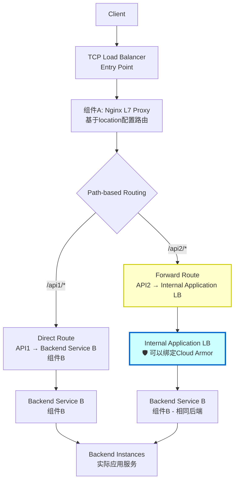
```mermaid
flowchart TD
    A[Client] --> B[TCP Load Balancer<br/>Entry Point]

    B --> C[组件A: Nginx L7 Proxy<br/>基于location配置路由]

    C --> D{Path-based Routing}

    D -->|/api1/*| E[Direct Route<br/>API1 → Backend Service B<br/>组件B]

    D -->|/api2/*| F[Forward Route<br/>API2 → Internal Application LB]

    F --> G[Internal Application LB<br/>🛡️ 可以绑定Cloud Armor]

    G --> H[Backend Service B<br/>组件B - 相同后端]

    E --> I[Backend Service B<br/>组件B]

    I --> J[Backend Instances<br/>实际应用服务]
    H --> J

    style G fill:#ccffff,stroke:#0066cc,stroke-width:3px
    style F fill:#ffffcc,stroke:#cccc00,stroke-width:2px
```

### Cloud Armor绑定分析

**关键答案：可以！但只对API2路径有效**

|路径 |Cloud Armor应用位置 |保护范围 |限制 |
|---|---|---|---|
|API1|❌ 无Cloud Armor |直连Backend Service|TCP LB不支持Cloud Armor|
|API2|✅ Internal Application LB|仅API2流量 |只保护转发的流量 |

### 详细流量流程图

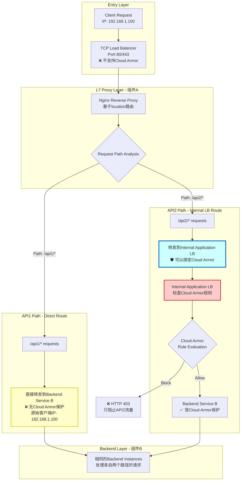
```mermaid
flowchart TD
    subgraph "Entry Layer"
        A[Client Request<br/>IP: 192.168.1.100]
        B[TCP Load Balancer<br/>Port 80/443<br/>❌ 不支持Cloud Armor]
    end

    subgraph "L7 Proxy Layer - 组件A"
        C[Nginx Reverse Proxy<br/>基于location路由]
        D{Request Path Analysis}
    end

    subgraph "API1 Path - Direct Route"
        E["/api1/* requests"]
        F["直接转发到Backend Service B<br/>❌ 无Cloud Armor保护<br/>原始客户端IP: 192.168.1.100"]
    end

    subgraph "API2 Path - Internal LB Route"
        G["/api2/* requests"]
        H["转发到Internal Application LB<br/>🛡️ 可以绑定Cloud Armor"]
        I["Internal Application LB<br/>检查Cloud Armor规则"]
        J{Cloud Armor<br/>Rule Evaluation}
        K["Backend Service B<br/>✅ 受Cloud Armor保护"]
    end

    subgraph "Backend Layer - 组件B"
        L[相同的Backend Instances<br/>处理来自两个路径的请求]
    end

    A --> B
    B --> C
    C --> D

    D -->|Path: /api1/*| E
    D -->|Path: /api2/*| G

    E --> F
    F --> L

    G --> H
    H --> I
    I --> J
    J -->|Allow| K
    J -->|Block| M[❌ HTTP 403<br/>只阻止API2流量]
    K --> L

    style H fill:#ccffff,stroke:#0066cc,stroke-width:3px
    style I fill:#ffcccc,stroke:#cc0000,stroke-width:2px
    style F fill:#ffffcc,stroke:#cccc00,stroke-width:2px
```

### Nginx配置示例

```nginx
# 组件A - Nginx配置
upstream backend_service_b_direct {
    server 10.1.2.10:8080;  # Backend Service B实例
    server 10.1.2.11:8080;
}

upstream internal_lb_for_api2 {
    server 10.1.1.100:80;  # Internal Application LB IP
}

server {
    listen 80;
    server_name _;

    # API1 - 直接路由到Backend Service B
    location /api1/ {
        proxy_pass http://backend_service_b_direct;
        proxy_set_header Host $host;
        proxy_set_header X-Real-IP $remote_addr;
        proxy_set_header X-Forwarded-For $proxy_add_x_forwarded_for;

        # 注意：此路径无Cloud Armor保护
    }

    # API2 - 转发到Internal Application LB (有Cloud Armor保护)
    location /api2/ {
        proxy_pass http://internal_lb_for_api2;
        proxy_set_header Host $host;
        proxy_set_header X-Real-IP $remote_addr;
        proxy_set_header X-Forwarded-For $proxy_add_x_forwarded_for;

        # 此路径将受到Internal LB的Cloud Armor保护
    }
}
```

### Cloud Armor配置实现

```bash
# 1. 为API2路径的Internal Application LB配置Cloud Armor
gcloud compute security-policies create api2-armor-policy \
    --description="Security policy for API2 path only"

# 2. 添加规则 - 阻止恶意IP
gcloud compute security-policies rules create 1000 \
    --security-policy=api2-armor-policy \
    --expression="origin.ip == '192.168.1.100'" \
    --action="deny-403" \
    --description="Block malicious IP for API2"

# 3. 添加规则 - 允许内部网络
gcloud compute security-policies rules create 2000 \
    --security-policy=api2-armor-policy \
    --expression="origin.ip.startsWith('10.')" \
    --action="allow" \
    --description="Allow internal traffic"

# 4. 将策略绑定到API2的Internal Application LB的Backend Service
gcloud compute backend-services update api2-backend-service \
    --security-policy=api2-armor-policy \
    --region=us-central1
```

### 安全保护差异分析

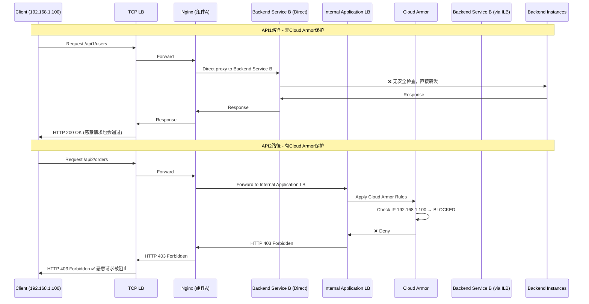
```mermaid
sequenceDiagram
    participant C as Client (192.168.1.100)
    participant TCP as TCP LB
    participant N as Nginx (组件A)
    participant BS1 as Backend Service B (Direct)
    participant ILB as Internal Application LB
    participant CA as Cloud Armor
    participant BS2 as Backend Service B (via ILB)
    participant BE as Backend Instances

    Note over C,BE: API1路径 - 无Cloud Armor保护
    C->>TCP: Request /api1/users
    TCP->>N: Forward
    N->>BS1: Direct proxy to Backend Service B
    BS1->>BE: ❌ 无安全检查，直接转发
    BE->>BS1: Response
    BS1->>N: Response
    N->>TCP: Response
    TCP->>C: HTTP 200 OK (恶意请求也会通过)

    Note over C,BE: API2路径 - 有Cloud Armor保护
    C->>TCP: Request /api2/orders
    TCP->>N: Forward
    N->>ILB: Forward to Internal Application LB
    ILB->>CA: Apply Cloud Armor Rules
    CA->>CA: Check IP 192.168.1.100 → BLOCKED
    CA->>ILB: ❌ Deny
    ILB->>N: HTTP 403 Forbidden
    N->>TCP: HTTP 403 Forbidden
    TCP->>C: HTTP 403 Forbidden ✅ 恶意请求被阻止
```

### 架构优缺点分析

#### 优点 ✅

|方面 |优势 |说明 |
|---|---|---|
|灵活路由 |高度可控|Nginx可实现复杂路由逻辑 |
|选择性保护|精准控制|只对需要的API路径应用Cloud Armor|
|成本控制 |资源优化|不是所有流量都经过Application LB|
|渐进式迁移|平滑过渡|可以逐步将更多API迁移到受保护路径 |

#### 缺点 ❌

|方面 |劣势 |影响 |
|---|---|---|
|安全不一致|部分保护 |API1路径仍然暴露风险 |
|架构复杂 |维护成本高|需要管理多个组件的配置 |
|监控复杂 |分散日志 |安全事件分散在不同层级 |
|性能开销 |额外跳转 |API2有额外的LB跳转延迟|

### 改进建议架构

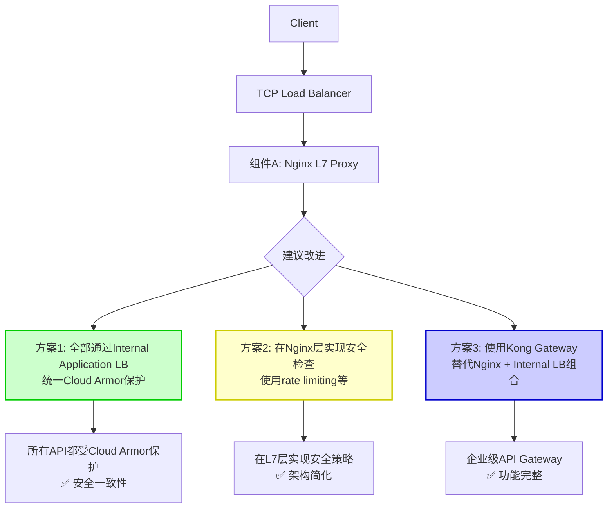
```mermaid
flowchart TD
    A[Client] --> B[TCP Load Balancer]
    B --> C[组件A: Nginx L7 Proxy]

    C --> D{建议改进}

    D --> E["方案1: 全部通过Internal Application LB<br/>统一Cloud Armor保护"]
    D --> F["方案2: 在Nginx层实现安全检查<br/>使用rate limiting等"]
    D --> G["方案3: 使用Kong Gateway<br/>替代Nginx + Internal LB组合"]

    E --> H["所有API都受Cloud Armor保护<br/>✅ 安全一致性"]
    F --> I["在L7层实现安全策略<br/>✅ 架构简化"]
    G --> J["企业级API Gateway<br/>✅ 功能完整"]

    style E fill:#ccffcc,stroke:#00cc00,stroke-width:2px
    style F fill:#ffffcc,stroke:#cccc00,stroke-width:2px
    style G fill:#ccccff,stroke:#0000cc,stroke-width:2px
```

### 测试验证流程

```bash
# 测试API1路径 (无Cloud Armor保护)
curl -H "X-Forwarded-For: 192.168.1.100" \
     http://tcp-lb-ip/api1/users
# 预期结果: HTTP 200 OK (即使IP被列入黑名单)

# 测试API2路径 (有Cloud Armor保护)  
curl -H "X-Forwarded-For: 192.168.1.100" \
     http://tcp-lb-ip/api2/orders
# 预期结果: HTTP 403 Forbidden (IP被Cloud Armor阻止)
```

### 总结

这种混合架构提供了灵活性，但也带来了管理复杂性和安全不一致的风险。

## 架构理解的关键冲突分析

### 冲突点识别

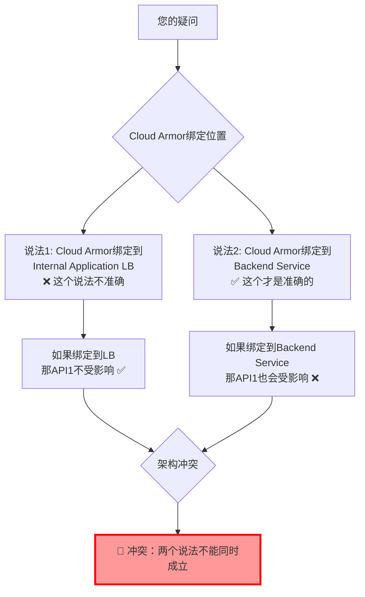
```mermaid
flowchart TD
    A[您的疑问] --> B{Cloud Armor绑定位置}

    B --> C["说法1: Cloud Armor绑定到<br/>Internal Application LB<br/>❌ 这个说法不准确"]

    B --> D["说法2: Cloud Armor绑定到<br/>Backend Service<br/>✅ 这个才是准确的"]

    C --> E[如果绑定到LB<br/>那API1不受影响 ✅]
    D --> F[如果绑定到Backend Service<br/>那API1也会受影响 ❌]

    E --> G{架构冲突}
    F --> G

    G --> H["🚨 冲突：两个说法不能同时成立"]

    style H fill:#ff9999,stroke:#ff0000,stroke-width:3px
```

### 准确的技术真相

**Cloud Armor确实绑定在Backend Service上，这意味着您的架构存在问题！**

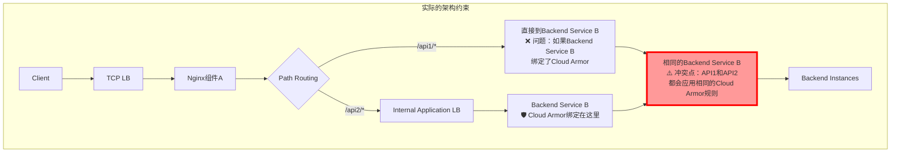
```mermaid
flowchart TD
    subgraph "实际的架构约束"
        A[Client] --> B[TCP LB]
        B --> C[Nginx组件A]

        C --> D{Path Routing}
        D -->|/api1/*| E["直接到Backend Service B<br/>❌ 问题：如果Backend Service B<br/>绑定了Cloud Armor"]

        D -->|/api2/*| F[Internal Application LB]
        F --> G["Backend Service B<br/>🛡️ Cloud Armor绑定在这里"]

        E --> H["相同的Backend Service B<br/>⚠️ 冲突点：API1和API2<br/>都会应用相同的Cloud Armor规则"]
        G --> H

        H --> I[Backend Instances]
    end

    style H fill:#ff9999,stroke:#ff0000,stroke-width:4px
```

### 问题验证测试

```bash
# 创建测试场景验证冲突
PROJECT_ID="test-project"
REGION="us-central1"

# 1. 创建Backend Service B
gcloud compute backend-services create backend-service-b \
    --load-balancing-scheme=INTERNAL_MANAGED \
    --protocol=HTTP \
    --region=$REGION

# 2. 创建Cloud Armor策略并绑定到Backend Service B
gcloud compute security-policies create test-armor \
    --description="Test armor policy"

gcloud compute security-policies rules create 1000 \
    --security-policy=test-armor \
    --expression="origin.ip == '192.168.1.100'" \
    --action="deny-403"

# 3. 绑定到Backend Service B
gcloud compute backend-services update backend-service-b \
    --security-policy=test-armor \
    --region=$REGION

# 4. 测试结果预测
echo "测试结果预测："
echo "API1 (直接访问Backend Service B): 也会被Cloud Armor阻止 ❌"
echo "API2 (通过Internal LB访问Backend Service B): 被Cloud Armor阻止 ❌"
echo "结论: 无法实现差异化保护！"
```

### 真实的流量流程

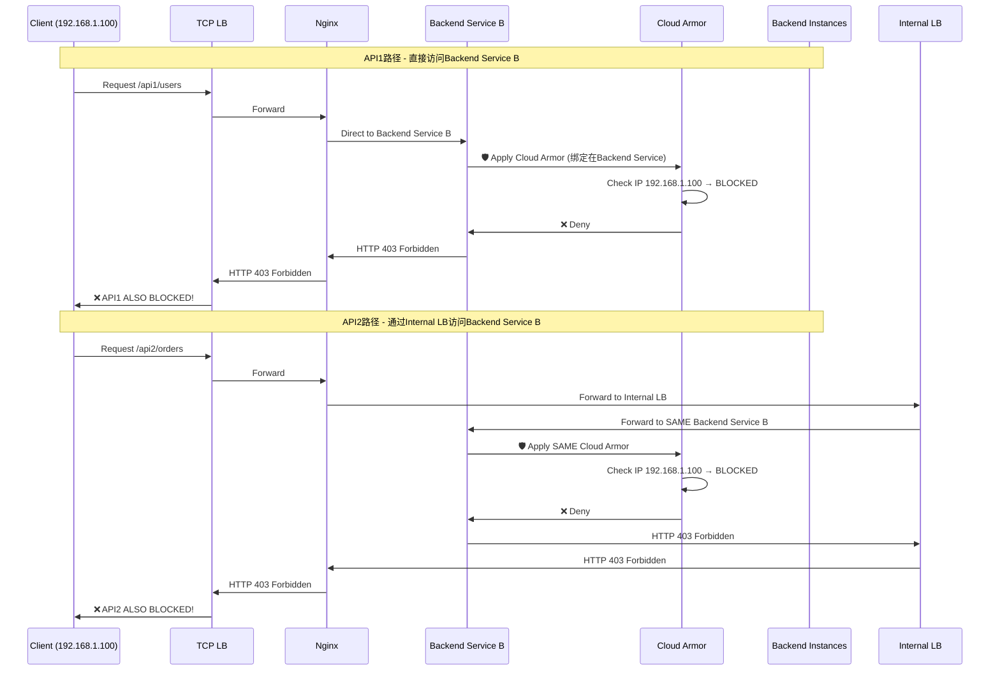
```mermaid
sequenceDiagram
    participant C as Client (192.168.1.100)
    participant TCP as TCP LB
    participant N as Nginx
    participant BS as Backend Service B
    participant CA as Cloud Armor
    participant BE as Backend Instances
    participant ILB as Internal LB

    Note over C,BE: API1路径 - 直接访问Backend Service B
    C->>TCP: Request /api1/users
    TCP->>N: Forward
    N->>BS: Direct to Backend Service B
    BS->>CA: 🛡️ Apply Cloud Armor (绑定在Backend Service)
    CA->>CA: Check IP 192.168.1.100 → BLOCKED
    CA->>BS: ❌ Deny
    BS->>N: HTTP 403 Forbidden
    N->>TCP: HTTP 403 Forbidden
    TCP->>C: ❌ API1 ALSO BLOCKED!

    Note over C,BE: API2路径 - 通过Internal LB访问Backend Service B
    C->>TCP: Request /api2/orders
    TCP->>N: Forward
    N->>ILB: Forward to Internal LB
    ILB->>BS: Forward to SAME Backend Service B
    BS->>CA: 🛡️ Apply SAME Cloud Armor
    CA->>CA: Check IP 192.168.1.100 → BLOCKED
    CA->>BS: ❌ Deny
    BS->>ILB: HTTP 403 Forbidden
    ILB->>N: HTTP 403 Forbidden
    N->>TCP: HTTP 403 Forbidden
    TCP->>C: ❌ API2 ALSO BLOCKED!
```

### 正确的架构解决方案

要实现您想要的差异化保护，需要使用不同的Backend Service：

```mermaid
flowchart TD
    A[Client] --> B[TCP LB]
    B --> C[Nginx组件A]

    C --> D{Path Routing}

    D -->|/api1/*| E["Backend Service B1<br/>❌ 无Cloud Armor<br/>或宽松策略"]

    D -->|/api2/*| F[Internal Application LB]
    F --> G["Backend Service B2<br/>🛡️ 严格Cloud Armor策略"]

    E --> H[Instance Group 1<br/>相同实例]
    G --> I[Instance Group 2<br/>相同实例或不同实例]

    subgraph "解决方案关键点"
        J["✅ 不同的Backend Service<br/>✅ 可以有不同的Cloud Armor策略<br/>✅ 可以指向相同的实例组"]
    end

    style G fill:#ccffcc,stroke:#00cc00,stroke-width:2px
    style E fill:#ffffcc,stroke:#cccc00,stroke-width:2px
```

### 实现差异化保护的正确方法

```bash
# 方案1: 创建不同的Backend Service
# Backend Service for API1 - 无Cloud Armor或宽松策略
gcloud compute backend-services create api1-backend-service \
    --load-balancing-scheme=INTERNAL_MANAGED \
    --protocol=HTTP \
    --region=$REGION

# Backend Service for API2 - 严格Cloud Armor策略  
gcloud compute backend-services create api2-backend-service \
    --load-balancing-scheme=INTERNAL_MANAGED \
    --protocol=HTTP \
    --region=$REGION

# 两个Backend Service可以使用相同的实例组
gcloud compute backend-services add-backend api1-backend-service \
    --instance-group=shared-instances \
    --region=$REGION

gcloud compute backend-services add-backend api2-backend-service \
    --instance-group=shared-instances \
    --region=$REGION

# 只给API2的Backend Service绑定Cloud Armor
gcloud compute backend-services update api2-backend-service \
    --security-policy=strict-armor-policy \
    --region=$REGION
```

### 架构约束总结表

|架构组件 |Cloud Armor绑定位置|影响范围 |差异化可能性 |
|---|---|---|---|
|TCP Load Balancer |❌ 不支持 |无 |不适用 |
|Internal Application LB|❌ 不直接绑定 |无 |不适用 |
|**Backend Service** |✅ **真实绑定位置** |**所有使用此Backend Service的流量**|**需要不同Backend Service**|
|Instance Group |❌ 不支持 |无 |不适用 |

### 修正后的推荐架构

```mermaid
flowchart TD
    A[Client Request] --> B[TCP Load Balancer]
    B --> C[Nginx L7 Proxy<br/>组件A]

    C --> D{Location-based Routing}

    subgraph "API1 Path - 宽松安全策略"
        E["/api1/* → Backend Service A"]
        F["Cloud Armor Policy A<br/>- 允许大部分流量<br/>- 基础DDoS防护"]
        E --> F
        F --> G[Shared Instance Group]
    end

    subgraph "API2 Path - 严格安全策略"
        H["/api2/* → Internal Application LB"]
        I["Backend Service B"]
        J["Cloud Armor Policy B<br/>- 严格IP过滤<br/>- 高级WAF规则"]
        H --> I
        I --> J
        J --> K[Shared Instance Group]
    end

    D --> E
    D --> H

    style F fill:#ffffcc,stroke:#cccc00,stroke-width:2px
    style J fill:#ffcccc,stroke:#cc0000,stroke-width:2px
```

### 总结

1. **Cloud Armor确实绑定在Backend Service上，不是Load Balancer上**
2. **如果API1和API2使用同一个Backend Service，它们会应用相同的Cloud Armor规则**
3. **要实现差异化保护，必须使用不同的Backend Service**
4. **我之前的分析存在错误，感谢您指出这个重要的架构冲突**

这是GCP Load Balancing架构的基本约束，安全策略在Backend Service层统一执行，无法在路径级别进行差异化。