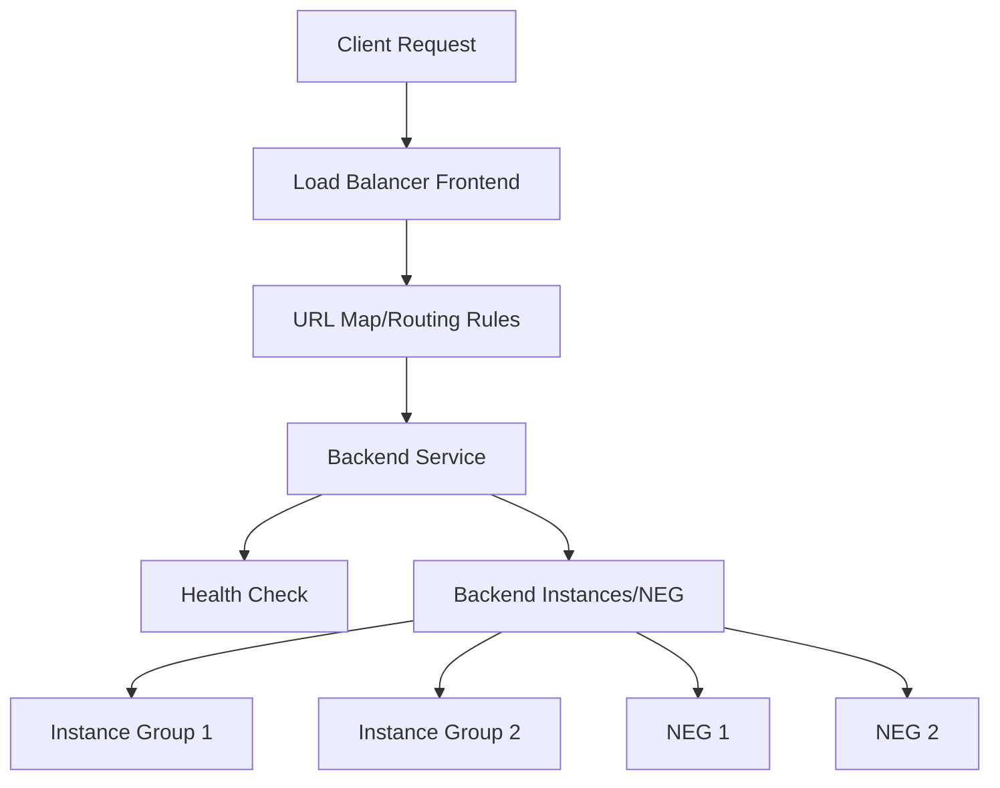
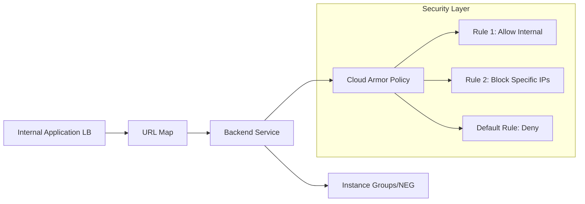
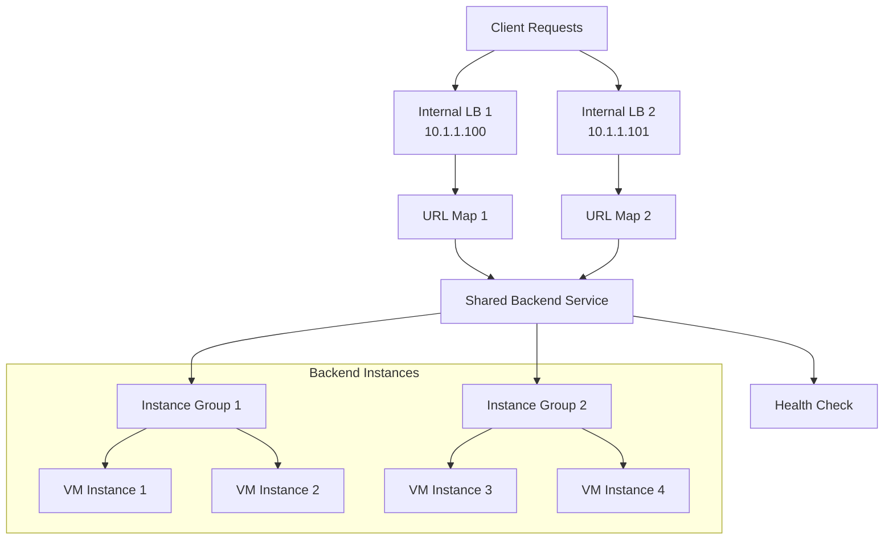
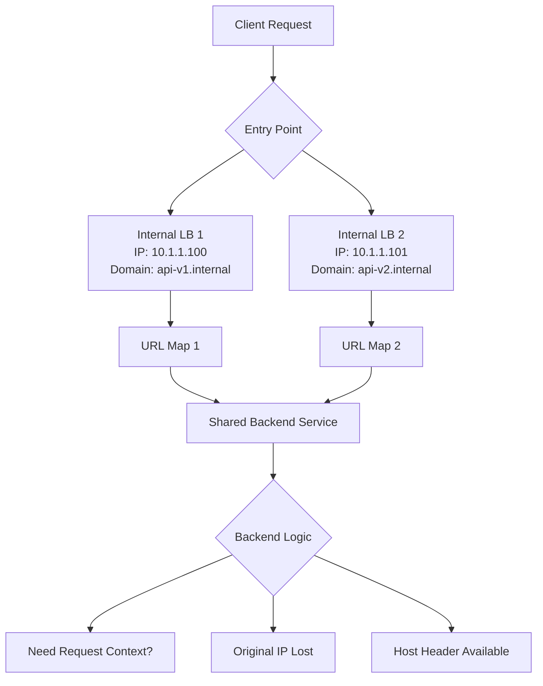
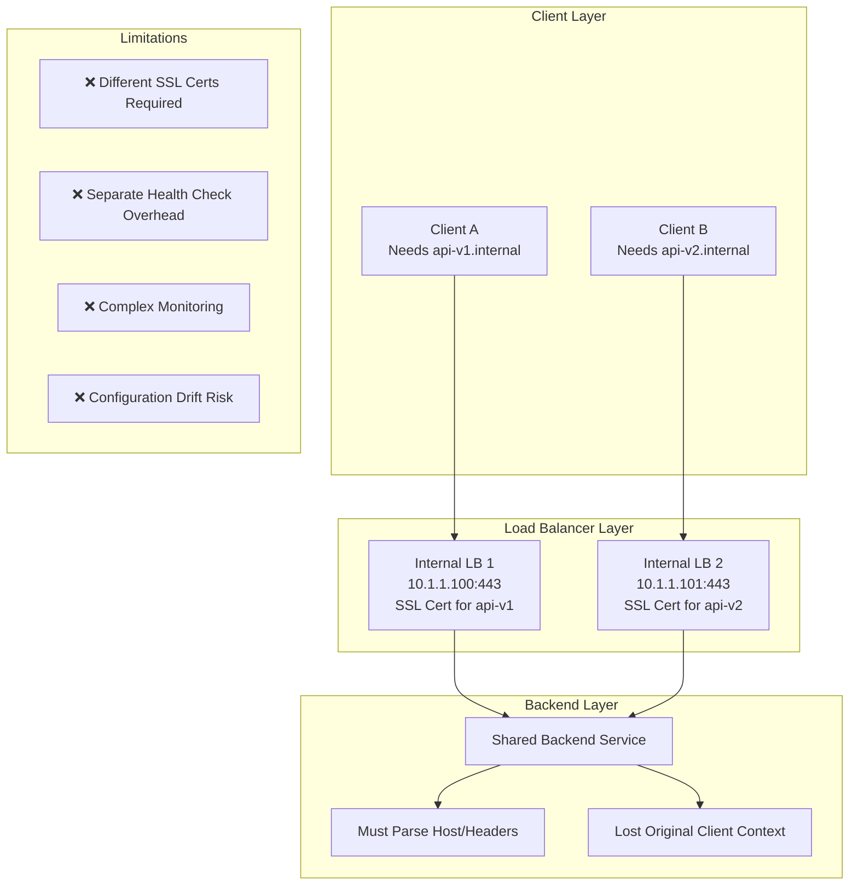
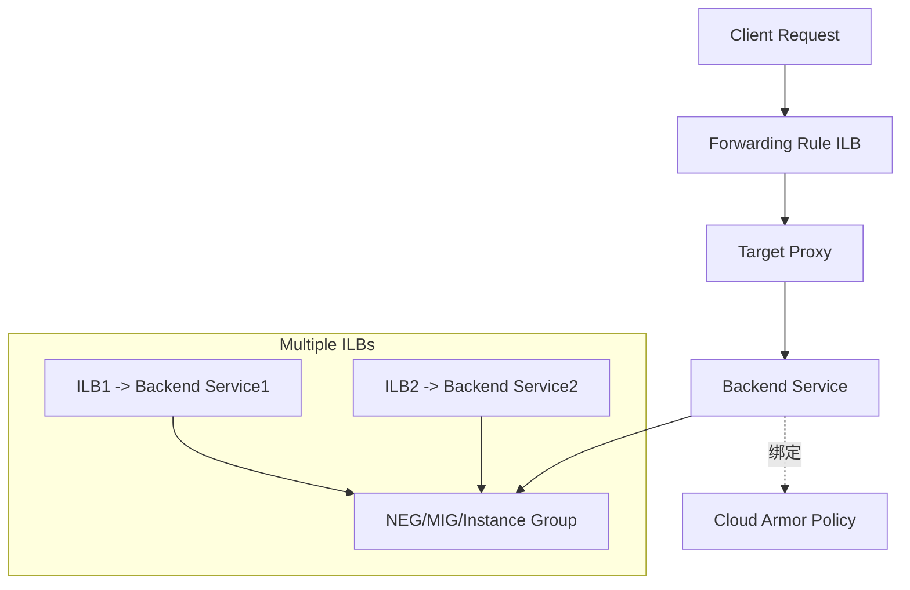

## Backend Service in GCP

Backend Service是GCP负载均衡架构中的核心组件，它定义了如何将流量分发到后端实例组或NEG（Network Endpoint Groups）。

### Backend Service核心概念



### Backend Service组成要素

|组件                   |功能    |备注                           |
|---------------------|------|-----------------------------|
|Health Check         |健康检查配置|决定实例是否接收流量                   |
|Backend Configuration|后端配置  |Instance Groups或NEGs         |
|Load Balancing Mode  |负载均衡模式|UTILIZATION, RATE, CONNECTION|
|Session Affinity     |会话亲和性 |可选的会话保持策略                    |
|Security Policy      |安全策略  |Cloud Armor策略绑定点             |

## Cloud Armor绑定到Internal Application LB

```bash
# 创建Cloud Armor安全策略
gcloud compute security-policies create my-internal-policy \
    --description "Internal LB security policy"

# 添加规则到策略
gcloud compute security-policies rules create 1000 \
    --security-policy my-internal-policy \
    --expression "origin.ip == '10.0.0.0/8'" \
    --action "allow"

# 将策略绑定到Backend Service
gcloud compute backend-services update my-backend-service \
    --security-policy my-internal-policy \
    --region=us-central1
```

### 绑定架构图



## 多个Internal Load Balancer共享Backend Service

**答案：可以，但有特定条件限制**

### 支持条件

|条件      |要求|说明                       |
|--------|--|-------------------------|
|同一Region|必须|Backend Service和LB必须在同一区域|
|相同类型    |建议|都是Internal Application LB|
|网络配置    |兼容|网络路由和防火墙规则兼容             |
|健康检查    |共享|可以共享相同的健康检查              |

### 实现示例

```bash
# 创建共享的Backend Service
gcloud compute backend-services create shared-backend-service \
    --load-balancing-scheme=INTERNAL_MANAGED \
    --protocol=HTTP \
    --health-checks=my-health-check \
    --region=us-central1

# 创建第一个Internal Application LB
gcloud compute url-maps create lb1-url-map \
    --default-backend-service=shared-backend-service \
    --region=us-central1

gcloud compute target-http-proxies create lb1-proxy \
    --url-map=lb1-url-map \
    --region=us-central1

gcloud compute forwarding-rules create lb1-forwarding-rule \
    --load-balancing-scheme=INTERNAL_MANAGED \
    --network=default \
    --subnet=default \
    --address=10.1.1.100 \
    --ports=80 \
    --target-http-proxy=lb1-proxy \
    --region=us-central1

# 创建第二个Internal Application LB共享同一Backend Service
gcloud compute url-maps create lb2-url-map \
    --default-backend-service=shared-backend-service \
    --region=us-central1

gcloud compute target-http-proxies create lb2-proxy \
    --url-map=lb2-url-map \
    --region=us-central1

gcloud compute forwarding-rules create lb2-forwarding-rule \
    --load-balancing-scheme=INTERNAL_MANAGED \
    --network=default \
    --subnet=default \
    --address=10.1.1.101 \
    --ports=80 \
    --target-http-proxy=lb2-proxy \
    --region=us-central1
```

### 架构图



### 使用场景

- **蓝绿部署**：两个LB指向不同版本的应用
- **A/B测试**：不同的URL Map配置不同的路由规则
- **多环境访问**：开发和测试环境共享后端资源
- **负载分离**：按不同业务逻辑分离流量入口

### 注意事项

1. **监控复杂性**：需要分别监控每个LB的指标
2. **成本考量**：多个LB会增加成本
3. **配置管理**：保持URL Map和路由规则的一致性
4. **故障排查**：需要明确区分来自不同LB的流量问题​​​​​​​​​​​​​​​​


## 多个Internal Load Balancer共享Backend Service的局限性

### 核心局限性分析



### 1. 请求上下文丢失

|问题     |影响         |解决方案              |
|-------|-----------|------------------|
|原始客户端IP|后端无法区分真实来源 |使用X-Forwarded-For头|
|入口LB标识 |无法知道从哪个LB进入|自定义HTTP头标识        |
|域名信息   |Host头可能不同  |后端解析Host头         |

### 2. 协议限制详解

#### Internal Application Load Balancer支持的协议

|协议类型  |支持情况  |限制                   |使用场景    |
|------|------|---------------------|--------|
|HTTP  |✅ 完全支持|Port 80/8080         |Web应用   |
|HTTPS |✅ 完全支持|需要SSL证书              |加密Web流量 |
|HTTP/2|✅ 支持  |基于HTTPS              |现代Web应用 |
|TCP   |❌ 不支持 |需要Internal TCP/UDP LB|数据库连接   |
|UDP   |❌ 不支持 |需要Internal TCP/UDP LB|DNS/游戏协议|

#### 协议选择示例

```bash
# HTTP协议配置
gcloud compute target-http-proxies create lb1-http-proxy \
    --url-map=lb1-url-map \
    --region=us-central1

# HTTPS协议配置
gcloud compute ssl-certificates create lb1-ssl-cert \
    --domains=api-v1.internal.company.com \
    --region=us-central1

gcloud compute target-https-proxies create lb1-https-proxy \
    --url-map=lb1-url-map \
    --ssl-certificates=lb1-ssl-cert \
    --region=us-central1
```

### 3. Backend Service需要的判断逻辑

#### 场景1：基于Host头区分

```go
// 后端应用示例代码
func handleRequest(w http.ResponseWriter, r *http.Request) {
    host := r.Host
    
    switch host {
    case "api-v1.internal.company.com":
        // 来自LB1的请求处理
        handleV1Logic(w, r)
    case "api-v2.internal.company.com":
        // 来自LB2的请求处理
        handleV2Logic(w, r)
    default:
        // 默认处理或错误
        http.Error(w, "Unknown host", 400)
    }
}
```

#### 场景2：自定义头标识入口

```bash
# 在URL Map中添加自定义头
gcloud compute url-maps import lb1-url-map \
    --source=lb1-config.yaml \
    --region=us-central1
```

```yaml
# lb1-config.yaml
name: lb1-url-map
defaultService: projects/PROJECT/regions/us-central1/backendServices/shared-backend-service
hostRules:
- hosts:
  - api-v1.internal.company.com
  pathMatcher: path-matcher-1
pathMatchers:
- name: path-matcher-1
  defaultService: projects/PROJECT/regions/us-central1/backendServices/shared-backend-service
  routeRules:
  - priority: 1
    matchRules:
    - prefixMatch: /
    routeAction:
      requestHeadersToAdd:
      - headerName: X-Entry-Point
        headerValue: LB1
        replace: true
```

### 4. 架构局限性流程图



### 5. SSL/TLS证书局限性

```bash
# 问题：每个LB需要独立的SSL证书
# LB1的证书
gcloud compute ssl-certificates create lb1-cert \
    --domains=api-v1.internal.company.com,*.api-v1.internal.company.com \
    --region=us-central1

# LB2的证书  
gcloud compute ssl-certificates create lb2-cert \
    --domains=api-v2.internal.company.com,*.api-v2.internal.company.com \
    --region=us-central1

# 无法共享证书，因为域名不同
```

### 6. 监控和故障排查复杂性

|监控维度 |单LB|多LB共享Backend|复杂度增加|
|-----|---|------------|-----|
|请求量统计|简单 |需要分LB统计     |+100%|
|错误率分析|直观 |需要关联分析      |+150%|
|延迟监控 |清晰 |混合数据        |+80% |
|容量规划 |明确 |需要拆分计算      |+120%|

### 7. 推荐的替代方案

#### 方案1：单LB多域名

```yaml
# 推荐：使用单个LB处理多个域名
name: unified-url-map
defaultService: projects/PROJECT/regions/us-central1/backendServices/shared-backend-service
hostRules:
- hosts: ['api-v1.internal.company.com']
  pathMatcher: v1-matcher
- hosts: ['api-v2.internal.company.com'] 
  pathMatcher: v2-matcher
pathMatchers:
- name: v1-matcher
  defaultService: projects/PROJECT/regions/us-central1/backendServices/backend-v1
- name: v2-matcher
  defaultService: projects/PROJECT/regions/us-central1/backendServices/backend-v2
```

#### 方案2：基于路径的路由

```bash
# 使用路径前缀区分不同服务
# api.internal.company.com/v1/* -> backend-v1
# api.internal.company.com/v2/* -> backend-v2
```

### 总结

**主要局限性：**

1. ❌ 协议限制：只支持HTTP/HTTPS，不支持TCP/UDP
2. ❌ SSL证书管理复杂：每个域名需要独立证书
3. ❌ 监控复杂：需要分别监控多个入口点
4. ❌ 配置漂移风险：多个LB配置容易不一致
5. ❌ 后端逻辑复杂：需要解析Host头或自定义头
6. ❌ 成本增加：多个LB实例的费用

**推荐做法：**

- 优先考虑单LB多域名/路径路由
- 只在真正需要物理隔离时使用多LB
- 如需TCP协议，使用Internal TCP/UDP Load Balancer​​​​​​​​​​​​​​​​


## Q
```bash
Cloud Armor规则确切的说是绑定在internal Application LB上还是Backend Service。比如我多个Internal Application入口用一个Backend Service。那么 我要绑定对应的Cloud Armor究竟绑定到了哪里？我关心的是cloud Armor  应用在了哪里. 比如说我用同一个backend service .但是想在进入backend Servce的上增加一个internal LB 入口。那么我如果将Cloud Armor规则绑定到了这个Backend service那么是不是 等于Cloud Armor规则应用给了所有的LB？
```

## 多个Internal Load Balancer共享Backend Service的局限性

### 核心局限性分析


### 1. 请求上下文丢失

|问题     |影响         |解决方案              |
|-------|-----------|------------------|
|原始客户端IP|后端无法区分真实来源 |使用X-Forwarded-For头|
|入口LB标识 |无法知道从哪个LB进入|自定义HTTP头标识        |
|域名信息   |Host头可能不同  |后端解析Host头         |

### 2. 协议限制详解

#### Internal Application Load Balancer支持的协议

|协议类型  |支持情况  |限制                   |使用场景    |
|------|------|---------------------|--------|
|HTTP  |✅ 完全支持|Port 80/8080         |Web应用   |
|HTTPS |✅ 完全支持|需要SSL证书              |加密Web流量 |
|HTTP/2|✅ 支持  |基于HTTPS              |现代Web应用 |
|TCP   |❌ 不支持 |需要Internal TCP/UDP LB|数据库连接   |
|UDP   |❌ 不支持 |需要Internal TCP/UDP LB|DNS/游戏协议|

#### 协议选择示例

```bash
# HTTP协议配置
gcloud compute target-http-proxies create lb1-http-proxy \
    --url-map=lb1-url-map \
    --region=us-central1

# HTTPS协议配置
gcloud compute ssl-certificates create lb1-ssl-cert \
    --domains=api-v1.internal.company.com \
    --region=us-central1

gcloud compute target-https-proxies create lb1-https-proxy \
    --url-map=lb1-url-map \
    --ssl-certificates=lb1-ssl-cert \
    --region=us-central1
```

### 3. Backend Service需要的判断逻辑

#### 场景1：基于Host头区分

```go
// 后端应用示例代码
func handleRequest(w http.ResponseWriter, r *http.Request) {
    host := r.Host
    
    switch host {
    case "api-v1.internal.company.com":
        // 来自LB1的请求处理
        handleV1Logic(w, r)
    case "api-v2.internal.company.com":
        // 来自LB2的请求处理
        handleV2Logic(w, r)
    default:
        // 默认处理或错误
        http.Error(w, "Unknown host", 400)
    }
}
```

#### 场景2：自定义头标识入口

```bash
# 在URL Map中添加自定义头
gcloud compute url-maps import lb1-url-map \
    --source=lb1-config.yaml \
    --region=us-central1
```

```yaml
# lb1-config.yaml
name: lb1-url-map
defaultService: projects/PROJECT/regions/us-central1/backendServices/shared-backend-service
hostRules:
- hosts:
  - api-v1.internal.company.com
  pathMatcher: path-matcher-1
pathMatchers:
- name: path-matcher-1
  defaultService: projects/PROJECT/regions/us-central1/backendServices/shared-backend-service
  routeRules:
  - priority: 1
    matchRules:
    - prefixMatch: /
    routeAction:
      requestHeadersToAdd:
      - headerName: X-Entry-Point
        headerValue: LB1
        replace: true
```

### 4. 架构局限性流程图


### 5. SSL/TLS证书局限性

```bash
# 问题：每个LB需要独立的SSL证书
# LB1的证书
gcloud compute ssl-certificates create lb1-cert \
    --domains=api-v1.internal.company.com,*.api-v1.internal.company.com \
    --region=us-central1

# LB2的证书  
gcloud compute ssl-certificates create lb2-cert \
    --domains=api-v2.internal.company.com,*.api-v2.internal.company.com \
    --region=us-central1

# 无法共享证书，因为域名不同
```

### 6. 监控和故障排查复杂性

|监控维度 |单LB|多LB共享Backend|复杂度增加|
|-----|---|------------|-----|
|请求量统计|简单 |需要分LB统计     |+100%|
|错误率分析|直观 |需要关联分析      |+150%|
|延迟监控 |清晰 |混合数据        |+80% |
|容量规划 |明确 |需要拆分计算      |+120%|

### 7. 推荐的替代方案

#### 方案1：单LB多域名

```yaml
# 推荐：使用单个LB处理多个域名
name: unified-url-map
defaultService: projects/PROJECT/regions/us-central1/backendServices/shared-backend-service
hostRules:
- hosts: ['api-v1.internal.company.com']
  pathMatcher: v1-matcher
- hosts: ['api-v2.internal.company.com'] 
  pathMatcher: v2-matcher
pathMatchers:
- name: v1-matcher
  defaultService: projects/PROJECT/regions/us-central1/backendServices/backend-v1
- name: v2-matcher
  defaultService: projects/PROJECT/regions/us-central1/backendServices/backend-v2
```

#### 方案2：基于路径的路由

```bash
# 使用路径前缀区分不同服务
# api.internal.company.com/v1/* -> backend-v1
# api.internal.company.com/v2/* -> backend-v2
```

### 总结

**主要局限性：**

1. ❌ 协议限制：只支持HTTP/HTTPS，不支持TCP/UDP
2. ❌ SSL证书管理复杂：每个域名需要独立证书
3. ❌ 监控复杂：需要分别监控多个入口点
4. ❌ 配置漂移风险：多个LB配置容易不一致
5. ❌ 后端逻辑复杂：需要解析Host头或自定义头
6. ❌ 成本增加：多个LB实例的费用

**推荐做法：**

- 优先考虑单LB多域名/路径路由
- 只在真正需要物理隔离时使用多LB
- 如需TCP协议，使用Internal TCP/UDP Load Balancer​​​​​​​​​​​​​​​​


# ChatGPT 

## Q 
```bash
对于GCP工程来说，backend Service 具体是什么？ 比如我有一个Internal的 Application LB. 我想绑定Cloud Armor规则到这个上面。 我知道Policy可以绑定到 backend service和类似gke gateway .另外对于GCP工程来说，一个backend service 能不能拥有2个或者说多个multiple internal load balances . 或者说其即使支持也必须满足的条件是什么？

我想了解如果多个Internal Load Balancer共享Backend Service，有什么局限性？比如是不是意味着不同的入口IP 也就是对应不同的域名，我后端的backend Service 还需要进行判断？入口的internal load balance有协议限制？TCP OR https
```

好的，我们来把 GCP Backend Service 在架构里的角色和你的问题逐一拆开说明：

  

  

  

  

1. 什么是 Backend Service？

  

  

在 Google Cloud 中，Backend Service 是 Load Balancer 的核心配置对象，它定义了流量从 LB 转发到后端的规则。

  

主要包含：

  

- 后端目标（Backends）  
    可以是 GCE Instance Group、NEG (Network Endpoint Group)、Cloud Run、App Engine 等。
- 流量分配规则  
    比如负载均衡算法、容量权重、流量分配比例。
- 健康检查（Health Checks）  
    确定后端是否可用。
- 安全策略  
    比如绑定 Cloud Armor Policy（DDoS、WAF规则）。
- 会话保持、超时 等。

  

  

👉 换句话说，LB 是入口，Backend Service 是流量分发的逻辑。

  

  

  

  

2. Internal Application Load Balancer 和 Backend Service

  

  

当你创建 Internal Application Load Balancer (ILB) 时：

  

- 你会配置 Forwarding Rule → 指向 Target Proxy → 再指向一个 Backend Service。
- Cloud Armor Policy 可以直接绑定到 Backend Service 上，这样进入 ILB 的流量就会先经过 Cloud Armor 检查。

  

  

  

  

  

3. 一个 Backend Service 能否被多个 Internal Load Balancers 共享？

  

  

  

结论：

  

  

- 不可以直接被多个 ILB 共享。  
    每个 Forwarding Rule (ILB 入口) 必须指向一个独立的 Target Proxy，而 Target Proxy 只能指向一个 Backend Service。

  

  

也就是说：

  

- 一个 ILB = 一个 Target Proxy = 一个 Backend Service

  

  

  

  

  

4. 但是能否间接复用？

  

  

可以的，有一些“条件”或“变通方案”：

  

1. 同一个 Backend Service 被多个 Forwarding Rule 引用（跨协议/端口）  
    

- 这种情况只在部分 LB 类型（比如 External HTTPS LB）里支持。
- Internal Application LB（Regional HTTPS LB）中，Forwarding Rule → Target Proxy → Backend Service 是 一对一的链路，所以 Forwarding Rule 不能直接复用 Backend Service。

3.   
    
4. 多个 Backend Service 指向相同的后端（NEG / MIG）  
    

- 如果你希望多个 ILB 共用相同的后端池，可以创建多个 Backend Service，每个都引用同一个 NEG。
- 这样逻辑上等价于“共享”，但实际上是多个 Backend Service 实例。

6.   
    
7. Cloud Armor Policy 共享  
    

- Cloud Armor Policy 是独立对象，可以绑定到多个 Backend Service 上。
- 所以如果只是想让多个 ILB 使用相同的安全规则，可以在多个 Backend Service 上应用同一个 Policy。

9.   
    

  

  

  

  

  

10. 总结

  

|   |   |
|---|---|
|问题|答案|
|Backend Service 是什么？|定义 LB 如何把流量分发到后端，包括后端池、健康检查、安全策略等。|
|Internal Application LB 能绑定 Cloud Armor 吗？|✅ 可以，Cloud Armor Policy 直接绑定到 Backend Service。|
|一个 Backend Service 能否同时属于多个 Internal Load Balancer？|❌ 不行，ILB 架构是一对一（Forwarding Rule → Target Proxy → Backend Service）。|
|如何复用后端或安全策略？|- 多个 Backend Service 可以指向同一个 NEG/MIG。- Cloud Armor Policy 可复用，能应用到多个 Backend Service。|

  

  

  

  

Mermaid 流程图

  


```
```

  

  

  

要不要我帮你写一份 最佳实践配置清单（包括 ILB + Backend Service + Cloud Armor Policy 绑定示例 YAML/命令）？这样你在 GKE 或 GCE 里可以直接套用。