# GCP Backend Service: Architecture and Best Practices

## 1. What is a Backend Service?

A Backend Service is a central component in Google Cloud's load balancing architecture. It defines how incoming traffic is distributed to backend instances, such as virtual machines or containers. It acts as a logical controller for a group of backends, managing their behavior and health.

### Core Components

A Backend Service configuration consists of several key elements:

```mermaid
flowchart TD
    A[Client Request] --> B[Load Balancer Frontend<br/>(Forwarding Rule, Target Proxy)]
    B --> C[URL Map / Routing Rules]
    C --> D[Backend Service]
    D --> E[Health Check]
    D --> F[Backends]
    F --> G[Instance Group 1]
    F --> H[Instance Group 2]
    F --> I[Network Endpoint Group (NEG)]
```

| Component | Function | Notes |
| :--- | :--- | :--- |
| **Backends** | Defines the groups of endpoints that will receive traffic. | Can be Instance Groups or Network Endpoint Groups (NEGs). |
| **Health Check** | Determines if backend instances are healthy and can receive traffic. | Unhealthy instances are automatically removed from rotation. |
| **Load Balancing Mode** | The algorithm used to distribute traffic. | `UTILIZATION`, `RATE`, or `CONNECTION`. |
| **Session Affinity** | Optional session persistence strategy. | Routes requests from the same client to the same backend instance. |
| **Security Policy** | Attaches a Cloud Armor policy for WAF and DDoS protection. | This is the enforcement point for security rules. |
| **Protocol** | The protocol used to communicate with the backends. | e.g., HTTP, HTTPS, HTTP/2. |

--- 

## 2. Sharing a Backend Service Across Multiple Load Balancers

A common architectural question is whether multiple load balancer frontends can direct traffic to a single, shared Backend Service.

**The answer is YES.** You can have multiple Internal Application Load Balancers (or forwarding rules) that point to the same Backend Service.

### How It Works

The architecture involves creating multiple forwarding rules and URL maps that all resolve to the same destination Backend Service.


### Implementation Example

Here is how you would configure two Internal Application LBs to use one Backend Service.

```bash
# 1. Create a shared Backend Service
gcloud compute backend-services create shared-backend-service \
    --load-balancing-scheme=INTERNAL_MANAGED \
    --protocol=HTTP \
    --health-checks=my-health-check \
    --region=us-central1

# 2. Create the first Internal LB
gcloud compute url-maps create lb1-url-map \
    --default-service=shared-backend-service \
    --region=us-central1
gcloud compute target-http-proxies create lb1-proxy \
    --url-map=lb1-url-map \
    --region=us-central1
gcloud compute forwarding-rules create lb1-forwarding-rule \
    --load-balancing-scheme=INTERNAL_MANAGED \
    --network=default \
    --subnet=default \
    --address=10.1.1.100 \
    --ports=80 \
    --target-http-proxy=lb1-proxy \
    --region=us-central1

# 3. Create the second Internal LB pointing to the same Backend Service
gcloud compute url-maps create lb2-url-map \
    --default-service=shared-backend-service \
    --region=us-central1
gcloud compute target-http-proxies create lb2-proxy \
    --url-map=lb2-url-map \
    --region=us-central1
gcloud compute forwarding-rules create lb2-forwarding-rule \
    --load-balancing-scheme=INTERNAL_MANAGED \
    --network=default \
    --subnet=default \
    --address=10.1.1.101 \
    --ports=80 \
    --target-http-proxy=lb2-proxy \
    --region=us-central1
```

### Use Cases

This architecture is useful for:
- **Blue-Green Deployments**: Two LBs can represent different environments (e.g., staging, production) while sharing backend capacity.
- **A/B Testing**: Different URL maps can route percentages of traffic for testing new features.
- **Multi-Tenant Access**: Different tenants or services can have unique entry points (IPs/domains) but share a common backend application.

### Limitations and Considerations

Sharing a Backend Service introduces several important limitations:

| Limitation | Description | Solution / Mitigation | 
| :--- | :--- | :--- |
| **Request Context** | The backend application cannot natively distinguish which LB a request came from. | Use the `Host` header or add a custom request header (e.g., `X-Entry-Point`) in the URL map. |
| **Protocol Restrictions** | Internal Application LBs only support HTTP, HTTPS, and HTTP/2. | For TCP/UDP traffic, you must use an Internal TCP/UDP Load Balancer, which uses a different architecture. |
| **SSL Certificates** | If each LB uses a different domain for HTTPS, each corresponding Target HTTPS Proxy needs its own SSL certificate. | A single wildcard or SAN certificate can be used if domains are related. |
| **Monitoring** | Metrics like request count and latency are aggregated at the Backend Service level, making it harder to analyze per-LB performance. | Use logs and filter by the specific forwarding rule or IP to differentiate traffic. |
| **Configuration Drift** | Managing multiple URL maps and forwarding rules increases the risk of inconsistent configurations. | Use Infrastructure as Code (IaC) to manage and version your configurations. |

--- 

## 3. Cloud Armor Enforcement Point

A critical concept to understand is where Cloud Armor policies are enforced.

**Definitive Answer:** Cloud Armor policies are **bound to and enforced at the Backend Service level**. They are *not* bound to the load balancer's forwarding rule or proxy.

### Implication for Shared Backend Services

If you attach a Cloud Armor policy to a Backend Service that is shared by multiple load balancers, **all traffic from all load balancers will be subject to that single policy.**

It is **not possible** to apply different Cloud Armor rules to different LBs that point to the same Backend Service.

```mermaid
flowchart TD
    subgraph "Entry Points"
        A[Internal LB 1]
        B[Internal LB 2]
        C[Internal LB 3]
    end

    subgraph "Single Point of Enforcement"
        D["🛡️ Shared Backend Service<br/><b>Security Policy: production-armor</b><br/>All traffic converges and is inspected here"]
    end

    subgraph "Backend Pool"
        E[Backend Instances]
    end

    A --> D
    B --> D
    C --> D
    D --> E

    style D fill:#ff9999,stroke:#ff0000,stroke-width:3px
```



### Test Case Verification

This behavior can be easily verified. Assume a Cloud Armor policy is attached to the shared Backend Service, which blocks the IP `192.168.1.100`.

| Test | Command | Expected Result | 
| :--- | :--- | :--- |
| **1. Blocked IP via LB1** | `curl -H "X-Forwarded-For: 192.168.1.100" http://10.1.1.100` | `HTTP 403 Forbidden` |
| **2. Blocked IP via LB2** | `curl -H "X-Forwarded-For: 192.168.1.100" http://10.1.1.101` | `HTTP 403 Forbidden` |
| **3. Allowed IP via LB1** | `curl -H "X-Forwarded-For: 10.0.5.5" http://10.1.1.100` | `HTTP 200 OK` |
| **4. Allowed IP via LB2** | `curl -H "X-Forwarded-For: 10.0.5.5" http://10.1.1.101` | `HTTP 200 OK` |

The policy is enforced uniformly, regardless of the entry point.

--- 

## 4. Architecture for Differentiated Security Policies

If your goal is to apply **different** security rules to different paths or domains (e.g., strict rules for `/api/v1` and lenient rules for `/api/v2`), you **must use separate Backend Services**.

### Correct Architecture

In this model, each path or domain that requires a unique security posture is mapped to its own Backend Service. Each Backend Service can then have a different Cloud Armor policy attached.

These separate Backend Services can still point to the **same backend instances** (Instance Group or NEG).

```mermaid
flowchart TD
    A[Client Request] --> B[Load Balancer Frontend]

    B --> C{URL Map Routing}

    subgraph "Path 1: Strict Security"
        D["/api/v1/*"]
        E[Backend Service A]
        F["🛡️ Cloud Armor Policy A<br/>(Strict Rules)"]
        G[Shared Instance Group]
    end

    subgraph "Path 2: Lenient Security"
        H["/api/v2/*"]
        I[Backend Service B]
        J["🛡️ Cloud Armor Policy B<br/>(Lenient Rules)"]
        G
    end

    C --> D
    C --> H
    D --> E
    E --> F
    F --> G
    H --> I
    I --> J
    J --> G

    style F fill:#ffcccc,stroke:#cc0000,stroke-width:2px
    style J fill:#ccffcc,stroke:#009900,stroke-width:2px
```



### Implementation Example for Differentiated Security

```bash
# 1. Create two Backend Services pointing to the same instance group
gcloud compute backend-services create api-v1-bs --region=us-central1
gcloud compute backend-services create api-v2-bs --region=us-central1

gcloud compute backend-services add-backend api-v1-bs \
    --instance-group=shared-instance-group --region=us-central1

gcloud compute backend-services add-backend api-v2-bs \
    --instance-group=shared-instance-group --region=us-central1

# 2. Create two different Cloud Armor policies
gcloud compute security-policies create strict-policy
gcloud compute security-policies create lenient-policy
# ...add rules to each policy...

# 3. Attach the correct policy to each Backend Service
gcloud compute backend-services update api-v1-bs \
    --security-policy=strict-policy --region=us-central1

gcloud compute backend-services update api-v2-bs \
    --security-policy=lenient-policy --region=us-central1

# 4. Create a URL map to route paths to the correct Backend Service
gcloud compute url-maps create api-url-map \
    --default-service=api-v1-bs \
    --region=us-central1

gcloud compute url-maps add-path-matcher api-url-map \
    --default-service=api-v1-bs \
    --path-matcher-name=api-paths \
    --path-rules="/v2/*=api-v2-bs" \
    --region=us-central1
```

This architecture correctly isolates security policies while allowing for efficient reuse of backend resources.