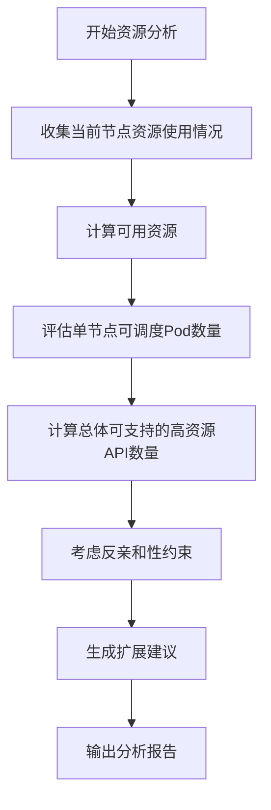
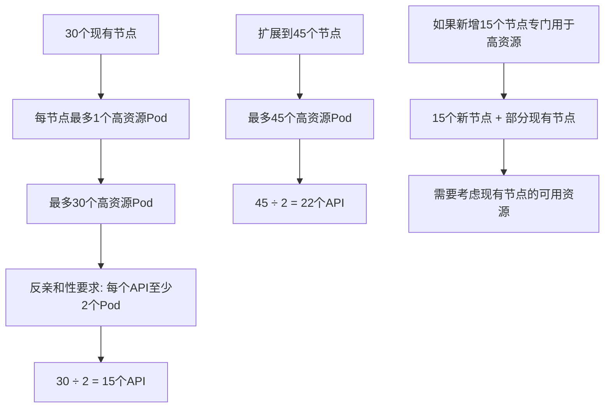

# Gemini
# 在现有 GKE n1-standard-8 节点池中支持高资源需求 API 的可行性分析与最佳实践

## 1. 引言

当前，贵公司的 Google Kubernetes Engine (GKE) 集群环境的 Node 节点规格为 n1-standard-8，具备 8 核心 CPU 及 30GB 物理内存。生产环境中的 Deployment 通常配置最少 2 个 Pod，并通过反亲和性（Affinity）策略确保这些 Pod 分布在不同的 Node 节点上。多数现有 API 的 Pod 资源配置为 1 Core CPU 及最大 4GB 内存。

面临的新需求是引入一个或多个新的 API 服务，其单个 Pod 需要约 4 Core CPU 及 16GB 内存。核心问题是在不新增专用 Node Pool 的前提下，评估现有由 30 个 n1-standard-8 节点组成的集群（每个可用区最多可扩展至 15 个节点，共 3 个可用区，集群总节点数上限为 45 个）还能支持多少个此类高资源需求的 API Pod，并探讨实现此目标所需的最佳实践方案，同时确保资源调度不受影响。

本报告旨在对当前 GKE 集群的资源承载能力进行深入分析，评估在现有 n1-standard-8 节点池中支持此类高资源需求 API 的可行性。报告将详细阐述 GKE 节点的资源预留机制与可分配资源的计算方法，指导如何分析现有节点的资源占用情况，并基于此评估在不改变当前节点池配置的前提下可支持的新 API Pod 数量。同时，本报告将提供一系列最佳实践建议，包括资源请求与限制的配置、Pod 反亲和性策略、Pod 干扰预算 (PDB) 的应用以及集群自动扩缩器的考量，以确保新 API 的稳定运行并最大化资源利用率。最后，报告还将展望长期策略，探讨引入专用 Node Pool 及节点自动预配 (NAP) 作为应对未来更复杂或更大规模高资源需求的潜在解决方案。

## 2. GKE 节点资源与可分配资源计算

在评估集群容量之前，首先需要准确理解 GKE 节点的总资源以及 Kubernetes 系统为自身运行所预留的部分，从而计算出真正可供应用 Pod 使用的“可分配资源”。

### 2.1. n1-standard-8 节点规格

根据 Google Cloud 文档，n1-standard-8 类型的虚拟机实例提供以下基础资源 1：

- **CPU**: 8 个虚拟 CPU (vCPU)
- **内存**: 30 GB

### 2.2. GKE 资源预留机制

GKE 为了保证节点的稳定运行和 Kubernetes 核心组件的正常工作，会在每个节点上预留一部分资源。这些预留资源不可用于调度用户 Pod。预留主要包括以下几个部分 3：

- **Kubelet 预留**: 用于 Kubelet 本身、容器运行时以及节点操作系统守护进程。
- **系统组件预留**: 用于操作系统内核、systemd 等系统级进程。
- **驱逐阈值 (Eviction Threshold)**: Kubelet 会监控节点资源使用情况，当可用内存低于某个阈值时，会开始驱逐 Pod 以回收资源，防止节点变得不稳定。GKE 默认会为内存驱逐预留 100 MiB 3。

GKE 对内存和 CPU 的预留量是根据节点总资源动态计算的：

**内存预留计算规则** 3:

- 对于机器内存少于 1 GiB 的情况：预留 255 MiB。
- 对于首个 4 GiB 内存：预留 25%。
- 对于接下来的 4 GiB 内存 (即总内存 4 GiB 到 8 GiB 之间)：预留 20%。
- 对于再接下来的 8 GiB 内存 (即总内存 8 GiB 到 16 GiB 之间)：预留 10%。
- 对于再接下来的 112 GiB 内存 (即总内存 16 GiB 到 128 GiB 之间)：预留 6%。
- 对于超过 128 GiB 的内存部分：预留 2%。
- 此外，GKE 会额外预留 100 MiB 内存用于处理 Pod 驱逐 3。

**CPU 预留计算规则** 3:

- 对于首个 CPU 核心：预留 6%。
- 对于下一个 CPU 核心 (即总共最多 2 个核心)：预留 1%。
- 对于再接下来的 2 个 CPU 核心 (即总共最多 4 个核心)：预留 0.5%。
- 对于超过 4 个核心的 CPU 部分：预留 0.25%。

### 2.3. n1-standard-8 节点可分配资源计算

基于上述预留规则，可以计算出 n1-standard-8 节点上实际可分配给用户 Pod 的资源。

计算预留内存:

节点总内存为 30 GB，即 30×1024 MiB=30720 MiB。

1. 首个 4 GiB (4096 MiB) 的预留: 4096 MiB×0.25=1024 MiB。
2. 接下来的 4 GiB (4096 MiB) 的预留: 4096 MiB×0.20=819.2 MiB。
3. 再接下来的 8 GiB (8192 MiB) 的预留: 8192 MiB×0.10=819.2 MiB。
4. 剩余内存为 30720 MiB−4096 MiB−4096 MiB−8192 MiB=14336 MiB。这部分内存（在 16GiB 到 128GiB 的范围内）的预留比例为 6%：14336 MiB×0.06=860.16 MiB。
5. Kubelet 和系统组件总预留内存: 1024+819.2+819.2+860.16=3522.56 MiB。
6. 加上驱逐阈值预留的 100 MiB: 3522.56 MiB+100 MiB=3622.56 MiB。

因此，n1-standard-8 节点上的 可分配内存 (Allocatable Memory) 为:

30720 MiB−3622.56 MiB=27097.44 MiB (约 26.46 GiB)。

计算预留 CPU:

节点总 CPU 为 8 核，即 8000 millicores (mCPU)。

1. 首个核心的预留: 1000m×0.06=60m。
2. 第二个核心的预留: 1000m×0.01=10m。
3. 第三和第四个核心的预留: 2×1000m×0.005=10m。
4. 剩余四个核心 (第五至第八个核心) 的预留: 4×1000m×0.0025=10m。
5. 总预留 CPU: 60m+10m+10m+10m=90m。

因此，n1-standard-8 节点上的 可分配 CPU (Allocatable CPU) 为:

8000m−90m=7910m (即 7.91 核)。

考虑 GKE 附加组件的开销:

上述计算出的可分配资源是 Kubernetes 系统层面可用于调度的资源。然而，GKE 还会运行一些必要的附加组件（add-ons），例如网络插件 (如 Calico, GKE Dataplane V2)、日志收集代理、监控代理 (Cloud Logging, Cloud Monitoring agents) 等。这些附加组件自身也会消耗一定的 CPU 和内存。一般可以估算，这些附加组件在每个节点上额外消耗大约 200m CPU 和 100 MiB 内存 5。

因此，进一步调整后，**实际可供用户工作负载使用的可分配资源** 约为：

- **最终可分配内存**: 27097.44 MiB−100 MiB=26997.44 MiB (约 26.36 GiB)
- **最终可分配 CPU**: 7910m−200m=7710m (即 7.71 核)

这些经过调整的数值将作为后续评估容量的基础。

## 3. 评估现有集群资源容量

在了解单个节点的可分配资源后，下一步是评估当前集群中实际可用的资源总量，并考虑集群的自动扩缩能力。

### 3.1. 分析当前节点资源占用

要准确评估现有30个节点的剩余容量，需要获取每个节点当前的资源使用情况。

- **实时资源消耗**: 使用 `kubectl top nodes` 命令可以快速查看各节点当前的 CPU 和内存的绝对使用量和百分比使用量。这反映了节点上所有进程（包括系统进程、Kubernetes组件和用户Pod）的即时资源消耗。
- **已请求资源与可分配资源**: 更为关键的是通过 `kubectl describe node <node-name>` 命令查看每个节点的详细信息。关注其中的 `Allocatable` 部分，它显示了该节点理论上可供Pod使用的总资源量（与上一节计算结果应一致）。同时，`Allocated resources` 部分会列出当前节点上所有Pod的资源请求（Requests）总和。通过比较 `Allocatable` 和 `Allocated resources` (Requests)，可以了解每个节点已被预订的资源量 6。
- **GKE 可观测性**: Google Cloud 控制台为 GKE 提供了强大的可观测性仪表盘。在“集群”或“工作负载”页面的“可观测性”标签下，可以选择查看节点池级别和单个节点级别的 CPU 和内存利用率（包括请求和限制的利用率）7。这些视图能提供历史趋势和更直观的资源使用概览。

### 3.2. 识别可用资源

基于上述分析，可以计算出每个节点上可用于调度新 Pod 的剩余资源。对于每个节点：

- `Node_Available_CPU_for_Scheduling = Node_Allocatable_CPU - Sum(Requests_CPU_of_existing_pods_on_Node)`
- `Node_Available_Memory_for_Scheduling = Node_Allocatable_Memory - Sum(Requests_Memory_of_existing_pods_on_Node)`

由于新的 API Pod 对内存需求较大 (16GB)，内存将是主要的制约因素。在统计可用资源时，需要特别注意**资源碎片化 (resource fragmentation)** 的问题 9。例如，一个节点可能有总共 20GB 的空闲内存，但这些内存可能分散在多个不可用的“小块”中，无法满足单个需要 16GB 连续内存请求的 Pod。因此，仅仅看节点的总空闲资源是不够的，还需要关注是否存在足够大的单一空闲块。

### 3.3. 集群自动扩缩器 (Cluster Autoscaler) 与节点限制

根据提供的信息，当前集群配置如下：

- 当前节点数量: 30 个 n1-standard-8 节点。
- 可用区数量: 3 个。
- 每个可用区的最大节点数: 15 个。
- 因此，集群的最大节点数上限为: 3 zones×15 nodes/zone=45 nodes 10。

这意味着，当前集群还有通过集群自动扩缩器 (Cluster Autoscaler) 增加新节点的潜力：

- 可额外扩展的节点数: 45 (max nodes)−30 (current nodes)=15 additional nodes。

当现有节点无法满足新 Pod 的资源请求时，集群自动扩缩器会自动在配置的限制范围内添加新的 n1-standard-8 节点。

## 4. 在不新建 Node Pool 的情况下支持高资源 API 的可行性分析

本节将结合节点的可分配资源、新 API Pod 的需求以及集群的当前状态和扩缩能力，分析在不创建新 Node Pool 的情况下，能够支持多少个此类高资源 API Pod。

### 4.1. 单个新 API Pod 的资源需求

新的 API Pod 资源需求明确为：

- CPU 请求 (Request): 4 Cores (即 4000m)
- 内存请求 (Request): 16 GB (即 16×1024 MiB=16384 MiB)

为保证服务质量和调度确定性，建议将资源限制 (Limits) 设置为与请求 (Requests) 相等。

### 4.2. 评估单个 n1-standard-8 节点能承载的新 API Pod 数量

根据第 2.3 节计算，一个 n1-standard-8 节点调整后可供用户工作负载使用的资源约为：

- 可分配 CPU: 7710m
- 可分配内存: 26997.44 MiB (约 26.36 GiB)

理论上，一个完全空闲的、未运行任何其他 Pod 的 n1-standard-8 节点，可以支持的新 API Pod 数量为：

- 基于 CPU: ⌊7710m (node allocatable)/4000m (pod request)⌋=1 Pod
- 基于内存: ⌊26997.44MiB (node allocatable)/16384MiB (pod request)⌋=1 Pod

**结论**：在资源请求得到满足的前提下，一个标准的 n1-standard-8 节点最多只能容纳 **1 个** 此类高资源需求的 API Pod。剩余的约 3.71 Core CPU 和约 10.36 GiB 内存可能会因为无法满足另一个 4 Core CPU / 16GB 内存的 Pod 而形成碎片化资源，但可以被其他较小的 Pod 使用。

### 4.3. 评估现有 30 个节点总共能承载的新 API Pod 数量

要评估当前集群状态下（不触发节点扩容）能部署多少新的高资源 API Pod，需要执行以下步骤：

1. 收集各节点当前可用资源：
    
    对集群中的每一个 n1-standard-8 节点，通过 kubectl describe node <node-name> 获取其 Allocatable CPU 和内存，并减去该节点上所有已运行 Pod 的 Requests 总和，得到每个节点实际的 Available_CPU_for_Scheduling 和 Available_Memory_for_Scheduling。
    
2. 检查各节点是否能容纳新 API Pod：
    
    对于每个节点，判断其可用资源是否同时满足新 API Pod 的需求：
    
    - `Node_Available_CPU_for_Scheduling >= 4000m`?
    - `Node_Available_Memory_for_Scheduling >= 16384MiB`?
3. 统计满足条件的“槽位”：
    
    计算出集群中满足上述条件的节点数量。这个数量即代表在不触发集群自动扩容的情况下，当前可以立即部署的新高资源 API Pod 的最大数量（假设每个 Pod 占用一个这样的“槽位”）。
    

**重要提示**：此评估提供的是一个基于当前资源快照的静态分析结果。集群的实际负载是动态变化的，现有工作负载的扩缩容、Pod 的迁移或重启都可能改变节点的可用资源状况。因此，这个数字应被视为一个初始的理论上限。持续的监控对于理解在动态环境中真正的可调度容量至关重要 11。如果其他应用突然扩展，或者某些 Pod 被重新调度，之前可用的“槽位”可能会消失。

### 4.4. 评估集群自动扩容后能承载的新 API Pod 数量

集群当前有 30 个节点，最大可扩展至 45 个节点，意味着集群自动扩缩器 (CA) 最多可以按需添加 15 个新的 n1-standard-8 节点。

- 每个新创建的 n1-standard-8 节点，在理想情况下（即没有任何其他 Pod 抢先调度上去），可以容纳 1 个新的高资源 API Pod。
- 因此，通过集群自动扩容，理论上可以额外支持 **15 个** 新的高资源 API Pod。

结合现有节点的可用槽位（来自 4.3 节的分析结果 N_current）和 CA 可新增的槽位（15 个），集群在不新建 Node Pool 的情况下，总共能承载的此类 Pod 数量上限约为 `N_current + 15`。

反亲和性策略的影响：

用户需求中提到“一个 Deployment 最少是 2 个 Pod 通过反亲和 Affinity 确保其分布在不同的 Node”。这意味着如果要部署 D 个新的高资源 API Deployment，则需要 2 \times D 个 Pod 实例。这 2 \times D 个 Pod 必须分布在至少 D 组成对的不同节点上。

- 例如，若要部署 1 个新的 API Deployment（包含 2 个 Pod），则需要找到 2 个不同的节点，每个节点都有足够的资源（4 Core CPU, 16GB Memory）来容纳其中 1 个 Pod。
- 因此，可部署的 _Deployment 数量_ 将受限于集群中能够同时满足反亲和性约束的、且具备足够资源的节点对的数量。如果总共计算出有 `X` 个可用的 Pod 槽位，那么最多可以部署 `\lfloor X/2 \rfloor` 个这样的 Deployment，前提是这些槽位分布在足够多的不同节点上以满足反亲和性。

### 4.5. 资源碎片化与调度挑战

即使集群的总可用资源（通过汇总所有节点的空闲资源得出）看似充足，**资源碎片化**也可能成为成功调度大型 Pod 的主要障碍 9。

- **定义与影响**：当节点上运行了多个不同大小的 Pod 后，剩余的空闲资源可能以不连续的小块形式存在。例如，一个节点可能有 3 Core CPU 和 10GB 内存空闲，另一个节点有 2 Core CPU 和 20GB 内存空闲。虽然两者总和超过了新 API Pod 的需求，但没有单个节点能满足 4 Core CPU 和 16GB 内存的完整请求。
- **n1-standard-8 的挑战**：对于 n1-standard-8 节点，在放置一个 4 Core/16GB 的 Pod 后，剩余资源（约 3.71 Core CPU / 10.36GB 内存）虽然可观，但已不足以再放置一个同样大小的 Pod。这些剩余资源只能被更小的 Pod 利用，如果集群中主要是大型 Pod，则这些碎片资源可能长期闲置，导致节点利用率不高，从而造成成本浪费 12。

**应对碎片化的初步措施**：

- **精确的资源请求与限制**：为所有 Pod（不仅仅是新的大型 API）都设置准确的资源请求 (requests) 和限制 (limits)。这有助于调度器更有效地进行装箱 (bin-packing)，减少不必要的资源预留和浪费 13。
- **Pod 优先级与抢占 (Pod Priority and Preemption)**：可以为新的高资源 API Pod 设置较高的优先级。当集群资源紧张时，如果高优先级 Pod 无法调度，调度器可以驱逐（抢占）节点上运行的低优先级 Pod，为高优先级 Pod 腾出空间 15。但这需要仔细规划，因为抢占可能影响被驱逐应用的服务可用性。

**关于专用节点池的考量**：如果持续面临由资源碎片化导致的调度失败，或者为了运行少数几个大型 Pod 而使得整个 n1-standard-8 节点池的平均利用率显著下降（因为 CA 扩展出的节点大部分空间被浪费），那么从运营效率和成本效益的角度看，转向使用专用的、更适合大型 Pod 的节点池将是更合理的选择。这不仅仅是一个技术容量问题，也涉及到经济和管理成本的平衡 17。

## 5. 最佳实践与建议

为在现有 n1-standard-8 节点池中尽可能高效、稳定地运行新的高资源 API，并为未来的扩展做好准备，建议遵循以下最佳实践：

### 5.1. 精确的资源请求与限制

为 Kubernetes Pod 设置准确的资源请求 (requests) 和限制 (limits) 是确保集群稳定性和资源利用率的基础。

- **请求 (Requests)**: Kubernetes 调度器根据 Pod 的资源请求来决定将其调度到哪个节点。如果一个节点的可用资源少于 Pod 的请求，Pod 就不会被调度到该节点。
- **限制 (Limits)**: 容器运行时（如 Docker）会强制执行资源限制。如果容器尝试使用的 CPU 超过其限制，它会被限流 (throttled)。如果尝试使用的内存超过其限制，它可能会被 OOMKiller 终止 14。

对于新的高资源 API Pod (4 Core CPU, 16GB Memory) 以及集群中的所有其他 Pod：

- **设置与真实需求匹配的值**: 通过压力测试、性能监控或 Vertical Pod Autoscaler (VPA) 的推荐模式 11 来确定应用在各种负载下的实际资源消耗，并据此设置请求和限制。
- **Requests = Limits for Critical Workloads**: 对于像 API 这样的关键应用，建议将内存和 CPU 的 `requests` 设置为等于其 `limits`。这会使 Pod 获得 Kubernetes 的 `Guaranteed` QoS 等级，意味着这些 Pod 在资源紧张时具有最高的保留优先级，不太可能被系统因资源不足而驱逐 14。这也有助于调度器做出更准确的放置决策，减少资源超售带来的风险。

### 5.2. Pod 反亲和性策略

用户已采用反亲和性策略确保一个 Deployment 的至少两个 Pod 分布在不同节点上，这是提高应用可用性的良好实践。

- **使用 `requiredDuringSchedulingIgnoredDuringExecution`**: 这种类型的反亲和性规则强制要求在调度新 Pod 时满足条件（即不能与特定标签的 Pod 在同一拓扑域，如同一节点）。一旦 Pod 被调度，如果后续环境变化（如节点标签改变）导致规则不再满足，Pod 仍会继续运行。这在节点故障等场景下，比 `requiredDuringSchedulingRequiredDuringExecution` 更具灵活性，后者在规则不再满足时可能会驱逐 Pod。
- **示例配置**:
    
    YAML
    
    ```
    apiVersion: apps/v1
    kind: Deployment
    metadata:
      name: new-high-resource-api-deployment
    spec:
      replicas: 2 # Or more, as per requirement
      selector:
        matchLabels:
          app: new-high-resource-api
      template:
        metadata:
          labels:
            app: new-high-resource-api
        spec:
          affinity:
            podAntiAffinity:
              requiredDuringSchedulingIgnoredDuringExecution:
              - labelSelector:
                  matchExpressions:
                  - key: app
                    operator: In
                    values:
                    - new-high-resource-api # Ensure this label matches pods of this deployment
                topologyKey: "kubernetes.io/hostname" # Ensures pods are on different nodes
          containers:
          - name: new-high-resource-api-container
            image: your-api-image:tag
            resources:
              requests:
                cpu: "4"
                memory: "16Gi"
              limits:
                cpu: "4"
                memory: "16Gi"
            #... other container configurations
    ```
    
    (基于 19 的结构)

### 5.3. Pod 干扰预算 (Pod Disruption Budgets - PDB)

对于副本数量较少（如用户场景中提到的最少2个副本）且对可用性有要求的应用，配置 PodDisruptionBudget (PDB) 至关重要。PDB 限制了在自愿性中断（如节点维护、集群升级导致节点排空、或集群缩容）期间，一个应用同时不可用的 Pod 数量 20。

- **`minAvailable`**: 指定在任何时候必须保持可用的 Pod 数量或百分比。对于至少2副本的 Deployment，将 `minAvailable` 设置为 `1` 意味着在自愿中断期间，至少有1个 Pod 会保持运行，从而避免服务完全中断。
- **示例配置**:
    
    YAML
    
    ```
    # pdb-new-api.yaml
    apiVersion: policy/v1
    kind: PodDisruptionBudget
    metadata:
      name: new-api-pdb
    spec:
      minAvailable: 1 # Or a higher number if more replicas are generally run and desired
      selector:
        matchLabels:
          app: new-high-resource-api # Must match the labels of the Pods in the Deployment
    ```
    
    (改编自 21) 应用此 PDB 后，当集群管理员执行 `kubectl drain` 命令排空节点，或者集群自动扩缩器尝试缩容节点时，如果操作会导致 `new-high-resource-api` 应用的可用 Pod 数量低于 `minAvailable` 所设定的值，该操作将被阻止或延迟，直到可以安全执行为止 22。

### 5.4. 利用现有节点池的调度策略

在不新建专用节点池的情况下，主要依赖 Kubernetes 默认调度器基于 Pod 的资源请求进行调度。然而，也可以考虑以下策略的辅助作用：

- **节点亲和性 (Node Affinity)**: 虽然目标是不新建专用池，但如果现有 n1-standard-8 节点中，由于某些特定原因（例如，某些节点可能配置了特定的本地存储，或参与了特定的维护计划），某些节点更适合或不适合运行这些大型 Pod，可以谨慎使用节点亲和性/反亲和性规则。但这会增加配置复杂性。
- **污点与容忍 (Taints and Tolerations)**: 如果希望某些 n1-standard-8 节点尽可能不被这些大型 Pod 占用（例如，保留给延迟敏感的小型应用），可以给这些节点打上特定的污点 (e.g., `prefer_no_large_pods=true:PreferNoSchedule`)。然后，新的大型 API Pod 如果不添加对应的容忍，调度器会尽量避免将它们调度到这些带污点的节点上，除非没有其他无污点的节点可用 23。然而，在单一通用节点池中过度使用污点和容忍会显著增加调度管理的复杂性，可能并非当前场景的最佳首选。

### 5.5. 集群自动扩缩器配置 (Cluster Autoscaler - CA)

集群自动扩缩器是应对负载变化、自动调整节点数量的关键组件。

- **确认启用与配置**: 确保集群的自动扩缩器已为 n1-standard-8 节点池启用，并且 `min-nodes` 和 `max-nodes`（无论是按区还是总数）设置能够覆盖预期的负载范围，允许集群按需从当前的 30 个节点扩展到最多 45 个节点 10。
- **理解扩缩行为**:
    - **扩容 (Scale-up)**: 当有 Pod 因资源不足而处于 `Pending` 状态时，CA 会评估是否可以通过向节点池中添加新节点来解决。如果可以，并且未达到最大节点限制，CA 会触发节点创建 22。
    - **缩容 (Scale-down)**: 当 CA 检测到某些节点利用率持续偏低，并且其上运行的 Pod 可以被安全地重新调度到其他节点上时，CA 会尝试排空并删除这些节点，直到达到节点池的最小数量限制。CA 会尊重 PDB，不会因缩容操作而违反 PDB 设定的最小可用副本数 22。
- **Expander 策略**: CA 使用 `expander` 策略来决定在需要扩容且有多个节点池选项时选择哪个节点池（或节点池内的哪种机器类型，如果节点池支持多种）。常见的策略包括 `random` (默认)、`least-waste`、`most-pods`、`price` 和 `priority` 26。
    - `least-waste`: 选择扩容后浪费（未使用的 CPU 和内存）最少的节点组。
    - `priority`: 允许用户为节点池配置优先级，CA 将优先扩展高优先级的节点池。 在当前场景下，由于只有一个 n1-standard-8 节点池，`expander` 策略的直接影响较小。但如果未来引入了新的节点池（例如专用的高内存节点池），则需要仔细配置 `expander` 策略（例如，通过 `priority` 结合污点和容忍，确保高资源 Pod 优先使用专用池，而通用 Pod 优先使用 n1-standard-8 池）。GKE 的节点自动预配 (NAP) 实际上就是一种更高级的 `expander`，它甚至可以动态创建新的、最适合待调度 Pod 的节点池类型 27。

### 5.6. 持续监控与日志分析

有效的监控和日志分析对于理解集群行为、诊断问题和优化资源至关重要。

- **GKE 可观测性**: 利用 Google Cloud 控制台提供的 GKE "可观测性" 标签页，监控集群级别、节点池级别和节点级别的 CPU、内存利用率（请求值和限制值），以及磁盘和网络使用情况 7。
- **Pod 调度事件**: 密切关注 Kubernetes 事件，特别是 `FailedScheduling` 事件。可以通过 `kubectl get events --field-selector reason=FailedScheduling` 命令查看。这些事件会指明 Pod 为何无法被调度，例如资源不足、不满足亲和性规则或没有节点容忍其污点等。
- **Cluster Autoscaler 日志**: CA 的日志（通常在 `kube-system` 命名空间下的 `cluster-autoscaler` Pod 中，或通过 Cloud Logging 查看）记录了其扩容和缩容的决策过程和原因，对于理解为何集群没有按预期扩容或缩容非常有价值 22。
- **应用性能监控 (APM)**: 对新的高资源 API 及其他关键应用实施 APM，监控其自身的性能指标（如延迟、错误率）和资源消耗（实际 CPU/内存使用），以验证为其配置的资源请求和限制是否准确，并及时发现潜在的性能瓶颈或资源泄漏。

通过实施这些最佳实践，可以在现有 n1-standard-8 节点池中更有效地支持新的高资源 API，同时为未来的扩展和优化打下坚实基础。

## 6. 长期策略：引入专用节点池

虽然短期内可以在现有 n1-standard-8 节点池中尝试容纳高资源需求的 API Pod，但从长远来看，随着此类应用数量的增加或对性能、隔离性要求的提高，引入专用的节点池通常是更优的解决方案。

### 6.1. 何时考虑专用节点池

以下情况表明可能需要考虑为高资源应用创建专用节点池：

- **严重的资源碎片化**: 当现有 n1-standard-8 节点池由于混合运行各种大小的 Pod，导致资源碎片化问题日益严重，使得新的高资源 Pod（需要 4 Core CPU 和 16GB 内存这样的大块连续资源）频繁因找不到合适的节点而调度失败，即使集群整体利用率并不高。
- **低效的集群扩容与成本浪费**: 如果为了运行少数几个高资源 Pod，集群自动扩缩器不得不频繁地添加新的 n1-standard-8 节点，但这些新节点在放置了一个高资源 Pod 后，剩余的大部分资源（约 3.71 Core CPU 和 10.36GB 内存）无法被其他大型 Pod 有效利用，也可能不被小型 Pod 完全填满，导致节点整体利用率偏低，从而造成不必要的云资源成本浪费 12。
- **隔离性与特定硬件需求**: 当高资源应用对性能有极致要求，需要避免来自其他 Pod 的“邻居干扰”，或者需要特定的硬件配置（如更快的 CPU、更大的内存带宽、本地 SSD 28、GPU 等）时，专用节点池可以提供必要的隔离和硬件支持 30。
- **运营管理复杂性增加**: 如果为了在单一通用节点池中同时满足通用 Pod 和高资源 Pod 的调度需求，不得不配置和维护日益复杂的节点亲和性/反亲和性规则、污点和容忍策略，导致运营开销和出错风险显著增加。

**设立明确的触发条件**对于决策何时从当前策略转向专用节点池至关重要。与其被动等待问题恶化，不如主动定义一些量化指标。例如：

- **调度失败率**: 如果新的高资源 API Pod 在一周内的调度失败次数（因资源不足或碎片化导致）超过预设阈值（例如 X 次或占总调度尝试的 Y%）。
- **节点池利用率**: 在部署了 Z 个高资源 API Pod 后，如果 n1-standard-8 节点池的平均 CPU/内存利用率（在排除这些高资源 Pod 本身的消耗后）由于碎片化而持续低于某个百分比（例如 Y%），表明资源浪费严重。
- **运营成本**: 如果每月用于手动干预调度策略、解决资源冲突以适应高资源 Pod 的工时超过 H 小时，或者因资源利用率低下而产生的额外云费用超过了运行一个小型专用节点池的成本。 这些触发条件的设定，有助于将决策从主观判断转变为基于数据的客观评估，确保在最合适的时机进行架构调整。

### 6.2. 专用节点池的优势

为特定类型的工作负载（如高资源消耗型应用）创建专用节点池，能带来多方面的好处：

- **资源隔离与优化 (Resource Isolation and Optimization)**:
    - **减少干扰**: 将高资源应用与其他应用隔离开，避免资源争抢，确保其性能的稳定性和可预测性。
    - **定制化硬件**: 可以为专用节点池选择最适合该类应用的机器类型。例如，对于内存密集型应用，可以选择 Google Cloud 提供的 `e2-highmem-X`、`n2-highmem-X` 或 `m1/m2/m3` 系列虚拟机，这些系列通常提供更高的内存与 vCPU 配比 31。这可以确保 Pod 获得充足的内存，同时可能允许在更少的 vCPU 上运行，从而优化成本。
    - **减少碎片化**: 由于专用节点池主要运行同类（大型）Pod，资源分配更为规整，能显著减少资源碎片化问题。
- **简化调度管理 (Simplified Scheduling)**:
    - 通过在专用节点池的节点上设置特定的**节点标签 (node labels)** (例如 `workload-type=high-resource-api`)，并在高资源 API Pod 的部署配置中指定相应的**节点亲和性 (nodeAffinity)** 规则，可以确保这些 Pod 被精确地调度到专用节点池中 30。
    - 同时，可以在专用节点池的节点上设置**污点 (taints)** (例如 `workload-type=high-resource-api:NoSchedule`)，并在高资源 API Pod 中添加对应的**容忍 (tolerations)**。这样可以阻止其他没有相应容忍的 Pod 被调度到这些专用节点上，保证专用资源的独占性 23。
- **潜在的成本效益 (Potential Cost-Effectiveness)**:
    - 虽然专用节点（特别是高内存或带特殊硬件的节点）的单位价格可能高于通用型节点，但通过为不同工作负载“量体裁衣”，可以提高整个集群的资源利用率。通用型 Pod 继续运行在成本较低的 n1-standard-8 节点池，而高资源 Pod 运行在按需配置的专用池。这种“混合搭配”往往比试图用一种节点类型满足所有需求（导致部分节点利用率低下）更为经济 12。
    - 可以更精细地控制每个节点池的自动扩缩容策略，避免不必要的扩容。
- **提升可预测性和性能 (Improved Predictability and Performance)**:
    - 专用资源意味着应用在运行时不太可能遇到因其他应用突发高负载而导致的资源短缺。
    - 对于需要特定硬件（如本地SSD、GPU）的应用，专用节点池是确保这些资源可用的唯一途径。

### 6.3. 实现步骤

若决定引入专用节点池，可按以下步骤操作：

1. 选择合适的机器类型 (Choose Appropriate Machine Type):
    
    针对当前新 API Pod (4 Core CPU, 16GB Memory) 的需求，并考虑到未来可能的增长和在单个节点上运行多个此类 Pod 的可能性，可以考虑以下 GCP 机器系列：
    
    - **E2 系列 (成本优化型)**: `e2-highmem-4` (4 vCPU, 32GB RAM) 或 `e2-highmem-8` (8 vCPU, 64GB RAM) 31。E2 系列性价比高，适合对成本敏感但仍需较高内存的场景。
    - **N2/N2D 系列 (通用型，性能更佳)**: `n2-highmem-4` (4 vCPU, 32GB RAM) 或 `n2-highmem-8` (8 vCPU, 64GB RAM) 32。N2 系列通常比 N1 提供更好的性能，N2D (AMD EPYC) 可能在特定工作负载下提供更好的性价比 34。 选择时需权衡成本、性能需求以及单个节点期望承载的 Pod 数量。例如，`e2-highmem-8` 或 `n2-highmem-8` 可以舒适地容纳 2-3 个 4C/16G 的 Pod (考虑到节点预留后，仍有足够资源)。
2. 创建新的节点池 (Create New Node Pool):
    
    使用 gcloud 命令或通过 Google Cloud Console 创建新的节点池。在创建时，指定所选的机器类型，并打上标签和污点。
    
    Bash
    
    ```
    gcloud container node-pools create high-mem-api-pool \
      --cluster <your-cluster-name> \
      --machine-type n2-highmem-8  # Or your chosen machine type \
      --num-nodes 1                # Initial number of nodes, can be autoscaled \
      --node-labels=workload-type=high-mem-api \
      --node-taints=workload-type=high-mem-api:NoSchedule \
      --zone <your-zone> # Or --region for regional clusters
    ```
    
    (36 提供了更新节点池标签和污点的命令，创建时类似)
    
3. 配置 Pod 调度 (Configure Pod Scheduling):
    
    修改高资源 API 的 Deployment YAML 文件，添加 tolerations 以容忍新节点池的污点，并添加 nodeAffinity 以确保 Pod 被调度到带有特定标签的节点上。
    
    YAML
    
    ```
    apiVersion: apps/v1
    kind: Deployment
    #... metadata...
    spec:
      #... replicas, selector...
      template:
        #... metadata...
        spec:
          tolerations:
          - key: "workload-type"
            operator: "Equal"
            value: "high-mem-api"
            effect: "NoSchedule"
          affinity:
            nodeAffinity:
              requiredDuringSchedulingIgnoredDuringExecution:
                nodeSelectorTerms:
                - matchExpressions:
                  - key: workload-type
                    operator: In
                    values:
                    - high-mem-api
          containers:
          #... your container spec...
    ```
    
    (19 讨论了相关概念和示例)
    
4. 启用集群自动扩缩 (Enable Cluster Autoscaling for the new pool):
    
    为新创建的 high-mem-api-pool 节点池配置自动扩缩参数（最小节点数、最大节点数）。这样，当高资源 API 的负载增加，需要更多 Pod 时，CA 可以自动向该专用池中添加更多节点 10。
    
    Bash
    
    ```
    gcloud container node-pools update high-mem-api-pool \
      --cluster <your-cluster-name> \
      --enable-autoscaling --min-nodes 1 --max-nodes 5 \ # Adjust min/max as needed
      --zone <your-zone> # Or --region
    ```
    
5. 迁移与监控 (Migrate and Monitor):
    
    逐步将高资源 API 工作负载迁移到新的专用节点池。密切监控新节点池的资源利用率、Pod 的调度情况以及应用的性能表现。根据实际情况调整节点池的机器类型、大小或自动扩缩配置。
    

### 6.4. 节点自动预配 (Node Auto-Provisioning - NAP)

如果集群中未来可能出现更多种类的、具有特殊资源需求（例如不同类型的 GPU、不同内存/CPU配比、特定区域需求等）的工作负载，可以考虑启用 GKE 的**节点自动预配 (NAP)** 功能 27。

- **工作原理**: NAP 是集群自动扩缩器的一项增强功能。当有 Pod 因资源不足或不满足特定调度约束（如亲和性、污点容忍、GPU需求）而无法调度时，NAP 不仅仅是在现有节点池中扩容，而是能够**自动创建和配置一个全新的、最适合该 Pod 需求的节点池** 27。NAP 会分析待调度 Pod 的 CPU、内存、GPU 请求、节点选择器、亲和性规则、污点和容忍等信息，然后选择或创建一个具有匹配机器类型、区域、标签、污点的节点池 27。
- **优势**:
    - **简化运维**: 无需手动创建和管理多种专用节点池，NAP 会按需动态处理。
    - **优化资源利用**: NAP 旨在创建“刚刚好”的节点池，避免了手动配置节点池时可能出现的过度预配或配置不当。
    - **灵活性**: 能够更好地适应异构工作负载的需求。
- **配置**: 启用 NAP 时，可以设置整个集群的资源限制（总 CPU、总内存、特定类型 GPU 的最大数量等），以控制 NAP 创建节点池的范围 41。

对于当前场景，如果高资源 API 是集群中唯一的特殊需求类型，那么手动创建一个专用节点池可能更为直接和可控。但如果预期未来会有更多样化的需求，NAP 则是一个值得评估的强大工具，它可以显著降低管理多个专用节点池的复杂性。

## 7. 结论与建议

综合以上分析，针对在现有 GKE n1-standard-8 节点池中支持单 Pod 需 4 Core CPU、16GB 内存的新 API 的需求，得出以下结论与建议：

### 7.1. 短期可行性总结

- **理论上可行，但容量有限**: 在不新建 Node Pool 的情况下，现有的 n1-standard-8 节点（调整后可分配约 7.71 Core CPU 和 26.36 GiB 内存）**每个节点最多只能容纳 1 个**此类新的高资源 API Pod。
- **依赖当前实际可用资源**: 集群当前 30 个节点总共能支持的新 API Pod 数量，直接取决于每个节点在扣除现有已调度 Pod 的资源请求后，剩余的可用 CPU 和内存是否同时满足新 Pod 的需求 (>= 4 Core, >= 16GB)。这需要通过 `kubectl describe node` 和 `kubectl top nodes` 对每个节点进行详细的资源审计来确定。资源碎片化可能进一步限制实际可调度数量。
- **集群自动扩缩的贡献**: 集群自动扩缩器 (CA) 最多可按需额外添加 15 个 n1-standard-8 节点（使集群总数达到 45 个节点上限）。理想情况下，这 15 个新节点每个也能支持 1 个高资源 Pod，从而额外提供 15 个槽位。
- **反亲和性是关键约束**: 由于每个 Deployment 至少部署 2 个 Pod 并要求分布在不同节点，实际可部署的 _Deployment 数量_ 将是可用 Pod 槽位数量的一半（或更少，取决于槽位是否均匀分布在不同节点上）。

### 7.2. 立即行动建议

1. **执行详细资源审计**:
    
    - 使用 `kubectl top nodes` 了解各节点当前负载。
    - 对每个节点执行 `kubectl describe node <node-name>`，记录其 `Allocatable` CPU 和内存，以及 `Allocated resources` (Requests) 的总和。
    - 计算每个节点当前可用于调度新 Pod 的剩余 CPU 和内存。
    - 统计有多少个节点同时满足 `Available_CPU >= 4000m` 且 `Available_Memory >= 16384MiB`。这将是当前不扩容情况下可部署的 Pod 数量。
2. **强制精确的资源请求与限制**:
    
    - 为新的高资源 API Pod 在其 Deployment YAML 中明确设置 `spec.containers.resources.requests.cpu = "4"`, `spec.containers.resources.requests.memory = "16Gi"`, `spec.containers.resources.limits.cpu = "4"`, `spec.containers.resources.limits.memory = "16Gi"`。
    - 审查集群中其他现有工作负载的资源请求和限制，确保其准确性，以减少资源浪费和碎片化。
3. **配置 PodDisruptionBudget (PDB)**:
    
    - 为新的高资源 API Deployment 创建一个 PDB，例如设置 `minAvailable: 1`，以确保在节点维护等自愿中断期间，应用至少有一个实例在运行，保障基本可用性。
4. **审慎部署并持续监控**:
    
    - 基于资源审计结果，逐步部署新的高资源 API Deployment。
    - 密切监控以下指标：
        - 新 API Pod 的调度状态 (`kubectl get pods -l <label-selector-for-new-api> -w`)。
        - Kubernetes 事件日志，特别是 `FailedScheduling` 事件 (`kubectl get events --field-selector reason=FailedScheduling`)。
        - 各节点及整个集群的 CPU 和内存利用率（通过 GKE Observability Dashboard 或 `kubectl top nodes`）。
        - 集群自动扩缩器的活动日志，观察其是否按预期进行扩容或缩容。

### 7.3. 长期战略建议

1. **建立迁移到专用节点池的触发器**:
    
    - 定义清晰的、可量化的业务和技术指标（如持续的调度失败率、因碎片化导致的节点平均利用率过低、过高的手动干预工时等）。当这些指标达到预设阈值时，应启动向专用节点池迁移的规划。
2. **规划并适时引入专用节点池**:
    
    - 如果短期方案难以满足需求，或运营成本/资源浪费问题凸显，应积极考虑为高资源 API 创建一个或多个专用节点池。
    - 选择合适的机器类型，例如 Google Cloud 的 `e2-highmem` 或 `n2-highmem` 系列，它们提供更高的内存/CPU 配比，更适合此类内存密集型应用。
    - 在新节点池上使用节点标签和污点，并配合 Pod 的节点亲和性与容忍策略，实现精确的调度隔离。
3. **评估节点自动预配 (NAP)**:
    
    - 如果集群未来需要支持更多种类的、具有不同特殊资源需求的工作负载（例如不同规格的 CPU/内存组合、GPU、TPU 等），应评估启用 GKE 节点自动预配 (NAP) 功能。NAP 可以根据 Pod 的具体需求动态创建和管理最合适的节点池，从而简化运维并优化资源利用。

### 7.4. 最终考量

虽然在技术上，通过精细管理和利用集群自动扩缩，或许可以在现有的 n1-standard-8 节点池中容纳一定数量的新的高资源 API Pod，但这通常是一种权宜之计。随着高资源需求应用数量的增加或对性能、稳定性要求的提升，资源碎片化、调度冲突和成本效益问题会逐渐显现。

从长远来看，为具有显著不同资源画像（如通用型 vs 高内存型）的工作负载采用**专用的、经过优化的节点池**，是保障应用性能、提高集群整体资源利用率、简化管理并最终控制成本的最佳实践 12。因此，建议将当前在单一节点池中支持高资源 API 的方案视为过渡，并积极规划向更具针对性的多节点池架构演进。
# Claude
基于你的需求，我来为你提供一个完整的资源分析方案。这是一个典型的GKE资源容量规划问题。

## 当前环境分析

### 节点规格

- **Node类型**: n1-standard-8
- **CPU**: 8 cores
- **内存**: 30GB
- **当前节点数**: 30个
- **最大扩展**: 45个节点 (3 zones × 15 nodes)

### 新API资源需求

- **CPU**: 4 cores/pod
- **内存**: 16GB/pod
- **最小副本数**: 2个pod (反亲和性)

## 资源分析流程



## 1. 当前资源使用情况分析

### 获取节点资源使用情况

```bash
# 获取所有节点的资源使用情况
kubectl top nodes --sort-by=cpu

# 获取详细的节点资源分配情况
kubectl describe nodes | grep -A 5 "Allocated resources"

# 获取节点可分配资源
kubectl get nodes -o json | jq '.items[] | {name: .metadata.name, allocatable: .status.allocatable}'
```

### 分析脚本

```bash
#!/bin/bash
# analyze_node_resources.sh

echo "=== GKE Node Resource Analysis ==="
echo "Node Type: n1-standard-8 (8 CPU, 30GB Memory)"
echo "Current Nodes: 30"
echo "Target API: 4 CPU, 16GB Memory per pod"
echo ""

# 获取节点资源使用情况
kubectl get nodes -o json > nodes.json

# 分析可用资源
cat > analyze_resources.py << 'EOF'
import json
import sys

# 读取节点信息
with open('nodes.json', 'r') as f:
    nodes_data = json.load(f)

# n1-standard-8规格
TOTAL_CPU = 8
TOTAL_MEMORY_GB = 30

# 新API需求
REQUIRED_CPU = 4
REQUIRED_MEMORY_GB = 16

print("Node Resource Analysis:")
print("=" * 50)

total_available_cpu = 0
total_available_memory = 0
schedulable_nodes = 0

for node in nodes_data['items']:
    node_name = node['metadata']['name']
    
    # 获取可分配资源 (考虑系统预留)
    allocatable_cpu = float(node['status']['allocatable']['cpu'].replace('m', '')) / 1000 if 'm' in node['status']['allocatable']['cpu'] else float(node['status']['allocatable']['cpu'])
    allocatable_memory_bytes = int(node['status']['allocatable']['memory'].replace('Ki', '')) * 1024
    allocatable_memory_gb = allocatable_memory_bytes / (1024**3)
    
    print(f"Node: {node_name}")
    print(f"  Allocatable CPU: {allocatable_cpu:.2f} cores")
    print(f"  Allocatable Memory: {allocatable_memory_gb:.2f} GB")
    
    # 检查是否可以调度新的高资源Pod
    if allocatable_cpu >= REQUIRED_CPU and allocatable_memory_gb >= REQUIRED_MEMORY_GB:
        schedulable_nodes += 1
        print(f"  ✓ Can schedule high-resource pod")
    else:
        print(f"  ✗ Cannot schedule high-resource pod")
    
    total_available_cpu += allocatable_cpu
    total_available_memory += allocatable_memory_gb
    print()

print("Summary:")
print(f"Total Available CPU: {total_available_cpu:.2f} cores")
print(f"Total Available Memory: {total_available_memory:.2f} GB")
print(f"Nodes that can schedule high-resource pods: {schedulable_nodes}")
print(f"Max high-resource APIs (considering anti-affinity): {schedulable_nodes // 2}")

EOF

python3 analyze_resources.py
```

## 2. 容量规划分析

### 理论计算模型

```bash
#!/bin/bash
# capacity_planning.sh

# 节点规格 (考虑系统预留)
NODE_CPU_ALLOCATABLE=7.5  # 通常系统预留0.5核
NODE_MEMORY_ALLOCATABLE=28  # 通常系统预留2GB

# 当前环境
CURRENT_NODES=30
MAX_NODES=45

# 新API需求
API_CPU_PER_POD=4
API_MEMORY_PER_POD=16
MIN_REPLICAS=2

echo "=== Capacity Planning Analysis ==="
echo ""

# 计算单节点可支持的Pod数量
CPU_PODS_PER_NODE=$((NODE_CPU_ALLOCATABLE / API_CPU_PER_POD))
MEMORY_PODS_PER_NODE=$((NODE_MEMORY_ALLOCATABLE / API_MEMORY_PER_POD))
PODS_PER_NODE=$((CPU_PODS_PER_NODE < MEMORY_PODS_PER_NODE ? CPU_PODS_PER_NODE : MEMORY_PODS_PER_NODE))

echo "Single Node Analysis:"
echo "CPU constraint: $CPU_PODS_PER_NODE pods/node"
echo "Memory constraint: $MEMORY_PODS_PER_NODE pods/node"
echo "Limiting factor: $PODS_PER_NODE pods/node"
echo ""

# 计算最大可支持的API数量
MAX_APIS_CURRENT=$((CURRENT_NODES * PODS_PER_NODE / MIN_REPLICAS))
MAX_APIS_FULL=$((MAX_NODES * PODS_PER_NODE / MIN_REPLICAS))

echo "API Capacity Analysis:"
echo "Current nodes ($CURRENT_NODES): $MAX_APIS_CURRENT APIs"
echo "Max nodes ($MAX_NODES): $MAX_APIS_FULL APIs"
echo "Additional capacity: $((MAX_APIS_FULL - MAX_APIS_CURRENT)) APIs"
```

## 3. 实际资源查询命令

### 详细资源使用分析

```bash
# 1. 获取所有节点的详细资源信息
kubectl get nodes -o custom-columns=\
NAME:.metadata.name,\
CPU-ALLOCATABLE:.status.allocatable.cpu,\
MEMORY-ALLOCATABLE:.status.allocatable.memory,\
CPU-CAPACITY:.status.capacity.cpu,\
MEMORY-CAPACITY:.status.capacity.memory

# 2. 获取当前资源使用情况
kubectl top nodes --sort-by=memory

# 3. 获取每个节点的Pod分布
for node in $(kubectl get nodes -o jsonpath='{.items[*].metadata.name}'); do
    echo "=== Node: $node ==="
    kubectl describe node $node | grep -A 10 "Non-terminated Pods"
    echo ""
done

# 4. 分析高资源需求的可调度性
kubectl get nodes -o json | jq -r '
.items[] | 
select(.status.allocatable.cpu | tonumber >= 4) | 
select((.status.allocatable.memory | sub("Ki";"") | tonumber) >= 16777216) |
.metadata.name'
```

## 4. 推荐的最佳实践方案

### 方案对比

|方案|优点|缺点|适用场景|
|---|---|---|---|
|新增Node Pool|资源隔离，调度确定性|成本增加，管理复杂|长期高资源需求|
|现有节点混合部署|成本效率高，资源利用率高|调度复杂，可能资源碎片化|临时或少量高资源需求|
|节点标签+调度策略|灵活性高，成本可控|配置复杂|混合工作负载|

### 推荐配置

```yaml
# 高资源API的Deployment配置
apiVersion: apps/v1
kind: Deployment
metadata:
  name: high-resource-api
spec:
  replicas: 2
  selector:
    matchLabels:
      app: high-resource-api
  template:
    metadata:
      labels:
        app: high-resource-api
    spec:
      affinity:
        podAntiAffinity:
          requiredDuringSchedulingIgnoredDuringExecution:
          - labelSelector:
              matchExpressions:
              - key: app
                operator: In
                values:
                - high-resource-api
            topologyKey: kubernetes.io/hostname
      containers:
      - name: api
        image: your-api:latest
        resources:
          requests:
            cpu: "4"
            memory: "16Gi"
          limits:
            cpu: "4"
            memory: "16Gi"
      nodeSelector:
        node-pool: high-resource  # 如果使用专用节点池
```

## 5. 监控和告警设置

```bash
# 设置资源使用监控
kubectl apply -f - <<EOF
apiVersion: v1
kind: ConfigMap
metadata:
  name: resource-monitor
data:
  monitor.sh: |
    #!/bin/bash
    while true; do
      echo "$(date): Resource Usage Check"
      kubectl top nodes | grep -v NAME | while read line; do
        node=$(echo $line | awk '{print $1}')
        cpu_usage=$(echo $line | awk '{print $2}' | sed 's/%//')
        mem_usage=$(echo $line | awk '{print $4}' | sed 's/%//')
        
        if [ $cpu_usage -gt 80 ] || [ $mem_usage -gt 80 ]; then
          echo "WARNING: High resource usage on $node - CPU: $cpu_usage%, Memory: $mem_usage%"
        fi
      done
      sleep 300
    done
EOF
```

## 总结建议

基于你的n1-standard-8节点规格和新API需求：

1. **理论容量**: 每个节点最多可调度1个高资源Pod（16GB内存是限制因素）
2. **反亲和性约束**: 30个节点最多支持15个高资源API
3. **扩展到45节点**: 最多可支持22个高资源API
4. **建议**: 对于长期需求，考虑创建专用的高内存节点池（如n1-highmem-4）

这样的分析可以帮助你做出最优的资源规划决策。
你的理解是正确的！让我重新明确这个计算：

## 资源约束分析

### 单节点容量计算

```bash
# n1-standard-8 节点规格（考虑系统预留）
NODE_CPU_ALLOCATABLE=7.5    # 8核 - 0.5核系统预留
NODE_MEMORY_ALLOCATABLE=28  # 30GB - 2GB系统预留

# 高资源API需求
API_CPU_PER_POD=4
API_MEMORY_PER_POD=16

# 单节点可调度Pod数量
CPU_CONSTRAINT: 7.5 ÷ 4 = 1.875 → 1个Pod
MEMORY_CONSTRAINT: 28 ÷ 16 = 1.75 → 1个Pod
```

**结论：每个节点最多只能调度1个高资源Pod**

## 反亲和性约束下的API数量



## 精确计算分析

|场景|可用节点|可调度Pod数|支持API数|
|---|---|---|---|
|当前30节点（假设都可用）|30|30|15|
|扩展到45节点（全部可用）|45|45|22|
|新增15节点专用|15|15|7-8|

你的理解完全正确：

```bash
# 如果15个新节点专门用于高资源API
NEW_DEDICATED_NODES=15
PODS_FROM_NEW_NODES=15  # 每节点1个Pod
APIS_FROM_NEW_NODES=15/2=7.5 → 7个完整API

# 还需要1个Pod来完成第8个API，需要在现有节点中找到1个可用节点
# 所以最终结果是7-8个API
```

## 更精确的容量规划脚本

```bash
#!/bin/bash
# precise_capacity_calculation.sh

echo "=== 精确容量规划分析 ==="
echo ""

# 节点和API配置
CURRENT_NODES=30
MAX_NODES=45
NEW_NODES=15
PODS_PER_NODE=1  # 每个n1-standard-8节点最多1个高资源Pod
MIN_REPLICAS=2

echo "节点配置:"
echo "- 当前节点: $CURRENT_NODES"
echo "- 最大节点: $MAX_NODES"
echo "- 计划新增: $NEW_NODES"
echo "- 每节点最大Pod数: $PODS_PER_NODE"
echo ""

# 场景分析
echo "容量分析:"
echo ""

# 场景1: 当前节点全部可用
current_max_apis=$((CURRENT_NODES * PODS_PER_NODE / MIN_REPLICAS))
echo "场景1 - 当前30节点全部可用:"
echo "  最大Pod数: $((CURRENT_NODES * PODS_PER_NODE))"
echo "  最大API数: $current_max_apis"
echo ""

# 场景2: 扩展到最大节点
max_apis=$((MAX_NODES * PODS_PER_NODE / MIN_REPLICAS))
echo "场景2 - 扩展到45节点:"
echo "  最大Pod数: $((MAX_NODES * PODS_PER_NODE))"
echo "  最大API数: $max_apis"
echo ""

# 场景3: 新增15节点专用
new_dedicated_pods=$((NEW_NODES * PODS_PER_NODE))
new_dedicated_complete_apis=$((new_dedicated_pods / MIN_REPLICAS))
remaining_pods=$((new_dedicated_pods % MIN_REPLICAS))

echo "场景3 - 新增15节点专用于高资源API:"
echo "  新节点可提供Pod数: $new_dedicated_pods"
echo "  完整API数: $new_dedicated_complete_apis"
echo "  剩余Pod数: $remaining_pods"

if [ $remaining_pods -gt 0 ]; then
    echo "  需要现有节点补充: $((MIN_REPLICAS - remaining_pods)) 个Pod"
    echo "  总计可支持API数: $((new_dedicated_complete_apis + 1))"
else
    echo "  总计可支持API数: $new_dedicated_complete_apis"
fi
```

## 最佳实践建议

基于这个分析，我建议：

### 方案1: 专用Node Pool（推荐）

```bash
# 创建高内存节点池
gcloud container node-pools create high-memory-pool \
    --cluster=your-cluster-name \
    --zone=your-zone \
    --machine-type=n1-highmem-4 \  # 4 CPU, 26GB内存，更适合
    --num-nodes=4 \                 # 每个zone 4个节点
    --node-taints=workload=high-memory:NoSchedule
```

### 方案2: 混合部署监控脚本

```bash
#!/bin/bash
# monitor_mixed_deployment.sh

echo "检查当前可用于高资源Pod的节点数量..."

available_nodes=0
for node in $(kubectl get nodes -o name); do
    node_name=$(basename $node)
    
    # 检查节点可分配资源
    allocatable=$(kubectl get node $node_name -o jsonpath='{.status.allocatable}')
    
    # 检查当前使用情况
    used_resources=$(kubectl describe node $node_name | grep -A 20 "Allocated resources")
    
    # 简化检查：如果节点还能调度16G内存和4核CPU
    echo "检查节点: $node_name"
    # 这里需要更复杂的逻辑来精确计算剩余资源
    
    ((available_nodes++))
done

echo "当前可调度高资源Pod的节点数: $available_nodes"
echo "可支持的高资源API数: $((available_nodes / 2))"
```

**总结**：你的计算是对的 - 15个新节点专门用于高资源API，确实只能支持7-8个API，因为每个API需要2个Pod，而每个节点只能调度1个Pod。