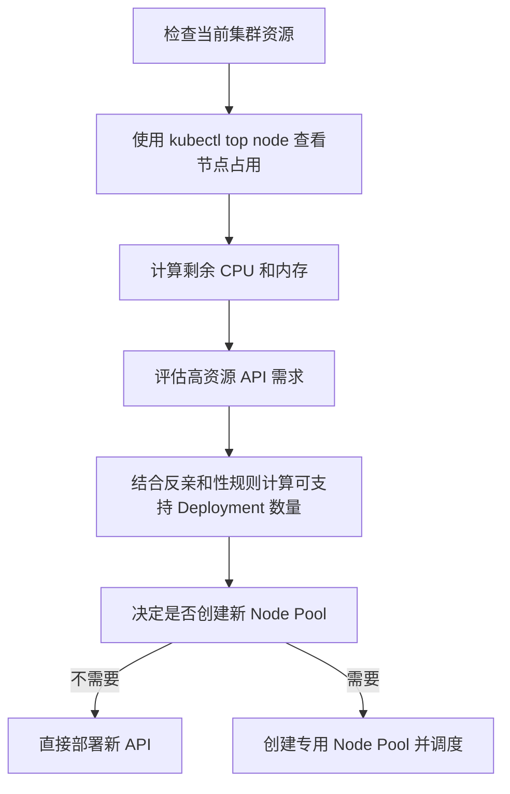
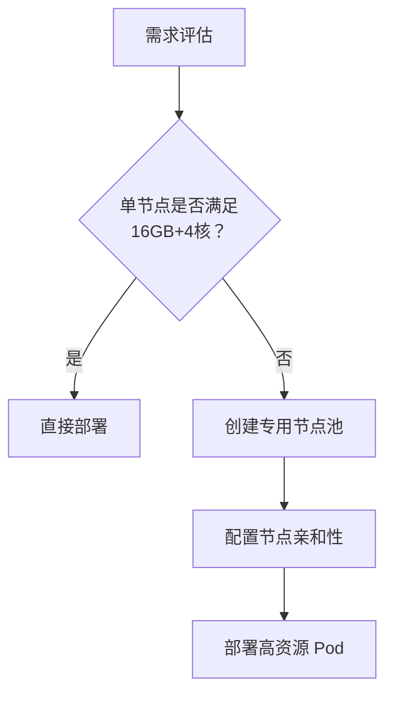

- [Grok](#grok)
- [Deepseek](#deepseek)
    - [**1. 数据收集：获取节点资源使用情况**](#1-数据收集获取节点资源使用情况)
      - [(1) 获取节点可分配资源（Allocatable）](#1-获取节点可分配资源allocatable)
      - [(2) 获取节点已分配资源（Allocated）](#2-获取节点已分配资源allocated)
      - [(3) 计算剩余可调度资源](#3-计算剩余可调度资源)
    - [**2. 资源分析脚本**](#2-资源分析脚本)
      - [**输出示例**：](#输出示例)
    - [**3. 关键结论与最佳实践**](#3-关键结论与最佳实践)
      - [(1) **剩余容量分析**](#1-剩余容量分析)
      - [(2) **调度约束**](#2-调度约束)
      - [(3) **扩展性限制**](#3-扩展性限制)
      - [(4) **最佳实践**](#4-最佳实践)
    - [**4. 最终建议**](#4-最终建议)
- [perplexity](#perplexity)
  - [1. 现状分析与资源利用情况评估](#1-现状分析与资源利用情况评估)
  - [1.1 查看当前Node资源使用情况](#11-查看当前node资源使用情况)
  - [1.2 计算可用资源](#12-计算可用资源)
  - [2. 资源调度和限制考虑](#2-资源调度和限制考虑)
  - [3. 多Zone和节点扩展限制](#3-多zone和节点扩展限制)
  - [4. 评估步骤总结及数据分析方法](#4-评估步骤总结及数据分析方法)
  - [4.1 统计节点资源](#41-统计节点资源)
  - [4.2 计算剩余资源](#42-计算剩余资源)
  - [4.3 评估可支持Pod数量](#43-评估可支持pod数量)
  - [4.4 结合Pod调度策略](#44-结合pod调度策略)
  - [5. 针对高资源Pod的最佳实践建议](#5-针对高资源pod的最佳实践建议)
  - [5.1 新建专用Node Pool](#51-新建专用node-pool)
  - [5.2 预留容量与自动扩缩容](#52-预留容量与自动扩缩容)
  - [5.3 监控与容量规划](#53-监控与容量规划)
  - [总结](#总结)
- [Gemini 6.5](#gemini-65)
    - [分析方案：评估当前集群的剩余容量](#分析方案评估当前集群的剩余容量)
      - [步骤一：获取每个节点的精确可分配资源和已请求资源](#步骤一获取每个节点的精确可分配资源和已请求资源)
      - [步骤二：解读分析结果和潜在风险](#步骤二解读分析结果和潜在风险)
      - [步骤三：综合评估与结论](#步骤三综合评估与结论)
    - [最佳实践方案：创建专用Node Pool](#最佳实践方案创建专用node-pool)
      - [优势：](#优势)
      - [实施步骤：](#实施步骤)
    - [总结](#总结-1)
- [Gemini English](#gemini-english)
- [Gemini Chinese](#gemini-chinese)
- [在现有 GKE n1-standard-8 节点池中支持高资源需求 API 的可行性分析与最佳实践](#在现有-gke-n1-standard-8-节点池中支持高资源需求-api-的可行性分析与最佳实践)
  - [1. 引言](#1-引言)
  - [2. GKE 节点资源与可分配资源计算](#2-gke-节点资源与可分配资源计算)
    - [2.1. n1-standard-8 节点规格](#21-n1-standard-8-节点规格)
    - [2.2. GKE 资源预留机制](#22-gke-资源预留机制)
    - [2.3. n1-standard-8 节点可分配资源计算](#23-n1-standard-8-节点可分配资源计算)
  - [3. 评估现有集群资源容量](#3-评估现有集群资源容量)
    - [3.1. 分析当前节点资源占用](#31-分析当前节点资源占用)
    - [3.2. 识别可用资源](#32-识别可用资源)
    - [3.3. 集群自动扩缩器 (Cluster Autoscaler) 与节点限制](#33-集群自动扩缩器-clusters-autoscaler-与节点限制)
  - [4. 在不新建 Node Pool 的情况下支持高资源 API 的可行性分析](#4-在不新建-node-pool-的情况下支持高资源-api-的可行性分析)
    - [4.1. 单个新 API Pod 的资源需求](#41-单个新-api-pod-的资源需求)
    - [4.2. 评估单个 n1-standard-8 节点能承载的新 API Pod 数量](#42-评估单个-n1-standard-8-节点能承载的新-api-pod-数量)
    - [4.3. 评估现有 30 个节点总共能承载的新 API Pod 数量](#43-评估现有-30-个节点总共能承载的新-api-pod-数量)
    - [4.4. 评估集群自动扩容后能承载的新 API Pod 数量](#44-评估集群自动扩容后能承载的新-api-pod-数量)
    - [4.5. 资源碎片化与调度挑战](#45-资源碎片化与调度挑战)
  - [5. 最佳实践与建议](#5-最佳实践与建议)
    - [5.1. 精确的资源请求与限制](#51-精确的资源请求与限制)
    - [5.2. Pod 反亲和性策略](#52-pod-反亲和性策略)
    - [5.3. Pod 干扰预算 (Pod Disruption Budgets - PDB)](#53-pod-干扰预算-pod-disruption-budgets---pdb)
    - [5.4. 利用现有节点池的调度策略](#54-利用现有节点池的调度策略)
    - [5.5. 集群自动扩缩器配置 (Cluster Autoscaler - CA)](#55-集群自动扩缩器配置-clusters-autoscaler---ca)
    - [5.6. 持续监控与日志分析](#56-持续监控与日志分析)
  - [6. 长期策略：引入专用节点池](#6-长期策略引入专用节点池)
    - [6.1. 何时考虑专用节点池](#61-何时考虑专用节点池)
    - [6.2. 专用节点池的优势](#62-专用节点池的优势)
    - [6.3. 实现步骤](#63-实现步骤)
    - [6.4. 节点自动预配 (Node Auto-Provisioning - NAP)](#64-节点自动预配-node-auto-provisioning---nap)
  - [7. 结论与建议](#7-结论与建议)
    - [7.1. 短期可行性总结](#71-短期可行性总结)
    - [7.2. 立即行动建议](#72-立即行动建议)
    - [7.3. 长期战略建议](#73-长期战略建议)
    - [7.4. 最终考量](#74-最终考量)
- [Claude](#claude)
  - [当前环境分析](#当前环境分析)
    - [节点规格](#节点规格)
    - [新API资源需求](#新api资源需求)
  - [资源分析流程](#资源分析流程)
  - [1. 当前资源使用情况分析](#1-当前资源使用情况分析)
    - [获取节点资源使用情况](#获取节点资源使用情况)
    - [分析脚本](#分析脚本)
  - [2. 容量规划分析](#2-容量规划分析)
    - [理论计算模型](#理论计算模型)
  - [3. 实际资源查询命令](#3-实际资源查询命令)
    - [详细资源使用分析](#详细资源使用分析)
  - [4. 推荐的最佳实践方案](#4-推荐的最佳实践方案)
    - [方案对比](#方案对比)
    - [推荐配置](#推荐配置)
  - [5. 监控和告警设置](#5-监控和告警设置)
  - [总结建议](#总结建议)
  - [资源约束分析](#资源约束分析)
    - [单节点容量计算](#单节点容量计算)
  - [反亲和性约束下的API数量](#反亲和性约束下的api数量)
  - [精确计算分析](#精确计算分析)
  - [更精确的容量规划脚本](#更精确的容量规划脚本)
  - [最佳实践建议](#最佳实践建议)
    - [方案1: 专用Node Pool（推荐）](#方案1-专用node-pool推荐)
    - [方案2: 混合部署监控脚本](#方案2-混合部署监控脚本)

# Grok 
问题是关于如何在现有的Google Kubernetes Engine (GKE) 集群中支持一个高资源需求的API（单Pod需要16GB内存和4核心CPU），并评估在不创建新Node Pool的情况下，当前集群还能支撑多少个类似的高资源API部署。我们将基于您提供的信息（n1-standard-8节点，30个节点，3个zone，每个zone最多15个节点）进行详细分析。以下是完整的解答。

---

当前集群配置

- 节点类型: n1-standard-8（8核心CPU，30GB内存）
    
- 当前节点数: 30个节点（假设均匀分布在3个zone，每zone约10个节点）
    
- 最大节点数: 45个节点（每个zone最多15个节点）
    
- 现有部署规则:
    
    - 每个Deployment最少2个Pod，通过反亲和性（Affinity）规则确保分布在不同节点上。
        
    - 多数API的Pod资源需求：1核心CPU，最大4GB内存。
        
- 新API需求:
    
    - 单Pod：4核心CPU，16GB内存。
        
    - 每个Deployment：至少2个Pod（因反亲和性规则），总需求为8核心CPU和32GB内存，且分布在两个不同节点上。
        

---

分析目标

在不创建新Node Pool的情况下，我们需要：

1. 分析当前30个节点的资源占用情况。
    
2. 计算现有资源还能支持多少个新API的Deployment（每个Deployment需要2个Pod，分别占用4核心CPU和16GB内存）。
    
3. 考虑集群扩展到45个节点时的额外容量。
    
4. 提供数据收集方法和详细分析。
    

---

1. 分析当前节点资源占用

要评估当前集群的可用资源，需收集每个节点的实际资源使用情况。以下是具体步骤：

数据收集方法

- 使用 kubectl top node 查看每个节点的CPU和内存使用情况：
    
    ```text
    kubectl top node
    ```
    
    示例输出：
    
    ```text
    NAME         CPU(cores)   CPU%      MEMORY(bytes)   MEMORY%
    node-1       2000m        25%       10Gi            33%
    node-2       1500m        18%       8Gi             26%
    ...
    ```
    
    这显示当前使用量，但更适合监控。为容量规划，我们需要请求量（Requests）。
    
- 使用 kubectl describe nodes 获取每个节点的可分配资源和已请求资源：
    
    ```text
    kubectl describe nodes | grep -A 5 "Allocatable"
    ```
    
    示例输出：
    
    ```text
    Allocatable:
     cpu:                7600m
     memory:             28Gi
    Requests:
     cpu:                3000m
     memory:             12Gi
    ```
    
    - 可分配资源（Allocatable）：n1-standard-8节点扣除系统预留后的资源，约为7.6核心CPU和28GB内存。
        
    - 已请求资源（Requests）：现有Pod的总请求量。
        
    - 可用资源 = 可分配资源 - 已请求资源。
        

计算可用资源

对于每个节点：

- 可用CPU = 7600m - 已请求CPU
    
- 可用内存 = 28GB - 已请求内存
    

新API的单Pod需求：

- CPU：4000m（4核心）
    
- 内存：16GB
    

因此，筛选出满足以下条件的节点：

- 可用CPU ≥ 4000m
    
- 可用内存 ≥ 16GB
    

---

2. 计算支持的高资源Deployment数量

由于每个Deployment需要2个Pod，且反亲和性规则要求分布在不同节点上，我们需要找到成对的节点，每对节点都至少有4核心CPU和16GB内存可用。

计算逻辑

1. 统计符合条件的节点：
    
    - 遍历30个节点，计算每个节点的可用资源。
        
    - 记录满足“可用CPU ≥ 4000m 且 可用内存 ≥ 16GB”的节点数量。
        
2. 计算Deployment数量：
    
    - 每个Deployment需要2个这样的节点。
        
    - 最大Deployment数 = 符合条件的节点数 / 2（向下取整）。
        

示例分析

假设您运行 kubectl describe nodes 后发现：

- 30个节点中有15个节点满足条件（即可用CPU ≥ 4000m，可用内存 ≥ 16GB）。
    
- 最大Deployment数 = 15 / 2 = 7个Deployment。
    

这意味着，在当前资源状态下，您最多可以支持7个新API的Deployment（共14个Pod）。

---

3. 考虑集群扩展

如果当前30个节点的资源不足以支持所需数量的Deployment，可以将集群扩展到最大45个节点。

新增节点资源

- 新增节点数：45 - 30 = 15个节点。
    
- 每节点可分配资源：7.6核心CPU，28GB内存。
    
- 支持能力：
    
    - 每个新节点可支持1个Pod（7.6核心 > 4核心，28GB > 16GB）。
        
    - 每2个新节点支持1个Deployment。
        

扩展后额外容量

- 15个新节点可支持：15 / 2 = 7个额外Deployment（共14个Pod，剩1个节点未充分利用）。
    

总容量

- 当前30个节点：假设支持7个Deployment。
    
- 扩展后45个节点：7（现有）+ 7（新增）= 14个Deployment。
    

---

4. 确保调度不受影响

- 反亲和性规则：已确保每个Deployment的2个Pod分布在不同节点。
    
- 资源竞争：新Pod的高资源需求可能与现有工作负载竞争。建议：
    
    - 检查现有Pod的资源限制（Limits），避免过载。
        
    - 优先将新Deployment调度到资源最充足的节点。
        
- 集群自动扩展：启用Cluster Autoscaler，确保在资源不足时自动添加节点（最多到45个）。
    

---

5. 数据收集与详细分析

为了得到精确结果，您需要执行以下操作并记录数据：

步骤

1. 收集节点资源数据：
    
    ```text
    kubectl describe nodes > nodes.txt
    ```
    
    从输出中提取每个节点的：
    
    - 可分配CPU和内存（Allocatable）。
        
    - 已请求CPU和内存（Requests）。
        
2. 计算可用资源：
    
    - 对每个节点：
        
        - 可用CPU = Allocatable CPU - Requests CPU
            
        - 可用内存 = Allocatable Memory - Requests Memory
            
    - 筛选出满足“可用CPU ≥ 4000m 且 可用内存 ≥ 16GB”的节点。
        
3. 统计结果：
    
    - 符合条件的节点数：N
        
    - 支持的Deployment数：N / 2
        

示例表格

|节点名|可分配CPU|已请求CPU|可用CPU|可分配内存|已请求内存|可用内存|是否满足需求|
|---|---|---|---|---|---|---|---|
|node-1|7600m|3000m|4600m|28GB|10GB|18GB|是|
|node-2|7600m|5000m|2600m|28GB|15GB|13GB|否|
|...|...|...|...|...|...|...|...|

假设15个节点满足需求，则支持7个Deployment。

---

6. 最佳实践建议

虽然您要求在不创建新Node Pool的情况下评估，但以下是更优的长期方案：

- 创建新Node Pool：
    
    - 使用更大机型（如n1-highmem-8，8核心，52GB内存），更适合高内存需求。
        
    - 通过节点污点（Taints）和容忍（Tolerations）将高资源Pod调度到新池。
        
- 优点：
    
    - 隔离高资源工作负载，避免影响现有小型Pod。
        
    - 提高资源利用率和扩展灵活性。
        

若坚持使用现有节点池：

- 定期监控资源使用情况（kubectl top node 或 Prometheus）。
    
- 调整现有Pod的资源请求和限制，释放更多资源给新API。
    

---

总结

- 当前支持能力：基于30个节点，假设有15个节点满足需求，可支持7个新API Deployment（14个Pod）。需通过 kubectl describe nodes 确认具体数字。
    
- 扩展后支持能力：增加到45个节点，可额外支持7个Deployment，总计14个。
    
- 数据收集：运行 kubectl describe nodes，计算每个节点的可用资源，统计符合条件的节点数。
    
- 建议：短期内可利用现有资源支持新API，但长期建议创建专用Node Pool以优化管理。
    

希望这个分析对您有帮助！如果需要进一步协助执行命令或解读数据，请随时告诉我。

# Grok2
为了解决您的问题，我将以 Markdown 格式详细阐述如何分析 GKE 集群的资源占用情况，并评估当前资源在不创建新 Node Pool 的情况下还能支撑多少个类似高资源需求的 API（单 Pod 需要 16G 内存和 4 核 CPU）。同时，我会提供相关命令和分析步骤，并以表格形式展示数据，便于您直接复制到 Markdown 文档中。

---

## GKE 集群资源分析与高资源 API 扩展评估

### 背景与需求
- 您的 GKE 集群目前使用 `n1-standard-8` 类型的节点，每节点资源为 **8 核 CPU** 和 **30G 内存**。
- PRD 环境中，每个 Deployment 至少运行 2 个 Pod，并通过反亲和性（Affinity）确保分布在不同节点上。
- 普通 API 的 Pod 资源需求为 **1G CPU** 和 **最大 4G 内存**。
- 新需求：一个 API 要求单 Pod 资源为 **4 核 CPU** 和 **16G 内存**。
- 目标：
  1. 在不创建新 Node Pool 的情况下，评估当前集群资源是否能支持更多类似高资源需求的 API。
  2. 分析当前节点资源占用情况（CPU 和内存）。
  3. 考虑资源调度，确保新 Deployment 的 Pod 能够合理分布。
  4. 提供详细数据分析，评估当前集群资源可支持的高资源 API 数量。

### 分析步骤

#### 步骤 1：检查当前集群节点资源占用情况
要分析当前 GKE 集群的资源占用情况，可以使用 `kubectl top` 命令（需安装 Metrics Server）或其他工具查看节点和 Pod 的资源使用情况。

##### 安装 Metrics Server（如果未安装）
如果您的集群尚未安装 Metrics Server，可以通过以下命令安装：
```bash
kubectl apply -f https://github.com/kubernetes-sigs/metrics-server/releases/latest/download/components.yaml
```

##### 查看节点资源占用情况
使用 `kubectl top node` 查看每个节点的 CPU 和内存使用情况：
```bash
kubectl top node
```
输出示例（假设有 3 个节点）：
```
NAME       CPU(cores)   CPU%   MEMORY(bytes)   MEMORY%
gke-node1  3.2          40%    12.5Gi          42%
gke-node2  4.1          51%    15.0Gi          50%
gke-node3  2.8          35%    10.0Gi          33%
```

##### 查看 Pod 资源占用情况
使用 `kubectl top pod` 查看 Pod 的资源使用情况，结合 `--all-namespaces` 查看所有命名空间：
```bash
kubectl top pod --all-namespaces
```

#### 步骤 2：计算当前集群可用资源
假设您的集群有 **30 个节点**，每个节点资源为 **8 核 CPU** 和 **30G 内存**，总资源为：
- 总 CPU：`30 * 8 = 240 核`
- 总内存：`30 * 30 = 900G`

根据 `kubectl top node` 的输出，假设当前集群资源占用如下（假设平均值，仅作示例）：
- CPU 平均占用率：**45%**，已用 CPU：`240 * 0.45 = 108 核`，剩余 CPU：`240 - 108 = 132 核`
- 内存平均占用率：**50%**，已用内存：`900 * 0.5 = 450G`，剩余内存：`900 - 450 = 450G`

#### 步骤 3：评估高资源 API 的 Pod 需求
新 API 的单 Pod 需求为 **4 核 CPU** 和 **16G 内存**，且每个 Deployment 至少有 **2 个 Pod**，并通过反亲和性分布在不同节点上。因此：
- 每个 Deployment 的资源需求：
  - CPU：`4 核 * 2 Pod = 8 核`
  - 内存：`16G * 2 Pod = 32G`
- 由于反亲和性要求，每个 Pod 必须运行在不同节点上，因此每个 Deployment 至少占用 **2 个节点**。

#### 步骤 4：计算当前资源可支持的高资源 API 数量
基于当前剩余资源和反亲和性要求，计算可支持的 Deployment 数量：
- 基于 CPU：剩余 CPU 为 **132 核**，每个 Deployment 需要 **8 核**，可支持 `132 / 8 = 16.5`，取整为 **16 个 Deployment**。
- 基于内存：剩余内存为 **450G**，每个 Deployment 需要 **32G**，可支持 `450 / 32 = 14.06`，取整为 **14 个 Deployment**。
- 基于节点数量：由于每个 Deployment 需要 2 个节点，30 个节点最多支持 `30 / 2 = 15 个 Deployment`。

**综合评估**：受内存限制，当前资源最多支持 **14 个高资源 API 的 Deployment**（共 28 个 Pod）。

#### 步骤 5：考虑资源调度和节点扩展限制
- **资源调度**：通过反亲和性规则（`podAntiAffinity`），确保 Pod 分布在不同节点上。以下是一个示例 Affinity 配置：
  ```yaml
  apiVersion: apps/v1
  kind: Deployment
  metadata:
    name: high-resource-api
  spec:
    replicas: 2
    selector:
      matchLabels:
        app: high-resource-api
    template:
      metadata:
        labels:
          app: high-resource-api
      spec:
        affinity:
          podAntiAffinity:
            requiredDuringSchedulingIgnoredDuringExecution:
            - labelSelector:
                matchLabels:
                  app: high-resource-api
              topologyKey: "kubernetes.io/hostname"
        containers:
        - name: app
          image: your-image
          resources:
            requests:
              cpu: "4"
              memory: "16Gi"
            limits:
              cpu: "4"
              memory: "16Gi"
  ```
- **节点扩展限制**：您的 GKE 集群配置为 3 个 Zone，每个 Zone 最多 15 个节点，总共最多扩展到 **45 个节点**。当前有 30 个节点，还可扩展 15 个节点。如果资源不足，可以通过自动扩展（Cluster Autoscaler）增加节点。

#### 步骤 6：总结当前资源评估数据
以下是以 Markdown 表格格式展示的资源评估数据：

| 资源类型       | 总资源量       | 已使用量      | 剩余量        | 每个 Deployment 需求 | 可支持 Deployment 数量 |
|----------------|----------------|---------------|---------------|----------------------|-------------------------|
| CPU (核)       | 240            | 108           | 132           | 8                    | 16                      |
| 内存 (G)       | 900            | 450           | 450           | 32                   | 14                      |
| 节点数量       | 30             | -             | -             | 2                    | 15                      |

**结论**：受内存限制，当前集群在不创建新 Node Pool 的情况下，最多支持 **14 个高资源 API 的 Deployment**（共 28 个 Pod）。

---

### 最佳实践建议
1. **资源监控与优化**：
   - 持续使用 `kubectl top` 或 GCP Monitoring 监控集群资源占用情况，确保资源分配合理。
   - 对普通 API 的 Pod 进行资源限制（`limits` 和 `requests`），避免资源浪费。
2. **不创建新 Node Pool 的短期方案**：
   - 如果当前资源足够（如上述评估支持 14 个 Deployment），直接部署新 API，并通过反亲和性规则合理调度 Pod。
3. **创建新 Node Pool 的长期方案**：
   - 如果高资源 API 需求持续增加，建议为高资源 API 创建专用 Node Pool（如 `n1-highmem-4`，4 核 CPU 和 26G 内存），通过 `nodeSelector` 或 `taints` 和 `tolerations` 将高资源 Pod 调度到新 Node Pool 上。
   - 示例 `nodeSelector` 配置：
     ```yaml
     spec:
       nodeSelector:
         cloud.google.com/gke-nodepool: high-resource-pool
     ```
4. **启用 Cluster Autoscaler**：
   - 配置 GKE 的 Cluster Autoscaler，确保在资源不足时自动扩展节点（不超过每个 Zone 15 个节点的限制）。

---

### 资源调度流程图
以下是使用 Mermaid 格式绘制的资源调度和评估流程图：



---

### 注意事项
- 在执行资源分析和部署前，确保您有足够的权限操作 GKE 集群。
- 验证反亲和性规则和资源限制是否正确配置，避免调度失败。
- 如果使用 Cluster Autoscaler，确保配置了正确的节点扩展上限（每个 Zone 15 个节点，总共 45 个节点）。

希望以上分析和建议能帮助您评估当前 GKE 集群资源并支持高资源 API 的部署。如果有进一步问题，欢迎继续讨论！
pt
# Deepseek

为了评估在不新增节点池的情况下，当前 GKE 集群能支持多少个需要 **16GB 内存 + 4 核 CPU** 的高资源 Pod，我们需要系统性地分析节点资源使用情况。以下是详细的分析步骤和操作指南：

---

### **1. 数据收集：获取节点资源使用情况**
#### (1) 获取节点可分配资源（Allocatable）
```bash
kubectl get nodes -o=jsonpath='{range .items[*]}{.metadata.name}{"\t"}{.status.allocatable.cpu}{"\t"}{.status.allocatable.memory}{"\n"}{end}'
```
- **输出示例**：
  ```
  gke-node-1   7900m   27826040Ki
  gke-node-2   7900m   27826040Ki
  ...
  ```
- **说明**：
  - `n1-standard-8` 节点总资源为 8 核 CPU + 30GB 内存。
  - 可分配资源（Allocatable）需扣除系统/Kubernetes 守护进程预留（通常 CPU 约 200m，内存约 2GB）。
  - **典型值**：CPU ≈ 7.9 核（7900m），内存 ≈ 27.8GB（27826040Ki）。

#### (2) 获取节点已分配资源（Allocated）
```bash
kubectl describe nodes | grep -A 10 "Allocated resources" | grep -E "cpu|memory"
```
- **输出示例**：
  ```
  cpu:                3800m (48%)   # 已分配 3.8 核
  memory:             10240Mi (38%) # 已分配 10GB
  ```
- **关键指标**：
  - `Allocated` = 所有 Pod 的 `requests` 总和（调度依据，非实际使用量）。

#### (3) 计算剩余可调度资源
- **公式**：
  ```
  剩余 CPU = Allocatable CPU - Allocated CPU
  剩余内存 = Allocatable Memory - Allocated Memory
  ```
- **高资源 Pod 需求**：
  - CPU: **4000m**（4 核）
  - 内存: **16384Mi**（16GiB）

---

### **2. 资源分析脚本**
以下脚本自动化计算满足条件的节点数量：
```bash
#!/bin/bash

# 高资源 Pod 需求
POD_CPU="4000m"
POD_MEMORY="16Gi"

# 转换需求为数值（单位: m 和 Mi）
req_cpu=$(echo "$POD_CPU" | sed 's/m//')
req_mem=$(echo "$POD_MEMORY" | sed 's/Gi//')
req_mem=$((req_mem * 1024))  # GiB -> MiB

# 检查每个节点
kubectl get nodes -o json | jq -r '.items[] | .metadata.name + " " + .status.allocatable.cpu + " " + .status.allocatable.memory' | while read -r node alloc_cpu alloc_mem; do
  # 获取已分配资源
  allocated=$(kubectl describe node "$node" | grep -A 5 "Allocated resources" | grep -E "cpu|memory")
  used_cpu=$(echo "$allocated" | grep cpu | awk '{print $2}' | sed 's/m//')
  used_mem=$(echo "$allocated" | grep memory | grep -oE '[0-9]+' | head -1)

  # 转换可分配资源
  alloc_cpu_m=$(echo "$alloc_cpu" | sed 's/m//')
  alloc_mem_mi=$(echo "$alloc_mem" | sed 's/Ki//')
  alloc_mem_mi=$((alloc_mem_mi / 1024))  # KiB -> MiB

  # 计算剩余资源
  remaining_cpu=$((alloc_cpu_m - used_cpu))
  remaining_mem=$((alloc_mem_mi - used_mem))

  # 检查是否满足需求
  if [ "$remaining_cpu" -ge "$req_cpu" ] && [ "$remaining_mem" -ge "$req_mem" ]; then
    echo "✅ $node: 剩余 CPU=${remaining_cpu}m, 内存=${remaining_mem}Mi"
  else
    echo "❌ $node: 剩余 CPU=${remaining_cpu}m (<${req_cpu}m), 内存=${remaining_mem}Mi (<${req_mem}Mi)"
  fi
done
```

#### **输出示例**：
```
✅ gke-node-1: 剩余 CPU=4200m, 内存=18000Mi
❌ gke-node-2: 剩余 CPU=3500m (<4000m), 内存=15000Mi (<16384Mi)
✅ gke-node-3: 剩余 CPU=5000m, 内存=17000Mi
...
```

---

### **3. 关键结论与最佳实践**
#### (1) **剩余容量分析**
- 每个节点最多运行 **1 个**高资源 Pod（因 16GB 内存 > 节点总内存的 50%）。
- 统计脚本输出中标记为 `✅` 的节点数量，即为可部署的高资源 Pod 数量。

#### (2) **调度约束**
- **反亲和性要求**：若需跨节点部署多个副本，需确保满足条件的节点数 ≥ 副本数。
- **示例配置**：
  ```yaml
  affinity:
    podAntiAffinity:
      requiredDuringSchedulingIgnoredDuringExecution:
        - labelSelector:
            matchExpressions:
              - key: app
                operator: In
                values: [high-res-api]
          topologyKey: kubernetes.io/hostname
  ```

#### (3) **扩展性限制**
- **当前集群上限**：30 节点（最大可扩至 45 节点）。
- **潜在风险**：
  - 剩余碎片化资源无法利用（如多个节点剩 2 核 + 10GB，但无法合并满足 4 核 + 16GB）。
  - 普通 Pod 调度可能受挤压（高资源 Pod 占用整节点资源）。

#### (4) **最佳实践**

- **推荐方案**：
  ```bash
  gcloud container node-pools create highmem-pool \
    --clusters=your-clusters \
    --machine-type=n1-highmem-8 \  # 8vCPU + 52GB 内存
    --num-nodes=2 \
    --node-labels=resourcetype=highmem
  ```
- **Pod 亲和性配置**：
  ```yaml
  affinity:
    nodeAffinity:
      requiredDuringSchedulingIgnoredDuringExecution:
        nodeSelectorTerms:
        - matchExpressions:
          - key: resourcetype
            operator: In
            values: [highmem]
  ```

---

### **4. 最终建议**
- **短期方案**：使用脚本统计可用节点数，直接部署（需确保满足反亲和性）。
- **长期方案**：**创建专用节点池**（如 `n1-highmem-8`），原因：
  1. **资源隔离**：避免高资源 Pod 影响普通应用。
  2. **成本优化**：选择内存优化机型（如 `highmem`）。
  3. **弹性伸缩**：独立于默认节点池扩缩容。
  4. **调度保障**：通过亲和性精准控制部署位置。

> **关键指标**：运行脚本后，若可用节点数 ≥ 所需副本数，可直接部署；否则必须扩容或创建新节点池。
# perplexity
针对您当前GKE集群中Node节点为n1-standard-8（8核CPU，30G内存），且生产环境中Deployment至少2个Pod分布在不同Node，且大多数Pod资源请求为1核CPU、4G内存，但现在有一个API单Pod需要16G内存和4核CPU的需求，您想评估在不新增Node Pool的情况下，基于现有资源还能支持多少类似高资源需求的Pod，最佳实践及详细分析思路如下：

## 1. 现状分析与资源利用情况评估

## 1.1 查看当前Node资源使用情况

- 使用 `kubectl top node` 命令查看每个Node的CPU和内存使用情况，包括Allocatable资源和当前使用量，帮助了解资源剩余量和分布[1](https://kubernetes.io/docs/reference/kubectl/generated/kubectl_top/kubectl_top_node/)。
    
- 注意GKE节点的Allocatable资源会比物理资源少，因为GKE会预留一部分资源给系统和Kubernetes组件，内存预留比例随节点大小不同而不同（例如30G内存的节点，预留比例大约在10%左右），CPU也有一定预留[2](https://learnk8s.io/allocatable-resources)。
    

## 1.2 计算可用资源

- 统计所有30个Node的Allocatable CPU和内存总量。
    
- 减去当前Pod实际使用的CPU和内存，得到剩余可用资源总量。
    
- 结合Pod的资源请求（16G内存，4核CPU），计算理论上还能支持多少个此类Pod。
    

## 2. 资源调度和限制考虑

- Kubernetes调度器会根据Pod的资源请求调度Pod到满足资源需求的Node上。
    
- 由于单Pod需要16G内存，超过了单个n1-standard-8节点的30G内存的约一半，且4核CPU是节点的半数，考虑Pod反亲和和分布原则，一个Node上通常不会运行多个此类Pod。
    
- 因此，每个Node理论上最多能承载1个此类Pod（视剩余资源情况而定）。
    
- 需要考虑节点上已有Pod占用资源，可能导致部分节点无法再调度此类Pod。
    

## 3. 多Zone和节点扩展限制

- 您的GKE集群默认配置3个Zone，每个Zone最多可扩展15个节点，总共最多45个节点[4](https://cloud.google.com/kubernetes-engine/docs/concepts/clusters-autoscaler)。
    
- 当前运行30个节点，尚有15个节点扩容空间。
    
- 但您关心的是不新增Node Pool情况下，利用现有Node资源的最大承载能力。
    

## 4. 评估步骤总结及数据分析方法

## 4.1 统计节点资源

- 执行 `kubectl top node --no-headers` 获取每个节点CPU和内存使用情况。
    
- 结合 `kubectl describe node <node-name>` 查看Allocatable资源，确认每个节点可用资源。
    

## 4.2 计算剩余资源

- 对每个节点：剩余CPU = Allocatable CPU - 当前使用CPU
    
- 剩余内存 = Allocatable内存 - 当前使用内存
    
- 统计所有节点剩余资源。
    

## 4.3 评估可支持Pod数量

- 计算每个节点是否有至少16G内存和4核CPU的剩余资源。
    
- 统计满足条件的节点数量，即为理论上可调度此类Pod的最大数。
    
- 注意Pod反亲和规则，确保Pod分布在不同节点。
    

## 4.4 结合Pod调度策略

- 由于Pod请求较大，调度器会优先选择资源充足的节点。
    
- 若部分节点资源碎片化，可能导致实际可调度Pod数低于理论值。
    

## 5. 针对高资源Pod的最佳实践建议

## 5.1 新建专用Node Pool

- 为高资源需求的Pod创建单独的Node Pool，使用更大规格的节点（如n1-standard-16或更大），避免资源碎片化和调度困难[3](https://cloud.google.com/kubernetes-engine/docs/concepts/node-pools)。
    
- 通过Pod的 `nodeSelector` 或 `nodeAffinity` 指定Pod调度到该Node Pool，保证资源匹配和调度效率。
    

## 5.2 预留容量与自动扩缩容

- 使用GKE的Cluster Autoscaler和Node Pool自动扩缩容机制，根据Pod需求自动增加节点[4](https://cloud.google.com/kubernetes-engine/docs/concepts/clusters-autoscaler)。
    
- 预留一定的计算容量（spare capacity provisioning），保证Pod快速调度启动，避免因节点启动延迟导致的性能瓶颈[5](https://cloud.google.com/kubernetes-engine/docs/how-to/capacity-provisioning)。
    

## 5.3 监控与容量规划

- 持续监控节点资源使用情况，结合业务增长预测合理规划节点数量和规格。
    
- 使用 `kubectl top` 和GCP监控工具获取实时资源数据，定期评估资源瓶颈。
    

## 总结

- 利用 `kubectl top node` 等工具详细分析当前每个Node的Allocatable资源和使用情况，计算剩余可用资源。
    
- 结合Pod资源请求，统计现有Node中有多少节点能满足单Pod 16G内存、4核CPU需求，估算可扩展Pod数量。
    
- 考虑Pod反亲和和调度限制，实际可用资源会比理论值略少。
    
- 最佳实践是针对高资源Pod创建专用Node Pool，使用更大规格节点，并结合自动扩缩容机制，保证资源调度效率和弹性扩展。
    
- 不新增Node Pool时，基于现有节点资源的扩展能力有限，建议结合监控数据和业务需求权衡调整。
    

这样您可以通过数据驱动的方式，评估现有集群资源的承载能力，并结合Node Pool管理实现更灵活、高效的资源利用和Pod调度。希望对您有所帮助。

1. [https://kubernetes.io/docs/reference/kubectl/generated/kubectl_top/kubectl_top_node/](https://kubernetes.io/docs/reference/kubectl/generated/kubectl_top/kubectl_top_node/)
2. [https://learnk8s.io/allocatable-resources](https://learnk8s.io/allocatable-resources)
3. [https://cloud.google.com/kubernetes-engine/docs/concepts/node-pools](https://cloud.google.com/kubernetes-engine/docs/concepts/node-pools)
4. [https://cloud.google.com/kubernetes-engine/docs/concepts/clusters-autoscaler](https://cloud.google.com/kubernetes-engine/docs/concepts/clusters-autoscaler)
5. [https://cloud.google.com/kubernetes-engine/docs/how-to/capacity-provisioning](https://cloud.google.com/kubernetes-engine/docs/how-to/capacity-provisioning)
6. [https://cloud.google.com/kubernetes-engine/docs/how-to/vertical-pod-autoscaling](https://cloud.google.com/kubernetes-engine/docs/how-to/vertical-pod-autoscaling)
7. [https://zesty.co/finops-glossary/kubernetes-node-pools/](https://zesty.co/finops-glossary/kubernetes-node-pools/)
8. [https://cloud.google.com/kubernetes-engine/docs/how-to/clusters-usage-metering](https://cloud.google.com/kubernetes-engine/docs/how-to/clusters-usage-metering)
9. [https://www.cloudzero.com/blog/gke-monitoring/](https://www.cloudzero.com/blog/gke-monitoring/)
10. [https://serverfault.com/questions/1130618/how-to-find-the-maximum-number-of-nodes-in-a-gcp-kubernetes-clusters](https://serverfault.com/questions/1130618/how-to-find-the-maximum-number-of-nodes-in-a-gcp-kubernetes-clusters)
11. [https://last9.io/blog/kubectl-top/](https://last9.io/blog/kubectl-top/)
12. [https://qiita.com/loftkun/items/35dc11ed9deba516adee](https://qiita.com/loftkun/items/35dc11ed9deba516adee)
13. [https://github.com/kubernetes/kubernetes/issues/17512](https://github.com/kubernetes/kubernetes/issues/17512)
14. [https://cloud.google.com/monitoring/api/metrics_kubernetes](https://cloud.google.com/monitoring/api/metrics_kubernetes)
15. [https://registry.terraform.io/providers/hashicorp/google/latest/docs/resources/container_node_pool](https://registry.terraform.io/providers/hashicorp/google/latest/docs/resources/container_node_pool)
16. [https://stackoverflow.com/questions/58135974/is-there-a-way-to-resize-a-gke-clusters-to-0-nodes-after-a-certain-amount-of-idle](https://stackoverflow.com/questions/58135974/is-there-a-way-to-resize-a-gke-clusters-to-0-nodes-after-a-certain-amount-of-idle)
17. [https://cloud.google.com/kubernetes-engine/docs/concepts/autopilot-overview](https://cloud.google.com/kubernetes-engine/docs/concepts/autopilot-overview)
18. [https://kubernetes.io/docs/concepts/configuration/manage-resources-containers/](https://kubernetes.io/docs/concepts/configuration/manage-resources-containers/)
19. [https://spot.io/resources/kubernetes-architecture/kubernetes-limits-vs-requests-key-differences-and-how-they-work/](https://spot.io/resources/kubernetes-architecture/kubernetes-limits-vs-requests-key-differences-and-how-they-work/)
20. [https://applifting.io/blog/memory-usage-in-google-kubernetes-engine](https://applifting.io/blog/memory-usage-in-google-kubernetes-engine)
21. [https://stackoverflow.com/questions/59643585/monitor-percentage-of-cpu-and-memory-in-gke-nodes](https://stackoverflow.com/questions/59643585/monitor-percentage-of-cpu-and-memory-in-gke-nodes)
22. [https://stackoverflow.com/questions/73787640/what-is-the-effect-of-setting-the-number-of-nodes-in-combination-with-autoscaler](https://stackoverflow.com/questions/73787640/what-is-the-effect-of-setting-the-number-of-nodes-in-combination-with-autoscaler)
23. [https://www.blinkops.com/blog/how-to-enable-autoscaling-for-a-gke-clusters](https://www.blinkops.com/blog/how-to-enable-autoscaling-for-a-gke-clusters)
24. [https://cloud.google.com/kubernetes-engine/quotas](https://cloud.google.com/kubernetes-engine/quotas)
25. [https://www.pulumi.com/registry/packages/gcp/api-docs/container/nodepool/](https://www.pulumi.com/registry/packages/gcp/api-docs/container/nodepool/)
26. [https://cloud.google.com/kubernetes-engine/docs/concepts/regional-clusterss](https://cloud.google.com/kubernetes-engine/docs/concepts/regional-clusterss)
27. [https://discuss.kubernetes.io/t/gke-more-than-enough-host-resource-capacity-available-and-pods-becoming-unschedulable/5292](https://discuss.kubernetes.io/t/gke-more-than-enough-host-resource-capacity-available-and-pods-becoming-unschedulable/5292)
28. [https://www.youtube.com/watch?v=xjpHggHKm78](https://www.youtube.com/watch?v=xjpHggHKm78)

# Gemini 6.5
好的，这是一个非常经典且实际的GKE资源规划和容量分析问题。我们来一步步拆解，并提供详细的数据分析方法和最佳实践。

首先，我完全赞同你的看法：**为这类具有特殊资源需求的Pod创建专用的Node Pool是绝对的最佳实践**。这样做可以带来资源隔离、成本优化、简化调度和运维等多方面的好处。

不过，我们首先来解决你的核心问题：**在不新建Node Pool的情况下，评估当前集群还能支撑多少个这种高资源（4 Core CPU, 16G 内存）的Pod。**

### 分析方案：评估当前集群的剩余容量

你的目标是找到有多少个Node节点，其**可用资源（Allocatable - Requested）** 同时满足 `CPU >= 4 cores` 和 `Memory >= 16Gi`。

这里有一个关键概念需要厘清：
*   `kubectl top node` 显示的是节点的**实际使用量（Usage）**。这对监控很有用，但对调度决策没有直接帮助。
*   Kubernetes调度器（Scheduler）关心的是节点的**可分配资源（Allocatable Resources）** 和节点上所有Pod的**资源请求总和（Requested Resources）**。

**一个Pod能否被调度到一个Node上，取决于：`Node.Allocatable - Sum(PodsOnNode.Requests) >= Pod.Requests`**

因此，我们的分析必须基于 `Allocatable` 和 `Requested` 这两个指标。

---

#### 步骤一：获取每个节点的精确可分配资源和已请求资源

`kubectl describe node` 是我们获取这些核心数据的最佳工具。它会清晰地列出 `Capacity`（总容量）、`Allocatable`（可分配给Pod的容量）以及 `Allocated resources`（已分配的资源请求）。

`Allocatable` 通常会比 `Capacity` 小，因为系统需要为Kubelet、操作系统、容器运行时等保留一部分资源。对于一个 `n1-standard-8` (8 CPU, 30Gi Memory) 的节点，其 `Allocatable` 资源可能大约是 `7.9x CPU` 和 `29.x Gi Memory`。

为了高效地分析30个节点，手动执行 `describe` 命令效率太低。我们可以用一个简单的脚本来批量处理。

**分析脚本（推荐使用）：**

这个Shell脚本会遍历你所有的节点，计算每个节点剩余的可调度资源，并以清晰的表格形式输出。

```bash
#!/bin/bash

# 设置新Pod的资源需求
REQUIRED_CPU=4
REQUIRED_MEM_GIB=16 # 16GiB

# 将GiB转换为KiB，因为kubectl的单位是KiB
REQUIRED_MEM_KIB=$((REQUIRED_MEM_GIB * 1024 * 1024))

echo "====================================================================================================="
echo "分析目标: 寻找可以调度新Pod (CPU: ${REQUIRED_CPU}core, Memory: ${REQUIRED_MEM_GIB}Gi) 的节点"
echo "====================================================================================================="
echo

# 打印表头
printf "%-40s | %-15s | %-15s | %-15s | %-15s | %-12s\n" "NODE NAME" "AVAIL CPU" "AVAIL MEM (Gi)" "ALLOCATABLE CPU" "ALLOCATABLE MEM" "CAN FIT POD?"
echo "-----------------------------------------|-----------------|-----------------|-----------------|-----------------|--------------"

# 初始化计数器
fittable_nodes=0

# 获取所有节点名称并循环处理
for node in $(kubectl get nodes -o jsonpath='{.items[*].metadata.name}'); do
    # 使用jsonpath高效获取数据，比grep更稳定
    allocatable_cpu=$(kubectl get node "$node" -o jsonpath='{.status.allocatable.cpu}')
    allocatable_mem_ki=$(kubectl get node "$node" -o jsonpath='{.status.allocatable.memory}' | sed 's/Ki//')

    # 获取已分配的资源
    # 注意：这里我们通过kubectl describe来获取总的requests，因为直接从API获取需要更复杂的jq查询
    # 为了简化，我们使用一个稍微慢一点但可靠的方法
    requests_cpu_milli=$(kubectl describe node "$node" | grep -A 5 "Allocated resources" | grep "cpu" | awk '{print $2}' | sed 's/m//')
    requests_mem_ki=$(kubectl describe node "$node" | grep -A 5 "Allocated resources" | grep "memory" | awk '{print $2}' | sed 's/Ki//')
    
    # 将CPU从milli-cores转换为cores
    requests_cpu=$(echo "scale=3; $requests_cpu_milli / 1000" | bc)
    
    # 计算可用资源
    available_cpu=$(echo "scale=3; $allocatable_cpu - $requests_cpu" | bc)
    available_mem_ki=$(echo "$allocatable_mem_ki - $requests_mem_ki" | bc)
    
    # 将可用内存从KiB转换为GiB以便阅读
    available_mem_gib=$(echo "scale=2; $available_mem_ki / 1024 / 1024" | bc)

    # 检查是否能容纳新Pod
    can_fit="NO"
    # 使用bc进行浮点数比较
    cpu_fit=$(echo "$available_cpu >= $REQUIRED_CPU" | bc)
    mem_fit=$(echo "$available_mem_ki >= $REQUIRED_MEM_KIB" | bc)
    
    if [ "$cpu_fit" -eq 1 ] && [ "$mem_fit" -eq 1 ]; then
        can_fit="YES"
        fittable_nodes=$((fittable_nodes + 1))
    fi

    # 打印该节点的结果
    allocatable_mem_gib=$(echo "scale=2; $allocatable_mem_ki / 1024 / 1024" | bc)
    printf "%-40s | %-15s | %-15s | %-15s | %-15s | %-12s\n" "$node" "$available_cpu" "${available_mem_gib}Gi" "${allocatable_cpu}" "${allocatable_mem_gib}Gi" "$can_fit"

done

echo "====================================================================================================="
echo "分析结论:"
echo "在当前30个节点中，共有 ${fittable_nodes} 个节点可以容纳一个 4-core, 16Gi 的Pod。"
echo
echo "重要考虑因素:"
echo "1. 反亲和性 (Anti-Affinity): 如果你的Deployment要求2个Pod分布在不同节点，那么你需要至少 ${fittable_nodes} / 2 个这样的部署。例如，如果有4个符合条件的节点，你最多只能部署2个这样的Deployment。"
echo "2. 资源碎片化: 这个数字是瞬时的。小的Pod可能会被调度到这些节点，'蚕食'掉大块的可用资源。"
echo "====================================================================================================="
```

**如何使用这个脚本：**
1.  确保你安装了 `bc`（一个命令行计算器，大多数Linux/macOS系统自带）。
2.  将代码保存为 `analyze_capacity.sh`。
3.  给予执行权限：`chmod +x analyze_capacity.sh`。
4.  运行脚本：`./analyze_capacity.sh`。

---

#### 步骤二：解读分析结果和潜在风险

脚本运行后，你会得到一个清晰的列表，告诉你每个节点剩余的CPU和内存，以及它是否能容纳你的新Pod。最后的总结会告诉你总共有多少个符合条件的节点。

**解读数据时，你需要重点关注以下几个问题：**

1.  **资源碎片化（Resource Fragmentation）**：这是最大的风险！
    *   你可能会发现，整个集群的总剩余资源非常多（比如总共剩余50 Core CPU, 200G内存），但没有一个节点的剩余资源能够同时满足 `4 Core` 和 `16G`。
    *   **例子**：Node A 剩余 `3 Core / 20G`，Node B 剩余 `5 Core / 10G`。两者都无法容纳你的新Pod。
    *   即使现在有节点满足条件，随着其他普通Pod的创建和销毁，这些大块的连续资源也可能被“蚕食”掉，导致未来新的高资源Pod无法调度。

2.  **考虑反亲和性（Anti-Affinity）**：
    *   你的需求是每个Deployment至少2个Pod，并使用反亲和性。这意味着每部署一个这样的API，就需要消耗掉 **2个** 符合条件的节点。
    *   如果分析结果显示有 `N` 个节点满足条件，那么你最多只能部署 `floor(N / 2)` 个这样的Deployment。

3.  **集群自动扩缩容（Cluster Autoscaler）的影响**：
    *   你当前的集群会自动扩容到45个节点。但是，CA的触发是基于**无法被调度的Pod（Pending Pod）**。
    *   当一个高资源Pod因为找不到合适的节点而处于Pending状态时，CA会尝试扩容。但它会从你的**现有Node Pool配置**（即`n1-standard-8`）中添加一个新节点。
    *   一个全新的、空的 `n1-standard-8` 节点，其 `Allocatable` 资源大约是 `7.9 CPU / 29.x Gi`。这个新节点**可以**容纳你的 `4 Core / 16G` Pod。
    *   **所以，理论上，只要你的集群还没达到45个节点的上限，你总是可以通过触发自动扩容来部署新的高资源Pod。**

#### 步骤三：综合评估与结论

结合以上分析，你可以得出结论：

1.  **短期容量**：运行脚本后，得到的 `fittable_nodes` 数量，除以2（因为反亲和性），就是你**立即**可以部署的Deployment数量，而**无需等待**集群扩容。

2.  **长期容量（考虑扩容）**：
    *   你的集群目前有30个节点，上限是45个。所以你还有 `45 - 30 = 15` 个节点的扩容空间。
    *   每个新扩容的 `n1-standard-8` 节点都能容纳一个 `4 Core / 16G` 的Pod。
    *   因此，在最理想的情况下（假设新节点只用来放这些大Pod），你的集群扩容潜力可以支持大约 `15 / 2 = 7` 个新的高资源Deployment。
    *   **总容量 = (短期容量) + (长期容量)**。

**但是，这种共享Node Pool的方式非常脆弱且不可预测，强烈不推荐！**

---

### 最佳实践方案：创建专用Node Pool

现在，我们回到最佳实践。为什么它更好，以及如何实施。

#### 优势：

1.  **资源保障和无碎片化**：你可以创建一个专门使用更大机型（如 `n2-standard-16` 或 `e2-highmem-8`）的Node Pool。这些节点天生就是为大Pod准备的，永远不会有资源碎片问题。
2.  **成本优化**：
    *   你可以为这个Node Pool配置更激进的自动缩容策略，甚至可以**缩容到0**。当没有高资源需求的Pod运行时，这些昂贵的节点会自动被删除，节省成本。
    *   你可以选择最适合这个工作负载的机器系列（例如，如果CPU不是瓶颈，可以选择内存优化型 `high-mem` 机器）。
3.  **调度控制和隔离**：通过 **Taints（污点）** 和 **Tolerations（容忍）**，你可以确保只有这些高资源的Pod才能被调度到这个专用的Node Pool上，而其他普通Pod不会占用这些宝贵资源。

#### 实施步骤：

1.  **选择合适的机器类型**：
    *   你的Pod需要 `4 Core / 16G`。一个 `n1-standard-8` (8/30) 或 `e2-standard-8` (8/32) 绰绰有余。如果你想在一个节点上放多个这样的Pod，或者为未来预留空间，可以考虑 `n1-standard-16` (16/60)。
    *   如果应用是内存密集型，`e2-highmem-4` (4 CPU, 32G Memory) 是一个性价比非常高的选择。

2.  **创建带有Taint的Node Pool**：
    *   在GCP控制台或使用`gcloud`命令创建新的Node Pool。
    *   **关键一步**：添加一个Taint。例如： `key=workload-type`, `value=high-memory`, `effect=NoSchedule`。
    *   `NoSchedule` 这个effect意味着，任何没有明确“容忍(Tolerate)”这个Taint的Pod，都**不会**被调度到这个Node Pool的节点上。

    ```bash
    gcloud container node-pools create high-memory-pool \
      --clusters=your-clusters-name \
      --zone=your-zone \
      --machine-type=e2-highmem-4 \
      --num-nodes=1 \
      --enable-autoscaling --min-nodes=0 --max-nodes=5 \
      --node-taints=workload-type=high-memory:NoSchedule
    ```

3.  **在你的Deployment中添加Toleration**：
    *   修改你的高资源API的Deployment YAML文件，在 `spec.template.spec` 下添加 `tolerations`。

    ```yaml
    apiVersion: apps/v1
    kind: Deployment
    metadata:
      name: high-resource-api
    spec:
      replicas: 2
      selector:
        matchLabels:
          app: high-resource-api
      template:
        metadata:
          labels:
            app: high-resource-api
        spec:
          # ... 其他配置 ...
          affinity:
            podAntiAffinity:
              requiredDuringSchedulingIgnoredDuringExecution:
              - labelSelector:
                  matchExpressions:
                  - key: app
                    operator: In
                    values:
                    - high-resource-api
                topologyKey: "kubernetes.io/hostname"
          tolerations:
          - key: "workload-type"
            operator: "Equal"
            value: "high-memory"
            effect: "NoSchedule"
          containers:
          - name: api-container
            image: your-image
            resources:
              requests:
                cpu: "4"
                memory: "16Gi"
              limits:
                cpu: "4" # 或者更高
                memory: "16Gi" # 或者更高
    ```

**这样配置后，流程就变得非常清晰和健壮：**
*   当你部署这个API时，它的Pod因为有`Toleration`，可以被调度到`high-memory-pool`。
*   调度器会优先将它调度到这个池子。
*   如果`high-memory-pool`当前没有节点或没有足够空间的节点，集群自动扩缩容器（CA）会准确地为这个池子添加一个`e2-highmem-4`的新节点来满足需求。
*   其他普通的Pod因为没有这个`Toleration`，会被`Taint`拒绝，不会被调度到这个昂贵的Node Pool里。

### 总结

1.  **短期评估**：使用我提供的`analyze_capacity.sh`脚本，你可以快速、准确地评估出**在不改变现状的情况下**，当前集群还能容纳多少个高资源Pod。务必考虑**资源碎片化**和**反亲和性**带来的限制。
2.  **长期规划**：考虑到集群自动扩容，你的集群有潜力通过不断添加`n1-standard-8`节点来满足需求，但这是一种**脆弱且管理混乱**的模式。
3.  **最佳实践**：**强烈建议立即规划并创建一个专用的Node Pool**。使用**Taints 和 Tolerations** 来实现工作负载的定向调度。这是GKE管理异构工作负载的标准、可靠且经济高效的方式。它能从根本上解决你遇到的所有调度和资源竞争问题。

# Gemini English

# Feasibility Analysis and Best Practices for Supporting High-Resource APIs in an Existing GKE n1-standard-8 Node Pool

## 1. Introduction

Currently, your company's Google Kubernetes Engine (GKE) clusters environment utilizes n1-standard-8 nodes, each equipped with 8 CPU cores and 30GB of physical memory. In the production environment, Deployments are typically configured with a minimum of 2 Pods, and anti-affinity policies ensure these Pods are distributed across different Node. Most existing API Pods are configured with 1 Core CPU and a maximum of 4GB of memory.

The new requirement is to introduce one or more API services where a single Pod will need approximately 4 Core CPU and 16GB of memory. The core challenge is to assess, without adding a dedicated Node Pool, how many such high-resource API Pods the existing clusters of 30 n1-standard-8 nodes can support. The clusters is configured with 3 availability zones, each capable of scaling up to 15 nodes, allowing a maximum clusters size of 45 nodes. This report also aims to explore the best practices to achieve this while ensuring resource scheduling is not adversely affected.

This report aims to conduct an in-depth analysis of the current GKE clusters's resource capacity and evaluate the feasibility of supporting these high-resource APIs within the existing n1-standard-8 node pool. It will detail GKE's node resource reservation mechanisms and the calculation of allocatable resources, guide the analysis of current node resource utilization, and based on this, estimate the number of new API Pods that can be supported without altering the current node pool configuration. Furthermore, this report will provide a series of best practice recommendations, including the configuration of resource requests and limits, Pod anti-affinity strategies, the application of Pod Disruption Budgets (PDBs), and considerations for the clusters autoscaler, to ensure the stable operation of new APIs and maximize resource utilization. Finally, the report will look at long-term strategies, discussing the introduction of dedicated Node Pools and Node Auto-Provisioning (NAP) as potential solutions for handling more complex or larger-scale high-resource demands in the future.

## 2. GKE Node Resources and Allocatable Resource Calculation

Before assessing clusters capacity, it's crucial to accurately understand the total resources of a GKE node and the portion reserved by the Kubernetes system for its own operations. This allows for the calculation of the "allocatable resources" truly available for application Pods.

### 2.1. n1-standard-8 Node Specifications

According to Google Cloud documentation, n1-standard-8 virtual machine instances provide the following base resources 1:

- **CPU**: 8 virtual CPUs (vCPUs)
- **Memory**: 30 GB

### 2.2. GKE Resource Reservation Mechanism

To ensure the stable operation of nodes and the normal functioning of Kubernetes core components, GKE reserves a portion of resources on each node. These reserved resources are not available for scheduling user Pods. Reservations primarily include 3:

- **Kubelet Reservation**: For Kubelet itself, the container runtime, and node operating system daemons.
- **System Component Reservation**: For the operating system kernel, systemd, and other system-level processes.
- **Eviction Threshold**: Kubelet monitors node resource usage. If available memory drops below a certain threshold, it will start evicting Pods to reclaim resources and prevent the node from becoming unstable. GKE reserves 100 MiB by default for memory eviction.3

GKE dynamically calculates memory and CPU reservations based on the node's total resources:

**Memory Reservation Calculation Rules** 3:

- For machines with less than 1 GiB of memory: 255 MiB is reserved.
- For the first 4 GiB of memory: 25% is reserved.
- For the next 4 GiB of memory (i.e., total memory between 4 GiB and 8 GiB): 20% is reserved.
- For the next 8 GiB of memory (i.e., total memory between 8 GiB and 16 GiB): 10% is reserved.
- For the next 112 GiB of memory (i.e., total memory between 16 GiB and 128 GiB): 6% is reserved.
- For any memory above 128 GiB: 2% is reserved.
- Additionally, GKE reserves an extra 100 MiB of memory for handling Pod evictions.3

**CPU Reservation Calculation Rules** 3:

- For the first CPU core: 6% is reserved.
- For the next CPU core (up to 2 cores total): 1% is reserved.
- For the next 2 CPU cores (up to 4 cores total): 0.5% is reserved.
- For any cores above 4: 0.25% is reserved.

### 2.3. n1-standard-8 Node Allocatable Resource Calculation

Based on the reservation rules above, the actual resources allocatable to user Pods on an n1-standard-8 node can be calculated.

Calculating Reserved Memory:

Total node memory is 30 GB, which is 30×1024 MiB=30720 MiB.

1. Reservation for the first 4 GiB (4096 MiB): 4096 MiB×0.25=1024 MiB.
2. Reservation for the next 4 GiB (4096 MiB): 4096 MiB×0.20=819.2 MiB.
3. Reservation for the next 8 GiB (8192 MiB): 8192 MiB×0.10=819.2 MiB.
4. Remaining memory is 30720 MiB−4096 MiB−4096 MiB−8192 MiB=14336 MiB. This portion (within the 16GiB to 128GiB range) has a 6% reservation: 14336 MiB×0.06=860.16 MiB.
5. Total reserved memory for Kubelet and system components: 1024+819.2+819.2+860.16=3522.56 MiB.
6. Adding the 100 MiB eviction threshold reservation: 3522.56 MiB+100 MiB=3622.56 MiB.

Therefore, the Allocatable Memory on an n1-standard-8 node is:

30720 MiB−3622.56 MiB=27097.44 MiB (approximately 26.46 GiB).

Calculating Reserved CPU:

Total node CPU is 8 cores, which is 8000 millicores (mCPU).

1. Reservation for the first core: 1000m×0.06=60m.
2. Reservation for the second core: 1000m×0.01=10m.
3. Reservation for the third and fourth cores: 2×1000m×0.005=10m.
4. Reservation for the remaining four cores (fifth to eighth): 4×1000m×0.0025=10m.
5. Total reserved CPU: 60m+10m+10m+10m=90m.

Therefore, the Allocatable CPU on an n1-standard-8 node is:

8000m−90m=7910m (i.e., 7.91 cores).

Considering GKE Add-on Overhead:

The allocatable resources calculated above are what the Kubernetes system can schedule. However, GKE also runs necessary add-ons, such as networking plugins (e.g., Calico, GKE Dataplane V2), logging agents, and monitoring agents (Cloud Logging, Cloud Monitoring agents). These add-ons also consume some CPU and memory. It can be estimated that these add-ons consume approximately an additional 200m CPU and 100 MiB memory per node.5

Therefore, after further adjustment, the **actual allocatable resources available for user workloads** are approximately:

- **Final Allocatable Memory**: 27097.44 MiB−100 MiB=26997.44 MiB (approximately 26.36 GiB)
- **Final Allocatable CPU**: 7910m−200m=7710m (i.e., 7.71 cores)

These adjusted values will serve as the basis for subsequent capacity assessments.

## 3. Assessing Existing Cluster Resource Capacity

After understanding the allocatable resources of a single node, the next step is to evaluate the total available resources in the current clusters and consider its auto-scaling capabilities.

### 3.1. Analyzing Current Node Resource Utilization

To accurately assess the remaining capacity of the existing 30 nodes, it's necessary to obtain the current resource usage of each node.

- **Real-time Resource Consumption**: Use the `kubectl top nodes` command to quickly view the current absolute and percentage usage of CPU and memory for each node. This reflects the instantaneous resource consumption of all processes on the node (including system processes, Kubernetes components, and user Pods).
- **Requested Resources vs. Allocatable Resources**: More critically, use the `kubectl describe node <node-name>` command to view detailed information for each node. Pay attention to the `Allocatable`section, which shows the total resources theoretically available for Pods on that node (this should align with the calculations in the previous section). The `Allocated resources` section lists the sum of resource requests for all Pods currently running on the node. By comparing `Allocatable` and `Allocated resources`(Requests), you can understand the amount of resources already booked on each node.6
- **GKE Observability**: The Google Cloud Console provides powerful observability dashboards for GKE. Under the "Observability" tab on the "Clusters" or "Workloads" page, you can view CPU and memory utilization (including requested and limit utilization) at the node pool and individual node levels.7 These views offer historical trends and a more intuitive overview of resource usage.

### 3.2. Identifying Available Resources

Based on the analysis above, the remaining resources available for scheduling new Pods on each node can be calculated:

- `Node_Available_CPU_for_Scheduling = Node_Allocatable_CPU - Sum(Requests_CPU_of_existing_pods_on_Node)`
- `Node_Available_Memory_for_Scheduling = Node_Allocatable_Memory - Sum(Requests_Memory_of_existing_pods_on_Node)`

Since the new API Pods have a significant memory requirement (16GB), memory will be the primary constraining factor. When tallying available resources, it's crucial to be aware of **resource fragmentation**.9For example, a node might have a total of 20GB of free memory, but this memory could be dispersed in several small, unusable "chunks," unable to satisfy a single Pod requesting 16GB of contiguous memory. Therefore, merely looking at a node's total free resources is insufficient; one must also confirm the existence of a sufficiently large single free block.

### 3.3. Cluster Autoscaler and Node Limits

According to the information provided, the current clusters configuration is as follows:

- Current number of nodes: 30 n1-standard-8 nodes.
- Number of availability zones: 3.
- Maximum nodes per availability zone: 15.
- Therefore, the maximum clusters node limit is: 3 zones×15 nodes/zone=45 nodes.10

This means the clusters has the potential to add new nodes via the Cluster Autoscaler:

- Number of additional nodes that can be scaled: 45 (max nodes)−30 (current nodes)=15 additional nodes.

When existing nodes cannot meet the resource requests of new Pods, the Cluster Autoscaler will automatically add new n1-standard-8 nodes within the configured limits.

## 4. Feasibility Analysis of Supporting High-Resource APIs Without a New Node Pool

This section will analyze how many such high-resource API Pods can be supported without creating a new Node Pool, considering the node's allocatable resources, the new API Pod's requirements, and the clusters's current state and scaling capabilities.

### 4.1. Resource Requirements of a Single New API Pod

The resource requirements for the new API Pod are clearly defined as:

- CPU Request: 4 Cores (i.e., 4000m)
- Memory Request: 16 GB (i.e., 16×1024 MiB=16384 MiB)

To ensure service quality and scheduling determinism, it is recommended to set resource limits equal to requests.

### 4.2. Assessing the Number of New API Pods a Single n1-standard-8 Node Can Host

As calculated in Section 2.3, an n1-standard-8 node, after adjustments, has approximately the following resources available for user workloads:

- Allocatable CPU: 7710m
- Allocatable Memory: 26997.44 MiB (approximately 26.36 GiB)

Theoretically, a completely idle n1-standard-8 node, not running any other Pods, could support the following number of new API Pods:

- Based on CPU: ⌊7710m (node allocatable)/4000m (pod request)⌋=1 Pod
- Based on Memory: ⌊26997.44MiB (node allocatable)/16384MiB (pod request)⌋=1 Pod

**Conclusion**: Provided resource requests are met, a standard n1-standard-8 node can accommodate a maximum of **1** such high-resource API Pod. The remaining approximately 3.71 Core CPU and 10.36 GiB memory might become fragmented resources if they cannot satisfy another 4 Core CPU / 16GB memory Pod, but they can be utilized by other, smaller Pods.

### 4.3. Assessing the Total Number of New API Pods the Existing 30 Nodes Can Host

To evaluate how many new high-resource API Pods can be deployed in the current clusters state (without triggering node scale-up), the following steps are required:

1. Collect Current Available Resources for Each Node:
    
    For each n1-standard-8 node in the clusters, obtain its Allocatable CPU and memory via kubectl describe node <node-name>, and subtract the sum of Requests of all currently running Pods on that node. This yields the actual Available_CPU_for_Scheduling and Available_Memory_for_Scheduling for each node.
    
2. Check if Each Node Can Accommodate a New API Pod:
    
    For each node, determine if its available resources simultaneously meet the new API Pod's requirements:
    
    - `Node_Available_CPU_for_Scheduling >= 4000m`?
    - `Node_Available_Memory_for_Scheduling >= 16384MiB`?
3. Count the Number of Qualifying "Slots":
    
    Calculate the number of nodes in the clusters that satisfy the above conditions. This number represents the maximum quantity of new high-resource API Pods that can be immediately deployed without triggering clusters auto-scaling (assuming each Pod occupies one such "slot").
    

**Important Note**: This assessment provides a static analysis based on a current resource snapshot. The clusters's actual load is dynamic; scaling of existing workloads, Pod migrations, or restarts can alter a node's available resources. Therefore, this number should be considered an initial theoretical upper limit. Continuous monitoring is crucial for understanding the true schedulable capacity in a dynamic environment.11 If other applications suddenly scale up, or some Pods are rescheduled, previously available "slots" might disappear.

### 4.4. Assessing the Number of New API Pods After Cluster Auto-Scaling

The clusters currently has 30 nodes and can scale up to a maximum of 45 nodes, meaning the Cluster Autoscaler (CA) can add up to 15 new n1-standard-8 nodes on demand.

- Each newly created n1-standard-8 node, under ideal conditions (i.e., no other Pods are scheduled on it first), can accommodate 1 new high-resource API Pod.
- Therefore, through clusters auto-scaling, an additional **15** new high-resource API Pods can theoretically be supported.

Combining the available slots on existing nodes (N_current from the analysis in Section 4.3) and the slots that CA can add (15), the total number of such Pods the clusters can host without creating a new Node Pool is approximately `N_current + 15`.

Impact of Anti-Affinity Strategy:

The user requirement mentions, "a Deployment has a minimum of 2 Pods with anti-affinity ensuring they are distributed on different Nodes." This means if D new high-resource API Deployments are to be deployed, 2 \times D Pod instances will be required. These 2 \times D Pods must be distributed across at least D pairs of different nodes.

- For example, to deploy 1 new API Deployment (containing 2 Pods), 2 different nodes are needed, each with sufficient resources (4 Core CPU, 16GB Memory) to host 1 of the Pods.
- Therefore, the number of deployable _Deployments_ will be limited by the number of node pairs in the clusters that can simultaneously satisfy the anti-affinity constraint and have enough resources. If a total of `X` available Pod slots are calculated, at most `\lfloor X/2 \rfloor` such Deployments can be deployed, provided these slots are distributed across enough different nodes to meet anti-affinity.

### 4.5. Resource Fragmentation and Scheduling Challenges

Even if the total available resources in the clusters (summed from the free resources of all nodes) appear sufficient, **resource fragmentation** can be a major obstacle to successfully scheduling large Pods.9

- **Definition and Impact**: When multiple Pods of different sizes run on a node, the remaining free resources may exist as non-contiguous small blocks. For example, one node might have 3 Core CPU and 10GB memory free, while another has 2 Core CPU and 20GB memory free. Although the sum exceeds the new API Pod's requirements, no single node can satisfy the full request of 4 Core CPU and 16GB memory.
- **Challenges with n1-standard-8**: For n1-standard-8 nodes, after placing one 4 Core/16GB Pod, the remaining resources (approximately 3.71 Core CPU / 10.36GB memory) are substantial but insufficient to place another Pod of the same size. These remaining resources can only be utilized by smaller Pods. If the clusters primarily consists of large Pods, these fragmented resources might remain idle long-term, leading to low node utilization and consequently, cost wastage.12

**Initial Measures to Address Fragmentation**:

- **Precise Resource Requests and Limits**: Set accurate resource requests and limits for all Pods (not just the new large APIs). This helps the scheduler perform bin-packing more effectively, reducing unnecessary resource reservation and waste.13
- **Pod Priority and Preemption**: Higher priority can be set for the new high-resource API Pods. When clusters resources are tight, if a high-priority Pod cannot be scheduled, the scheduler can evict (preempt) lower-priority Pods running on nodes to free up space for the high-priority Pod.15 However, this requires careful planning, as preemption can affect the service availability of the evicted applications.

**Consideration for Dedicated Node Pools**: If scheduling failures due to resource fragmentation persist, or if running a few large Pods significantly reduces the average utilization of the entire n1-standard-8 node pool (because CA-expanded nodes have most of their space wasted), then from an operational efficiency and cost-effectiveness perspective, switching to a dedicated node pool more suitable for large Pods would be a more rational choice. This is not just a technical capacity issue but also involves balancing economic and management costs.17

## 5. Best Practices and Recommendations

To run the new high-resource APIs as efficiently and stably as possible within the existing n1-standard-8 node pool, and to prepare for future expansion, the following best practices are recommended:

### 5.1. Precise Resource Requests and Limits

Setting accurate resource requests and limits for Kubernetes Pods is fundamental to ensuring clusters stability and resource utilization.

- **Requests**: The Kubernetes scheduler uses a Pod's resource requests to decide which node to schedule it on. If a node's available resources are less than the Pod's requests, the Pod will not be scheduled on that node.
- **Limits**: The container runtime (e.g., Docker) enforces resource limits. If a container attempts to use more CPU than its limit, it will be throttled. If it tries to use more memory than its limit, it may be terminated by the OOMKiller.14

For the new high-resource API Pods (4 Core CPU, 16GB Memory) and all other Pods in the clusters:

- **Set Values Matching Real Needs**: Determine the actual resource consumption of applications under various loads through stress testing, performance monitoring, or Vertical Pod Autoscaler (VPA) in recommendation mode 11, and set requests and limits accordingly.
- **Requests = Limits for Critical Workloads**: For critical applications like APIs, it is recommended to set memory and CPU `requests` equal to their `limits`. This gives the Pods a Kubernetes `Guaranteed` QoS class, meaning they have the highest reservation priority during resource contention and are less likely to be evicted by the system due to resource shortages.14 This also helps the scheduler make more accurate placement decisions, reducing risks associated with resource over-commitment.

### 5.2. Pod Anti-Affinity Strategy

The user has already adopted an anti-affinity strategy to ensure at least two Pods of a Deployment are distributed across different nodes, which is a good practice for improving application availability.

- **Use `requiredDuringSchedulingIgnoredDuringExecution`**: This type of anti-affinity rule mandates that the condition (i.e., not being on the same topological domain, like the same node, as Pods with a specific label) must be met when scheduling a new Pod. Once the Pod is scheduled, if subsequent environmental changes (like a node label change) cause the rule to no longer be met, the Pod will continue to run. This offers more flexibility in scenarios like node failures compared to `requiredDuringSchedulingRequiredDuringExecution`, which might evict the Pod if the rule is no longer satisfied.
- **Example Configuration**:
    
    YAML
    
    ```
    apiVersion: apps/v1
    kind: Deployment
    metadata:
      name: new-high-resource-api-deployment
    spec:
      replicas: 2 # Or more, as per requirement
      selector:
        matchLabels:
          app: new-high-resource-api
      template:
        metadata:
          labels:
            app: new-high-resource-api
        spec:
          affinity:
            podAntiAffinity:
              requiredDuringSchedulingIgnoredDuringExecution:
              - labelSelector:
                  matchExpressions:
                  - key: app
                    operator: In
                    values:
                    - new-high-resource-api # Ensure this label matches pods of this deployment
                topologyKey: "kubernetes.io/hostname" # Ensures pods are on different nodes
          containers:
          - name: new-high-resource-api-container
            image: your-api-image:tag
            resources:
              requests:
                cpu: "4"
                memory: "16Gi"
              limits:
                cpu: "4"
                memory: "16Gi"
            #... other container configurations
    ```
    
    (Structure based on 19)

### 5.3. Pod Disruption Budgets (PDB)

For applications with a small number of replicas (like the minimum of 2 mentioned in the user scenario) and high availability requirements, configuring a PodDisruptionBudget (PDB) is crucial. A PDB limits the number of Pods of an application that can be simultaneously unavailable during voluntary disruptions (such as node maintenance, clusters upgrades causing node drains, or clusters scale-downs).20

- **`minAvailable`**: Specifies the number or percentage of Pods that must remain available at any time. For a Deployment with at least 2 replicas, setting `minAvailable` to `1` means that during a voluntary disruption, at least 1 Pod will remain running, thus preventing a complete service outage.
- **Example Configuration**:
    
    YAML
    
    ```
    # pdb-new-api.yaml
    apiVersion: policy/v1
    kind: PodDisruptionBudget
    metadata:
      name: new-api-pdb
    spec:
      minAvailable: 1 # Or a higher number if more replicas are generally run and desired
      selector:
        matchLabels:
          app: new-high-resource-api # Must match the labels of the Pods in the Deployment
    ```
    
    (Adapted from 21) After applying this PDB, when a clusters administrator executes a `kubectl drain`command to empty a node, or when the clusters autoscaler attempts to scale down a node, the operation will be blocked or delayed if it would cause the number of available Pods for the `new-high-resource-api`application to fall below the value set by `minAvailable`, until the operation can be performed safely.22

### 5.4. Scheduling Strategies for the Existing Node Pool

Without creating a new dedicated node pool, the primary reliance is on the Kubernetes default scheduler to make decisions based on Pod resource requests. However, the auxiliary role of the following strategies can also be considered:

- **Node Affinity**: Although the goal is not to create a new dedicated pool, if some existing n1-standard-8 nodes are more or less suitable for these large Pods due to specific reasons (e.g., some nodes might have specific local storage, or are part of particular maintenance plans), node affinity/anti-affinity rules can be used cautiously. However, this increases configuration complexity.
- **Taints and Tolerations**: If you want certain n1-standard-8 nodes to be less likely occupied by these large Pods (e.g., to reserve them for latency-sensitive small applications), you can apply specific taints to these nodes (e.g., `prefer_no_large_pods=true:PreferNoSchedule`). Then, if the new large API Pods do not have corresponding tolerations, the scheduler will try to avoid scheduling them on these tainted nodes unless no other untainted nodes are available.23 However, excessive use of taints and tolerations in a single general-purpose node pool significantly increases scheduling management complexity and may not be the best initial choice for the current scenario.

### 5.5. Cluster Autoscaler (CA) Configuration

The Cluster Autoscaler is a key component for responding to load changes and automatically adjusting the number of nodes.

- **Confirm Enablement and Configuration**: Ensure the clusters's autoscaler is enabled for the n1-standard-8 node pool, and that `min-nodes` and `max-nodes` (whether per-zone or total) are set to cover the expected load range, allowing the clusters to scale from the current 30 nodes up to a maximum of 45 nodes as needed.10
- **Understand Scaling Behavior**:
    - **Scale-up**: When a Pod is in a `Pending` state due to insufficient resources, the CA evaluates if adding a new node to the node pool can resolve this. If so, and the maximum node limit has not been reached, the CA triggers node creation.22
    - **Scale-down**: When the CA detects that some nodes have been consistently underutilized and the Pods running on them can be safely rescheduled to other nodes, the CA will attempt to drain and delete these nodes until the node pool's minimum size limit is reached. The CA respects PDBs and will not violate the minimum available replicas set by a PDB due to a scale-down operation.22
- **Expander Strategy**: The CA uses an `expander` strategy to decide which node pool to choose when scaling up is needed and multiple node pool options exist (or which machine type within a node pool, if the pool supports multiple types). Common strategies include `random` (default), `least-waste`, `most-pods`, `price`, and `priority`.26
    - `least-waste`: Selects the node group that will have the least amount of unused CPU and memory after scaling.
    - `priority`: Allows users to configure priorities for node pools, and the CA will prioritize scaling up higher-priority node pools. In the current scenario, with only one n1-standard-8 node pool, the direct impact of the `expander` strategy is minimal. However, if new node pools are introduced in the future (e.g., a dedicated high-memory node pool), the `expander` strategy will need careful configuration (e.g., using `priority` combined with taints and tolerations to ensure high-resource Pods preferentially use the dedicated pool, while general Pods use the n1-standard-8 pool). GKE's Node Auto-Provisioning (NAP) is effectively a more advanced `expander` that can even dynamically create new node pool types best suited for pending Pods.27

### 5.6. Continuous Monitoring and Log Analysis

Effective monitoring and log analysis are crucial for understanding clusters behavior, diagnosing issues, and optimizing resources.

- **GKE Observability**: Utilize the GKE "Observability" tab in the Google Cloud Console to monitor CPU, memory utilization (requested and limit values), as well as disk and network usage at the clusters, node pool, and node levels.7
- **Pod Scheduling Events**: Pay close attention to Kubernetes events, especially `FailedScheduling`events. These can be viewed using the command `kubectl get events --field-selector reason=FailedScheduling`. These events indicate why a Pod could not be scheduled, such as insufficient resources, unmet affinity rules, or no node tolerating its taints.
- **Cluster Autoscaler Logs**: The CA's logs (typically found in the `clusters-autoscaler` Pod in the `kube-system` namespace, or viewable via Cloud Logging) record its scale-up and scale-down decisions and reasons, which are invaluable for understanding why the clusters did not scale as expected.22
- **Application Performance Monitoring (APM)**: Implement APM for the new high-resource API and other critical applications to monitor their own performance metrics (like latency, error rates) and resource consumption (actual CPU/memory usage). This helps verify if the configured resource requests and limits are accurate and to promptly identify potential performance bottlenecks or resource leaks.

By implementing these best practices, you can more effectively support the new high-resource APIs within the existing n1-standard-8 node pool, while also laying a solid foundation for future expansion and optimization.

## 6. Long-Term Strategy: Introducing Dedicated Node Pools

While it might be possible to accommodate high-resource API Pods in the existing n1-standard-8 node pool in the short term, introducing dedicated node pools is generally a superior long-term solution as the number of such applications increases or as performance and isolation requirements become more stringent.

### 6.1. When to Consider Dedicated Node Pools

The following situations suggest that creating a dedicated node pool for high-resource applications might be necessary:

- **Severe Resource Fragmentation**: When the existing n1-standard-8 node pool, due to a mix of various-sized Pods, suffers from increasingly severe resource fragmentation, causing new high-resource Pods (requiring large contiguous blocks like 4 Core CPU and 16GB memory) to frequently fail scheduling due to no suitable node being found, even if the overall clusters utilization is not high.
- **Inefficient Cluster Scaling and Cost Wastage**: If, to run a few high-resource Pods, the clusters autoscaler has to frequently add new n1-standard-8 nodes, but these new nodes, after placing one high-resource Pod, have most of their remaining resources (approx. 3.71 Core CPU and 10.36GB memory) underutilized because they cannot be effectively used by other large Pods and may not be fully filled by smaller Pods. This leads to low overall node utilization and unnecessary cloud resource costs.12
- **Isolation and Specific Hardware Needs**: When high-resource applications have stringent performance requirements, need to avoid "noisy neighbor" interference from other Pods, or require specific hardware configurations (such as faster CPUs, larger memory bandwidth, local SSDs 28, GPUs, etc.), a dedicated node pool can provide the necessary isolation and hardware support.30
- **Increased Operational Management Complexity**: If, to meet the scheduling needs of both general Pods and high-resource Pods within a single universal node pool, increasingly complex node affinity/anti-affinity rules, taints, and toleration policies must be configured and maintained, leading to a significant increase in operational overhead and risk of errors.

**Establishing clear trigger conditions** is crucial for deciding when to transition from the current strategy to dedicated node pools. Rather than passively waiting for problems to worsen, proactively define quantifiable metrics. For example:

- **Scheduling Failure Rate**: If the number of scheduling failures for new high-resource API Pods (due to insufficient resources or fragmentation) exceeds a preset threshold within a week (e.g., X times or Y% of total scheduling attempts).
- **Node Pool Utilization**: After deploying Z high-resource API Pods, if the average CPU/memory utilization of the n1-standard-8 node pool (excluding the consumption of these high-resource Pods themselves) consistently falls below a certain percentage (e.g., Y%) due to fragmentation, indicating severe resource wastage.
- **Operational Costs**: If the monthly man-hours spent on manually intervening in scheduling policies and resolving resource conflicts to accommodate high-resource Pods exceed H hours, or if the additional cloud costs incurred due to low resource utilization exceed the cost of running a small dedicated node pool. Setting these trigger conditions helps shift the decision-making from subjective judgment to data-driven objective assessment, ensuring architectural adjustments are made at the most appropriate time.

### 6.2. Advantages of Dedicated Node Pools

Creating dedicated node pools for specific types of workloads (like high-resource-consuming applications) offers several benefits:

- **Resource Isolation and Optimization**:
    - **Reduced Interference**: Isolating high-resource applications from others prevents resource contention, ensuring their performance stability and predictability.
    - **Customized Hardware**: Allows selection of machine types best suited for the application. For memory-intensive applications, Google Cloud offers `e2-highmem-X`, `n2-highmem-X`, or `m1/m2/m3`series VMs, which typically provide a higher memory-to-vCPU ratio.31 This ensures Pods get ample memory and may allow running on fewer vCPUs, optimizing costs.
    - **Reduced Fragmentation**: Since dedicated node pools primarily run similar (large) Pods, resource allocation is more regular, significantly reducing fragmentation issues.
- **Simplified Scheduling Management**:
    - By setting specific **node labels** (e.g., `workload-type=high-resource-api`) on nodes in the dedicated pool and specifying corresponding **nodeAffinity** rules in the high-resource API Pod's deployment configuration, these Pods can be precisely scheduled to the dedicated pool.30
    - Simultaneously, **taints** (e.g., `workload-type=high-resource-api:NoSchedule`) can be set on nodes in the dedicated pool, with corresponding **tolerations** added to the high-resource API Pods. This prevents other Pods without the toleration from being scheduled on these dedicated nodes, ensuring exclusive use of dedicated resources.23
- **Potential Cost-Effectiveness**:
    - Although dedicated nodes (especially high-memory or those with special hardware) might have a higher unit price than general-purpose nodes, "right-sizing" for different workloads can improve overall clusters resource utilization. General-purpose Pods continue to run on lower-cost n1-standard-8 node pools, while high-resource Pods run on on-demand configured dedicated pools. This "mix-and-match" approach is often more economical than trying to satisfy all needs with one node type (which can lead to underutilized nodes).12
    - Allows for finer control over the auto-scaling policies of each node pool, avoiding unnecessary scaling.
- **Improved Predictability and Performance**:
    - Dedicated resources mean applications are less likely to encounter resource shortages due to sudden high loads from other applications.
    - For applications requiring specific hardware (like local SSDs, GPUs), dedicated node pools are the only way to ensure these resources are available.

### 6.3. Implementation Steps

If the decision is made to introduce a dedicated node pool, the following steps can be taken:

1. Choose Appropriate Machine Type:
    
    Considering the current new API Pod requirements (4 Core CPU, 16GB Memory), future growth, and the possibility of running multiple such Pods on a single node, the following GCP machine series can be considered:
    
    - **E2 Series (Cost-Optimized)**: `e2-highmem-4` (4 vCPU, 32GB RAM) or `e2-highmem-8` (8 vCPU, 64GB RAM).31 The E2 series is cost-effective and suitable for scenarios that are cost-sensitive but still require higher memory.
    - **N2/N2D Series (General-Purpose, Better Performance)**: `n2-highmem-4` (4 vCPU, 32GB RAM) or `n2-highmem-8` (8 vCPU, 64GB RAM).32 The N2 series generally offers better performance than N1, and N2D (AMD EPYC) might provide better price-performance for specific workloads.34 The choice requires balancing cost, performance needs, and the desired number of Pods per node. For instance, an `e2-highmem-8` or `n2-highmem-8` could comfortably host 2-3 4C/16G Pods (with sufficient resources remaining after node reservations).
2. Create New Node Pool:
    
    Use the gcloud command or the Google Cloud Console to create a new node pool. When creating, specify the chosen machine type and apply labels and taints.
    
    Bash
    
    ```
    gcloud container node-pools create high-mem-api-pool \
      --clusters <your-clusters-name> \
      --machine-type n2-highmem-8  # Or your chosen machine type \
      --num-nodes 1                # Initial number of nodes, can be autoscaled \
      --node-labels=workload-type=high-mem-api \
      --node-taints=workload-type=high-mem-api:NoSchedule \
      --zone <your-zone> # Or --region for regional clusterss
    ```
    
    (36 provide commands for updating node pool labels and taints; creation is similar)
    
3. Configure Pod Scheduling:
    
    Modify the Deployment YAML file for the high-resource API to add tolerations for the new node pool's taints and nodeAffinity to ensure Pods are scheduled onto nodes with the specific label.
    
    YAML
    
    ```
    apiVersion: apps/v1
    kind: Deployment
    #... metadata...
    spec:
      #... replicas, selector...
      template:
        #... metadata...
        spec:
          tolerations:
          - key: "workload-type"
            operator: "Equal"
            value: "high-mem-api"
            effect: "NoSchedule"
          affinity:
            nodeAffinity:
              requiredDuringSchedulingIgnoredDuringExecution:
                nodeSelectorTerms:
                - matchExpressions:
                  - key: workload-type
                    operator: In
                    values:
                    - high-mem-api
          containers:
          #... your container spec...
    ```
    
    (19 discuss related concepts and examples)
    
4. Enable Cluster Autoscaling for the new pool:
    
    Configure autoscaling parameters (minimum nodes, maximum nodes) for the newly created high-mem-api-pool node pool. This allows the CA to automatically add more nodes to this dedicated pool when the load on the high-resource API increases and more Pods are needed.10
    
    Bash
    
    ```
    gcloud container node-pools update high-mem-api-pool \
      --clusters <your-clusters-name> \
      --enable-autoscaling --min-nodes 1 --max-nodes 5 \ # Adjust min/max as needed
      --zone <your-zone> # Or --region
    ```
    
5. Migrate and Monitor:
    
    Gradually migrate the high-resource API workload to the new dedicated node pool. Closely monitor the resource utilization of the new node pool, Pod scheduling status, and application performance. Adjust the node pool's machine type, size, or autoscaling configuration based on actual observations.
    

### 6.4. Node Auto-Provisioning (NAP)

If the clusters is expected to host more types of workloads with special resource needs in the future (e.g., different GPU types, varying memory/CPU ratios, specific regional requirements), consider enabling GKE's **Node Auto-Provisioning (NAP)** feature.27

- **How it Works**: NAP is an enhancement to the clusters autoscaler. When a Pod cannot be scheduled due to insufficient resources or unmet specific scheduling constraints (like affinity, taint tolerations, GPU requirements), NAP doesn't just scale up existing node pools; it can **automatically create and configure a brand new node pool best suited for that Pod's needs**.27 NAP analyzes the pending Pod's CPU, memory, GPU requests, node selectors, affinity rules, taints, and tolerations, then selects or creates a node pool with a matching machine type, region, labels, and taints.27
- **Advantages**:
    - **Simplified Operations**: Eliminates the need to manually create and manage multiple dedicated node pools; NAP handles it dynamically on demand.
    - **Optimized Resource Utilization**: NAP aims to create "just right" node pools, avoiding the over-provisioning or misconfiguration that can occur with manual node pool setup.
    - **Flexibility**: Better adapts to the needs of heterogeneous workloads.
- **Configuration**: When enabling NAP, you can set resource limits for the entire clusters (total CPU, total memory, maximum number of specific GPU types, etc.) to control the scope of node pools NAP can create.41

For the current scenario, if the high-resource API is the only special requirement type in the clusters, manually creating a dedicated node pool might be more straightforward and controllable. However, if more diverse needs are anticipated in the future, NAP is a powerful tool worth evaluating, as it can significantly reduce the complexity of managing multiple dedicated node pools.

## 7. Conclusion and Recommendations

Based on the analysis above, the following conclusions and recommendations are made regarding supporting new APIs requiring 4 Core CPU and 16GB memory per Pod in the existing GKE n1-standard-8 node pool:

### 7.1. Short-Term Feasibility Summary

- **Theoretically Feasible, but Capacity is Limited**: Without creating a new Node Pool, an existing n1-standard-8 node (with approximately 7.71 Core CPU and 26.36 GiB allocatable memory after adjustments) can host **at most 1** such new high-resource API Pod.
- **Dependent on Current Actual Available Resources**: The total number of new API Pods that the current 30 clusters nodes can support directly depends on whether the remaining available CPU and memory on each node (after deducting resources requested by existing scheduled Pods) simultaneously meet the new Pod's requirements (>= 4 Core, >= 16GB). This requires a detailed resource audit of each node using `kubectl describe node` and `kubectl top nodes`. Resource fragmentation may further limit the actual schedulable quantity.
- **Contribution of Cluster Auto-Scaling**: The Cluster Autoscaler (CA) can add up to an additional 15 n1-standard-8 nodes on demand (bringing the clusters total to the 45-node limit). Ideally, each of these 15 new nodes could also support 1 high-resource Pod, thus providing an additional 15 slots.
- **Anti-Affinity as a Key Constraint**: Since each Deployment requires at least 2 Pods distributed across different nodes, the actual number of _Deployments_ that can be deployed will be half the number of available Pod slots (or fewer, depending on whether slots are evenly distributed across different nodes).

### 7.2. Immediate Actionable Recommendations

1. **Perform Detailed Resource Audit**:
    
    - Use `kubectl top nodes` to understand the current load on each node.
    - For each node, execute `kubectl describe node <node-name>` to record its `Allocatable` CPU and memory, and the sum of `Allocated resources` (Requests).
    - Calculate the remaining CPU and memory currently available for scheduling new Pods on each node.
    - Count how many nodes simultaneously satisfy `Available_CPU >= 4000m` AND `Available_Memory >= 16384MiB`. This will be the number of Pods deployable without scaling up.
2. **Enforce Precise Resource Requests and Limits**:
    
    - For the new high-resource API Pods, explicitly set `spec.containers.resources.requests.cpu = "4"`, `spec.containers.resources.requests.memory = "16Gi"`, `spec.containers.resources.limits.cpu = "4"`, and `spec.containers.resources.limits.memory = "16Gi"` in their Deployment YAML.
    - Review and ensure the accuracy of resource requests and limits for other existing workloads in the clusters to reduce resource waste and fragmentation.
3. **Configure PodDisruptionBudget (PDB)**:
    
    - Create a PDB for the new high-resource API Deployment, for example, setting `minAvailable: 1`, to ensure at least one instance of the application remains running during voluntary disruptions like node maintenance, thereby ensuring basic availability.
4. **Deploy Cautiously and Monitor Continuously**:
    
    - Based on the resource audit results, gradually deploy the new high-resource API Deployments.
    - Closely monitor the following metrics:
        - Scheduling status of new API Pods (`kubectl get pods -l <label-selector-for-new-api> -w`).
        - Kubernetes event logs, especially `FailedScheduling` events (`kubectl get events --field-selector reason=FailedScheduling`).
        - CPU and memory utilization of each node and the entire clusters (via GKE Observability Dashboard or `kubectl top nodes`).
        - Activity logs of the Cluster Autoscaler to observe if it scales up or down as expected.

### 7.3. Long-Term Strategic Recommendations

1. **Establish Triggers for Migrating to a Dedicated Node Pool**:
    
    - Define clear, quantifiable business and technical metrics (e.g., persistent scheduling failure rate, excessively low average node utilization due to fragmentation, high manual intervention hours). When these metrics reach preset thresholds, planning for migration to a dedicated node pool should commence.
2. **Plan and Introduce Dedicated Node Pools Timely**:
    
    - If the short-term solution struggles to meet demand, or if operational cost/resource wastage issues become prominent, actively consider creating one or more dedicated node pools for the high-resource APIs.
    - Choose appropriate machine types, such as Google Cloud's `e2-highmem` or `n2-highmem` series, which offer higher memory-to-CPU ratios better suited for such memory-intensive applications.
    - Use node labels and taints on the new node pool, along with Pod node affinity and toleration policies, to achieve precise scheduling isolation.
3. **Evaluate Node Auto-Provisioning (NAP)**:
    
    - If the clusters is expected to support more diverse workloads with different special resource needs in the future (e.g., various CPU/memory combinations, GPUs, TPUs), evaluate enabling GKE's Node Auto-Provisioning (NAP) feature. NAP can dynamically create and manage the most suitable node pools based on Pod-specific requirements, thereby simplifying operations and optimizing resource utilization.

### 7.4. Final Considerations

Although it might be technically possible to accommodate a certain number of new high-resource API Pods in the existing n1-standard-8 node pool through meticulous management and leveraging clusters auto-scaling, this is often a stopgap measure. As the number of high-resource applications increases or as demands for performance and stability rise, issues like resource fragmentation, scheduling conflicts, and cost-effectiveness will gradually become more apparent.

In the long run, adopting **dedicated, optimized node pools** for workloads with significantly different resource profiles (e.g., general-purpose vs. high-memory) is the best practice for ensuring application performance, improving overall clusters resource utilization, simplifying management, and ultimately controlling costs.12 Therefore, it is recommended to view the current strategy of supporting high-resource APIs in a single node pool as a transitional phase and to actively plan an evolution towards a more targeted multi-node-pool architecture.


# Gemini Chinese
# 在现有 GKE n1-standard-8 节点池中支持高资源需求 API 的可行性分析与最佳实践

## 1. 引言

当前，贵公司的 Google Kubernetes Engine (GKE) 集群环境的 Node 节点规格为 n1-standard-8，具备 8 核心 CPU 及 30GB 物理内存。生产环境中的 Deployment 通常配置最少 2 个 Pod，并通过反亲和性（Affinity）策略确保这些 Pod 分布在不同的 Node 节点上。多数现有 API 的 Pod 资源配置为 1 Core CPU 及最大 4GB 内存。

面临的新需求是引入一个或多个新的 API 服务，其单个 Pod 需要约 4 Core CPU 及 16GB 内存。核心问题是在不新增专用 Node Pool 的前提下，评估现有由 30 个 n1-standard-8 节点组成的集群（每个可用区最多可扩展至 15 个节点，共 3 个可用区，集群总节点数上限为 45 个）还能支持多少个此类高资源需求的 API Pod，并探讨实现此目标所需的最佳实践方案，同时确保资源调度不受影响。

本报告旨在对当前 GKE 集群的资源承载能力进行深入分析，评估在现有 n1-standard-8 节点池中支持此类高资源需求 API 的可行性。报告将详细阐述 GKE 节点的资源预留机制与可分配资源的计算方法，指导如何分析现有节点的资源占用情况，并基于此评估在不改变当前节点池配置的前提下可支持的新 API Pod 数量。同时，本报告将提供一系列最佳实践建议，包括资源请求与限制的配置、Pod 反亲和性策略、Pod 干扰预算 (PDB) 的应用以及集群自动扩缩器的考量，以确保新 API 的稳定运行并最大化资源利用率。最后，报告还将展望长期策略，探讨引入专用 Node Pool 及节点自动预配 (NAP) 作为应对未来更复杂或更大规模高资源需求的潜在解决方案。

## 2. GKE 节点资源与可分配资源计算

在评估集群容量之前，首先需要准确理解 GKE 节点的总资源以及 Kubernetes 系统为自身运行所预留的部分，从而计算出真正可供应用 Pod 使用的“可分配资源”。

### 2.1. n1-standard-8 节点规格

根据 Google Cloud 文档，n1-standard-8 类型的虚拟机实例提供以下基础资源 1：

- **CPU**: 8 个虚拟 CPU (vCPU)
- **内存**: 30 GB

### 2.2. GKE 资源预留机制

GKE 为了保证节点的稳定运行和 Kubernetes 核心组件的正常工作，会在每个节点上预留一部分资源。这些预留资源不可用于调度用户 Pod。预留主要包括以下几个部分 3：

- **Kubelet 预留**: 用于 Kubelet 本身、容器运行时以及节点操作系统守护进程。
- **系统组件预留**: 用于操作系统内核、systemd 等系统级进程。
- **驱逐阈值 (Eviction Threshold)**: Kubelet 会监控节点资源使用情况，当可用内存低于某个阈值时，会开始驱逐 Pod 以回收资源，防止节点变得不稳定。GKE 默认会为内存驱逐预留 100 MiB 3。

GKE 对内存和 CPU 的预留量是根据节点总资源动态计算的：

**内存预留计算规则** 3:

- 对于机器内存少于 1 GiB 的情况：预留 255 MiB。
- 对于首个 4 GiB 内存：预留 25%。
- 对于接下来的 4 GiB 内存 (即总内存 4 GiB 到 8 GiB 之间)：预留 20%。
- 对于再接下来的 8 GiB 内存 (即总内存 8 GiB 到 16 GiB 之间)：预留 10%。
- 对于再接下来的 112 GiB 内存 (即总内存 16 GiB 到 128 GiB 之间)：预留 6%。
- 对于超过 128 GiB 的内存部分：预留 2%。
- 此外，GKE 会额外预留 100 MiB 内存用于处理 Pod 驱逐 3。

**CPU 预留计算规则** 3:

- 对于首个 CPU 核心：预留 6%。
- 对于下一个 CPU 核心 (即总共最多 2 个核心)：预留 1%。
- 对于再接下来的 2 个 CPU 核心 (即总共最多 4 个核心)：预留 0.5%。
- 对于超过 4 个核心的 CPU 部分：预留 0.25%。

### 2.3. n1-standard-8 节点可分配资源计算

基于上述预留规则，可以计算出 n1-standard-8 节点上实际可分配给用户 Pod 的资源。

计算预留内存:

节点总内存为 30 GB，即 30×1024 MiB=30720 MiB。

1. 首个 4 GiB (4096 MiB) 的预留: 4096 MiB×0.25=1024 MiB。
2. 接下来的 4 GiB (4096 MiB) 的预留: 4096 MiB×0.20=819.2 MiB。
3. 再接下来的 8 GiB (8192 MiB) 的预留: 8192 MiB×0.10=819.2 MiB。
4. 剩余内存为 30720 MiB−4096 MiB−4096 MiB−8192 MiB=14336 MiB。这部分内存（在 16GiB 到 128GiB 的范围内）的预留比例为 6%：14336 MiB×0.06=860.16 MiB。
5. Kubelet 和系统组件总预留内存: 1024+819.2+819.2+860.16=3522.56 MiB。
6. 加上驱逐阈值预留的 100 MiB: 3522.56 MiB+100 MiB=3622.56 MiB。

因此，n1-standard-8 节点上的 可分配内存 (Allocatable Memory) 为:

30720 MiB−3622.56 MiB=27097.44 MiB (约 26.46 GiB)。

计算预留 CPU:

节点总 CPU 为 8 核，即 8000 millicores (mCPU)。

1. 首个核心的预留: 1000m×0.06=60m。
2. 第二个核心的预留: 1000m×0.01=10m。
3. 第三和第四个核心的预留: 2×1000m×0.005=10m。
4. 剩余四个核心 (第五至第八个核心) 的预留: 4×1000m×0.0025=10m。
5. 总预留 CPU: 60m+10m+10m+10m=90m。

因此，n1-standard-8 节点上的 可分配 CPU (Allocatable CPU) 为:

8000m−90m=7910m (即 7.91 核)。

考虑 GKE 附加组件的开销:

上述计算出的可分配资源是 Kubernetes 系统层面可用于调度的资源。然而，GKE 还会运行一些必要的附加组件（add-ons），例如网络插件 (如 Calico, GKE Dataplane V2)、日志收集代理、监控代理 (Cloud Logging, Cloud Monitoring agents) 等。这些附加组件自身也会消耗一定的 CPU 和内存。一般可以估算，这些附加组件在每个节点上额外消耗大约 200m CPU 和 100 MiB 内存 5。

因此，进一步调整后，**实际可供用户工作负载使用的可分配资源** 约为：

- **最终可分配内存**: 27097.44 MiB−100 MiB=26997.44 MiB (约 26.36 GiB)
- **最终可分配 CPU**: 7910m−200m=7710m (即 7.71 核)

这些经过调整的数值将作为后续评估容量的基础。

## 3. 评估现有集群资源容量

在了解单个节点的可分配资源后，下一步是评估当前集群中实际可用的资源总量，并考虑集群的自动扩缩能力。

### 3.1. 分析当前节点资源占用

要准确评估现有30个节点的剩余容量，需要获取每个节点当前的资源使用情况。

- **实时资源消耗**: 使用 `kubectl top nodes` 命令可以快速查看各节点当前的 CPU 和内存的绝对使用量和百分比使用量。这反映了节点上所有进程（包括系统进程、Kubernetes组件和用户Pod）的即时资源消耗。
- **已请求资源与可分配资源**: 更为关键的是通过 `kubectl describe node <node-name>` 命令查看每个节点的详细信息。关注其中的 `Allocatable` 部分，它显示了该节点理论上可供Pod使用的总资源量（与上一节计算结果应一致）。同时，`Allocated resources` 部分会列出当前节点上所有Pod的资源请求（Requests）总和。通过比较 `Allocatable` 和 `Allocated resources` (Requests)，可以了解每个节点已被预订的资源量 6。
- **GKE 可观测性**: Google Cloud 控制台为 GKE 提供了强大的可观测性仪表盘。在“集群”或“工作负载”页面的“可观测性”标签下，可以选择查看节点池级别和单个节点级别的 CPU 和内存利用率（包括请求和限制的利用率）7。这些视图能提供历史趋势和更直观的资源使用概览。

### 3.2. 识别可用资源

基于上述分析，可以计算出每个节点上可用于调度新 Pod 的剩余资源。对于每个节点：

- `Node_Available_CPU_for_Scheduling = Node_Allocatable_CPU - Sum(Requests_CPU_of_existing_pods_on_Node)`
- `Node_Available_Memory_for_Scheduling = Node_Allocatable_Memory - Sum(Requests_Memory_of_existing_pods_on_Node)`

由于新的 API Pod 对内存需求较大 (16GB)，内存将是主要的制约因素。在统计可用资源时，需要特别注意**资源碎片化 (resource fragmentation)** 的问题 9。例如，一个节点可能有总共 20GB 的空闲内存，但这些内存可能分散在多个不可用的“小块”中，无法满足单个需要 16GB 连续内存请求的 Pod。因此，仅仅看节点的总空闲资源是不够的，还需要关注是否存在足够大的单一空闲块。

### 3.3. 集群自动扩缩器 (Cluster Autoscaler) 与节点限制

根据提供的信息，当前集群配置如下：

- 当前节点数量: 30 个 n1-standard-8 节点。
- 可用区数量: 3 个。
- 每个可用区的最大节点数: 15 个。
- 因此，集群的最大节点数上限为: 3 zones×15 nodes/zone=45 nodes 10。

这意味着，当前集群还有通过集群自动扩缩器 (Cluster Autoscaler) 增加新节点的潜力：

- 可额外扩展的节点数: 45 (max nodes)−30 (current nodes)=15 additional nodes。

当现有节点无法满足新 Pod 的资源请求时，集群自动扩缩器会自动在配置的限制范围内添加新的 n1-standard-8 节点。

## 4. 在不新建 Node Pool 的情况下支持高资源 API 的可行性分析

本节将结合节点的可分配资源、新 API Pod 的需求以及集群的当前状态和扩缩能力，分析在不创建新 Node Pool 的情况下，能够支持多少个此类高资源 API Pod。

### 4.1. 单个新 API Pod 的资源需求

新的 API Pod 资源需求明确为：

- CPU 请求 (Request): 4 Cores (即 4000m)
- 内存请求 (Request): 16 GB (即 16×1024 MiB=16384 MiB)

为保证服务质量和调度确定性，建议将资源限制 (Limits) 设置为与请求 (Requests) 相等。

### 4.2. 评估单个 n1-standard-8 节点能承载的新 API Pod 数量

根据第 2.3 节计算，一个 n1-standard-8 节点调整后可供用户工作负载使用的资源约为：

- 可分配 CPU: 7710m
- 可分配内存: 26997.44 MiB (约 26.36 GiB)

理论上，一个完全空闲的、未运行任何其他 Pod 的 n1-standard-8 节点，可以支持的新 API Pod 数量为：

- 基于 CPU: ⌊7710m (node allocatable)/4000m (pod request)⌋=1 Pod
- 基于内存: ⌊26997.44MiB (node allocatable)/16384MiB (pod request)⌋=1 Pod

**结论**：在资源请求得到满足的前提下，一个标准的 n1-standard-8 节点最多只能容纳 **1 个** 此类高资源需求的 API Pod。剩余的约 3.71 Core CPU 和约 10.36 GiB 内存可能会因为无法满足另一个 4 Core CPU / 16GB 内存的 Pod 而形成碎片化资源，但可以被其他较小的 Pod 使用。

### 4.3. 评估现有 30 个节点总共能承载的新 API Pod 数量

要评估当前集群状态下（不触发节点扩容）能部署多少新的高资源 API Pod，需要执行以下步骤：

1. 收集各节点当前可用资源：
    
    对集群中的每一个 n1-standard-8 节点，通过 kubectl describe node <node-name> 获取其 Allocatable CPU 和内存，并减去该节点上所有已运行 Pod 的 Requests 总和，得到每个节点实际的 Available_CPU_for_Scheduling 和 Available_Memory_for_Scheduling。
    
2. 检查各节点是否能容纳新 API Pod：
    
    对于每个节点，判断其可用资源是否同时满足新 API Pod 的需求：
    
    - `Node_Available_CPU_for_Scheduling >= 4000m`?
    - `Node_Available_Memory_for_Scheduling >= 16384MiB`?
3. 统计满足条件的“槽位”：
    
    计算出集群中满足上述条件的节点数量。这个数量即代表在不触发集群自动扩容的情况下，当前可以立即部署的新高资源 API Pod 的最大数量（假设每个 Pod 占用一个这样的“槽位”）。
    

**重要提示**：此评估提供的是一个基于当前资源快照的静态分析结果。集群的实际负载是动态变化的，现有工作负载的扩缩容、Pod 的迁移或重启都可能改变节点的可用资源状况。因此，这个数字应被视为一个初始的理论上限。持续的监控对于理解在动态环境中真正的可调度容量至关重要 11。如果其他应用突然扩展，或者某些 Pod 被重新调度，之前可用的“槽位”可能会消失。

### 4.4. 评估集群自动扩容后能承载的新 API Pod 数量

集群当前有 30 个节点，最大可扩展至 45 个节点，意味着集群自动扩缩器 (CA) 最多可以按需添加 15 个新的 n1-standard-8 节点。

- 每个新创建的 n1-standard-8 节点，在理想情况下（即没有任何其他 Pod 抢先调度上去），可以容纳 1 个新的高资源 API Pod。
- 因此，通过集群自动扩容，理论上可以额外支持 **15 个** 新的高资源 API Pod。

结合现有节点的可用槽位（来自 4.3 节的分析结果 N_current）和 CA 可新增的槽位（15 个），集群在不新建 Node Pool 的情况下，总共能承载的此类 Pod 数量上限约为 `N_current + 15`。

反亲和性策略的影响：

用户需求中提到“一个 Deployment 最少是 2 个 Pod 通过反亲和 Affinity 确保其分布在不同的 Node”。这意味着如果要部署 D 个新的高资源 API Deployment，则需要 2 \times D 个 Pod 实例。这 2 \times D 个 Pod 必须分布在至少 D 组成对的不同节点上。

- 例如，若要部署 1 个新的 API Deployment（包含 2 个 Pod），则需要找到 2 个不同的节点，每个节点都有足够的资源（4 Core CPU, 16GB Memory）来容纳其中 1 个 Pod。
- 因此，可部署的 _Deployment 数量_ 将受限于集群中能够同时满足反亲和性约束的、且具备足够资源的节点对的数量。如果总共计算出有 `X` 个可用的 Pod 槽位，那么最多可以部署 `\lfloor X/2 \rfloor` 个这样的 Deployment，前提是这些槽位分布在足够多的不同节点上以满足反亲和性。

### 4.5. 资源碎片化与调度挑战

即使集群的总可用资源（通过汇总所有节点的空闲资源得出）看似充足，**资源碎片化**也可能成为成功调度大型 Pod 的主要障碍 9。

- **定义与影响**：当节点上运行了多个不同大小的 Pod 后，剩余的空闲资源可能以不连续的小块形式存在。例如，一个节点可能有 3 Core CPU 和 10GB 内存空闲，另一个节点有 2 Core CPU 和 20GB 内存空闲。虽然两者总和超过了新 API Pod 的需求，但没有单个节点能满足 4 Core CPU 和 16GB 内存的完整请求。
- **n1-standard-8 的挑战**：对于 n1-standard-8 节点，在放置一个 4 Core/16GB 的 Pod 后，剩余资源（约 3.71 Core CPU / 10.36GB 内存）虽然可观，但已不足以再放置一个同样大小的 Pod。这些剩余资源只能被更小的 Pod 利用，如果集群中主要是大型 Pod，则这些碎片资源可能长期闲置，导致节点利用率不高，从而造成成本浪费 12。

**应对碎片化的初步措施**：

- **精确的资源请求与限制**：为所有 Pod（不仅仅是新的大型 API）都设置准确的资源请求 (requests) 和限制 (limits)。这有助于调度器更有效地进行装箱 (bin-packing)，减少不必要的资源预留和浪费 13。
- **Pod 优先级与抢占 (Pod Priority and Preemption)**：可以为新的高资源 API Pod 设置较高的优先级。当集群资源紧张时，如果高优先级 Pod 无法调度，调度器可以驱逐（抢占）节点上运行的低优先级 Pod，为高优先级 Pod 腾出空间 15。但这需要仔细规划，因为抢占可能影响被驱逐应用的服务可用性。

**关于专用节点池的考量**：如果持续面临由资源碎片化导致的调度失败，或者为了运行少数几个大型 Pod 而使得整个 n1-standard-8 节点池的平均利用率显著下降（因为 CA 扩展出的节点大部分空间被浪费），那么从运营效率和成本效益的角度看，转向使用专用的、更适合大型 Pod 的节点池将是更合理的选择。这不仅仅是一个技术容量问题，也涉及到经济和管理成本的平衡 17。

## 5. 最佳实践与建议

为在现有 n1-standard-8 节点池中尽可能高效、稳定地运行新的高资源 API，并为未来的扩展做好准备，建议遵循以下最佳实践：

### 5.1. 精确的资源请求与限制

为 Kubernetes Pod 设置准确的资源请求 (requests) 和限制 (limits) 是确保集群稳定性和资源利用率的基础。

- **请求 (Requests)**: Kubernetes 调度器根据 Pod 的资源请求来决定将其调度到哪个节点。如果一个节点的可用资源少于 Pod 的请求，Pod 就不会被调度到该节点。
- **限制 (Limits)**: 容器运行时（如 Docker）会强制执行资源限制。如果容器尝试使用的 CPU 超过其限制，它会被限流 (throttled)。如果尝试使用的内存超过其限制，它可能会被 OOMKiller 终止 14。

对于新的高资源 API Pod (4 Core CPU, 16GB Memory) 以及集群中的所有其他 Pod：

- **设置与真实需求匹配的值**: 通过压力测试、性能监控或 Vertical Pod Autoscaler (VPA) 的推荐模式 11 来确定应用在各种负载下的实际资源消耗，并据此设置请求和限制。
- **Requests = Limits for Critical Workloads**: 对于像 API 这样的关键应用，建议将内存和 CPU 的 `requests` 设置为等于其 `limits`。这会使 Pod 获得 Kubernetes 的 `Guaranteed` QoS 等级，意味着这些 Pod 在资源紧张时具有最高的保留优先级，不太可能被系统因资源不足而驱逐 14。这也有助于调度器做出更准确的放置决策，减少资源超售带来的风险。

### 5.2. Pod 反亲和性策略

用户已采用反亲和性策略确保一个 Deployment 的至少两个 Pod 分布在不同节点上，这是提高应用可用性的良好实践。

- **使用 `requiredDuringSchedulingIgnoredDuringExecution`**: 这种类型的反亲和性规则强制要求在调度新 Pod 时满足条件（即不能与特定标签的 Pod 在同一拓扑域，如同一节点）。一旦 Pod 被调度，如果后续环境变化（如节点标签改变）导致规则不再满足，Pod 仍会继续运行。这在节点故障等场景下，比 `requiredDuringSchedulingRequiredDuringExecution` 更具灵活性，后者在规则不再满足时可能会驱逐 Pod。
- **示例配置**:
    
    YAML
    
    ```
    apiVersion: apps/v1
    kind: Deployment
    metadata:
      name: new-high-resource-api-deployment
    spec:
      replicas: 2 # Or more, as per requirement
      selector:
        matchLabels:
          app: new-high-resource-api
      template:
        metadata:
          labels:
            app: new-high-resource-api
        spec:
          affinity:
            podAntiAffinity:
              requiredDuringSchedulingIgnoredDuringExecution:
              - labelSelector:
                  matchExpressions:
                  - key: app
                    operator: In
                    values:
                    - new-high-resource-api # Ensure this label matches pods of this deployment
                topologyKey: "kubernetes.io/hostname" # Ensures pods are on different nodes
          containers:
          - name: new-high-resource-api-container
            image: your-api-image:tag
            resources:
              requests:
                cpu: "4"
                memory: "16Gi"
              limits:
                cpu: "4"
                memory: "16Gi"
            #... other container configurations
    ```
    
    (基于 19 的结构)

### 5.3. Pod 干扰预算 (Pod Disruption Budgets - PDB)

对于副本数量较少（如用户场景中提到的最少2个副本）且对可用性有要求的应用，配置 PodDisruptionBudget (PDB) 至关重要。PDB 限制了在自愿性中断（如节点维护、集群升级导致节点排空、或集群缩容）期间，一个应用同时不可用的 Pod 数量 20。

- **`minAvailable`**: 指定在任何时候必须保持可用的 Pod 数量或百分比。对于至少2副本的 Deployment，将 `minAvailable` 设置为 `1` 意味着在自愿中断期间，至少有1个 Pod 会保持运行，从而避免服务完全中断。
- **示例配置**:
    
    YAML
    
    ```
    # pdb-new-api.yaml
    apiVersion: policy/v1
    kind: PodDisruptionBudget
    metadata:
      name: new-api-pdb
    spec:
      minAvailable: 1 # Or a higher number if more replicas are generally run and desired
      selector:
        matchLabels:
          app: new-high-resource-api # Must match the labels of the Pods in the Deployment
    ```
    
    (改编自 21) 应用此 PDB 后，当集群管理员执行 `kubectl drain` 命令排空节点，或者集群自动扩缩器尝试缩容节点时，如果操作会导致 `new-high-resource-api` 应用的可用 Pod 数量低于 `minAvailable` 所设定的值，该操作将被阻止或延迟，直到可以安全执行为止 22。

### 5.4. 利用现有节点池的调度策略

在不新建专用节点池的情况下，主要依赖 Kubernetes 默认调度器基于 Pod 的资源请求进行调度。然而，也可以考虑以下策略的辅助作用：

- **节点亲和性 (Node Affinity)**: 虽然目标是不新建专用池，但如果现有 n1-standard-8 节点中，由于某些特定原因（例如，某些节点可能配置了特定的本地存储，或参与了特定的维护计划），某些节点更适合或不适合运行这些大型 Pod，可以谨慎使用节点亲和性/反亲和性规则。但这会增加配置复杂性。
- **污点与容忍 (Taints and Tolerations)**: 如果希望某些 n1-standard-8 节点尽可能不被这些大型 Pod 占用（例如，保留给延迟敏感的小型应用），可以给这些节点打上特定的污点 (e.g., `prefer_no_large_pods=true:PreferNoSchedule`)。然后，新的大型 API Pod 如果不添加对应的容忍，调度器会尽量避免将它们调度到这些带污点的节点上，除非没有其他无污点的节点可用 23。然而，在单一通用节点池中过度使用污点和容忍会显著增加调度管理的复杂性，可能并非当前场景的最佳首选。

### 5.5. 集群自动扩缩器配置 (Cluster Autoscaler - CA)

集群自动扩缩器是应对负载变化、自动调整节点数量的关键组件。

- **确认启用与配置**: 确保集群的自动扩缩器已为 n1-standard-8 节点池启用，并且 `min-nodes` 和 `max-nodes`（无论是按区还是总数）设置能够覆盖预期的负载范围，允许集群按需从当前的 30 个节点扩展到最多 45 个节点 10。
- **理解扩缩行为**:
    - **扩容 (Scale-up)**: 当有 Pod 因资源不足而处于 `Pending` 状态时，CA 会评估是否可以通过向节点池中添加新节点来解决。如果可以，并且未达到最大节点限制，CA 会触发节点创建 22。
    - **缩容 (Scale-down)**: 当 CA 检测到某些节点利用率持续偏低，并且其上运行的 Pod 可以被安全地重新调度到其他节点上时，CA 会尝试排空并删除这些节点，直到达到节点池的最小数量限制。CA 会尊重 PDB，不会因缩容操作而违反 PDB 设定的最小可用副本数 22。
- **Expander 策略**: CA 使用 `expander` 策略来决定在需要扩容且有多个节点池选项时选择哪个节点池（或节点池内的哪种机器类型，如果节点池支持多种）。常见的策略包括 `random` (默认)、`least-waste`、`most-pods`、`price` 和 `priority` 26。
    - `least-waste`: 选择扩容后浪费（未使用的 CPU 和内存）最少的节点组。
    - `priority`: 允许用户为节点池配置优先级，CA 将优先扩展高优先级的节点池。 在当前场景下，由于只有一个 n1-standard-8 节点池，`expander` 策略的直接影响较小。但如果未来引入了新的节点池（例如专用的高内存节点池），则需要仔细配置 `expander` 策略（例如，通过 `priority` 结合污点和容忍，确保高资源 Pod 优先使用专用池，而通用 Pod 优先使用 n1-standard-8 池）。GKE 的节点自动预配 (NAP) 实际上就是一种更高级的 `expander`，它甚至可以动态创建新的、最适合待调度 Pod 的节点池类型 27。

### 5.6. 持续监控与日志分析

有效的监控和日志分析对于理解集群行为、诊断问题和优化资源至关重要。

- **GKE 可观测性**: 利用 Google Cloud 控制台提供的 GKE "可观测性" 标签页，监控集群级别、节点池级别和节点级别的 CPU、内存利用率（请求值和限制值），以及磁盘和网络使用情况 7。
- **Pod 调度事件**: 密切关注 Kubernetes 事件，特别是 `FailedScheduling` 事件。可以通过 `kubectl get events --field-selector reason=FailedScheduling` 命令查看。这些事件会指明 Pod 为何无法被调度，例如资源不足、不满足亲和性规则或没有节点容忍其污点等。
- **Cluster Autoscaler 日志**: CA 的日志（通常在 `kube-system` 命名空间下的 `clusters-autoscaler` Pod 中，或通过 Cloud Logging 查看）记录了其扩容和缩容的决策过程和原因，对于理解为何集群没有按预期扩容或缩容非常有价值 22。
- **应用性能监控 (APM)**: 对新的高资源 API 及其他关键应用实施 APM，监控其自身的性能指标（如延迟、错误率）和资源消耗（实际 CPU/内存使用），以验证为其配置的资源请求和限制是否准确，并及时发现潜在的性能瓶颈或资源泄漏。

通过实施这些最佳实践，可以在现有 n1-standard-8 节点池中更有效地支持新的高资源 API，同时为未来的扩展和优化打下坚实基础。

## 6. 长期策略：引入专用节点池

虽然短期内可以在现有 n1-standard-8 节点池中尝试容纳高资源需求的 API Pod，但从长远来看，随着此类应用数量的增加或对性能、隔离性要求的提高，引入专用的节点池通常是更优的解决方案。

### 6.1. 何时考虑专用节点池

以下情况表明可能需要考虑为高资源应用创建专用节点池：

- **严重的资源碎片化**: 当现有 n1-standard-8 节点池由于混合运行各种大小的 Pod，导致资源碎片化问题日益严重，使得新的高资源 Pod（需要 4 Core CPU 和 16GB 内存这样的大块连续资源）频繁因找不到合适的节点而调度失败，即使集群整体利用率并不高。
- **低效的集群扩容与成本浪费**: 如果为了运行少数几个高资源 Pod，集群自动扩缩器不得不频繁地添加新的 n1-standard-8 节点，但这些新节点在放置了一个高资源 Pod 后，剩余的大部分资源（约 3.71 Core CPU 和 10.36GB 内存）无法被其他大型 Pod 有效利用，也可能不被小型 Pod 完全填满，导致节点整体利用率偏低，从而造成不必要的云资源成本浪费 12。
- **隔离性与特定硬件需求**: 当高资源应用对性能有极致要求，需要避免来自其他 Pod 的“邻居干扰”，或者需要特定的硬件配置（如更快的 CPU、更大的内存带宽、本地 SSD 28、GPU 等）时，专用节点池可以提供必要的隔离和硬件支持 30。
- **运营管理复杂性增加**: 如果为了在单一通用节点池中同时满足通用 Pod 和高资源 Pod 的调度需求，不得不配置和维护日益复杂的节点亲和性/反亲和性规则、污点和容忍策略，导致运营开销和出错风险显著增加。

**设立明确的触发条件**对于决策何时从当前策略转向专用节点池至关重要。与其被动等待问题恶化，不如主动定义一些量化指标。例如：

- **调度失败率**: 如果新的高资源 API Pod 在一周内的调度失败次数（因资源不足或碎片化导致）超过预设阈值（例如 X 次或占总调度尝试的 Y%）。
- **节点池利用率**: 在部署了 Z 个高资源 API Pod 后，如果 n1-standard-8 节点池的平均 CPU/内存利用率（在排除这些高资源 Pod 本身的消耗后）由于碎片化而持续低于某个百分比（例如 Y%），表明资源浪费严重。
- **运营成本**: 如果每月用于手动干预调度策略、解决资源冲突以适应高资源 Pod 的工时超过 H 小时，或者因资源利用率低下而产生的额外云费用超过了运行一个小型专用节点池的成本。 这些触发条件的设定，有助于将决策从主观判断转变为基于数据的客观评估，确保在最合适的时机进行架构调整。

### 6.2. 专用节点池的优势

为特定类型的工作负载（如高资源消耗型应用）创建专用节点池，能带来多方面的好处：

- **资源隔离与优化 (Resource Isolation and Optimization)**:
    - **减少干扰**: 将高资源应用与其他应用隔离开，避免资源争抢，确保其性能的稳定性和可预测性。
    - **定制化硬件**: 可以为专用节点池选择最适合该类应用的机器类型。例如，对于内存密集型应用，可以选择 Google Cloud 提供的 `e2-highmem-X`、`n2-highmem-X` 或 `m1/m2/m3` 系列虚拟机，这些系列通常提供更高的内存与 vCPU 配比 31。这可以确保 Pod 获得充足的内存，同时可能允许在更少的 vCPU 上运行，从而优化成本。
    - **减少碎片化**: 由于专用节点池主要运行同类（大型）Pod，资源分配更为规整，能显著减少资源碎片化问题。
- **简化调度管理 (Simplified Scheduling)**:
    - 通过在专用节点池的节点上设置特定的**节点标签 (node labels)** (例如 `workload-type=high-resource-api`)，并在高资源 API Pod 的部署配置中指定相应的**节点亲和性 (nodeAffinity)** 规则，可以确保这些 Pod 被精确地调度到专用节点池中 30。
    - 同时，可以在专用节点池的节点上设置**污点 (taints)** (例如 `workload-type=high-resource-api:NoSchedule`)，并在高资源 API Pod 中添加对应的**容忍 (tolerations)**。这样可以阻止其他没有相应容忍的 Pod 被调度到这些专用节点上，保证专用资源的独占性 23。
- **潜在的成本效益 (Potential Cost-Effectiveness)**:
    - 虽然专用节点（特别是高内存或带特殊硬件的节点）的单位价格可能高于通用型节点，但通过为不同工作负载“量体裁衣”，可以提高整个集群的资源利用率。通用型 Pod 继续运行在成本较低的 n1-standard-8 节点池，而高资源 Pod 运行在按需配置的专用池。这种“混合搭配”往往比试图用一种节点类型满足所有需求（导致部分节点利用率低下）更为经济 12。
    - 可以更精细地控制每个节点池的自动扩缩容策略，避免不必要的扩容。
- **提升可预测性和性能 (Improved Predictability and Performance)**:
    - 专用资源意味着应用在运行时不太可能遇到因其他应用突发高负载而导致的资源短缺。
    - 对于需要特定硬件（如本地SSD、GPU）的应用，专用节点池是确保这些资源可用的唯一途径。

### 6.3. 实现步骤

若决定引入专用节点池，可按以下步骤操作：

1. 选择合适的机器类型 (Choose Appropriate Machine Type):
    
    针对当前新 API Pod (4 Core CPU, 16GB Memory) 的需求，并考虑到未来可能的增长和在单个节点上运行多个此类 Pod 的可能性，可以考虑以下 GCP 机器系列：
    
    - **E2 系列 (成本优化型)**: `e2-highmem-4` (4 vCPU, 32GB RAM) 或 `e2-highmem-8` (8 vCPU, 64GB RAM) 31。E2 系列性价比高，适合对成本敏感但仍需较高内存的场景。
    - **N2/N2D 系列 (通用型，性能更佳)**: `n2-highmem-4` (4 vCPU, 32GB RAM) 或 `n2-highmem-8` (8 vCPU, 64GB RAM) 32。N2 系列通常比 N1 提供更好的性能，N2D (AMD EPYC) 可能在特定工作负载下提供更好的性价比 34。 选择时需权衡成本、性能需求以及单个节点期望承载的 Pod 数量。例如，`e2-highmem-8` 或 `n2-highmem-8` 可以舒适地容纳 2-3 个 4C/16G 的 Pod (考虑到节点预留后，仍有足够资源)。
2. 创建新的节点池 (Create New Node Pool):
    
    使用 gcloud 命令或通过 Google Cloud Console 创建新的节点池。在创建时，指定所选的机器类型，并打上标签和污点。
    
    Bash
    
    ```
    gcloud container node-pools create high-mem-api-pool \
      --clusters <your-clusters-name> \
      --machine-type n2-highmem-8  # Or your chosen machine type \
      --num-nodes 1                # Initial number of nodes, can be autoscaled \
      --node-labels=workload-type=high-mem-api \
      --node-taints=workload-type=high-mem-api:NoSchedule \
      --zone <your-zone> # Or --region for regional clusterss
    ```
    
    (36 提供了更新节点池标签和污点的命令，创建时类似)
    
3. 配置 Pod 调度 (Configure Pod Scheduling):
    
    修改高资源 API 的 Deployment YAML 文件，添加 tolerations 以容忍新节点池的污点，并添加 nodeAffinity 以确保 Pod 被调度到带有特定标签的节点上。
    
    YAML
    
    ```
    apiVersion: apps/v1
    kind: Deployment
    #... metadata...
    spec:
      #... replicas, selector...
      template:
        #... metadata...
        spec:
          tolerations:
          - key: "workload-type"
            operator: "Equal"
            value: "high-mem-api"
            effect: "NoSchedule"
          affinity:
            nodeAffinity:
              requiredDuringSchedulingIgnoredDuringExecution:
                nodeSelectorTerms:
                - matchExpressions:
                  - key: workload-type
                    operator: In
                    values:
                    - high-mem-api
          containers:
          #... your container spec...
    ```
    
    (19 讨论了相关概念和示例)
    
4. 启用集群自动扩缩 (Enable Cluster Autoscaling for the new pool):
    
    为新创建的 high-mem-api-pool 节点池配置自动扩缩参数（最小节点数、最大节点数）。这样，当高资源 API 的负载增加，需要更多 Pod 时，CA 可以自动向该专用池中添加更多节点 10。
    
    Bash
    
    ```
    gcloud container node-pools update high-mem-api-pool \
      --clusters <your-clusters-name> \
      --enable-autoscaling --min-nodes 1 --max-nodes 5 \ # Adjust min/max as needed
      --zone <your-zone> # Or --region
    ```
    
5. 迁移与监控 (Migrate and Monitor):
    
    逐步将高资源 API 工作负载迁移到新的专用节点池。密切监控新节点池的资源利用率、Pod 的调度情况以及应用的性能表现。根据实际情况调整节点池的机器类型、大小或自动扩缩配置。
    

### 6.4. 节点自动预配 (Node Auto-Provisioning - NAP)

如果集群中未来可能出现更多种类的、具有特殊资源需求（例如不同类型的 GPU、不同内存/CPU配比、特定区域需求等）的工作负载，可以考虑启用 GKE 的**节点自动预配 (NAP)** 功能 27。

- **工作原理**: NAP 是集群自动扩缩器的一项增强功能。当有 Pod 因资源不足或不满足特定调度约束（如亲和性、污点容忍、GPU需求）而无法调度时，NAP 不仅仅是在现有节点池中扩容，而是能够**自动创建和配置一个全新的、最适合该 Pod 需求的节点池** 27。NAP 会分析待调度 Pod 的 CPU、内存、GPU 请求、节点选择器、亲和性规则、污点和容忍等信息，然后选择或创建一个具有匹配机器类型、区域、标签、污点的节点池 27。
- **优势**:
    - **简化运维**: 无需手动创建和管理多种专用节点池，NAP 会按需动态处理。
    - **优化资源利用**: NAP 旨在创建“刚刚好”的节点池，避免了手动配置节点池时可能出现的过度预配或配置不当。
    - **灵活性**: 能够更好地适应异构工作负载的需求。
- **配置**: 启用 NAP 时，可以设置整个集群的资源限制（总 CPU、总内存、特定类型 GPU 的最大数量等），以控制 NAP 创建节点池的范围 41。

对于当前场景，如果高资源 API 是集群中唯一的特殊需求类型，那么手动创建一个专用节点池可能更为直接和可控。但如果预期未来会有更多样化的需求，NAP 则是一个值得评估的强大工具，它可以显著降低管理多个专用节点池的复杂性。

## 7. 结论与建议

综合以上分析，针对在现有 GKE n1-standard-8 节点池中支持单 Pod 需 4 Core CPU、16GB 内存的新 API 的需求，得出以下结论与建议：

### 7.1. 短期可行性总结

- **理论上可行，但容量有限**: 在不新建 Node Pool 的情况下，现有的 n1-standard-8 节点（调整后可分配约 7.71 Core CPU 和 26.36 GiB 内存）**每个节点最多只能容纳 1 个**此类新的高资源 API Pod。
- **依赖当前实际可用资源**: 集群当前 30 个节点总共能支持的新 API Pod 数量，直接取决于每个节点在扣除现有已调度 Pod 的资源请求后，剩余的可用 CPU 和内存是否同时满足新 Pod 的需求 (>= 4 Core, >= 16GB)。这需要通过 `kubectl describe node` 和 `kubectl top nodes` 对每个节点进行详细的资源审计来确定。资源碎片化可能进一步限制实际可调度数量。
- **集群自动扩缩的贡献**: 集群自动扩缩器 (CA) 最多可按需额外添加 15 个 n1-standard-8 节点（使集群总数达到 45 个节点上限）。理想情况下，这 15 个新节点每个也能支持 1 个高资源 Pod，从而额外提供 15 个槽位。
- **反亲和性是关键约束**: 由于每个 Deployment 至少部署 2 个 Pod 并要求分布在不同节点，实际可部署的 _Deployment 数量_ 将是可用 Pod 槽位数量的一半（或更少，取决于槽位是否均匀分布在不同节点上）。

### 7.2. 立即行动建议

1. **执行详细资源审计**:
    
    - 使用 `kubectl top nodes` 了解各节点当前负载。
    - 对每个节点执行 `kubectl describe node <node-name>`，记录其 `Allocatable` CPU 和内存，以及 `Allocated resources` (Requests) 的总和。
    - 计算每个节点当前可用于调度新 Pod 的剩余 CPU 和内存。
    - 统计有多少个节点同时满足 `Available_CPU >= 4000m` 且 `Available_Memory >= 16384MiB`。这将是当前不扩容情况下可部署的 Pod 数量。
2. **强制精确的资源请求与限制**:
    
    - 为新的高资源 API Pod 在其 Deployment YAML 中明确设置 `spec.containers.resources.requests.cpu = "4"`, `spec.containers.resources.requests.memory = "16Gi"`, `spec.containers.resources.limits.cpu = "4"`, `spec.containers.resources.limits.memory = "16Gi"`。
    - 审查集群中其他现有工作负载的资源请求和限制，确保其准确性，以减少资源浪费和碎片化。
3. **配置 PodDisruptionBudget (PDB)**:
    
    - 为新的高资源 API Deployment 创建一个 PDB，例如设置 `minAvailable: 1`，以确保在节点维护等自愿中断期间，应用至少有一个实例在运行，保障基本可用性。
4. **审慎部署并持续监控**:
    
    - 基于资源审计结果，逐步部署新的高资源 API Deployment。
    - 密切监控以下指标：
        - 新 API Pod 的调度状态 (`kubectl get pods -l <label-selector-for-new-api> -w`)。
        - Kubernetes 事件日志，特别是 `FailedScheduling` 事件 (`kubectl get events --field-selector reason=FailedScheduling`)。
        - 各节点及整个集群的 CPU 和内存利用率（通过 GKE Observability Dashboard 或 `kubectl top nodes`）。
        - 集群自动扩缩器的活动日志，观察其是否按预期进行扩容或缩容。

### 7.3. 长期战略建议

1. **建立迁移到专用节点池的触发器**:
    
    - 定义清晰的、可量化的业务和技术指标（如持续的调度失败率、因碎片化导致的节点平均利用率过低、过高的手动干预工时等）。当这些指标达到预设阈值时，应启动向专用节点池迁移的规划。
2. **规划并适时引入专用节点池**:
    
    - 如果短期方案难以满足需求，或运营成本/资源浪费问题凸显，应积极考虑为高资源 API 创建一个或多个专用节点池。
    - 选择合适的机器类型，例如 Google Cloud 的 `e2-highmem` 或 `n2-highmem` 系列，它们提供更高的内存/CPU 配比，更适合此类内存密集型应用。
    - 在新节点池上使用节点标签和污点，并配合 Pod 的节点亲和性与容忍策略，实现精确的调度隔离。
3. **评估节点自动预配 (NAP)**:
    
    - 如果集群未来需要支持更多种类的、具有不同特殊资源需求的工作负载（例如不同规格的 CPU/内存组合、GPU、TPU 等），应评估启用 GKE 节点自动预配 (NAP) 功能。NAP 可以根据 Pod 的具体需求动态创建和管理最合适的节点池，从而简化运维并优化资源利用。

### 7.4. 最终考量

虽然在技术上，通过精细管理和利用集群自动扩缩，或许可以在现有的 n1-standard-8 节点池中容纳一定数量的新的高资源 API Pod，但这通常是一种权宜之计。随着高资源需求应用数量的增加或对性能、稳定性要求的提升，资源碎片化、调度冲突和成本效益问题会逐渐显现。

从长远来看，为具有显著不同资源画像（如通用型 vs 高内存型）的工作负载采用**专用的、经过优化的节点池**，是保障应用性能、提高集群整体资源利用率、简化管理并最终控制成本的最佳实践 12。因此，建议将当前在单一节点池中支持高资源 API 的方案视为过渡，并积极规划向更具针对性的多节点池架构演进。
# Claude
基于你的需求，我来为你提供一个完整的资源分析方案。这是一个典型的GKE资源容量规划问题。

## 当前环境分析

### 节点规格

- **Node类型**: n1-standard-8
- **CPU**: 8 cores
- **内存**: 30GB
- **当前节点数**: 30个
- **最大扩展**: 45个节点 (3 zones × 15 nodes)

### 新API资源需求

- **CPU**: 4 cores/pod
- **内存**: 16GB/pod
- **最小副本数**: 2个pod (反亲和性)

## 资源分析流程


## 1. 当前资源使用情况分析

### 获取节点资源使用情况

```bash
# 获取所有节点的资源使用情况
kubectl top nodes --sort-by=cpu

# 获取详细的节点资源分配情况
kubectl describe nodes | grep -A 5 "Allocated resources"

# 获取节点可分配资源
kubectl get nodes -o json | jq '.items[] | {name: .metadata.name, allocatable: .status.allocatable}'

kubectl get nodes -o json | jq '.items[] | {name: .metadata.name, allocatable: .status.allocatable}'
{
  "name": "qnap-k3s-q21ca01210",
  "allocatable": {
    "cpu": "4",
    "ephemeral-storage": "462613000649",
    "hugepages-1Gi": "0",
    "hugepages-2Mi": "0",
    "memory": "20326420Ki",
    "pods": "110"
  }
}

```

### 分析脚本

```bash
#!/bin/bash
# analyze_node_resources.sh

echo "=== GKE Node Resource Analysis ==="
echo "Node Type: n1-standard-8 (8 CPU, 30GB Memory)"
echo "Current Nodes: 30"
echo "Target API: 4 CPU, 16GB Memory per pod"
echo ""

# 获取节点资源使用情况
kubectl get nodes -o json > nodes.json

# 分析可用资源
cat > analyze_resources.py << 'EOF'
import json
import sys

# 读取节点信息
with open('nodes.json', 'r') as f:
    nodes_data = json.load(f)

# n1-standard-8规格
TOTAL_CPU = 8
TOTAL_MEMORY_GB = 30

# 新API需求
REQUIRED_CPU = 4
REQUIRED_MEMORY_GB = 16

print("Node Resource Analysis:")
print("=" * 50)

total_available_cpu = 0
total_available_memory = 0
schedulable_nodes = 0

for node in nodes_data['items']:
    node_name = node['metadata']['name']
    
    # 获取可分配资源 (考虑系统预留)
    allocatable_cpu = float(node['status']['allocatable']['cpu'].replace('m', '')) / 1000 if 'm' in node['status']['allocatable']['cpu'] else float(node['status']['allocatable']['cpu'])
    allocatable_memory_bytes = int(node['status']['allocatable']['memory'].replace('Ki', '')) * 1024
    allocatable_memory_gb = allocatable_memory_bytes / (1024**3)
    
    print(f"Node: {node_name}")
    print(f"  Allocatable CPU: {allocatable_cpu:.2f} cores")
    print(f"  Allocatable Memory: {allocatable_memory_gb:.2f} GB")
    
    # 检查是否可以调度新的高资源Pod
    if allocatable_cpu >= REQUIRED_CPU and allocatable_memory_gb >= REQUIRED_MEMORY_GB:
        schedulable_nodes += 1
        print(f"  ✓ Can schedule high-resource pod")
    else:
        print(f"  ✗ Cannot schedule high-resource pod")
    
    total_available_cpu += allocatable_cpu
    total_available_memory += allocatable_memory_gb
    print()

print("Summary:")
print(f"Total Available CPU: {total_available_cpu:.2f} cores")
print(f"Total Available Memory: {total_available_memory:.2f} GB")
print(f"Nodes that can schedule high-resource pods: {schedulable_nodes}")
print(f"Max high-resource APIs (considering anti-affinity): {schedulable_nodes // 2}")

EOF

python3 analyze_resources.py
```

## 2. 容量规划分析

### 理论计算模型

```bash
#!/bin/bash
# capacity_planning.sh

# 节点规格 (考虑系统预留)
NODE_CPU_ALLOCATABLE=7.5  # 通常系统预留0.5核
NODE_MEMORY_ALLOCATABLE=28  # 通常系统预留2GB

# 当前环境
CURRENT_NODES=30
MAX_NODES=45

# 新API需求
API_CPU_PER_POD=4
API_MEMORY_PER_POD=16
MIN_REPLICAS=2

echo "=== Capacity Planning Analysis ==="
echo ""

# 计算单节点可支持的Pod数量
CPU_PODS_PER_NODE=$((NODE_CPU_ALLOCATABLE / API_CPU_PER_POD))
MEMORY_PODS_PER_NODE=$((NODE_MEMORY_ALLOCATABLE / API_MEMORY_PER_POD))
PODS_PER_NODE=$((CPU_PODS_PER_NODE < MEMORY_PODS_PER_NODE ? CPU_PODS_PER_NODE : MEMORY_PODS_PER_NODE))

echo "Single Node Analysis:"
echo "CPU constraint: $CPU_PODS_PER_NODE pods/node"
echo "Memory constraint: $MEMORY_PODS_PER_NODE pods/node"
echo "Limiting factor: $PODS_PER_NODE pods/node"
echo ""

# 计算最大可支持的API数量
MAX_APIS_CURRENT=$((CURRENT_NODES * PODS_PER_NODE / MIN_REPLICAS))
MAX_APIS_FULL=$((MAX_NODES * PODS_PER_NODE / MIN_REPLICAS))

echo "API Capacity Analysis:"
echo "Current nodes ($CURRENT_NODES): $MAX_APIS_CURRENT APIs"
echo "Max nodes ($MAX_NODES): $MAX_APIS_FULL APIs"
echo "Additional capacity: $((MAX_APIS_FULL - MAX_APIS_CURRENT)) APIs"
```

## 3. 实际资源查询命令

### 详细资源使用分析

```bash
# 1. 获取所有节点的详细资源信息
kubectl get nodes -o custom-columns=\
NAME:.metadata.name,\
CPU-ALLOCATABLE:.status.allocatable.cpu,\
MEMORY-ALLOCATABLE:.status.allocatable.memory,\
CPU-CAPACITY:.status.capacity.cpu,\
MEMORY-CAPACITY:.status.capacity.memory

# 2. 获取当前资源使用情况
kubectl top nodes --sort-by=memory

# 3. 获取每个节点的Pod分布
for node in $(kubectl get nodes -o jsonpath='{.items[*].metadata.name}'); do
    echo "=== Node: $node ==="
    kubectl describe node $node | grep -A 10 "Non-terminated Pods"
    echo ""
done

# 4. 分析高资源需求的可调度性
kubectl get nodes -o json | jq -r '
.items[] | 
select(.status.allocatable.cpu | tonumber >= 4) | 
select((.status.allocatable.memory | sub("Ki";"") | tonumber) >= 16777216) |
.metadata.name'
```

## 4. 推荐的最佳实践方案

### 方案对比

|方案|优点|缺点|适用场景|
|---|---|---|---|
|新增Node Pool|资源隔离，调度确定性|成本增加，管理复杂|长期高资源需求|
|现有节点混合部署|成本效率高，资源利用率高|调度复杂，可能资源碎片化|临时或少量高资源需求|
|节点标签+调度策略|灵活性高，成本可控|配置复杂|混合工作负载|

### 推荐配置

```yaml
# 高资源API的Deployment配置
apiVersion: apps/v1
kind: Deployment
metadata:
  name: high-resource-api
spec:
  replicas: 2
  selector:
    matchLabels:
      app: high-resource-api
  template:
    metadata:
      labels:
        app: high-resource-api
    spec:
      affinity:
        podAntiAffinity:
          requiredDuringSchedulingIgnoredDuringExecution:
          - labelSelector:
              matchExpressions:
              - key: app
                operator: In
                values:
                - high-resource-api
            topologyKey: kubernetes.io/hostname
      containers:
      - name: api
        image: your-api:latest
        resources:
          requests:
            cpu: "4"
            memory: "16Gi"
          limits:
            cpu: "4"
            memory: "16Gi"
      nodeSelector:
        node-pool: high-resource  # 如果使用专用节点池
```

## 5. 监控和告警设置

```bash
# 设置资源使用监控
kubectl apply -f - <<EOF
apiVersion: v1
kind: ConfigMap
metadata:
  name: resource-monitor
data:
  monitor.sh: |
    #!/bin/bash
    while true; do
      echo "$(date): Resource Usage Check"
      kubectl top nodes | grep -v NAME | while read line; do
        node=$(echo $line | awk '{print $1}')
        cpu_usage=$(echo $line | awk '{print $2}' | sed 's/%//')
        mem_usage=$(echo $line | awk '{print $4}' | sed 's/%//')
        
        if [ $cpu_usage -gt 80 ] || [ $mem_usage -gt 80 ]; then
          echo "WARNING: High resource usage on $node - CPU: $cpu_usage%, Memory: $mem_usage%"
        fi
      done
      sleep 300
    done
EOF
```

## 总结建议

基于你的n1-standard-8节点规格和新API需求：

1. **理论容量**: 每个节点最多可调度1个高资源Pod（16GB内存是限制因素）
2. **反亲和性约束**: 30个节点最多支持15个高资源API
3. **扩展到45节点**: 最多可支持22个高资源API
4. **建议**: 对于长期需求，考虑创建专用的高内存节点池（如n1-highmem-4）

这样的分析可以帮助你做出最优的资源规划决策。
你的理解是正确的！让我重新明确这个计算：

## 资源约束分析

### 单节点容量计算

```bash
# n1-standard-8 节点规格（考虑系统预留）
NODE_CPU_ALLOCATABLE=7.5    # 8核 - 0.5核系统预留
NODE_MEMORY_ALLOCATABLE=28  # 30GB - 2GB系统预留

# 高资源API需求
API_CPU_PER_POD=4
API_MEMORY_PER_POD=16

# 单节点可调度Pod数量
CPU_CONSTRAINT: 7.5 ÷ 4 = 1.875 → 1个Pod
MEMORY_CONSTRAINT: 28 ÷ 16 = 1.75 → 1个Pod
```

**结论：每个节点最多只能调度1个高资源Pod**

## 反亲和性约束下的API数量


## 精确计算分析

|场景|可用节点|可调度Pod数|支持API数|
|---|---|---|---|
|当前30节点（假设都可用）|30|30|15|
|扩展到45节点（全部可用）|45|45|22|
|新增15节点专用|15|15|7-8|

你的理解完全正确：

```bash
# 如果15个新节点专门用于高资源API
NEW_DEDICATED_NODES=15
PODS_FROM_NEW_NODES=15  # 每节点1个Pod
APIS_FROM_NEW_NODES=15/2=7.5 → 7个完整API

# 还需要1个Pod来完成第8个API，需要在现有节点中找到1个可用节点
# 所以最终结果是7-8个API
```

## 更精确的容量规划脚本

```bash
#!/bin/bash
# precise_capacity_calculation.sh

echo "=== 精确容量规划分析 ==="
echo ""

# 节点和API配置
CURRENT_NODES=30
MAX_NODES=45
NEW_NODES=15
PODS_PER_NODE=1  # 每个n1-standard-8节点最多1个高资源Pod
MIN_REPLICAS=2

echo "节点配置:"
echo "- 当前节点: $CURRENT_NODES"
echo "- 最大节点: $MAX_NODES"
echo "- 计划新增: $NEW_NODES"
echo "- 每节点最大Pod数: $PODS_PER_NODE"
echo ""

# 场景分析
echo "容量分析:"
echo ""

# 场景1: 当前节点全部可用
current_max_apis=$((CURRENT_NODES * PODS_PER_NODE / MIN_REPLICAS))
echo "场景1 - 当前30节点全部可用:"
echo "  最大Pod数: $((CURRENT_NODES * PODS_PER_NODE))"
echo "  最大API数: $current_max_apis"
echo ""

# 场景2: 扩展到最大节点
max_apis=$((MAX_NODES * PODS_PER_NODE / MIN_REPLICAS))
echo "场景2 - 扩展到45节点:"
echo "  最大Pod数: $((MAX_NODES * PODS_PER_NODE))"
echo "  最大API数: $max_apis"
echo ""

# 场景3: 新增15节点专用
new_dedicated_pods=$((NEW_NODES * PODS_PER_NODE))
new_dedicated_complete_apis=$((new_dedicated_pods / MIN_REPLICAS))
remaining_pods=$((new_dedicated_pods % MIN_REPLICAS))

echo "场景3 - 新增15节点专用于高资源API:"
echo "  新节点可提供Pod数: $new_dedicated_pods"
echo "  完整API数: $new_dedicated_complete_apis"
echo "  剩余Pod数: $remaining_pods"

if [ $remaining_pods -gt 0 ]; then
    echo "  需要现有节点补充: $((MIN_REPLICAS - remaining_pods)) 个Pod"
    echo "  总计可支持API数: $((new_dedicated_complete_apis + 1))"
else
    echo "  总计可支持API数: $new_dedicated_complete_apis"
fi
```

## 最佳实践建议

基于这个分析，我建议：

### 方案1: 专用Node Pool（推荐）

```bash
# 创建高内存节点池
gcloud container node-pools create high-memory-pool \
    --clusters=your-clusters-name \
    --zone=your-zone \
    --machine-type=n1-highmem-4 \  # 4 CPU, 26GB内存，更适合
    --num-nodes=4 \                 # 每个zone 4个节点
    --node-taints=workload=high-memory:NoSchedule
```

### 方案2: 混合部署监控脚本

```bash
#!/bin/bash
# monitor_mixed_deployment.sh

echo "检查当前可用于高资源Pod的节点数量..."

available_nodes=0
for node in $(kubectl get nodes -o name); do
    node_name=$(basename $node)
    
    # 检查节点可分配资源
    allocatable=$(kubectl get node $node_name -o jsonpath='{.status.allocatable}')
    
    # 检查当前使用情况
    used_resources=$(kubectl describe node $node_name | grep -A 20 "Allocated resources")
    
    # 简化检查：如果节点还能调度16G内存和4核CPU
    echo "检查节点: $node_name"
    # 这里需要更复杂的逻辑来精确计算剩余资源
    
    ((available_nodes++))
done

echo "当前可调度高资源Pod的节点数: $available_nodes"
echo "可支持的高资源API数: $((available_nodes / 2))"
```

**总结**：你的计算是对的 - 15个新节点专门用于高资源API，确实只能支持7-8个API，因为每个API需要2个Pod，而每个节点只能调度1个Pod。