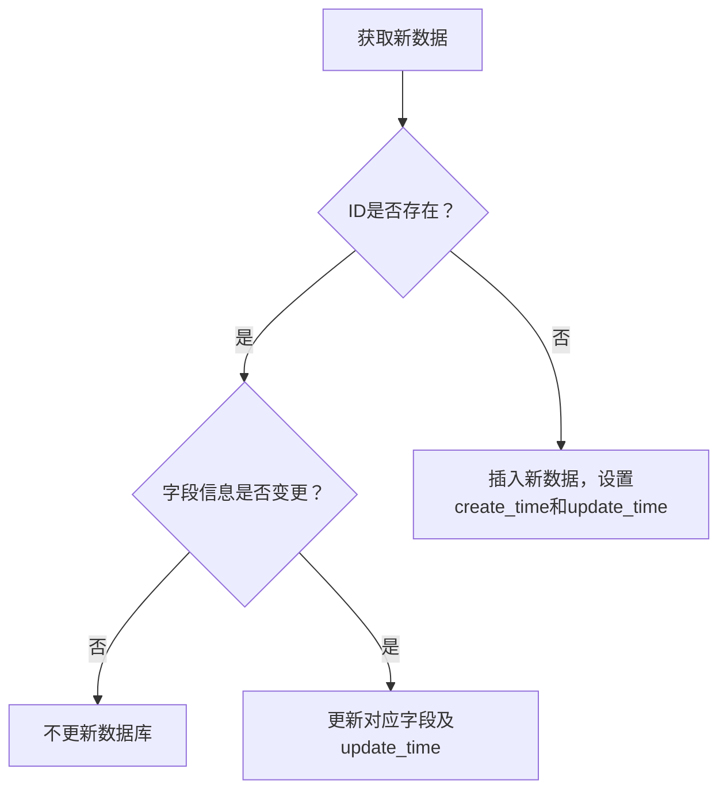
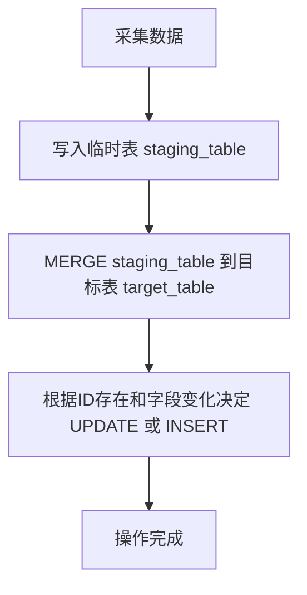

Best practices for BigQuery data insertion and update.

# requirements
这是一个关于 bigquery 数据库更新的问题
1   假设我的数据库里边已经存储了对应的数据 
2   我现在有一个对应的程序，去获取一些对应的数据
3   我会根据获取数据的情况来决定是更新数据库还是插入到数据库,当然这个选择的时候我都有一个唯一的值去做 比如叫 ID
我会通过这个 ID 获取我需要的字段信息,假设字段信息没有变更,那么我就不需要更新数据库,假设字段信息有变化 那么我就要去更新这个数据库 另外更新下update time 
4 假设这是一条全新的数据 并且 ID 在原来的数据里边没有，那么我需要将这条数据插入到数据库里 然后比如这个更新时间和创建时间，就是同一个时间也没有问题

# Deepseek 
在 BigQuery 中实现数据的插入和更新（UPSERT）操作，可以通过以下步骤完成。由于 BigQuery 不支持传统的 UPSERT 语法，我们使用 `MERGE` 语句结合条件判断来达到目的。

---

### **最佳实践步骤**

1. **准备临时表/数据源**
   将程序获取的新数据加载到临时表或作为子查询。假设临时表为 `temp_table`，结构与目标表一致（但不含 `create_time` 和 `update_time`）。

2. **使用 `MERGE` 语句合并数据**
   通过 `MERGE` 将临时表与目标表关联，根据 `ID` 匹配，动态判断是否需要更新或插入。

3. **字段变更检测**
   使用 **STRUCT 结构比较**排除时间字段，判断业务字段是否变化。BigQuery 的 `STRUCT` 比较能正确处理 `NULL` 值。

---

### **具体 SQL 示例**

```sql
MERGE `your_project.your_dataset.target_table` AS T
USING `your_project.your_dataset.temp_table` AS S
ON T.ID = S.ID
WHEN MATCHED AND (
  -- 比较排除时间字段后的所有业务字段是否变化
  SELECT AS STRUCT T.* EXCEPT (create_time, update_time)
) != (
  SELECT AS STRUCT S.* EXCEPT (create_time, update_time)
)
THEN
  UPDATE SET
    field1 = S.field1,
    field2 = S.field2,
    -- 其他字段...
    update_time = CURRENT_TIMESTAMP() -- 仅更新更新时间
WHEN NOT MATCHED BY TARGET THEN
  INSERT (
    ID,
    field1,
    field2,
    create_time,
    update_time
  )
  VALUES (
    S.ID,
    S.field1,
    S.field2,
    CURRENT_TIMESTAMP(), -- 创建时间
    CURRENT_TIMESTAMP()  -- 更新时间（与创建时间相同）
  );
```

---

### **关键点解释**

1. **STRUCT 比较字段变化**
   ```sql
   (SELECT AS STRUCT T.* EXCEPT (create_time, update_time)) != (SELECT AS STRUCT S.* EXCEPT (create_time, update_time))
   ```
   - 通过 `STRUCT` 将除时间字段外的所有字段打包，直接比较结构是否相等。
   - BigQuery 的 `STRUCT` 比较会正确处理 `NULL` 值，确保准确性。

2. **时间字段处理**
   - **插入新数据**：`create_time` 和 `update_time` 均设为当前时间。
   - **更新数据**：仅修改 `update_time`，保持 `create_time` 不变。

3. **性能优化**
   - **哈希预处理**：如果字段较多，可在临时表添加哈希列（如 `MD5` 或 `FARM_FINGERPRINT`），通过比较哈希值加速判断。
   - **分批处理**：对大表分批次执行 `MERGE`，避免单次操作超限。

---

### **补充说明**

- **流式数据场景**：若数据是实时流入，可先流式插入到临时表，再定时执行 `MERGE` 作业合并到主表。
- **配额与成本**：BigQuery 的 DML 操作有配额限制，需监控用量（参考 [BigQuery 配额文档](https://cloud.google.com/bigquery/docs/quota)）。
- **事务一致性**：`MERGE` 是原子操作，保证插入/更新的完整性。

---

通过以上方法，你可以在 BigQuery 中高效实现基于 ID 的插入/更新逻辑，确保数据变更的精准控制和时间戳的正确记录。


# Chatgpt 
下面给出一个使用 BigQuery MERGE 语句来实现数据“更新或插入”（即 Upsert）操作的最佳实践示例，同时附上简单的流程图说明整个过程。

⸻

1. 使用 MERGE 实现 Upsert

BigQuery 支持使用 MERGE 语句，通过 ON 条件来判断数据是否存在，并结合 WHEN MATCHED 和 WHEN NOT MATCHED 子句分别处理更新和插入的情况。示例代码如下：
```sql
MERGE dataset.target_table T
USING (
  SELECT
    'your_id_value' AS id,
    'new_value1' AS field1,
    'new_value2' AS field2,
    CURRENT_TIMESTAMP() AS current_ts
) S
ON T.id = S.id
WHEN MATCHED AND (
  T.field1 <> S.field1 OR
  T.field2 <> S.field2
) THEN
  UPDATE SET
    field1 = S.field1,
    field2 = S.field2,
    update_time = S.current_ts
WHEN NOT MATCHED THEN
  INSERT (id, field1, field2, create_time, update_time)
  VALUES (S.id, S.field1, S.field2, S.current_ts, S.current_ts)
```
说明：
	•	判断条件：ON T.id = S.id 用于判断数据是否已存在。
	•	更新分支：仅当匹配到数据且部分字段发生变更时执行更新，同时更新 update_time。
	•	插入分支：若没有匹配到数据，则插入一条新记录，同时设置 create_time 和 update_time。

⸻

2. 流程图描述

以下使用 Mermaid 绘制流程图，帮助理解数据的更新与插入逻辑：



⸻

3. 进一步建议
	•	数据对比：在判断字段是否发生变化时，可根据业务场景选择精确对比或采用数据摘要进行比对。
	•	分区表：如果数据量较大，建议使用分区表以及聚簇索引以提升 MERGE 语句的执行效率。
	•	日志记录：建议在更新或插入操作后记录日志，方便后续审计或回溯。

这种基于 MERGE 的方法能确保数据库中数据的一致性，同时避免了不必要的更新操作。如果有其他疑问或需要更详细的示例，欢迎进一步讨论。

## About Temp Table
✅ 是的，最佳实践 是建议用临时表或 staging table

虽然上面的示例直接用 USING (SELECT ...) 做 merge，但在实际项目里，通常你会有一批新数据，不止一条，所以会用一个临时表或staging表来存放这批需要 upsert 的数据，再去和目标表做 merge。

⸻

为什么要用临时表？

| 原因 | 解释 |
|------|------|
| 批量处理 | 直接 merge 单条数据通常只适合 demo，实际多为批量数据 |
| 提升性能 | 避免对主表频繁发起小粒度的 merge，改成批量 merge 更高效 |
| 便于审计 | 临时表/staging表 可以作为数据来源的完整记录，方便排查 |
| 更好扩展 | 后续可以加更多字段的对比、更复杂的 merge 逻辑 |
| 支持 pipeline | 常见于 Airflow、Dataflow、GCP Batch Job 等生产流程中 |


⸻

✅ 实际常用流程



⸻

示例流程

Step1: 将数据批量写入临时表

通常你的程序会收集一批数据，直接用 API、BigQuery Client 或 Batch Load 写入 staging_table
```sql
INSERT INTO dataset.staging_table (id, field1, field2, update_time)
VALUES
  ('id1', 'value1', 'value2', CURRENT_TIMESTAMP()),
  ('id2', 'value3', 'value4', CURRENT_TIMESTAMP()),
  ...
```
Step2: 执行 MERGE
```sql
MERGE dataset.target_table T
USING dataset.staging_table S
ON T.id = S.id
WHEN MATCHED AND (
  T.field1 <> S.field1 OR
  T.field2 <> S.field2
) THEN
  UPDATE SET
    field1 = S.field1,
    field2 = S.field2,
    update_time = CURRENT_TIMESTAMP()
WHEN NOT MATCHED THEN
  INSERT (id, field1, field2, create_time, update_time)
  VALUES (S.id, S.field1, S.field2, CURRENT_TIMESTAMP(), CURRENT_TIMESTAMP())
```
Step3: 可选 - 清空 staging_table

如果 staging_table 是临时用的，可以清空

`TRUNCATE TABLE dataset.staging_table;`


⸻

✅ 总结

| 方案 | 是否推荐 | 场景 |
|------|----------|------|
| 直接用程序发起单条 MERGE | 不推荐 | 只适合小测试或单条场景 |
| 程序先写入 staging，再 MERGE | 推荐 | 正常的生产、批量、pipeline 场景 |


⸻


# Gemini 
针对你在 BigQuery 中更新或插入数据的需求，使用 MERGE 语句通常是最佳实践。MERGE 语句允许你根据指定的条件，在一个操作中完成数据的更新、插入或两者兼有。
以下是具体的实现思路和步骤：
1. 创建一个临时表（可选但推荐）
你可以先将你程序获取到的新数据写入到一个临时的 BigQuery 表中。这样做有几个好处：
 * 原子性： 如果你的程序获取了多条数据，将它们先写入临时表可以确保所有的新数据在执行 MERGE 操作时都是可用的。
 * 易于管理： 临时表可以帮助你更好地组织和管理你的数据处理流程。
 * 性能： 对于大量数据的处理，先写入临时表再进行 MERGE 操作通常比逐条处理更高效。
假设你的临时表结构与你的目标表结构相同，并且也包含 ID 字段以及你需要更新或插入的其他字段。
2. 使用 MERGE 语句
接下来，你可以使用 MERGE 语句来根据 ID 比对你的目标表和临时表，并执行相应的操作。以下是一个 MERGE 语句的示例：
```sql
MERGE your_dataset.your_target_table AS target
USING your_dataset.your_temp_table AS source
ON target.ID = source.ID
WHEN MATCHED THEN
  UPDATE SET
    -- 列出你需要更新的字段，只有当字段值发生变化时才更新
    target.field1 = source.field1,
    target.field2 = source.field2,
    target.field3 = source.field3,
    target.update_time = CURRENT_TIMESTAMP()
WHEN NOT MATCHED THEN
  INSERT (ID, field1, field2, field3, create_time, update_time)
  VALUES (source.ID, source.field1, source.field2, source.field3, CURRENT_TIMESTAMP(), CURRENT_TIMESTAMP());
```
语句解析：
 * MERGE your_dataset.your_target_table AS target: 指定你的目标表，并给它一个别名 target。
 * USING your_dataset.your_temp_table AS source: 指定包含新数据的临时表，并给它一个别名 source。
 * ON target.ID = source.ID: 指定连接条件，这里我们使用 ID 作为唯一标识符进行匹配。
 * WHEN MATCHED THEN UPDATE SET ...: 当目标表中存在与临时表中 ID 匹配的记录时，执行 UPDATE 操作。
   * 你需要列出所有可能需要更新的字段。只有当 source 表中的对应字段值与 target 表中的值不同时，BigQuery 才会真正执行更新操作，这有助于节省成本。
   * target.update_time = CURRENT_TIMESTAMP(): 在更新时设置 update_time 为当前时间。
 * WHEN NOT MATCHED THEN INSERT ...: 当目标表中不存在与临时表中 ID 匹配的记录时，执行 INSERT 操作。
   * 你需要列出所有需要插入的字段，包括 ID、其他数据字段、create_time 和 update_time。
   * CURRENT_TIMESTAMP(): 在插入新记录时，将 create_time 和 update_time 都设置为当前时间。
3. 执行 MERGE 语句
你可以通过 BigQuery 控制台、客户端库（如 Python 的 google-cloud-bigquery）或其他 BigQuery 接口来执行这个 MERGE 语句。
最佳实践总结：
 * 使用 MERGE 语句： 这是在 BigQuery 中根据条件更新或插入数据的最有效和推荐的方法。
 * 创建临时表（推荐）： 将新数据先写入临时表可以提高效率和管理性。
 * 只更新变化的字段： 在 UPDATE SET 子句中列出所有可能需要更新的字段，BigQuery 会自动判断是否需要更新，避免不必要的写入操作。
 * 设置时间戳： 在 UPDATE 和 INSERT 操作中正确设置 update_time 和 create_time。
 * 考虑性能： 对于非常大的表，确保你的 ID 字段上有适当的索引（BigQuery 通常会自动处理），并考虑分区和聚簇等优化策略。
 * 错误处理： 在你的程序中实现适当的错误处理机制，以应对 MERGE 操作可能出现的失败情况。
不使用临时表的方法 (直接从程序数据执行 MERGE):
虽然不如使用临时表方便，但你也可以直接在 MERGE 语句的 USING 子句中使用 UNNEST 构造器来直接使用你的程序获取的数据。但这通常适用于数据量较小的情况。例如，如果你的程序获取的数据是一个包含字典或对象的列表，你可以这样构建 MERGE 语句：
MERGE your_dataset.your_target_table AS target
USING UNNEST(@new_data) AS source
ON target.ID = source.ID
WHEN MATCHED THEN
  UPDATE SET
    target.field1 = source.field1,
    target.field2 = source.field2,
    target.field3 = source.field3,
    target.update_time = CURRENT_TIMESTAMP()
WHEN NOT MATCHED THEN
  INSERT (ID, field1, field2, field3, create_time, update_time)
  VALUES (source.ID, source.field1, source.field2, source.field3, CURRENT_TIMESTAMP(), CURRENT_TIMESTAMP());

在这种情况下，你需要将你的程序数据以 BigQuery 期望的格式（例如，一个包含记录的列表）作为参数传递给 @new_data。具体的实现方式会依赖于你使用的 BigQuery 客户端库。
总结：
使用 MERGE 语句结合临时表是处理你描述的数据库更新和插入场景的最佳实践。它提供了高效、原子性的操作，并允许你根据唯一标识符灵活地处理数据的变化。记得根据你的实际表结构和字段名称调整 MERGE 语句中的表名、字段名和连接条件。
