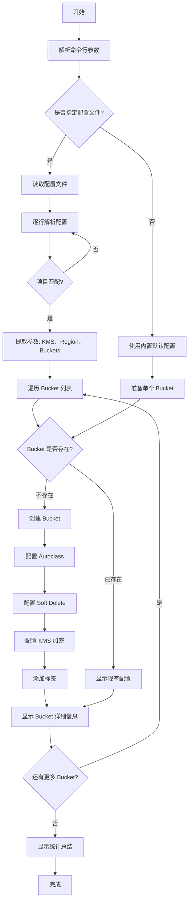

# GCS Bucket 批量创建脚本使用说明

## 概述

`create-buckets.sh` 是一个用于批量创建 GCS (Google Cloud Storage) Bucket 的自动化脚本，支持通过配置文件一次性创建多个 bucket。

## 功能特性

- ✅ **批量创建**: 支持从配置文件读取并创建多个 bucket
- ✅ **灵活配置**: 每行配置可定义不同的参数（KMS、区域等）
- ✅ **多 Bucket 支持**: 单行配置可指定多个 bucket 名称
- ✅ **简单易用**: 只需提供项目 ID 和配置文件即可
- ✅ **完整功能**: 包含 KMS 加密、Autoclass、Soft Delete 等高级特性
- ✅ **幂等性**: 如果 bucket 已存在，会跳过创建并显示当前配置
- ✅ **彩色输出**: 清晰的状态提示和错误处理
- ✅ **统计报告**: 自动显示创建成功、已存在、失败的 bucket 数量

## 配置方式

脚本支持两种配置方式：

### 1. 内置默认配置

不使用 `-c` 参数时，使用以下默认配置:

| 配置项 | 值 |
|--------|-----|
| **KMS Project** | `abjx-id-kms-dev` |
| **Region** | `europe-west2` |
| **Bucket Name** | `gs://cap-lex-eg-gkeconfigs` |
| **Storage Class** | `STANDARD` |
| **KMS Key** | `projects/abjx-id-kms-dev/locations/europe-west2/keyRings/cloudStorage/cryptoKeys/cloudStorage` |
| **Autoclass** | 启用 (终端类别: `ARCHIVE`) |
| **Soft Delete** | `604800s` (7天) |
| **Uniform Bucket Level Access** | 启用 |
| **Labels** | `enforcer_autoclass=enabled` |

### 2. 配置文件

使用 `-c` 参数指定配置文件，支持批量创建多个 bucket。

**配置文件格式**:
```
kms-project == <kms-project> region == <region> project == <project> buckets = <bucket1> <bucket2> ...
```

**示例配置文件** ([buckets-config.txt](file:///Users/lex/git/knowledge/gcp/buckets/buckets-config.txt)):
```bash
# 在 europe-west2 创建多个 bucket
kms-project == abjx-id-kms-dev region == europe-west2 project == aibang-projectid-wwww-dev buckets = gs://cap-lex-eg-gkeconfigs gs://cap-lex-eg-gkeconfigs2

# 在不同区域创建 bucket
kms-project == abjx-id-kms-dev region == us-central1 project == aibang-projectid-wwww-dev buckets = gs://cap-dev-us-backup
```

**配置说明**:
- 每行一个配置
- 以 `#` 开头的行为注释
- 只处理 `project` 字段与 `-p` 参数匹配的配置行
- `buckets` 字段可包含多个 bucket 名称（空格分隔）
- Bucket 名称可带或不带 `gs://` 前缀

## 使用方法

### 基本用法

```bash
# 使用内置默认配置创建单个 bucket
./create-buckets.sh -p <project-id>

# 使用配置文件批量创建多个 bucket
./create-buckets.sh -p <project-id> -c <config-file>
```

### 示例

```bash
# 示例 1: 使用默认配置
./create-buckets.sh -p aibang-projectid-wwww-dev

# 示例 2: 使用配置文件批量创建
./create-buckets.sh -p aibang-projectid-wwww-dev -c buckets-config.txt

# 示例 3: 查看帮助
./create-buckets.sh -h
```

## 执行流程

脚本执行时会按以下步骤进行:



## 输出示例

### 场景 1: 使用配置文件批量创建

```bash
$ ./create-buckets.sh -p aibang-projectid-wwww-dev -c buckets-config.txt

━━━━━━━━━━━━━━━━━━━━━━━━━━━━━━━━━━━━━━━━━━━━━━━━━━━━━━━━━━━━
  GCS Bucket 批量创建工具
━━━━━━━━━━━━━━━━━━━━━━━━━━━━━━━━━━━━━━━━━━━━━━━━━━━━━━━━━━━━
目标项目: aibang-projectid-wwww-dev
配置文件: buckets-config.txt

━━━━━━━━━━━━━━━━━━━━━━━━━━━━━━━━━━━━━━━━━━━━━━━━━━━━━━━━━━━━
  读取配置文件
━━━━━━━━━━━━━━━━━━━━━━━━━━━━━━━━━━━━━━━━━━━━━━━━━━━━━━━━━━━━
[INFO] 解析配置行 1: kms-project == abjx-id-kms-dev region == europe-west2 project == aibang-projectid-wwww-dev buckets = gs://cap-lex-eg-gkeconfigs gs://cap-lex-eg-gkeconfigs2
[SUCCESS] 找到匹配配置:
  KMS Project: abjx-id-kms-dev
  Region: europe-west2
  Project: aibang-projectid-wwww-dev
  Buckets: gs://cap-lex-eg-gkeconfigs gs://cap-lex-eg-gkeconfigs2

━━━━━━━━━━━━━━━━━━━━━━━━━━━━━━━━━━━━━━━━━━━━━━━━━━━━━━━━━━━━
  处理 Bucket: gs://cap-lex-eg-gkeconfigs
━━━━━━━━━━━━━━━━━━━━━━━━━━━━━━━━━━━━━━━━━━━━━━━━━━━━━━━━━━━━
[INFO] 创建 bucket: gs://cap-lex-eg-gkeconfigs
[INFO]   项目: aibang-projectid-wwww-dev
[INFO]   区域: europe-west2
[INFO]   KMS 密钥: projects/abjx-id-kms-dev/locations/europe-west2/keyRings/cloudStorage/cryptoKeys/cloudStorage
[INFO]   存储类别: STANDARD
[INFO]   Autoclass: 启用 (终端: ARCHIVE)
[INFO]   Soft Delete: 604800s
[SUCCESS] Bucket 创建成功！
[INFO] 添加标签: enforcer_autoclass=enabled
[SUCCESS] 标签配置完成！
[INFO] Bucket 详细信息:

{
  "autoclass": {
    "enabled": true,
    "terminalStorageClass": "ARCHIVE",
    ...
  },
  ...
}

━━━━━━━━━━━━━━━━━━━━━━━━━━━━━━━━━━━━━━━━━━━━━━━━━━━━━━━━━━━━
  处理 Bucket: gs://cap-lex-eg-gkeconfigs2
━━━━━━━━━━━━━━━━━━━━━━━━━━━━━━━━━━━━━━━━━━━━━━━━━━━━━━━━━━━━
[INFO] 创建 bucket: gs://cap-lex-eg-gkeconfigs2
...

━━━━━━━━━━━━━━━━━━━━━━━━━━━━━━━━━━━━━━━━━━━━━━━━━━━━━━━━━━━━
  执行总结
━━━━━━━━━━━━━━━━━━━━━━━━━━━━━━━━━━━━━━━━━━━━━━━━━━━━━━━━━━━━
总 Bucket 数:    2
新创建:          2
已存在:          0
失败:            0
[SUCCESS] 所有 Bucket 处理完成！
```

### 场景 2: Bucket 已存在

```bash
━━━━━━━━━━━━━━━━━━━━━━━━━━━━━━━━━━━━━━━━━━━━━━━━━━━━━━━━━━━━
  处理 Bucket: gs://cap-lex-eg-gkeconfigs
━━━━━━━━━━━━━━━━━━━━━━━━━━━━━━━━━━━━━━━━━━━━━━━━━━━━━━━━━━━━
[WARNING] Bucket gs://cap-lex-eg-gkeconfigs 已存在于项目 aibang-projectid-wwww-dev
[INFO] 显示当前配置...

{
  "name": "cap-lex-eg-gkeconfigs",
  ...
}
```

### 场景 3: 使用默认配置

```bash
$ ./create-buckets.sh -p aibang-projectid-wwww-dev

━━━━━━━━━━━━━━━━━━━━━━━━━━━━━━━━━━━━━━━━━━━━━━━━━━━━━━━━━━━━
  GCS Bucket 批量创建工具
━━━━━━━━━━━━━━━━━━━━━━━━━━━━━━━━━━━━━━━━━━━━━━━━━━━━━━━━━━━━
目标项目: aibang-projectid-wwww-dev
配置模式: 使用内置默认配置

━━━━━━━━━━━━━━━━━━━━━━━━━━━━━━━━━━━━━━━━━━━━━━━━━━━━━━━━━━━━
  使用内置默认配置
━━━━━━━━━━━━━━━━━━━━━━━━━━━━━━━━━━━━━━━━━━━━━━━━━━━━━━━━━━━━
...
```

## 前置要求

1. **gcloud CLI**: 已安装并配置 Google Cloud SDK
2. **认证**: 已通过 `gcloud auth login` 完成身份验证
3. **权限**: 具有以下 IAM 权限:
   - `storage.buckets.create`
   - `storage.buckets.get`
   - `storage.buckets.update`
   - `cloudkms.cryptoKeys.get` (用于 KMS 加密)

4. **KMS 密钥**: 确保 KMS 密钥已存在:
   ```bash
   gcloud kms keys describe cloudStorage \
     --keyring=cloudStorage \
     --location=europe-west2 \
     --project=abjx-id-kms-dev
   ```

## 错误处理

脚本包含以下错误处理机制:

- ✅ 参数验证: 检查必需参数是否提供
- ✅ Bucket 存在性检查: 避免重复创建
- ✅ 命令执行失败: 使用 `set -euo pipefail` 确保任何错误都会终止脚本
- ✅ 彩色输出: 清晰区分信息、警告和错误

## 自定义配置

如需修改配置，请编辑脚本中的以下变量:

```bash
# 在脚本顶部的 "内置配置定义" 部分
KMS_PROJECT="abjx-id-kms-dev"
REGION="europe-west2"
BUCKET_NAME="cap-lex-eg-gkeconfigs"
DEFAULT_STORAGE_CLASS="STANDARD"
# ... 其他配置
```

## 验证步骤

创建完成后，脚本会自动执行以下验证:

1. 显示完整的 bucket 配置 (JSON 格式)
2. 验证以下关键配置:
   - ✅ Autoclass 已启用
   - ✅ KMS 加密密钥正确
   - ✅ Soft Delete 策略已配置
   - ✅ Uniform Bucket Level Access 已启用
   - ✅ 标签已正确添加

## 相关文件

- [`buckets-des.md`](file:///Users/lex/git/knowledge/gcp/buckets/buckets-des.md) - 原始 bucket 配置模板
- [`create-buckets.sh`](file:///Users/lex/git/knowledge/gcp/buckets/create-buckets.sh) - Bucket 创建脚本

## 注意事项

> [!IMPORTANT]
> - Bucket 名称在 GCP 全局范围内必须唯一
> - KMS 密钥必须与 bucket 在同一区域
> - 删除 bucket 前请确保已备份所有数据

> [!WARNING]
> - Soft Delete 功能会在删除对象后保留 7 天，可能产生额外存储费用
> - Autoclass 会自动调整对象存储类别，可能影响访问延迟和成本

> [!TIP]
> - 使用 `--format=json` 可以获取机器可读的输出
> - 可以通过 `gcloud storage buckets list` 查看所有 bucket
