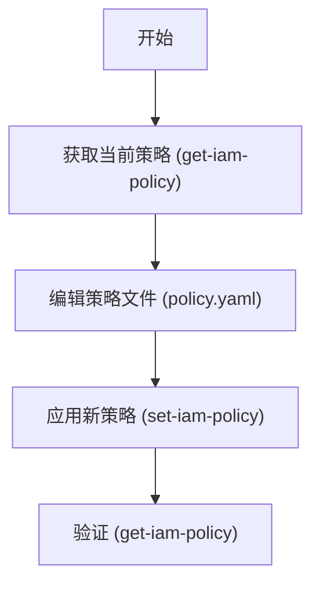
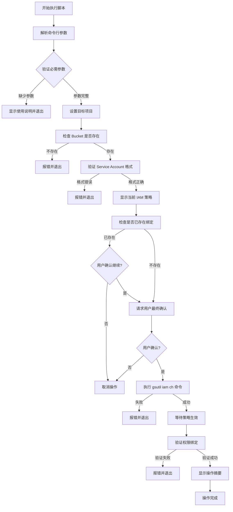

- [Chatgpt](#chatgpt)
  - [场景描述](#场景描述)
  - [方法一：使用自动化脚本 (推荐)](#方法一使用自动化脚本-推荐)
    - [脚本功能](#脚本功能)
    - [使用示例](#使用示例)
    - [脚本源码 (`add-bucket-binding.sh`)](#脚本源码-add-bucket-bindingsh)
  - [方法二：手动操作 (get-iam-policy)](#方法二手动操作-get-iam-policy)
    - [操作流程](#操作流程)
    - [详细步骤](#详细步骤)
      - [1. 获取当前策略](#1-获取当前策略)
      - [2. 编辑策略文件](#2-编辑策略文件)
      - [3. 应用新策略](#3-应用新策略)
      - [4. 验证](#4-验证)
  - [常见角色说明](#常见角色说明)
- [Claude GCS Bucket Service Account 权限绑定脚本](#claude-gcs-bucket-service-account-权限绑定脚本)
  - [问题分析](#问题分析)
  - [解决方案](#解决方案)
    - [Shell 脚本实现](#shell-脚本实现)
  - [使用说明](#使用说明)
    - [1. 脚本权限设置](#1-脚本权限设置)
    - [2. 基本使用示例](#2-基本使用示例)
    - [3. 常用角色参考](#3-常用角色参考)
  - [执行流程图](#执行流程图)
  - [脚本特性](#脚本特性)
    - [安全特性](#安全特性)
    - [输出特性](#输出特性)
  - [注意事项](#注意事项)
    - [权限要求](#权限要求)
    - [最佳实践](#最佳实践)
    - [故障排查](#故障排查)
  - [手动操作备选方案](#手动操作备选方案)

# Chatgpt 
 GCS Bucket 添加 Service Account 权限绑定

本文档详细说明如何为 GCS Bucket 添加跨项目 Service Account 的 IAM 权限绑定 (Binding)。

## 场景描述

目标是将一个项目的 Service Account (SA) 添加到另一个项目的 GCS Bucket 中，并授予特定角色 (例如 `roles/storage.legacyBucketReader`)。

- **Bucket**: `gs://abjx-env-region-gkecofigs` (示例)
- **Role**: `roles/storage.legacyBucketReader`
- **Service Account**: 来自其他项目的 SA

## 方法一：使用自动化脚本 (推荐)

我们提供了一个自动化脚本 `add-bucket-binding.sh`，它可以安全、快速地完成权限添加，并自动进行验证。

### 脚本功能

- 自动检查 bucket 是否存在
- 显示添加前的当前策略
- 使用 `add-iam-policy-binding` 原子操作添加权限
- 自动验证添加结果

### 使用示例

```bash
# 添加 legacyBucketReader 角色 (默认)
./add-bucket-binding.sh \
  -p <project-id> \
  -b gs://abjx-env-region-gkecofigs \
  -s service-account-email@project-id.iam.gserviceaccount.com

# 添加指定角色 (例如 objectViewer)
./add-bucket-binding.sh \
  -p <project-id> \
  -b gs://abjx-env-region-gkecofigs \
  -s service-account-email@project-id.iam.gserviceaccount.com \
  -r roles/storage.objectViewer
```

### 脚本源码 (`add-bucket-binding.sh`)

```bash
#!/bin/bash

################################################################################
# GCS Bucket IAM 绑定添加脚本
# 用法: ./add-bucket-binding.sh -p <project-id> -b <bucket-name> -s <service-account> [-r <role>]
# 示例: ./add-bucket-binding.sh -p my-project -b gs://my-bucket -s sa@project.iam.gserviceaccount.com
################################################################################

set -euo pipefail

# ============================================================================
# 颜色定义
# ============================================================================
RED='\033[0;31m'
GREEN='\033[0;32m'
YELLOW='\033[1;33m'
BLUE='\033[0;34m'
CYAN='\033[0;36m'
NC='\033[0m' # No Color

# ============================================================================
# 默认配置
# ============================================================================
DEFAULT_ROLE="roles/storage.legacyBucketReader"

# ============================================================================
# 辅助函数
# ============================================================================
print_info() {
    echo -e "${BLUE}[INFO]${NC} $1"
}

print_success() {
    echo -e "${GREEN}[SUCCESS]${NC} $1"
}

print_warning() {
    echo -e "${YELLOW}[WARNING]${NC} $1"
}

print_error() {
    echo -e "${RED}[ERROR]${NC} $1"
}

print_section() {
    echo ""
    echo -e "${CYAN}━━━━━━━━━━━━━━━━━━━━━━━━━━━━━━━━━━━━━━━━━━━━━━━━━━━━━━━━━━━━${NC}"
    echo -e "${CYAN}  $1${NC}"
    echo -e "${CYAN}━━━━━━━━━━━━━━━━━━━━━━━━━━━━━━━━━━━━━━━━━━━━━━━━━━━━━━━━━━━━${NC}"
}

usage() {
    cat << EOF
用法: $0 -p <project-id> -b <bucket-name> -s <service-account> [-r <role>]

参数:
    -p    GCP 项目 ID (必需)
    -b    Bucket 名称 (必需, e.g., gs://my-bucket)
    -s    Service Account 邮箱 (必需)
    -r    IAM 角色 (可选, 默认: ${DEFAULT_ROLE})
    -h    显示此帮助信息

示例:
    $0 -p aibang-projectid-wwww-dev -b gs://abjx-env-region-gkecofigs -s mysa@other-project.iam.gserviceaccount.com
EOF
    exit 1
}

# ============================================================================
# 参数解析
# ============================================================================
PROJECT_ID=""
BUCKET_NAME=""
SERVICE_ACCOUNT=""
ROLE="${DEFAULT_ROLE}"

while getopts "p:b:s:r:h" opt; do
    case ${opt} in
        p) PROJECT_ID="${OPTARG}" ;;
        b) BUCKET_NAME="${OPTARG}" ;;
        s) SERVICE_ACCOUNT="${OPTARG}" ;;
        r) ROLE="${OPTARG}" ;;
        h) usage ;;
        \?) print_error "无效的参数: -${OPTARG}"; usage ;;
        :) print_error "参数 -${OPTARG} 需要一个值"; usage ;;
    esac
done

# 检查必需参数
if [[ -z "${PROJECT_ID}" || -z "${BUCKET_NAME}" || -z "${SERVICE_ACCOUNT}" ]]; then
    print_error "缺少必需参数"
    usage
fi

# 规范化 Bucket 名称 (确保有 gs:// 前缀)
if [[ ! "${BUCKET_NAME}" =~ ^gs:// ]]; then
    BUCKET_NAME="gs://${BUCKET_NAME}"
fi

# 规范化 Service Account (添加 member 前缀)
MEMBER="serviceAccount:${SERVICE_ACCOUNT}"

# ============================================================================
# 主逻辑
# ============================================================================
print_section "GCS IAM 绑定添加工具"
echo "项目:          ${PROJECT_ID}"
echo "Bucket:        ${BUCKET_NAME}"
echo "成员 (Member): ${MEMBER}"
echo "角色 (Role):   ${ROLE}"

# 1. 检查 Bucket 是否存在
print_section "检查 Bucket 状态"
if ! gcloud storage buckets describe "${BUCKET_NAME}" --project="${PROJECT_ID}" &>/dev/null; then
    print_error "Bucket ${BUCKET_NAME} 不存在或无权访问 (项目: ${PROJECT_ID})"
    exit 1
fi
print_success "Bucket 存在"

# 2. 显示当前策略 (满足用户 'get policy' 的需求)
print_section "当前 IAM 策略 (部分)"
# 只显示相关角色的绑定，避免输出过多
print_info "正在获取当前策略..."
CURRENT_BINDING=$(gcloud storage buckets get-iam-policy "${BUCKET_NAME}" --project="${PROJECT_ID}" --format="json" | grep -A 5 "${ROLE}" || echo "未找到该角色的绑定")
echo "${CURRENT_BINDING}"

# 3. 添加绑定
print_section "添加 IAM 绑定"
print_info "正在执行: gcloud storage buckets add-iam-policy-binding ${BUCKET_NAME} --member=${MEMBER} --role=${ROLE}"

if gcloud storage buckets add-iam-policy-binding "${BUCKET_NAME}" \
    --project="${PROJECT_ID}" \
    --member="${MEMBER}" \
    --role="${ROLE}" > /dev/null; then
    
    print_success "绑定添加成功！"
else
    print_error "绑定添加失败"
    exit 1
fi

# 4. 验证更改
print_section "验证更改"
print_info "重新获取策略以验证..."
NEW_POLICY=$(gcloud storage buckets get-iam-policy "${BUCKET_NAME}" --project="${PROJECT_ID}" --format="json(bindings)")

# 简单检查 (使用 grep 检查输出中是否包含 member 和 role)
# 注意: JSON 输出格式化后，grep 可能需要多行匹配，这里简化处理，直接显示结果
# 更严谨的检查需要 jq，但不假设环境中有 jq
if echo "${NEW_POLICY}" | grep -q "${SERVICE_ACCOUNT}"; then
    if echo "${NEW_POLICY}" | grep -q "${ROLE}"; then
        print_success "验证通过: 策略中包含目标 Service Account 和角色"
    else
        print_warning "验证: 找到了 Service Account，但未在上下文中确认角色 (请人工核对)"
    fi
else
    print_error "验证失败: 策略中未找到该 Service Account"
fi

print_info "完整策略检查命令: gcloud storage buckets get-iam-policy ${BUCKET_NAME} --project=${PROJECT_ID}"

exit 0
```

## 方法二：手动操作 (get-iam-policy)

如果你希望查看完整策略文件并进行手动修改，可以使用 `get-iam-policy` 和 `set-iam-policy` 的组合。

### 操作流程



### 详细步骤

#### 1. 获取当前策略

将当前 bucket 的 IAM 策略导出到文件：

```bash
export BUCKET_NAME="gs://abjx-env-region-gkecofigs"
export PROJECT_ID="<your-project-id>"

gcloud storage buckets get-iam-policy $BUCKET_NAME \
    --project=$PROJECT_ID \
    --format=yaml > policy.yaml
```

#### 2. 编辑策略文件

打开 `policy.yaml`，找到 `bindings` 部分，添加新的绑定配置。

**修改前**:
```yaml
bindings:
- members:
  - projectEditor:my-project
  role: roles/storage.legacyBucketOwner
etag: BwY..........=
```

**修改后 (添加新的 binding)**:
```yaml
bindings:
- members:
  - projectEditor:my-project
  role: roles/storage.legacyBucketOwner
- members:  # 新增部分
  - serviceAccount:your-sa@other-project.iam.gserviceaccount.com
  role: roles/storage.legacyBucketReader
etag: BwY..........=
```

> **注意**: 请务必保留 `etag` 字段，它是防止并发修改冲突的关键。

#### 3. 应用新策略

将修改后的文件应用回 bucket：

```bash
gcloud storage buckets set-iam-policy $BUCKET_NAME policy.yaml \
    --project=$PROJECT_ID
```

#### 4. 验证

再次查看策略以确认更改生效：

```bash
gcloud storage buckets get-iam-policy $BUCKET_NAME --project=$PROJECT_ID
```

## 常见角色说明

| 角色 ID | 描述 |
|---------|------|
| `roles/storage.legacyBucketReader` | 读取 bucket 元数据 (ACLs, 标签等)，不包含列出对象。 |
| `roles/storage.legacyBucketWriter` | 读取和写入 bucket 元数据。 |
| `roles/storage.objectViewer` | 查看对象及其元数据，列出 bucket 中的对象。**推荐用于只读访问**。 |
| `roles/storage.objectCreator` | 创建对象。 |

> **提示**: `roles/storage.legacyBucketReader` 是旧版 ACL 兼容角色。如果只需要读取对象内容，通常推荐使用 `roles/storage.objectViewer`。


# Claude GCS Bucket Service Account 权限绑定脚本

## 问题分析

需要创建一个自动化脚本来为 GCS Bucket 添加跨项目 Service Account 的 IAM 权限绑定，确保操作的原子性和安全性。

## 解决方案

### Shell 脚本实现

```bash
#!/bin/bash

# GCS Bucket IAM 权限绑定脚本
# 用途: 为 GCS Bucket 添加 Service Account 权限

set -euo pipefail

# 颜色定义
RED='\033[0;31m'
GREEN='\033[0;32m'
YELLOW='\033[1;33m'
NC='\033[0m' # No Color

# 日志函数
log_info() {
    echo -e "${GREEN}[INFO]${NC} $1"
}

log_warn() {
    echo -e "${YELLOW}[WARN]${NC} $1"
}

log_error() {
    echo -e "${RED}[ERROR]${NC} $1"
}

# 显示使用说明
usage() {
    cat << EOF
使用方法: $0 [选项]

选项:
    -b, --bucket BUCKET_NAME        GCS Bucket 名称 (必需)
    -s, --service-account SA_EMAIL  Service Account 邮箱 (必需)
    -r, --role ROLE                 IAM 角色 (默认: roles/storage.legacyBucketReader)
    -p, --project PROJECT_ID        项目 ID (可选，默认使用当前项目)
    -h, --help                      显示此帮助信息

示例:
    $0 -b gs://abjx-env-region-gkecofigs \\
       -s sa-name@project-id.iam.gserviceaccount.com \\
       -r roles/storage.legacyBucketReader

    $0 --bucket my-bucket \\
       --service-account my-sa@project.iam.gserviceaccount.com \\
       --role roles/storage.objectViewer \\
       --project my-project-id
EOF
    exit 1
}

# 参数解析
BUCKET=""
SERVICE_ACCOUNT=""
ROLE="roles/storage.legacyBucketReader"
PROJECT_ID=""

while [[ $# -gt 0 ]]; do
    case $1 in
        -b|--bucket)
            BUCKET="$2"
            shift 2
            ;;
        -s|--service-account)
            SERVICE_ACCOUNT="$2"
            shift 2
            ;;
        -r|--role)
            ROLE="$2"
            shift 2
            ;;
        -p|--project)
            PROJECT_ID="$2"
            shift 2
            ;;
        -h|--help)
            usage
            ;;
        *)
            log_error "未知参数: $1"
            usage
            ;;
    esac
done

# 验证必需参数
if [[ -z "$BUCKET" ]] || [[ -z "$SERVICE_ACCOUNT" ]]; then
    log_error "缺少必需参数"
    usage
fi

# 处理 bucket 名称 (移除 gs:// 前缀)
BUCKET="${BUCKET#gs://}"

# 设置项目 (如果指定)
if [[ -n "$PROJECT_ID" ]]; then
    log_info "设置当前项目为: $PROJECT_ID"
    gcloud config set project "$PROJECT_ID" > /dev/null 2>&1
fi

# 获取当前项目
CURRENT_PROJECT=$(gcloud config get-value project 2>/dev/null)
log_info "当前操作项目: $CURRENT_PROJECT"

# 检查 bucket 是否存在
check_bucket() {
    log_info "检查 Bucket 是否存在: gs://$BUCKET"
    
    if ! gsutil ls -b "gs://$BUCKET" > /dev/null 2>&1; then
        log_error "Bucket 不存在或无访问权限: gs://$BUCKET"
        exit 1
    fi
    
    log_info "✓ Bucket 存在"
}

# 验证 Service Account 格式
validate_service_account() {
    log_info "验证 Service Account 格式: $SERVICE_ACCOUNT"
    
    if [[ ! "$SERVICE_ACCOUNT" =~ ^[a-zA-Z0-9._-]+@[a-zA-Z0-9._-]+\.iam\.gserviceaccount\.com$ ]]; then
        log_error "Service Account 格式不正确"
        log_error "正确格式: sa-name@project-id.iam.gserviceaccount.com"
        exit 1
    fi
    
    log_info "✓ Service Account 格式正确"
}

# 显示当前 IAM 策略
show_current_policy() {
    log_info "获取当前 IAM 策略..."
    echo ""
    echo "=== 当前 Bucket IAM 策略 (仅显示相关角色) ==="
    
    if gsutil iam get "gs://$BUCKET" 2>/dev/null | grep -A 10 "\"role\": \"$ROLE\"" || true; then
        log_warn "角色 $ROLE 已存在绑定"
    else
        log_info "角色 $ROLE 当前无绑定"
    fi
    echo ""
}

# 检查是否已存在绑定
check_existing_binding() {
    log_info "检查是否已存在相同绑定..."
    
    if gsutil iam get "gs://$BUCKET" 2>/dev/null | grep -q "serviceAccount:$SERVICE_ACCOUNT" && \
       gsutil iam get "gs://$BUCKET" 2>/dev/null | grep -A 5 "\"role\": \"$ROLE\"" | grep -q "serviceAccount:$SERVICE_ACCOUNT"; then
        log_warn "绑定已存在: $SERVICE_ACCOUNT -> $ROLE"
        read -p "是否继续 (重新添加可能导致重复)? [y/N] " -n 1 -r
        echo
        if [[ ! $REPLY =~ ^[Yy]$ ]]; then
            log_info "操作已取消"
            exit 0
        fi
    fi
}

# 添加 IAM 绑定
add_iam_binding() {
    log_info "添加 IAM 权限绑定..."
    log_info "  Bucket: gs://$BUCKET"
    log_info "  Member: serviceAccount:$SERVICE_ACCOUNT"
    log_info "  Role: $ROLE"
    echo ""
    
    # 确认操作
    read -p "确认执行以上操作? [y/N] " -n 1 -r
    echo
    if [[ ! $REPLY =~ ^[Yy]$ ]]; then
        log_info "操作已取消"
        exit 0
    fi
    
    # 执行添加操作
    if gsutil iam ch "serviceAccount:$SERVICE_ACCOUNT:$ROLE" "gs://$BUCKET"; then
        log_info "✓ 权限绑定添加成功"
    else
        log_error "✗ 权限绑定添加失败"
        exit 1
    fi
}

# 验证添加结果
verify_binding() {
    log_info "验证权限绑定..."
    sleep 2  # 等待 IAM 策略生效
    
    if gsutil iam get "gs://$BUCKET" 2>/dev/null | grep -A 5 "\"role\": \"$ROLE\"" | grep -q "serviceAccount:$SERVICE_ACCOUNT"; then
        log_info "✓ 验证成功: 权限绑定已生效"
        echo ""
        echo "=== 验证详情 ==="
        gsutil iam get "gs://$BUCKET" 2>/dev/null | grep -A 10 "\"role\": \"$ROLE\""
    else
        log_error "✗ 验证失败: 未找到预期的权限绑定"
        exit 1
    fi
}

# 主流程
main() {
    log_info "开始执行 GCS Bucket IAM 权限绑定"
    echo ""
    
    # 执行检查
    check_bucket
    validate_service_account
    show_current_policy
    check_existing_binding
    
    # 执行添加
    add_iam_binding
    
    # 验证结果
    verify_binding
    
    echo ""
    log_info "=== 操作完成 ==="
    log_info "Bucket: gs://$BUCKET"
    log_info "Service Account: $SERVICE_ACCOUNT"
    log_info "Role: $ROLE"
}

# 执行主流程
main
```

## 使用说明

### 1. 脚本权限设置

```bash
# 保存脚本
cat > add-bucket-binding.sh << 'EOF'
# ... (将上面的脚本内容粘贴到这里)
EOF

# 添加执行权限
chmod +x add-bucket-binding.sh
```

### 2. 基本使用示例

```bash
# 最简单的使用方式
./add-bucket-binding.sh \
  -b gs://abjx-env-region-gkecofigs \
  -s my-service-account@project-id.iam.gserviceaccount.com

# 指定自定义角色
./add-bucket-binding.sh \
  -b my-bucket \
  -s my-sa@project.iam.gserviceaccount.com \
  -r roles/storage.objectViewer

# 指定项目 ID
./add-bucket-binding.sh \
  -b my-bucket \
  -s my-sa@project.iam.gserviceaccount.com \
  -r roles/storage.legacyBucketReader \
  -p target-project-id
```

### 3. 常用角色参考

|角色                                |权限说明         |
|----------------------------------|-------------|
|`roles/storage.legacyBucketReader`|Bucket 级别读取权限|
|`roles/storage.legacyBucketWriter`|Bucket 级别写入权限|
|`roles/storage.objectViewer`      |对象查看权限       |
|`roles/storage.objectCreator`     |对象创建权限       |
|`roles/storage.objectAdmin`       |对象管理员权限      |
|`roles/storage.admin`             |完整管理员权限      |

## 执行流程图



## 脚本特性

### 安全特性

1. **参数验证**

- 检查必需参数完整性
- 验证 Service Account 格式
- 确认 Bucket 存在性

1. **交互确认**

- 显示当前策略状态
- 重复绑定警告
- 操作前最终确认

1. **错误处理**

- 使用 `set -euo pipefail` 严格模式
- 所有命令返回值检查
- 详细的错误信息输出

### 输出特性

1. **彩色日志**

- 绿色: 信息提示
- 黄色: 警告信息
- 红色: 错误信息

1. **详细反馈**

- 操作前状态展示
- 操作过程实时反馈
- 操作后验证结果

## 注意事项

### 权限要求

执行此脚本需要以下权限:

```bash
# Bucket 级别权限
roles/storage.admin
# 或至少
roles/storage.legacyBucketOwner

# 项目级别权限 (如果跨项目)
roles/resourcemanager.projectIamAdmin
```

### 最佳实践

1. **测试环境验证**
   
   ```bash
   # 先在测试 bucket 上验证
   ./add-bucket-binding.sh -b test-bucket -s test-sa@project.iam.gserviceaccount.com
   ```
1. **权限最小化原则**
   
   ```bash
   # 优先使用最小权限角色
   # 避免直接使用 roles/storage.admin
   ./add-bucket-binding.sh -b my-bucket \
     -s my-sa@project.iam.gserviceaccount.com \
     -r roles/storage.objectViewer  # 只读权限
   ```
1. **批量操作脚本化**
   
   ```bash
   # 为多个 Service Account 添加权限
   cat service-accounts.txt | while read sa; do
     ./add-bucket-binding.sh -b my-bucket -s "$sa"
   done
   ```

### 故障排查

1. **权限不足**
   
   ```bash
   # 检查当前用户权限
   gcloud projects get-iam-policy PROJECT_ID \
     --flatten="bindings[].members" \
     --filter="bindings.members:$(gcloud config get-value account)"
   ```
1. **验证失败**
   
   ```bash
   # 手动验证 IAM 策略
   gsutil iam get gs://BUCKET_NAME
   
   # 检查策略传播延迟
   sleep 5 && gsutil iam get gs://BUCKET_NAME
   ```
1. **Service Account 不存在**
   
   ```bash
   # 验证 SA 是否存在
   gcloud iam service-accounts describe SA_EMAIL
   ```

## 手动操作备选方案

如果脚本无法使用,可以手动执行:

```bash
# 方法 1: 使用 gsutil iam ch (推荐)
gsutil iam ch serviceAccount:SA_EMAIL:ROLE gs://BUCKET_NAME

# 方法 2: 使用 gcloud (需要 bucket 所在项目的项目 ID)
gcloud storage buckets add-iam-policy-binding gs://BUCKET_NAME \
  --member="serviceAccount:SA_EMAIL" \
  --role="ROLE"

# 验证
gsutil iam get gs://BUCKET_NAME | grep SA_EMAIL
```

-----

此脚本提供了安全、可靠的 GCS Bucket 权限绑定自动化方案,适用于生产环境批量操作。