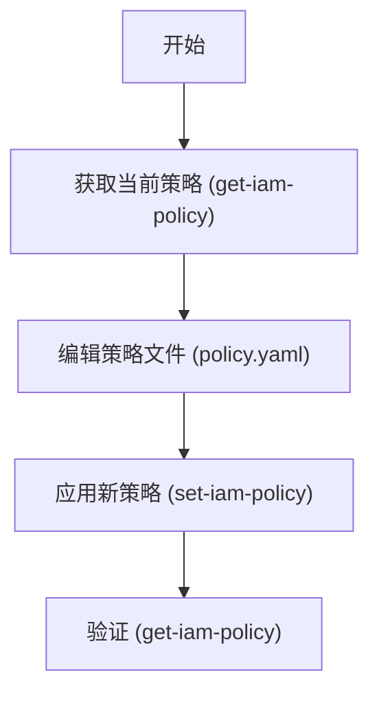

# GCS Bucket 添加 Service Account 权限绑定

本文档详细说明如何为 GCS Bucket 添加跨项目 Service Account 的 IAM 权限绑定 (Binding)。

## 场景描述

目标是将一个项目的 Service Account (SA) 添加到另一个项目的 GCS Bucket 中，并授予特定角色 (例如 `roles/storage.legacyBucketReader`)。

- **Bucket**: `gs://abjx-env-region-gkecofigs` (示例)
- **Role**: `roles/storage.legacyBucketReader`
- **Service Account**: 来自其他项目的 SA

## 方法一：使用自动化脚本 (推荐)

我们提供了一个自动化脚本 `add-bucket-binding.sh`，它可以安全、快速地完成权限添加，并自动进行验证。

### 脚本功能

- 自动检查 bucket 是否存在
- 显示添加前的当前策略
- 使用 `add-iam-policy-binding` 原子操作添加权限
- 自动验证添加结果

### 使用示例

```bash
# 添加 legacyBucketReader 角色 (默认)
./add-bucket-binding.sh \
  -p <project-id> \
  -b gs://abjx-env-region-gkecofigs \
  -s service-account-email@project-id.iam.gserviceaccount.com

# 添加指定角色 (例如 objectViewer)
./add-bucket-binding.sh \
  -p <project-id> \
  -b gs://abjx-env-region-gkecofigs \
  -s service-account-email@project-id.iam.gserviceaccount.com \
  -r roles/storage.objectViewer
```

### 脚本源码 (`add-bucket-binding.sh`)

```bash
#!/bin/bash

################################################################################
# GCS Bucket IAM 绑定添加脚本
# 用法: ./add-bucket-binding.sh -p <project-id> -b <bucket-name> -s <service-account> [-r <role>]
# 示例: ./add-bucket-binding.sh -p my-project -b gs://my-bucket -s sa@project.iam.gserviceaccount.com
################################################################################

set -euo pipefail

# ============================================================================
# 颜色定义
# ============================================================================
RED='\033[0;31m'
GREEN='\033[0;32m'
YELLOW='\033[1;33m'
BLUE='\033[0;34m'
CYAN='\033[0;36m'
NC='\033[0m' # No Color

# ============================================================================
# 默认配置
# ============================================================================
DEFAULT_ROLE="roles/storage.legacyBucketReader"

# ============================================================================
# 辅助函数
# ============================================================================
print_info() {
    echo -e "${BLUE}[INFO]${NC} $1"
}

print_success() {
    echo -e "${GREEN}[SUCCESS]${NC} $1"
}

print_warning() {
    echo -e "${YELLOW}[WARNING]${NC} $1"
}

print_error() {
    echo -e "${RED}[ERROR]${NC} $1"
}

print_section() {
    echo ""
    echo -e "${CYAN}━━━━━━━━━━━━━━━━━━━━━━━━━━━━━━━━━━━━━━━━━━━━━━━━━━━━━━━━━━━━${NC}"
    echo -e "${CYAN}  $1${NC}"
    echo -e "${CYAN}━━━━━━━━━━━━━━━━━━━━━━━━━━━━━━━━━━━━━━━━━━━━━━━━━━━━━━━━━━━━${NC}"
}

usage() {
    cat << EOF
用法: $0 -p <project-id> -b <bucket-name> -s <service-account> [-r <role>]

参数:
    -p    GCP 项目 ID (必需)
    -b    Bucket 名称 (必需, e.g., gs://my-bucket)
    -s    Service Account 邮箱 (必需)
    -r    IAM 角色 (可选, 默认: ${DEFAULT_ROLE})
    -h    显示此帮助信息

示例:
    $0 -p aibang-projectid-wwww-dev -b gs://abjx-env-region-gkecofigs -s mysa@other-project.iam.gserviceaccount.com
EOF
    exit 1
}

# ============================================================================
# 参数解析
# ============================================================================
PROJECT_ID=""
BUCKET_NAME=""
SERVICE_ACCOUNT=""
ROLE="${DEFAULT_ROLE}"

while getopts "p:b:s:r:h" opt; do
    case ${opt} in
        p) PROJECT_ID="${OPTARG}" ;;
        b) BUCKET_NAME="${OPTARG}" ;;
        s) SERVICE_ACCOUNT="${OPTARG}" ;;
        r) ROLE="${OPTARG}" ;;
        h) usage ;;
        \?) print_error "无效的参数: -${OPTARG}"; usage ;;
        :) print_error "参数 -${OPTARG} 需要一个值"; usage ;;
    esac
done

# 检查必需参数
if [[ -z "${PROJECT_ID}" || -z "${BUCKET_NAME}" || -z "${SERVICE_ACCOUNT}" ]]; then
    print_error "缺少必需参数"
    usage
fi

# 规范化 Bucket 名称 (确保有 gs:// 前缀)
if [[ ! "${BUCKET_NAME}" =~ ^gs:// ]]; then
    BUCKET_NAME="gs://${BUCKET_NAME}"
fi

# 规范化 Service Account (添加 member 前缀)
MEMBER="serviceAccount:${SERVICE_ACCOUNT}"

# ============================================================================
# 主逻辑
# ============================================================================
print_section "GCS IAM 绑定添加工具"
echo "项目:          ${PROJECT_ID}"
echo "Bucket:        ${BUCKET_NAME}"
echo "成员 (Member): ${MEMBER}"
echo "角色 (Role):   ${ROLE}"

# 1. 检查 Bucket 是否存在
print_section "检查 Bucket 状态"
if ! gcloud storage buckets describe "${BUCKET_NAME}" --project="${PROJECT_ID}" &>/dev/null; then
    print_error "Bucket ${BUCKET_NAME} 不存在或无权访问 (项目: ${PROJECT_ID})"
    exit 1
fi
print_success "Bucket 存在"

# 2. 显示当前策略 (满足用户 'get policy' 的需求)
print_section "当前 IAM 策略 (部分)"
# 只显示相关角色的绑定，避免输出过多
print_info "正在获取当前策略..."
CURRENT_BINDING=$(gcloud storage buckets get-iam-policy "${BUCKET_NAME}" --project="${PROJECT_ID}" --format="json" | grep -A 5 "${ROLE}" || echo "未找到该角色的绑定")
echo "${CURRENT_BINDING}"

# 3. 添加绑定
print_section "添加 IAM 绑定"
print_info "正在执行: gcloud storage buckets add-iam-policy-binding ${BUCKET_NAME} --member=${MEMBER} --role=${ROLE}"

if gcloud storage buckets add-iam-policy-binding "${BUCKET_NAME}" \
    --project="${PROJECT_ID}" \
    --member="${MEMBER}" \
    --role="${ROLE}" > /dev/null; then
    
    print_success "绑定添加成功！"
else
    print_error "绑定添加失败"
    exit 1
fi

# 4. 验证更改
print_section "验证更改"
print_info "重新获取策略以验证..."
NEW_POLICY=$(gcloud storage buckets get-iam-policy "${BUCKET_NAME}" --project="${PROJECT_ID}" --format="json(bindings)")

# 简单检查 (使用 grep 检查输出中是否包含 member 和 role)
# 注意: JSON 输出格式化后，grep 可能需要多行匹配，这里简化处理，直接显示结果
# 更严谨的检查需要 jq，但不假设环境中有 jq
if echo "${NEW_POLICY}" | grep -q "${SERVICE_ACCOUNT}"; then
    if echo "${NEW_POLICY}" | grep -q "${ROLE}"; then
        print_success "验证通过: 策略中包含目标 Service Account 和角色"
    else
        print_warning "验证: 找到了 Service Account，但未在上下文中确认角色 (请人工核对)"
    fi
else
    print_error "验证失败: 策略中未找到该 Service Account"
fi

print_info "完整策略检查命令: gcloud storage buckets get-iam-policy ${BUCKET_NAME} --project=${PROJECT_ID}"

exit 0
```

## 方法二：手动操作 (get-iam-policy)

如果你希望查看完整策略文件并进行手动修改，可以使用 `get-iam-policy` 和 `set-iam-policy` 的组合。

### 操作流程



### 详细步骤

#### 1. 获取当前策略

将当前 bucket 的 IAM 策略导出到文件：

```bash
export BUCKET_NAME="gs://abjx-env-region-gkecofigs"
export PROJECT_ID="<your-project-id>"

gcloud storage buckets get-iam-policy $BUCKET_NAME \
    --project=$PROJECT_ID \
    --format=yaml > policy.yaml
```

#### 2. 编辑策略文件

打开 `policy.yaml`，找到 `bindings` 部分，添加新的绑定配置。

**修改前**:
```yaml
bindings:
- members:
  - projectEditor:my-project
  role: roles/storage.legacyBucketOwner
etag: BwY..........=
```

**修改后 (添加新的 binding)**:
```yaml
bindings:
- members:
  - projectEditor:my-project
  role: roles/storage.legacyBucketOwner
- members:  # 新增部分
  - serviceAccount:your-sa@other-project.iam.gserviceaccount.com
  role: roles/storage.legacyBucketReader
etag: BwY..........=
```

> **注意**: 请务必保留 `etag` 字段，它是防止并发修改冲突的关键。

#### 3. 应用新策略

将修改后的文件应用回 bucket：

```bash
gcloud storage buckets set-iam-policy $BUCKET_NAME policy.yaml \
    --project=$PROJECT_ID
```

#### 4. 验证

再次查看策略以确认更改生效：

```bash
gcloud storage buckets get-iam-policy $BUCKET_NAME --project=$PROJECT_ID
```

## 常见角色说明

| 角色 ID | 描述 |
|---------|------|
| `roles/storage.legacyBucketReader` | 读取 bucket 元数据 (ACLs, 标签等)，不包含列出对象。 |
| `roles/storage.legacyBucketWriter` | 读取和写入 bucket 元数据。 |
| `roles/storage.objectViewer` | 查看对象及其元数据，列出 bucket 中的对象。**推荐用于只读访问**。 |
| `roles/storage.objectCreator` | 创建对象。 |

> **提示**: `roles/storage.legacyBucketReader` 是旧版 ACL 兼容角色。如果只需要读取对象内容，通常推荐使用 `roles/storage.objectViewer`。
