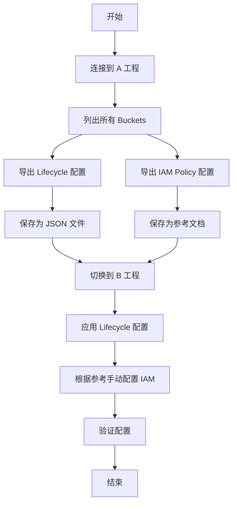

# Google Cloud Storage Buckets 配置迁移方案

## 问题分析

您需要将 GCS Bucket 的配置从 A 工程迁移到 B 工程，主要关注：

- **Lifecycle 规则**：可以直接导出 JSON 并应用到 B 工程
- **IAM Policy**：需要导出作为参考，手动调整成 B 工程的对应账户

## 解决方案

### 方案流程



### 实施步骤

#### 1. 导出 A 工程配置

```bash
#!/bin/bash
# export_bucket_configs_enhanced.sh - 导出完整 Bucket 配置（含版本控制）

set -e

# 配置变量
PROJECT_A="your-project-a-id"
OUTPUT_DIR="./bucket_configs"
TIMESTAMP=$(date +%Y%m%d_%H%M%S)

# 创建输出目录
mkdir -p "${OUTPUT_DIR}/lifecycle"
mkdir -p "${OUTPUT_DIR}/iam"
mkdir -p "${OUTPUT_DIR}/versioning"
mkdir -p "${OUTPUT_DIR}/labels"
mkdir -p "${OUTPUT_DIR}/cors"

# 设置当前工程
gcloud config set project "${PROJECT_A}"

echo "=== 开始导出 ${PROJECT_A} 的 Bucket 完整配置 ==="

# 获取所有 Buckets
BUCKETS=$(gsutil ls)

# 创建汇总文件
SUMMARY_FILE="${OUTPUT_DIR}/buckets_summary_${TIMESTAMP}.csv"
echo "Bucket名称,版本控制,存储类别,位置,创建时间" > "${SUMMARY_FILE}"

for BUCKET in ${BUCKETS}; do
    # 去掉 gs:// 前缀和末尾斜杠
    BUCKET_NAME=$(echo ${BUCKET} | sed 's|gs://||g' | sed 's|/||g')
    
    echo ""
    echo "========================================="
    echo "处理 Bucket: ${BUCKET_NAME}"
    echo "========================================="
    
    # 1. 导出 Lifecycle 配置
    echo "  [1/6] 导出 Lifecycle 配置..."
    if gsutil lifecycle get "gs://${BUCKET_NAME}" > "${OUTPUT_DIR}/lifecycle/${BUCKET_NAME}_lifecycle.json" 2>/dev/null; then
        echo "    ✓ Lifecycle 配置已保存"
    else
        echo "    ✗ 该 Bucket 无 Lifecycle 配置"
        echo "{}" > "${OUTPUT_DIR}/lifecycle/${BUCKET_NAME}_lifecycle.json"
    fi
    
    # 2. 导出 IAM Policy
    echo "  [2/6] 导出 IAM Policy..."
    gsutil iam get "gs://${BUCKET_NAME}" > "${OUTPUT_DIR}/iam/${BUCKET_NAME}_iam.json"
    
    # 3. 导出版本控制状态
    echo "  [3/6] 导出版本控制状态..."
    VERSIONING_STATUS=$(gsutil versioning get "gs://${BUCKET_NAME}" | grep -oP '(?<=: )\w+')
    echo "${VERSIONING_STATUS}" > "${OUTPUT_DIR}/versioning/${BUCKET_NAME}_versioning.txt"
    echo "    ✓ 版本控制状态: ${VERSIONING_STATUS}"
    
    # 4. 导出 CORS 配置
    echo "  [4/6] 导出 CORS 配置..."
    if gsutil cors get "gs://${BUCKET_NAME}" > "${OUTPUT_DIR}/cors/${BUCKET_NAME}_cors.json" 2>/dev/null; then
        # 检查是否为空配置
        if [ -s "${OUTPUT_DIR}/cors/${BUCKET_NAME}_cors.json" ] && [ "$(cat ${OUTPUT_DIR}/cors/${BUCKET_NAME}_cors.json)" != "[]" ]; then
            echo "    ✓ CORS 配置已保存"
        else
            echo "    ✗ 该 Bucket 无 CORS 配置"
            echo "[]" > "${OUTPUT_DIR}/cors/${BUCKET_NAME}_cors.json"
        fi
    else
        echo "    ✗ 该 Bucket 无 CORS 配置"
        echo "[]" > "${OUTPUT_DIR}/cors/${BUCKET_NAME}_cors.json"
    fi
    
    # 5. 导出 Bucket 标签
    echo "  [5/6] 导出 Bucket 标签..."
    gsutil label get "gs://${BUCKET_NAME}" > "${OUTPUT_DIR}/labels/${BUCKET_NAME}_labels.json" 2>/dev/null || echo "{}" > "${OUTPUT_DIR}/labels/${BUCKET_NAME}_labels.json"
    
    # 6. 获取 Bucket 元数据
    echo "  [6/6] 获取 Bucket 元数据..."
    BUCKET_INFO=$(gsutil ls -L -b "gs://${BUCKET_NAME}")
    
    # 提取关键信息
    STORAGE_CLASS=$(echo "${BUCKET_INFO}" | grep "Storage class:" | awk '{print $3}')
    LOCATION=$(echo "${BUCKET_INFO}" | grep "Location constraint:" | awk '{print $3}')
    TIME_CREATED=$(echo "${BUCKET_INFO}" | grep "Time created:" | cut -d: -f2- | xargs)
    
    # 写入汇总 CSV
    echo "${BUCKET_NAME},${VERSIONING_STATUS},${STORAGE_CLASS},${LOCATION},${TIME_CREATED}" >> "${SUMMARY_FILE}"
    
    # 生成详细配置文档
    cat > "${OUTPUT_DIR}/versioning/${BUCKET_NAME}_config_detail.txt" <<EOF
=== Bucket 配置详情 ===
Bucket 名称: ${BUCKET_NAME}
导出时间: ${TIMESTAMP}
工程: ${PROJECT_A}

【版本控制】
状态: ${VERSIONING_STATUS}

【存储信息】
存储类别: ${STORAGE_CLASS}
位置: ${LOCATION}
创建时间: ${TIME_CREATED}

【配置文件位置】
- Lifecycle: lifecycle/${BUCKET_NAME}_lifecycle.json
- IAM Policy: iam/${BUCKET_NAME}_iam.json
- Versioning: versioning/${BUCKET_NAME}_versioning.txt
- CORS: cors/${BUCKET_NAME}_cors.json
- Labels: labels/${BUCKET_NAME}_labels.json

【版本控制说明】
- Enabled: 已启用，所有对象修改都会保留历史版本
- Suspended: 已暂停，新修改不保留版本，但历史版本仍保留
- 未设置: 默认为 Suspended

【应用到 B 工程】
如需在 B 工程启用版本控制:
  gsutil versioning set on gs://target-bucket

如需暂停版本控制:
  gsutil versioning set off gs://target-bucket
EOF
    
    # 生成可读的 IAM 绑定列表
    cat > "${OUTPUT_DIR}/iam/${BUCKET_NAME}_iam_reference.txt" <<EOF
Bucket: ${BUCKET_NAME}
导出时间: ${TIMESTAMP}
工程: ${PROJECT_A}

=== IAM Policy 绑定 ===
EOF
    
    gsutil iam get "gs://${BUCKET_NAME}" | \
        jq -r '.bindings[] | "角色: \(.role)\n成员: \(.members | join(", "))\n"' \
        >> "${OUTPUT_DIR}/iam/${BUCKET_NAME}_iam_reference.txt"
    
    echo "  ✓ ${BUCKET_NAME} 完整配置导出完成"
done

# 生成总体汇总报告
cat > "${OUTPUT_DIR}/export_summary_${TIMESTAMP}.txt" <<EOF
=== 配置导出汇总报告 ===
工程: ${PROJECT_A}
导出时间: ${TIMESTAMP}
导出目录: ${OUTPUT_DIR}

【导出内容】
1. Lifecycle 配置: ${OUTPUT_DIR}/lifecycle/
2. IAM Policy: ${OUTPUT_DIR}/iam/
3. 版本控制状态: ${OUTPUT_DIR}/versioning/
4. CORS 配置: ${OUTPUT_DIR}/cors/
5. Bucket 标签: ${OUTPUT_DIR}/labels/
6. 汇总数据: ${SUMMARY_FILE}

【版本控制统计】
EOF

# 统计版本控制状态
echo "启用版本控制的 Bucket:" >> "${OUTPUT_DIR}/export_summary_${TIMESTAMP}.txt"
grep ",Enabled," "${SUMMARY_FILE}" | cut -d, -f1 >> "${OUTPUT_DIR}/export_summary_${TIMESTAMP}.txt" || echo "  无" >> "${OUTPUT_DIR}/export_summary_${TIMESTAMP}.txt"
echo "" >> "${OUTPUT_DIR}/export_summary_${TIMESTAMP}.txt"

echo "暂停版本控制的 Bucket:" >> "${OUTPUT_DIR}/export_summary_${TIMESTAMP}.txt"
grep ",Suspended," "${SUMMARY_FILE}" | cut -d, -f1 >> "${OUTPUT_DIR}/export_summary_${TIMESTAMP}.txt" || echo "  无" >> "${OUTPUT_DIR}/export_summary_${TIMESTAMP}.txt"

cat >> "${OUTPUT_DIR}/export_summary_${TIMESTAMP}.txt" <<EOF

【下一步操作】
1. 检查汇总文件: ${SUMMARY_FILE}
2. 查看各项配置详情: ${OUTPUT_DIR}/versioning/*_config_detail.txt
3. 参考 IAM 文档调整 B 工程绑定
4. 使用 apply_bucket_configs_enhanced.sh 应用到 B 工程

【注意事项】
- 版本控制一旦启用，会增加存储成本
- 历史版本需要手动清理或配置 Lifecycle 规则
- IAM Policy 中的 Service Account 需要替换为 B 工程对应账户
EOF

echo ""
echo "========================================="
echo "=== 导出完成 ==="
echo "========================================="
cat "${OUTPUT_DIR}/export_summary_${TIMESTAMP}.txt"

# 生成快速查看脚本
cat > "${OUTPUT_DIR}/view_config.sh" <<'EOF'
#!/bin/bash
# 快速查看导出的配置

if [ -z "$1" ]; then
    echo "用法: ./view_config.sh <bucket-name>"
    echo ""
    echo "可用的 Buckets:"
    ls -1 versioning/*_config_detail.txt | sed 's|versioning/||g' | sed 's|_config_detail.txt||g'
    exit 1
fi

BUCKET_NAME=$1

echo "=== Bucket 详细配置 ==="
cat "versioning/${BUCKET_NAME}_config_detail.txt"
echo ""
echo "=== Lifecycle 规则 ==="
cat "lifecycle/${BUCKET_NAME}_lifecycle.json" | jq .
echo ""
echo "=== IAM 绑定 ==="
cat "iam/${BUCKET_NAME}_iam_reference.txt"
EOF

chmod +x "${OUTPUT_DIR}/view_config.sh"

echo ""
echo "快速查看工具已生成: ${OUTPUT_DIR}/view_config.sh"


#!/bin/bash
# export_bucket_configs.sh - 导出 A 工程 Bucket 配置

set -e

# 配置变量
PROJECT_A="your-project-a-id"
OUTPUT_DIR="./bucket_configs"
TIMESTAMP=$(date +%Y%m%d_%H%M%S)

# 创建输出目录
mkdir -p "${OUTPUT_DIR}/lifecycle"
mkdir -p "${OUTPUT_DIR}/iam"

# 设置当前工程
gcloud config set project "${PROJECT_A}"

echo "=== 开始导出 ${PROJECT_A} 的 Bucket 配置 ==="

# 获取所有 Buckets
BUCKETS=$(gsutil ls)

for BUCKET in ${BUCKETS}; do
    # 去掉 gs:// 前缀和末尾斜杠
    BUCKET_NAME=$(echo ${BUCKET} | sed 's|gs://||g' | sed 's|/||g')
    
    echo "处理 Bucket: ${BUCKET_NAME}"
    
    # 1. 导出 Lifecycle 配置
    echo "  - 导出 Lifecycle 配置..."
    if gsutil lifecycle get "gs://${BUCKET_NAME}" > "${OUTPUT_DIR}/lifecycle/${BUCKET_NAME}_lifecycle.json" 2>/dev/null; then
        echo "    ✓ Lifecycle 配置已保存"
    else
        echo "    ✗ 该 Bucket 无 Lifecycle 配置"
        echo "{}" > "${OUTPUT_DIR}/lifecycle/${BUCKET_NAME}_lifecycle.json"
    fi
    
    # 2. 导出 IAM Policy
    echo "  - 导出 IAM Policy..."
    gsutil iam get "gs://${BUCKET_NAME}" > "${OUTPUT_DIR}/iam/${BUCKET_NAME}_iam.json"
    
    # 3. 生成可读的 IAM 绑定列表
    echo "  - 生成 IAM 绑定参考文档..."
    cat > "${OUTPUT_DIR}/iam/${BUCKET_NAME}_iam_reference.txt" <<EOF
Bucket: ${BUCKET_NAME}
导出时间: ${TIMESTAMP}
工程: ${PROJECT_A}

=== IAM Policy 绑定 ===
EOF
    
    # 解析并格式化 IAM Policy
    gsutil iam get "gs://${BUCKET_NAME}" | \
        jq -r '.bindings[] | "角色: \(.role)\n成员: \(.members | join(", "))\n"' \
        >> "${OUTPUT_DIR}/iam/${BUCKET_NAME}_iam_reference.txt"
    
    echo "  ✓ ${BUCKET_NAME} 配置导出完成"
    echo ""
done

# 生成汇总报告
cat > "${OUTPUT_DIR}/export_summary_${TIMESTAMP}.txt" <<EOF
=== 配置导出汇总 ===
工程: ${PROJECT_A}
导出时间: ${TIMESTAMP}
导出目录: ${OUTPUT_DIR}

Lifecycle 配置文件: ${OUTPUT_DIR}/lifecycle/
IAM Policy 文件: ${OUTPUT_DIR}/iam/

下一步操作:
1. 检查 lifecycle/*.json 文件
2. 参考 iam/*_reference.txt 文件调整 B 工程的 IAM 绑定
3. 使用 apply_bucket_configs.sh 应用到 B 工程
EOF

echo "=== 导出完成 ==="
cat "${OUTPUT_DIR}/export_summary_${TIMESTAMP}.txt"
```

#### 2. 应用配置到 B 工程

```bash
#!/bin/bash
# apply_bucket_configs_enhanced.sh - 应用完整配置到 B 工程（含版本控制）

set -e

# 配置变量
PROJECT_B="your-project-b-id"
INPUT_DIR="./bucket_configs"
LOG_FILE="./apply_log_$(date +%Y%m%d_%H%M%S).txt"

# 设置当前工程
gcloud config set project "${PROJECT_B}"

echo "=== 开始应用配置到 ${PROJECT_B} ===" | tee -a "${LOG_FILE}"
echo "日志文件: ${LOG_FILE}" | tee -a "${LOG_FILE}"
echo "" | tee -a "${LOG_FILE}"

# 检查输入目录
for DIR in lifecycle versioning cors labels; do
    if [ ! -d "${INPUT_DIR}/${DIR}" ]; then
        echo "警告: 找不到 ${DIR} 配置目录" | tee -a "${LOG_FILE}"
    fi
done

# 列出 B 工程的 Buckets
BUCKETS_B=$(gsutil ls | sed 's|gs://||g' | sed 's|/||g')

echo "B 工程现有 Buckets:" | tee -a "${LOG_FILE}"
echo "${BUCKETS_B}" | tee -a "${LOG_FILE}"
echo "" | tee -a "${LOG_FILE}"

# 显示可用的配置源
echo "可用的配置源 Buckets:" | tee -a "${LOG_FILE}"
ls -1 "${INPUT_DIR}/versioning/"*_versioning.txt 2>/dev/null | \
    sed 's|.*/||g' | sed 's|_versioning.txt||g' | tee -a "${LOG_FILE}"
echo "" | tee -a "${LOG_FILE}"

# 交互式选择模式
echo "配置应用选项:"
echo "1 = 全部应用（Lifecycle + Versioning + CORS + Labels）"
echo "2 = 仅应用 Lifecycle"
echo "3 = 仅应用版本控制"
echo "4 = 选择性应用"
read -p "选择模式: " MODE

apply_lifecycle() {
    local BUCKET_NAME=$1
    local LIFECYCLE_FILE="${INPUT_DIR}/lifecycle/${BUCKET_NAME}_lifecycle.json"
    
    if [ -f "${LIFECYCLE_FILE}" ] && [ $(cat "${LIFECYCLE_FILE}" | jq '. | length' 2>/dev/null || echo 0) -gt 0 ]; then
        echo "    [Lifecycle] 应用配置..." | tee -a "${LOG_FILE}"
        if gsutil lifecycle set "${LIFECYCLE_FILE}" "gs://${BUCKET_NAME}" 2>&1 | tee -a "${LOG_FILE}"; then
            echo "    ✓ Lifecycle 配置已应用" | tee -a "${LOG_FILE}"
            return 0
        else
            echo "    ✗ Lifecycle 配置应用失败" | tee -a "${LOG_FILE}"
            return 1
        fi
    else
        echo "    - Lifecycle: 无配置或配置为空" | tee -a "${LOG_FILE}"
        return 0
    fi
}

apply_versioning() {
    local BUCKET_NAME=$1
    local SOURCE_BUCKET=${2:-$BUCKET_NAME}
    local VERSIONING_FILE="${INPUT_DIR}/versioning/${SOURCE_BUCKET}_versioning.txt"
    
    if [ -f "${VERSIONING_FILE}" ]; then
        local VERSIONING_STATUS=$(cat "${VERSIONING_FILE}")
        echo "    [Versioning] 源状态: ${VERSIONING_STATUS}" | tee -a "${LOG_FILE}"
        
        # 获取当前状态
        local CURRENT_STATUS=$(gsutil versioning get "gs://${BUCKET_NAME}" | grep -oP '(?<=: )\w+')
        echo "    [Versioning] 当前状态: ${CURRENT_STATUS}" | tee -a "${LOG_FILE}"
        
        if [ "${VERSIONING_STATUS}" = "Enabled" ]; then
            if [ "${CURRENT_STATUS}" != "Enabled" ]; then
                echo "    [Versioning] 启用版本控制..." | tee -a "${LOG_FILE}"
                if gsutil versioning set on "gs://${BUCKET_NAME}" 2>&1 | tee -a "${LOG_FILE}"; then
                    echo "    ✓ 版本控制已启用" | tee -a "${LOG_FILE}"
                    return 0
                else
                    echo "    ✗ 版本控制启用失败" | tee -a "${LOG_FILE}"
                    return 1
                fi
            else
                echo "    - Versioning: 已是启用状态" | tee -a "${LOG_FILE}"
                return 0
            fi
        elif [ "${VERSIONING_STATUS}" = "Suspended" ]; then
            if [ "${CURRENT_STATUS}" = "Enabled" ]; then
                read -p "    警告: 源为 Suspended，当前为 Enabled。是否暂停? [y/N]: " CONFIRM
                if [ "${CONFIRM}" = "y" ] || [ "${CONFIRM}" = "Y" ]; then
                    gsutil versioning set off "gs://${BUCKET_NAME}" 2>&1 | tee -a "${LOG_FILE}"
                    echo "    ✓ 版本控制已暂停" | tee -a "${LOG_FILE}"
                else
                    echo "    - Versioning: 保持 Enabled 状态" | tee -a "${LOG_FILE}"
                fi
            else
                echo "    - Versioning: 保持 Suspended 状态" | tee -a "${LOG_FILE}"
            fi
            return 0
        fi
    else
        echo "    - Versioning: 未找到配置文件" | tee -a "${LOG_FILE}"
        return 0
    fi
}

apply_cors() {
    local BUCKET_NAME=$1
    local CORS_FILE="${INPUT_DIR}/cors/${BUCKET_NAME}_cors.json"
    
    if [ -f "${CORS_FILE}" ] && [ "$(cat ${CORS_FILE})" != "[]" ]; then
        echo "    [CORS] 应用配置..." | tee -a "${LOG_FILE}"
        if gsutil cors set "${CORS_FILE}" "gs://${BUCKET_NAME}" 2>&1 | tee -a "${LOG_FILE}"; then
            echo "    ✓ CORS 配置已应用" | tee -a "${LOG_FILE}"
            return 0
        else
            echo "    ✗ CORS 配置应用失败" | tee -a "${LOG_FILE}"
            return 1
        fi
    else
        echo "    - CORS: 无配置" | tee -a "${LOG_FILE}"
        return 0
    fi
}

apply_labels() {
    local BUCKET_NAME=$1
    local LABELS_FILE="${INPUT_DIR}/labels/${BUCKET_NAME}_labels.json"
    
    if [ -f "${LABELS_FILE}" ] && [ $(cat "${LABELS_FILE}" | jq '. | length' 2>/dev/null || echo 0) -gt 0 ]; then
        echo "    [Labels] 应用配置..." | tee -a "${LOG_FILE}"
        if gsutil label set "${LABELS_FILE}" "gs://${BUCKET_NAME}" 2>&1 | tee -a "${LOG_FILE}"; then
            echo "    ✓ Labels 配置已应用" | tee -a "${LOG_FILE}"
            return 0
        else
            echo "    ✗ Labels 配置应用失败" | tee -a "${LOG_FILE}"
            return 1
        fi
    else
        echo "    - Labels: 无配置" | tee -a "${LOG_FILE}"
        return 0
    fi
}

# 主应用逻辑
case ${MODE} in
    1)
        # 全部应用模式
        for BUCKET_NAME in ${BUCKETS_B}; do
            echo "" | tee -a "${LOG_FILE}"
            echo "=========================================" | tee -a "${LOG_FILE}"
            echo "处理 Bucket: ${BUCKET_NAME}" | tee -a "${LOG_FILE}"
            echo "=========================================" | tee -a "${LOG_FILE}"
            
            apply_lifecycle "${BUCKET_NAME}"
            apply_versioning "${BUCKET_NAME}"
            apply_cors "${BUCKET_NAME}"
            apply_labels "${BUCKET_NAME}"
        done
        ;;
    2)
        # 仅应用 Lifecycle
        for BUCKET_NAME in ${BUCKETS_B}; do
            echo "" | tee -a "${LOG_FILE}"
            echo "处理 Bucket: ${BUCKET_NAME}" | tee -a "${LOG_FILE}"
            apply_lifecycle "${BUCKET_NAME}"
        done
        ;;
    3)
        # 仅应用版本控制
        for BUCKET_NAME in ${BUCKETS_B}; do
            echo "" | tee -a "${LOG_FILE}"
            echo "处理 Bucket: ${BUCKET_NAME}" | tee -a "${LOG_FILE}"
            apply_versioning "${BUCKET_NAME}"
        done
        ;;
    4)
        # 选择性应用
        for BUCKET_NAME in ${BUCKETS_B}; do
            echo "" | tee -a "${LOG_FILE}"
            echo "=========================================" | tee -a "${LOG_FILE}"
            echo "Bucket: ${BUCKET_NAME}" | tee -a "${LOG_FILE}"
            
            read -p "应用到此 Bucket? [y/N]: " APPLY
            if [ "${APPLY}" != "y" ] && [ "${APPLY}" != "Y" ]; then
                echo "  跳过" | tee -a "${LOG_FILE}"
                continue
            fi
            
            # 如果源配置 Bucket 名称不同
            read -p "使用不同的源配置? (留空使用相同名称): " SOURCE_BUCKET
            SOURCE_BUCKET=${SOURCE_BUCKET:-$BUCKET_NAME}
            
            read -p "  应用 Lifecycle? [y/N]: " APPLY_LC
            [ "${APPLY_LC}" = "y" ] && apply_lifecycle "${BUCKET_NAME}"
            
            read -p "  应用 Versioning? [y/N]: " APPLY_VER
            [ "${APPLY_VER}" = "y" ] && apply_versioning "${BUCKET_NAME}" "${SOURCE_BUCKET}"
            
            read -p "  应用 CORS? [y/N]: " APPLY_CORS
            [ "${APPLY_CORS}" = "y" ] && apply_cors "${BUCKET_NAME}"
            
            read -p "  应用 Labels? [y/N]: " APPLY_LABELS
            [ "${APPLY_LABELS}" = "y" ] && apply_labels "${BUCKET_NAME}"
        done
        ;;
    *)
        echo "无效的选择" | tee -a "${LOG_FILE}"
        exit 1
        ;;
esac

echo "" | tee -a "${LOG_FILE}"
echo "=========================================" | tee -a "${LOG_FILE}"
echo "=== 应用完成 ===" | tee -a "${LOG_FILE}"
echo "=========================================" | tee -a "${LOG_FILE}"
echo "详细日志: ${LOG_FILE}"


#!/bin/bash
# apply_bucket_configs.sh - 应用配置到 B 工程

set -e

# 配置变量
PROJECT_B="your-project-b-id"
INPUT_DIR="./bucket_configs"
LOG_FILE="./apply_log_$(date +%Y%m%d_%H%M%S).txt"

# 设置当前工程
gcloud config set project "${PROJECT_B}"

echo "=== 开始应用配置到 ${PROJECT_B} ===" | tee -a "${LOG_FILE}"

# 检查输入目录
if [ ! -d "${INPUT_DIR}/lifecycle" ]; then
    echo "错误: 找不到 lifecycle 配置目录" | tee -a "${LOG_FILE}"
    exit 1
fi

# 列出 B 工程的 Buckets
BUCKETS_B=$(gsutil ls | sed 's|gs://||g' | sed 's|/||g')

echo "B 工程现有 Buckets:" | tee -a "${LOG_FILE}"
echo "${BUCKETS_B}" | tee -a "${LOG_FILE}"
echo "" | tee -a "${LOG_FILE}"

# 交互式选择模式
read -p "选择应用模式 [1=全部应用, 2=选择性应用]: " MODE

if [ "${MODE}" = "1" ]; then
    # 全部应用模式
    for BUCKET_NAME in ${BUCKETS_B}; do
        echo "处理 Bucket: ${BUCKET_NAME}" | tee -a "${LOG_FILE}"
        
        LIFECYCLE_FILE="${INPUT_DIR}/lifecycle/${BUCKET_NAME}_lifecycle.json"
        
        if [ -f "${LIFECYCLE_FILE}" ]; then
            # 检查是否有有效的 lifecycle 配置
            if [ $(cat "${LIFECYCLE_FILE}" | jq '. | length') -gt 0 ]; then
                echo "  - 应用 Lifecycle 配置..." | tee -a "${LOG_FILE}"
                if gsutil lifecycle set "${LIFECYCLE_FILE}" "gs://${BUCKET_NAME}"; then
                    echo "    ✓ Lifecycle 配置已应用" | tee -a "${LOG_FILE}"
                else
                    echo "    ✗ Lifecycle 配置应用失败" | tee -a "${LOG_FILE}"
                fi
            else
                echo "  - 跳过: 无 Lifecycle 配置" | tee -a "${LOG_FILE}"
            fi
        else
            echo "  - 警告: 未找到对应的 Lifecycle 配置文件" | tee -a "${LOG_FILE}"
        fi
        
        echo "" | tee -a "${LOG_FILE}"
    done
else
    # 选择性应用模式
    echo "可用的 Lifecycle 配置文件:"
    ls -1 "${INPUT_DIR}/lifecycle/"
    echo ""
    
    for BUCKET_NAME in ${BUCKETS_B}; do
        read -p "是否应用配置到 ${BUCKET_NAME}? [y/N]: " APPLY
        
        if [ "${APPLY}" = "y" ] || [ "${APPLY}" = "Y" ]; then
            LIFECYCLE_FILE="${INPUT_DIR}/lifecycle/${BUCKET_NAME}_lifecycle.json"
            
            if [ -f "${LIFECYCLE_FILE}" ]; then
                echo "  - 应用 Lifecycle 配置..." | tee -a "${LOG_FILE}"
                gsutil lifecycle set "${LIFECYCLE_FILE}" "gs://${BUCKET_NAME}" | tee -a "${LOG_FILE}"
            else
                echo "  - 错误: 未找到配置文件" | tee -a "${LOG_FILE}"
            fi
        fi
        echo "" | tee -a "${LOG_FILE}"
    done
fi

echo "=== 应用完成 ===" | tee -a "${LOG_FILE}"
echo "日志已保存到: ${LOG_FILE}"
```

#### 3. IAM Policy 批量应用脚本（可选）

```bash
#!/bin/bash
# apply_iam_template.sh - 使用模板应用 IAM Policy

set -e

PROJECT_B="your-project-b-id"
SERVICE_ACCOUNT_B="your-service-account@${PROJECT_B}.iam.gserviceaccount.com"

# 设置当前工程
gcloud config set project "${PROJECT_B}"

# 创建 IAM Policy 模板
create_iam_template() {
    local BUCKET_NAME=$1
    local TEMPLATE_FILE="./iam_template_${BUCKET_NAME}.json"
    
    cat > "${TEMPLATE_FILE}" <<EOF
{
  "bindings": [
    {
      "role": "roles/storage.objectViewer",
      "members": [
        "serviceAccount:${SERVICE_ACCOUNT_B}"
      ]
    },
    {
      "role": "roles/storage.objectCreator",
      "members": [
        "serviceAccount:${SERVICE_ACCOUNT_B}"
      ]
    }
  ]
}
EOF
    
    echo "${TEMPLATE_FILE}"
}

# 应用 IAM Policy
apply_iam_policy() {
    local BUCKET_NAME=$1
    local TEMPLATE_FILE=$2
    
    echo "应用 IAM Policy 到: gs://${BUCKET_NAME}"
    gsutil iam set "${TEMPLATE_FILE}" "gs://${BUCKET_NAME}"
}

# 主流程
read -p "输入 Bucket 名称（留空处理所有 Buckets）: " TARGET_BUCKET

if [ -z "${TARGET_BUCKET}" ]; then
    # 处理所有 Buckets
    BUCKETS=$(gsutil ls | sed 's|gs://||g' | sed 's|/||g')
    for BUCKET in ${BUCKETS}; do
        TEMPLATE=$(create_iam_template "${BUCKET}")
        apply_iam_policy "${BUCKET}" "${TEMPLATE}"
        rm -f "${TEMPLATE}"
    done
else
    # 处理指定 Bucket
    TEMPLATE=$(create_iam_template "${TARGET_BUCKET}")
    apply_iam_policy "${TARGET_BUCKET}" "${TEMPLATE}"
    rm -f "${TEMPLATE}"
fi

echo "✓ IAM Policy 应用完成"
```

### 配置文件示例

#### Lifecycle 配置示例

```json
{
  "lifecycle": {
    "rule": [
      {
        "action": {
          "type": "Delete"
        },
        "condition": {
          "age": 90,
          "matchesPrefix": ["logs/", "temp/"]
        }
      },
      {
        "action": {
          "type": "SetStorageClass",
          "storageClass": "NEARLINE"
        },
        "condition": {
          "age": 30,
          "matchesPrefix": ["archive/"]
        }
      }
    ]
  }
}
```

#### IAM Policy 参考文档格式

```
Bucket: my-bucket-name
导出时间: 20250117_143000
工程: project-a

=== IAM Policy 绑定 ===
角色: roles/storage.objectAdmin
成员: serviceAccount:sa-admin@project-a.iam.gserviceaccount.com

角色: roles/storage.objectViewer
成员: serviceAccount:sa-reader@project-a.iam.gserviceaccount.com, user:viewer@example.com

角色: roles/storage.legacyBucketOwner
成员: projectEditor:project-a, projectOwner:project-a
```

## 使用流程

### 步骤说明


### 详细操作

1. **准备阶段**
    
    ```bash
    # 安装必要工具
    sudo apt-get install jq  # Debian/Ubuntu
    # 或
    brew install jq  # macOS
    
    # 验证 gcloud 认证
    gcloud auth list
    gcloud auth application-default login
    ```
    
2. **修改脚本变量**
    
    ```bash
    # 在 export_bucket_configs.sh 中修改
    PROJECT_A="your-actual-project-a-id"
    
    # 在 apply_bucket_configs.sh 中修改
    PROJECT_B="your-actual-project-b-id"
    ```
    
3. **执行导出**
    
    ```bash
    chmod +x export_bucket_configs.sh
    ./export_bucket_configs.sh
    ```
    
4. **检查导出结果**
    
    ```bash
    # 查看目录结构
    tree bucket_configs/
    
    # 检查 Lifecycle 配置
    cat bucket_configs/lifecycle/my-bucket_lifecycle.json
    
    # 查看 IAM 参考文档
    cat bucket_configs/iam/my-bucket_iam_reference.txt
    ```
    
5. **应用配置到 B 工程**
    
    ```bash
    chmod +x apply_bucket_configs.sh
    ./apply_bucket_configs.sh
    ```
    
6. **手动配置 IAM（如需要）**
    
    ```bash
    # 根据参考文档手动设置
    gsutil iam ch \
      serviceAccount:sa-b@project-b.iam.gserviceaccount.com:objectAdmin \
      gs://my-bucket-in-project-b
    ```
    

## 验证配置

### 验证脚本

```bash
#!/bin/bash
# verify_bucket_configs.sh - 验证配置应用结果

set -e

PROJECT_B="your-project-b-id"
gcloud config set project "${PROJECT_B}"

echo "=== 验证 Bucket 配置 ==="

BUCKETS=$(gsutil ls | sed 's|gs://||g' | sed 's|/||g')

for BUCKET in ${BUCKETS}; do
    echo ""
    echo "Bucket: ${BUCKET}"
    echo "----------------------------------------"
    
    # 检查 Lifecycle
    echo "Lifecycle 规则:"
    gsutil lifecycle get "gs://${BUCKET}" 2>/dev/null || echo "  无配置"
    
    # 检查 IAM
    echo ""
    echo "IAM 绑定:"
    gsutil iam get "gs://${BUCKET}" | jq -r '.bindings[] | "  \(.role): \(.members | join(", "))"'
    
    echo "----------------------------------------"
done
```

## 注意事项

### ⚠️ 重要提醒

1. **权限要求**
    
    - 需要 A 工程的 `storage.buckets.getIamPolicy` 权限
    - 需要 B 工程的 `storage.buckets.setIamPolicy` 权限
    - 建议使用 `Storage Admin` 角色
2. **IAM Policy 调整**
    
    - Service Account 名称需要手动替换
    - Project Editor/Owner 绑定需要更新为 B 工程
    - 检查是否有跨工程的成员绑定
3. **Lifecycle 兼容性**
    
    - 确认 B 工程 Buckets 的存储类别支持
    - 验证文件前缀匹配规则是否适用
    - 测试规则不会误删重要数据
4. **执行建议**
    
    - 先在测试 Bucket 上验证
    - 使用 `--dry-run` 模式（如工具支持）
    - 保留导出的配置文件作为备份
    - 记录所有配置变更

### 最佳实践

|实践项|说明|
|---|---|
|备份原配置|应用前导出 B 工程现有配置|
|分批执行|不要一次性处理所有 Buckets|
|监控日志|观察应用后的访问日志|
|定期审计|定期检查 IAM 绑定的合理性|
|文档化|记录配置标准和变更历史|

### 故障排除

```bash
# 如果导出失败
# 1. 检查权限
gcloud projects get-iam-policy ${PROJECT_A} \
  --flatten="bindings[].members" \
  --filter="bindings.members:user:$(gcloud config get-value account)"

# 2. 检查 gsutil 配置
gsutil version -l

# 3. 测试单个 Bucket 访问
gsutil ls -L gs://specific-bucket

# 如果应用失败
# 1. 验证 JSON 格式
jq . bucket_configs/lifecycle/my-bucket_lifecycle.json

# 2. 检查 Bucket 是否存在
gsutil ls gs://target-bucket

# 3. 手动测试应用
gsutil lifecycle set test-lifecycle.json gs://test-bucket
```

---

以上脚本和配置均为 Markdown 源码格式，可直接保存为 `.sh` 或 `.json` 文件使用。建议在正式环境执行前，先在测试环境验证整个流程。