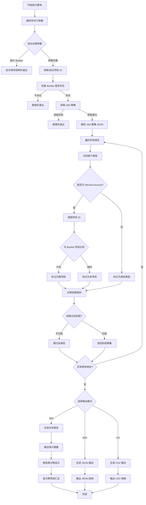

# GCS Bucket IAM 绑定验证脚本

## 问题分析

需要创建一个脚本来验证 GCS Bucket 的所有 IAM 绑定，特别是识别跨项目账户，并清晰展示各账户的读写权限。

## 解决方案

### Shell 脚本实现

```bash
#!/bin/bash

# GCS Bucket IAM 绑定验证脚本
# 用途: 验证 Bucket 所有 IAM 绑定并识别跨项目账户

set -euo pipefail

# 颜色定义
RED='\033[0;31m'
GREEN='\033[0;32m'
YELLOW='\033[1;33m'
BLUE='\033[0;34m'
CYAN='\033[0;36m'
MAGENTA='\033[0;35m'
NC='\033[0m' # No Color

# 日志函数
log_info() {
    echo -e "${GREEN}[INFO]${NC} $1"
}

log_warn() {
    echo -e "${YELLOW}[WARN]${NC} $1"
}

log_error() {
    echo -e "${RED}[ERROR]${NC} $1"
}

log_section() {
    echo -e "\n${CYAN}=== $1 ===${NC}"
}

# 显示使用说明
usage() {
    cat << EOF
使用方法: $0 [选项]

选项:
    -b, --bucket BUCKET_NAME        GCS Bucket 名称 (必需)
    -p, --project PROJECT_ID        Bucket 所在项目 ID (可选，用于识别跨项目账户)
    -o, --output FORMAT             输出格式: text|json|csv (默认: text)
    -f, --filter PERMISSION         过滤特定权限: read|write|admin|all (默认: all)
    -v, --verbose                   详细输出模式
    -h, --help                      显示此帮助信息

示例:
    # 基本使用
    $0 -b gs://ab-env-region-api

    # 指定项目 ID 以识别跨项目账户
    $0 -b gs://ab-env-region-api -p my-project-id

    # 只显示有写入权限的账户
    $0 -b gs://ab-env-region-api -f write

    # 输出为 JSON 格式
    $0 -b gs://ab-env-region-api -o json

    # 输出为 CSV 格式
    $0 -b gs://ab-env-region-api -o csv > iam-report.csv

权限过滤说明:
    read  - 只显示有读取权限的账户
    write - 只显示有写入权限的账户
    admin - 只显示有管理员权限的账户
    all   - 显示所有权限 (默认)
EOF
    exit 1
}

# 参数解析
BUCKET=""
PROJECT_ID=""
OUTPUT_FORMAT="text"
PERMISSION_FILTER="all"
VERBOSE=false

while [[ $# -gt 0 ]]; do
    case $1 in
        -b|--bucket)
            BUCKET="$2"
            shift 2
            ;;
        -p|--project)
            PROJECT_ID="$2"
            shift 2
            ;;
        -o|--output)
            OUTPUT_FORMAT="$2"
            shift 2
            ;;
        -f|--filter)
            PERMISSION_FILTER="$2"
            shift 2
            ;;
        -v|--verbose)
            VERBOSE=true
            shift
            ;;
        -h|--help)
            usage
            ;;
        *)
            log_error "未知参数: $1"
            usage
            ;;
    esac
done

# 验证必需参数
if [[ -z "$BUCKET" ]]; then
    log_error "缺少必需参数: -b/--bucket"
    usage
fi

# 处理 bucket 名称
BUCKET="${BUCKET#gs://}"
BUCKET="${BUCKET#gsutil://}"

# 获取当前项目
if [[ -z "$PROJECT_ID" ]]; then
    PROJECT_ID=$(gcloud config get-value project 2>/dev/null || echo "")
    if [[ -n "$PROJECT_ID" ]]; then
        log_info "使用当前项目 ID: $PROJECT_ID"
    else
        log_warn "未指定项目 ID，将无法准确识别跨项目账户"
    fi
fi

# 临时文件
TEMP_IAM_FILE=$(mktemp)
trap "rm -f $TEMP_IAM_FILE" EXIT

# 权限分类定义
declare -A PERMISSION_CATEGORIES
PERMISSION_CATEGORIES=(
    # 读取权限
    ["roles/storage.objectViewer"]="read"
    ["roles/storage.legacyBucketReader"]="read"
    ["roles/storage.legacyObjectReader"]="read"
    
    # 写入权限
    ["roles/storage.objectCreator"]="write"
    ["roles/storage.legacyBucketWriter"]="write"
    ["roles/storage.objectUser"]="write"
    
    # 管理权限
    ["roles/storage.objectAdmin"]="admin"
    ["roles/storage.legacyBucketOwner"]="admin"
    ["roles/storage.admin"]="admin"
)

# 权限说明
declare -A PERMISSION_DESCRIPTIONS
PERMISSION_DESCRIPTIONS=(
    ["roles/storage.objectViewer"]="对象查看 (只读)"
    ["roles/storage.legacyBucketReader"]="Bucket 读取"
    ["roles/storage.legacyObjectReader"]="对象读取 (遗留)"
    ["roles/storage.objectCreator"]="对象创建"
    ["roles/storage.legacyBucketWriter"]="Bucket 写入"
    ["roles/storage.objectUser"]="对象读写"
    ["roles/storage.objectAdmin"]="对象管理员"
    ["roles/storage.legacyBucketOwner"]="Bucket 所有者"
    ["roles/storage.admin"]="存储管理员"
)

# 检查 bucket 是否存在
check_bucket() {
    log_info "检查 Bucket: gs://$BUCKET"
    
    if ! gsutil ls -b "gs://$BUCKET" > /dev/null 2>&1; then
        log_error "Bucket 不存在或无访问权限: gs://$BUCKET"
        exit 1
    fi
    
    # 获取 bucket 详细信息
    if [[ "$VERBOSE" == "true" ]]; then
        BUCKET_LOCATION=$(gsutil ls -L -b "gs://$BUCKET" 2>/dev/null | grep "Location constraint" | awk '{print $3}')
        BUCKET_PROJECT=$(gsutil ls -L -b "gs://$BUCKET" 2>/dev/null | grep "Project number" | awk '{print $3}')
        log_info "✓ Bucket 位置: $BUCKET_LOCATION"
        log_info "✓ Bucket 项目编号: $BUCKET_PROJECT"
    else
        log_info "✓ Bucket 存在"
    fi
}

# 获取 IAM 策略
get_iam_policy() {
    log_info "获取 IAM 策略..."
    
    if ! gsutil iam get "gs://$BUCKET" > "$TEMP_IAM_FILE" 2>/dev/null; then
        log_error "无法获取 IAM 策略"
        exit 1
    fi
    
    log_info "✓ IAM 策略已获取"
}

# 判断账户类型
get_account_type() {
    local member="$1"
    local account_project=""
    
    case "$member" in
        user:*)
            echo "用户账户"
            ;;
        serviceAccount:*)
            local sa_email="${member#serviceAccount:}"
            # 提取项目 ID (格式: sa-name@project-id.iam.gserviceaccount.com)
            if [[ "$sa_email" =~ @([^.]+)\. ]]; then
                account_project="${BASH_REMATCH[1]}"
                if [[ -n "$PROJECT_ID" ]] && [[ "$account_project" != "$PROJECT_ID" ]]; then
                    echo "Service Account (跨项目: $account_project)"
                else
                    echo "Service Account (本项目)"
                fi
            else
                echo "Service Account"
            fi
            ;;
        group:*)
            echo "群组"
            ;;
        domain:*)
            echo "域"
            ;;
        allUsers)
            echo "所有用户 (公开)"
            ;;
        allAuthenticatedUsers)
            echo "所有认证用户"
            ;;
        *)
            echo "其他"
            ;;
    esac
}

# 获取权限类别
get_permission_category() {
    local role="$1"
    echo "${PERMISSION_CATEGORIES[$role]:-other}"
}

# 获取权限说明
get_permission_description() {
    local role="$1"
    echo "${PERMISSION_DESCRIPTIONS[$role]:-$role}"
}

# 解析 IAM 策略
parse_iam_policy() {
    local json_content=$(cat "$TEMP_IAM_FILE")
    
    # 使用 Python 解析 JSON (如果可用)
    if command -v python3 &> /dev/null; then
        python3 << 'EOF' "$json_content" "$PROJECT_ID" "$PERMISSION_FILTER"
import json
import sys

json_content = sys.argv[1]
project_id = sys.argv[2]
permission_filter = sys.argv[3]

data = json.loads(json_content)
bindings = data.get('bindings', [])

# 权限分类
permission_map = {
    'roles/storage.objectViewer': 'read',
    'roles/storage.legacyBucketReader': 'read',
    'roles/storage.legacyObjectReader': 'read',
    'roles/storage.objectCreator': 'write',
    'roles/storage.legacyBucketWriter': 'write',
    'roles/storage.objectUser': 'write',
    'roles/storage.objectAdmin': 'admin',
    'roles/storage.legacyBucketOwner': 'admin',
    'roles/storage.admin': 'admin',
}

# 收集所有绑定
results = []
for binding in bindings:
    role = binding.get('role', '')
    members = binding.get('members', [])
    
    category = permission_map.get(role, 'other')
    
    # 过滤权限
    if permission_filter != 'all' and category != permission_filter:
        continue
    
    for member in members:
        # 判断是否跨项目
        is_cross_project = False
        member_project = ''
        
        if member.startswith('serviceAccount:'):
            sa_email = member.split(':', 1)[1]
            if '@' in sa_email and '.iam.gserviceaccount.com' in sa_email:
                member_project = sa_email.split('@')[1].split('.')[0]
                if project_id and member_project != project_id:
                    is_cross_project = True
        
        results.append({
            'member': member,
            'role': role,
            'category': category,
            'is_cross_project': is_cross_project,
            'member_project': member_project
        })

# 输出为分隔符格式，便于 bash 处理
for result in results:
    print(f"{result['member']}|{result['role']}|{result['category']}|{result['is_cross_project']}|{result['member_project']}")
EOF
    else
        # 如果没有 Python，使用 jq
        if command -v jq &> /dev/null; then
            jq -r '.bindings[] | .role as $role | .members[] | "\(.)|\($role)"' "$TEMP_IAM_FILE" | while IFS='|' read -r member role; do
                category=$(get_permission_category "$role")
                if [[ "$PERMISSION_FILTER" != "all" ]] && [[ "$category" != "$PERMISSION_FILTER" ]]; then
                    continue
                fi
                
                is_cross_project="false"
                member_project=""
                if [[ "$member" =~ serviceAccount:(.+)@([^.]+)\. ]]; then
                    member_project="${BASH_REMATCH[2]}"
                    if [[ -n "$PROJECT_ID" ]] && [[ "$member_project" != "$PROJECT_ID" ]]; then
                        is_cross_project="true"
                    fi
                fi
                
                echo "$member|$role|$category|$is_cross_project|$member_project"
            done
        else
            log_error "需要安装 python3 或 jq 来解析 JSON"
            exit 1
        fi
    fi
}

# 文本格式输出
output_text() {
    log_section "Bucket IAM 绑定分析报告"
    
    echo -e "${BLUE}Bucket:${NC} gs://$BUCKET"
    if [[ -n "$PROJECT_ID" ]]; then
        echo -e "${BLUE}项目 ID:${NC} $PROJECT_ID"
    fi
    echo -e "${BLUE}分析时间:${NC} $(date '+%Y-%m-%d %H:%M:%S')"
    
    # 统计信息
    local total_bindings=$(parse_iam_policy | wc -l)
    local cross_project_count=$(parse_iam_policy | grep "|true|" | wc -l)
    local read_count=$(parse_iam_policy | grep "|read|" | wc -l)
    local write_count=$(parse_iam_policy | grep "|write|" | wc -l)
    local admin_count=$(parse_iam_policy | grep "|admin|" | wc -l)
    
    log_section "统计摘要"
    echo -e "${GREEN}总绑定数:${NC} $total_bindings"
    echo -e "${YELLOW}跨项目账户:${NC} $cross_project_count"
    echo -e "${CYAN}读取权限:${NC} $read_count"
    echo -e "${CYAN}写入权限:${NC} $write_count"
    echo -e "${MAGENTA}管理权限:${NC} $admin_count"
    
    # 按权限类别分组显示
    log_section "详细权限清单"
    
    # 读取权限
    if [[ "$PERMISSION_FILTER" == "all" ]] || [[ "$PERMISSION_FILTER" == "read" ]]; then
        echo -e "\n${CYAN}【读取权限】${NC}"
        parse_iam_policy | grep "|read|" | while IFS='|' read -r member role category is_cross member_project; do
            local account_type=$(get_account_type "$member")
            local perm_desc=$(get_permission_description "$role")
            
            if [[ "$is_cross" == "true" ]]; then
                echo -e "  ${YELLOW}[跨项目]${NC} $member"
                echo -e "    └─ 类型: $account_type"
                echo -e "    └─ 角色: $perm_desc"
                echo -e "    └─ 来源项目: $member_project"
            else
                echo -e "  $member"
                echo -e "    └─ 类型: $account_type"
                echo -e "    └─ 角色: $perm_desc"
            fi
            echo ""
        done
    fi
    
    # 写入权限
    if [[ "$PERMISSION_FILTER" == "all" ]] || [[ "$PERMISSION_FILTER" == "write" ]]; then
        echo -e "\n${GREEN}【写入权限】${NC}"
        parse_iam_policy | grep "|write|" | while IFS='|' read -r member role category is_cross member_project; do
            local account_type=$(get_account_type "$member")
            local perm_desc=$(get_permission_description "$role")
            
            if [[ "$is_cross" == "true" ]]; then
                echo -e "  ${YELLOW}[跨项目]${NC} $member"
                echo -e "    └─ 类型: $account_type"
                echo -e "    └─ 角色: $perm_desc"
                echo -e "    └─ 来源项目: $member_project"
            else
                echo -e "  $member"
                echo -e "    └─ 类型: $account_type"
                echo -e "    └─ 角色: $perm_desc"
            fi
            echo ""
        done
    fi
    
    # 管理权限
    if [[ "$PERMISSION_FILTER" == "all" ]] || [[ "$PERMISSION_FILTER" == "admin" ]]; then
        echo -e "\n${MAGENTA}【管理权限】${NC}"
        parse_iam_policy | grep "|admin|" | while IFS='|' read -r member role category is_cross member_project; do
            local account_type=$(get_account_type "$member")
            local perm_desc=$(get_permission_description "$role")
            
            if [[ "$is_cross" == "true" ]]; then
                echo -e "  ${YELLOW}[跨项目]${NC} $member"
                echo -e "    └─ 类型: $account_type"
                echo -e "    └─ 角色: $perm_desc"
                echo -e "    └─ 来源项目: $member_project"
            else
                echo -e "  $member"
                echo -e "    └─ 类型: $account_type"
                echo -e "    └─ 角色: $perm_desc"
            fi
            echo ""
        done
    fi
    
    # 其他权限
    if [[ "$PERMISSION_FILTER" == "all" ]]; then
        local other_count=$(parse_iam_policy | grep "|other|" | wc -l)
        if [[ $other_count -gt 0 ]]; then
            echo -e "\n${BLUE}【其他权限】${NC}"
            parse_iam_policy | grep "|other|" | while IFS='|' read -r member role category is_cross member_project; do
                local account_type=$(get_account_type "$member")
                
                if [[ "$is_cross" == "true" ]]; then
                    echo -e "  ${YELLOW}[跨项目]${NC} $member"
                    echo -e "    └─ 类型: $account_type"
                    echo -e "    └─ 角色: $role"
                    echo -e "    └─ 来源项目: $member_project"
                else
                    echo -e "  $member"
                    echo -e "    └─ 类型: $account_type"
                    echo -e "    └─ 角色: $role"
                fi
                echo ""
            done
        fi
    fi
    
    # 跨项目账户汇总
    if [[ $cross_project_count -gt 0 ]]; then
        log_section "跨项目账户汇总"
        parse_iam_policy | grep "|true|" | while IFS='|' read -r member role category is_cross member_project; do
            local perm_desc=$(get_permission_description "$role")
            echo -e "  ${YELLOW}$member${NC}"
            echo -e "    └─ 来源项目: $member_project"
            echo -e "    └─ 权限类型: $category"
            echo -e "    └─ 角色: $perm_desc"
            echo ""
        done
    fi
}

# JSON 格式输出
output_json() {
    cat << EOF
{
  "bucket": "gs://$BUCKET",
  "project_id": "$PROJECT_ID",
  "scan_time": "$(date -u '+%Y-%m-%dT%H:%M:%SZ')",
  "bindings": [
EOF
    
    local first=true
    parse_iam_policy | while IFS='|' read -r member role category is_cross member_project; do
        if [[ "$first" == "true" ]]; then
            first=false
        else
            echo ","
        fi
        
        local account_type=$(get_account_type "$member")
        local perm_desc=$(get_permission_description "$role")
        
        cat << EOF
    {
      "member": "$member",
      "role": "$role",
      "permission_category": "$category",
      "permission_description": "$perm_desc",
      "account_type": "$account_type",
      "is_cross_project": $is_cross,
      "source_project": "$member_project"
    }
EOF
    done
    
    echo ""
    echo "  ]"
    echo "}"
}

# CSV 格式输出
output_csv() {
    echo "Member,Role,Permission Category,Permission Description,Account Type,Is Cross Project,Source Project"
    
    parse_iam_policy | while IFS='|' read -r member role category is_cross member_project; do
        local account_type=$(get_account_type "$member")
        local perm_desc=$(get_permission_description "$role")
        
        echo "\"$member\",\"$role\",\"$category\",\"$perm_desc\",\"$account_type\",\"$is_cross\",\"$member_project\""
    done
}

# 主流程
main() {
    # 执行检查
    check_bucket
    get_iam_policy
    
    # 根据输出格式输出结果
    case "$OUTPUT_FORMAT" in
        text)
            output_text
            ;;
        json)
            output_json
            ;;
        csv)
            output_csv
            ;;
        *)
            log_error "不支持的输出格式: $OUTPUT_FORMAT"
            exit 1
            ;;
    esac
}

# 执行主流程
main
```

## 使用说明

### 1. 脚本权限设置

```bash
# 保存脚本
cat > verify-iam.sh << 'EOF'
# ... (将上面的脚本内容粘贴到这里)
EOF

# 添加执行权限
chmod +x verify-iam.sh
```

### 2. 基本使用示例

```bash
# 最简单使用 - 查看所有权限
./verify-iam.sh -b gs://ab-env-region-api

# 指定项目 ID - 准确识别跨项目账户
./verify-iam.sh -b gs://ab-env-region-api -p my-project-id

# 只查看有读取权限的账户
./verify-iam.sh -b gs://ab-env-region-api -f read

# 只查看有写入权限的账户
./verify-iam.sh -b gs://ab-env-region-api -f write

# 只查看管理员权限
./verify-iam.sh -b gs://ab-env-region-api -f admin

# 详细输出模式
./verify-iam.sh -b gs://ab-env-region-api -v

# 输出为 JSON 格式
./verify-iam.sh -b gs://ab-env-region-api -o json

# 输出为 CSV 并保存到文件
./verify-iam.sh -b gs://ab-env-region-api -o csv > iam-report.csv
```

### 3. 高级使用场景

```bash
# 查找所有跨项目的 Service Account
./verify-iam.sh -b gs://ab-env-region-api -p my-project-id -o json | \
  jq '.bindings[] | select(.is_cross_project == true)'

# 生成权限审计报告
./verify-iam.sh -b gs://ab-env-region-api -o csv > audit-report-$(date +%Y%m%d).csv

# 批量检查多个 bucket
for bucket in bucket1 bucket2 bucket3; do
  echo "=== Checking $bucket ==="
  ./verify-iam.sh -b gs://$bucket -p my-project-id
done
```

## 输出示例

### 文本格式输出示例

```
[INFO] 检查 Bucket: gs://ab-env-region-api
[INFO] ✓ Bucket 存在
[INFO] 获取 IAM 策略...
[INFO] ✓ IAM 策略已获取

=== Bucket IAM 绑定分析报告 ===
Bucket: gs://ab-env-region-api
项目 ID: my-project-id
分析时间: 2025-12-30 10:30:00

=== 统计摘要 ===
总绑定数: 8
跨项目账户: 2
读取权限: 3
写入权限: 2
管理权限: 3

=== 详细权限清单 ===

【读取权限】
  [跨项目] serviceAccount:reader-sa@other-project.iam.gserviceaccount.com
    └─ 类型: Service Account (跨项目: other-project)
    └─ 角色: 对象查看 (只读)
    └─ 来源项目: other-project

  serviceAccount:internal-reader@my-project-id.iam.gserviceaccount.com
    └─ 类型: Service Account (本项目)
    └─ 角色: Bucket 读取

【写入权限】
  [跨项目] serviceAccount:writer-sa@another-project.iam.gserviceaccount.com
    └─ 类型: Service Account (跨项目: another-project)
    └─ 角色: 对象创建
    └─ 来源项目: another-project

【管理权限】
  serviceAccount:admin-sa@my-project-id.iam.gserviceaccount.com
    └─ 类型: Service Account (本项目)
    └─ 角色: Bucket 所有者

=== 跨项目账户汇总 ===
  serviceAccount:reader-sa@other-project.iam.gserviceaccount.com
    └─ 来源项目: other-project
    └─ 权限类型: read
    └─ 角色: 对象查看 (只读)

  serviceAccount:writer-sa@another-project.iam.gserviceaccount.com
    └─ 来源项目: another-project
    └─ 权限类型: write
    └─ 角色: 对象创建
```

### JSON 格式输出示例

```json
{
  "bucket": "gs://ab-env-region-api",
  "project_id": "my-project-id",
  "scan_time": "2025-12-30T02:30:00Z",
  "bindings": [
    {
      "member": "serviceAccount:reader-sa@other-project.iam.gserviceaccount.com",
      "role": "roles/storage.objectViewer",
      "permission_category": "read",
      "permission_description": "对象查看 (只读)",
      "account_type": "Service Account (跨项目: other-project)",
      "is_cross_project": true,
      "source_project": "other-project"
    },
    {
      "member": "serviceAccount:internal-reader@my-project-id.iam.gserviceaccount.com",
      "role": "roles/storage.legacyBucketReader",
      "permission_category": "read",
      "permission_description": "Bucket 读取",
      "account_type": "Service Account (本项目)",
      "is_cross_project": false,
      "source_project": "my-project-id"
    }
  ]
}
```

### CSV 格式输出示例

```csv
Member,Role,Permission Category,Permission Description,Account Type,Is Cross Project,Source Project
"serviceAccount:reader-sa@other-project.iam.gserviceaccount.com","roles/storage.objectViewer","read","对象查看 (只读)","Service Account (跨项目: other-project)","true","other-project"
"serviceAccount:internal-reader@my-project-id.iam.gserviceaccount.com","roles/storage.legacyBucketReader","read","Bucket 读取","Service Account (本项目)","false","my-project-id"
```

## 执行流程图



## 权限分类说明

### 读取权限 (read)

| 角色 | 说明 | 典型用途 |
|------|------|----------|
| `roles/storage.objectViewer` | 查看对象内容和元数据 | 应用读取配置文件 |
| `roles/storage.legacyBucketReader` | Bucket 级别读取权限 | 列出和读取所有对象 |
| `roles/storage.legacyObjectReader` | 对象读取 (遗留) | 兼容旧版应用 |

### 写入权限 (write)

| 角色 | 说明 | 典型用途 |
|------|------|----------|
| `roles/storage.objectCreator` | 创建新对象 | 应用上传文件 |
| `roles/storage.legacyBucketWriter` | Bucket 级别写入权限 | 完整读写访问 |
| `roles/storage.objectUser` | 读取和写入对象 | 应用完整操作 |

### 管理权限 (admin)

| 角色 | 说明 | 典型用途 |
|------|------|----------|
| `roles/storage.objectAdmin` | 完全控制对象 | 对象管理和 ACL 设置 |
| `roles/storage.legacyBucketOwner` | Bucket 所有者 | 完整 Bucket 管理 |
| `roles/storage.admin` | 存储管理员 | 项目级存储管理 |

## 脚本特性

### 核心功能

1. **完整 IAM 绑定列表**
   - 获取所有 IAM 策略绑定
   - 解析并分类所有成员

2. **跨项目识别**
   - 自动识别跨项目 Service Account
   - 显示来源项目 ID
   - 高亮显示跨项目账户

3. **权限分类**
   - 读取权限 (read)
   - 写入权限 (write)
   - 管理权限 (admin)
   - 其他权限 (other)

4. **多格式输出**
   - Text: 易读的文本报告
   - JSON: 结构化数据导出
   - CSV: Excel 兼容格式

5. **灵活过滤**
   - 按权限类型过滤
   - 只显示跨项目账户
   - 自定义输出内容

### 依赖要求

脚本需要以下工具之一:

```bash
# 推荐: Python 3 (最佳 JSON 解析)
python3 --version

# 或者: jq (JSON 命令行工具)
jq --version

# 必需: gcloud 和 gsutil
gcloud version
gsutil version
```

## 实用场景

### 1. 安全审计

```bash
# 生成完整审计报告
./verify-iam.sh -b gs://production-data -p prod-project -o csv > security-audit.csv

# 检查是否有公开访问
./verify-iam.sh -b gs://public-bucket -o json | \
  jq '.bindings[] | select(.member == "allUsers" or .member == "allAuthenticatedUsers")'
```

### 2. 跨项目访问检查

```bash
# 查找所有跨项目访问
./verify-iam.sh -b gs://shared-bucket -p my-project -o json | \
  jq '[.bindings[] | select(.is_cross_project == true)]'

# 统计跨项目账户数量
./verify-iam.sh -b gs://shared-bucket -p my-project -o json | \
  jq '[.bindings[] | select(.is_cross_project == true)] | length'
```

### 3. 权限清理准备

```bash
# 列出所有有写入权限的账户
./verify-iam.sh -b gs://data-bucket -f write -o csv

# 识别不需要的权限
./verify-iam.sh -b gs://legacy-bucket -p current-project -o json | \
  jq '.bindings[] | select(.is_cross_project == true and .permission_category == "admin")'
```

### 4. 合规性检查

```bash
# 生成月度权限报告
REPORT_DATE=$(date +%Y%m)
for bucket in $(gsutil ls | grep gs://); do
  echo "Scanning $bucket..." >&2
  ./verify-iam.sh -b "$bucket" -o csv >> compliance-report-$REPORT_DATE.csv
done
```

## 注意事项

### 权限要求

执行此脚本需要以下权限:

```bash
# 最小权限
roles/storage.admin
# 或
roles/storage.legacyBucketOwner

# 查看权限
gcloud projects get-iam-policy PROJECT_ID \
  --flatten="bindings[].members" \
  --filter="bindings.members:$(gcloud config get-value account)"
```

### 最佳实践

1. **定期审计**
   ```bash
   # 设置定期任务
   0 0 1 * * /path/to/verify-iam.sh -b gs://critical-bucket -o csv > /backup/iam-$(date +\%Y\%m\%d).csv
   ```

2. **版本控制**
   ```bash
   # 跟踪权限变化
   git add iam-reports/
   git commit -m "IAM audit: $(date +%Y-%m-%d)"
   ```

3. **权限最小化验证**
   ```bash
   # 检查是否有过度授权
   ./verify-iam.sh -b gs://sensitive-data -f admin
   ```

### 故障排查

1. **无法获取 IAM 策略**
   ```bash
   # 检查权限
   gsutil iam get gs://BUCKET_NAME
   
   # 检查 bucket 存在性
   gsutil ls -b gs://BUCKET_NAME
   ```

2. **跨项目识别不准确**
   ```bash
   # 确保指定正确的项目 ID
   ./verify-iam.sh -b gs://bucket -p correct-project-id -v
   ```

3. **JSON 解析失败**
   ```bash
   # 安装 Python 3
   sudo apt-get install python3
   
   # 或安装 jq
   sudo apt-get install jq
   ```

## 扩展功能

### 添加告警功能

```bash
# 检查公开访问并发送告警
if ./verify-iam.sh -b gs://private-bucket -o json | jq -e '.bindings[] | select(.member == "allUsers")' > /dev/null; then
  echo "WARNING: Bucket has public access!" | mail -s "Security Alert" admin@example.com
fi
```

### 集成到 CI/CD

```bash
# 在部署前验证权限
./verify-iam.sh -b gs://deployment-bucket -p prod-project -o json > /tmp/iam-check.json

# 检查是否有未授权的跨项目访问
if jq -e '[.bindings[] | select(.is_cross_project == true and .source_project != "approved-project")] | length > 0' /tmp/iam-check.json; then
  echo "ERROR: Unauthorized cross-project access detected"
  exit 1
fi
```

---

此脚本提供了全面的 GCS Bucket IAM 绑定验证功能，特别适合跨项目权限管理和安全审计场景。
    