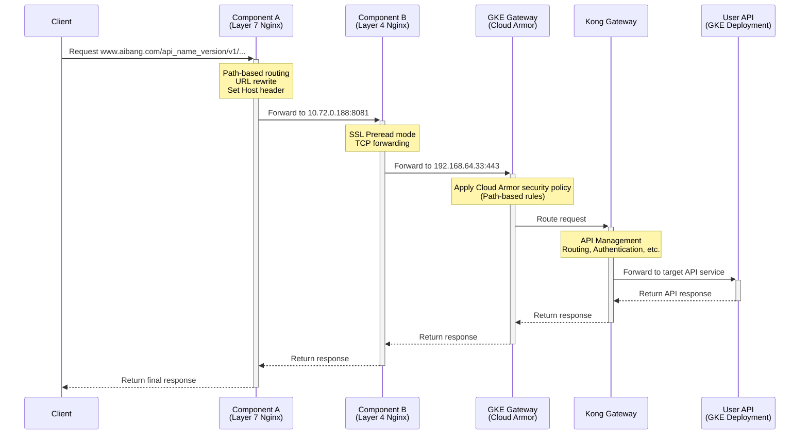
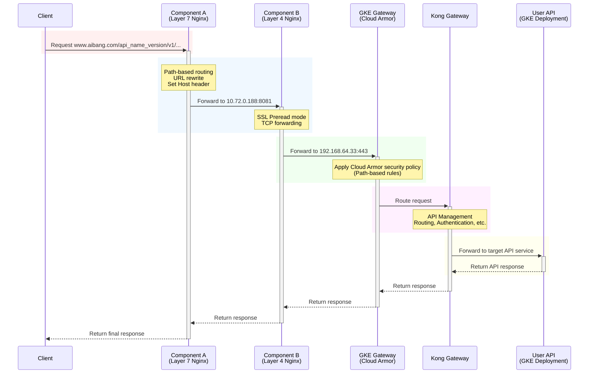

- [summary](#summary)
  - [基于 Cloud Armor 自身的功能，配置路径匹配的规则 (强烈推荐)](#基于-cloud-armor-自身的功能配置路径匹配的规则-强烈推荐)
- [Chatgpt](#chatgpt)
- [Grok](#grok)
    - [方案 1：使用Cloud Armor的路径匹配规则](#方案-1使用cloud-armor的路径匹配规则)
      - [实现步骤](#实现步骤)
      - [配置示例](#配置示例)
      - [优点](#优点)
      - [注意事项](#注意事项)
      - [Using this one](#using-this-one)
    - [方案 2：为不同API路径配置多个Gateway或Service](#方案-2为不同api路径配置多个gateway或service)
      - [实现步骤](#实现步骤-1)
      - [配置示例](#配置示例-1)
      - [优点](#优点-1)
      - [注意事项](#注意事项-1)
    - [方案 3：在Nginx层面添加头部标记](#方案-3在nginx层面添加头部标记)
      - [实现步骤](#实现步骤-2)
      - [配置示例](#配置示例-2)
      - [优点](#优点-2)
      - [注意事项](#注意事项-2)
    - [方案 4：利用Kong Gateway的插件](#方案-4利用kong-gateway的插件)
      - [实现步骤](#实现步骤-3)
      - [配置示例](#配置示例-3)
      - [优点](#优点-3)
      - [注意事项](#注意事项-3)
    - [总结与建议](#总结与建议)
- [Gemini](#gemini)


# summary
- [针对匹配路径的请求启用安全防护，确保这些API受到保护](#方案-1使用cloud-armor的路径匹配规则)
- [在nginx层面添加头部标记](#方案3在nginx层面添加头部标记)
- [cloud-armor-path.md](./cloud-armor-path.md)

基于 Cloud Armor 自身的功能，配置路径匹配的规则 (强烈推荐)
---

---

# Chatgpt 

你的问题是 Cloud Armor 绑定在 GKE Gateway 上，但你只希望 部分 API 受 Cloud Armor 规则保护，而不是所有 API。
目前 Cloud Armor 是应用在整个 Gateway 上的，所以所有流量都会受到 example-security-policy 规则的影响。

⸻

可能的解决方向

| 方案                                                 | 描述                                                                                                                               | 优势                                                   | 潜在问题                                                |
| ---------------------------------------------------- | ---------------------------------------------------------------------------------------------------------------------------------- | ------------------------------------------------------ | ------------------------------------------------------- |
| 方案1：在 Cloud Armor 规则内基于 Path 进行匹配       | 在 example-security-policy 规则中，使用基于 Path 的规则来区分哪些 API 受保护，哪些不受保护。                                       | 不需要改 GKE Gateway 配置，只需调整 Cloud Armor 规则。 | 可能增加 Cloud Armor 规则复杂性，路径匹配管理难度提升。 |
| 方案2：拆分 GKE Gateway，创建多个 Gateway            | 创建两个 Gateway，一个专门用于受 Cloud Armor 保护的 API，另一个用于普通 API。                                                      | 逻辑清晰，不影响不需要保护的 API。                     | 需要额外的 Gateway 资源和外部负载均衡配置。             |
| 方案3：基于 Kong 实现 Cloud Armor 规则分流           | 在 Kong 内部匹配 API Path，对需要保护的 API 进行二次转发到 Gateway（绑定 Cloud Armor），而其他 API 走不带 Cloud Armor 的 Gateway。 | 细粒度控制 API 访问，避免影响无关 API。                | Kong 需要额外的路由配置，可能影响性能。                 |
| 方案4：使用 BackendConfig 配置不同的 Security Policy | 如果你的 GKE 版本支持 BackendConfig，可以在不同的 Service 级别配置 Cloud Armor（但 Gateway 可能受限）。                            | 可以针对不同 Service 配置不同的 Security Policy。      | GKE Gateway 可能不支持，可能需要额外的 Ingress 资源。   |

---
推荐策略
-	1.	优先方案：方案1 —— 修改 Cloud Armor 规则，基于 Path 区分 API
    •	你可以在 example-security-policy 中 添加基于 Path 的规则，只对 /api_name_version1/v1/ 生效，而其他 API 放行。
    •	例如：
      ```bash
      expression = "request.path.matches('/api_name_version1/v1/.*')"
      action = "DENY"
      ```
    •	这样，你可以精确控制哪些 API 受到 Cloud Armor 保护。
-	2.	如果方案1无法满足，可以考虑 方案2（拆分 Gateway），将需要保护的 API 放在一个专门的 Gateway 上，并绑定 Cloud Armor，而其他 API 继续使用原 Gateway。
-	3.	如果你有 Kong Gateway 扩展能力，可以考虑 方案3（在 Kong 进行 API 分流），但这增加了 Kong 的负担。

⸻

下一步建议
	•	先测试 Cloud Armor 的 Path 规则，看是否能满足需求。
	•	如果不行，再考虑拆分 Gateway 或 Kong 代理分流。
	•	检查 GKE Gateway 是否支持 BackendConfig，可能提供更精细的 Security Policy 绑定能力。

你可以先测试方案1，看 Cloud Armor 是否可以精准匹配 Path，并确认规则是否会误伤其他 API 🚀

# Grok
GCP Cloud Armor 配置
### 方案 1：使用Cloud Armor的路径匹配规则

Cloud Armor支持基于请求路径的规则配置。你可以在安全策略中定义特定的路径匹配条件，只对某些API路径应用安全规则，而其他路径则不应用或应用不同的策略。

#### 实现步骤
1. 登录Google Cloud Console，进入Cloud Armor配置页面。
2. 编辑现有的安全策略（`example-security-policy`），或创建一个新的安全策略。
3. 添加基于路径的规则，例如：
   - **条件**：`request.path.matches("/api_name_version1/v1/*")`
   - **动作**：应用特定的安全措施（如阻止恶意IP、限制速率等）。
4. 为其他路径设置一个默认规则，例如：
   - **条件**：无（默认规则）。
   - **动作**：允许通过，或应用宽松的策略。
5. 将这个安全策略绑定到GKE Gateway的`GCPBackendPolicy`中。

#### 配置示例
```yaml
apiVersion: networking.gke.io/v1
kind: GCPBackendPolicy
metadata:
  name: my-backend-policy
  namespace: lb-service-namespace
spec:
  default:
    securityPolicy: example-security-policy
  targetRef:
    group: ""
    kind: Service
    name: lb-service
```

在Cloud Armor的安全策略中：
- 规则1：`request.path.matches("/api_name_version1/v1/*")` → 应用严格防护。
- 默认规则：不匹配特定路径的流量 → 允许通过。

#### 优点
- 配置简单，直接在Cloud Armor中实现，不需要修改Nginx或GKE Gateway的架构。
- 充分利用Cloud Armor的现有功能，管理集中。

#### 注意事项
- 确保路径匹配规则准确，避免误拦截或放行流量。
- 测试规则时，建议从小范围开始，逐步扩展到生产环境。


#### Using this one 
```bash
# GCP Cloud Armor 配置 方案
希望通过Cloud Armor的安全策略实现以下目标：
- 对特定的API路径（例如 `/api_name_version1/v1/*`）应用严格的防护措施。
- 对其他API路径不施加任何限制，或者允许其正常通过。

你提到的Cloud Armor配置方案完全可以满足这个需求。具体来说：

#### Cloud Armor安全策略的配置
1. **规则1**：  
   - 条件：`request.path.matches("/api_name_version1/v1/*")`  
   - 动作：应用严格的防护措施，例如阻止恶意IP、限制请求速率等。  
   - 作用：这条规则会针对匹配路径 `/api_name_version1/v1/*` 的请求启用安全防护，确保这些API受到保护。

2. **默认规则**：  
   - 条件：不匹配特定路径的流量（即除规则1外的所有请求）。  
   - 动作：允许流量通过，不施加任何限制。  
   - 作用：对于其他API路径（例如 `/api_name_version2/v1/*` 或其他无关路径），流量将不受Cloud Armor的严格规则影响，可以正常访问。

#### 方案的优点
这个配置方式有以下几个显著优势：
- **配置简单**：  
  你无需修改现有的Nginx或GKE Gateway架构，只需要在Cloud Armor的管理界面中直接设置基于路径的规则即可。这种方式非常直观且易于实现。
- **管理集中**：  
  所有的安全策略都在Cloud Armor中统一配置和维护，避免了分散在多个系统中的复杂性，方便后续调整或扩展。
- **充分利用Cloud Armor功能**：  
  Cloud Armor本身就支持基于请求路径的规则匹配，这正是你需要的功能。无需额外工具或复杂 workaround，就能实现目标。

#### 你的理解
你提到：“其实就是我仅仅给我需要配置的API设置了对应的Cloud Armor规则，其他规则不受任何限制，这样就满足我的要求了。”  
完全正确！通过上述配置，你可以精准地为特定API路径（例如 `/api_name_version1/v1/*`）应用Cloud Armor的安全规则，而其他路径则保持不受影响。这种方式既满足了你的防护需求，又保持了系统的灵活性和简洁性。

### 总结
这个方案是一个高效、直接的解决方案，能够快速实现你的目标：
- 对特定API路径应用严格防护。
- 对其他路径不施加限制或应用不同的宽松策略。
```


---

### 方案 2：为不同API路径配置多个Gateway或Service

如果需要更细粒度的控制，可以为不同的API路径创建多个GKE Gateway或Service，然后为每个Gateway/Service绑定不同的Cloud Armor安全策略。

#### 实现步骤
1. 在GKE中为需要特殊安全策略的API路径创建一个新的Gateway或Service，例如：
   - Gateway/Service A：处理`/api_name_version1/v1/`。
   - Gateway/Service B：处理其他路径。
2. 修改A组件（7层Nginx）的配置，根据路径转发到不同的目标：
   - `/api_name_version1/v1/` → 新Gateway/Service A的地址。
   - 其他路径 → 原Gateway/Service B的地址。
3. 为每个Gateway/Service配置不同的`GCPBackendPolicy`，绑定不同的Cloud Armor安全策略：
   - Gateway A：绑定严格的`securityPolicy`。
   - Gateway B：绑定宽松的或无`securityPolicy`。

#### 配置示例
**Nginx A组件修改：**
```nginx
location /api_name_version1/v1/ {
    rewrite ^(.*)$ "https://gateway-a.example.com$1" break;
    proxy_pass https://gateway-a-ip:443/;
    proxy_set_header Host www.aibang.com;
    proxy_set_header X-Real-Ip $remote_addr;
    proxy_read_timeout 300s;
    proxy_connect_timeout 300s;
}

location /api_name2_version/v1/ {
    rewrite ^(.*)$ "https://gateway-b.example.com$1" break;
    proxy_pass https://gateway-b-ip:443/;
    proxy_set_header Host www.aibang.com;
    proxy_set_header X-Real-Ip $remote_addr;
    proxy_read_timeout 300s;
    proxy_connect_timeout 300s;
}
```

**Gateway A的GCPBackendPolicy：**
```yaml
apiVersion: networking.gke.io/v1
kind: GCPBackendPolicy
metadata:
  name: gateway-a-policy
  namespace: lb-service-namespace
spec:
  default:
    securityPolicy: strict-security-policy
  targetRef:
    group: ""
    kind: Service
    name: gateway-a-service
```

**Gateway B的GCPBackendPolicy：**
```yaml
apiVersion: networking.gke.io/v1
kind: GCPBackendPolicy
metadata:
  name: gateway-b-policy
  namespace: lb-service-namespace
spec:
  default:
    securityPolicy: none  # 或宽松策略
  targetRef:
    group: ""
    kind: Service
    name: gateway-b-service
```

#### 优点
- 灵活性高，可以为不同的API路径设置完全独立的安全策略。
- 便于管理和扩展，特别适合API路径安全需求差异较大的场景。

#### 注意事项
- 需要调整Nginx配置和GKE资源，实施复杂度稍高。
- 管理多个Gateway/Service会增加运维成本。

---

### 方案 3：在Nginx层面添加头部标记

你可以在A组件（7层Nginx）中根据API路径添加自定义头部，然后在Cloud Armor中基于这些头部应用不同的安全规则。

#### 实现步骤
1. 修改A组件的Nginx配置，为特定路径添加自定义头部：
   - 例如，为`/api_name_version1/v1/`添加`X-Security-Policy: high`。
2. 在Cloud Armor的安全策略中，添加基于头部的规则：
   - **条件**：`request.headers['X-Security-Policy'] == 'high'`
   - **动作**：应用严格防护。
   - 默认规则：无特定头部 → 允许通过。

#### 配置示例
**Nginx A组件修改：**
```nginx
location /api_name_version1/v1/ {
    rewrite ^(.*)$ "://www.aibang.com$1" break;
    proxy_pass https://10.72.0.188:8081/;
    proxy_set_header Host www.aibang.com;
    proxy_set_header X-Real-Ip $remote_addr;
    proxy_set_header X-Security-Policy "high";  # 添加自定义头部
    proxy_read_timeout 300s;
    proxy_connect_timeout 300s;
}

location /api_name2_version/v1/ {
    rewrite ^(.*)$ "://www.aibang.com$1" break;
    proxy_pass https://10.72.0.188:8081/;
    proxy_set_header Host www.aibang.com;
    proxy_set_header X-Real-Ip $remote_addr;
    proxy_read_timeout 300s;
    proxy_connect_timeout 300s;
}
```

**Cloud Armor规则：**
- 规则1：`request.headers['X-Security-Policy'] == 'high'` → 应用严格防护。
- 默认规则：无`X-Security-Policy`头部 → 允许通过。

#### 优点
- 无需修改GKE Gateway或增加资源，实施成本较低。
- 在Nginx层面控制灵活，易于调整。

#### 注意事项
- 确保头部信息在流量转发过程中不会丢失（例如被B组件或Gateway移除）。
- 需要验证Cloud Armor是否支持基于你的自定义头部进行规则匹配。

---

### 方案 4：利用Kong Gateway的插件

既然流量会经过Kong Gateway，你可以在Kong层面为不同的API路径配置路由，并使用插件实现安全策略，而不是完全依赖Cloud Armor。

#### 实现步骤
1. 在Kong Gateway中为每个API路径定义独立的路由：
   - 路由1：`/api_name_version1/v1/`。
   - 路由2：`/api_name2_version/v1/`。
2. 为需要安全策略的路由启用Kong插件，例如：
   - IP限制插件、速率限制插件等。
3. 如果Cloud Armor的部分功能无法替代，可以结合Cloud Armor和Kong插件使用。

#### 配置示例
**Kong路由配置（通过Kong Admin API）：**
```bash
curl -i -X POST http://kong-admin:8001/services \
  -d "name=api-name1-service" \
  -d "url=https://runtime-backend/api_name_version1/v1/"

curl -i -X POST http://kong-admin:8001/services/api-name1-service/routes \
  -d "paths[]=/api_name_version1/v1/"

curl -i -X POST http://kong-admin:8001/routes/<route-id>/plugins \
  -d "name=rate-limiting" \
  -d "config.minute=100"  # 示例插件配置
```

#### 优点
- Kong Gateway插件生态丰富，可以实现多种安全功能。
- 在API网关层面统一管理，逻辑清晰。

#### 注意事项
- 如果完全依赖Kong，可能需要从Cloud Armor迁移部分功能。
- 需要评估Kong插件是否能满足你的具体安全需求。

---

### 总结与建议

根据你的需求和现有架构，我建议以下选择：

- **首选方案**：**方案 1（Cloud Armor路径匹配规则）**  
  - 理由：最简单直接，利用Cloud Armor现有功能，无需修改架构，适合快速实施。
  - 起步建议：从小范围测试路径匹配规则，确保效果后再推广。

- **备选方案**：**方案 2（多个Gateway/Service）**  
  - 理由：如果路径匹配规则无法满足需求，或你需要完全隔离不同API的安全策略，可以选择此方案。
  - 注意：需要权衡实施复杂度和运维成本。

- **其他方案**：  
  - **方案 3（Nginx头部标记）**适合不愿调整GKE资源的情况，但需验证头部规则的可行性。  
  - **方案 4（Kong插件）**适合希望将安全逻辑迁移到网关层的情况，但可能增加Kong的配置工作。


# Gemini
明白了你的问题。你希望在现有的GKE Gateway + Cloud Armor架构下，实现基于API路径的精细化安全策略控制，而不是对所有通过Gateway的API都应用同一个默认的安全策略。 你目前的架构入口统一在A组件，并通过Path来区分不同的API，这是一个常见的API Gateway模式。

针对你的问题，我为你整理了几个可能的方向，并由易到难，由推荐到备选进行排序，希望能帮助你拓展思路：

**核心思路：让 Cloud Armor 的安全策略能够区分不同的API Path，并应用不同的规则。**

**方向一： 基于 Cloud Armor 自身的功能，配置路径匹配的规则 (强烈推荐)**

这是最直接且最符合 Cloud Armor 设计理念的方案。Cloud Armor 的安全策略规则本身就支持基于请求路径 (Request Path) 进行匹配和条件判断。

**具体步骤：**

1. **修改 Cloud Armor Security Policy 规则:**  在你的 `example-security-policy` 中，或者创建新的 Security Policy，添加规则时，利用 **`request.path`**  条件来匹配特定的 API Path。

2. **定义不同的规则优先级和动作:**  为需要安全策略的 API Path (例如 `/api_name_version1/v1/`) 创建高优先级的规则，配置你需要的安全防护动作 (例如 WAF 规则、速率限制、IP 黑白名单等)。

3. **默认规则配置:**  对于不需要安全策略的 API Path，可以配置一个优先级较低的默认规则，或者不配置任何针对特定 Path 的规则，让默认策略 (如果有) 生效，或者直接允许流量通过。

**示例 Cloud Armor Security Policy (YAML 结构概念):**

```yaml
apiVersion: networking.gke.io/v1
kind: GCPBackendPolicy
metadata:
  name: my-backend-policy
  namespace: lb-service-namespace
spec:
  default:
    securityPolicy: path-based-security-policy # 使用新的策略名称或修改现有策略
  targetRef:
    group: ""
    kind: Service
    name: lb-service
---
apiVersion: compute.googleapis.com/v1
kind: SecurityPolicy
metadata:
  name: path-based-security-policy
spec:
  defaultRule: # 默认规则，可以设置为允许或者更宽松的策略
    action: allow
    description: "Default rule - allow all other paths"
    priority: 1000
  rules:
  - action: deny(403) #  针对 /api_name_version1/v1/ 应用拒绝策略 (示例，可以替换成其他防护动作)
    description: "Security rule for /api_name_version1/v1/"
    priority: 100 #  优先级高于默认规则
    match:
      config:
        expressions:
        - expression: "request.path.startsWith('/api_name_version1/v1/')" # 路径匹配条件
  # 可以添加更多 rule，针对不同的 API Path 配置不同的安全策略
  - action: allow #  针对 /api_name2_version/v1/ 允许策略 (示例，可以替换成其他策略或不配置)
    description: "Allow rule for /api_name2_version/v1/"
    priority: 200
    match:
      config:
        expressions:
        - expression: "request.path.startsWith('/api_name2_version/v1/')"
```

**优点:**

* **最符合 Cloud Armor 的设计意图:**  充分利用 Cloud Armor 自身的能力，配置和管理都在 Cloud Armor 层完成，架构清晰。
* **配置简单高效:**  只需要修改 Cloud Armor Policy 的配置，无需改动 Nginx 或其他组件。
* **性能最佳:**  安全策略在 GKE Gateway 入口处直接生效，性能损耗最小。
* **集中管理:**  所有安全策略集中在 Cloud Armor 管理，方便维护和审计。

**方向二：  在 Kong Gateway 中实现路径匹配的安全策略 (备选方案)**

虽然你的架构中 Kong 主要负责路由和流量管理，但 Kong 本身也具备插件机制，可以扩展安全功能。你可以在 Kong 中安装一些安全插件 (例如 WAF 插件、访问控制插件等)，并配置这些插件基于请求路径生效。

**具体步骤：**

1. **调研 Kong 安全插件:**  查找 Kong 社区或官方提供的安全插件，例如 WAF、ACL、Rate Limiting 等。
2. **安装和配置 Kong 插件:**  在 Kong 中安装你需要的安全插件。
3. **配置插件路由规则:**  在 Kong 的路由配置中，为不同的 API Path 配置不同的安全插件实例或插件参数。例如，为 `/api_name_version1/v1/` 路由应用 WAF 插件，而 `/api_name2_version/v1/` 路由则不应用。

**优点:**

* **更灵活的插件选择:** Kong 的插件生态可能提供更多样化的安全功能选择，可以根据具体需求选择合适的插件。
* **更细粒度的控制:**  Kong 插件通常提供更细粒度的配置选项，可以更精细地控制安全策略。

**缺点:**

* **架构复杂性增加:**  安全策略分散在 Kong 和 Cloud Armor 两层，管理和维护复杂度增加。
* **性能可能略有下降:**  Kong 插件处理会增加请求处理延迟，相对于 Cloud Armor 在 Gateway 入口处直接生效，性能可能略有下降。
* **重复功能:**  Cloud Armor 本身已经具备强大的安全防护能力，在 Kong 中再次配置安全策略可能存在功能重叠。

**方向三：  修改 A 组件 (L7 Nginx) 的配置，增加 Header 或其他标记，让 Cloud Armor 基于 Header 进行策略匹配 (不推荐，复杂且不必要)**

这种方案思路比较曲折，不太推荐，但作为拓展思路也列出来。你可以考虑在 A 组件 (L7 Nginx) 中，根据请求的 API Path，设置特定的 HTTP Header 或其他标记，然后让 Cloud Armor 的安全策略基于这些 Header 或标记进行匹配。

**具体步骤 (理论上可行，但不推荐):**

1. **修改 A 组件 Nginx 配置:**  在 A 组件的 Nginx 配置中，根据 `location` 匹配的 API Path，使用 `proxy_set_header` 指令添加自定义的 Header，例如 `X-API-Policy: api_name_version1_policy`。

2. **修改 Cloud Armor Security Policy 规则:**  在 Cloud Armor 的 Security Policy 规则中，使用 **`request.headers['X-API-Policy']`**  条件来匹配你设置的 Header 值。

**示例 Cloud Armor Security Policy 规则 (概念):**

```yaml
  rules:
  - action: deny(403)
    description: "Security rule for /api_name_version1/v1/ based on Header"
    priority: 100
    match:
      config:
        expressions:
        - expression: "request.headers['X-API-Policy'] == 'api_name_version1_policy'" # 基于 Header 匹配
```

**优点 (理论上):**

* **思路比较灵活:**  可以利用 HTTP Header 进行更灵活的策略控制。

**缺点 (实际应用中不推荐):**

* **架构复杂性更高:**  需要在 Nginx 和 Cloud Armor 两端都进行配置，增加了复杂性。
* **维护困难:**  策略逻辑分散在 Nginx 和 Cloud Armor，维护和排查问题更困难。
* **性能损耗:**  虽然 Header 设置对性能影响不大，但整体架构的复杂性会增加潜在的性能风险。
* **不必要性:**  Cloud Armor 本身已经支持路径匹配，无需如此复杂的方案。

**总结和建议:**

综合考虑，**方向一 (基于 Cloud Armor 自身的功能，配置路径匹配的规则)** 是最推荐的方案。它简单、高效、符合 Cloud Armor 的设计理念，并且易于管理和维护。

**建议你优先尝试方向一，按照以下步骤进行：**

1. **仔细阅读 Cloud Armor 的文档，** 了解 Security Policy 规则的配置方法，特别是 `match.config.expressions` 中 `request.path` 的使用方法。
2. **根据你的需求，设计你的 Security Policy 规则，**  为需要安全策略的 API Path 配置相应的规则，并设置合理的优先级和动作。
3. **在测试环境进行验证，**  确保你的规则能够正确匹配到指定的 API Path，并应用预期的安全策略。
4. **逐步将配置应用到生产环境。**

如果方向一能够满足你的需求，那么就没有必要考虑其他更复杂的方案了。  只有在方向一无法满足特定需求 (例如需要 Kong 插件提供的特定安全功能) 的情况下，才考虑方向二 (Kong Gateway 安全策略)。  方向三 (修改 Nginx Header) 除非有非常特殊的场景，否则不建议采用。

希望这些分析和建议能够帮助你解决问题!