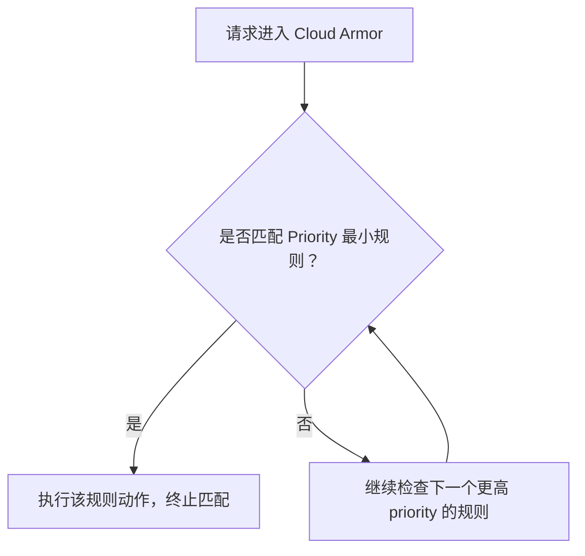
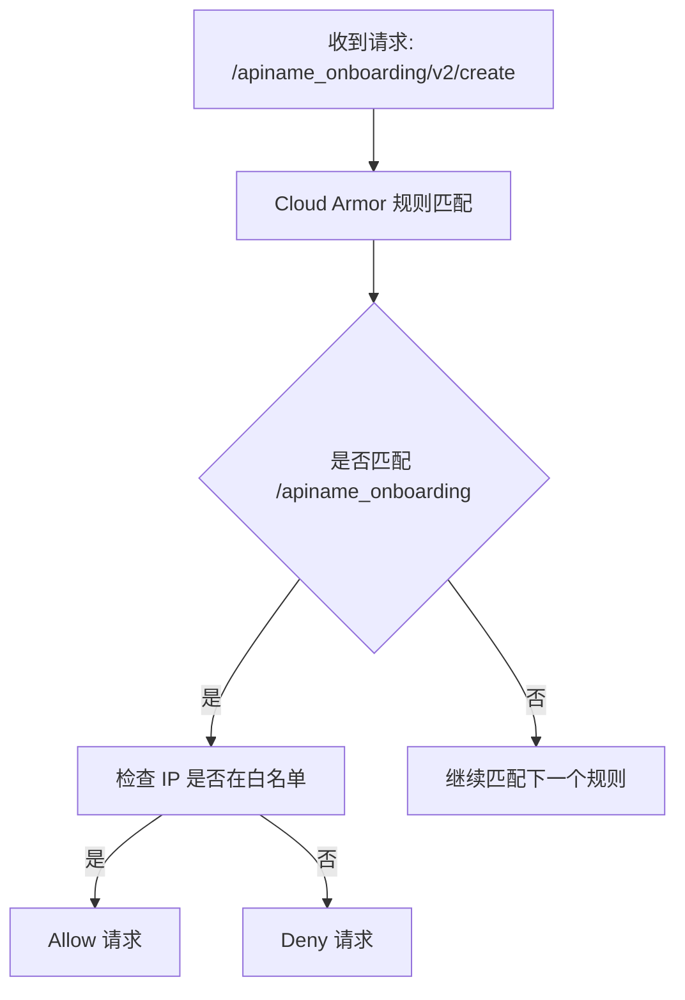

# summary 

| 使用统一 /api_name/_ 而非 /api_name/v1/_ 可提升可维护性     | 版本路径可以在后端服务中控制，不一定在 Armor 做区分  |


```bash
gcloud compute security-policies rules create 100 \
 --security-policy=cloud-armor-policy \
 --project=${PROJECT_ID} \
 --description="Allow traffic to /api_name" \
 --expression='request.path.matches("/apiname_onboarding/v1/*") && (inIpRange(origin.ip, "1.2.3.4/24") || inIpRange(origin.ip, "5.6.7.8/24"))'
--action=allow
```

关于这个表达式
request.path.matches("/apiname_onboarding/v1/_") 比如这个是 priority 100
如果我增加另一个规则比如
request.path.matches("/apiname_onboarding/") 比如这个是 priority 101
request.path.matches("/apiname_onboar/_") 比如这个是 priority 103

那么对于这些规则会有优先匹配到那一个
我知道规则首先按照 priority 优先级匹配

我如果配置的时候关于这个路径配置 是否需要特别注意?

如果规则 priority 不变的情况下 路径越短 那么越短的路径越容易匹配到?

我如果想基于 API 名字做匹配 那么我其实可以不需要对应的版本 这样配置更容易,管理也更容易

你的理解基本正确，但我们来深入剖析 Google Cloud Armor 的 **规则匹配逻辑**，特别是：

---

### **✅** 

### **Cloud Armor 规则匹配原则（重点）**

1. **优先级（priority）越小，优先级越高** —— 这优先于任何 path 的匹配长度或顺序。
2. **规则匹配到后即停止（first-match wins）**。
3. request.path.matches() 使用的是 **正则表达式风格的 glob 匹配**（注意：并不是严格正则表达式，但具有类似行为）。
4. 匹配逻辑 **不会继续向下匹配其他规则**，即使后面的规则“更精确”。

---

### **🔍 示例分析**

你定义的规则如下：

```
# priority 100
request.path.matches("/apiname_onboarding/v1/*")

# priority 101
request.path.matches("/apiname_onboarding/")

# priority 103
request.path.matches("/apiname_onboar/*")
```

- 如果请求为 /apiname_onboarding/v1/create
    - 会被优先匹配到 **priority 100**，即第一个规则
- 如果请求为 /apiname_onboarding/
    - 会匹配到 **priority 101**
- 如果请求为 /apiname_onboar/test
    - 会匹配到 **priority 103**
- **即使路径越短，只有 priority 越小的规则才会首先生效**。

---

### **⚠️ 你的配置需要注意的点**

| **注意点**                                                  | **说明**                                             |
| ----------------------------------------------------------- | ---------------------------------------------------- |
| 路径重叠必须通过 priority 控制明确意图                      | 否则可能造成误匹配或者覆盖                           |
| 使用统一 /api_name/_ 而非 /api_name/v1/_ 可提升可维护性     | 版本路径可以在后端服务中控制，不一定在 Armor 做区分  |
| request.path.matches() 的模式并非严格正则，要小心尾部斜杠 / | /api/_ 不匹配 /api，必须写 /api_ 或 /api(/.\*)? 形式 |
|                                                             |                                                      |
|                                                             |                                                      |

---

### **✅ 推荐实践：基于 API 名字统一匹配路径**

如果你维护大量 API，建议你使用如下模式：

```
--expression='request.path.matches("/apiname_onboarding(/.*)?")'
```

这样可以覆盖：

- /apiname_onboarding
- /apiname_onboarding/
- /apiname_onboarding/v1/create
- /apiname_onboarding/v2/delete

并避免你为每一个版本写规则。

---

### **✅ Mermaid 说明流程图**



---

### **🧩 总结建议**

- ✅ 使用 (/.\*)? 方式统一 API 名路径匹配，便于扩展
- ✅ 合理设置 priority，**更精确的规则设置更小的 priority 值**
- ❌ 避免同一 API 路径被多个规则覆盖，带来混淆
- ✅ 建议将 API 名作为维度，而非版本，进行防护划分

如需我帮你设计一个统一规则模板，也可以告诉我你的 API 路径风格，我可以基于此生成标准表达式。

好的，以下是基于你需要**以 API 名为维度**来统一管理 Cloud Armor 规则的标准表达式模板和结构建议：

---

## **✅** 

## **统一 Cloud Armor 安全策略规则模板（基于 API 名）**

以下是一个推荐的 Cloud Armor 规则结构，用于**统一匹配 API 名路径，不依赖版本信息**：

### **🔧 模板说明（适合自动化批量生成）**

```
gcloud compute security-policies rules create <PRIORITY> \
 --security-policy=cloud-armor-policy \
 --project=${PROJECT_ID} \
 --description="Allow traffic to ${API_NAME}" \
 --expression='request.path.matches("/${API_NAME}(/.*)?") && (inIpRange(origin.ip, "${CIDR_1}") || inIpRange(origin.ip, "${CIDR_2}"))' \
 --action=allow
```

### **📌 表达式说明**

| **字段**                    | **说明**                                                       |
| --------------------------- | -------------------------------------------------------------- |
| /api_name(/.\*)?            | 匹配 /api_name、/api_name/、/api_name/v1/\* 等所有版本和子路径 |
| inIpRange(origin.ip, "...") | 白名单限制，多个可用 `                                         |
| priority                    | **精确的 API 可配置更小的值**，宽泛的规则设置较高的值          |

---

## **📋 示例（假设有两个 API）**

### **🔹 示例 1：**

### **apiname_onboarding**

```
gcloud compute security-policies rules create 100 \
 --security-policy=cloud-armor-policy \
 --project=${PROJECT_ID} \
 --description="Allow onboarding API traffic" \
 --expression='request.path.matches("/apiname_onboarding(/.*)?") && (inIpRange(origin.ip, "1.2.3.4/24") || inIpRange(origin.ip, "5.6.7.8/24"))' \
 --action=allow
```

### **🔹 示例 2：**

### **apiname_payment**

```
gcloud compute security-policies rules create 101 \
 --security-policy=cloud-armor-policy \
 --project=${PROJECT_ID} \
 --description="Allow payment API traffic" \
 --expression='request.path.matches("/apiname_payment(/.*)?") && inIpRange(origin.ip, "1.2.3.4/24")' \
 --action=allow
```

---

## **✅ Mermaid 流程：统一 API 名匹配逻辑**



---

## **🔒 额外建议（可选）**

| **场景**                 | **建议**                                        |
| ------------------------ | ----------------------------------------------- |
| 需要 deny 所有未匹配请求 | 在最后添加一个 priority=9999 的默认 deny 规则   |
| 希望细分 POST/GET 请求   | 可在 expression 中增加 request.method == "POST" |
| 想限制版本               | 改为 /apiname_onboarding/v1(/.\*)?              |

---

如需我根据你的 API 列表生成完整规则命令，我也可以帮你批量生成。你只需提供类似如下结构的列表即可：

```
api_name, priority, ip_list
apiname_onboarding, 100, 1.2.3.4/24;5.6.7.8/24
apiname_payment, 101, 1.2.3.4/24
...
```

是否需要我帮你生成脚本或命令？
