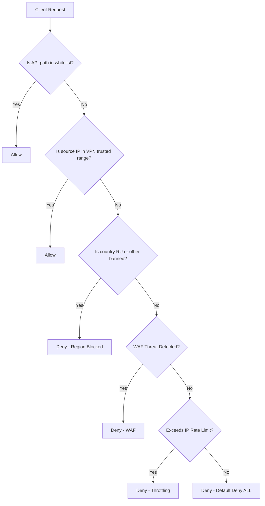
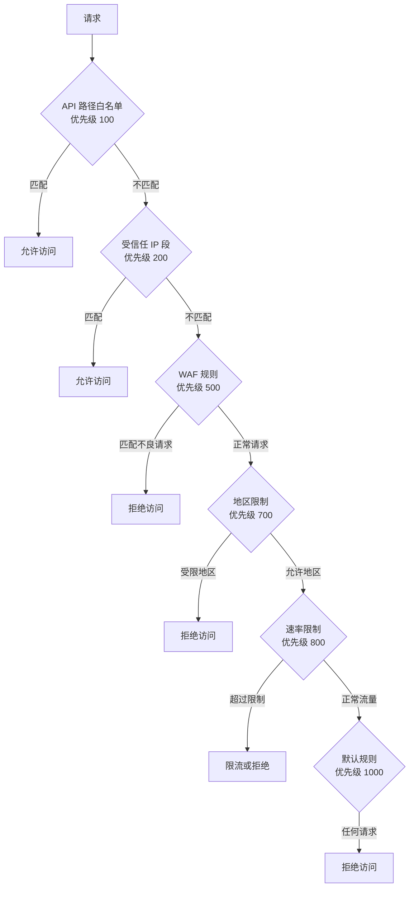
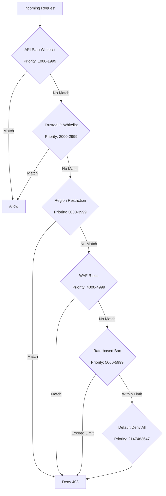

# Q
GCP Cloud Armor Best Practices
1. Create whitelist access based on API location Path
2. Default Deny All access with rule priority like 2147483647
3. Block specific countries using region_code configuration
4. Configure WAF rules
5. DDOS attack protection rules
6. Rate-based ban configuration (source IP throttling)
For example, regarding the first point, our APIs are dynamically added, so we need to focus on priority design

帮我规划这些规则的priority 防止优先级短路的问题

默认的Deny ALL我是不是可以简单地理解为,允许的priority要高.然后后面跟拒绝的就行了 这是个大致的原则

是的，你的理解是正确的。对于 Cloud Armor 的规则设计，核心原则可以简述为：

**关键原则：允许规则优先级要高(数字小)，拒绝规则优先级低(数字大)**

这遵循了"默认拒绝，明确允许"的安全最佳实践：

1. **允许规则优先**：将允许访问的规则(whitelist)放在最高优先级位置
2. **拒绝规则后置**：将拒绝访问的规则放在较低优先级位置
3. **兜底拒绝**：最后用默认拒绝规则(Deny ALL)拦截所有未被前面规则明确允许的流量

这样的设计确保了：
- 合法流量能够快速通过允许规则
- 所有未明确允许的请求都会被拒绝
- 避免了规则冲突或短路的问题

在实际配置中，就是确保你的允许规则(API 白名单、可信 IP)的优先级数值比拒绝规则(WAF、地区限制、速率限制)小，最后以默认拒绝规则收尾。


# chatgpt 

我们都在知道在GCP的cloud armor rule 有priority的概念 所以优先级的规划很重要 因为我们要防止优先级短路,
下面几个是我的需求 请帮我合理设计这个priority 
1 API Location Path whitelist 这个是必须要有的我的这个cloud rule policy 就是想实现这个
2 受信任源 IP 段”提供额外访问权限 比如公司内部的VPN网络段
3 Default Deny ALL
4 Special Country/Region Restrictions .eg RU  拒绝特定国家/地区的访问
5 WAF rule 
6 Rate-based Ban (source ip Throttling and blocking )
基于上面几个要求帮我规划我的的Cloud Armor 

好的，你的新需求是：

允许来自特定 VPN 网络段的 IP 访问（如内部办公网络、私有 VPN），即使这些 IP 访问的是非 whitelist 的 API 路径，也要放行。

⸻

✅ 新增需求解读

这个需求属于对 “受信任源 IP 段”提供额外访问权限，与“路径白名单”不同，应作为次高优先级放行策略，在“路径白名单”之后添加。

⸻

📐 重新规划的 Cloud Armor priority 设计如下：

| Priority | Rule Name | Description | Action |
|----------|-----------|-------------|--------|
| 1000 | allow-api-location-whitelist | 明确允许的 API 路径白名单 | allow |
| 1100 | allow-vpn-trusted-ip-ranges | 特殊 VPN 网络段（信任 IP 段）允许访问 | allow |
| 2000 | country-deny-ru | 地区封锁，如拒绝 RU 流量 | deny(403) |
| 3000 | waf-preconfigured-rules | Cloud Armor WAF 检测（SQLi/XSS 等） | deny(403) |
| 4000 | rate-limit-ip | 基于来源 IP 的速率限制与封禁 | deny(429) |
| 2147483647 | default-deny-all | 默认拒绝所有未命中规则的流量 | deny(403) |


⸻

🔐 流程图更新


⸻

🧪 示例命令片段（添加 VPN 网络段 allow 规则）

假设你的 VPN 网络段为 10.8.0.0/16 和 192.168.100.0/24：

# 2. 允许 VPN 信任 IP 段访问
gcloud compute security-policies rules create 1100 \
  --security-policy=YOUR_POLICY \
  --description="Allow from VPN trusted IP ranges" \
  --expression="origin.ip in [ '10.8.0.0/16', '192.168.100.0/24' ]" \
  --action=allow


⸻

🔍 小提示
	•	你可以添加多个受信 IP 段到 expression 中的 origin.ip in [...]。
	•	如果你希望这些 VPN IP 也能绕过 WAF 和 rate-limit，这个放在 WAF 和 Throttle 规则前是合理的。
	•	若你将来要细分某些 VPN IP 只允许访问部分路径，可加 path 条件进一步限制：

--expression="origin.ip in [ '10.8.0.0/16' ] && request.path.startsWith('/internal/')"


⸻

如需我帮你生成完整的所有 gcloud 命令脚本或 Terraform 资源模块化版本，也可以继续说。
# claude 
我将为你设计一个合理的 GCP Cloud Armor 规则优先级方案，确保规则按照正确的顺序执行，避免优先级短路问题。

# GCP Cloud Armor 规则优先级设计

Cloud Armor 规则按照优先级从低到高执行（数字越小优先级越高），首个匹配的规则将被应用。下面是基于你需求的优先级设计：

| 优先级 | 规则类型 | 规则描述 | 操作 |
|-------|---------|---------|------|
| 100   | API Location Path Whitelist | 允许特定 API 路径访问 | allow |
| 200   | 受信任源 IP 段 | 允许特定 IP 范围访问 | allow |
| 500   | WAF 规则 | Web 应用防火墙规则集 | deny/allow |
| 700   | 国家/地区限制 | 阻止特定国家/地区如俄罗斯(RU) | deny |
| 800   | 速率限制 | 基于源 IP 的限流和阻止 | throttle/deny |
| 2147483647  | 默认拒绝 | 拒绝所有其他请求 | deny |

对于 DDoS 攻击防护规则，应该放在较高优先级位置，但通常在白名单规则之后。以下是更新后的优先级建议：

| 优先级 | 规则类型 | 规则描述 | 操作 |
|-------|---------|---------|------|
| 1000   | API Location Path Whitelist | 允许特定 API 路径访问 | allow |
| 2000   | 受信任源 IP 段 | 允许特定 IP 范围访问 | allow |
| 3000   | DDoS 防护规则 | 阻止常见 DDoS 攻击特征 | deny |
| 5000   | WAF 规则 | Web 应用防火墙规则集 | deny/allow |
| 7000   | 国家/地区限制 | 阻止特定国家/地区如俄罗斯(RU) | deny |
| 8000   | 速率限制 | 基于源 IP 的限流和阻止 | throttle/deny |
| 2147483647  | 默认拒绝 | 拒绝所有其他请求 | deny |

## 放在此位置的理由

1. **优先于一般安全规则**：DDoS 攻击通常会产生大量流量，应该优先拦截，避免这些流量进一步消耗资源
2. **在白名单之后**：先检查白名单确保合法流量不被 DDoS 规则误拦
3. **与现有规则保持间隔**：预留 300 的优先级，为将来可能的微调留出空间

## DDoS 规则示例

```bash
# 拦截 SYN Flood 攻击
gcloud compute security-policies rules create 300 \
    --security-policy=my-policy \
    --description="Block SYN flood attacks" \
    --expression="evaluatePreconfiguredExpr('sl-tcp-connection-flood')" \
    --action=deny-403

# 拦截 HTTP Flood 攻击
gcloud compute security-policies rules create 310 \
    --security-policy=my-policy \
    --description="Block HTTP flood attacks" \
    --expression="evaluatePreconfiguredExpr('sl-http-flood')" \
    --action=deny-403
    
# 拦截异常大小的请求
gcloud compute security-policies rules create 320 \
    --security-policy=my-policy \
    --description="Block oversized requests" \
    --expression="request.headers.size + request.body.size > 8192" \
    --action=deny-413
```

通过这种方式，你的 Cloud Armor 防护方案会先处理白名单和可信来源，然后快速拦截 DDoS 攻击流量，再进行常规的安全检查和限制，最后用默认规则拒绝所有其他请求。

## 规则执行流程



## 规则配置示例

以下是各个规则的配置示例：

### 1. API 路径白名单（优先级 100）

```bash
gcloud compute security-policies rules create 100 \
    --security-policy=my-policy \
    --description="API Location Path whitelist" \
    --expression="request.path.matches('/api/v1/allowed-path.*') || request.path.matches('/api/v2/public.*')" \
    --action=allow
```

### 2. 受信任源 IP 段（优先级 200）

```bash
gcloud compute security-policies rules create 200 \
    --security-policy=my-policy \
    --description="Trusted IP ranges" \
    --src-ip-ranges=192.168.1.0/24,10.0.0.0/8,203.0.113.0/24 \
    --action=allow
```

### 3. WAF 规则（优先级 500）

```bash
gcloud compute security-policies rules create 500 \
    --security-policy=my-policy \
    --description="WAF protection rules" \
    --expression="evaluatePreconfiguredWaf('crs-v2022', {'sensitivity': 1})" \
    --action=deny-403
```

### 4. 地区限制（优先级 700）

```bash
gcloud compute security-policies rules create 700 \
    --security-policy=my-policy \
    --description="Block specific regions" \
    --expression="origin.region_code == 'RU'" \
    --action=deny-403
```

### 5. 速率限制（优先级 800）

```bash
gcloud compute security-policies rules create 800 \
    --security-policy=my-policy \
    --description="Rate limiting" \
    --expression="true" \
    --action=rate-based-ban \
    --rate-limit-threshold-count=100 \
    --rate-limit-threshold-interval-sec=60 \
    --ban-duration-sec=300
```

### 6. 默认拒绝（优先级 1000）

```bash
gcloud compute security-policies rules create 1000 \
    --security-policy=my-policy \
    --description="Default deny all" \
    --expression="true" \
    --action=deny-403
```

## 设计说明

1. **优先级间隔**：各规则间留有足够间隔，便于将来插入新规则
2. **执行顺序**：先检查白名单和信任来源，再进行安全检查和限制
3. **默认规则**：最后使用默认拒绝规则确保严格访问控制
4. **规则组织**：按照允许规则 → 安全规则 → 默认规则的顺序排列

这种设计确保了最重要的白名单规则优先执行，同时保留了足够的防护措施，防止恶意流量和滥用行为。


# Grok
以下是关于在 Google Cloud Armor 中实现基于 API 的 location path 白名单、默认 Deny All、特定国家/地区限制、WAF 规则以及基于源 IP 的 Rate-based Ban（限流和封禁）的最佳实践规划。重点解决优先级（priority）设计，以防止优先级短路问题，并确保规则按预期执行。输出将采用 Markdown 格式，包含流程图（Mermaid 格式）和代码示例。

  

Google Cloud Armor 最佳实践规划

需求分析

1. API Location Path 白名单：

- 需要基于 API 的路径（如 /api/v1/*）动态添加白名单，允许特定路径的访问。
- 由于 API 是动态添加的，优先级设计需要灵活且可扩展，避免规则冲突。

3. 默认 Deny All：

- 默认规则（优先级通常为 2147483647）拒绝所有未匹配的流量，确保只有显式允许的请求通过。

5. 特定国家/地区限制：

- 使用 origin.region_code 限制某些国家/地区的访问（如禁止 CN、RU 等）。

7. WAF 规则：

- 配置预配置的 WAF 规则（如 OWASP Top 10 防护，SQLi、XSS 等），并根据需要调整灵敏度。

9. Rate-based Ban（源 IP 限流和封禁）：

- 对源 IP 进行请求限流（如每分钟 100 次请求），超过阈值后封禁一段时间（如 600 秒）。

优先级设计原则

- Cloud Armor 规则评估顺序：规则按优先级从低到高（0 为最高优先级，2147483647 为最低）依次评估，匹配到第一个规则后停止后续评估（短路）。
- 优先级分配策略：

- 高优先级（低数值）：用于白名单规则，确保特定流量（如 API 路径或可信 IP）优先通过。
- 中间优先级：用于限制性规则（如国家/地区限制、WAF 规则、限流规则），按业务逻辑排序。
- 最低优先级：默认 Deny All 规则，作为兜底策略。

- 动态 API 路径的优先级管理：

- 为动态添加的 API 路径分配连续的优先级范围（如 1000-1999），通过脚本或 Terraform 自动化管理。
- 预留优先级间隔（如每 10 个单位），方便未来插入新规则。

- 防止短路：

- 确保白名单规则优先于限制性规则，避免合法流量被误拦截。
- 使用预览模式（--preview）测试新规则，验证规则行为。

推荐的优先级分配

以下是基于需求的优先级规划：

|   |   |   |   |
|---|---|---|---|
|规则类型|优先级范围|示例优先级|说明|
|API Path 白名单|1000 - 1999|1000, 1010|动态分配给特定 API 路径，优先级最高，确保合法 API 请求通过。|
|可信 IP 白名单|2000 - 2999|2000|用于运维或内部 IP，确保管理流量优先通过。|
|国家/地区限制|3000 - 3999|3000|禁止特定国家/地区（如 CN、RU），在白名单之后执行。|
|WAF 规则|4000 - 4999|4000|OWASP 规则（如 SQLi、XSS），保护应用免受常见攻击。|
|Rate-based Ban（限流/封禁）|5000 - 5999|5000|基于源 IP 的限流和封禁，防止滥用或 DDoS 攻击。|
|默认 Deny All|2147483647|2147483647|兜底规则，拒绝所有未匹配的流量。|

详细配置步骤

1. API Location Path 白名单

- 目标：允许特定 API 路径（如 /api/v1/*）访问，动态添加规则。
- 优先级：1000-1999，建议从 1000 开始，每条规则间隔 10（如 1000, 1010, 1020）。
- 实现：

- 使用 request.path.matches() 匹配路径。
- 通过脚本或 Terraform 动态生成规则，确保优先级递增。

- 示例命令：
```bash
gcloud compute security-policies rules create 1000 \

  --security-policy my-policy \

  --expression "request.path.matches('/api/v1/.*')" \

  --action allow \

  --description "Allow /api/v1/*"
```
- 动态管理：

- 使用 Terraform 管理动态 API 路径：
```bash
resource "google_compute_security_policy" "my_policy" {

  name = "my-policy"

}

  

resource "google_compute_security_policy_rule" "api_rule" {

  for_each = {

    "/api/v1/*" = 1000,

    "/api/v2/*" = 1010

  }

  security_policy = google_compute_security_policy.my_policy.name

  priority        = each.value

  match {

    expr {

      expression = "request.path.matches('${each.key}')"

    }

  }

  action      = "allow"

  description = "Allow ${each.key}"

}
```
- 注意：

- 确保优先级不与其他规则冲突。
- 使用预览模式测试新路径规则：
```bash
gcloud compute security-policies rules create 1010 \

  --security-policy my-policy \

  --expression "request.path.matches('/api/v2/.*')" \

  --action allow \

  --preview
```
2. 默认 Deny All

- 目标：拒绝所有未匹配的流量，作为兜底规则。
- 优先级：2147483647（默认最低优先级）。
- 实现：

- 创建安全策略时，设置默认规则为 deny-403。

- 示例命令：
```bash
gcloud compute security-policies create my-policy \

  --description "Default deny policy"

  

gcloud compute security-policies rules update 2147483647 \

  --security-policy my-policy \

  --action deny-403 \

  --description "Default deny all"
```
3. 特定国家/地区限制

- 目标：禁止特定国家/地区（如 CN、RU）访问。
- 优先级：3000-3999，建议使用 3000。
- 实现：

- 使用 origin.region_code 匹配国家代码（如 CN, RU）。
- 规则优先级低于白名单，确保白名单 IP 或路径不会被误拦截。

- 示例命令：
```bash
gcloud compute security-policies rules create 3000 \

  --security-policy my-policy \

  --expression "'[CN, RU]'.contains(origin.region_code)" \

  --action deny-403 \

  --description "Block CN and RU"
```
- 注意：

- 使用 ISO 3166-1 alpha-2 国家代码。
- 避免使用单一表达式匹配多个地区列表，建议逐个地区配置规则以提高可维护性。

4. WAF 规则

- 目标：启用 OWASP Top 10 防护（如 SQLi、XSS、LFI）。
- 优先级：4000-4999，建议使用 4000。
- 实现：

- 使用预配置 WAF 规则（如 sqli-v33-stable, xss-v33-stable）。
- 根据应用需求调整灵敏度（默认从 1 开始）。

- 示例命令：
```bash
gcloud compute security-policies rules create 4000 \

  --security-policy my-policy \

  --expression "evaluatePreconfiguredExpr('sqli-v33-stable', {'sensitivity': 1})" \

  --action deny-403 \

  --description "Block SQL injection"
```
- 调优：

- 启用详细日志（verbose logging）分析误报：
```bash
gcloud compute security-policies rules update 4000 \

  --security-policy my-policy \

  --enable-logging
```
- 根据日志调整排除规则（如排除特定请求头或 cookie）：
```bash
gcloud compute security-policies rules add-preconfig-waf-exclusion 4000 \

  --security-policy my-policy \

  --target-rule-set "sqli-v33-stable" \

  --request-cookie-to-exclude "op=EQUALS_ANY"
```
5. Rate-based Ban（源 IP 限流和封禁）

- 目标：限制每个源 IP 的请求速率（如每 60 秒 100 次），超限后封禁 600 秒。
- 优先级：5000-5999，建议使用 5000。
- 实现：

- 配置 rate-based-ban 规则，设置阈值和封禁时间。

- 示例命令：
```bash
gcloud compute security-policies rules create 5000 \

  --security-policy my-policy \

  --src-ip-ranges "*" \

  --action rate-based-ban \

  --rate-limit-threshold-count 100 \

  --rate-limit-threshold-interval-sec 60 \

  --ban-duration-sec 600 \

  --ban-threshold-count 500 \

  --ban-threshold-interval-sec 400 \

  --conform-action allow \

  --exceed-action deny-429 \

  --enforce-on-key IP \

  --description "Rate limit and ban per IP"
```
- 注意：

- 使用 429（Too Many Requests）状态码，便于客户端理解。
- 根据应用流量模式调整阈值，建议从 Cloud Logging 分析 99 百分位请求速率：
```bash
gcloud logging read "resource.type=http_load_balancer AND jsonPayload.enforcedSecurityPolicy.name=my-policy" \

  --format="table(jsonPayload.remoteIp, jsonPayload.requestCount)"
```
- 启用预览模式测试限流效果：
```bash
gcloud compute security-policies rules create 5000 \

  --security-policy my-policy \

  --preview
```
优先级短路预防

- 问题：高优先级规则可能导致低优先级规则失效（如白名单被国家限制规则拦截）。
- 解决方案：

1. 明确优先级顺序：白名单 > 限制性规则 > 默认规则。
2. 预留优先级空间：为每类规则分配范围（如 1000-1999），避免冲突。
3. 测试规则：使用 --preview 模式验证规则行为，检查 Cloud Logging：

gcloud logging read "resource.type=http_load_balancer AND jsonPayload.enforcedSecurityPolicy.name=my-policy" \

  --format="table(jsonPayload.enforcedSecurityPolicy.priority, jsonPayload.enforcedSecurityPolicy.outcome)"

4. 自动化管理：使用 Terraform 或脚本动态管理规则，确保优先级递增。

流程图（Mermaid 格式）

以下是 Cloud Armor 规则评估的流程图，展示优先级执行顺序：

最佳实践总结

|   |   |
|---|---|
|最佳实践|说明|
|优先级规划|为每类规则分配明确范围，预留间隔，防止冲突。|
|预览模式|使用 --preview 测试新规则，避免影响生产流量。|
|日志分析|启用详细日志，监控规则匹配情况，优化误报。|
|自动化管理|使用 Terraform 或脚本动态管理 API 路径规则，简化优先级分配。|
|灵敏度调整|WAF 规则从低灵敏度（1）开始，逐步调优，避免误拦截合法请求。|
|阈值优化|基于 Cloud Logging 分析流量，设置合理的限流阈值（如 99 百分位）。|

示例完整配置

以下是一个综合所有规则的 Terraform 配置示例：
```bash
resource "google_compute_security_policy" "my_policy" {

  name        = "my-policy"

  description = "Security policy with whitelist, region block, WAF, and rate limiting"

}

  

# API Path Whitelist

resource "google_compute_security_policy_rule" "api_whitelist" {

  for_each = {

    "/api/v1/*" = 1000,

    "/api/v2/*" = 1010

  }

  security_policy = google_compute_security_policy.my_policy.name

  priority        = each.value

  match {

    expr {

      expression = "request.path.matches('${each.key}')"

    }

  }

  action      = "allow"

  description = "Allow ${each.key}"

}

  

# Trusted IP Whitelist

resource "google_compute_security_policy_rule" "trusted_ip" {

  security_policy = google_compute_security_policy.my_policy.name

  priority        = 2000

  match {

    config {

      src_ip_ranges = ["203.0.113.0/24"]

    }

  }

  action      = "allow"

  description = "Allow trusted IPs"

}

  

# Region Restriction

resource "google_compute_security_policy_rule" "region_block" {

  security_policy = google_compute_security_policy.my_policy.name

  priority        = 3000

  match {

    expr {

      expression = "'[CN, RU]'.contains(origin.region_code)"

    }

  }

  action      = "deny-403"

  description = "Block CN and RU"

}

  

# WAF Rule (SQLi)

resource "google_compute_security_policy_rule" "waf_sqli" {

  security_policy = google_compute_security_policy.my_policy.name

  priority        = 4000

  match {

    expr {

      expression = "evaluatePreconfiguredExpr('sqli-v33-stable', {'sensitivity': 1})"

    }

  }

  action      = "deny-403"

  description = "Block SQL injection"

}

  

# Rate-based Ban

resource "google_compute_security_policy_rule" "rate_limit" {

  security_policy = google_compute_security_policy.my_policy.name

  priority        = 5000

  match {

    config {

      src_ip_ranges = ["*"]

    }

  }

  action = "rate_based_ban"

  rate_limit_options {

    conform_action = "allow"

    exceed_action  = "deny-429"

    enforce_on_key = "IP"

    rate_limit_threshold {

      count        = 100

      interval_sec = 60

    }

    ban_duration_sec = 600

    ban_threshold {

      count        = 500

      interval_sec = 400

    }

  }

  description = "Rate limit and ban per IP"

}

  

# Default Deny All

resource "google_compute_security_policy_rule" "default_deny" {

  security_policy = google_compute_security_policy.my_policy.name

  priority        = 2147483647

  match {

    config {

      src_ip_ranges = ["*"]

    }

  }

  action      = "deny-403"

  description = "Default deny all"

}
```
参考资料

- Google Cloud Armor 最佳实践：
- Cloud Armor 安全策略配置：
- 预配置 WAF 规则调优：
- 限流配置：

  

通过以上规划和配置，Cloud Armor 规则能够满足动态 API 白名单、默认拒绝、国家限制、WAF 防护和限流封禁的需求，同时通过优先级管理和自动化工具避免短路问题。如需进一步优化或针对特定场景调整，请提供更多细节！


# Gemini 
精通GCP Cloud Armor：实现稳健应用安全的战略性规则优先级排序
摘要
本报告旨在提供关于GCP Cloud Armor规则优先级设计的专家级指导，核心目标是防止因规则评估顺序不当导致的“短路”问题，确保建立有效的分层安全防护体系。报告将深入探讨API路径白名单（特别是动态添加API时的优先级管理）、默认拒绝所有规则、地理位置封禁、Web应用防火墙（WAF）规则以及基于速率的封禁等关键规则类型的战略优先级。通过合理的规则排序，组织可以最大限度地发挥Cloud Armor的防护能力，有效抵御各类网络威胁，保障应用安全和可用性。本报告还将涵盖实施和维护的最佳实践，包括利用预览模式、日志监控以及基础设施即代码（IaC）工具进行策略管理，确保安全策略的持续有效性和可维护性。
1. GCP Cloud Armor 规则优先级基础
GCP Cloud Armor 安全策略的核心在于其规则评估机制。深入理解这一机制是设计高效且无懈可击的安全防护体系的前提。
 * 1.1. 理解规则评估顺序：“首次匹配即生效”原则
   * 详细说明： Cloud Armor 规则根据一个数字优先级进行评估，数字越小，优先级越高 。关键概念在于，对于一个传入请求，第一个其匹配条件评估为 true 的规则，其定义的动作（例如允许、拒绝）将被执行。该请求将不再接受后续规则的评估，即使后续规则的条件也可能匹配 。
   * 重要性： 这种“首次匹配即生效”的行为是 Cloud Armor 策略设计的基石。未能深刻理解这一点，极易导致非预期的安全后果，例如意外地允许了恶意流量或拒绝了合法访问。
 * 1.2. “短路”问题：成因与预防
   * 详细说明： “短路”现象发生在当一个较高优先级的规则错误地允许或拒绝了本应由后续更具体（或不同类型）规则处理的流量时。例如，一个针对宽泛IP范围的 allow 规则，如果优先级过高，可能会阻止一个针对该范围内某个恶意IP的更具体的 deny 规则或一个WAF规则对该流量进行评估。
   * 因果关系： “首次匹配即生效”原则（见1.1节）是导致短路问题的直接原因。一个错误排序的规则会有效地将其余规则从特定流量的评估引擎中“隐藏”起来。
   * 预防策略： 主要的预防措施是细致规划规则顺序，确保更具体或更关键的规则比较宽泛或次关键的规则拥有更高的优先级。同时，需要谨慎放置 allow 规则，以避免它们无意中绕过了必要的安全检查。在策略不断演进的过程中，短路不仅仅是初始设计阶段的风险，更是一个持续存在的挑战。主动的方法包括严格的优先级规划和预留间隔，而被动的方法则是在出现意外行为后进行调试，后者通常成本更高。
 * 1.3. 核心原则：为未来灵活性预留优先级间隔
   * 详细说明： 在分配优先级时，最佳实践是在规则之间预留数字间隔（例如，使用10或100的间隔）。
   * 重要性： 这种做法对于策略的可维护性至关重要。随着应用需求的变化或新威胁的出现，需要在现有策略中插入新规则。如果没有预留间隔，这可能需要重新编号许多现有规则，这个过程不仅容易出错，而且非常耗时，尤其是在复杂的策略中。这一点对于满足用户提出的“动态添加API的priority设计”需求尤为关键。对于复杂的策略，将相关规则分组（例如，所有地理位置封禁规则、所有WAF规则），并在组之间使用较大的间隔，在组内部使用较小的间隔，可以提供更好的组织性和可扩展性。例如，所有API白名单可能位于100-500的优先级范围，地理位置封禁规则位于1000-1500范围，WAF规则位于2000-2500范围等。在API白名单的100-500这个区块内，单个规则可以是100、110、120。如果需要在100和110之间加入新的API白名单，则可以使用优先级105。这种结构化的间隔使得理解策略意图和逻辑插入规则更为容易，而不会引发连锁性的优先级调整。
2. 战略性规则排序：分层防御模型
本节详细介绍用户查询中指定的规则类型的推荐顺序，旨在最大化安全效能并最小化短路风险。总体原则是首先处理针对可信流量的最具体的 allow 规则，然后应用广泛的 deny 条件（如地理位置封禁），接着是内容检查（WAF）和速率限制，最后是默认 deny。
 * 2.1. 第1层：显式允许 – API路径白名单 (针对这些路径的最高有效优先级)
   * 详细说明： 显式允许访问特定API路径的规则，通常应具有针对这些路径的最高有效优先级，以确保它们不会被后续可能出现的更广泛的拒绝规则（如地理位置封禁、WAF规则）意外阻止。这对于保障应用程序的核心功能至关重要。
   * 匹配条件： 通常使用 request.path.matches('/api/v1/specific_resource') 或类似的CEL表达式 。
   * 静态API端点的优先级设计： 使用优先级间隔分配较低的数字优先级（例如100, 110, 120）。
   * 动态添加API的优先级管理：
     * 利用优先级间隔： 预留的间隔（例如100、110，然后新增API使用105）在此变得至关重要 。
     * 基础设施即代码 (IaC) 自动化： Terraform等工具可以编程方式管理规则优先级。当定义新的API（例如，在列表或映射变量中）时，Terraform可以根据预定义范围或算法自动为其分配优先级，确保一致性 。Terraform的 dynamic "rule" 结构配合 for_each 可以遍历API路径列表或映射，动态创建规则并分配优先级，例如 index(local.api_paths_to_whitelist) + 1000 或使用映射中为每个API路径指定的专用优先级字段。
   * 并非所有API白名单都具有同等需求。某些API路径可能需要绝对的白名单（允许此路径，不进行进一步检查）。其他API路径则可能是条件性白名单（例如，允许此路径 如果 它也通过WAF检查，或者 如果 它不是来自被封禁的地理区域）。优先级设计必须反映这种意图。如果一个API路径白名单意味着允许访问，那么它应该具有高优先级。如果该API路径还需要WAF保护，那么WAF规则本身应设计为审查该路径，或者该路径的“允许”规则优先级应在WAF的“拒绝”规则之后。对于用户防止短路的目标，最直接的解释是API路径白名单规则应具有非常高的优先级以确保访问，从而绕过针对该特定路径的其他通用阻止规则。
 * 2.2. 第2层：地理位置封禁 – 拒绝不需要的区域
   * 详细说明： 在允许显式白名单的API路径之后，下一层通常涉及阻止来自与应用程序无关或已知是恶意活动来源的地理区域的流量。
   * 匹配条件： 使用 origin.region_code == 'XX' （其中XX是ISO 3166-1 alpha 2代码）并配合 deny 动作 。
   * 优先级放置： 这些规则的优先级应低于API路径白名单（即具有更高的数字值），但高于通用的WAF规则和默认拒绝规则。这确保了如果流量不是针对特定允许的API路径，则会根据地理限制进行检查。
   * 示例优先级范围： 例如 1000-1500。
   * 一个宽泛的地理位置封禁规则（例如 deny origin.region_code == 'XX'）如果其优先级高于（数字更小）API白名单规则，则可能无意中阻止一个白名单API路径的访问。例如，如果API路径 /api/important 在优先级100被白名单允许，而地理位置封禁规则 deny origin.region_code == 'ZZ' 的优先级为50，那么来自区域 ZZ 对 /api/important 的请求将被地理位置封禁规则首先拒绝，API白名单规则将没有机会评估。如果意图是 /api/important 应可从区域 ZZ 访问，这就是一个典型的短路场景。因此，如果白名单路径应不受地理来源限制地访问，则API路径白名单必须具有比通用地理位置封禁规则更高的优先级。
 * 2.3. 第3层：基于速率的控制 – 限制与封禁
   * 详细说明： 速率限制规则保护后端服务免受来自单个客户端（通常按IP地址识别，但也可以使用其他键）的过多请求的冲击。
   * 动作： throttle （对超过阈值的流量进行降速）或 rate_based_ban （在超过阈值后的一段时间内阻止流量）。
   * 最佳优先级放置： 速率限制规则的放置至关重要且取决于具体情况。
     * 通常，它们应放置在API白名单和地理位置封禁之后。不应对已明确允许的流量（除非白名单路径本身需要速率限制）或无论如何都将被地理位置封禁拒绝的流量进行速率限制。
     * 它们通常应放置在WAF规则之前或与之结合。速率限制可以作为WAF的前置过滤器，减少对计算密集型WAF检查的负载。正如中所述，“流量可能在被评估速率限制规则之前，已被更高优先级的规则明确允许或拒绝了”，这突显了放置的敏感性。
   * 示例优先级范围： 例如 1600-1900。
   * enforceOnKey 的考量： 键的选择（IP, HTTP-Header, XFF-IP, Cookie等 ）显著影响速率限制的应用方式，应与用户/客户端的唯一标识方式保持一致。
   * 大规模攻击或快速探测可能会压垮WAF资源或产生过多的WAF日志。基于源IP的速率限制可以在流量到达WAF层之前缓解此问题。如果速率限制规则在WAF规则之前应用（即具有更高优先级），它可以减少WAF需要从来具有滥用行为的源检查的请求数量，从而使WAF更高效，更专注于复杂的攻击，而不仅仅是流量。然而，需要确保速率限制本身不会对那些应该被WAF检查但低于速率限制阈值的流量造成WAF短路。通常，速率限制的 conform_action 是 allow，这意味着低于阈值的流量会传递给下一个规则（例如WAF）进行评估。
 * 2.4. 第4层：Web应用防火墙 (WAF) 规则
   * 详细说明： WAF规则检查请求内容是否存在恶意模式，例如SQL注入 (SQLi)、跨站脚本 (XSS) 和其他常见的Web攻击。
   * 匹配条件： 使用预配置的WAF规则，如 evaluatePreconfiguredWaf('sqli-stable') ，或针对特定威胁的自定义表达式。
   * 优先级考量：
     * WAF规则的优先级通常应低于API路径白名单（如果这些路径旨在绕过WAF）、地理位置封禁以及潜在的速率限制规则。
     * 它们作为通过了初始过滤的流量的关键防御层。
   * 示例优先级范围： 例如 2000-2500。
   * 与允许/拒绝规则的交互： 这是一个常见的混淆点。如果一个 allow 规则（例如API路径白名单）的优先级高于WAF deny 规则，则匹配 allow 规则的流量将不会被该WAF规则检查 。如果白名单路径被认为是安全的或与WAF不兼容，这通常是一个有意的设计选择。如果白名单路径确实需要WAF检查，则WAF规则必须具有更高的优先级，或者该“允许”规则并非真正的绕过。
   * WAF规则敏感度调整： 调整敏感度级别（例如0-4，对应ModSecurity的偏执级别）对于在保护和误报之间取得平衡至关重要 。建议从较低的敏感度（例如1）开始，并在监控后根据需要增加。
   * 如果一个API路径被白名单允许（高优先级允许规则），它将绕过低优先级的WAF规则。这通常是预期的。然而，如果后来发现该“受信任”路径存在可通过WAF可检测模式利用的漏洞，则该白名单将成为安全漏洞。这意味着安全决策是：该路径的信任级别高于WAF。另一种选择是让WAF规则的优先级高于特定路径的允许规则，或者不对该路径设置特定的允许规则，而是依赖默认拒绝，并仅在流量通过WAF后才允许。最常见且易于理解的模型是：显式路径白名单（允许）优先。如果WAF对某个路径至关重要，则该路径不应包含在通用的“绕过WAF”白名单中。
 * 2.5. 第5层：最终防线 – 默认拒绝规则
   * 详细说明： 这是策略中的最后一条规则，充当安全网。任何未被任何先前规则明确允许或拒绝的流量都将被此规则捕获并拒绝。这体现了“默认拒绝”的原则。
   * 动作： deny （通常带有403或404状态码）。
   * 优先级： 可能的最低优先级，2147483647 。正如所述，“先前设置的默认规则具有最低优先级，因此任何其他规则都会取代它。”
   * 匹配条件： 通常为 true 或 * 以匹配所有流量。
   * 重要性： 对于安全态势至关重要，确保没有意外的流量被允许通过。默认拒绝规则是零信任安全模型的基础元素。它强制执行默认情况下不信任任何事物的原则；访问必须得到明确授予。如果不存在默认拒绝规则，任何不匹配显式拒绝规则的流量都可能被隐式允许。具有明确默认拒绝规则（优先级2147483647，动作为拒绝）的Cloud Armor策略可确保只有匹配策略中 allow 规则的流量才能通过，所有其他流量都会被明确阻止。
3. 综合规则优先级规划：示例配置
 * 3.1. 场景设定与目标
   * 假设一个应用场景：一个电子商务平台，拥有公共API、管理员API和面向用户的Web内容。
   * 安全目标：允许从任何地方访问公共API，将管理员API的访问限制在特定IP，阻止来自特定国家/地区的访问，防范常见的Web攻击，对登录尝试进行速率限制，并拒绝所有其他流量。
 * 3.2. 表1：推荐的规则优先级层次结构和范围 (汇总视图)
   * 目的： 提供一个清晰、结构化的概述，说明不同类型的规则通常应如何相互优先排序，并提供包含间隔的建议数字范围。此表可作为策略设计的模板。
| 规则类别 | 推荐优先级范围 (示例) | 动作类型 | 关键表达式片段 (示例) | 理由/备注 |
|---|---|---|---|---|
| 关键IP允许列表 (例如健康检查) | 1-99 | Allow | inIpRange(origin.ip, 'gcp_health_check_ips') | 确保核心服务（如负载均衡器健康检查）始终可访问，优先级最高。 |
| API路径白名单 (公共) | 100-499 | Allow | request.path.matches('/api/public/.*') | 允许对公开API的访问，先于地理封禁和WAF。 |
| API路径白名单 (受限) | 500-999 | Allow | request.path.matches('/admin/.*') && inIpRange(origin.ip, 'office_ip') | 限制特定API（如管理员接口）的访问来源，优先级仍高于通用拒绝规则。 |
| 地理位置拒绝 | 1000-1499 | Deny(403) | origin.region_code == 'XX' | 阻止来自不需要或高风险国家/地区的流量，在允许特定路径后执行。 |
| 速率限制 (特定路径) | 1500-1999 | Throttle / Rate-Based-Ban | request.path.matches('/auth/login') | 防止对特定敏感端点（如登录）的暴力破解或滥用，在WAF检查之前或与之并行。 |
| 通用WAF规则 | 2000-2999 | Deny(403) | evaluatePreconfiguredWaf('sqli-stable') | 对通过了前几层过滤的流量进行内容检查，捕获OWASP Top 10等常见攻击。 |
| 默认拒绝所有 | 2147483647 | Deny(403) | true() | 安全网，拒绝所有未被先前规则明确允许的流量，实现默认拒绝原则。 |
 * 3.3. 表2：详细的Cloud Armor策略示例
   * 目的： 提供一个具体的、分步的策略示例，该策略根据推荐的层次结构构建，展示具有特定优先级的各个规则如何交互。这使得抽象概念变得具体化。
| 优先级 | 描述 | 匹配条件 (CEL) | 动作 | 备注/交互 |
|---|---|---|---|---|
| 10 | 允许GCP健康检查 | `inIpRange(origin.ip, '130.211.0.0/22') |  |  |
| inIpRange(origin.ip, '35.191.0.0/16')` | Allow | 确保负载均衡器健康检查正常工作，这是最高优先级的允许规则之一。 |  |  |
| 100 | 白名单：公共产品API (/api/products) | request.path.matches('/api/products/.*') | Allow | 允许对公共产品API的访问。此规则先于地理封禁和WAF，确保这些API的可用性。 |
| 110 | 白名单：公共分类API (/api/categories) | request.path.matches('/api/categories/.*') | Allow | 允许对公共分类API的访问，与产品API类似，优先级高。使用间隔10以便将来插入其他公共API。 |
| 500 | 白名单：管理员API (来自办公室IP) | request.path.matches('/admin/.*') && inIpRange(origin.ip, 'YOUR_OFFICE_IP_RANGE/CIDR') | Allow | 仅允许来自指定办公IP地址范围的对管理员路径的访问。优先级高于地理封禁，因为办公IP可能在被封禁的区域。 |
| 1000 | 地理封禁：拒绝来自朝鲜 (KP) 的访问 | origin.region_code == 'KP' | Deny(403) | 阻止来自朝鲜的流量。此规则在API白名单之后评估。 |
| 1010 | 地理封禁：拒绝来自伊朗 (IR) 的访问 | origin.region_code == 'IR' | Deny(403) | 阻止来自伊朗的流量。与朝鲜的规则类似，使用间隔10。 |
| 1500 | 速率限制：登录尝试 (/auth/login) | request.path.matches('/auth/login') | Rate-Based-Ban | 对登录路径实施基于速率的封禁，以防止暴力破解。配置参数包括阈值、间隔和封禁时长，例如每IP每分钟超过10次尝试则封禁5分钟。 conform_action 为 allow。 |
| 2000 | WAF防护：SQL注入 (SQLi) | evaluatePreconfiguredWaf('sqli-stable') | Deny(403) | 应用预配置的SQLi WAF规则。此规则在地理封禁和速率限制之后，对剩余流量进行内容检查。 |
| 2010 | WAF防护：跨站脚本 (XSS) | evaluatePreconfiguredWaf('xss-stable') | Deny(403) | 应用预配置的XSS WAF规则。与SQLi规则类似，使用间隔10。 |
| 2147483647 | 默认拒绝所有 | true() | Deny(403) | 作为最后一道防线，拒绝所有未被先前任何规则匹配（允许或拒绝）的流量。 |
 * 3.4. 示例中每个优先级决策的理由
   * 在上述示例策略中，优先级10的健康检查规则确保了GCP负载均衡器的基本运作不受干扰。优先级100和110的公共API白名单规则确保了核心业务API（/api/products 和 /api/categories）的全局可访问性，它们的优先级高于地理封禁（优先级1000及以后）和WAF规则（优先级2000及以后），从而避免了这些API被意外阻止。管理员API（优先级500）虽然也是白名单，但增加了IP来源限制，其优先级设定确保了即使办公IP位于通常被地理封禁的区域，管理员依然可以访问。
   * 地理封禁规则（优先级1000和1010）在API白名单之后执行，用于阻止来自特定高风险或不提供服务的国家/地区的流量。这减少了攻击面，且不会影响已明确允许的API路径。
   * 登录尝试的速率限制规则（优先级1500）放置在WAF规则之前，旨在通过限制来自单一来源的请求频率来减轻暴力破解攻击的压力，同时也减少了WAF需要处理的潜在恶意请求数量。其 conform_action 为 allow，意味着未超限的请求会继续流向WAF规则进行检查。
   * WAF规则（优先级2000和2010）用于深度检查通过了前序过滤的流量，以识别和阻止如SQL注入和XSS等应用层攻击。它们在API白名单和地理封禁之后，确保了对非明确允许或已被拒绝的流量进行安全扫描。
   * 最后，优先级为2147483647的默认拒绝规则是安全策略的基石，确保任何未被明确定义的流量都被阻止，遵循了最小权限和默认拒绝的安全原则。这种分层和间隔的优先级设计，有效地避免了规则短路，并为未来的策略调整提供了灵活性。
4. 实施与维护最佳实践
 * 4.1. 利用预览模式安全部署规则
   * 详细说明： Cloud Armor的预览模式允许部署新的或修改的规则，并在日志中观察其潜在影响，而无需实际执行其动作（允许/拒绝）。
   * 重要性： 这对于验证规则逻辑（尤其是复杂表达式或WAF规则）、防止意外阻止合法流量或错误配置优先级至关重要。预览模式不仅适用于初始部署，每当修改规则或调查可疑流量模式以测试假设的阻止规则时，都应使用预览模式。这是一个持续验证的工具，而非一次性步骤。
 * 4.2. 日志记录和监控对于规则验证的重要性
   * 详细说明： 启用并定期审查Cloud Logging中的Cloud Armor日志。这些日志显示哪些规则被触发、采取的行动以及请求的详细信息 。
   * 重要性： 日志对于以下方面至关重要：
     * 验证规则是否按预期运行（正确的优先级、正确的动作）。
     * 识别WAF规则的误报。
     * 检测被阻止的实际攻击。
     * 排除与规则短路相关的问题。
   * 仅仅看到“拒绝”日志是不够的，关键是要了解该拒绝是合法的（阻止了攻击）还是影响用户的误报。这需要将Armor日志与应用程序日志或用户报告相关联。例如，如果用户报告访问某个API时遇到问题，而Armor日志显示该API路径的请求被WAF规则拒绝，则可能是误报。这需要在安全监控团队与应用程序/运营团队之间建立反馈循环。
 * 4.3. 使用基础设施即代码 (IaC) 进行可扩展的策略管理
   * 详细说明： Terraform等工具允许将Cloud Armor安全策略和规则定义为代码 。
   * 对优先级管理的好处：
     * 版本控制： 跟踪规则优先级随时间的变化。
     * 可复现性： 在不同环境中一致地部署策略。
     * 自动化： 以编程方式管理优先级，特别是对于API白名单等动态元素。
     * 可审查性： 对策略更改进行代码审查。
     * 减少手动错误： 与在控制台中手动配置相比，更不容易出错。
   * 随着规则数量的增加和优先级相互依赖关系的复杂化，手动管理变得不切实际。IaC允许实施复杂的逻辑来分配和调整优先级。例如，可以创建一个API定义映射，其中每个API都有一个“类型”（例如，“公共”、“内部关键”、“合作伙伴”），Terraform逻辑可以根据此类型从不同的预定义块中分配优先级，从而确保大规模下优先级的一致性和逻辑性。
 * 4.4. 定期审查和调整规则优先级
   * 详细说明： 安全并非一劳永逸。应用环境会发生变化，新的API会被添加，新的威胁会出现，业务需求也会演变。应定期审查Cloud Armor策略，特别是规则优先级。
   * 审查触发因素： 新API部署、流量模式变化、新的威胁情报、渗透测试结果、频繁的误报。
   * 流程： 重新评估当前的优先级顺序是否仍能满足安全目标，并且不会导致短路。在调整过程中使用日志记录和预览模式。
   * 规则优先级审查应以更新的威胁模型为依据。随着与应用程序相关的新攻击向量的识别，Cloud Armor策略（包括WAF规则及其优先级）可能需要调整以专门应对这些威胁。例如，如果出现新的威胁向量（例如，当前WAF规则未很好覆盖的新型注入攻击，或针对新部署API的攻击），则Cloud Armor策略需要进行调整。这可能涉及添加新的自定义WAF规则，调整现有规则的敏感性，甚至重新确定某些拒绝规则的优先级，以确保有效捕获这些新威胁，同时不影响应用程序其他部分的合法流量。
5. 结论：通过战略性优先级排序实现稳健安全
规则优先级在GCP Cloud Armor中扮演着至关重要的角色。一个精心策划的分层方法，结合优先级间隔、预览模式、日志记录和基础设施即代码（IaC）等最佳实践，是防止规则短路、维护有效安全态势的关键。通过将API路径白名单置于最高有效优先级，随后是地理位置封禁、速率限制和WAF规则，最后以默认拒绝规则作为安全网，可以构建一个既强大又灵活的安全策略。
然而，安全防护并非一成不变。应用程序的演进、新出现的威胁以及业务需求的变化都要求对Cloud Armor策略进行持续的审查和调整。只有通过不断的警惕和适应，才能确保Cloud Armor策略在不断变化的网络环境中持续有效地保护您的应用和服务。
