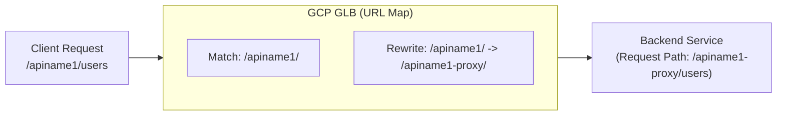

# GCP URL Map 高级匹配与路径重写指南 (URLmapMatch.md)

本文旨在深度解析 Google Cloud HTTPS Load Balancer (GLB) 中 URL Map 的匹配机制，并解决“路径简化与精准转发”的核心诉求。

---

## 1. 核心匹配逻辑：最长前缀匹配 (Longest Prefix Match)

GCP URL Map 的匹配逻辑不是基于规则的先后顺序，而是基于**路径的精确度（长度）**。

### 1.1 精准匹配示例
假设你有以下规则：

| 规则 (Path Rule) | 目标后端 (Backend Service) | 说明 |
| :--- | :--- | :--- |
| `/apiname1-proxy/*` | `bs-proxy-1` | 规则 A |
| `/apiname1/*` | `bs-api-1` | 规则 B |

**匹配行为：**
- 请求 `/apiname1-proxy/v1/list`: 匹配 **规则 A**。因为它比 `/apiname1/` 更长、更具体。
- 请求 `/apiname1/v1/list`: 匹配 **规则 B**。

### 1.2 为什么相似路径不会混淆？
对于 `/apiname1-proxy/` 和 `/apiname2-proxy/`：
- GLB 会将它们视为完全不同的前缀。
- 匹配时会从左到右扫描，直到找到**能包含该请求的最长字符串**。

---

## 2. 解决“路径后缀”问题：URL Rewrite

您提到的痛点是：**不想在请求路径后面强行加上 `-proxy` 这种后缀，但又希望 GLB 能正确识别并转发。**

### 2.1 问题的根源
如果您直接写 `/apiname1/*` 转发到后端：
1. **GLB 行为**：默认情况下，GLB 会透传整个 Path 给后端。
2. **后端 (Nginx) 行为**：如果 Nginx 配置的是监听 `/apiname1-proxy/`，而收到的请求是 `/apiname1/`，则会返回 404 或匹配失败。

### 2.2 解决方案：使用 `routeRules` + `urlRewrite`
在 URL Map 的高级模式中，你可以定义“入参路径”和“转发路径”的映射。

#### 配置示例 (YAML 结构)：
```yaml
hostRules:
- hosts: ["api.aibang.com"]
  pathMatcher: main-matcher

pathMatchers:
- name: main-matcher
  defaultService: bs-default
  routeRules:
    # 规则：用户访问 /apiname1/*，实际转发给后端 /apiname1-proxy/*
    - priority: 10
      matchRules:
        - prefixMatch: "/apiname1/"
      service: bs-api-1
      routeAction:
        urlRewrite:
          pathPrefixRewrite: "/apiname1-proxy/"
    
    # 规则：用户访问 /apiname2/*，实际转发给后端 /apiname2-proxy/*
    - priority: 20
      matchRules:
        - prefixMatch: "/apiname2/"
      service: bs-api-2
      routeAction:
        urlRewrite:
          pathPrefixRewrite: "/apiname2-proxy/"
```

**执行流程图：**


---

## 3. `pathRules` vs `routeRules`

这是 URL Map 中最容易混淆的两个参数：

| 特性 | `pathRules` (普通模式) | `routeRules` (高级模式) |
| :--- | :--- | :--- |
| **匹配方式** | 仅支持简单的通配符 `/*` | 支持前缀、正则、Header 匹配 |
| **优先级** | 自动按最长前缀排序 | **手动指定 priority** (数值越小优先级越高) |
| **重写能力** | ❌ 不支持路径改写 | ✅ 支持 `urlRewrite` |
| **应用场景** | 简单的 1:1 映射 | 复杂路由、灰度发布、路径简化 |

---

## 4. 常见问题排查 (Troubleshooting)

### Q1: 为什么我的 `/apiname/*` 匹配不到？
- **检查斜杠**：`/apiname/*` 和 `/apiname` 是不同的。建议始终加上末尾斜杠。
- **检查优先级**：如果你同时使用了 `pathRules` 和 `routeRules`，`routeRules` 的优先级通常更高，或者会在 `pathMatchers` 级别产生冲突。建议在一个 Path Matcher 中统一使用一种模式。

### Q2: 转发后后端收到了重复的路径？
- 如果你使用了 `pathPrefixRewrite: "/proxy/"`，而请求是 `/api/v1`。
- 如果不小心配置错误，可能会变成 `/proxy/api/v1`。
- **核心逻辑**：`pathPrefixRewrite` 会**替换**掉 `prefixMatch` 命中的部分。

---

## 5. 最佳实践建议

1. **命名一致性**：如果前端暴露 `/user/v1`，后端 Nginx 也建议监听 `/user/v1`。通过 `urlRewrite` 只是为了弥补存量系统的命名不一致。
2. **版本控制**：在 `routeRules` 中利用 `priority` 进行版本平滑切换。
3. **验证工具**：在修改后，务必执行以下命令进行离线校验：
   ```bash
   gcloud compute url-maps validate --source=URLMAP_FILE.yaml --global
   ```

---

**总结**：您关心的“最长匹配”在 `pathRules` 中是自动生效的。若要实现“对外路径简洁，对内路径带后缀”，请务必使用 **`routeRules` + `urlRewrite`** 组合。

---

## 6. 进阶探索：Cloud Armor 策略的“减法”逻辑

当我们将 API 路径与独立的 **Backend Service** 绑定后，与之关联的 **Cloud Armor** 规则将迎来极大的简化。

### 6.1 过去与现在的对比

#### ❌ 过去的写法 (单后端/共享后端模式)
在所有 API 共享一个后端时，你必须在 Cloud Armor 规则里通过 CEL 表达式手动“捞出”特定 API 的路径：
```cel
// 必须手动判断路径，规则臃肿且容易误伤
request.path.matches('/apiname1/.*') && evaluatePreConfiguredWaf('sqli-v33-stable')
```

#### ✅ 现在的写法 (独立后端模式)
在独立后端模式下，URL Map 已经提前完成了流量的“身份验证（分流）”。
- **前提**：`/apiname1/*` 已经由 URL Map 路由到了 `bs-api-1`。
- **后果**：绑定在 `bs-api-1` 上的 Cloud Armor 策略，**默认接收到的全都是 `/apiname1` 的流量**。

**新的规则写法：**
```cel
// 仅保留核心防护逻辑，无需再判断路径
evaluatePreConfiguredWaf('sqli-v33-stable')
```

### 6.2 为什么这样做更好？

| 维度 | 优势说明 |
| :--- | :--- |
| **性能** | 减少了 CEL 表达式中复杂的正则匹配计算，提升 WAF 判定速度。 |
| **可维护性** | 策略变得纯粹。如果你想给 API-1 加白名单，只需在 `policy-api-1` 中添加 IP 规则，无需担心影响到 API-2。 |
| **安全隔离** | 彻底避免了“规则冲突”。不再会出现“API-1 的 WAF 误杀规则导致 API-2 无法访问”的情况。 |
| **审计清晰** | 当你查看监控日志时，`bs-api-1` 的所有拒绝记录都明确指向该 API 的安全状态。 |

### 6.3 关键结论：路径判断的“职责迁移”

- **URL Map**：承担了**“在哪里生效 (Where)”**的职责（通过 Path 选 BS）。
- **Cloud Armor**：承担了**“执行什么规则 (What)”**的职责（只管防护，不管路径）。

**这种“职责分离”是 GCP 云原生架构下实现“高内聚、低耦合”安全治理的最优解。**

