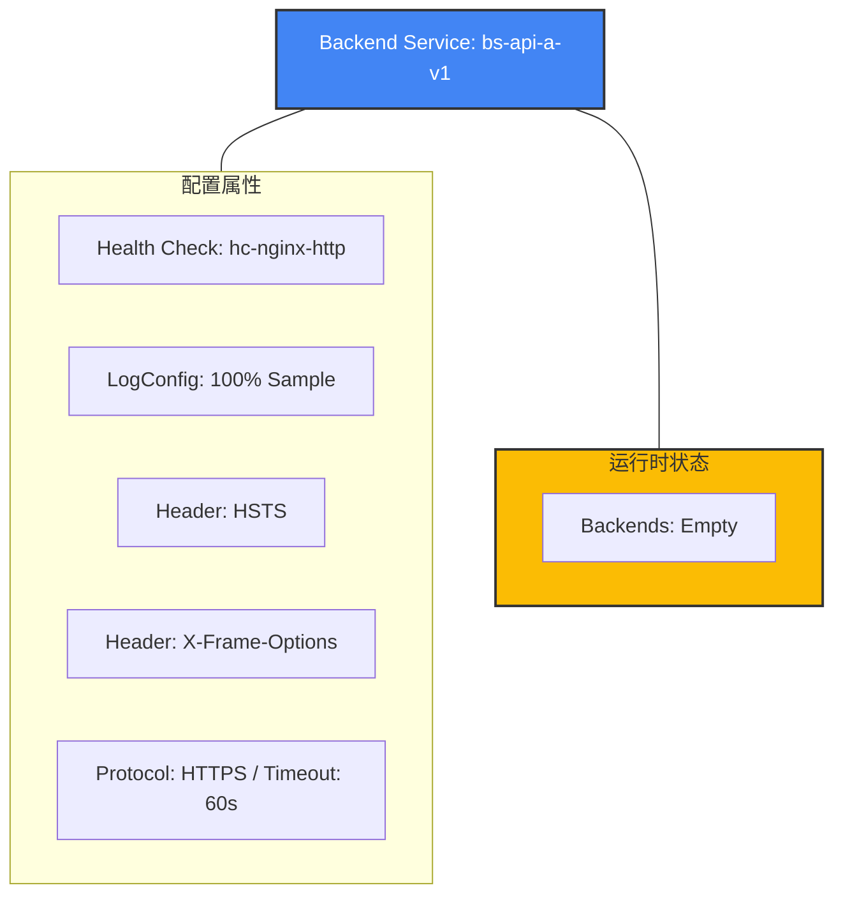

```bash
# 验证通过：可以在一条命令中完成绝大部分配置
gcloud compute backend-services create bs-api-a-v1 \
    --global \
    --protocol=HTTPS \
    --port-name=https \
    --load-balancing-scheme=EXTERNAL_MANAGED \
    --health-checks=hc-nginx-http \
    --connection-draining-timeout=300s \
    --timeout=60s \
    --enable-logging \
    --logging-sample-rate=1.0 \
    --custom-response-header="Strict-Transport-Security: max-age=31536000; includeSubDomains: preload" \
    --custom-response-header="X-Frame-Options: DENY"  \
    --description="Backend Service for API A V1" \
    --project=your-project
```
GCP 的机制是：只要 URL Map 的名字没变，Target Proxy 会自动感知到其内部规则（Host/Path）的变化，无需再次执行 target-https-proxies update

gcloud 参数

| gcloud | gcp api |
|---|---|
| --enable-logging | logConfig.enable = true |
| --logging-sample-rate=1.0 | sampleRate = 1.0 |
| --logging-optional-mode=EXCLUDE_ALL_OPTIONAL | optionalMode = EXCLUDE_ALL_OPTIONAL |
| *(Default)* | connectionDraining.drainingTimeoutSec = 300 | **默认值**。未指定 `--connection-draining-timeout` 时，GCP 默认为 300秒 (5分钟)。 |
执行完该 `create` 命令后，Google Cloud 会返回该资源的 **YAML 格式描述**（如果你是在控制台或脚本中查看，或者执行 
`gcloud compute backend-services describe bs-api-a-v1 --global`）。

以下是根据你提供的参数生成的**预期输出结果**。通过这个输出，你可以验证所有配置（特别是日志模式和自定义 Header）是否生效。

### 预期输出结果 (YAML 格式)

YAML

```yaml
connectionDraining:
  drainingTimeoutSec: 300
creationTimestamp: '2023-10-27T01:02:03.456-07:00'
customResponseHeaders:
- 'Strict-Transport-Security: max-age=31536000; includeSubDomains: preload'
- 'X-Frame-Options: DENY'
description: 'Backend Service for API A V1'
enableCDN: false
fingerprint: xxxxxxxx_xxx=
healthChecks:
- https://www.googleapis.com/compute/v1/projects/your-project/global/healthChecks/hc-nginx-http
iap:
  enabled: false
id: '1234567890123456789'
kind: compute#backendService
loadBalancingScheme: EXTERNAL_MANAGED
logConfig:
  enable: true
  sampleRate: 1.0
name: bs-api-a-v1
portName: https
protocol: HTTPS
selfLink: https://www.googleapis.com/compute/v1/projects/your-project/global/backendServices/bs-api-a-v1
timeoutSec: 60
```

---

### 关键字段深度核对

|**字段**|**状态**|**专家点评**|
|---|---|---|
|**`customResponseHeaders`**|包含 HSTS 和 X-Frame-Options|确认多个安全 Header 已成功注入，增强了响应安全性。|
|**`connectionDraining`**|`300`|确认连接排空时间已设为 5 分钟（来自显式指定或默认值）。|
|**`timeoutSec`**|`60`|确认后端超时时间已更新为 60秒，比之前的 30秒更宽松。|
|**`protocol`/`portName`**|`HTTPS` / `https`|确认已切换为全链路 HTTPS 加密通信模式。|
|**`loadBalancingScheme`**|`EXTERNAL_MANAGED`|确认这是一个 Envoy-based 的新型负载均衡器。|
|**`backends`**|**(缺失)**|**注意**：由于刚执行完 `create`，此列表目前为空。|

---

### 资源层次结构图

Code snippet



---

### 注意事项与后续检查

1. **验证 Backends**：当你执行完 `add-backend` 命令后，再次执行 `describe`，你会看到多出一个 `backends` 段落，包含 `group` (MIG 的 URL) 和 `balancingMode`。
    
2. **Fingerprint (指纹)**：在 YAML 中看到的 `fingerprint` 非常重要。如果你之后使用 API 或 Terraform 修改该资源，必须提供当前的指纹以防止并发冲突。
    
3. **Timeout**：请确保 `timeoutSec: 30` 覆盖了你后端 Nginx 处理请求的最长预期时间，否则 LB 会主动断开连接。
    

**您想尝试执行 `add-backend` 命令，并查看添加完实例组后的 `describe` 输出有什么变化吗？**

---

### 进阶话题：URL Map 复用策略 (架构决策)

在配置 URL Map 时，您可能会问：**"我是应该直接修改现有的 URL Map，还是新建一个？"**

基于您的场景（**单域名** `www.abc.com` + **现有业务在线**），**强烈建议：复用（修改）同一个 URL Map 对象。**

#### 1. 为什么必须“复用”（逻辑上）
因为流量入口（Target Proxy -> IP）只能指向 **一个** 激活的 URL Map。只要您的所有 API 都挂在同一个域名下，它们就必须被配置在同一个 URL Map 规则树里。

#### 2. 操作策略对比：如何"复用"？

| 策略 | **方案 A：直接复用 (In-Place Update)** | **方案 B：影子切换 (Blue/Green Switch)** |
| :--- | :--- | :--- |
| **定义** | 直接修改运行中的 URL Map 对象 | 新建一个 v2 版本的 URL Map，然后原子切换 Proxy 指向 |
| **操作命令** | `gcloud compute url-maps import 现有Map名 ...` | 1. 创建 `url-map-v2`<br>2. `gcloud compute target-https-proxies update --url-map=url-map-v2` |
| **优点** | **简单快速**。一步到位，无需操作 Proxy。文档中采用此方案。 | **绝对安全**。新配置如有语法错误不会影响线上。支持原子回滚。 |
| **缺点** | 如果配置写错（如弄丢默认路由），直接影响线上。 | 操作步骤多，维护成本稍高。 |
| **推荐场景** | **研发测试 / 允许秒级抖动 / 自信的配置变更** | **SRE 标准生产环境 / 重大架构重构** |

👉 **结论**：本指南采用 **方案 A (In-Place Update)**，因为通过 `import` 命令导入经过验证的 YAML 文件通常足够安全且效率最高。


---

# GCP GLB 路由安全架构：深度解析 "All unmatched" 机制

在 GCP 控制台的 **Load Balancing -> Host and path rules** 页面中，`All unmatched (default)` 是一个经常被误解但在安全架构中至关重要的概念。以下是基于“金融级安全防护”标准的深度解析与配置指南。

## 1. 配置全景图 (Console View)

在控制台中，一个标准的、安全的规则矩阵应该如下所示：

| 优先级 | Hosts (域名层) | Paths (路径层) | 后端服务 (Backend Service) | 安全角色 |
| :--- | :--- | :--- | :--- | :--- |
| 1 | `www.abc.com` | `/payment/*` | `payment-backend-service` | **核心业务 (高敏)** |
| 2 | `www.abc.com` | `/user/*` | `user-backend-service` | **用户业务 (中敏)** |
| 3 | `www.abc.com` | **All unmatched** | `public-backend-service` | **路径兜底 (分流)** |
| **底线** | **All unmatched**| **All unmatched** | `bs-deny-all` (拦截黑洞) | **全域兜底 (防扫描)** |

---

## 2. 二层防护界限：Host-level vs Path-level

这两个兜底规则虽然名字相似，但有着截然不同的**生效维度**。

### A. 第一层：Host-level (域名级入口)
*   **触发场景**：当请求的 `Host` 头部不匹配任何已定义域名时（例如：通过 IP 直接访问、恶意域名解析）。
*   **安全职责**：**守大门**。防止“域前置 (Domain Fronting)”攻击，确保未授权域名无法触达你的任何业务逻辑。
*   **技术点**：对应 URL Map 资源根层级的 `defaultService`，是系统的**强制必填项**。

### B. 第二层：Path-level (路径级分流)
*   **触发场景**：当域名匹配正确（如 `www.abc.com`），但访问了未定义或错误的路径（如 `/wp-admin` 等探测路径）。
*   **安全职责**：**守走廊**。防止合法域名下的目录扫描，确保非法请求不会误入敏感后端。
*   **技术点**：对应特定 `pathMatcher` 内部的 `defaultService`。

---

## 3. 安全架构决策：为什么“删除”不是方案？

> [!IMPORTANT]
> **安全核心逻辑：在七层代理中，“显式路由”才是实现拒绝的唯一手段。**

### 为什么不能删掉这项配置？
1.  **技术强制性**：GCP URL Map 必须保证所有进入 LB 的流量都有明确去向，否则会导致处理异常。
2.  **安全黑洞预防**：缺失兜底规则会导致不可预测的流量进入 LB 默认选择的第一个后端，造成安全缺口。

### 如何实现“绝对拦截” (Block by Routing)？
如果您想实现“除了我的域名，谁也别进来”的效果，科学做法是：

1.  **建立拦截黑洞**：创建一个专门的 `bs-deny-all`（不挂载任何实例）。
2.  **默认拦截策略**：为 `Host: All unmatched` 指向这个后端。
3.  **Cloud Armor 斩断**：为该后端绑定一个 Action 为 `Deny 403` 的策略。

---

## 总结：你的“安全绳”

**"All unmatched (default)" 并不是为了给非法请求开门，而是为了把它们“抓起来处理”。**

*   **Host-level** 保证了请求来源的合法性。
*   **Path-level** 保证了业务访问的合规性。

通过将这两个层级的兜底规则统一导向受控的拦截点，您在 GLB 上就建立了一套完美的 **Default Deny (默认拒绝)** 体系。这不仅能有效拦截恶意流量，还能为您提供清晰的扫描和渗透审计日志。

