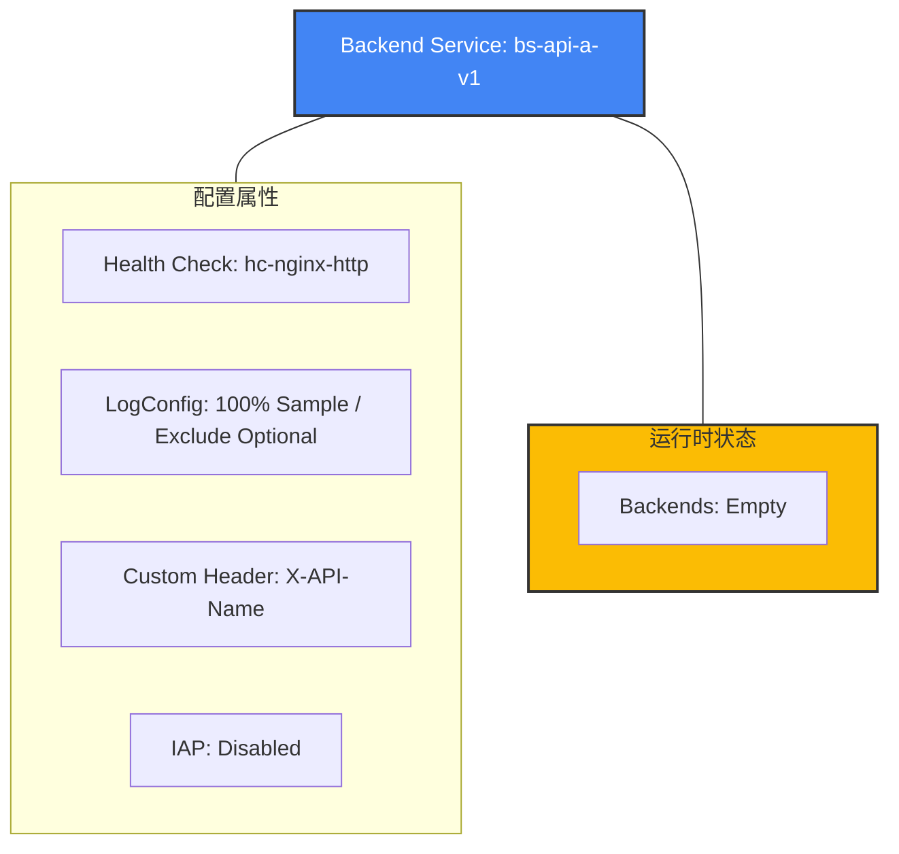

```bash
# 验证通过：可以在一条命令中完成绝大部分配置
gcloud compute backend-services create bs-api-a-v1 \
    --global \
    --protocol=HTTP \
    --load-balancing-scheme=EXTERNAL_MANAGED \
    --health-checks=hc-nginx-http \
    --timeout=30s \
    --enable-logging \
    --logging-sample-rate=1.0 \
    --logging-optional-mode=exclude-all-optional \
    --custom-response-header="X-API-Name: api-a-v1" \
    --no-iap
```

gcloud 参数

| gcloud | gcp api |
|---|---|
| --enable-logging | logConfig.enable = true |
| --logging-sample-rate=1.0 | sampleRate = 1.0 |
| --logging-optional-mode=EXCLUDE_ALL_OPTIONAL | optionalMode = EXCLUDE_ALL_OPTIONAL |
| *(Default)* | connectionDraining.drainingTimeoutSec = 300 | **默认值**。未指定 `--connection-draining-timeout` 时，GCP 默认为 300秒 (5分钟)。 |
执行完该 `create` 命令后，Google Cloud 会返回该资源的 **YAML 格式描述**（如果你是在控制台或脚本中查看，或者执行 `gcloud compute backend-services describe bs-api-a-v1 --global`）。

以下是根据你提供的参数生成的**预期输出结果**。通过这个输出，你可以验证所有配置（特别是日志模式和自定义 Header）是否生效。

### 预期输出结果 (YAML 格式)

YAML

```yaml
connectionDraining:
  drainingTimeoutSec: 300
creationTimestamp: '2023-10-27T01:02:03.456-07:00'
customResponseHeaders:
- 'X-API-Name: api-a-v1'
description: ''
enableCDN: false
fingerprint: xxxxxxxx_xxx=
healthChecks:
- https://www.googleapis.com/compute/v1/projects/your-project/global/healthChecks/hc-nginx-http
iap:
  enabled: false
id: '1234567890123456789'
kind: compute#backendService
loadBalancingScheme: EXTERNAL_MANAGED
logConfig:
  enable: true
  optionalMode: EXCLUDE_ALL_OPTIONAL
  sampleRate: 1.0
name: bs-api-a-v1
port: 80
portName: http
protocol: HTTP
selfLink: https://www.googleapis.com/compute/v1/projects/your-project/global/backendServices/bs-api-a-v1
timeoutSec: 30
```

---

### 关键字段深度核对

|**字段**|**状态**|**专家点评**|
|---|---|---|
|**`customResponseHeaders`**|列表格式显示|确认 Header 已成功注入，多个 Header 会在此处列出。|
|**`logConfig.optionalMode`**|`EXCLUDE_ALL_OPTIONAL`|**这是最重要的验证点**。这证明了你的日志优化策略已生效，不会记录冗余的 optional 字段。|
|**`loadBalancingScheme`**|`EXTERNAL_MANAGED`|确认这是一个 Envoy-based 的新型负载均衡器，支持高级流量管理。|
|**`iap.enabled`**|`false`|确认 Identity-Aware Proxy 已显式关闭。|
|**`backends`**|**(缺失)**|**注意**：由于你刚执行完 `create` 尚未执行 `add-backend`，此列表目前为空。|

---

### 资源层次结构图

Code snippet



---

### 注意事项与后续检查

1. **验证 Backends**：当你执行完 `add-backend` 命令后，再次执行 `describe`，你会看到多出一个 `backends` 段落，包含 `group` (MIG 的 URL) 和 `balancingMode`。
    
2. **Fingerprint (指纹)**：在 YAML 中看到的 `fingerprint` 非常重要。如果你之后使用 API 或 Terraform 修改该资源，必须提供当前的指纹以防止并发冲突。
    
3. **Timeout**：请确保 `timeoutSec: 30` 覆盖了你后端 Nginx 处理请求的最长预期时间，否则 LB 会主动断开连接。
    

**您想尝试执行 `add-backend` 命令，并查看添加完实例组后的 `describe` 输出有什么变化吗？**