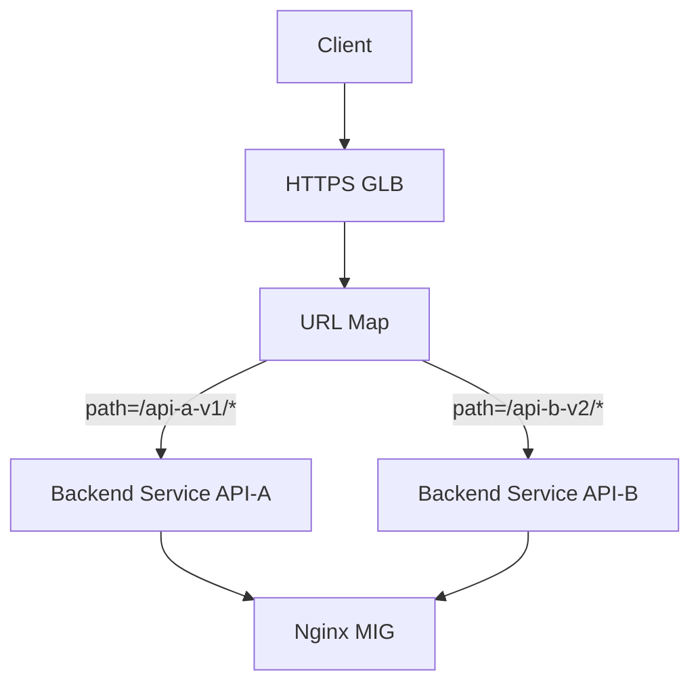
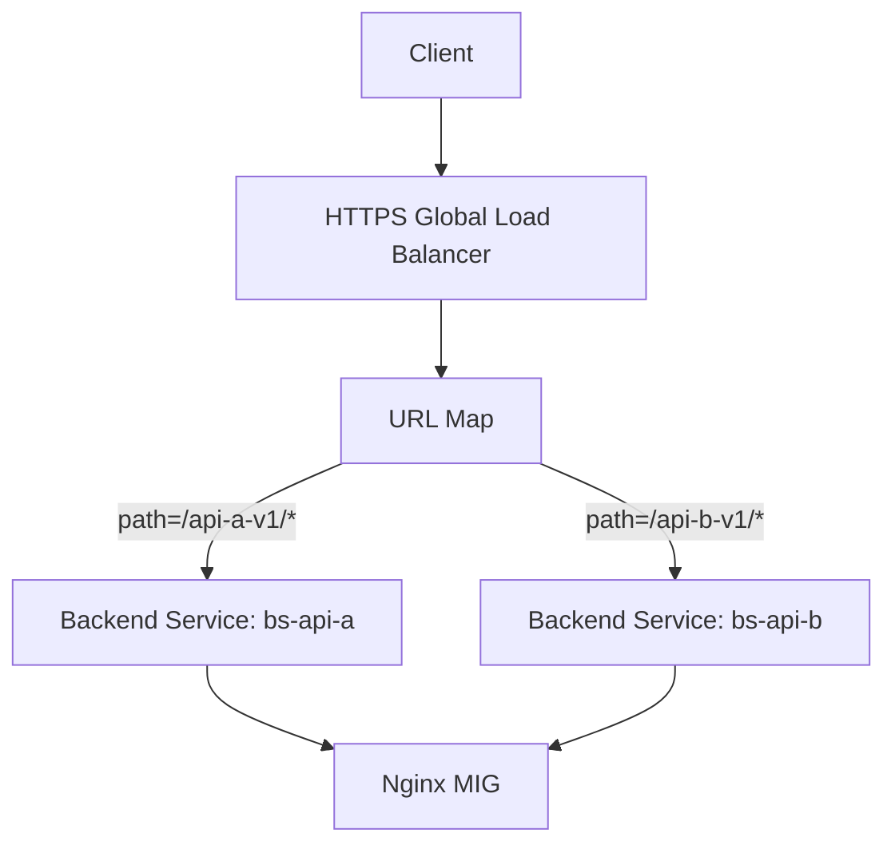

# GCP API 平台中实现「按 API 维度」Cloud Armor 策略的可行方案分析

## 1. 问题分析

当前架构核心特征：

- **统一入口域名**

<https://www.abc.com/{api-name}-{major-version}/{endpoint}>

- **入口链路**

Client → GCP GLB (HTTPS) → Nginx (MIG) → 后端服务

- **Cloud Armor 绑定方式**
  - Cloud Armor Policy 绑定在 **GLB Backend Service**
  - 当前 **Nginx 所在 MIG 共用一个 Backend Service**
  - ⇒ **所有 API 共享同一套 Cloud Armor Policy**

核心诉求：

> **希望不同 API 使用不同的 Cloud Armor 安全策略**
>
> 不限制是否需要对现有架构做调整

---

## 2. Cloud Armor 的关键约束（必须先认清）

Cloud Armor 的 **绑定粒度** 决定了可行方案的上限：

| 维度 | 是否支持 |
|---|---|
| 绑定到 URL Path | ❌ 不支持 |
| 绑定到 Host | ❌ 不支持 |
| 绑定到 Backend Service | ✅ 支持 |
| Policy 内按 Path 匹配 | ✅（L7 Rule） |
| 多 Policy 同时作用于一个 Backend | ❌ |

👉 **结论一句话**：
> **要想"真正隔离"的 Cloud Armor 策略，只能靠拆 Backend Service**

---

## 3. 方案总览（从「最小改造」到「最强隔离」）

| 方案 | 改造成本 | 隔离级别 | 推荐指数 |
|---|---|---|---|
| 方案 A：单 Policy + Path 规则 | ⭐ | 逻辑隔离 | ⭐⭐ |
| 方案 B：多 Backend Service（同一 Nginx） | ⭐⭐ | API 级隔离 | ⭐⭐⭐⭐ |
| 方案 C：按 API 拆 Nginx / MIG | ⭐⭐⭐ | 强隔离 | ⭐⭐⭐⭐⭐ |
| 方案 D：GLB → Kong / Envoy（API Gateway 化） | ⭐⭐⭐⭐ | 平台级 | ⭐⭐⭐⭐ |

---

## 4. 方案 A：**单 Cloud Armor Policy，按 API Path 区分规则（最小改造）**

### 4.1 思路

- 继续使用 **一个 Backend Service**
- 在 **同一个 Cloud Armor Policy** 中：
  - 按 API Path 编写规则
  - 每个 API 对应一组 rule priority

### 4.2 示例规则逻辑

```text
Priority 1000
if request.path.startsWith("/api-a-v1/")
allow only CIDR A
else if request.path.startsWith("/api-b-v2/")
rate_limit 100 rps
else
allow
```

### 4.3 优点 / 缺点

**优点**
- 不改架构
- 实施最快

**缺点（致命）**
- ❌ 不是强隔离
- ❌ API 规则互相影响
- ❌ Policy 规模大后不可维护
- ❌ 无法授权给 API Owner 自治

📌 适合场景
- API 数量少
- 安全策略差异不大
- 临时过渡方案

---

## 5. 方案 B（⭐推荐）：按 API 拆 Backend Service，但复用 Nginx

### 5.1 核心思想（非常重要）

Cloud Armor 是绑 Backend Service 的，而不是绑 Nginx 的

所以可以做到：
- 同一组 Nginx 实例（同一个 MIG）
- 多个 Backend Service
- 每个 Backend Service 绑定不同 Cloud Armor Policy
- GLB URL Map 按 Path 分发

---

### 5.2 架构示意



---

### 5.3 关键配置点

#### 1️⃣ URL Map（Path-based Routing）

```
/api-a-v1/* → backend-service-api-a
/api-b-v2/* → backend-service-api-b
```

#### 2️⃣ Backend Service

| Backend Service | Cloud Armor |
|---|---|
| backend-service-api-a | policy-api-a |
| backend-service-api-b | policy-api-b |

#### 3️⃣ Nginx
- 无需感知 Cloud Armor
- 继续按原有方式 proxy_pass

---

### 5.4 优点 / 缺点

**优点**
- ✅ API 级别 Cloud Armor 隔离
- ✅ Nginx 不拆
- ✅ 成本可控
- ✅ 符合 GCP 原生设计

**缺点**
- Backend Service 数量增加
- Terraform / 管理复杂度上升

📌 这是大多数 API 平台的最佳实践

---

## 6. 方案 C：按 API 拆 Nginx / MIG（强隔离）

### 6.1 思路

- API-A → 独立 Nginx MIG → Backend Service A → Policy A
- API-B → 独立 Nginx MIG → Backend Service B → Policy B

### 6.2 适合什么情况？
- API 安全等级差异巨大
- 某些 API 是：
  - Partner API
  - 金融 / 高合规
  - 高攻击风险

### 6.3 代价
- 成本显著增加
- 运维复杂度上升

---

## 7. 方案 D：GLB + API Gateway / Kong / Envoy（平台演进方向）

如果你们已经在用 Kong（你们确实在用），这是一个非常现实的演进方向：

### 7.1 架构演进

```
Client
  ↓
GCP HTTPS GLB
  ↓（Cloud Armor：基础防护）
Kong Gateway
  ↓
API Services
```

### 7.2 职责分离

| 层 | 职责 |
|---|---|
| Cloud Armor | L3/L4/L7 基础防护 |
| Kong | API 级 Auth / Rate Limit / ACL |
| 后端 | 业务 |

📌 Cloud Armor 不做"API 逻辑安全"，只做"入口防护"

---

## 8. 推荐结论（给你一个清晰答案）

✅ 最优落地方案

**方案 B：按 API 拆 Backend Service + 独立 Cloud Armor Policy**

原因：
- 不破坏现有入口
- 不强依赖 Nginx 改造
- 符合 GCP 官方设计哲学
- 为未来平台化（Kong / Gateway）留足空间

---

## 9. 下一步如果你愿意

我可以继续帮你：
- 给你 完整 URL Map + Backend Service + Armor 的 Terraform 模板
- 帮你设计 Cloud Armor Rule Priority 规划规范
- 讨论 哪些规则应该留在 Cloud Armor，哪些应该下沉到 Kong
- 对比 Cloud Armor vs Kong Plugin 的边界设计

你现在更倾向 "快速落地" 还是 "平台级长期演进"？

---

# 基于 GCP GLB 的「按 API 维度」Cloud Armor 隔离方案（URL Map + 多 Backend Service + 共享 MIG）

## 1. 方案目标回顾

在 **统一入口域名** 的前提下：

<https://www.abc.com/{api-name}-{major-version}/{endpoint}>

实现能力目标：

- ✅ 不同 API 使用 **不同的 Cloud Armor Policy**
- ✅ **Nginx / 应用零改动**
- ✅ 仍然使用 **单一 Instance Group (MIG)**
- ✅ 完全基于 **GCP 原生 GLB 能力**

---

## 2. 核心设计原则（非常关键）

### 2.1 Cloud Armor 的绑定事实

| 对象 | 是否可绑定 Cloud Armor |
|---|---|
| URL Map | ❌ |
| Path Rule | ❌ |
| Instance Group | ❌ |
| **Backend Service** | ✅ |

👉 **因此：API 级隔离 = Backend Service 级隔离**

---

## 3. 核心架构逻辑拆解

### 3.1 组件职责划分

| 组件 | 职责 |
|---|---|
| URL Map | 按 Path 分发流量 |
| Backend Service | Cloud Armor 的隔离边界 |
| MIG (Nginx) | 实际承载流量的计算资源 |
| Cloud Armor Policy | API 专属安全策略 |

---

## 4. 架构示意图



---

## 5. 关键配置细化

### 5.1 URL Map：Path-based Routing

**核心原则：**

URL Map 只负责「流量去哪」，不关心「安全策略」

**示例逻辑：**

```
/api-a-v1/* → bs-api-a
/api-b-v1/* → bs-api-b
```

即使后端是同一个 MIG，GLB 仍然会按 Backend Service 维度套用不同 Armor Policy。

---

### 5.2 Backend Service：隔离的关键点

创建多个 Backend Service：

| Backend Service | 指向的 MIG | Cloud Armor |
|---|---|---|
| bs-api-a | nginx-mig | policy-api-a |
| bs-api-b | nginx-mig | policy-api-b |

**重要说明：**
- ✅ 允许多个 Backend Service 指向同一个 MIG
- ✅ Cloud Armor 在 Backend Service 层生效
- ❌ Cloud Armor 不会"合并"策略

---

### 5.3 Cloud Armor Policy：API 专属

**示例设计思路：**

**policy-api-a（Partner / 高敏 API）**
- IP Allowlist
- 严格 Rate Limit
- Geo Restriction

**policy-api-b（内部 / 普通 API）**
- 宽松 Rate Limit
- 基础 WAF 规则

---

## 6. 请求流转的真实执行顺序（非常重要）

1. Client 发起 HTTPS 请求
2. GLB 终止 TLS
3. URL Map 根据 Path 匹配 Backend Service
4. Cloud Armor Policy（绑定在 BS 上）执行
5. 请求转发至 Nginx MIG
6. Nginx proxy_pass 到后端

👉 结论：
Cloud Armor 在 Nginx 之前生效，完全不依赖 Nginx 配置。

---

## 7. 为什么这是「标准 + 优雅」的设计？

### 7.1 解耦性（核心价值）
- API A 的安全策略变更：
  - ❌ 不影响 API B
  - ❌ 不需要理解 Nginx
  - ❌ 不需要应用配合

---

### 7.2 与 GCP 官方设计哲学一致

GCP 官方推荐模式：

```
URL Map → Backend Service → Security Policy
```

而不是：

```
URL Map → 一堆复杂安全逻辑
```

---

### 7.3 对平台演进非常友好

**未来演进路径：**

**今天：**
```
GLB → Nginx → Kong → API
```

**未来：**
```
GLB (Armor: 基础防护)
  ↓
Kong (API 级安全 / Auth / Quota)
```

这套拆法不会成为技术债。

---

## 8. 运维与治理建议（经验型）

### 8.1 Backend Service 命名规范（强烈建议）

```
bs-{api-name}-{major-version}
policy-{api-name}-{major-version}
```

**示例：**

```
bs-order-v1
policy-order-v1
```

---

### 8.2 Cloud Armor Policy 设计原则

| 规则类型 | 建议 |
|---|---|
| IP / Geo | Cloud Armor |
| DDoS / WAF | Cloud Armor |
| Auth / Quota | Kong |
| API Key / JWT | Kong |

---

## 9. 风险与注意事项

### 9.1 Backend Service 数量增长
- API 数量多 → BS 数量多
- 建议：
  - Terraform 管理
  - 模块化定义

---

### 9.2 Path 规划必须稳定
- Path 是「策略绑定的锚点」
- 不建议：
  - 频繁变更 api-name / version
  - 模糊匹配过宽

---

## 10. 总结一句话版本（给领导 / 评审用）

通过 GLB 的 URL Map 将不同 API Path 映射到不同 Backend Service，即可在不改 Nginx 的前提下，为每个 API 绑定独立的 Cloud Armor Policy，实现原生、解耦、可扩展的安全隔离方案。

---

## 11. 下一步我可以继续帮你

- 输出 Terraform 完整模板（URL Map + BS + Armor）
- 帮你设计 API / Policy 生命周期管理模型
- 帮你评估 哪些 API 值得独立 Policy，哪些可以合并
- 深入讨论 Cloud Armor vs Kong 的边界

你更想继续 落 Terraform，还是先 做平台安全分层设计？


