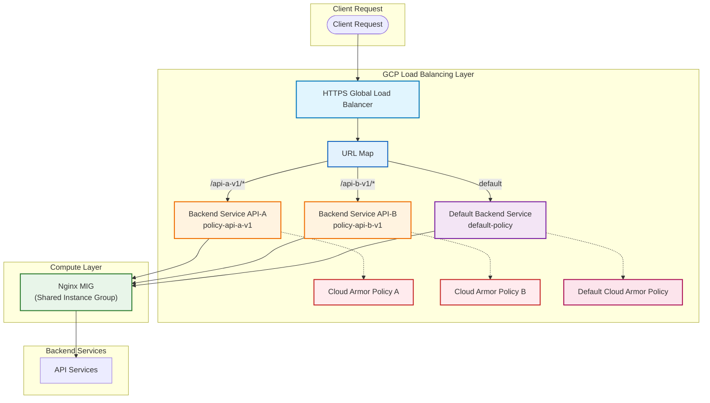

# GCP GLB API-Level Cloud Armor Isolation Solution Analysis and Implementation Guide

## 1. Current State Analysis

### 1.1 Current Architecture
- **Architecture**: GCP GLB (HTTPS) → Backend Service (Unified) → MIG (Nginx)
- **Traffic Model**: `https://www.abc.com/api-name-major-version/endpoint`
- **Current Limitation**: All APIs share the same Backend Service, causing all APIs to use the same Cloud Armor WAF rules, preventing differentiated protection.

### 1.2 Core Issues
- **Unified Policy**: All APIs share the same Cloud Armor Policy, unable to implement differentiated security policies for different APIs
- **Policy Conflicts**: High-security APIs and low-security APIs have conflicting policy requirements
- **Operational Difficulties**: Unable to independently manage security policies for different APIs

### 1.3 Cloud Armor Constraints
According to GCP documentation and practical verification, Cloud Armor binding granularity is as follows:

| Binding Dimension | Support Status | Description |
|---|---|---|
| Bind to URL Path | ❌ Not Supported | Cannot bind policies directly by path |
| Bind to Host | ❌ Not Supported | Cannot bind policies directly by hostname |
| Bind to Backend Service | ✅ Supported | Basic unit for policy binding |
| Policy matching by Path | ✅ Supported | Implemented through L7 rules |
| Multiple Policies acting on one Backend | ❌ Not Supported | One Backend Service can only bind one policy |

## 2. Solution Feasibility Verification

### 2.1 Solution Overview
**Recommended Solution**: Use URL Map + Multiple Backend Services + Independent Cloud Armor Policies to achieve API-level security policy isolation

### 2.2 Feasibility Analysis
✅ **Technical Feasibility**:
- GCP GLB supports URL Map routing to different Backend Services by path
- The same MIG can be referenced by multiple Backend Services
- Each Backend Service can bind an independent Cloud Armor Policy

✅ **Architectural Compatibility**:
- No need to modify Nginx configuration
- No need to modify applications
- Preserve existing infrastructure

✅ **Operational Feasibility**:
- Policies completely isolated, no mutual interference
- Support independent management and updates
- Facilitate troubleshooting and monitoring

### 2.3 Solution Advantages
- **Decoupling**: Security policies for different APIs are completely isolated
- **Flexibility**: Customize security policies for different APIs
- **Scalability**: Support rapid expansion when adding new APIs
- **Zero Intrusion**: No impact on existing systems

## 3. Detailed Implementation Plan

### 3.1 Overall Architecture Flow Diagram



### 3.2 Implementation Steps

#### Step 1: Create Independent Cloud Armor Policies

Create independent Cloud Armor policies for each API:

```bash
# Create policy for API A
gcloud compute security-policies create policy-api-a-v1 \
  --description="Cloud Armor policy for API A v1"

# Create policy for API B
gcloud compute security-policies create policy-api-b-v1 \
  --description="Cloud Armor policy for API B v1"

# Add custom rules (example)
# API A: IP Whitelist
gcloud compute security-policies rules create 1000 \
  --security-policy=policy-api-a-v1 \
  --expression="origin.ip=='203.0.113.0'" \
  --action=allow

# API A: Default Deny
gcloud compute security-policies rules create 2147483647 \
  --security-policy=policy-api-a-v1 \
  --action=deny-403
```

#### Step 2: Create New Backend Services

Create multiple Backend Services, all pointing to the same Nginx MIG:

```bash
# Create Backend Service for API A
gcloud compute backend-services create bs-api-a-v1 \
  --protocol=HTTP \
  --port-name=http \
  --health-checks=nginx-health-check \
  --global

# Add Nginx MIG as backend
gcloud compute backend-services add-backend bs-api-a-v1 \
  --instance-group=nginx-mig \
  --global \
  --balancing-mode=UTILIZATION \
  --max-utilization=0.8 \
  --capacity-scaler=1.0

# Bind Cloud Armor policy
gcloud compute backend-services update bs-api-a-v1 \
  --security-policy=policy-api-a-v1 \
  --global
```

#### Step 3: Update URL Map Configuration

Configure URL Map to route different paths to corresponding Backend Services:

```bash
# Add path matcher
gcloud compute url-maps add-path-matcher your-url-map \
  --path-matcher-name=api-splitter \
  --default-service=default-backend-service \
  --path-rules="/api-a-v1/*=bs-api-a-v1,/api-b-v1/*=bs-api-b-v1" \
  --global
```

### 3.3 Request Processing Flow

1. **Client Request**: `https://www.abc.com/api-a-v1/users`
2. **GLB Reception**: HTTPS Global Load Balancer receives the request
3. **URL Map Routing**: Route based on path `/api-a-v1/*` to `bs-api-a-v1`
4. **Cloud Armor Execution**: Execute `policy-api-a-v1` policy on `bs-api-a-v1`
5. **Forward to MIG**: Request forwarded to shared Nginx MIG
6. **Nginx Processing**: Nginx processes request according to original logic
7. **Response Return**: Response returns via reverse path to client

### 3.4 Verification Methods

#### Functional Verification
```bash
# Verify if API A path applies the correct policy
curl -I "https://www.abc.com/api-a-v1/health"

# Check security policy information in response headers
# Should see response from policy-api-a-v1
```

#### Policy Verification
```bash
# Check policy bound to Backend Service
gcloud compute backend-services describe bs-api-a-v1 --global

# Check Cloud Armor logs
gcloud logging read "resource.type=http_load_balancer AND jsonPayload.enforcedSecurityPolicy.name=policy-api-a-v1" --limit 10
```

## 4. Operations and Management Recommendations

### 4.1 Naming Convention
```
Backend Service: bs-{api-name}-{version}
Cloud Armor Policy: policy-{api-name}-{version}
```

### 4.2 Policy Design Principles
| Rule Type | Recommended Location |
|---|---|
| IP Address Whitelist/Blacklist | Cloud Armor |
| DDoS Protection | Cloud Armor |
| WAF Rules | Cloud Armor |
| API Key Authentication | Kong/Apache/Nginx |
| JWT Validation | Kong/Apache/Nginx |
| Rate Limiting | Kong or Cloud Armor |

### 4.3 Monitoring and Alerting
- Monitor interception rates of each Cloud Armor policy
- Set alerts based on error rates
- Monitor health status of Backend Services

## 5. Risks and Considerations

### 5.1 Potential Risks
- **Backend Service Count Growth**: Increase in API count leads to increase in Backend Service count
- **Configuration Complexity**: Need to manage more resource configurations
- **Path Stability**: Path planning needs to remain stable, avoid frequent changes

### 5.2 Considerations
- Ensure path rules do not overlap or conflict
- Validate in test environment before production implementation
- Prepare rollback plan to handle unexpected situations

## 6. Summary

Through the solution of URL Map + Multiple Backend Services + Independent Cloud Armor Policies, API-level security policy isolation can be achieved without modifying Nginx and applications. This solution fully utilizes the native capabilities of GCP GLB, offering good decoupling and scalability, making it an ideal choice for implementing fine-grained security controls.

This solution not only resolves the issue of all APIs sharing the same security policy, but also provides flexible infrastructure support for future security policy management.